# Banking Process Flows — BIAN Capability Model Reference

> Generated on 2026-07-06 | Domain: Banking | Framework: BIAN (Banking Industry Architecture Network)

## BIAN Capability Model Reference

The BIAN (Banking Industry Architecture Network) Capability Model defines the standard business capabilities for banking institutions. The table below lists all relevant capabilities grouped by domain. Each process flow in this document is mapped to its relevant BIAN capability codes.

### Channels

| Capability | Code | Description |
|-----------|------|-------------|
| **Branch Services** | `BC001` | Manage physical branch operations, teller services, and lobby management |
| **Contact Center** | `BC002` | Operate call center, IVR, and customer service desk |
| **Digital Channels** | `BC003` | Deliver internet banking, mobile banking, and digital self-service |
| **Channel Management** | `BC004` | Orchestrate omnichannel consistency, channel analytics, and channel optimization |

### Finance & Risk Management

| Capability | Code | Description |
|-----------|------|-------------|
| **Financial Accounting** | `BC010` | Manage general ledger, accounts payable/receivable, and financial close |
| **Management Accounting** | `BC011` | Perform cost allocation, profitability analysis, and management reporting |
| **Risk Management** | `BC012` | Identify, assess, monitor, and mitigate credit, market, operational, and liquidity risk |
| **Compliance** | `BC013` | Ensure regulatory compliance, AML/CTF, sanctions screening, and conduct risk |
| **Treasury Management** | `BC014` | Manage liquidity, funding, investments, and interest rate risk |

### Customers

| Capability | Code | Description |
|-----------|------|-------------|
| **Customer Relationship Management** | `BC031` | Manage customer interactions, campaigns, loyalty programs, and relationship lifecycle |
| **Customer Onboarding** | `BC032` | Onboard new customers including identity verification, KYC, and account setup |
| **Customer Due Diligence** | `BC033` | Perform KYC/CDD/EDD checks, risk rating, and ongoing monitoring |
| **Customer Servicing** | `BC034` | Handle customer inquiries, service requests, complaints, and case management |

### Operations

| Capability | Code | Description |
|-----------|------|-------------|
| **Payment Operations** | `BC060` | Execute and manage domestic and cross-border payment instruments |
| **Settlement & Clearing** | `BC061` | Clear and settle payments, securities, and financial transactions |
| **Reconciliation** | `BC062` | Reconcile accounts, transactions, and nostro/vostro positions |
| **Trade Operations** | `BC063` | Process trade finance, letters of credit, and document handling |

### Products

| Capability | Code | Description |
|-----------|------|-------------|
| **Lending** | `BC070` | Originate, service, and manage consumer and mortgage loans |
| **Credit Cards** | `BC071` | Issue, authorize, settle, and manage credit and debit card programs |
| **Deposits** | `BC072` | Manage current accounts, savings accounts, and demand deposits |
| **Term Deposits & Savings** | `BC073` | Manage term deposits, structured savings, and investment products |

### Business Management

| Capability | Code | Description |
|-----------|------|-------------|
| **Strategy Management** | `BC080` | Define corporate strategy, business planning, and performance management |
| **Product Management** | `BC081` | Design, develop, price, and manage banking products throughout lifecycle |
| **Marketing Management** | `BC082` | Plan and execute marketing campaigns, brand management, and market intelligence |

### Resource Management

| Capability | Code | Description |
|-----------|------|-------------|
| **Human Resource Management** | `BC050` | Manage workforce planning, recruitment, performance, and payroll |
| **Training & Development** | `BC051` | Manage employee training, certifications, and competence development |

---

## BIAN Capability Model Reference

The BIAN (Banking Industry Architecture Network) Capability Model defines the standard business capabilities for banking institutions. The table below lists all relevant capabilities grouped by domain. Each process flow in this document is mapped to its relevant BIAN capability codes.

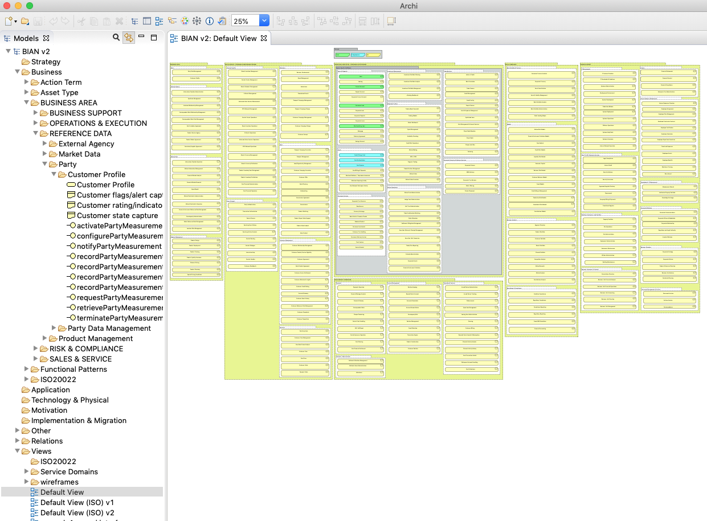

*Source: [Banking Industry Architecture Network (BIAN)](https://bian.org/deliverables/service-landscape/) — BIAN Service Landscape*

### Channels

| Capability | Code | Description |
|-----------|------|-------------|
| **Branch Services** | `BC001` | Manage physical branch operations, teller services, and lobby management |
| **Contact Center** | `BC002` | Operate call center, IVR, and customer service desk |
| **Digital Channels** | `BC003` | Deliver internet banking, mobile banking, and digital self-service |
| **Channel Management** | `BC004` | Orchestrate omnichannel consistency, channel analytics, and channel optimization |

### Finance & Risk Management

| Capability | Code | Description |
|-----------|------|-------------|
| **Financial Accounting** | `BC010` | Manage general ledger, accounts payable/receivable, and financial close |
| **Management Accounting** | `BC011` | Perform cost allocation, profitability analysis, and management reporting |
| **Risk Management** | `BC012` | Identify, assess, monitor, and mitigate credit, market, operational, and liquidity risk |
| **Compliance** | `BC013` | Ensure regulatory compliance, AML/CTF, sanctions screening, and conduct risk |
| **Treasury Management** | `BC014` | Manage liquidity, funding, investments, and interest rate risk |

### Customers

| Capability | Code | Description |
|-----------|------|-------------|
| **Customer Relationship Management** | `BC031` | Manage customer interactions, campaigns, loyalty programs, and relationship lifecycle |
| **Customer Onboarding** | `BC032` | Onboard new customers including identity verification, KYC, and account setup |
| **Customer Due Diligence** | `BC033` | Perform KYC/CDD/EDD checks, risk rating, and ongoing monitoring |
| **Customer Servicing** | `BC034` | Handle customer inquiries, service requests, complaints, and case management |

### Operations

| Capability | Code | Description |
|-----------|------|-------------|
| **Payment Operations** | `BC060` | Execute and manage domestic and cross-border payment instruments |
| **Settlement & Clearing** | `BC061` | Clear and settle payments, securities, and financial transactions |
| **Reconciliation** | `BC062` | Reconcile accounts, transactions, and nostro/vostro positions |
| **Trade Operations** | `BC063` | Process trade finance, letters of credit, and document handling |

### Products

| Capability | Code | Description |
|-----------|------|-------------|
| **Lending** | `BC070` | Originate, service, and manage consumer and mortgage loans |
| **Credit Cards** | `BC071` | Issue, authorize, settle, and manage credit and debit card programs |
| **Deposits** | `BC072` | Manage current accounts, savings accounts, and demand deposits |
| **Term Deposits & Savings** | `BC073` | Manage term deposits, structured savings, and investment products |

### Business Management

| Capability | Code | Description |
|-----------|------|-------------|
| **Strategy Management** | `BC080` | Define corporate strategy, business planning, and performance management |
| **Product Management** | `BC081` | Design, develop, price, and manage banking products throughout lifecycle |
| **Marketing Management** | `BC082` | Plan and execute marketing campaigns, brand management, and market intelligence |

### Resource Management

| Capability | Code | Description |
|-----------|------|-------------|
| **Human Resource Management** | `BC050` | Manage workforce planning, recruitment, performance, and payroll |
| **Training & Development** | `BC051` | Manage employee training, certifications, and competence development |

---

## Table of Contents

- [Customer Onboarding & Account Management  - BC032, BC033, BC031](#customer-onboarding--account-management)
  - [1.1 New Customer Onboarding & KYC](#11-new-customer-onboarding--kyc)
  - [1.2 Retail Account Opening](#12-retail-account-opening)
  - [1.3 Corporate Account Opening](#13-corporate-account-opening)
- [Payments & Transfers  - BC060, BC061](#payments--transfers)
  - [2.1 Domestic Payment (SEPA/ACH)](#21-domestic-payment-sepaach)
  - [2.2 Cross-Border Payment (SWIFT)](#22-cross-border-payment-swift)
  - [2.3 Real-Time Payment (Faster Payments)](#23-real-time-payment-faster-payments)
- [Lending & Credit Management  - BC070](#lending--credit-management)
  - [3.1 Retail Loan Origination](#31-retail-loan-origination)
  - [3.2 Mortgage Lending](#32-mortgage-lending)
  - [3.3 Credit Assessment & Scoring](#33-credit-assessment--scoring)
- [Cards Management  - BC071](#cards-management)
  - [4.1 Card Issuance](#41-card-issuance)
  - [4.2 Card Transaction Processing](#42-card-transaction-processing)
  - [4.3 Card Dispute Management](#43-card-dispute-management)
- [Deposits & Savings Products  - BC072, BC073](#deposits--savings-products)
  - [5.1 Account Operations (Current/Savings)](#51-account-operations-currentsavings)
  - [5.2 Term Deposits](#52-term-deposits)
  - [5.3 Sweep & Investment Products](#53-sweep--investment-products)
- [Risk & Compliance  - BC012, BC013](#risk--compliance)
  - [6.1 Fraud Detection & Prevention](#61-fraud-detection--prevention)
  - [6.2 AML/Sanctions Screening](#62-amlsanctions-screening)
  - [6.3 Regulatory Reporting](#63-regulatory-reporting)
- [Channels & Digital Banking  - BC001, BC003, BC002](#channels--digital-banking)
  - [7.1 Internet Banking](#71-internet-banking)
  - [7.2 Mobile Banking](#72-mobile-banking)
  - [7.3 Branch Banking (Teller)](#73-branch-banking-teller)
- [Finance, Treasury & Settlement  - BC010, BC014, BC061, BC062](#finance-treasury--settlement)
  - [8.1 Nostro/Vostro Reconciliation](#81-nostrovostro-reconciliation)
  - [8.2 Treasury & Liquidity Management](#82-treasury--liquidity-management)
  - [8.3 End-of-Day Settlement](#83-end-of-day-settlement)

## Test Data

The following test data is used consistently across all sequence diagrams:

| Entity | Field | Value |
|--------|-------|-------|
| **Customer** | customer_id | CUST-2026-001 |
| **Customer** | name | Alice Johnson |
| **Customer** | email | alice.j@email.com |
| **Customer** | mobile | +44 7700 900001 |
| **Customer** | dob | 1990-04-15 |
| **Customer** | risk_rating | Low |
| **Account** | account_id | ACCT-4001-2026 |
| **Account** | iban | GB29NWBK60161331926819 |
| **Account** | type | Current Account |
| **Account** | currency | GBP |
| **Account** | balance | 45280.00 |
| **Account** | status | Active |
| **Card** | card_id | CARD-2026-001 |
| **Card** | pan_mask | 4532-XXXX-XXXX-8901 |
| **Card** | type | Debit Mastercard |
| **Card** | expiry | 2029-06 |
| **Card** | cvv | *** |
| **Card** | status | Active |
| **Transaction** | txn_id | TXN-2026-8901 |
| **Transaction** | type | Domestic Transfer |
| **Transaction** | amount | 1250.00 |
| **Transaction** | currency | GBP |
| **Transaction** | timestamp | 2026-07-06T10:30:00Z |
| **Transaction** | status | Completed |
| **Loan** | loan_id | LN-2026-042 |
| **Loan** | type | Personal Loan |
| **Loan** | amount | 25000.00 |
| **Loan** | term_months | 60 |
| **Loan** | interest_rate | 6.9% APR |
| **Loan** | status | Active |
| **Compliance** | case_id | AML-2026-088 |
| **Compliance** | type | Sanctions Screening |
| **Compliance** | severity | Medium |
| **Compliance** | status | Under Review |
| **Beneficiary** | beneficiary_id | BEN-2026-301 |
| **Beneficiary** | name | Bob Smith |
| **Beneficiary** | iban | DE89370400440532013000 |
| **Beneficiary** | bank | Deutsche Bank |

---

# Customer Onboarding & Account Management  - `BC032` `BC033` `BC031`  - `BC032` `BC033` `BC031`

End-to-end lifecycle of customer acquisition, identity verification, account opening, and ongoing relationship management across retail and corporate segments.

### 1.1 New Customer Onboarding & KYC

**Description:** Customer registers via digital channel. System performs identity verification, KYC checks, sanctions screening, risk assessment, and creates customer record.

**Actors:** Customer, Relationship Manager, Compliance Officer  
**Systems:** CRM (Salesforce Financial Services), Digital Onboarding Platform (Backbase), Core Banking (Temenos Transact), Identity Verification (Onfido), Screening (WorldCheck), CIF System

#### Sequence Diagram

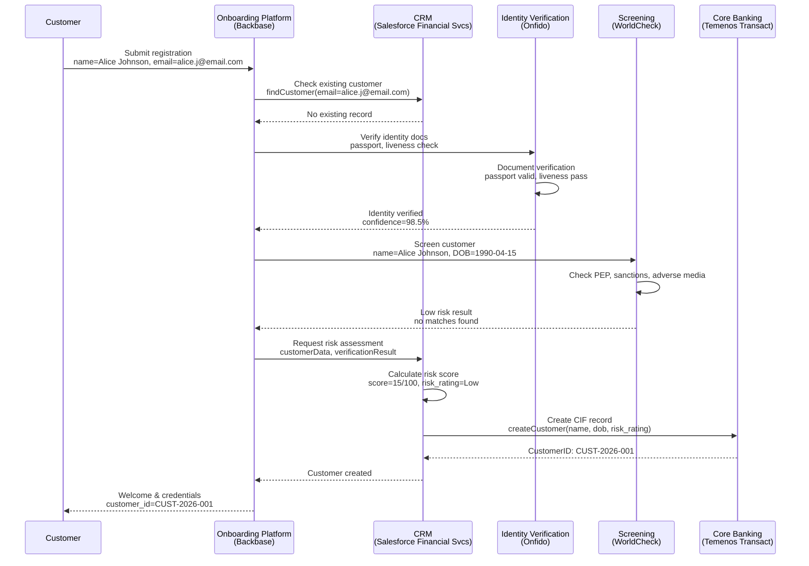
```mermaid
sequenceDiagram
    participant C as Customer
    participant OBP as Onboarding Platform<br/>(Backbase)
    participant CRM as CRM<br/>(Salesforce Financial Svcs)
    participant VER as Identity Verification<br/>(Onfido)
    participant SCR as Screening<br/>(WorldCheck)
    participant CBS as Core Banking<br/>(Temenos Transact)
    C->>OBP: Submit registration<br/>name=Alice Johnson, email=alice.j@email.com
    OBP->>CRM: Check existing customer<br/>findCustomer(email=alice.j@email.com)
    CRM-->>OBP: No existing record
    OBP->>VER: Verify identity docs<br/>passport, liveness check
    VER->>VER: Document verification<br/>passport valid, liveness pass
    VER-->>OBP: Identity verified<br/>confidence=98.5%
    OBP->>SCR: Screen customer<br/>name=Alice Johnson, DOB=1990-04-15
    SCR->>SCR: Check PEP, sanctions, adverse media
    SCR-->>OBP: Low risk result<br/>no matches found
    OBP->>CRM: Request risk assessment<br/>customerData, verificationResult
    CRM->>CRM: Calculate risk score<br/>score=15/100, risk_rating=Low
    CRM->>CBS: Create CIF record<br/>createCustomer(name, dob, risk_rating)
    CBS-->>CRM: CustomerID: CUST-2026-001
    CRM-->>OBP: Customer created
    OBP-->>C: Welcome & credentials<br/>customer_id=CUST-2026-001
```

#### Integration Details

| Flow | Entity | Info Flow | Source | Target | Source Conn | Target Conn | Pattern | Complexity |
|------|--------|-----------|--------|--------|-------------|-------------|---------|------------|
| Customer Onboarding | Customer | CheckExistingCustomer | Onboarding Platform (Backbase) | CRM (Salesforce Financial Services) | Backbase REST API | Salesforce REST API (OAuth2) | API-led (Real-time) | Simple |
| Customer Onboarding | Identity | VerifyDocuments | Onboarding Platform (Backbase) | Identity Verification (Onfido) | Backbase REST API | Onfido API (API Key) | API-led (Real-time) | Medium |
| Customer Onboarding | Sanctions | ScreenCustomer | Onboarding Platform (Backbase) | Screening (WorldCheck) | Backbase REST API | WorldCheck API (SOAP) | API-led (Real-time) | Medium |
| Customer Onboarding | CIF | CreateCustomerRecord | CRM (Salesforce Financial Services) | Core Banking (Temenos Transact) | Salesforce REST API (OAuth2) | Temenos REST API (API Key) | API-led (Real-time) | Medium |

#### Acceptance Criteria

| Flow | Entity | Acceptance Criterion | Expected Outcome |
|------|--------|---------------------|------------------|
| Customer Onboarding | Customer | CheckExistingCustomer returns correct match/no-match for given email | Customer record found or 'no existing record' returned within 2 seconds |
| Customer Onboarding | Identity | Identity documents verified against Onfido document and liveness checks | Passport and liveness pass with >=95% confidence; failure returns clear error |
| Customer Onboarding | Sanctions | Customer screened against WorldCheck PEP/sanctions/adverse media lists | Low risk result with no matches; any match >=90% triggers AML alert |
| Customer Onboarding | CIF | Customer CIF record created in Temenos Transact with all mandatory fields | CustomerID returned and propagated to CRM; non-repudiable audit trail created |

---

### 1.2 Retail Account Opening

**Description:** Customer selects account type, system validates eligibility, opens account in core banking, links digital channels, produces documentation.

**Actors:** Customer, Relationship Manager  
**Systems:** CRM (Salesforce Financial Services), Digital Onboarding Platform (Backbase), Core Banking (Temenos Transact), Card Management (Fiserv), Digital Banking (Backbase)

#### Sequence Diagram

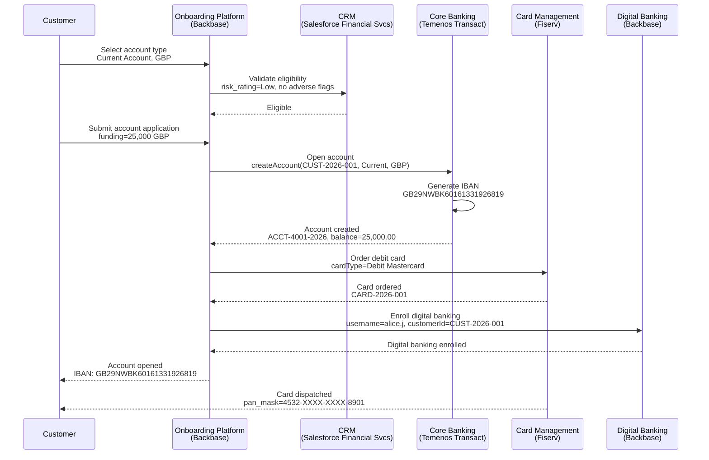
```mermaid
sequenceDiagram
    participant C as Customer
    participant OBP as Onboarding Platform<br/>(Backbase)
    participant CRM as CRM<br/>(Salesforce Financial Svcs)
    participant CBS as Core Banking<br/>(Temenos Transact)
    participant CARD as Card Management<br/>(Fiserv)
    participant DB as Digital Banking<br/>(Backbase)
    C->>OBP: Select account type<br/>Current Account, GBP
    OBP->>CRM: Validate eligibility<br/>risk_rating=Low, no adverse flags
    CRM-->>OBP: Eligible
    C->>OBP: Submit account application<br/>funding=25,000 GBP
    OBP->>CBS: Open account<br/>createAccount(CUST-2026-001, Current, GBP)
    CBS->>CBS: Generate IBAN<br/>GB29NWBK60161331926819
    CBS-->>OBP: Account created<br/>ACCT-4001-2026, balance=25,000.00
    OBP->>CARD: Order debit card<br/>cardType=Debit Mastercard
    CARD-->>OBP: Card ordered<br/>CARD-2026-001
    OBP->>DB: Enroll digital banking<br/>username=alice.j, customerId=CUST-2026-001
    DB-->>OBP: Digital banking enrolled
    OBP-->>C: Account opened<br/>IBAN: GB29NWBK60161331926819
    CARD-->>C: Card dispatched<br/>pan_mask=4532-XXXX-XXXX-8901
```

#### Integration Details

| Flow | Entity | Info Flow | Source | Target | Source Conn | Target Conn | Pattern | Complexity |
|------|--------|-----------|--------|--------|-------------|-------------|---------|------------|
| Account Opening | Eligibility | ValidateEligibility | Onboarding Platform (Backbase) | CRM (Salesforce Financial Services) | Backbase REST API | Salesforce REST API (OAuth2) | API-led (Real-time) | Simple |
| Account Opening | Account | CreateAccount | Onboarding Platform (Backbase) | Core Banking (Temenos Transact) | Backbase REST API | Temenos REST API (API Key) | API-led (Real-time) | Medium |
| Account Opening | Card | OrderDebitCard | Onboarding Platform (Backbase) | Card Management (Fiserv) | Backbase REST API | Fiserv API (SOAP) | API-led (Real-time) | Medium |
| Account Opening | Digital Banking | EnrollUser | Onboarding Platform (Backbase) | Digital Banking (Backbase) | Backbase REST API | Backbase REST API (JWT) | API-led (Real-time) | Simple |

#### Acceptance Criteria

| Flow | Entity | Acceptance Criterion | Expected Outcome |
|------|--------|---------------------|------------------|
| Account Opening | Eligibility | Validate eligibility returns true/false based on customer risk rating and flags | Eligible customers proceed; ineligible customers see reason with appeal path |
| Account Opening | Account | Account created in core banking with correct type, currency, and IBAN generation | IBAN returned, account status=Active, initial balance reflected in <5 seconds |
| Account Opening | Card | Debit card ordered via Fiserv card management system | CardID returned, card status=Ordered, tracking reference provided |
| Account Opening | Digital Banking | Digital banking enrollment created with username linked to customer ID | Login credentials issued; MFA enrollment triggered within 1 minute |

---

### 1.3 Corporate Account Opening

**Description:** Relationship Manager initiates corporate account opening. Company documents verified, beneficial ownership structure captured, multi-signatory setup, account opened.

**Actors:** Relationship Manager, Compliance Officer, Customer (Corporate)  
**Systems:** CRM (Salesforce Financial Services), Document Management (M-Files), Core Banking (Temenos Transact), Screening (WorldCheck), Compliance Case Management (Pega)

#### Sequence Diagram

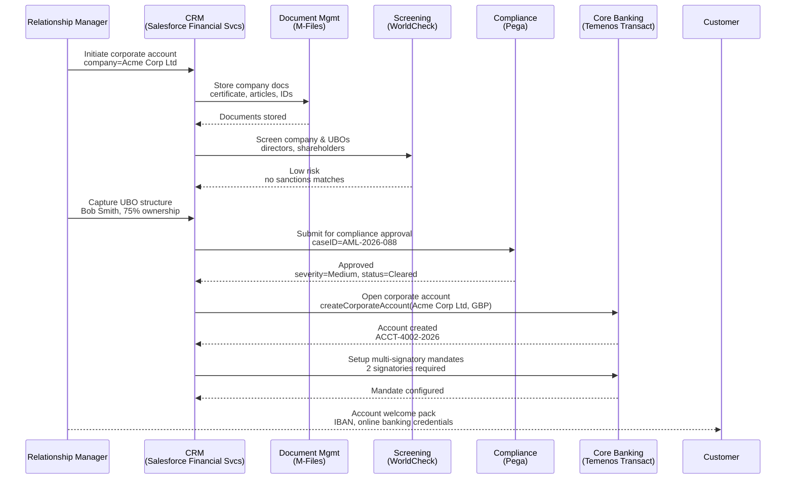
```mermaid
sequenceDiagram
    participant RM as Relationship Manager
    participant CRM as CRM<br/>(Salesforce Financial Svcs)
    participant DOC as Document Mgmt<br/>(M-Files)
    participant SCR as Screening<br/>(WorldCheck)
    participant COMP as Compliance<br/>(Pega)
    participant CBS as Core Banking<br/>(Temenos Transact)
    RM->>CRM: Initiate corporate account<br/>company=Acme Corp Ltd
    CRM->>DOC: Store company docs<br/>certificate, articles, IDs
    DOC-->>CRM: Documents stored
    CRM->>SCR: Screen company & UBOs<br/>directors, shareholders
    SCR-->>CRM: Low risk<br/>no sanctions matches
    RM->>CRM: Capture UBO structure<br/>Bob Smith, 75% ownership
    CRM->>COMP: Submit for compliance approval<br/>caseID=AML-2026-088
    COMP-->>CRM: Approved<br/>severity=Medium, status=Cleared
    CRM->>CBS: Open corporate account<br/>createCorporateAccount(Acme Corp Ltd, GBP)
    CBS-->>CRM: Account created<br/>ACCT-4002-2026
    CRM->>CBS: Setup multi-signatory mandates<br/>2 signatories required
    CBS-->>CRM: Mandate configured
    RM-->>Customer: Account welcome pack<br/>IBAN, online banking credentials
```

#### Integration Details

| Flow | Entity | Info Flow | Source | Target | Source Conn | Target Conn | Pattern | Complexity |
|------|--------|-----------|--------|--------|-------------|-------------|---------|------------|
| Corporate Account | Documents | StoreCompanyDocs | CRM (Salesforce Financial Services) | Document Mgmt (M-Files) | Salesforce REST API (OAuth2) | M-Files REST API (API Key) | API-led (Real-time) | Simple |
| Corporate Account | Screening | ScreenCompanyUBO | CRM (Salesforce Financial Services) | Screening (WorldCheck) | Salesforce REST API (OAuth2) | WorldCheck API (SOAP) | API-led (Real-time) | Medium |
| Corporate Account | Compliance | ApproveCompliance | CRM (Salesforce Financial Services) | Compliance Case Mgmt (Pega) | Salesforce REST API (OAuth2) | Pega API (REST) | API-led (Real-time) | Medium |
| Corporate Account | Account | OpenCorporateAccount | CRM (Salesforce Financial Services) | Core Banking (Temenos Transact) | Salesforce REST API (OAuth2) | Temenos REST API (API Key) | API-led (Real-time) | High |

#### Acceptance Criteria

| Flow | Entity | Acceptance Criterion | Expected Outcome |
|------|--------|---------------------|------------------|
| Corporate Account | Documents | Company documents stored in M-Files with correct metadata tagging | Documents retrievable by company ID; version history maintained |
| Corporate Account | Screening | Company and UBOs screened against sanctions lists | Low risk result or escalated compliance case; screening completed in <10 seconds |
| Corporate Account | Compliance | Compliance approval obtained via Pega case management workflow | Case approved/cleared; rejection includes reason and resubmission guidance |
| Corporate Account | Account | Corporate account opened with multi-signatory mandate configuration | Account created with all signatories; mandate rules enforced on transactions |

---

# Payments & Transfers  - `BC060` `BC061`  - `BC060` `BC061`

End-to-end payment processing covering domestic, cross-border, and real-time payment instruments. Integration with clearing systems, correspondent banks, and settlement engines.

### 2.1 Domestic Payment (SEPA/ACH)

**Description:** Customer initiates domestic transfer via digital channel. Payment hub validates, routes to clearing, executes, and reconciles.

**Actors:** Customer, Payment Operations  
**Systems:** Core Banking (Temenos Transact), Payment Hub (Volante), SEPA Clearing (EBA Clearing), Reconciliation Engine (SmartStream)

#### Sequence Diagram

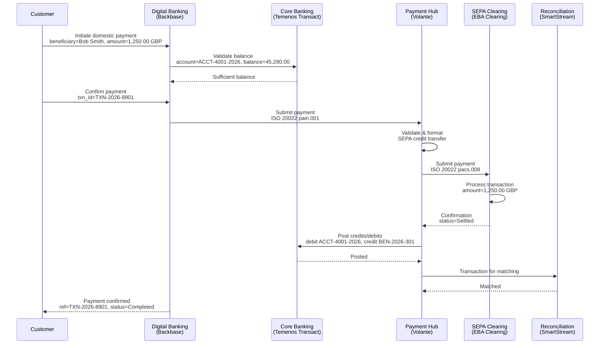
```mermaid
sequenceDiagram
    participant C as Customer
    participant DB as Digital Banking<br/>(Backbase)
    participant CBS as Core Banking<br/>(Temenos Transact)
    participant PH as Payment Hub<br/>(Volante)
    participant SEPA as SEPA Clearing<br/>(EBA Clearing)
    participant REC as Reconciliation<br/>(SmartStream)
    C->>DB: Initiate domestic payment<br/>beneficiary=Bob Smith, amount=1,250.00 GBP
    DB->>CBS: Validate balance<br/>account=ACCT-4001-2026, balance=45,280.00
    CBS-->>DB: Sufficient balance
    C->>DB: Confirm payment<br/>txn_id=TXN-2026-8901
    DB->>PH: Submit payment<br/>ISO 20022 pain.001
    PH->>PH: Validate & format<br/>SEPA credit transfer
    PH->>SEPA: Submit payment<br/>ISO 20022 pacs.008
    SEPA->>SEPA: Process transaction<br/>amount=1,250.00 GBP
    SEPA-->>PH: Confirmation<br/>status=Settled
    PH->>CBS: Post credits/debits<br/>debit ACCT-4001-2026, credit BEN-2026-301
    CBS-->>PH: Posted
    PH->>REC: Transaction for matching
    REC-->>PH: Matched
    DB-->>C: Payment confirmed<br/>ref=TXN-2026-8901, status=Completed
```

#### Integration Details

| Flow | Entity | Info Flow | Source | Target | Source Conn | Target Conn | Pattern | Complexity |
|------|--------|-----------|--------|--------|-------------|-------------|---------|------------|
| Domestic Payment | Payment Instruction | SubmitPayment | Digital Banking (Backbase) | Payment Hub (Volante) | Backbase REST API | Volante API (ISO 20022) | API-led (Real-time) | Medium |
| Domestic Payment | Clearing | SubmitToClearing | Payment Hub (Volante) | SEPA Clearing (EBA Clearing) | Volante API (ISO 20022) | EBA Clearing API (ISO 20022) | API-led (Real-time) | High |
| Domestic Payment | Ledger | PostTransaction | Payment Hub (Volante) | Core Banking (Temenos Transact) | Volante REST API | Temenos REST API (API Key) | API-led (Real-time) | Medium |
| Domestic Payment | Reconciliation | MatchTransaction | Payment Hub (Volante) | Reconciliation Engine (SmartStream) | Volante REST API | SmartStream API (REST) | API-led (Real-time) | Simple |

#### Acceptance Criteria

| Flow | Entity | Acceptance Criterion | Expected Outcome |
|------|--------|---------------------|------------------|
| Domestic Payment | Payment Instruction | ISO 20022 pain.001 message generated and submitted to payment hub | Payment hub acknowledges with unique reference; invalid messages rejected with reason |
| Domestic Payment | Clearing | SEPA credit transfer submitted to EBA Clearing via ISO 20022 pacs.008 | Clearing confirmation received with status=Settled within SEPA timelines |
| Domestic Payment | Ledger | Debit and credit entries posted correctly to source and beneficiary accounts | Source account debited, beneficiary account credited; balance reconciliation matches |
| Domestic Payment | Reconciliation | Transaction matched by SmartStream reconciliation engine | Match status=success; unmatched items flagged with discrepancy details |

---

### 2.2 Cross-Border Payment (SWIFT)

**Description:** Customer initiates international wire. Payment hub validates, formats SWIFT MT103, sends via SWIFT, correspondent bank processes, cover payment via MT202, status tracking.

**Actors:** Customer, Payment Operations  
**Systems:** Core Banking (Temenos Transact), Payment Hub (Volante), SWIFT Alliance Gateway, Correspondent Bank (Deutsche Bank)

#### Sequence Diagram

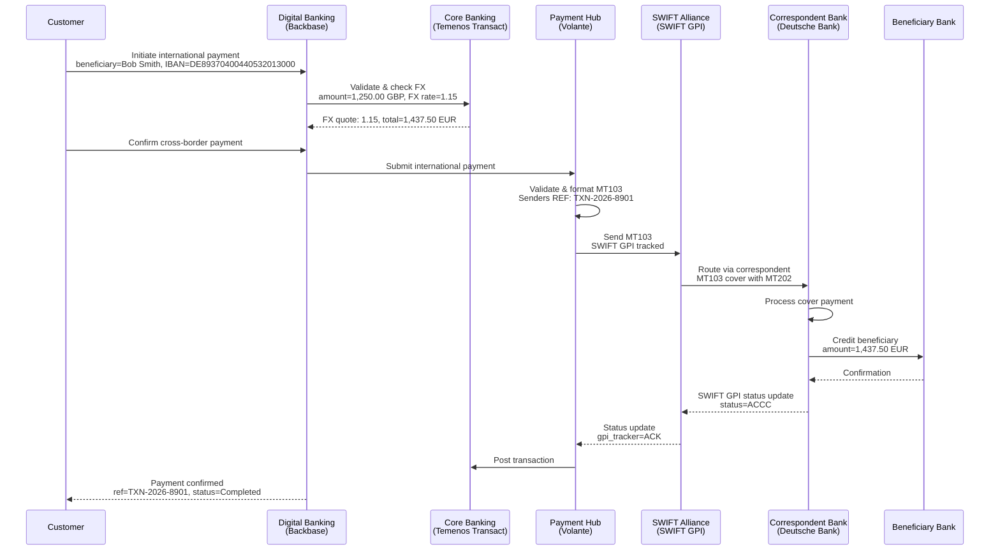
```mermaid
sequenceDiagram
    participant C as Customer
    participant DB as Digital Banking<br/>(Backbase)
    participant CBS as Core Banking<br/>(Temenos Transact)
    participant PH as Payment Hub<br/>(Volante)
    participant SW as SWIFT Alliance<br/>(SWIFT GPI)
    participant CORR as Correspondent Bank<br/>(Deutsche Bank)
    participant BEN as Beneficiary Bank
    C->>DB: Initiate international payment<br/>beneficiary=Bob Smith, IBAN=DE89370400440532013000
    DB->>CBS: Validate & check FX<br/>amount=1,250.00 GBP, FX rate=1.15
    CBS-->>DB: FX quote: 1.15, total=1,437.50 EUR
    C->>DB: Confirm cross-border payment
    DB->>PH: Submit international payment
    PH->>PH: Validate & format MT103<br/>Senders REF: TXN-2026-8901
    PH->>SW: Send MT103<br/>SWIFT GPI tracked
    SW->>CORR: Route via correspondent<br/>MT103 cover with MT202
    CORR->>CORR: Process cover payment
    CORR->>BEN: Credit beneficiary<br/>amount=1,437.50 EUR
    BEN-->>CORR: Confirmation
    CORR-->>SW: SWIFT GPI status update<br/>status=ACCC
    SW-->>PH: Status update<br/>gpi_tracker=ACK
    PH->>CBS: Post transaction
    DB-->>C: Payment confirmed<br/>ref=TXN-2026-8901, status=Completed
```

#### Integration Details

| Flow | Entity | Info Flow | Source | Target | Source Conn | Target Conn | Pattern | Complexity |
|------|--------|-----------|--------|--------|-------------|-------------|---------|------------|
| Cross-Border Payment | FX Quote | CheckFXRate | Digital Banking (Backbase) | Core Banking (Temenos Transact) | Backbase REST API | Temenos REST API (API Key) | API-led (Real-time) | Simple |
| Cross-Border Payment | SWIFT Message | SendMT103 | Payment Hub (Volante) | SWIFT Alliance Gateway | Volante ISO 20022 | SWIFT Alliance (MT) | API-led (Real-time) | High |
| Cross-Border Payment | Cover Payment | ProcessCover | SWIFT Alliance Gateway | Correspondent Bank (Deutsche Bank) | SWIFT Alliance (MT) | SWIFT MT202 | Batch (Scheduled) | High |
| Cross-Border Payment | Status | TrackGPIStatus | SWIFT Alliance Gateway | Payment Hub (Volante) | SWIFT GPI API | Volante REST API | Event-driven | Medium |

#### Acceptance Criteria

| Flow | Entity | Acceptance Criterion | Expected Outcome |
|------|--------|---------------------|------------------|
| Cross-Border Payment | FX Quote | FX rate returned for currency pair with valid from/to currencies | Rate within 0.5% of market mid-rate; expired quotes rejected after 30 seconds |
| Cross-Border Payment | SWIFT Message | SWIFT MT103 message formatted and sent via SWIFT Alliance Gateway | SWIFT ACK received; UETR assigned; format validation errors cause rejection |
| Cross-Border Payment | Cover Payment | MT202 cover payment processed correctly by correspondent bank | Cover funds received by correspondent; nostro account debited correctly |
| Cross-Border Payment | Status | SWIFT GPI tracker updated with end-to-end payment status | Status transitions visible in GPI tracker; final ACCC confirmation received |

---

### 2.3 Real-Time Payment (Faster Payments)

**Description:** Customer initiates instant payment. Payment hub processes in real-time via Faster Payments Service, immediate confirmation.

**Actors:** Customer, Payment Operations  
**Systems:** Core Banking (Temenos Transact), Payment Hub (Volante), Faster Payments Service (FPS), Beneficiary Bank

#### Sequence Diagram

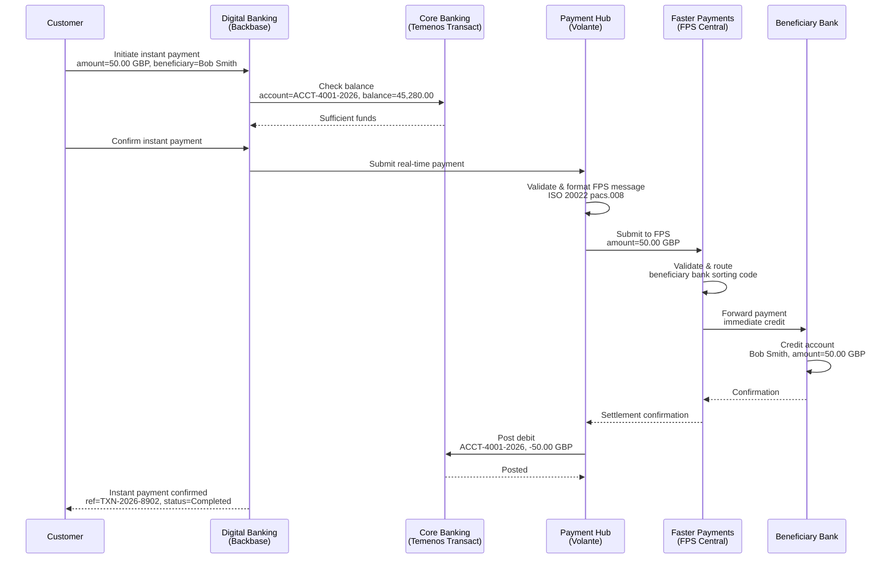
```mermaid
sequenceDiagram
    participant C as Customer
    participant DB as Digital Banking<br/>(Backbase)
    participant CBS as Core Banking<br/>(Temenos Transact)
    participant PH as Payment Hub<br/>(Volante)
    participant FPS as Faster Payments<br/>(FPS Central)
    participant BEN as Beneficiary Bank
    C->>DB: Initiate instant payment<br/>amount=50.00 GBP, beneficiary=Bob Smith
    DB->>CBS: Check balance<br/>account=ACCT-4001-2026, balance=45,280.00
    CBS-->>DB: Sufficient funds
    C->>DB: Confirm instant payment
    DB->>PH: Submit real-time payment
    PH->>PH: Validate & format FPS message<br/>ISO 20022 pacs.008
    PH->>FPS: Submit to FPS<br/>amount=50.00 GBP
    FPS->>FPS: Validate & route<br/>beneficiary bank sorting code
    FPS->>BEN: Forward payment<br/>immediate credit
    BEN->>BEN: Credit account<br/>Bob Smith, amount=50.00 GBP
    BEN-->>FPS: Confirmation
    FPS-->>PH: Settlement confirmation
    PH->>CBS: Post debit<br/>ACCT-4001-2026, -50.00 GBP
    CBS-->>PH: Posted
    DB-->>C: Instant payment confirmed<br/>ref=TXN-2026-8902, status=Completed
```

#### Integration Details

| Flow | Entity | Info Flow | Source | Target | Source Conn | Target Conn | Pattern | Complexity |
|------|--------|-----------|--------|--------|-------------|-------------|---------|------------|
| Real-Time Payment | Payment Request | SubmitRTPayment | Digital Banking (Backbase) | Payment Hub (Volante) | Backbase REST API | Volante REST API | API-led (Real-time) | Medium |
| Real-Time Payment | FPS Message | SubmitToFPS | Payment Hub (Volante) | Faster Payments Service (FPS) | Volante API (ISO 20022) | FPS API (ISO 20022) | API-led (Real-time) | High |
| Real-Time Payment | Credit | CreditBeneficiary | Faster Payments Service (FPS) | Beneficiary Bank | FPS Network API | Bank API (ISO 20022) | API-led (Real-time) | High |
| Real-Time Payment | Ledger | PostDebit | Payment Hub (Volante) | Core Banking (Temenos Transact) | Volante REST API | Temenos REST API (API Key) | API-led (Real-time) | Medium |

#### Acceptance Criteria

| Flow | Entity | Acceptance Criterion | Expected Outcome |
|------|--------|---------------------|------------------|
| Real-Time Payment | Payment Request | Real-time payment request received and validated by payment hub | Request accepted or rejected within 1 second; invalid data returns specific error |
| Real-Time Payment | FPS Message | ISO 20022 pacs.008 message submitted to Faster Payments Service | FPS acknowledges within 2 seconds; settlement confirmation in <15 seconds |
| Real-Time Payment | Credit | Beneficiary account credited immediately by beneficiary bank | Funds available to beneficiary within 10 seconds of initiation; no holds applied |
| Real-Time Payment | Ledger | Source account debited correctly with real-time balance update | Available balance reduced immediately; transaction appears in transaction history |

---

# Lending & Credit Management  - `BC070`  - `BC070`

End-to-end lending lifecycle from origination through servicing. Credit assessment, approval workflows, disbursement, and ongoing account management.

### 3.1 Retail Loan Origination

**Description:** Customer applies for personal loan. LOS processes application, initiates credit bureau check, calculates affordability, recommends decision, routes for approval.

**Actors:** Customer, Loan Officer, Credit Risk Analyst  
**Systems:** LOS (nCino/Finastra), Core Banking (Temenos Transact), Credit Bureau (Experian), Decision Engine (FICO)

#### Sequence Diagram

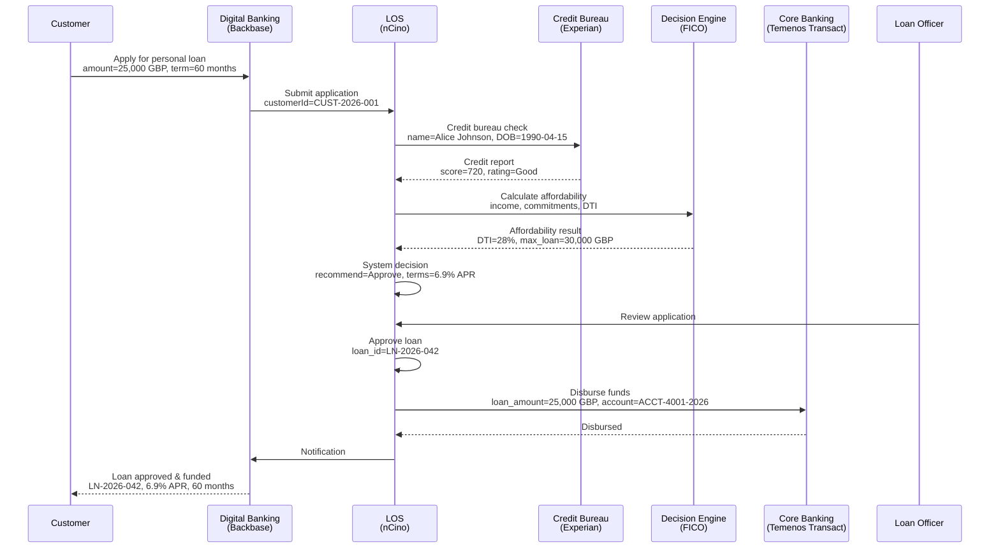
```mermaid
sequenceDiagram
    participant C as Customer
    participant DB as Digital Banking<br/>(Backbase)
    participant LOS as LOS<br/>(nCino)
    participant CB as Credit Bureau<br/>(Experian)
    participant DE as Decision Engine<br/>(FICO)
    participant CBS as Core Banking<br/>(Temenos Transact)
    C->>DB: Apply for personal loan<br/>amount=25,000 GBP, term=60 months
    DB->>LOS: Submit application<br/>customerId=CUST-2026-001
    LOS->>CB: Credit bureau check<br/>name=Alice Johnson, DOB=1990-04-15
    CB-->>LOS: Credit report<br/>score=720, rating=Good
    LOS->>DE: Calculate affordability<br/>income, commitments, DTI
    DE-->>LOS: Affordability result<br/>DTI=28%, max_loan=30,000 GBP
    LOS->>LOS: System decision<br/>recommend=Approve, terms=6.9% APR
    Loan Officer->>LOS: Review application
    LOS->>LOS: Approve loan<br/>loan_id=LN-2026-042
    LOS->>CBS: Disburse funds<br/>loan_amount=25,000 GBP, account=ACCT-4001-2026
    CBS-->>LOS: Disbursed
    LOS->>DB: Notification
    DB-->>C: Loan approved & funded<br/>LN-2026-042, 6.9% APR, 60 months
```

#### Integration Details

| Flow | Entity | Info Flow | Source | Target | Source Conn | Target Conn | Pattern | Complexity |
|------|--------|-----------|--------|--------|-------------|-------------|---------|------------|
| Loan Origination | Application | SubmitLoanApp | Digital Banking (Backbase) | LOS (nCino) | Backbase REST API | nCino REST API (OAuth2) | API-led (Real-time) | Medium |
| Loan Origination | Credit Check | CreditBureauCheck | LOS (nCino) | Credit Bureau (Experian) | nCino API | Experian API (SOAP) | API-led (Real-time) | High |
| Loan Origination | Decision | CalculateAffordability | LOS (nCino) | Decision Engine (FICO) | nCino REST API | FICO Blaze API (REST) | API-led (Real-time) | Medium |
| Loan Origination | Disbursement | DisburseLoan | LOS (nCino) | Core Banking (Temenos Transact) | nCino REST API (OAuth2) | Temenos REST API (API Key) | API-led (Real-time) | Medium |

#### Acceptance Criteria

| Flow | Entity | Acceptance Criterion | Expected Outcome |
|------|--------|---------------------|------------------|
| Loan Origination | Application | Loan application submitted from digital banking to nCino LOS | Application ID created; all fields mapped correctly; incomplete applications rejected |
| Loan Origination | Credit Check | Experian credit bureau check returns credit report and score | Credit score returned within 5 seconds; bureau error handled gracefully with retry |
| Loan Origination | Decision | FICO affordability calculation returns DTI ratio and max loan recommendation | DTI <=40% auto-approved; >40% routed to manual underwriting |
| Loan Origination | Disbursement | Loan funds disbursed to customer account in Temenos Transact | Customer account credited within 30 seconds; loan account created with correct terms |

---

### 3.2 Mortgage Lending

**Description:** Customer applies for mortgage. LOS manages document collection, valuation, solicitor coordination, offer issuance, completion.

**Actors:** Customer, Mortgage Advisor, Underwriter  
**Systems:** LOS (nCino), Core Banking (Temenos Transact), Valuation Provider (Hometrack), Solicitor Portal

#### Sequence Diagram

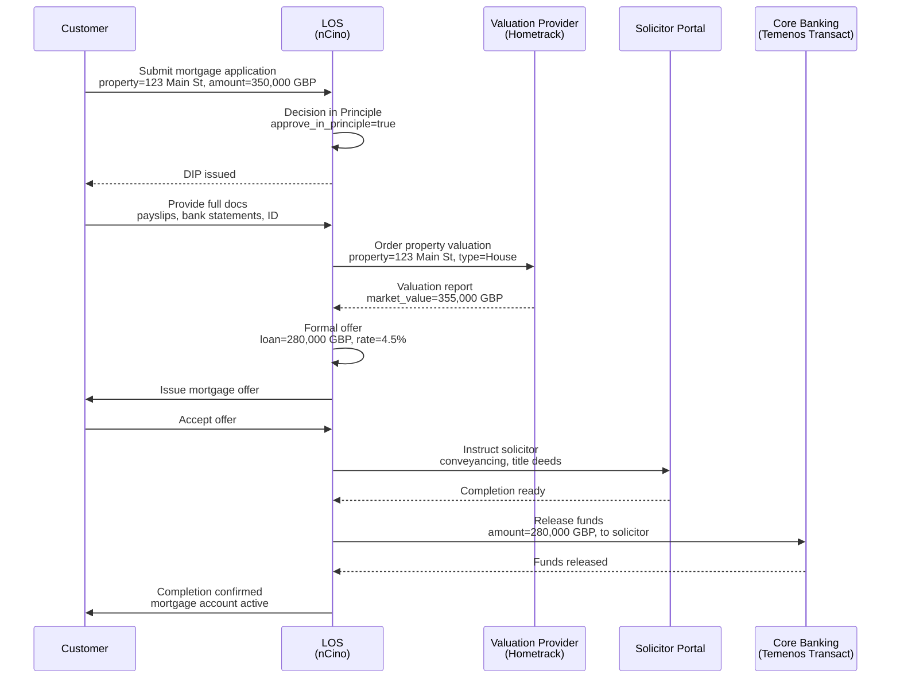
```mermaid
sequenceDiagram
    participant C as Customer
    participant LOS as LOS<br/>(nCino)
    participant VAL as Valuation Provider<br/>(Hometrack)
    participant SOL as Solicitor Portal
    participant CBS as Core Banking<br/>(Temenos Transact)
    C->>LOS: Submit mortgage application<br/>property=123 Main St, amount=350,000 GBP
    LOS->>LOS: Decision in Principle<br/>approve_in_principle=true
    LOS-->>C: DIP issued
    C->>LOS: Provide full docs<br/>payslips, bank statements, ID
    LOS->>VAL: Order property valuation<br/>property=123 Main St, type=House
    VAL-->>LOS: Valuation report<br/>market_value=355,000 GBP
    LOS->>LOS: Formal offer<br/>loan=280,000 GBP, rate=4.5%
    LOS->>C: Issue mortgage offer
    C->>LOS: Accept offer
    LOS->>SOL: Instruct solicitor<br/>conveyancing, title deeds
    SOL-->>LOS: Completion ready
    LOS->>CBS: Release funds<br/>amount=280,000 GBP, to solicitor
    CBS-->>LOS: Funds released
    LOS->>C: Completion confirmed<br/>mortgage account active
```

#### Integration Details

| Flow | Entity | Info Flow | Source | Target | Source Conn | Target Conn | Pattern | Complexity |
|------|--------|-----------|--------|--------|-------------|-------------|---------|------------|
| Mortgage Lending | DIP | DecisionInPrinciple | LOS (nCino) | LOS (nCino) | Internal | Internal | API-led (Real-time) | Simple |
| Mortgage Lending | Valuation | OrderValuation | LOS (nCino) | Valuation Provider (Hometrack) | nCino REST API | Hometrack API (SOAP) | Event-driven | Medium |
| Mortgage Lending | Solicitor | InstructSolicitor | LOS (nCino) | Solicitor Portal | nCino REST API | Solicitor API (REST) | Event-driven | Medium |
| Mortgage Lending | Funds | ReleaseFunds | LOS (nCino) | Core Banking (Temenos Transact) | nCino REST API (OAuth2) | Temenos REST API (API Key) | Event-driven | High |

#### Acceptance Criteria

| Flow | Entity | Acceptance Criterion | Expected Outcome |
|------|--------|---------------------|------------------|
| Mortgage Lending | DIP | Decision in Principle calculated based on submitted income and commitment data | DIP issued with provisional amount and term; declined DIP shows reason |
| Mortgage Lending | Valuation | Property valuation ordered from Hometrack with correct property details | Valuation report returned within 24hrs; automated valuation for LTV <80% |
| Mortgage Lending | Solicitor | Solicitor instructed via portal with all required case documents | Solicitor confirmation received; all title deed requests submitted |
| Mortgage Lending | Funds | Mortgage funds released to solicitor on completion | Funds transferred via CHAPS within 2 hours of completion request; tracking reference provided |

---

### 3.3 Credit Assessment & Scoring

**Description:** Credit analyst reviews score, bureau data, bank statement analysis. Decision engine computes risk score, recommends limit/terms. Underwriter approves.

**Actors:** Credit Risk Analyst, Loan Officer, Underwriter  
**Systems:** LOS (nCino), Credit Bureau (Experian), Decision Engine (FICO), Open Banking API (Token.io)

#### Sequence Diagram

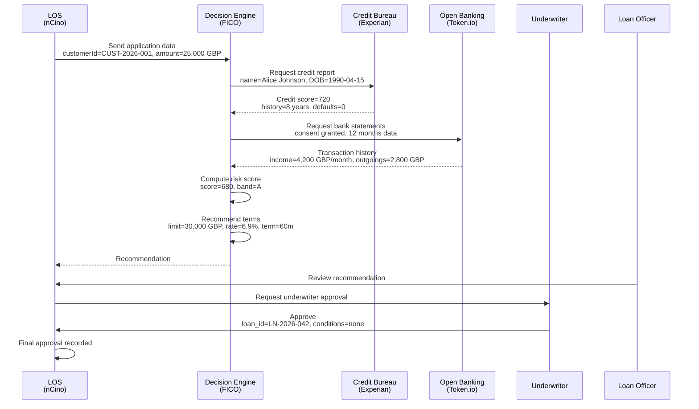
```mermaid
sequenceDiagram
    participant LOS as LOS<br/>(nCino)
    participant DE as Decision Engine<br/>(FICO)
    participant CB as Credit Bureau<br/>(Experian)
    participant OBP as Open Banking<br/>(Token.io)
    participant UN as Underwriter
    LOS->>DE: Send application data<br/>customerId=CUST-2026-001, amount=25,000 GBP
    DE->>CB: Request credit report<br/>name=Alice Johnson, DOB=1990-04-15
    CB-->>DE: Credit score=720<br/>history=8 years, defaults=0
    DE->>OBP: Request bank statements<br/>consent granted, 12 months data
    OBP-->>DE: Transaction history<br/>income=4,200 GBP/month, outgoings=2,800 GBP
    DE->>DE: Compute risk score<br/>score=680, band=A
    DE->>DE: Recommend terms<br/>limit=30,000 GBP, rate=6.9%, term=60m
    DE-->>LOS: Recommendation
    Loan Officer->>LOS: Review recommendation
    LOS->>UN: Request underwriter approval
    UN->>LOS: Approve<br/>loan_id=LN-2026-042, conditions=none
    LOS->>LOS: Final approval recorded
```

#### Integration Details

| Flow | Entity | Info Flow | Source | Target | Source Conn | Target Conn | Pattern | Complexity |
|------|--------|-----------|--------|--------|-------------|-------------|---------|------------|
| Credit Assessment | Application Data | SendForScoring | LOS (nCino) | Decision Engine (FICO) | nCino REST API | FICO Blaze API (REST) | API-led (Real-time) | Medium |
| Credit Assessment | Credit Report | GetCreditReport | Decision Engine (FICO) | Credit Bureau (Experian) | FICO Blaze API | Experian API (SOAP) | API-led (Real-time) | High |
| Credit Assessment | Bank Statements | GetTransactionData | Decision Engine (FICO) | Open Banking (Token.io) | FICO API | Token.io API (OAuth2) | API-led (Real-time) | High |
| Credit Assessment | Approval | ApproveUnderwriting | LOS (nCino) | Workflow (Pega) | nCino REST API (OAuth2) | Pega Workflow API (REST) | Event-driven | Medium |

#### Acceptance Criteria

| Flow | Entity | Acceptance Criterion | Expected Outcome |
|------|--------|---------------------|------------------|
| Credit Assessment | Application Data | Application data sent from nCino to FICO decision engine | Data accepted by decision engine; missing mandatory fields cause rejection |
| Credit Assessment | Credit Report | Experian credit report retrieved with score, history, and default information | Full credit report returned; bureau downtime handled with cached score or manual fallback |
| Credit Assessment | Bank Statements | Transaction data retrieved via Open Banking API with customer consent | 12 months data retrieved; consent refresh handled; data unavailable flagged |
| Credit Assessment | Approval | Underwriter approval recorded with conditions (if any) | Approval recorded in LOS; conditions tracked; approval valid for 90 days |

---

# Cards Management  - `BC071`  - `BC071`

Full lifecycle of credit and debit card programs — issuance, authorization, transaction processing, clearing, settlement, and dispute management.

### 4.1 Card Issuance

**Description:** Customer requests card. Card Mgmt system personalizes, orders production, activates card, sets PIN, enables digital wallet.

**Actors:** Customer, Card Operations  
**Systems:** Card Management (Fiserv/FDR), Card Production Bureau (CPI), Digital Banking (Backbase), Digital Wallet (Apple Pay / Google Pay)

#### Sequence Diagram

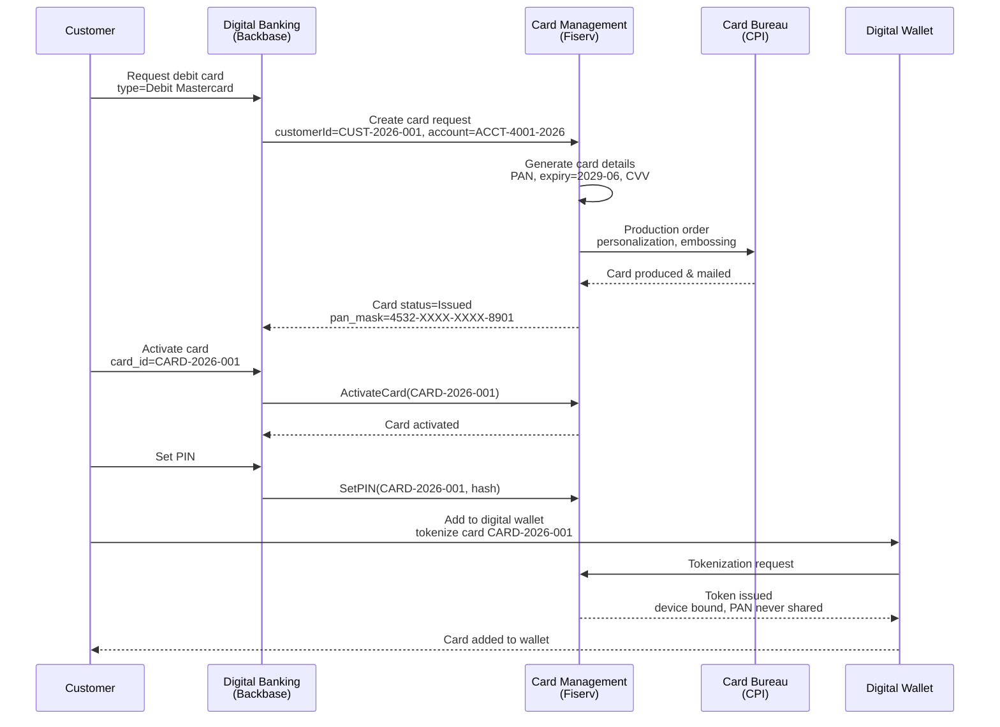
```mermaid
sequenceDiagram
    participant C as Customer
    participant DB as Digital Banking<br/>(Backbase)
    participant CMS as Card Management<br/>(Fiserv)
    participant BUR as Card Bureau<br/>(CPI)
    participant WAL as Digital Wallet
    C->>DB: Request debit card<br/>type=Debit Mastercard
    DB->>CMS: Create card request<br/>customerId=CUST-2026-001, account=ACCT-4001-2026
    CMS->>CMS: Generate card details<br/>PAN, expiry=2029-06, CVV
    CMS->>BUR: Production order<br/>personalization, embossing
    BUR-->>CMS: Card produced & mailed
    CMS-->>DB: Card status=Issued<br/>pan_mask=4532-XXXX-XXXX-8901
    C->>DB: Activate card<br/>card_id=CARD-2026-001
    DB->>CMS: ActivateCard(CARD-2026-001)
    CMS-->>DB: Card activated
    C->>DB: Set PIN
    DB->>CMS: SetPIN(CARD-2026-001, hash)
    C->>WAL: Add to digital wallet<br/>tokenize card CARD-2026-001
    WAL->>CMS: Tokenization request
    CMS-->>WAL: Token issued<br/>device bound, PAN never shared
    WAL-->>C: Card added to wallet
```

#### Integration Details

| Flow | Entity | Info Flow | Source | Target | Source Conn | Target Conn | Pattern | Complexity |
|------|--------|-----------|--------|--------|-------------|-------------|---------|------------|
| Card Issuance | Card Request | CreateCardRequest | Digital Banking (Backbase) | Card Management (Fiserv) | Backbase REST API | Fiserv API (SOAP) | API-led (Real-time) | Medium |
| Card Issuance | Production | OrderProduction | Card Management (Fiserv) | Card Bureau (CPI) | Fiserv API (ISO 8583) | CPI API (SFTP) | Batch (Scheduled) | High |
| Card Issuance | Activation | ActivateCard | Digital Banking (Backbase) | Card Management (Fiserv) | Backbase REST API | Fiserv API (SOAP) | API-led (Real-time) | Simple |
| Card Issuance | Tokenization | TokenizeCard | Digital Wallet (Apple Pay) | Card Management (Fiserv) | Apple Pay API | Fiserv Token API | API-led (Real-time) | High |

#### Acceptance Criteria

| Flow | Entity | Acceptance Criterion | Expected Outcome |
|------|--------|---------------------|------------------|
| Card Issuance | Card Request | Card creation request sent to Fiserv card management with correct customer and account | Card details generated (PAN, expiry, CVV); card ID returned |
| Card Issuance | Production | Production order file sent to CPI bureau for card personalization | File acknowledged by CPI; physical card dispatched within 3 business days |
| Card Issuance | Activation | Card activated by customer via digital banking or IVR | Card status changes from Issued to Active; activation timestamp logged |
| Card Issuance | Tokenization | Card tokenized for Apple Pay/Google Pay with device-bound token | Token issued; PAN never shared with wallet provider; token domain-restricted |

---

### 4.2 Card Transaction Processing

**Description:** Customer makes POS purchase. Authorization request flows from terminal → acquirer → network → issuer. Clearing and settlement follows.

**Actors:** Customer, Merchant, Acquirer  
**Systems:** Card Management (Fiserv/FDR), POS Terminal, Merchant Acquirer (Worldpay), Payment Network (Visa/Mastercard), Core Banking (Temenos Transact)

#### Sequence Diagram

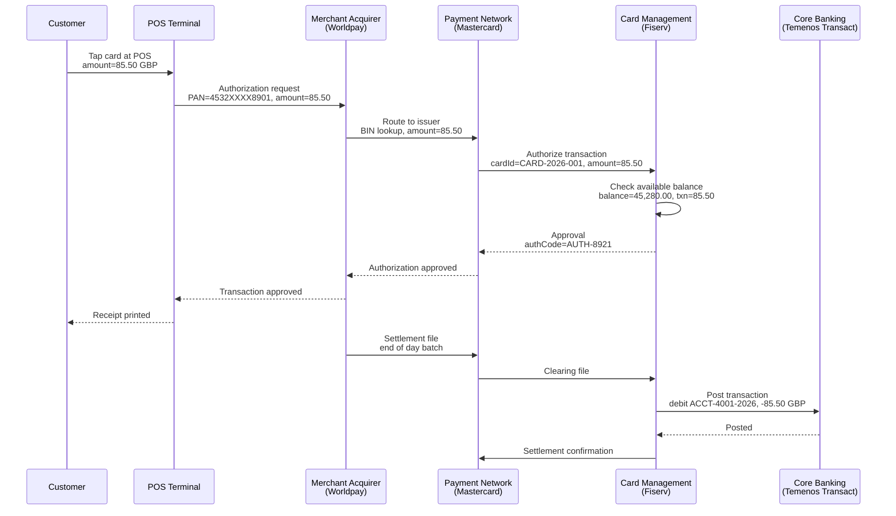
```mermaid
sequenceDiagram
    participant C as Customer
    participant POS as POS Terminal
    participant ACQ as Merchant Acquirer<br/>(Worldpay)
    participant NET as Payment Network<br/>(Mastercard)
    participant CMS as Card Management<br/>(Fiserv)
    participant CBS as Core Banking<br/>(Temenos Transact)
    C->>POS: Tap card at POS<br/>amount=85.50 GBP
    POS->>ACQ: Authorization request<br/>PAN=4532XXXX8901, amount=85.50
    ACQ->>NET: Route to issuer<br/>BIN lookup, amount=85.50
    NET->>CMS: Authorize transaction<br/>cardId=CARD-2026-001, amount=85.50
    CMS->>CMS: Check available balance<br/>balance=45,280.00, txn=85.50
    CMS-->>NET: Approval<br/>authCode=AUTH-8921
    NET-->>ACQ: Authorization approved
    ACQ-->>POS: Transaction approved
    POS-->>C: Receipt printed
    ACQ->>NET: Settlement file<br/>end of day batch
    NET->>CMS: Clearing file
    CMS->>CBS: Post transaction<br/>debit ACCT-4001-2026, -85.50 GBP
    CBS-->>CMS: Posted
    CMS->>NET: Settlement confirmation
```

#### Integration Details

| Flow | Entity | Info Flow | Source | Target | Source Conn | Target Conn | Pattern | Complexity |
|------|--------|-----------|--------|--------|-------------|-------------|---------|------------|
| Card Transaction | Authorization | AuthorizeTransaction | POS Terminal | Merchant Acquirer (Worldpay) | POS Protocol (ISO 8583) | Worldpay Gateway API | API-led (Real-time) | High |
| Card Transaction | Routing | RouteToIssuer | Merchant Acquirer (Worldpay) | Payment Network (Mastercard) | Worldpay API (ISO 8583) | Mastercard Network (ISO 8583) | API-led (Real-time) | High |
| Card Transaction | Issuer Auth | AuthDecision | Payment Network (Mastercard) | Card Management (Fiserv) | Mastercard Interface | Fiserv API (ISO 8583) | API-led (Real-time) | Medium |
| Card Transaction | Settlement | SubmitSettlement | Merchant Acquirer (Worldpay) | Payment Network (Mastercard) | Worldpay Settlement API | Mastercard Settlement (ISO 20022) | Batch (Scheduled) | High |
| Card Transaction | Posting | PostCardTransaction | Card Management (Fiserv) | Core Banking (Temenos Transact) | Fiserv REST API | Temenos REST API (API Key) | API-led (Real-time) | Medium |

#### Acceptance Criteria

| Flow | Entity | Acceptance Criterion | Expected Outcome |
|------|--------|---------------------|------------------|
| Card Transaction | Authorization | POS authorization request sent and response received in <2 seconds | Auth approval code returned; declined transactions show reason code |
| Card Transaction | Routing | Transaction routed to correct issuer via Mastercard network BIN lookup | Route determined correctly; BIN table updated weekly |
| Card Transaction | Issuer Auth | Issuer validates available balance/funds and returns auth decision | Sufficient funds approve; insufficient funds decline; all decisions logged |
| Card Transaction | Settlement | End-of-day settlement file exchanged between acquirer, network, and issuer | Settlement file reconciled to zero; exceptions <0.1% of volume |
| Card Transaction | Posting | Card transaction posted to customer account in core banking | Transaction appears on statement; available balance updated; posting date = transaction date |

---

### 4.3 Card Dispute Management

**Description:** Customer disputes a transaction. Dispute system manages chargeback lifecycle: retrieval request, chargeback, pre-arbitration, and arbitration.

**Actors:** Customer, Card Operations, Merchant, Acquirer  
**Systems:** Card Management (Fiserv/FDR), Dispute System (Fiserv), Payment Network (Mastercard), Merchant Acquirer (Worldpay)

#### Sequence Diagram

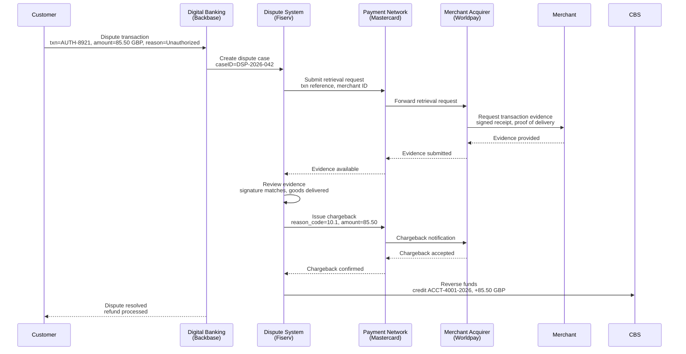
```mermaid
sequenceDiagram
    participant C as Customer
    participant DB as Digital Banking<br/>(Backbase)
    participant DIS as Dispute System<br/>(Fiserv)
    participant NET as Payment Network<br/>(Mastercard)
    participant ACQ as Merchant Acquirer<br/>(Worldpay)
    participant MER as Merchant
    C->>DB: Dispute transaction<br/>txn=AUTH-8921, amount=85.50 GBP, reason=Unauthorized
    DB->>DIS: Create dispute case<br/>caseID=DSP-2026-042
    DIS->>NET: Submit retrieval request<br/>txn reference, merchant ID
    NET->>ACQ: Forward retrieval request
    ACQ->>MER: Request transaction evidence<br/>signed receipt, proof of delivery
    MER-->>ACQ: Evidence provided
    ACQ-->>NET: Evidence submitted
    NET-->>DIS: Evidence available
    DIS->>DIS: Review evidence<br/>signature matches, goods delivered
    DIS->>NET: Issue chargeback<br/>reason_code=10.1, amount=85.50
    NET->>ACQ: Chargeback notification
    ACQ-->>NET: Chargeback accepted
    NET-->>DIS: Chargeback confirmed
    DIS->>CBS: Reverse funds<br/>credit ACCT-4001-2026, +85.50 GBP
    DB-->>C: Dispute resolved<br/>refund processed
```

#### Integration Details

| Flow | Entity | Info Flow | Source | Target | Source Conn | Target Conn | Pattern | Complexity |
|------|--------|-----------|--------|--------|-------------|-------------|---------|------------|
| Card Dispute | Case | CreateDisputeCase | Digital Banking (Backbase) | Dispute System (Fiserv) | Backbase REST API | Fiserv Dispute API (SOAP) | API-led (Real-time) | Medium |
| Card Dispute | Retrieval | SubmitRetrievalRequest | Dispute System (Fiserv) | Payment Network (Mastercard) | Fiserv API | Mastercard Dispute API (ISO 8583) | API-led (Real-time) | High |
| Card Dispute | Chargeback | IssueChargeback | Dispute System (Fiserv) | Payment Network (Mastercard) | Fiserv API | Mastercard Chargeback API | API-led (Real-time) | High |
| Card Dispute | Reversal | ReverseFunds | Dispute System (Fiserv) | Core Banking (Temenos Transact) | Fiserv REST API | Temenos REST API (API Key) | Event-driven | Medium |

#### Acceptance Criteria

| Flow | Entity | Acceptance Criterion | Expected Outcome |
|------|--------|---------------------|------------------|
| Card Dispute | Case | Dispute case created with all transaction details and reason codes | Case ID generated; mandatory fields validated; duplicate case detection active |
| Card Dispute | Retrieval | Retrieval request sent to acquirer via Mastercard dispute network | Acquirer acknowledges within 48hrs; evidence due within 10 calendar days |
| Card Dispute | Chargeback | Chargeback issued with correct reason code and amount | Chargeback accepted by network; funds provisionally reversed to cardholder |
| Card Dispute | Reversal | Funds reversed to customer account upon chargeback confirmation | Customer account credited; reversal appears on next statement |

---

# Deposits & Savings Products  - `BC072` `BC073`  - `BC072` `BC073`

Management of demand deposits (current/savings accounts), term deposits, sweep accounts, and investment-linked savings products.

### 5.1 Account Operations (Current/Savings)

**Description:** Customer performs basic account operations — deposits, withdrawals, standing orders, direct debits. Systems process transactions and update ledgers.

**Actors:** Customer, Product Manager  
**Systems:** Core Banking (Temenos Transact), Digital Banking (Backbase), Payment Hub (Volante), Direct Debit Scheme (Bacs/SDD)

#### Sequence Diagram

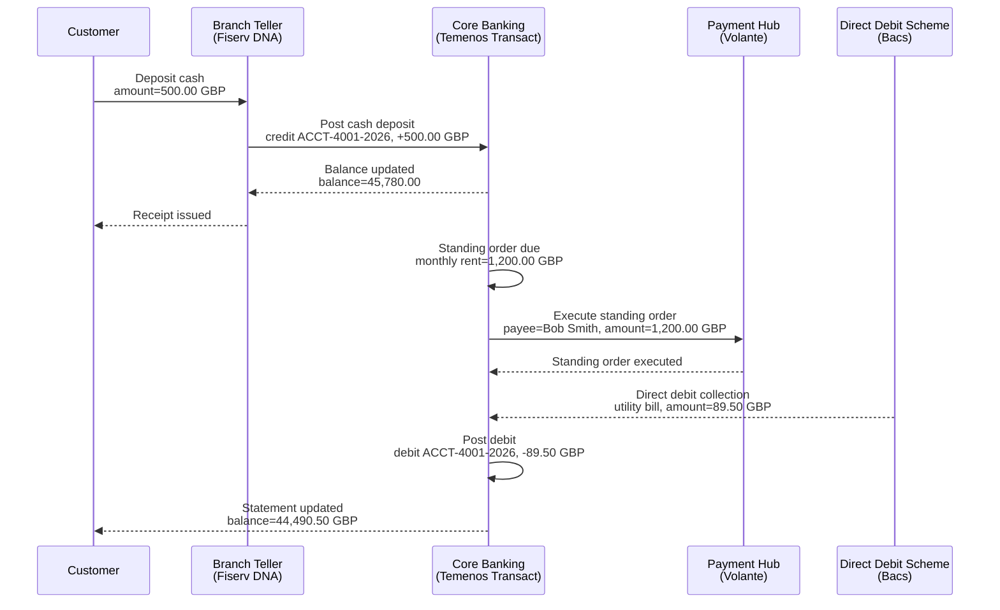
```mermaid
sequenceDiagram
    participant C as Customer
    participant BR as Branch Teller<br/>(Fiserv DNA)
    participant CBS as Core Banking<br/>(Temenos Transact)
    participant PH as Payment Hub<br/>(Volante)
    participant DD as Direct Debit Scheme<br/>(Bacs)
    C->>BR: Deposit cash<br/>amount=500.00 GBP
    BR->>CBS: Post cash deposit<br/>credit ACCT-4001-2026, +500.00 GBP
    CBS-->>BR: Balance updated<br/>balance=45,780.00
    BR-->>C: Receipt issued
    CBS->>CBS: Standing order due<br/>monthly rent=1,200.00 GBP
    CBS->>PH: Execute standing order<br/>payee=Bob Smith, amount=1,200.00 GBP
    PH-->>CBS: Standing order executed
    DD-->>CBS: Direct debit collection<br/>utility bill, amount=89.50 GBP
    CBS->>CBS: Post debit<br/>debit ACCT-4001-2026, -89.50 GBP
    CBS-->>C: Statement updated<br/>balance=44,490.50 GBP
```

#### Integration Details

| Flow | Entity | Info Flow | Source | Target | Source Conn | Target Conn | Pattern | Complexity |
|------|--------|-----------|--------|--------|-------------|-------------|---------|------------|
| Account Operations | Cash Deposit | PostCashDeposit | Branch Teller (Fiserv DNA) | Core Banking (Temenos Transact) | Fiserv Teller API | Temenos REST API (API Key) | API-led (Real-time) | Simple |
| Account Operations | Standing Order | ExecuteStandingOrder | Core Banking (Temenos Transact) | Payment Hub (Volante) | Temenos REST API | Volante API (ISO 20022) | API-led (Real-time) | Medium |
| Account Operations | Direct Debit | ProcessDirectDebit | Direct Debit Scheme (Bacs) | Core Banking (Temenos Transact) | Bacs API (ISO 20022) | Temenos REST API | Batch (Scheduled) | Medium |

#### Acceptance Criteria

| Flow | Entity | Acceptance Criterion | Expected Outcome |
|------|--------|---------------------|------------------|
| Account Operations | Cash Deposit | Cash deposit posted to correct account with accurate amount | Balance updated immediately; receipt generated with transaction reference |
| Account Operations | Standing Order | Standing order executed on due date for correct amount and payee | Payment sent to payment hub; next run date calculated correctly |
| Account Operations | Direct Debit | Direct debit collection processed correctly via Bacs scheme | Account debited on due date; unsuccessful collections retried per scheme rules |

---

### 5.2 Term Deposits

**Description:** Customer places term deposit. System applies interest rate, manages maturity, handles renewal/redemption.

**Actors:** Customer, Product Manager, Treasury  
**Systems:** Core Banking (Temenos Transact), Digital Banking (Backbase), Pricing Engine

#### Sequence Diagram

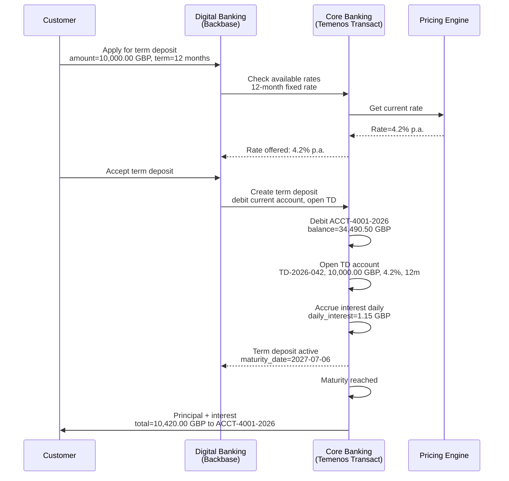
```mermaid
sequenceDiagram
    participant C as Customer
    participant DB as Digital Banking<br/>(Backbase)
    participant CBS as Core Banking<br/>(Temenos Transact)
    participant PR as Pricing Engine
    C->>DB: Apply for term deposit<br/>amount=10,000.00 GBP, term=12 months
    DB->>CBS: Check available rates<br/>12-month fixed rate
    CBS->>PR: Get current rate
    PR-->>CBS: Rate=4.2% p.a.
    CBS-->>DB: Rate offered: 4.2% p.a.
    C->>DB: Accept term deposit
    DB->>CBS: Create term deposit<br/>debit current account, open TD
    CBS->>CBS: Debit ACCT-4001-2026<br/>balance=34,490.50 GBP
    CBS->>CBS: Open TD account<br/>TD-2026-042, 10,000.00 GBP, 4.2%, 12m
    CBS->>CBS: Accrue interest daily<br/>daily_interest=1.15 GBP
    CBS-->>DB: Term deposit active<br/>maturity_date=2027-07-06
    CBS->>CBS: Maturity reached
    CBS->>C: Principal + interest<br/>total=10,420.00 GBP to ACCT-4001-2026
```

#### Integration Details

| Flow | Entity | Info Flow | Source | Target | Source Conn | Target Conn | Pattern | Complexity |
|------|--------|-----------|--------|--------|-------------|-------------|---------|------------|
| Term Deposit | Rate Quote | GetCurrentRate | Core Banking (Temenos Transact) | Pricing Engine | Temenos REST API | Pricing API (REST) | API-led (Real-time) | Simple |
| Term Deposit | Placement | CreateTermDeposit | Core Banking (Temenos Transact) | Core Banking (Temenos Transact) | Internal | Internal | API-led (Real-time) | Medium |
| Term Deposit | Maturity | ProcessMaturity | Core Banking (Temenos Transact) | Core Banking (Temenos Transact) | Internal | Internal | Batch (Scheduled) | Simple |

#### Acceptance Criteria

| Flow | Entity | Acceptance Criterion | Expected Outcome |
|------|--------|---------------------|------------------|
| Term Deposit | Rate Quote | Current term deposit rate returned from pricing engine | Rate matches published product rate; rate guaranteed for quote validity period |
| Term Deposit | Placement | Term deposit account created with principal debited from current account | TD account opened with correct rate, term, and maturity date; principal debited |
| Term Deposit | Maturity | Principal plus interest credited at maturity; renewal option processed | Maturity proceeds credited on value date; auto-renewal terms applied if configured |

---

### 5.3 Sweep & Investment Products

**Description:** Customer sets up sweep rules between accounts. Excess funds swept to savings or investment product.

**Actors:** Customer, Treasury  
**Systems:** Core Banking (Temenos Transact), Digital Banking (Backbase), Treasury System (Murex)

#### Sequence Diagram

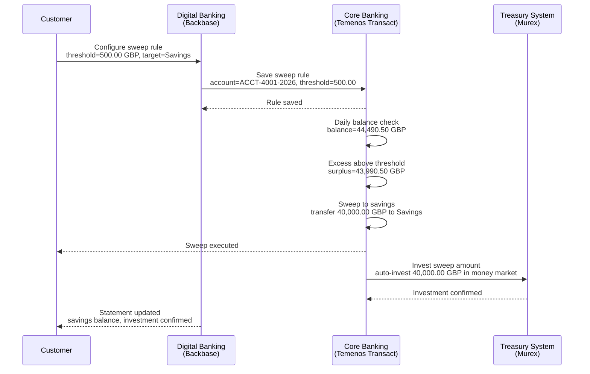
```mermaid
sequenceDiagram
    participant C as Customer
    participant DB as Digital Banking<br/>(Backbase)
    participant CBS as Core Banking<br/>(Temenos Transact)
    participant TR as Treasury System<br/>(Murex)
    C->>DB: Configure sweep rule<br/>threshold=500.00 GBP, target=Savings
    DB->>CBS: Save sweep rule<br/>account=ACCT-4001-2026, threshold=500.00
    CBS-->>DB: Rule saved
    CBS->>CBS: Daily balance check<br/>balance=44,490.50 GBP
    CBS->>CBS: Excess above threshold<br/>surplus=43,990.50 GBP
    CBS->>CBS: Sweep to savings<br/>transfer 40,000.00 GBP to Savings
    CBS-->>C: Sweep executed
    CBS->>TR: Invest sweep amount<br/>auto-invest 40,000.00 GBP in money market
    TR-->>CBS: Investment confirmed
    DB-->>C: Statement updated<br/>savings balance, investment confirmed
```

#### Integration Details

| Flow | Entity | Info Flow | Source | Target | Source Conn | Target Conn | Pattern | Complexity |
|------|--------|-----------|--------|--------|-------------|-------------|---------|------------|
| Sweep Products | Rule | SaveSweepRule | Digital Banking (Backbase) | Core Banking (Temenos Transact) | Backbase REST API | Temenos REST API (API Key) | API-led (Real-time) | Simple |
| Sweep Products | Sweep | ExecuteSweep | Core Banking (Temenos Transact) | Core Banking (Temenos Transact) | Internal | Internal | Batch (Scheduled) | Medium |
| Sweep Products | Investment | AutoInvestSurplus | Core Banking (Temenos Transact) | Treasury System (Murex) | Temenos REST API | Murex API (SOAP) | API-led (Real-time) | Medium |

#### Acceptance Criteria

| Flow | Entity | Acceptance Criterion | Expected Outcome |
|------|--------|---------------------|------------------|
| Sweep Products | Rule | Sweep rule saved with correct threshold, source, and target accounts | Rule activated; sweep runs at next balance check cycle |
| Sweep Products | Sweep | Excess funds swept from source to target account per configured threshold | Funds transferred; both accounts updated; sweep amount = balance - threshold |
| Sweep Products | Investment | Swept funds auto-invested in money market fund via Murex treasury system | Investment confirmed; fund price and units recorded; NAV reported daily |

---

# Risk & Compliance  - `BC012` `BC013`  - `BC012` `BC013`

Enterprise risk management, fraud detection, AML/CTF compliance, sanctions screening, and regulatory reporting across all banking operations.

### 6.1 Fraud Detection & Prevention

**Description:** Transactions monitored in real-time. Fraud detection system scores transactions, triggers alerts, blocks suspicious activity, escalates to investigators.

**Actors:** Fraud Investigator, Risk Analyst  
**Systems:** Fraud Detection (FICO Falcon), Core Banking (Temenos Transact), Case Management (Pega)

#### Sequence Diagram

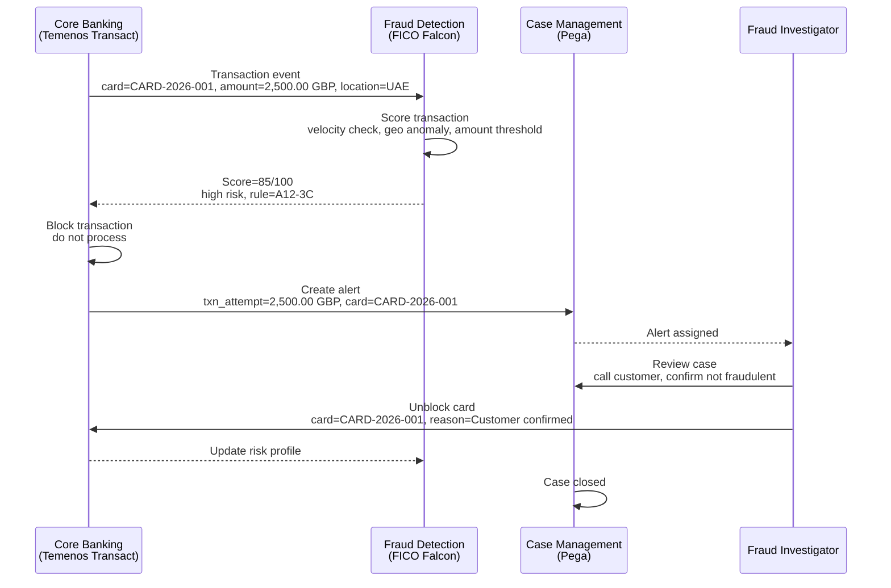
```mermaid
sequenceDiagram
    participant CBS as Core Banking<br/>(Temenos Transact)
    participant FR as Fraud Detection<br/>(FICO Falcon)
    participant CM as Case Management<br/>(Pega)
    participant FI as Fraud Investigator
    CBS->>FR: Transaction event<br/>card=CARD-2026-001, amount=2,500.00 GBP, location=UAE
    FR->>FR: Score transaction<br/>velocity check, geo anomaly, amount threshold
    FR-->>CBS: Score=85/100<br/>high risk, rule=A12-3C
    CBS->>CBS: Block transaction<br/>do not process
    CBS->>CM: Create alert<br/>txn_attempt=2,500.00 GBP, card=CARD-2026-001
    CM-->>FI: Alert assigned
    FI->>CM: Review case<br/>call customer, confirm not fraudulent
    FI->>CBS: Unblock card<br/>card=CARD-2026-001, reason=Customer confirmed
    CBS-->>FR: Update risk profile
    CM->>CM: Case closed
```

#### Integration Details

| Flow | Entity | Info Flow | Source | Target | Source Conn | Target Conn | Pattern | Complexity |
|------|--------|-----------|--------|--------|-------------|-------------|---------|------------|
| Fraud Detection | Transaction | SendTransactionEvent | Core Banking (Temenos Transact) | Fraud Detection (FICO Falcon) | Temenos REST API | Falcon API (ISO 8583) | API-led (Real-time) | High |
| Fraud Detection | Alert | CreateFraudAlert | Core Banking (Temenos Transact) | Case Management (Pega) | Temenos REST API | Pega REST API (OAuth2) | Event-driven | Medium |
| Fraud Detection | Unblock | UnblockCard | Case Management (Pega) | Core Banking (Temenos Transact) | Pega REST API (OAuth2) | Temenos REST API | API-led (Real-time) | Simple |

#### Acceptance Criteria

| Flow | Entity | Acceptance Criterion | Expected Outcome |
|------|--------|---------------------|------------------|
| Fraud Detection | Transaction | Transaction event sent to FICO Falcon for scoring in real-time | Score returned in <100ms; high-risk transactions blocked before completion |
| Fraud Detection | Alert | Pega case created for transactions exceeding fraud threshold | Alert created with all context; assigned to investigator queue; SLA 30 minutes for high risk |
| Fraud Detection | Unblock | Card unblocked by fraud investigator after customer confirms authenticity | Card status restored to Active within 60 seconds of investigator action |

---

### 6.2 AML/Sanctions Screening

**Description:** Customer and transaction screening against sanctions lists, PEP databases, adverse media. Alerts generated for compliance review.

**Actors:** Compliance Officer, Risk Analyst  
**Systems:** AML System (Oracle FCCM), Sanctions Screening (WorldCheck), Case Management (Pega), Core Banking (Temenos Transact)

#### Sequence Diagram

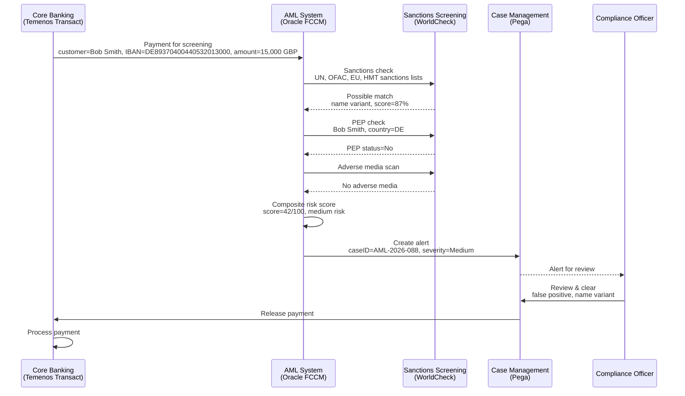
```mermaid
sequenceDiagram
    participant CBS as Core Banking<br/>(Temenos Transact)
    participant AML as AML System<br/>(Oracle FCCM)
    participant SCR as Sanctions Screening<br/>(WorldCheck)
    participant CM as Case Management<br/>(Pega)
    participant CO as Compliance Officer
    CBS->>AML: Payment for screening<br/>customer=Bob Smith, IBAN=DE89370400440532013000, amount=15,000 GBP
    AML->>SCR: Sanctions check<br/>UN, OFAC, EU, HMT sanctions lists
    SCR-->>AML: Possible match<br/>name variant, score=87%
    AML->>SCR: PEP check<br/>Bob Smith, country=DE
    SCR-->>AML: PEP status=No
    AML->>SCR: Adverse media scan
    SCR-->>AML: No adverse media
    AML->>AML: Composite risk score<br/>score=42/100, medium risk
    AML->>CM: Create alert<br/>caseID=AML-2026-088, severity=Medium
    CM-->>CO: Alert for review
    CO->>CM: Review & clear<br/>false positive, name variant
    CM->>CBS: Release payment
    CBS->>CBS: Process payment
```

#### Integration Details

| Flow | Entity | Info Flow | Source | Target | Source Conn | Target Conn | Pattern | Complexity |
|------|--------|-----------|--------|--------|-------------|-------------|---------|------------|
| AML Screening | Payment | ScreenPayment | Core Banking (Temenos Transact) | AML System (Oracle FCCM) | Temenos REST API | Oracle FCCM API (SOAP) | API-led (Real-time) | High |
| AML Screening | Sanctions | CheckSanctionsLists | AML System (Oracle FCCM) | Sanctions Screening (WorldCheck) | Oracle FCCM API | WorldCheck API (SOAP) | API-led (Real-time) | High |
| AML Screening | Alert | CreateAMLAlert | AML System (Oracle FCCM) | Case Management (Pega) | Oracle FCCM API | Pega REST API (OAuth2) | Event-driven | Medium |
| AML Screening | Release | ReleasePayment | Case Management (Pega) | Core Banking (Temenos Transact) | Pega REST API (OAuth2) | Temenos REST API | API-led (Real-time) | Simple |

#### Acceptance Criteria

| Flow | Entity | Acceptance Criterion | Expected Outcome |
|------|--------|---------------------|------------------|
| AML Screening | Payment | Payment sent to Oracle FCCM for AML screening before processing | Payment held in pending state; released only after compliance clearance |
| AML Screening | Sanctions | Payment checked against UN, OFAC, EU, and HMT sanctions lists | Clear matches >=90% blocked; false positive process allows compliance override |
| AML Screening | Alert | AML alert created in Pega for compliance officer review | Alert with risk score and match details; SLA for review: 24 hours for medium risk |
| AML Screening | Release | Payment released by compliance officer after false positive determination | Payment processed within 60 seconds of release; audit trail of release decision logged |

---

### 6.3 Regulatory Reporting

**Description:** Bank generates regulatory reports (COREP, FINREP, Basel IV, PSD2). Data extracted from source systems, transformed, validated, submitted to regulators.

**Actors:** Compliance Officer, Finance Manager  
**Systems:** Regulatory Reporting (AxiomSL), Core Banking (Temenos Transact), Lending System (nCino), Treasury System (Murex), Regulator Portal (PRA/ECB)

#### Sequence Diagram

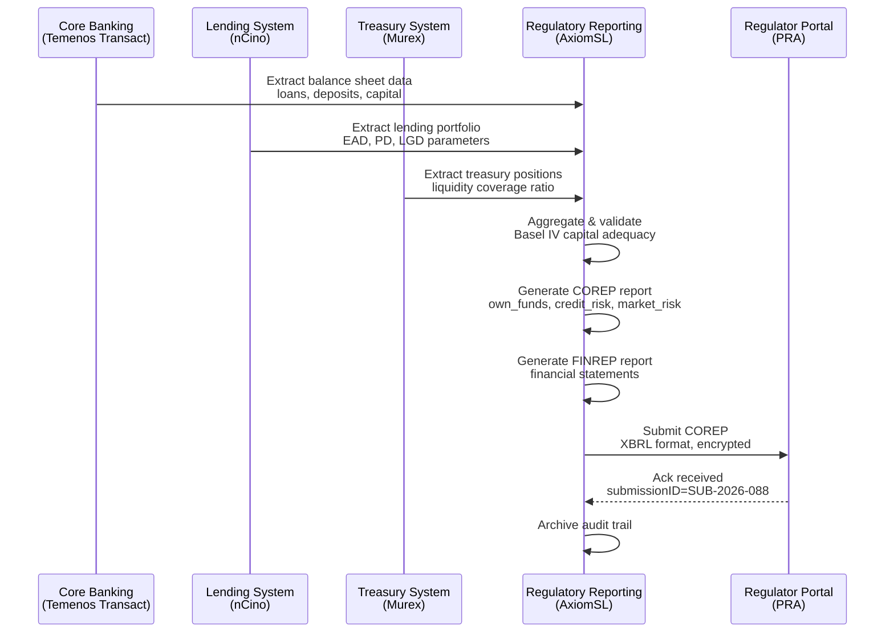
```mermaid
sequenceDiagram
    participant CBS as Core Banking<br/>(Temenos Transact)
    participant LEN as Lending System<br/>(nCino)
    participant TR as Treasury System<br/>(Murex)
    participant RR as Regulatory Reporting<br/>(AxiomSL)
    participant REG as Regulator Portal<br/>(PRA)
    CBS->>RR: Extract balance sheet data<br/>loans, deposits, capital
    LEN->>RR: Extract lending portfolio<br/>EAD, PD, LGD parameters
    TR->>RR: Extract treasury positions<br/>liquidity coverage ratio
    RR->>RR: Aggregate & validate<br/>Basel IV capital adequacy
    RR->>RR: Generate COREP report<br/>own_funds, credit_risk, market_risk
    RR->>RR: Generate FINREP report<br/>financial statements
    RR->>REG: Submit COREP<br/>XBRL format, encrypted
    REG-->>RR: Ack received<br/>submissionID=SUB-2026-088
    RR->>RR: Archive audit trail
```

#### Integration Details

| Flow | Entity | Info Flow | Source | Target | Source Conn | Target Conn | Pattern | Complexity |
|------|--------|-----------|--------|--------|-------------|-------------|---------|------------|
| Regulatory Reporting | Balance Sheet | ExtractBalanceSheet | Core Banking (Temenos Transact) | Regulatory Reporting (AxiomSL) | Temenos ODBC | AxiomSL JDBC | Batch (ETL) | Medium |
| Regulatory Reporting | Lending Data | ExtractLendingPortfolio | Lending System (nCino) | Regulatory Reporting (AxiomSL) | nCino REST API | AxiomSL REST API | Batch (ETL) | Medium |
| Regulatory Reporting | Treasury Data | ExtractTreasuryPositions | Treasury System (Murex) | Regulatory Reporting (AxiomSL) | Murex API (SFTP) | AxiomSL SFTP | Batch (Scheduled) | High |
| Regulatory Reporting | Submission | SubmitToRegulator | Regulatory Reporting (AxiomSL) | Regulator Portal (PRA) | AxiomSL XBRL | PRA Gateway (SFTP) | Batch (Scheduled) | High |

#### Acceptance Criteria

| Flow | Entity | Acceptance Criterion | Expected Outcome |
|------|--------|---------------------|------------------|
| Regulatory Reporting | Balance Sheet | Balance sheet data extracted from Temenos Transact to AxiomSL | Extract completed for all entities; data validated against GL; discrepancies <0.01% |
| Regulatory Reporting | Lending Data | Lending portfolio data (EAD, PD, LGD) extracted from nCino | All active loans included; risk parameters match source system |
| Regulatory Reporting | Treasury Data | Treasury position data extracted from Murex for liquidity reporting | LCR and NSFR calculated correctly; intraday positions included |
| Regulatory Reporting | Submission | COREP/FINREP reports submitted to regulator via XBRL | Regulator acknowledgment received; submission timestamp logged; retry on failure with backoff |

---

# Channels & Digital Banking  - `BC001` `BC003` `BC002`  - `BC001` `BC003` `BC002`

Omnichannel banking delivery across internet banking, mobile apps, and physical branch network. Consistent experience, channel orchestration, and integration with core systems.

### 7.1 Internet Banking

**Description:** Customer logs in, views dashboard, performs banking activities. System authenticates, presents consolidated view, processes requests.

**Actors:** Customer, Digital Team  
**Systems:** Internet Banking (Backbase), Core Banking (Temenos Transact), CRM (Salesforce Financial Services), Content Management (Adobe AEM), Analytics (Google Analytics)

#### Sequence Diagram

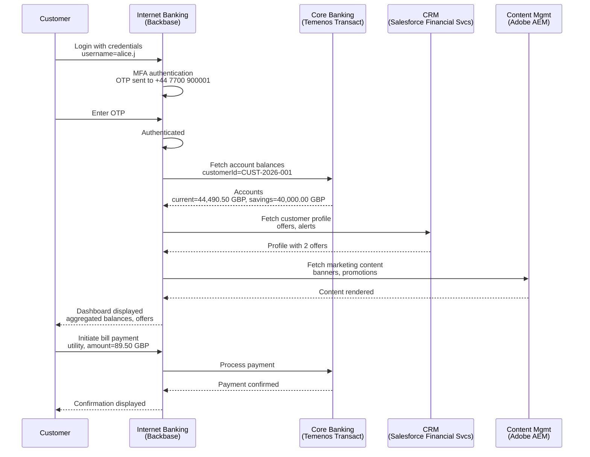
```mermaid
sequenceDiagram
    participant C as Customer
    participant IB as Internet Banking<br/>(Backbase)
    participant CBS as Core Banking<br/>(Temenos Transact)
    participant CRM as CRM<br/>(Salesforce Financial Svcs)
    participant CMS as Content Mgmt<br/>(Adobe AEM)
    C->>IB: Login with credentials<br/>username=alice.j
    IB->>IB: MFA authentication<br/>OTP sent to +44 7700 900001
    C->>IB: Enter OTP
    IB->>IB: Authenticated
    IB->>CBS: Fetch account balances<br/>customerId=CUST-2026-001
    CBS-->>IB: Accounts<br/>current=44,490.50 GBP, savings=40,000.00 GBP
    IB->>CRM: Fetch customer profile<br/>offers, alerts
    CRM-->>IB: Profile with 2 offers
    IB->>CMS: Fetch marketing content<br/>banners, promotions
    CMS-->>IB: Content rendered
    IB-->>C: Dashboard displayed<br/>aggregated balances, offers
    C->>IB: Initiate bill payment<br/>utility, amount=89.50 GBP
    IB->>CBS: Process payment
    CBS-->>IB: Payment confirmed
    IB-->>C: Confirmation displayed
```

#### Integration Details

| Flow | Entity | Info Flow | Source | Target | Source Conn | Target Conn | Pattern | Complexity |
|------|--------|-----------|--------|--------|-------------|-------------|---------|------------|
| Internet Banking | Authentication | AuthenticateUser | Internet Banking (Backbase) | Internet Banking (Backbase) | Internal | Internal | API-led (Real-time) | Simple |
| Internet Banking | Balances | FetchAccountBalances | Internet Banking (Backbase) | Core Banking (Temenos Transact) | Backbase REST API | Temenos REST API (API Key) | API-led (Real-time) | Medium |
| Internet Banking | Profile | GetCustomerProfile | Internet Banking (Backbase) | CRM (Salesforce Financial Services) | Backbase REST API | Salesforce REST API (OAuth2) | API-led (Real-time) | Simple |
| Internet Banking | Content | FetchMarketingContent | Internet Banking (Backbase) | Content Mgmt (Adobe AEM) | Backbase REST API | AEM REST API | API-led (Real-time) | Simple |

#### Acceptance Criteria

| Flow | Entity | Acceptance Criterion | Expected Outcome |
|------|--------|---------------------|------------------|
| Internet Banking | Authentication | User authenticated via MFA (OTP) with correct credentials | Valid credentials -> access granted; invalid OTP -> locked after 3 attempts |
| Internet Banking | Balances | Account balances fetched from Temenos for all customer accounts | All accounts displayed; balances updated to real-time; masking for inactive accounts |
| Internet Banking | Profile | Customer profile and offers retrieved from Salesforce CRM | Personalized offers displayed; profile data matches CRM source |
| Internet Banking | Content | Marketing content fetched from Adobe AEM CMS | Content rendered correctly; A/B variants served per customer segment |

---

### 7.2 Mobile Banking

**Description:** Customer uses mobile app. Biometric authentication, push notifications, mobile check deposit, card management.

**Actors:** Customer, Digital Team  
**Systems:** Mobile App (Backbase), Core Banking (Temenos Transact), Push Notification (Firebase/APNs), Cheque Processing

#### Sequence Diagram

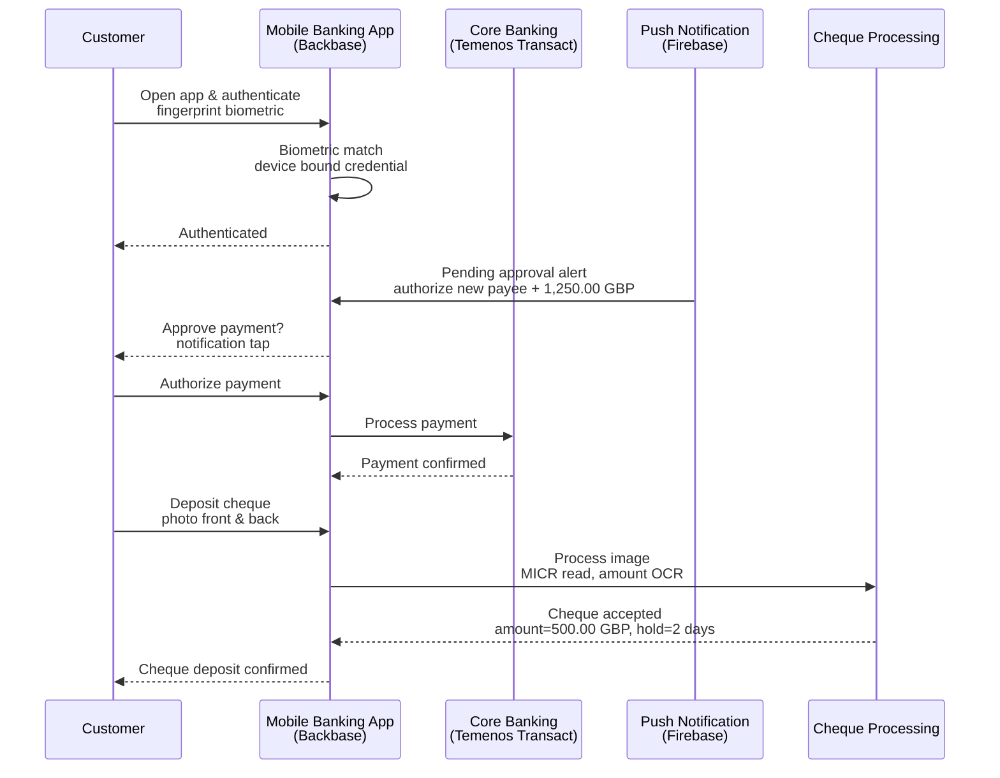
```mermaid
sequenceDiagram
    participant C as Customer
    participant MB as Mobile Banking App<br/>(Backbase)
    participant CBS as Core Banking<br/>(Temenos Transact)
    participant PUSH as Push Notification<br/>(Firebase)
    participant CHQ as Cheque Processing
    C->>MB: Open app & authenticate<br/>fingerprint biometric
    MB->>MB: Biometric match<br/>device bound credential
    MB-->>C: Authenticated
    PUSH->>MB: Pending approval alert<br/>authorize new payee + 1,250.00 GBP
    MB-->>C: Approve payment?<br/>notification tap
    C->>MB: Authorize payment
    MB->>CBS: Process payment
    CBS-->>MB: Payment confirmed
    C->>MB: Deposit cheque<br/>photo front & back
    MB->>CHQ: Process image<br/>MICR read, amount OCR
    CHQ-->>MB: Cheque accepted<br/>amount=500.00 GBP, hold=2 days
    MB-->>C: Cheque deposit confirmed
```

#### Integration Details

| Flow | Entity | Info Flow | Source | Target | Source Conn | Target Conn | Pattern | Complexity |
|------|--------|-----------|--------|--------|-------------|-------------|---------|------------|
| Mobile Banking | Authentication | BiometricAuth | Mobile Banking App (Backbase) | Mobile Banking App (Backbase) | Device Biometric API | Internal | API-led (Real-time) | Simple |
| Mobile Banking | Notification | SendPushAlert | Push Notification (Firebase) | Mobile Banking App (Backbase) | Firebase Cloud Messaging | Backbase Mobile SDK | Event-driven | Simple |
| Mobile Banking | Payment | AuthorizePayment | Mobile Banking App (Backbase) | Core Banking (Temenos Transact) | Backbase REST API | Temenos REST API (API Key) | API-led (Real-time) | Medium |
| Mobile Banking | Cheque Deposit | ProcessChequeImage | Mobile Banking App (Backbase) | Cheque Processing | Backbase REST API | Cheque API (Image) | API-led (Real-time) | Medium |

#### Acceptance Criteria

| Flow | Entity | Acceptance Criterion | Expected Outcome |
|------|--------|---------------------|------------------|
| Mobile Banking | Authentication | Biometric authentication (fingerprint/face) matches device-bound credential | Authentication completes <1 second; biometric mismatch shows PIN fallback |
| Mobile Banking | Notification | Push notification sent via Firebase for pending payment approval | Notification delivered within 5 seconds; tap opens correct approval screen |
| Mobile Banking | Payment | Payment authorized and processed via mobile approval flow | Payment confirmed; transaction appears in history; notification sent |
| Mobile Banking | Cheque Deposit | Cheque image processed with MICR read and amount OCR | MICR and OCR accuracy >99%; cheque accepted with 2-day hold applied |

---

### 7.3 Branch Banking (Teller)

**Description:** Customer visits branch. Teller processes cash/cheque transactions. Branch system integrates with core banking for real-time balance and transaction posting.

**Actors:** Customer, Branch Staff, Teller  
**Systems:** Branch Teller (Fiserv DNA), Queue Management (Qmatic), Core Banking (Temenos Transact), CRM (Salesforce Financial Services)

#### Sequence Diagram

```mermaid
sequenceDiagram
    participant C as Customer
    participant QM as Queue Management<br/>(Qmatic)
    participant TEL as Branch Teller<br/>(Fiserv DNA)
    participant CBS as Core Banking<br/>(Temenos Transact)
    participant CRM as CRM<br/>(Salesforce Financial Svcs)
    C->>QM: Check in at kiosk<br/>customerId=CUST-2026-001
    QM-->>C: Ticket #42, estimated wait 3 min
    QM->>TEL: Customer assigned to teller
    TEL->>TEL: Identify customer
    TEL->>CBS: View customer accounts<br/>ACCT-4001-2026
    CBS-->>TEL: Balance=44,490.50 GBP
    C->>TEL: Deposit cash<br/>amount=1,000.00 GBP
    TEL->>CBS: Post cash deposit<br/>credit ACCT-4001-2026, +1,000.00 GBP
    CBS-->>TEL: Balance updated=45,490.50 GBP
    TEL-->>C: Receipt printed
    TEL->>CRM: Log interaction<br/>type=cash_deposit, amount=1,000.00
    CRM-->>TEL: Cross-sell suggestion<br/>term deposit offer, 4.2% p.a.
    TEL->>C: Offer term deposit<br/>10,000 GBP at 4.2%, 12 months
```

#### Integration Details

| Flow | Entity | Info Flow | Source | Target | Source Conn | Target Conn | Pattern | Complexity |
|------|--------|-----------|--------|--------|-------------|-------------|---------|------------|
| Branch Banking | Queue | CheckInCustomer | Queue Management (Qmatic) | Branch Teller (Fiserv DNA) | Qmatic API | Fiserv Teller API (REST) | Event-driven | Simple |
| Branch Banking | Transaction | PostCashDeposit | Branch Teller (Fiserv DNA) | Core Banking (Temenos Transact) | Fiserv Teller API | Temenos REST API (API Key) | API-led (Real-time) | Simple |
| Branch Banking | Interaction | LogCustomerInteraction | Branch Teller (Fiserv DNA) | CRM (Salesforce Financial Services) | Fiserv REST API | Salesforce REST API (OAuth2) | API-led (Real-time) | Simple |
| Branch Banking | Cross-Sell | GetCrossSellOffer | Branch Teller (Fiserv DNA) | CRM (Salesforce Financial Services) | Fiserv REST API | Salesforce REST API (OAuth2) | API-led (Real-time) | Medium |

#### Acceptance Criteria

| Flow | Entity | Acceptance Criterion | Expected Outcome |
|------|--------|---------------------|------------------|
| Branch Banking | Queue | Customer checked in at Qmatic kiosk and assigned to next available teller | Ticket issued; estimated wait time displayed; teller assignment within <5 minutes |
| Branch Banking | Transaction | Cash deposit posted to customer account in real-time via teller system | Balance updated; receipt generated with transaction reference; teller cash drawer reconciled |
| Branch Banking | Interaction | Customer interaction logged in Salesforce CRM with type and amount | Interaction record created; customer 360 view updated |
| Branch Banking | Cross-Sell | CRM returns cross-sell suggestion based on customer profile and transaction | Offer displayed to teller within 1 second; offer accepted/rejected tracked |

---

# Finance, Treasury & Settlement  - `BC010` `BC014` `BC061` `BC062`  - `BC010` `BC014` `BC061` `BC062`

Financial accounting, treasury operations, interbank settlement, and reconciliation across the entire banking enterprise.

### 8.1 Nostro/Vostro Reconciliation

**Description:** Bank reconciles nostro (domestic bank's accounts held at foreign banks) and vostro (foreign bank's accounts held at domestic bank) positions daily.

**Actors:** Settlement Operations, Finance Manager  
**Systems:** SWIFT Alliance Gateway, Reconciliation Engine (SmartStream/Duco), Core Banking (Temenos Transact), General Ledger (SAP)

#### Sequence Diagram

```mermaid
sequenceDiagram
    participant SW as SWIFT Alliance<br/>(Correspondent Bank)
    participant REC as Reconciliation Engine<br/>(SmartStream)
    participant CBS as Core Banking<br/>(Temenos Transact)
    participant GL as General Ledger<br/>(SAP)
    participant OPS as Settlement Operations
    SW->>REC: Send MT950 statement<br/>nostro account, date=2026-07-05
    REC->>REC: Load statement<br/>125 transactions, total=4,250,000.00 GBP
    CBS->>REC: Internal transactions<br/>matching period=2026-07-05
    REC->>REC: Auto-match<br/>122 matched, 3 unmatched
    REC-->>OPS: Exception report<br/>3 unmatched items, total=12,500.00 GBP
    OPS->>REC: Manual match<br/>investigate discrepancies
    REC-->>GL: Post adjustments<br/>journal entries for matched items
    GL-->>REC: Adjustments posted
    REC->>SW: Send MT940 response<br/>confirmed balance
    REC->>REC: Generate reconciliation report<br/>breakdown=99.5% matched
```

#### Integration Details

| Flow | Entity | Info Flow | Source | Target | Source Conn | Target Conn | Pattern | Complexity |
|------|--------|-----------|--------|--------|-------------|-------------|---------|------------|
| Nostro Reconciliation | Statement | ReceiveMT950 | SWIFT Alliance (Correspondent) | Reconciliation Engine (SmartStream) | SWIFT MT950 | SmartStream API (REST) | Batch (Scheduled) | High |
| Nostro Reconciliation | Transactions | LoadInternalTxns | Core Banking (Temenos Transact) | Reconciliation Engine (SmartStream) | Temenos ODBC | SmartStream JDBC | Batch (ETL) | Medium |
| Nostro Reconciliation | Adjustments | PostAdjustments | Reconciliation Engine (SmartStream) | General Ledger (SAP) | SmartStream REST API | SAP API (SOAP) | Event-driven | Medium |
| Nostro Reconciliation | Response | SendMT940 | Reconciliation Engine (SmartStream) | SWIFT Alliance (Correspondent) | SmartStream API | SWIFT MT940 | Batch (Scheduled) | Medium |

#### Acceptance Criteria

| Flow | Entity | Acceptance Criterion | Expected Outcome |
|------|--------|---------------------|------------------|
| Nostro Reconciliation | Statement | SWIFT MT950 statement received from correspondent bank and loaded | Statement parsed correctly; all 125 transactions loaded; unmatched items <5% |
| Nostro Reconciliation | Transactions | Internal transactions loaded from Temenos for matching period | All internal txns loaded; date range matches statement period |
| Nostro Reconciliation | Adjustments | Unmatched items manually reviewed and adjustment journals posted to SAP GL | Adjustment entries posted; GL impact correctly calculated; audit trail maintained |
| Nostro Reconciliation | Response | MT940 response sent to correspondent bank with confirmed balance | Balance confirmed within tolerance; discrepancies escalated to treasury |

---

### 8.2 Treasury & Liquidity Management

**Description:** Treasury monitors liquidity position, executes money market trades, manages FX exposure, ensures regulatory liquidity ratios met.

**Actors:** Treasury Analyst, Finance Manager  
**Systems:** Treasury System (Murex), Core Banking (Temenos Transact), FX Matching Platform (FXall), SWIFT Alliance, General Ledger (SAP)

#### Sequence Diagram

```mermaid
sequenceDiagram
    participant CBS as Core Banking<br/>(Temenos Transact)
    participant TR as Treasury System<br/>(Murex)
    participant FX as FX Matching<br/>(FXall)
    participant SW as SWIFT Alliance
    participant GL as General Ledger<br/>(SAP)
    CBS->>TR: Position data feed<br/>cash_balance=12,500,000 GBP, forecast=3d
    TR->>TR: Calculate liquidity gaps<br/>LCR=145%, NSFR=112%
    TR->>TR: Identify FX exposure<br/>EUR/USD open=5,000,000 EUR
    Treasury Analyst->>TR: Execute FX trade<br/>sell 5M EUR, buy 5.75M USD
    TR->>FX: Submit FX order<br/>EUR/USD, spot, 5M EUR
    FX-->>TR: Trade executed<br/>rate=1.15, value_date=2026-07-08
    TR->>SW: Send confirmation MT300
    SW-->>TR: Confirmation matched
    TR->>GL: Post FX P&L<br/>realized P&L=12,500 GBP
    TR->>GL: Post liquidity report<br/>LCR=145%, NSFR=112%
```

#### Integration Details

| Flow | Entity | Info Flow | Source | Target | Source Conn | Target Conn | Pattern | Complexity |
|------|--------|-----------|--------|--------|-------------|-------------|---------|------------|
| Treasury Management | Position | ReceivePositionData | Core Banking (Temenos Transact) | Treasury System (Murex) | Temenos REST API | Murex API (REST) | Event-driven | Medium |
| Treasury Management | FX Trade | ExecuteFXOrder | Treasury System (Murex) | FX Matching (FXall) | Murex API | FXall API (FIX) | API-led (Real-time) | High |
| Treasury Management | Confirmation | SendMT300 | Treasury System (Murex) | SWIFT Alliance | Murex API (MT300) | SWIFT Alliance | API-led (Real-time) | Medium |
| Treasury Management | Liquidity | PostLiquidityReport | Treasury System (Murex) | General Ledger (SAP) | Murex API (REST) | SAP API (SOAP) | Batch (Scheduled) | Medium |

#### Acceptance Criteria

| Flow | Entity | Acceptance Criterion | Expected Outcome |
|------|--------|---------------------|------------------|
| Treasury Management | Position | Cash position data received from Temenos Transact into Murex | Position updated in real-time; forecast horizon configurable (1-30 days) |
| Treasury Management | FX Trade | FX order submitted to FXall and executed at quoted rate | Trade executed within 10 seconds; rate within 0.1% of quoted; confirmation received |
| Treasury Management | Confirmation | SWIFT MT300 confirmation sent and matched with counterparty | Confirmation matched; unmatched confirmations escalated within 1 hour |
| Treasury Management | Liquidity | LCR and NSFR liquidity ratios calculated and posted to SAP GL | Ratios within regulatory limits; breach alert generated if below threshold |

---

### 8.3 End-of-Day Settlement

**Description:** Bank settles all payment obligations, net positions submitted to RTGS, finality achieved, GL updated.

**Actors:** Settlement Operations, Treasury  
**Systems:** Payment Hub (Volante), RTGS System (TARGET2/Bank of England), Core Banking (Temenos Transact), General Ledger (SAP), Reconciliation Engine (SmartStream)

#### Sequence Diagram

```mermaid
sequenceDiagram
    participant PH as Payment Hub<br/>(Volante)
    participant RTGS as RTGS System<br/>(TARGET2)
    participant CBS as Core Banking<br/>(Temenos Transact)
    participant GL as General Ledger<br/>(SAP)
    participant REC as Reconciliation Engine<br/>(SmartStream)
    PH->>PH: Aggregate net positions<br/>total_outgoing=85,000,000 GBP, incoming=72,500,000 GBP
    PH->>RTGS: Submit net settlement<br/>multilateral net position=-12,500,000 GBP
    RTGS->>RTGS: Process settlement<br/>queue, collateral check, finality
    RTGS-->>PH: Settlement finality<br/>timestamp=2026-07-06T18:00:00Z
    PH->>CBS: Post settlement entries<br/>debit/credit positions
    CBS-->>PH: Settlement posted
    PH->>GL: Post GL journal<br/>EOD settlement entries
    GL-->>PH: GL updated
    PH->>REC: Settlement transactions
    REC->>REC: Match settled items<br/>all matched, no breaks
    PH->>PH: Generate EOD report<br/>settlement summary
```

#### Integration Details

| Flow | Entity | Info Flow | Source | Target | Source Conn | Target Conn | Pattern | Complexity |
|------|--------|-----------|--------|--------|-------------|-------------|---------|------------|
| EOD Settlement | Net Position | SubmitNetSettlement | Payment Hub (Volante) | RTGS System (TARGET2) | Volante API (ISO 20022) | TARGET2 API (ISO 20022) | Batch (Scheduled) | High |
| EOD Settlement | Posting | PostSettlementEntries | Payment Hub (Volante) | Core Banking (Temenos Transact) | Volante REST API | Temenos REST API (API Key) | API-led (Real-time) | Medium |
| EOD Settlement | GL | PostGLJournal | Payment Hub (Volante) | General Ledger (SAP) | Volante REST API | SAP API (SOAP) | API-led (Real-time) | Medium |
| EOD Settlement | Matching | MatchSettledItems | Payment Hub (Volante) | Reconciliation Engine (SmartStream) | Volante REST API | SmartStream API (REST) | Event-driven | Simple |

#### Acceptance Criteria

| Flow | Entity | Acceptance Criterion | Expected Outcome |
|------|--------|---------------------|------------------|
| EOD Settlement | Net Position | Multilateral net position calculated and submitted to TARGET2 RTGS | Net position calculated correctly; submission before cut-off time |
| EOD Settlement | Posting | Settlement entries posted to Temenos core banking | All entries posted; debit/credit match net position; rejected entries investigated |
| EOD Settlement | GL | End-of-day GL journal posted in SAP | GL balanced; suspense accounts zero; variances <0.001% |
| EOD Settlement | Matching | Settled transactions matched by SmartStream reconciliation engine | 100% matched; any breaks investigated and resolved before next day opening |

---
