# Banking Process Flows — BIAN Capability Model Reference

> Generated on 2026-07-06 | Domain: Banking | Framework: BIAN (Banking Industry Architecture Network)

## BIAN Capability Model Reference

The BIAN (Banking Industry Architecture Network) Capability Model defines the standard business capabilities for banking institutions. The table below lists all relevant capabilities grouped by domain. Each process flow in this document is mapped to its relevant BIAN capability codes.

### Channels

| Capability | Code | Description |
|-----------|------|-------------|
| **Channel Activity Analysis** | `BC001` | Analyze customer channel usage and preferences |
| **Contact Center** | `BC002` | Manage omnichannel customer interactions including voice, email, chat |
| **Channel Management** | `BC003` | Manage all customer interaction channels consistently |
| **Internet Banking** | `BC004` | Deliver banking services through internet channel |
| **Mobile Banking** | `BC005` | Deliver banking services through mobile devices |

### Customers

| Capability | Code | Description |
|-----------|------|-------------|
| **Customer Onboarding** | `BC032` | Manage end-to-end customer onboarding and KYC processes |
| **Customer Access Entitlement** | `BC031` | Manage customer authentication, authorization, and entitlements |
| **Customer Relationship Management** | `BC033` | Manage customer data, interactions, and relationships |

### Products

| Capability | Code | Description |
|-----------|------|-------------|
| **Payments** | `BC060` | Process domestic and cross-border payments across all schemes |
| **Payment Execution** | `BC061` | Execute payment instructions including validation and settlement |
| **Correspondent Banking** | `BC062` | Manage correspondent banking relationships and nostro/vostro accounts |
| **Trade Finance** | `BC063` | Manage letters of credit, guarantees, and trade finance instruments |
| **Lending** | `BC070` | Originate, underwrite, and service loan products |
| **Cards** | `BC071` | Manage card lifecycle from issuance to transaction processing to disputes |
| **Deposits** | `BC072` | Manage current and savings deposit accounts |
| **Savings** | `BC073` | Manage term deposits and savings products including sweep accounts |
| **Wealth Management** | `BC074` | Manage client investment portfolios, financial planning, and advisory services |
| **Asset Management** | `BC075` | Manage institutional assets, fund management, and investment strategies |

### Operations

| Capability | Code | Description |
|-----------|------|-------------|
| **Collections & Recovery** | `BC077` | Manage debt collection, recovery, forbearance, and charged-off accounts |

### Finance & Risk Management

| Capability | Code | Description |
|-----------|------|-------------|
| **Regulatory Reporting** | `BC012` | Generate and submit regulatory reports to authorities |
| **AML & Sanctions** | `BC013` | Screen against AML and sanctions lists |
| **Treasury Management** | `BC014` | Manage liquidity, funding, and treasury operations |

### Business Management

| Capability | Code | Description |
|-----------|------|-------------|
| **Fraud Monitoring** | `BC023` | Monitor and detect fraudulent transactions and activities |
| **Fraud Management** | `BC024` | Manage fraud cases, investigations, and resolutions |
| **Channel Activity Analysis** | `BC034` | Analyze contact center performance and customer behavior patterns |

### Resource Management

| Capability | Code | Description |
|-----------|------|-------------|
| **Reconciliation** | `BC049` | Reconcile transactions and positions across internal and external systems |
| **Settlement** | `BC010` | Manage settlement of financial transactions across clearing systems |

---

## Table of Contents

- [1: Customer Onboarding & Account Management](#1-customer-onboarding--account-management)
  - [1.1 New Customer Onboarding & KYC](#11-new-customer-onboarding--kyc)
  - [1.2 Retail Account Opening](#12-retail-account-opening)
  - [1.3 Corporate Account Opening](#13-corporate-account-opening)
- [2: Payments & Transfers](#2-payments--transfers)
  - [2.1 Domestic Payment (SEPA/ACH)](#21-domestic-payment-sepaach)
  - [2.2 Cross-Border Payment (SWIFT)](#22-cross-border-payment-swift)
  - [2.3 Real-Time Payment (Faster Payments)](#23-real-time-payment-faster-payments)
  - [2.4 Batch Payment Processing](#24-batch-payment-processing)
- [3: Lending & Credit Management](#3-lending--credit-management)
  - [3.1 Retail Loan Origination](#31-retail-loan-origination)
  - [3.2 Mortgage Lending](#32-mortgage-lending)
  - [3.3 Credit Assessment & Scoring](#33-credit-assessment--scoring)
  - [3.4 Loan Servicing & Collections](#34-loan-servicing--collections)
- [4: Cards Management](#4-cards-management)
  - [4.1 Card Issuance](#41-card-issuance)
  - [4.2 Card Transaction Processing](#42-card-transaction-processing)
  - [4.3 Card Dispute Management](#43-card-dispute-management)
  - [4.4 Card Rewards & Loyalty](#44-card-rewards--loyalty)
- [5: Deposits & Savings Products](#5-deposits--savings-products)
  - [5.1 Account Operations (Current/Savings)](#51-account-operations-currentsavings)
  - [5.2 Term Deposits](#52-term-deposits)
  - [5.3 Sweep & Investment Products](#53-sweep--investment-products)
  - [5.4 Overdraft Management](#54-overdraft-management)
- [6: Risk & Compliance](#6-risk--compliance)
  - [6.1 Fraud Detection & Prevention](#61-fraud-detection--prevention)
  - [6.2 AML/Sanctions Screening](#62-amlsanctions-screening)
  - [6.3 Regulatory Reporting](#63-regulatory-reporting)
- [7: Channels & Digital Banking](#7-channels--digital-banking)
  - [7.1 Internet Banking](#71-internet-banking)
  - [7.2 Mobile Banking](#72-mobile-banking)
  - [7.3 Branch Banking (Teller)](#73-branch-banking-teller)
- [8: Finance, Treasury & Settlement](#8-finance-treasury--settlement)
  - [8.1 Nostro/Vostro Reconciliation](#81-nostrovostro-reconciliation)
  - [8.2 Treasury & Liquidity Management](#82-treasury--liquidity-management)
  - [8.3 End-of-Day Settlement](#83-end-of-day-settlement)
- [9: Trade Finance](#9-trade-finance)
  - [9.1 Letter of Credit Issuance](#91-letter-of-credit-issuance)
  - [9.2 Bank Guarantee Issuance](#92-bank-guarantee-issuance)
  - [9.3 Invoice Financing](#93-invoice-financing)
- [10: Wealth Management](#10-wealth-management)
  - [10.1 Portfolio Management & Rebalancing](#101-portfolio-management--rebalancing)
  - [10.2 Financial Advisory & Planning](#102-financial-advisory--planning)
  - [10.3 Asset Allocation & Rebalancing Automation](#103-asset-allocation--rebalancing-automation)
- [11: Contact Center](#11-contact-center)
  - [11.1 Omnichannel Customer Service](#111-omnichannel-customer-service)
  - [11.2 IVR Self-Service & Automation](#112-ivr-self-service--automation)
  - [11.3 Complaints & Case Management](#113-complaints--case-management)
- [12: Collections & Recovery](#12-collections--recovery)
  - [12.1 Early Collections & Delinquency Management](#121-early-collections--delinquency-management)
  - [12.2 Late-Stage Recovery & Legal](#122-late-stage-recovery--legal)
  - [12.3 Restructuring & Forbearance](#123-restructuring--forbearance)

## Test Data

| Entity | Field | Value |
|--------|-------|-------|
| **Account** | account_id | ACCT-4001-2026 |
| | type | Current Account |
| | balance | 44,490.50 |
| | currency | GBP |
| | status | Active |
| | customer_id | CUST-2026-001 |
| **AuditTrail** | audit_id | AUD-2026-001 |
| | action | Payment Released |
| | performed_by | CO-2026-001 |
| | timestamp | 2026-07-06T11:45:00Z |
| | ip_address | 10.0.1.50 |
| **Beneficiary** | beneficiary_id | BEN-2026-001 |
| | name | John Smith |
| | account_number | GB29NWBK60161331926819 |
| | sort_code | 60-13-31 |
| **BeneficiaryBank** | bank_id | BB-2026-001 |
| | name | Deutsche Bank AG |
| | swift | DEUTDEFF |
| | country | Germany |
| **Branch** | branch_id | BR-001-LDN |
| | name | London City Branch |
| | sort_code | 60-13-31 |
| | region | London |
| **Campaign** | campaign_id | CMP-2026-001 |
| | name | Summer Loan Promotion |
| | channel | Email |
| | target_segment | Existing Customers |
| | status | Active |
| **Channel** | channel_id | CH-2026-001 |
| | name | Internet Banking |
| | type | Digital |
| | is_active | True |
| **Collateral** | collateral_id | COL-2026-001 |
| | type | Residential Property |
| | value | 355,000.00 |
| | lien_position | First |
| | loan_id | LN-2026-042 |
| **CollectionCase** | case_id | COL-2026-077 |
| | customer_id | CUST-2026-002 |
| | debt_amount | 3,450.00 |
| | days_past_due | 45 |
| | status | Active |
| | collector | EMP-2026-015 |
| **ComplianceAlert** | alert_id | ALT-2026-042 |
| | case_id | AML-2026-088 |
| | rule | STR-001 |
| | severity | Medium |
| | status | Investigating |
| **ComplianceCase** | case_id | AML-2026-088 |
| | type | Sanctions Screening |
| | status | Under Review |
| | severity | High |
| | related_entity | CUST-2026-002 |
| **Consent** | consent_id | CON-2026-001 |
| | customer_id | CUST-2026-001 |
| | type | Open Banking Data Share |
| | granted_date | 2026-07-01 |
| | expiry_date | 2027-07-01 |
| **CreditCard** | card_id | CARD-2026-001 |
| | card_number | ****-****-****-1234 |
| | type | Visa Platinum |
| | limit | 10,000.00 |
| | balance | 2,350.00 |
| | customer_id | CUST-2026-001 |
| **Customer** | customer_id | CUST-2026-001 |
| | name | Alice Johnson |
| | dob | 1990-03-15 |
| | email | alice.johnson@email.com |
| | phone | +44 7700 900001 |
| | address | 123 Main Street, London |
| **Employee** | employee_id | EMP-2026-011 |
| | name | Sarah Williams |
| | role | Relationship Manager |
| | branch_id | BR-001-LDN |
| **FXRate** | pair | GBP/EUR |
| | rate | 1.1500 |
| | bid | 1.1498 |
| | ask | 1.1502 |
| | timestamp | 2026-07-06T09:00:00Z |
| **Guarantee** | guarantee_id | GUA-2026-001 |
| | type | Bid Bond |
| | applicant | Acme Corp Ltd |
| | beneficiary | Govt Procurement |
| | amount | 50,000.00 |
| | expiry | 2026-10-15 |
| **InterestRate** | rate_id | IRT-2026-001 |
| | product | Savings Account |
| | rate | 2.75% p.a. |
| | effective_date | 2026-07-01 |
| **InvestmentFund** | fund_id | FND-2026-001 |
| | name | BlackRock Global Equity Fund |
| | nav | 245.80 |
| | currency | GBP |
| | fund_type | OEIC |
| **Invoice** | invoice_id | INV-2026-001 |
| | issuer | Global Exports GmbH |
| | amount | 150,000.00 |
| | currency | EUR |
| | due_date | 2026-09-30 |
| | status | Unpaid |
| **LetterOfCredit** | lc_id | LC-2026-001 |
| | applicant | Acme Corp Ltd |
| | beneficiary | Global Exports GmbH |
| | amount | 500,000.00 |
| | currency | USD |
| | type | Irrevocable Sight LC |
| | expiry | 2026-12-31 |
| | status | Issued |
| **Loan** | loan_id | LN-2026-042 |
| | type | Personal Loan |
| | amount | 25,000.00 |
| | term_months | 60 |
| | interest_rate | 6.9% APR |
| | status | Active |
| | customer_id | CUST-2026-001 |
| **LoanProduct** | loan_product_id | LP-HOL-001 |
| | name | Homeowner Loan |
| | min_amount | 5,000.00 |
| | max_amount | 100,000.00 |
| | interest_rate | 6.9% APR |
| | term_min_months | 12 |
| | term_max_months | 120 |
| **Merchant** | merchant_id | MER-2026-042 |
| | name | Harrods London |
| | mcc_code | 5311 |
| | acquirer | Worldpay |
| **Offer** | offer_id | OFF-2026-001 |
| | customer_id | CUST-2026-001 |
| | product | Personal Loan |
| | amount | 30,000.00 |
| | rate | 5.9% APR |
| | expiry | 2026-08-06 |
| **OverdraftLimit** | limit_id | ODL-2026-001 |
| | account_id | ACCT-4001-2026 |
| | limit_amount | 2,000.00 |
| | used_amount | 500.00 |
| | interest_rate | 19.9% APR |
| **PaymentInitiation** | pi_id | PI-2026-001 |
| | customer_id | CUST-2026-001 |
| | amount | 1,250.00 |
| | currency | GBP |
| | status | Initiated |
| **PaymentSchedule** | schedule_id | SCH-2026-001 |
| | loan_id | LN-2026-042 |
| | installment | 1 of 60 |
| | due_date | 2026-08-01 |
| | amount | 493.75 |
| | status | Pending |
| **Portfolio** | portfolio_id | PF-2026-001 |
| | name | Growth Balanced Fund |
| | risk_profile | Moderate |
| | total_value | 1,250,000.00 |
| | currency | GBP |
| **RestructuringPlan** | plan_id | RSP-2026-001 |
| | customer_id | CUST-2026-003 |
| | original_amount | 25,000.00 |
| | revised_term | 96 |
| | revised_rate | 4.5% |
| | status | Approved |
| **RiskModel** | model_id | RM-2026-001 |
| | name | Credit Risk PD Model v3 |
| | type | Probability of Default |
| | version | 3.2 |
| | last_calibrated | 2026-06-01 |
| **SavingsAccount** | account_id | SAV-2026-001 |
| | balance | 15,750.25 |
| | interest_rate | 2.75% p.a. |
| | customer_id | CUST-2026-001 |
| **Security** | security_id | SEC-2026-001 |
| | isin | GB000BH4RFK5 |
| | name | UK Government Bond 2.5% 2030 |
| | asset_class | Fixed Income |
| | market_price | 98.50 |
| | currency | GBP |
| **ServiceRequest** | sr_id | SR-2026-042 |
| | customer_id | CUST-2026-001 |
| | type | Statement Request |
| | channel | Email |
| | status | Open |
| | priority | Medium |
| **Session** | session_id | SES-2026-001 |
| | customer_id | CUST-2026-001 |
| | channel | Mobile App |
| | start_time | 2026-07-06T10:00:00Z |
| | ip_address | 192.168.1.100 |
| **SweepRule** | rule_id | SWP-2026-001 |
| | source_account | ACCT-4001-2026 |
| | target_account | SAV-2026-001 |
| | threshold | 500.00 |
| | frequency | Daily |
| **TermDeposit** | deposit_id | TD-2026-001 |
| | amount | 50,000.00 |
| | term_months | 12 |
| | interest_rate | 4.5% p.a. |
| | maturity_date | 2027-07-06 |
| | customer_id | CUST-2026-002 |
| **Trade** | trade_id | TRD-2026-088 |
| | type | FX Spot |
| | currency_pair | GBP/USD |
| | amount | 5,000,000.00 |
| | rate | 1.1500 |
| | value_date | 2026-07-08 |
| | counterparty | Deutsche Bank |
| **Transaction** | txn_id | TXN-2026-8901 |
| | amount | 1,250.00 |
| | currency | GBP |
| | type | International Transfer |
| | timestamp | 2026-07-06T10:30:00Z |
| | status | Completed |
| | account_id | ACCT-4001-2026 |
| **ValuationReport** | report_id | VAL-2026-042 |
| | property | 123 Main Street, London |
| | market_value | 355,000.00 |
| | valuation_date | 2026-07-04 |
| | provider | Hometrack |

# 1: Customer Onboarding & Account Management  - `BC032` `BC033` `BC031`

### 1.1 New Customer Onboarding & KYC

**Description:** Customer registers via digital channel. System performs identity verification, KYC checks, sanctions screening, risk assessment, and creates customer record.

**Actors:** Customer, Relationship Manager, Compliance Officer  
**Systems:** CRM (Salesforce Financial Services), Digital Onboarding Platform (Backbase), Core Banking (Temenos Transact), Identity Verification (Onfido), Screening (WorldCheck), CIF System

#### Sequence Diagram

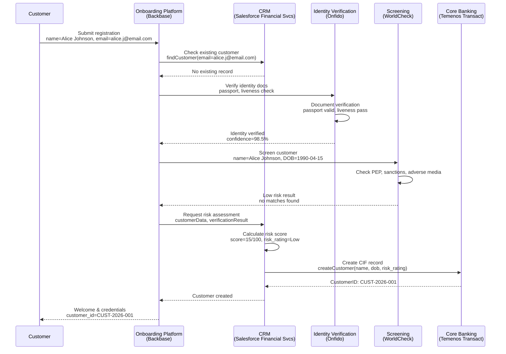
```mermaid
sequenceDiagram
    participant C as Customer
    participant OBP as Onboarding Platform<br/>(Backbase)
    participant CRM as CRM<br/>(Salesforce Financial Svcs)
    participant VER as Identity Verification<br/>(Onfido)
    participant SCR as Screening<br/>(WorldCheck)
    participant CBS as Core Banking<br/>(Temenos Transact)
    C->>OBP: Submit registration<br/>name=Alice Johnson, email=alice.j@email.com
    OBP->>CRM: Check existing customer<br/>findCustomer(email=alice.j@email.com)
    CRM-->>OBP: No existing record
    OBP->>VER: Verify identity docs<br/>passport, liveness check
    VER->>VER: Document verification<br/>passport valid, liveness pass
    VER-->>OBP: Identity verified<br/>confidence=98.5%
    OBP->>SCR: Screen customer<br/>name=Alice Johnson, DOB=1990-04-15
    SCR->>SCR: Check PEP, sanctions, adverse media
    SCR-->>OBP: Low risk result<br/>no matches found
    OBP->>CRM: Request risk assessment<br/>customerData, verificationResult
    CRM->>CRM: Calculate risk score<br/>score=15/100, risk_rating=Low
    CRM->>CBS: Create CIF record<br/>createCustomer(name, dob, risk_rating)
    CBS-->>CRM: CustomerID: CUST-2026-001
    CRM-->>OBP: Customer created
    OBP-->>C: Welcome & credentials<br/>customer_id=CUST-2026-001
```

#### Integration Details

| Flow | Entity | Info Flow | Source | Target | Source Conn | Target Conn | Pattern | Complexity |
|------|--------|-----------|--------|--------|-------------|-------------|---------|------------|
| Customer Onboarding | Customer | CheckExistingCustomer | Onboarding Platform (Backbase) | CRM (Salesforce Financial Services) | Backbase REST API | Salesforce REST API (OAuth2) | API-led (Real-time) | Simple |
| Customer Onboarding | Identity | VerifyDocuments | Onboarding Platform (Backbase) | Identity Verification (Onfido) | Backbase REST API | Onfido API (API Key) | API-led (Real-time) | Medium |
| Customer Onboarding | Sanctions | ScreenCustomer | Onboarding Platform (Backbase) | Screening (WorldCheck) | Backbase REST API | WorldCheck API (SOAP) | API-led (Real-time) | Medium |
| Customer Onboarding | CIF | CreateCustomerRecord | CRM (Salesforce Financial Services) | Core Banking (Temenos Transact) | Salesforce REST API (OAuth2) | Temenos REST API (API Key) | API-led (Real-time) | Medium |
| Customer Onboarding | Customer | SendWelcomeEmail | CRM (Salesforce Financial Services) | Email Service (SendGrid) | Salesforce REST API (OAuth2) | SendGrid SMTP API | Event-driven | Simple |
| Customer Onboarding | Consent | CaptureRegulatoryConsent | Onboarding Platform (Backbase) | Consent Repository (SealSign) | Backbase REST API | SealSign API (REST) | API-led (Real-time) | Medium |

#### Acceptance Criteria

| Flow | Entity | Acceptance Criterion | Expected Outcome |
|------|--------|---------------------|------------------|
| Customer Onboarding | Customer | CheckExistingCustomer returns correct match/no-match for given email | Customer record found or 'no existing record' returned within 2 seconds |
| Customer Onboarding | Identity | Identity documents verified against Onfido document and liveness checks | Passport and liveness pass with >=95% confidence; failure returns clear error |
| Customer Onboarding | Sanctions | Customer screened against WorldCheck PEP/sanctions/adverse media lists | Low risk result with no matches; any match >=90% triggers AML alert |
| Customer Onboarding | CIF | Customer CIF record created in Temenos Transact with all mandatory fields | CustomerID returned and propagated to CRM; non-repudiable audit trail created |
| Customer Onboarding | Customer | Welcome email sent to new customer post-registration | Email delivered within 60 seconds; tracking pixel confirms open |
| Customer Onboarding | Consent | Regulatory consent captured and stored for GDPR/FCA compliance | Consent record created with timestamp; audit trail of consent captured |
---

---

### 1.2 Retail Account Opening

**Description:** Customer selects account type, system validates eligibility, opens account in core banking, links digital channels, produces documentation.

**Actors:** Customer, Relationship Manager  
**Systems:** CRM (Salesforce Financial Services), Digital Onboarding Platform (Backbase), Core Banking (Temenos Transact), Card Management (Fiserv), Digital Banking (Backbase)

#### Sequence Diagram

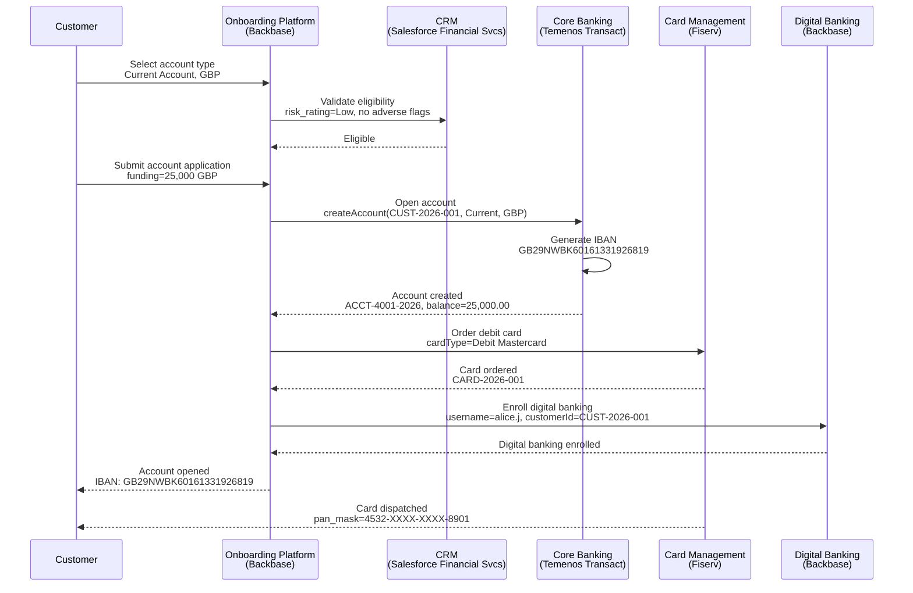
```mermaid
sequenceDiagram
    participant C as Customer
    participant OBP as Onboarding Platform<br/>(Backbase)
    participant CRM as CRM<br/>(Salesforce Financial Svcs)
    participant CBS as Core Banking<br/>(Temenos Transact)
    participant CARD as Card Management<br/>(Fiserv)
    participant DB as Digital Banking<br/>(Backbase)
    C->>OBP: Select account type<br/>Current Account, GBP
    OBP->>CRM: Validate eligibility<br/>risk_rating=Low, no adverse flags
    CRM-->>OBP: Eligible
    C->>OBP: Submit account application<br/>funding=25,000 GBP
    OBP->>CBS: Open account<br/>createAccount(CUST-2026-001, Current, GBP)
    CBS->>CBS: Generate IBAN<br/>GB29NWBK60161331926819
    CBS-->>OBP: Account created<br/>ACCT-4001-2026, balance=25,000.00
    OBP->>CARD: Order debit card<br/>cardType=Debit Mastercard
    CARD-->>OBP: Card ordered<br/>CARD-2026-001
    OBP->>DB: Enroll digital banking<br/>username=alice.j, customerId=CUST-2026-001
    DB-->>OBP: Digital banking enrolled
    OBP-->>C: Account opened<br/>IBAN: GB29NWBK60161331926819
    CARD-->>C: Card dispatched<br/>pan_mask=4532-XXXX-XXXX-8901
```

#### Integration Details

| Flow | Entity | Info Flow | Source | Target | Source Conn | Target Conn | Pattern | Complexity |
|------|--------|-----------|--------|--------|-------------|-------------|---------|------------|
| Account Opening | Eligibility | ValidateEligibility | Onboarding Platform (Backbase) | CRM (Salesforce Financial Services) | Backbase REST API | Salesforce REST API (OAuth2) | API-led (Real-time) | Simple |
| Account Opening | Account | CreateAccount | Onboarding Platform (Backbase) | Core Banking (Temenos Transact) | Backbase REST API | Temenos REST API (API Key) | API-led (Real-time) | Medium |
| Account Opening | Card | OrderDebitCard | Onboarding Platform (Backbase) | Card Management (Fiserv) | Backbase REST API | Fiserv API (SOAP) | API-led (Real-time) | Medium |
| Account Opening | Digital Banking | EnrollUser | Onboarding Platform (Backbase) | Digital Banking (Backbase) | Backbase REST API | Backbase REST API (JWT) | API-led (Real-time) | Simple |
| Account Opening | Mandate | SetupStandingOrderMandate | Onboarding Platform (Backbase) | Payment Hub (Volante) | Backbase REST API | Volante API (ISO 20022) | Event-driven | Medium |
| Account Opening | Terms | CaptureSignedTerms | Onboarding Platform (Backbase) | Document Mgmt (M-Files) | Backbase REST API | M-Files REST API (API Key) | API-led (Real-time) | Simple |

#### Acceptance Criteria

| Flow | Entity | Acceptance Criterion | Expected Outcome |
|------|--------|---------------------|------------------|
| Account Opening | Eligibility | Validate eligibility returns true/false based on customer risk rating and flags | Eligible customers proceed; ineligible customers see reason with appeal path |
| Account Opening | Account | Account created in core banking with correct type, currency, and IBAN generation | IBAN returned, account status=Active, initial balance reflected in <5 seconds |
| Account Opening | Card | Debit card ordered via Fiserv card management system | CardID returned, card status=Ordered, tracking reference provided |
| Account Opening | Digital Banking | Digital banking enrollment created with username linked to customer ID | Login credentials issued; MFA enrollment triggered within 1 minute |
| Account Opening | Mandate | Standing order mandate setup triggered for new account | Mandate reference created; first payment scheduled correctly |
| Account Opening | Terms | Signed terms and conditions stored in document management | Document retrievable; signature verification completes; terms version tracked |
---

---

### 1.3 Corporate Account Opening

**Description:** Relationship Manager initiates corporate account opening. Company documents verified, beneficial ownership structure captured, multi-signatory setup, account opened.

**Actors:** Relationship Manager, Compliance Officer, Customer (Corporate)  
**Systems:** CRM (Salesforce Financial Services), Document Management (M-Files), Core Banking (Temenos Transact), Screening (WorldCheck), Compliance Case Management (Pega)

#### Sequence Diagram

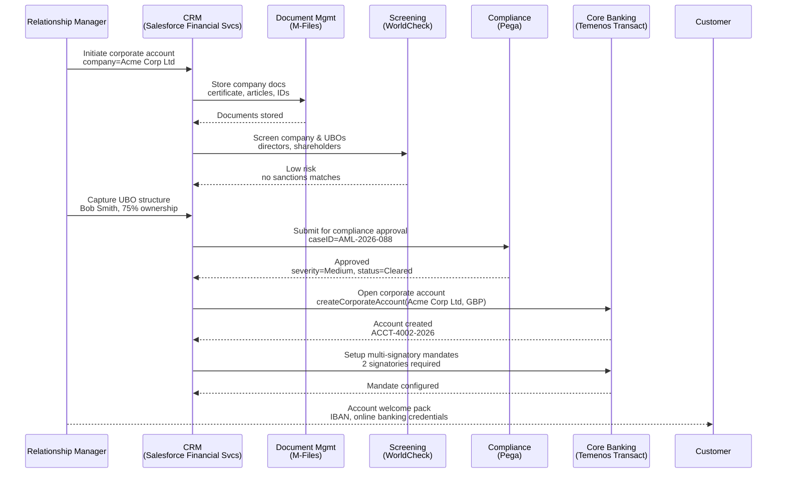
```mermaid
sequenceDiagram
    participant RM as Relationship Manager
    participant CRM as CRM<br/>(Salesforce Financial Svcs)
    participant DOC as Document Mgmt<br/>(M-Files)
    participant SCR as Screening<br/>(WorldCheck)
    participant COMP as Compliance<br/>(Pega)
    participant CBS as Core Banking<br/>(Temenos Transact)
    RM->>CRM: Initiate corporate account<br/>company=Acme Corp Ltd
    CRM->>DOC: Store company docs<br/>certificate, articles, IDs
    DOC-->>CRM: Documents stored
    CRM->>SCR: Screen company & UBOs<br/>directors, shareholders
    SCR-->>CRM: Low risk<br/>no sanctions matches
    RM->>CRM: Capture UBO structure<br/>Bob Smith, 75% ownership
    CRM->>COMP: Submit for compliance approval<br/>caseID=AML-2026-088
    COMP-->>CRM: Approved<br/>severity=Medium, status=Cleared
    CRM->>CBS: Open corporate account<br/>createCorporateAccount(Acme Corp Ltd, GBP)
    CBS-->>CRM: Account created<br/>ACCT-4002-2026
    CRM->>CBS: Setup multi-signatory mandates<br/>2 signatories required
    CBS-->>CRM: Mandate configured
    RM-->>Customer: Account welcome pack<br/>IBAN, online banking credentials
```

#### Integration Details

| Flow | Entity | Info Flow | Source | Target | Source Conn | Target Conn | Pattern | Complexity |
|------|--------|-----------|--------|--------|-------------|-------------|---------|------------|
| Corporate Account | Documents | StoreCompanyDocs | CRM (Salesforce Financial Services) | Document Mgmt (M-Files) | Salesforce REST API (OAuth2) | M-Files REST API (API Key) | API-led (Real-time) | Simple |
| Corporate Account | Screening | ScreenCompanyUBO | CRM (Salesforce Financial Services) | Screening (WorldCheck) | Salesforce REST API (OAuth2) | WorldCheck API (SOAP) | API-led (Real-time) | Medium |
| Corporate Account | Compliance | ApproveCompliance | CRM (Salesforce Financial Services) | Compliance Case Mgmt (Pega) | Salesforce REST API (OAuth2) | Pega API (REST) | API-led (Real-time) | Medium |
| Corporate Account | Account | OpenCorporateAccount | CRM (Salesforce Financial Services) | Core Banking (Temenos Transact) | Salesforce REST API (OAuth2) | Temenos REST API (API Key) | API-led (Real-time) | High |
| Corporate Account | Signatory | VerifySignatoryIdentity | CRM (Salesforce Financial Services) | Identity Verification (Onfido) | Salesforce REST API (OAuth2) | Onfido API (API Key) | API-led (Real-time) | Medium |
| Corporate Account | Fee | SetupAccountFeeSchedule | CRM (Salesforce Financial Services) | Core Banking (Temenos Transact) | Salesforce REST API (OAuth2) | Temenos REST API (API Key) | API-led (Real-time) | Simple |

#### Acceptance Criteria

| Flow | Entity | Acceptance Criterion | Expected Outcome |
|------|--------|---------------------|------------------|
| Corporate Account | Documents | Company documents stored in M-Files with correct metadata tagging | Documents retrievable by company ID; version history maintained |
| Corporate Account | Screening | Company and UBOs screened against sanctions lists | Low risk result or escalated compliance case; screening completed in <10 seconds |
| Corporate Account | Compliance | Compliance approval obtained via Pega case management workflow | Case approved/cleared; rejection includes reason and resubmission guidance |
| Corporate Account | Account | Corporate account opened with multi-signatory mandate configuration | Account created with all signatories; mandate rules enforced on transactions |
| Corporate Account | Signatory | All signatories' identities verified through Onfido | Each signatory verified with >=95% confidence; failed verification blocks account |
| Corporate Account | Fee | Account fee schedule configured correctly in core banking | Fee schedule applied; monthly fees calculated correctly from start date |

# 2: Payments & Transfers  - `BC060` `BC061`

### 2.1 Domestic Payment (SEPA/ACH)

**Description:** Customer initiates domestic transfer via digital channel. Payment hub validates, routes to clearing, executes, and reconciles.

**Actors:** Customer, Payment Operations  
**Systems:** Core Banking (Temenos Transact), Payment Hub (Volante), SEPA Clearing (EBA Clearing), Reconciliation Engine (SmartStream)

#### Sequence Diagram

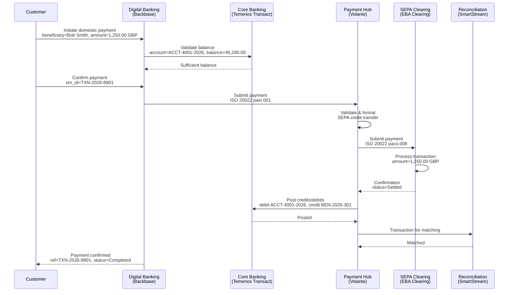
```mermaid
sequenceDiagram
    participant C as Customer
    participant DB as Digital Banking<br/>(Backbase)
    participant CBS as Core Banking<br/>(Temenos Transact)
    participant PH as Payment Hub<br/>(Volante)
    participant SEPA as SEPA Clearing<br/>(EBA Clearing)
    participant REC as Reconciliation<br/>(SmartStream)
    C->>DB: Initiate domestic payment<br/>beneficiary=Bob Smith, amount=1,250.00 GBP
    DB->>CBS: Validate balance<br/>account=ACCT-4001-2026, balance=45,280.00
    CBS-->>DB: Sufficient balance
    C->>DB: Confirm payment<br/>txn_id=TXN-2026-8901
    DB->>PH: Submit payment<br/>ISO 20022 pain.001
    PH->>PH: Validate & format<br/>SEPA credit transfer
    PH->>SEPA: Submit payment<br/>ISO 20022 pacs.008
    SEPA->>SEPA: Process transaction<br/>amount=1,250.00 GBP
    SEPA-->>PH: Confirmation<br/>status=Settled
    PH->>CBS: Post credits/debits<br/>debit ACCT-4001-2026, credit BEN-2026-301
    CBS-->>PH: Posted
    PH->>REC: Transaction for matching
    REC-->>PH: Matched
    DB-->>C: Payment confirmed<br/>ref=TXN-2026-8901, status=Completed
```

#### Integration Details

| Flow | Entity | Info Flow | Source | Target | Source Conn | Target Conn | Pattern | Complexity |
|------|--------|-----------|--------|--------|-------------|-------------|---------|------------|
| Domestic Payment | Payment Instruction | SubmitPayment | Digital Banking (Backbase) | Payment Hub (Volante) | Backbase REST API | Volante API (ISO 20022) | API-led (Real-time) | Medium |
| Domestic Payment | Clearing | SubmitToClearing | Payment Hub (Volante) | SEPA Clearing (EBA Clearing) | Volante API (ISO 20022) | EBA Clearing API (ISO 20022) | API-led (Real-time) | High |
| Domestic Payment | Ledger | PostTransaction | Payment Hub (Volante) | Core Banking (Temenos Transact) | Volante REST API | Temenos REST API (API Key) | API-led (Real-time) | Medium |
| Domestic Payment | Reconciliation | MatchTransaction | Payment Hub (Volante) | Reconciliation Engine (SmartStream) | Volante REST API | SmartStream API (REST) | API-led (Real-time) | Simple |
| Domestic Payment | Notification | SendPaymentConfirmation | Payment Hub (Volante) | Notification Service (Firebase) | Volante REST API | Firebase FCM API | Event-driven | Simple |
| Domestic Payment | FX | ApplyFXConversion | Payment Hub (Volante) | Core Banking (Temenos Transact) | Volante REST API | Temenos REST API (API Key) | API-led (Real-time) | Medium |

#### Acceptance Criteria

| Flow | Entity | Acceptance Criterion | Expected Outcome |
|------|--------|---------------------|------------------|
| Domestic Payment | Payment Instruction | ISO 20022 pain.001 message generated and submitted to payment hub | Payment hub acknowledges with unique reference; invalid messages rejected with reason |
| Domestic Payment | Clearing | SEPA credit transfer submitted to EBA Clearing via ISO 20022 pacs.008 | Clearing confirmation received with status=Settled within SEPA timelines |
| Domestic Payment | Ledger | Debit and credit entries posted correctly to source and beneficiary accounts | Source account debited, beneficiary account credited; balance reconciliation matches |
| Domestic Payment | Reconciliation | Transaction matched by SmartStream reconciliation engine | Match status=success; unmatched items flagged with discrepancy details |
| Domestic Payment | Notification | Payment confirmation notification sent to customer | Push/email notification delivered within 30 seconds; reference included |
| Domestic Payment | FX | FX conversion applied correctly for payments in non-base currency | Rate from FX feed applied; conversion amount verified; rounding rules followed |
---

---

### 2.2 Cross-Border Payment (SWIFT)

**Description:** Customer initiates international wire. Payment hub validates, formats SWIFT MT103, sends via SWIFT, correspondent bank processes, cover payment via MT202, status tracking.

**Actors:** Customer, Payment Operations  
**Systems:** Core Banking (Temenos Transact), Payment Hub (Volante), SWIFT Alliance Gateway, Correspondent Bank (Deutsche Bank)

#### Sequence Diagram

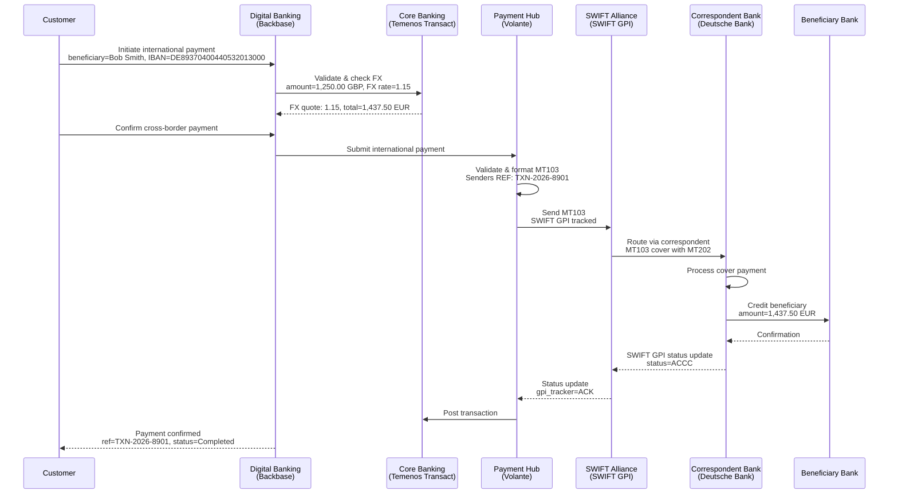
```mermaid
sequenceDiagram
    participant C as Customer
    participant DB as Digital Banking<br/>(Backbase)
    participant CBS as Core Banking<br/>(Temenos Transact)
    participant PH as Payment Hub<br/>(Volante)
    participant SW as SWIFT Alliance<br/>(SWIFT GPI)
    participant CORR as Correspondent Bank<br/>(Deutsche Bank)
    participant BEN as Beneficiary Bank
    C->>DB: Initiate international payment<br/>beneficiary=Bob Smith, IBAN=DE89370400440532013000
    DB->>CBS: Validate & check FX<br/>amount=1,250.00 GBP, FX rate=1.15
    CBS-->>DB: FX quote: 1.15, total=1,437.50 EUR
    C->>DB: Confirm cross-border payment
    DB->>PH: Submit international payment
    PH->>PH: Validate & format MT103<br/>Senders REF: TXN-2026-8901
    PH->>SW: Send MT103<br/>SWIFT GPI tracked
    SW->>CORR: Route via correspondent<br/>MT103 cover with MT202
    CORR->>CORR: Process cover payment
    CORR->>BEN: Credit beneficiary<br/>amount=1,437.50 EUR
    BEN-->>CORR: Confirmation
    CORR-->>SW: SWIFT GPI status update<br/>status=ACCC
    SW-->>PH: Status update<br/>gpi_tracker=ACK
    PH->>CBS: Post transaction
    DB-->>C: Payment confirmed<br/>ref=TXN-2026-8901, status=Completed
```

#### Integration Details

| Flow | Entity | Info Flow | Source | Target | Source Conn | Target Conn | Pattern | Complexity |
|------|--------|-----------|--------|--------|-------------|-------------|---------|------------|
| Cross-Border Payment | FX Quote | CheckFXRate | Digital Banking (Backbase) | Core Banking (Temenos Transact) | Backbase REST API | Temenos REST API (API Key) | API-led (Real-time) | Simple |
| Cross-Border Payment | SWIFT Message | SendMT103 | Payment Hub (Volante) | SWIFT Alliance Gateway | Volante ISO 20022 | SWIFT Alliance (MT) | API-led (Real-time) | High |
| Cross-Border Payment | Cover Payment | ProcessCover | SWIFT Alliance Gateway | Correspondent Bank (Deutsche Bank) | SWIFT Alliance (MT) | SWIFT MT202 | Batch (Scheduled) | High |
| Cross-Border Payment | Status | TrackGPIStatus | SWIFT Alliance Gateway | Payment Hub (Volante) | SWIFT GPI API | Volante REST API | Event-driven | Medium |
| Cross-Border Payment | Compliance | ScreenCrossBorderPayment | Payment Hub (Volante) | AML System (Oracle FCCM) | Volante REST API | Oracle FCCM API (SOAP) | API-led (Real-time) | High |
| Cross-Border Payment | Fee | DeductTransactionFee | Payment Hub (Volante) | Core Banking (Temenos Transact) | Volante REST API | Temenos REST API (API Key) | API-led (Real-time) | Simple |

#### Acceptance Criteria

| Flow | Entity | Acceptance Criterion | Expected Outcome |
|------|--------|---------------------|------------------|
| Cross-Border Payment | FX Quote | FX rate returned for currency pair with valid from/to currencies | Rate within 0.5% of market mid-rate; expired quotes rejected after 30 seconds |
| Cross-Border Payment | SWIFT Message | SWIFT MT103 message formatted and sent via SWIFT Alliance Gateway | SWIFT ACK received; UETR assigned; format validation errors cause rejection |
| Cross-Border Payment | Cover Payment | MT202 cover payment processed correctly by correspondent bank | Cover funds received by correspondent; nostro account debited correctly |
| Cross-Border Payment | Status | SWIFT GPI tracker updated with end-to-end payment status | Status transitions visible in GPI tracker; final ACCC confirmation received |
| Cross-Border Payment | Compliance | Cross-border payment screened for AML before SWIFT submission | Payment held until compliance clearance; held payments flagged to operations |
| Cross-Border Payment | Fee | Transaction fees deducted correctly and transparently | Fee amount disclosed before confirmation; fees posted to income GL |
---

---

### 2.3 Real-Time Payment (Faster Payments)

**Description:** Customer initiates instant payment. Payment hub processes in real-time via Faster Payments Service, immediate confirmation.

**Actors:** Customer, Payment Operations  
**Systems:** Core Banking (Temenos Transact), Payment Hub (Volante), Faster Payments Service (FPS), Beneficiary Bank

#### Sequence Diagram

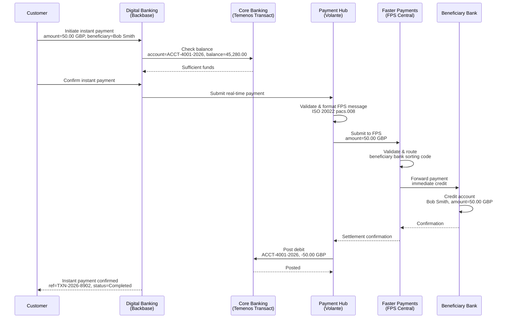
```mermaid
sequenceDiagram
    participant C as Customer
    participant DB as Digital Banking<br/>(Backbase)
    participant CBS as Core Banking<br/>(Temenos Transact)
    participant PH as Payment Hub<br/>(Volante)
    participant FPS as Faster Payments<br/>(FPS Central)
    participant BEN as Beneficiary Bank
    C->>DB: Initiate instant payment<br/>amount=50.00 GBP, beneficiary=Bob Smith
    DB->>CBS: Check balance<br/>account=ACCT-4001-2026, balance=45,280.00
    CBS-->>DB: Sufficient funds
    C->>DB: Confirm instant payment
    DB->>PH: Submit real-time payment
    PH->>PH: Validate & format FPS message<br/>ISO 20022 pacs.008
    PH->>FPS: Submit to FPS<br/>amount=50.00 GBP
    FPS->>FPS: Validate & route<br/>beneficiary bank sorting code
    FPS->>BEN: Forward payment<br/>immediate credit
    BEN->>BEN: Credit account<br/>Bob Smith, amount=50.00 GBP
    BEN-->>FPS: Confirmation
    FPS-->>PH: Settlement confirmation
    PH->>CBS: Post debit<br/>ACCT-4001-2026, -50.00 GBP
    CBS-->>PH: Posted
    DB-->>C: Instant payment confirmed<br/>ref=TXN-2026-8902, status=Completed
```

#### Integration Details

| Flow | Entity | Info Flow | Source | Target | Source Conn | Target Conn | Pattern | Complexity |
|------|--------|-----------|--------|--------|-------------|-------------|---------|------------|
| Real-Time Payment | Payment Request | SubmitRTPayment | Digital Banking (Backbase) | Payment Hub (Volante) | Backbase REST API | Volante REST API | API-led (Real-time) | Medium |
| Real-Time Payment | FPS Message | SubmitToFPS | Payment Hub (Volante) | Faster Payments Service (FPS) | Volante API (ISO 20022) | FPS API (ISO 20022) | API-led (Real-time) | High |
| Real-Time Payment | Credit | CreditBeneficiary | Faster Payments Service (FPS) | Beneficiary Bank | FPS Network API | Bank API (ISO 20022) | API-led (Real-time) | High |
| Real-Time Payment | Ledger | PostDebit | Payment Hub (Volante) | Core Banking (Temenos Transact) | Volante REST API | Temenos REST API (API Key) | API-led (Real-time) | Medium |
| Real-Time Payment | Fraud | RealTimeFraudCheck | Payment Hub (Volante) | Fraud Detection (FICO Falcon) | Volante REST API | Falcon API (ISO 8583) | API-led (Real-time) | High |
| Real-Time Payment | Confirmation | SendInstantConfirmation | Payment Hub (Volante) | Digital Banking (Backbase) | Volante REST API | Backbase REST API (JWT) | Event-driven | Simple |

#### Acceptance Criteria

| Flow | Entity | Acceptance Criterion | Expected Outcome |
|------|--------|---------------------|------------------|
| Real-Time Payment | Payment Request | Real-time payment request received and validated by payment hub | Request accepted or rejected within 1 second; invalid data returns specific error |
| Real-Time Payment | FPS Message | ISO 20022 pacs.008 message submitted to Faster Payments Service | FPS acknowledges within 2 seconds; settlement confirmation in <15 seconds |
| Real-Time Payment | Credit | Beneficiary account credited immediately by beneficiary bank | Funds available to beneficiary within 10 seconds of initiation; no holds applied |
| Real-Time Payment | Ledger | Source account debited correctly with real-time balance update | Available balance reduced immediately; transaction appears in transaction history |
| Real-Time Payment | Fraud | Real-time fraud check completed before FPS submission | Fraud check response in <200ms; high-risk scores block payment before transmission |
| Real-Time Payment | Confirmation | Instant confirmation sent to customer after FPS settlement | Confirmation visible in digital banking within 5 seconds of settlement |
---

---

### 2.4 Batch Payment Processing

**Description:** Corporate customer submits batch payment file. Payment hub validates, processes bulk payments through clearing, generates reconciliation report.

**Actors:** Customer (Corporate), Payment Operations  
**Systems:** Digital Banking (Backbase), Payment Hub (Volante), SEPA Clearing (EBA Clearing), Reconciliation Engine (SmartStream), Core Banking (Temenos Transact)

#### Sequence Diagram

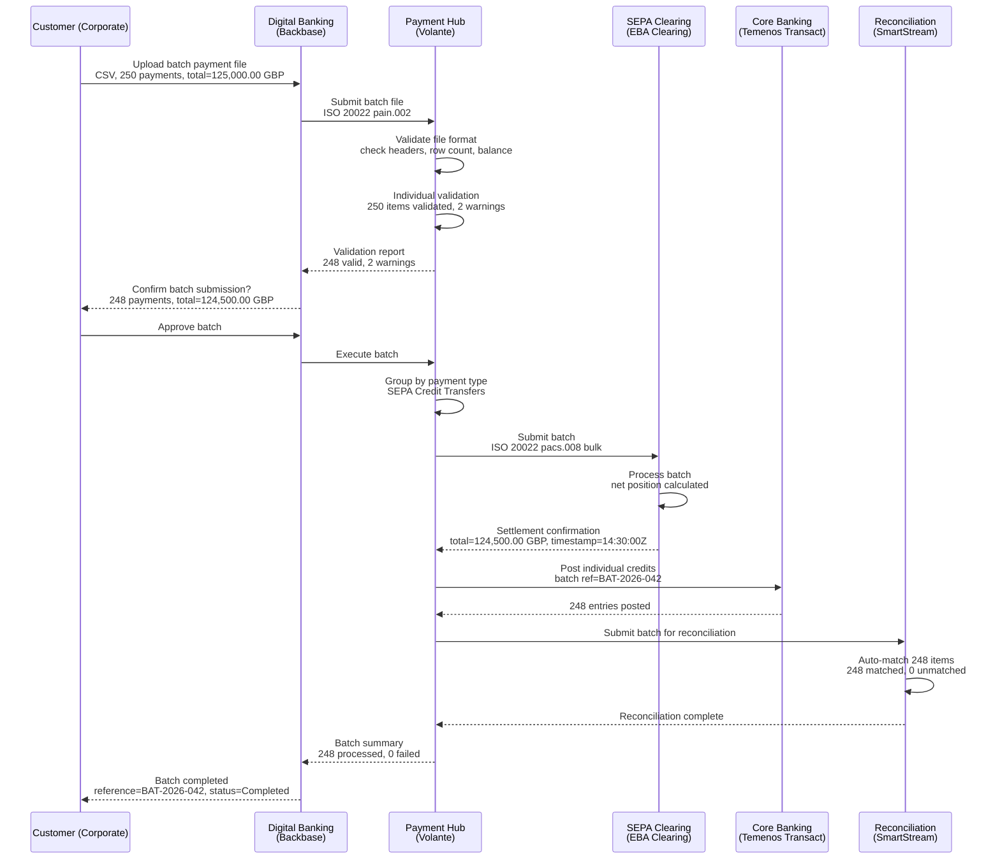
```mermaid
sequenceDiagram
    participant C as Customer (Corporate)
    participant DB as Digital Banking<br/>(Backbase)
    participant PH as Payment Hub<br/>(Volante)
    participant SEPA as SEPA Clearing<br/>(EBA Clearing)
    participant CBS as Core Banking<br/>(Temenos Transact)
    participant REC as Reconciliation<br/>(SmartStream)
    C->>DB: Upload batch payment file<br/>CSV, 250 payments, total=125,000.00 GBP
    DB->>PH: Submit batch file<br/>ISO 20022 pain.002
    PH->>PH: Validate file format<br/>check headers, row count, balance
    PH->>PH: Individual validation<br/>250 items validated, 2 warnings
    PH-->>DB: Validation report<br/>248 valid, 2 warnings
    DB-->>C: Confirm batch submission?<br/>248 payments, total=124,500.00 GBP
    C->>DB: Approve batch
    DB->>PH: Execute batch
    PH->>PH: Group by payment type<br/>SEPA Credit Transfers
    PH->>SEPA: Submit batch<br/>ISO 20022 pacs.008 bulk
    SEPA->>SEPA: Process batch<br/>net position calculated
    SEPA-->>PH: Settlement confirmation<br/>total=124,500.00 GBP, timestamp=14:30:00Z
    PH->>CBS: Post individual credits<br/>batch ref=BAT-2026-042
    CBS-->>PH: 248 entries posted
    PH->>REC: Submit batch for reconciliation
    REC->>REC: Auto-match 248 items<br/>248 matched, 0 unmatched
    REC-->>PH: Reconciliation complete
    PH-->>DB: Batch summary<br/>248 processed, 0 failed
    DB-->>C: Batch completed<br/>reference=BAT-2026-042, status=Completed
```

#### Integration Details

| Flow | Entity | Info Flow | Source | Target | Source Conn | Target Conn | Pattern | Complexity |
|------|--------|-----------|--------|--------|-------------|-------------|---------|------------|
| Batch Payment | File Upload | UploadBatchFile | Digital Banking (Backbase) | Payment Hub (Volante) | Backbase REST API | Volante API (ISO 20022) | API-led (Real-time) | Medium |
| Batch Payment | Validation | ValidateBatchFile | Payment Hub (Volante) | Payment Hub (Volante) | Internal | Internal | Batch (Scheduled) | Medium |
| Batch Payment | Clearing | SubmitBatchToClearing | Payment Hub (Volante) | SEPA Clearing (EBA Clearing) | Volante API (ISO 20022) | EBA Clearing API (ISO 20022) | Batch (Scheduled) | High |
| Batch Payment | Posting | PostBatchEntries | Payment Hub (Volante) | Core Banking (Temenos Transact) | Volante REST API | Temenos REST API (API Key) | Batch (Scheduled) | High |
| Batch Payment | Reconciliation | ReconcileBatch | Payment Hub (Volante) | Reconciliation Engine (SmartStream) | Volante REST API | SmartStream API (REST) | Event-driven | Simple |

#### Acceptance Criteria

| Flow | Entity | Acceptance Criterion | Expected Outcome |
|------|--------|---------------------|------------------|
| Batch Payment | File Upload | Batch payment file uploaded in supported format (CSV/ISO 20022 XML) | File parsed successfully; row count and total amount validated |
| Batch Payment | Validation | Each payment validated individually; warnings non-blocking | Invalid rows rejected with reason; valid rows processed; partial acceptance supported |
| Batch Payment | Clearing | Batch submitted to SEPA Clearing as ISO 20022 bulk pacs.008 | Clearing confirmation received; settlement timestamp recorded; exceptions reported |
| Batch Payment | Posting | All valid payments posted to individual accounts | 248 entries posted; total debited matches batch total; posting report generated |
| Batch Payment | Reconciliation | Batch fully reconciled with zero unmatched items | Reconciliation report generated; any breaks investigated before next batch |

# 3: Lending & Credit Management  - `BC070`

### 3.1 Retail Loan Origination

**Description:** Customer applies for personal loan. LOS processes application, initiates credit bureau check, calculates affordability, recommends decision, routes for approval.

**Actors:** Customer, Loan Officer, Credit Risk Analyst  
**Systems:** LOS (nCino/Finastra), Core Banking (Temenos Transact), Credit Bureau (Experian), Decision Engine (FICO)

#### Sequence Diagram

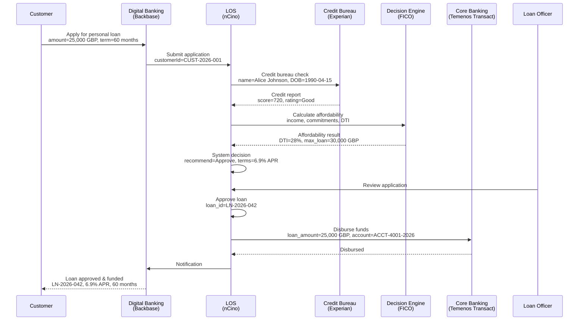
```mermaid
sequenceDiagram
    participant C as Customer
    participant DB as Digital Banking<br/>(Backbase)
    participant LOS as LOS<br/>(nCino)
    participant CB as Credit Bureau<br/>(Experian)
    participant DE as Decision Engine<br/>(FICO)
    participant CBS as Core Banking<br/>(Temenos Transact)
    C->>DB: Apply for personal loan<br/>amount=25,000 GBP, term=60 months
    DB->>LOS: Submit application<br/>customerId=CUST-2026-001
    LOS->>CB: Credit bureau check<br/>name=Alice Johnson, DOB=1990-04-15
    CB-->>LOS: Credit report<br/>score=720, rating=Good
    LOS->>DE: Calculate affordability<br/>income, commitments, DTI
    DE-->>LOS: Affordability result<br/>DTI=28%, max_loan=30,000 GBP
    LOS->>LOS: System decision<br/>recommend=Approve, terms=6.9% APR
    Loan Officer->>LOS: Review application
    LOS->>LOS: Approve loan<br/>loan_id=LN-2026-042
    LOS->>CBS: Disburse funds<br/>loan_amount=25,000 GBP, account=ACCT-4001-2026
    CBS-->>LOS: Disbursed
    LOS->>DB: Notification
    DB-->>C: Loan approved & funded<br/>LN-2026-042, 6.9% APR, 60 months
```

#### Integration Details

| Flow | Entity | Info Flow | Source | Target | Source Conn | Target Conn | Pattern | Complexity |
|------|--------|-----------|--------|--------|-------------|-------------|---------|------------|
| Loan Origination | Application | SubmitLoanApp | Digital Banking (Backbase) | LOS (nCino) | Backbase REST API | nCino REST API (OAuth2) | API-led (Real-time) | Medium |
| Loan Origination | Credit Check | CreditBureauCheck | LOS (nCino) | Credit Bureau (Experian) | nCino API | Experian API (SOAP) | API-led (Real-time) | High |
| Loan Origination | Decision | CalculateAffordability | LOS (nCino) | Decision Engine (FICO) | nCino REST API | FICO Blaze API (REST) | API-led (Real-time) | Medium |
| Loan Origination | Disbursement | DisburseLoan | LOS (nCino) | Core Banking (Temenos Transact) | nCino REST API (OAuth2) | Temenos REST API (API Key) | API-led (Real-time) | Medium |
| Loan Origination | Document | UploadLoanDocuments | LOS (nCino) | Document Mgmt (M-Files) | nCino REST API | M-Files REST API (API Key) | API-led (Real-time) | Simple |
| Loan Origination | Pricing | GetRiskBasedPricing | LOS (nCino) | Pricing Engine | nCino REST API | Pricing API (REST) | API-led (Real-time) | Medium |

#### Acceptance Criteria

| Flow | Entity | Acceptance Criterion | Expected Outcome |
|------|--------|---------------------|------------------|
| Loan Origination | Application | Loan application submitted from digital banking to nCino LOS | Application ID created; all fields mapped correctly; incomplete applications rejected |
| Loan Origination | Credit Check | Experian credit bureau check returns credit report and score | Credit score returned within 5 seconds; bureau error handled gracefully with retry |
| Loan Origination | Decision | FICO affordability calculation returns DTI ratio and max loan recommendation | DTI <=40% auto-approved; >40% routed to manual underwriting |
| Loan Origination | Disbursement | Loan funds disbursed to customer account in Temenos Transact | Customer account credited within 30 seconds; loan account created with correct terms |
| Loan Origination | Document | Loan application documents uploaded and stored in M-Files | All documents linked to application ID; automated document classification applied |
| Loan Origination | Pricing | Risk-based pricing returned from pricing engine | Rate within defined band for risk score; manual override requires approval |
---

---

### 3.2 Mortgage Lending

**Description:** Customer applies for mortgage. LOS manages document collection, valuation, solicitor coordination, offer issuance, completion.

**Actors:** Customer, Mortgage Advisor, Underwriter  
**Systems:** LOS (nCino), Core Banking (Temenos Transact), Valuation Provider (Hometrack), Solicitor Portal

#### Sequence Diagram

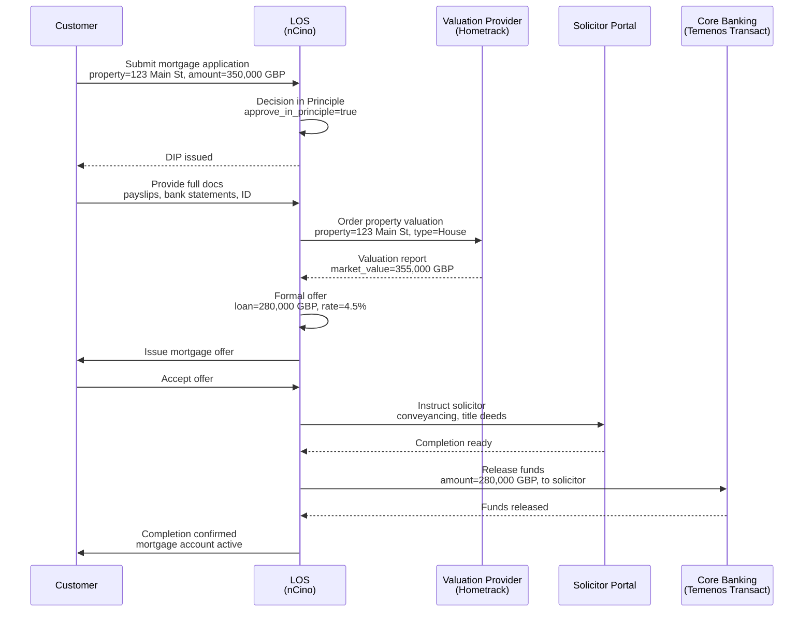
```mermaid
sequenceDiagram
    participant C as Customer
    participant LOS as LOS<br/>(nCino)
    participant VAL as Valuation Provider<br/>(Hometrack)
    participant SOL as Solicitor Portal
    participant CBS as Core Banking<br/>(Temenos Transact)
    C->>LOS: Submit mortgage application<br/>property=123 Main St, amount=350,000 GBP
    LOS->>LOS: Decision in Principle<br/>approve_in_principle=true
    LOS-->>C: DIP issued
    C->>LOS: Provide full docs<br/>payslips, bank statements, ID
    LOS->>VAL: Order property valuation<br/>property=123 Main St, type=House
    VAL-->>LOS: Valuation report<br/>market_value=355,000 GBP
    LOS->>LOS: Formal offer<br/>loan=280,000 GBP, rate=4.5%
    LOS->>C: Issue mortgage offer
    C->>LOS: Accept offer
    LOS->>SOL: Instruct solicitor<br/>conveyancing, title deeds
    SOL-->>LOS: Completion ready
    LOS->>CBS: Release funds<br/>amount=280,000 GBP, to solicitor
    CBS-->>LOS: Funds released
    LOS->>C: Completion confirmed<br/>mortgage account active
```

#### Integration Details

| Flow | Entity | Info Flow | Source | Target | Source Conn | Target Conn | Pattern | Complexity |
|------|--------|-----------|--------|--------|-------------|-------------|---------|------------|
| Mortgage Lending | DIP | DecisionInPrinciple | LOS (nCino) | LOS (nCino) | Internal | Internal | API-led (Real-time) | Simple |
| Mortgage Lending | Valuation | OrderValuation | LOS (nCino) | Valuation Provider (Hometrack) | nCino REST API | Hometrack API (SOAP) | Event-driven | Medium |
| Mortgage Lending | Solicitor | InstructSolicitor | LOS (nCino) | Solicitor Portal | nCino REST API | Solicitor API (REST) | Event-driven | Medium |
| Mortgage Lending | Funds | ReleaseFunds | LOS (nCino) | Core Banking (Temenos Transact) | nCino REST API (OAuth2) | Temenos REST API (API Key) | Event-driven | High |
| Mortgage Lending | Insurance | RequestInsuranceQuote | LOS (nCino) | Insurance Provider (Aviva) | nCino REST API | Aviva API (SOAP) | Event-driven | Medium |
| Mortgage Lending | Title | VerifyTitleDeeds | Solicitor Portal | Land Registry (UK LR) | Solicitor API (REST) | Land Registry API (SOAP) | API-led (Real-time) | High |

#### Acceptance Criteria

| Flow | Entity | Acceptance Criterion | Expected Outcome |
|------|--------|---------------------|------------------|
| Mortgage Lending | DIP | Decision in Principle calculated based on submitted income and commitment data | DIP issued with provisional amount and term; declined DIP shows reason |
| Mortgage Lending | Valuation | Property valuation ordered from Hometrack with correct property details | Valuation report returned within 24hrs; automated valuation for LTV <80% |
| Mortgage Lending | Solicitor | Solicitor instructed via portal with all required case documents | Solicitor confirmation received; all title deed requests submitted |
| Mortgage Lending | Funds | Mortgage funds released to solicitor on completion | Funds transferred via CHAPS within 2 hours of completion request; tracking reference provided |
| Mortgage Lending | Insurance | Buildings insurance quote requested and received | Quote returned within 30 seconds; multiple quotes compared; waiver available for self-sourced |
| Mortgage Lending | Title | Title deeds verified with Land Registry | Title registered; charges confirmed; any existing mortgages noted |
---

---

### 3.3 Credit Assessment & Scoring

**Description:** Credit analyst reviews score, bureau data, bank statement analysis. Decision engine computes risk score, recommends limit/terms. Underwriter approves.

**Actors:** Credit Risk Analyst, Loan Officer, Underwriter  
**Systems:** LOS (nCino), Credit Bureau (Experian), Decision Engine (FICO), Open Banking API (Token.io)

#### Sequence Diagram

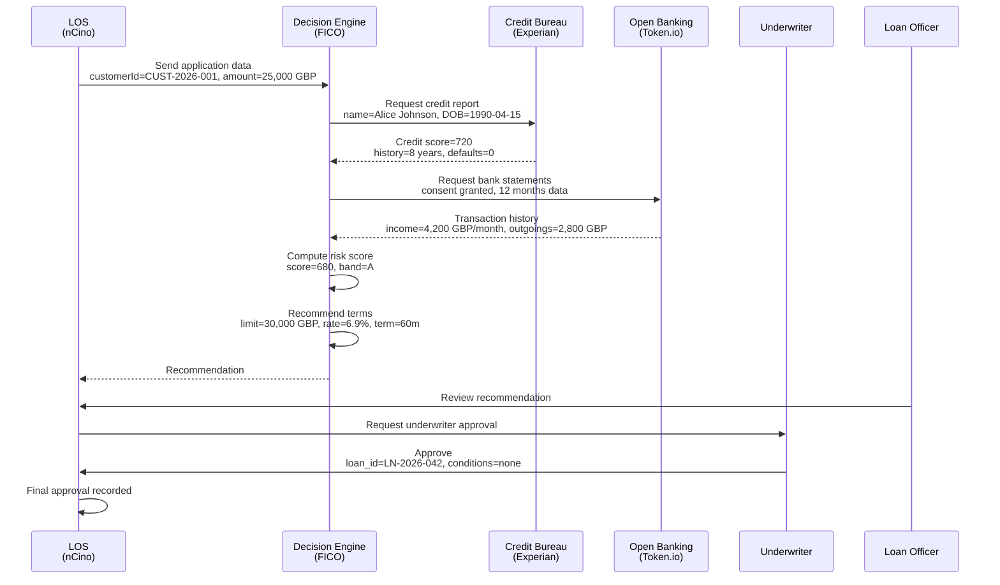
```mermaid
sequenceDiagram
    participant LOS as LOS<br/>(nCino)
    participant DE as Decision Engine<br/>(FICO)
    participant CB as Credit Bureau<br/>(Experian)
    participant OBP as Open Banking<br/>(Token.io)
    participant UN as Underwriter
    LOS->>DE: Send application data<br/>customerId=CUST-2026-001, amount=25,000 GBP
    DE->>CB: Request credit report<br/>name=Alice Johnson, DOB=1990-04-15
    CB-->>DE: Credit score=720<br/>history=8 years, defaults=0
    DE->>OBP: Request bank statements<br/>consent granted, 12 months data
    OBP-->>DE: Transaction history<br/>income=4,200 GBP/month, outgoings=2,800 GBP
    DE->>DE: Compute risk score<br/>score=680, band=A
    DE->>DE: Recommend terms<br/>limit=30,000 GBP, rate=6.9%, term=60m
    DE-->>LOS: Recommendation
    Loan Officer->>LOS: Review recommendation
    LOS->>UN: Request underwriter approval
    UN->>LOS: Approve<br/>loan_id=LN-2026-042, conditions=none
    LOS->>LOS: Final approval recorded
```

#### Integration Details

| Flow | Entity | Info Flow | Source | Target | Source Conn | Target Conn | Pattern | Complexity |
|------|--------|-----------|--------|--------|-------------|-------------|---------|------------|
| Credit Assessment | Application Data | SendForScoring | LOS (nCino) | Decision Engine (FICO) | nCino REST API | FICO Blaze API (REST) | API-led (Real-time) | Medium |
| Credit Assessment | Credit Report | GetCreditReport | Decision Engine (FICO) | Credit Bureau (Experian) | FICO Blaze API | Experian API (SOAP) | API-led (Real-time) | High |
| Credit Assessment | Bank Statements | GetTransactionData | Decision Engine (FICO) | Open Banking (Token.io) | FICO API | Token.io API (OAuth2) | API-led (Real-time) | High |
| Credit Assessment | Approval | ApproveUnderwriting | LOS (nCino) | Workflow (Pega) | nCino REST API (OAuth2) | Pega Workflow API (REST) | Event-driven | Medium |
| Credit Assessment | Fraud | IdentityFraudCheck | Decision Engine (FICO) | Fraud Detection (FICO Falcon) | FICO Blaze API | Falcon API (ISO 8583) | API-led (Real-time) | Medium |
| Credit Assessment | Decision | GenerateOfferLetter | LOS (nCino) | Document Generation (Adobe Sign) | nCino REST API | Adobe Sign API (REST) | Event-driven | Simple |

#### Acceptance Criteria

| Flow | Entity | Acceptance Criterion | Expected Outcome |
|------|--------|---------------------|------------------|
| Credit Assessment | Application Data | Application data sent from nCino to FICO decision engine | Data accepted by decision engine; missing mandatory fields cause rejection |
| Credit Assessment | Credit Report | Experian credit report retrieved with score, history, and default information | Full credit report returned; bureau downtime handled with cached score or manual fallback |
| Credit Assessment | Bank Statements | Transaction data retrieved via Open Banking API with customer consent | 12 months data retrieved; consent refresh handled; data unavailable flagged |
| Credit Assessment | Approval | Underwriter approval recorded with conditions (if any) | Approval recorded in LOS; conditions tracked; approval valid for 90 days |
| Credit Assessment | Fraud | Identity fraud check completed as part of credit assessment | Fraud check integrated into composite score; high fraud flags trigger manual review |
| Credit Assessment | Decision | Offer letter generated and digitally signed | Offer letter generated with correct terms; digital signature applied; valid for 90 days |
---

---

### 3.4 Loan Servicing & Collections

**Description:** Loan servicing team manages ongoing loan accounts - payment collection, arrears management, statement generation, and early-stage collections.

**Actors:** Customer, Loan Servicing Officer, Collections Officer  
**Systems:** LOS (nCino), Core Banking (Temenos Transact), Collections System (FICO Debt Manager), Document Mgmt (M-Files), Notification Service (Firebase)

#### Sequence Diagram

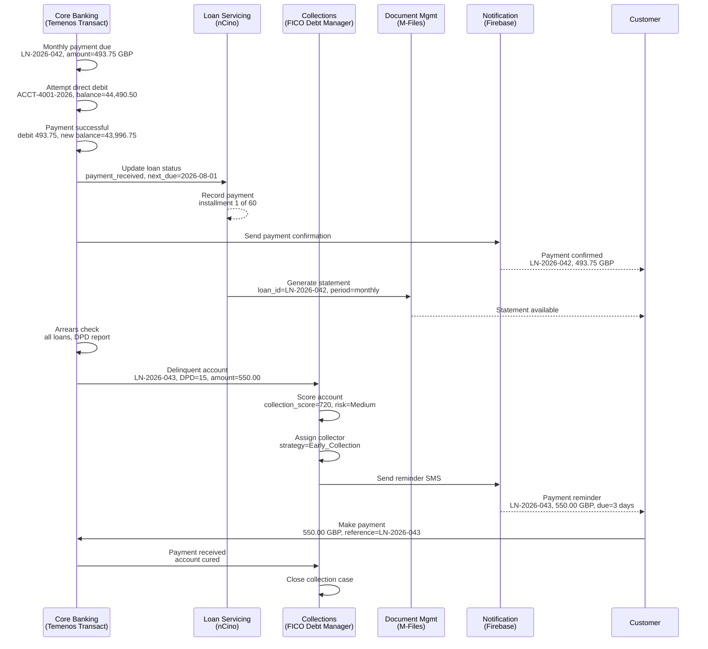
```mermaid
sequenceDiagram
    participant CBS as Core Banking<br/>(Temenos Transact)
    participant LOS as Loan Servicing<br/>(nCino)
    participant COL as Collections<br/>(FICO Debt Manager)
    participant DOC as Document Mgmt<br/>(M-Files)
    participant NOT as Notification<br/>(Firebase)
    participant C as Customer
    CBS->>CBS: Monthly payment due<br/>LN-2026-042, amount=493.75 GBP
    CBS->>CBS: Attempt direct debit<br/>ACCT-4001-2026, balance=44,490.50
    CBS->>CBS: Payment successful<br/>debit 493.75, new balance=43,996.75
    CBS->>LOS: Update loan status<br/>payment_received, next_due=2026-08-01
    LOS-->>LOS: Record payment<br/>installment 1 of 60
    CBS->>NOT: Send payment confirmation
    NOT-->>C: Payment confirmed<br/>LN-2026-042, 493.75 GBP
    LOS->>DOC: Generate statement<br/>loan_id=LN-2026-042, period=monthly
    DOC-->>C: Statement available
    CBS->>CBS: Arrears check<br/>all loans, DPD report
    CBS->>COL: Delinquent account<br/>LN-2026-043, DPD=15, amount=550.00
    COL->>COL: Score account<br/>collection_score=720, risk=Medium
    COL->>COL: Assign collector<br/>strategy=Early_Collection
    COL->>NOT: Send reminder SMS
    NOT-->>C: Payment reminder<br/>LN-2026-043, 550.00 GBP, due=3 days
    C->>CBS: Make payment<br/>550.00 GBP, reference=LN-2026-043
    CBS->>COL: Payment received<br/>account cured
    COL->>COL: Close collection case
```

#### Integration Details

| Flow | Entity | Info Flow | Source | Target | Source Conn | Target Conn | Pattern | Complexity |
|------|--------|-----------|--------|--------|-------------|-------------|---------|------------|
| Loan Servicing | Payment | ProcessMonthlyPayment | Core Banking (Temenos Transact) | Core Banking (Temenos Transact) | Internal | Internal | Batch (Scheduled) | Medium |
| Loan Servicing | Notification | SendPaymentConfirmation | Core Banking (Temenos Transact) | Notification Service (Firebase) | Temenos REST API | Firebase FCM API | Event-driven | Simple |
| Loan Servicing | Arrears | FlagDelinquentAccount | Core Banking (Temenos Transact) | Collections (FICO Debt Manager) | Temenos REST API | FICO API (SOAP) | Event-driven | Medium |
| Loan Servicing | Collections | AssignCollectionStrategy | Collections (FICO Debt Manager) | Collections (FICO Debt Manager) | Internal | Internal | API-led (Real-time) | Medium |
| Loan Servicing | Statement | GenerateLoanStatement | LOS (nCino) | Document Mgmt (M-Files) | nCino REST API | M-Files REST API (API Key) | Batch (Scheduled) | Simple |

#### Acceptance Criteria

| Flow | Entity | Acceptance Criterion | Expected Outcome |
|------|--------|---------------------|------------------|
| Loan Servicing | Payment | Monthly direct debit payment processed on due date | Payment debited on due date; loan balance reduced; next due date calculated |
| Loan Servicing | Notification | Payment confirmation sent to customer immediately | Confirmation includes amount, loan ID, remaining balance; delivered within 60 seconds |
| Loan Servicing | Arrears | Delinquent accounts flagged correctly based on DPD threshold | Accounts with DPD >0 flagged; severity assigned based on DPD bands; escalation triggered at 30 DPD |
| Loan Servicing | Collections | Collection strategy assigned based on risk score and DPD | Strategy determined by collection score; treatment plan customized; contact schedule set |
| Loan Servicing | Statement | Monthly loan statement generated and made available | Statement shows payments, interest, outstanding balance; available in digital banking and document mgmt |

# 4: Cards Management  - `BC071`

### 4.1 Card Issuance

**Description:** Customer requests card. Card Mgmt system personalizes, orders production, activates card, sets PIN, enables digital wallet.

**Actors:** Customer, Card Operations  
**Systems:** Card Management (Fiserv/FDR), Card Production Bureau (CPI), Digital Banking (Backbase), Digital Wallet (Apple Pay / Google Pay)

#### Sequence Diagram

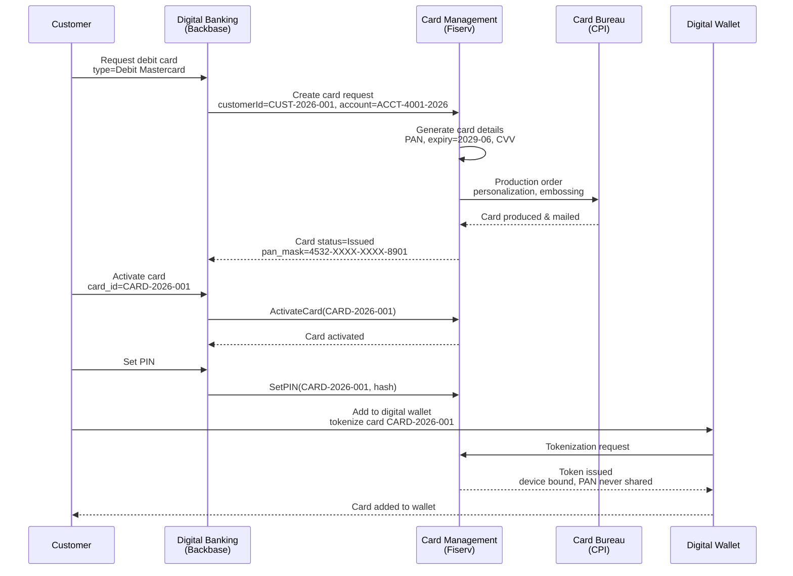
```mermaid
sequenceDiagram
    participant C as Customer
    participant DB as Digital Banking<br/>(Backbase)
    participant CMS as Card Management<br/>(Fiserv)
    participant BUR as Card Bureau<br/>(CPI)
    participant WAL as Digital Wallet
    C->>DB: Request debit card<br/>type=Debit Mastercard
    DB->>CMS: Create card request<br/>customerId=CUST-2026-001, account=ACCT-4001-2026
    CMS->>CMS: Generate card details<br/>PAN, expiry=2029-06, CVV
    CMS->>BUR: Production order<br/>personalization, embossing
    BUR-->>CMS: Card produced & mailed
    CMS-->>DB: Card status=Issued<br/>pan_mask=4532-XXXX-XXXX-8901
    C->>DB: Activate card<br/>card_id=CARD-2026-001
    DB->>CMS: ActivateCard(CARD-2026-001)
    CMS-->>DB: Card activated
    C->>DB: Set PIN
    DB->>CMS: SetPIN(CARD-2026-001, hash)
    C->>WAL: Add to digital wallet<br/>tokenize card CARD-2026-001
    WAL->>CMS: Tokenization request
    CMS-->>WAL: Token issued<br/>device bound, PAN never shared
    WAL-->>C: Card added to wallet
```

#### Integration Details

| Flow | Entity | Info Flow | Source | Target | Source Conn | Target Conn | Pattern | Complexity |
|------|--------|-----------|--------|--------|-------------|-------------|---------|------------|
| Card Issuance | Card Request | CreateCardRequest | Digital Banking (Backbase) | Card Management (Fiserv) | Backbase REST API | Fiserv API (SOAP) | API-led (Real-time) | Medium |
| Card Issuance | Production | OrderProduction | Card Management (Fiserv) | Card Bureau (CPI) | Fiserv API (ISO 8583) | CPI API (SFTP) | Batch (Scheduled) | High |
| Card Issuance | Activation | ActivateCard | Digital Banking (Backbase) | Card Management (Fiserv) | Backbase REST API | Fiserv API (SOAP) | API-led (Real-time) | Simple |
| Card Issuance | Tokenization | TokenizeCard | Digital Wallet (Apple Pay) | Card Management (Fiserv) | Apple Pay API | Fiserv Token API | API-led (Real-time) | High |
| Card Issuance | PIN | SendPINMailer | Card Management (Fiserv) | Card Bureau (CPI) | Fiserv API (ISO 8583) | CPI API (SFTP) | Batch (Scheduled) | Medium |
| Card Issuance | Notification | NotifyCardDispatched | Card Management (Fiserv) | Notification Service (Firebase) | Fiserv REST API | Firebase FCM API | Event-driven | Simple |

#### Acceptance Criteria

| Flow | Entity | Acceptance Criterion | Expected Outcome |
|------|--------|---------------------|------------------|
| Card Issuance | Card Request | Card creation request sent to Fiserv card management with correct customer and account | Card details generated (PAN, expiry, CVV); card ID returned |
| Card Issuance | Production | Production order file sent to CPI bureau for card personalization | File acknowledged by CPI; physical card dispatched within 3 business days |
| Card Issuance | Activation | Card activated by customer via digital banking or IVR | Card status changes from Issued to Active; activation timestamp logged |
| Card Issuance | Tokenization | Card tokenized for Apple Pay/Google Pay with device-bound token | Token issued; PAN never shared with wallet provider; token domain-restricted |
| Card Issuance | PIN | PIN mailer dispatched separately from card | PIN generated securely; mailer dispatched within 24 hours; PIN never in same envelope as card |
| Card Issuance | Notification | Customer notified when card is dispatched | Notification sent with tracking reference; estimated delivery date provided |
---

---

### 4.2 Card Transaction Processing

**Description:** Customer makes POS purchase. Authorization request flows from terminal → acquirer → network → issuer. Clearing and settlement follows.

**Actors:** Customer, Merchant, Acquirer  
**Systems:** Card Management (Fiserv/FDR), POS Terminal, Merchant Acquirer (Worldpay), Payment Network (Visa/Mastercard), Core Banking (Temenos Transact)

#### Sequence Diagram

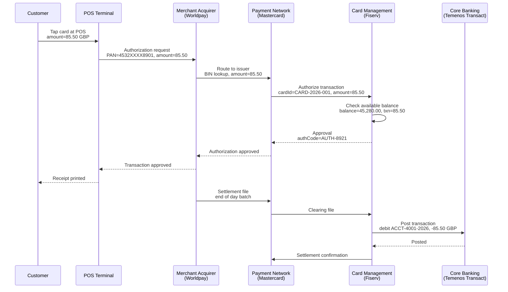
```mermaid
sequenceDiagram
    participant C as Customer
    participant POS as POS Terminal
    participant ACQ as Merchant Acquirer<br/>(Worldpay)
    participant NET as Payment Network<br/>(Mastercard)
    participant CMS as Card Management<br/>(Fiserv)
    participant CBS as Core Banking<br/>(Temenos Transact)
    C->>POS: Tap card at POS<br/>amount=85.50 GBP
    POS->>ACQ: Authorization request<br/>PAN=4532XXXX8901, amount=85.50
    ACQ->>NET: Route to issuer<br/>BIN lookup, amount=85.50
    NET->>CMS: Authorize transaction<br/>cardId=CARD-2026-001, amount=85.50
    CMS->>CMS: Check available balance<br/>balance=45,280.00, txn=85.50
    CMS-->>NET: Approval<br/>authCode=AUTH-8921
    NET-->>ACQ: Authorization approved
    ACQ-->>POS: Transaction approved
    POS-->>C: Receipt printed
    ACQ->>NET: Settlement file<br/>end of day batch
    NET->>CMS: Clearing file
    CMS->>CBS: Post transaction<br/>debit ACCT-4001-2026, -85.50 GBP
    CBS-->>CMS: Posted
    CMS->>NET: Settlement confirmation
```

#### Integration Details

| Flow | Entity | Info Flow | Source | Target | Source Conn | Target Conn | Pattern | Complexity |
|------|--------|-----------|--------|--------|-------------|-------------|---------|------------|
| Card Transaction | Authorization | AuthorizeTransaction | POS Terminal | Merchant Acquirer (Worldpay) | POS Protocol (ISO 8583) | Worldpay Gateway API | API-led (Real-time) | High |
| Card Transaction | Routing | RouteToIssuer | Merchant Acquirer (Worldpay) | Payment Network (Mastercard) | Worldpay API (ISO 8583) | Mastercard Network (ISO 8583) | API-led (Real-time) | High |
| Card Transaction | Issuer Auth | AuthDecision | Payment Network (Mastercard) | Card Management (Fiserv) | Mastercard Interface | Fiserv API (ISO 8583) | API-led (Real-time) | Medium |
| Card Transaction | Settlement | SubmitSettlement | Merchant Acquirer (Worldpay) | Payment Network (Mastercard) | Worldpay Settlement API | Mastercard Settlement (ISO 20022) | Batch (Scheduled) | High |
| Card Transaction | Posting | PostCardTransaction | Card Management (Fiserv) | Core Banking (Temenos Transact) | Fiserv REST API | Temenos REST API (API Key) | API-led (Real-time) | Medium |
| Card Transaction | FX | ConvertTransactionCurrency | Card Management (Fiserv) | FX Rate Service (Reuters) | Fiserv REST API | Reuters API (REST) | API-led (Real-time) | Medium |
| Card Transaction | Reward | CalculateRewardPoints | Card Management (Fiserv) | Rewards Engine (LoyaltyPlus) | Fiserv REST API | LoyaltyPlus API (REST) | Event-driven | Medium |

#### Acceptance Criteria

| Flow | Entity | Acceptance Criterion | Expected Outcome |
|------|--------|---------------------|------------------|
| Card Transaction | Authorization | POS authorization request sent and response received in <2 seconds | Auth approval code returned; declined transactions show reason code |
| Card Transaction | Routing | Transaction routed to correct issuer via Mastercard network BIN lookup | Route determined correctly; BIN table updated weekly |
| Card Transaction | Issuer Auth | Issuer validates available balance/funds and returns auth decision | Sufficient funds approve; insufficient funds decline; all decisions logged |
| Card Transaction | Settlement | End-of-day settlement file exchanged between acquirer, network, and issuer | Settlement file reconciled to zero; exceptions <0.1% of volume |
| Card Transaction | Posting | Card transaction posted to customer account in core banking | Transaction appears on statement; available balance updated; posting date = transaction date |
| Card Transaction | FX | Dynamic currency conversion applied for foreign transactions | Exchange rate displayed at POS; conversion rate within 1% of wholesale rate |
| Card Transaction | Reward | Reward points calculated and credited for qualifying transactions | Points calculated per card programme rules; points balance updated immediately |
---

---

### 4.3 Card Dispute Management

**Description:** Customer disputes a transaction. Dispute system manages chargeback lifecycle: retrieval request, chargeback, pre-arbitration, and arbitration.

**Actors:** Customer, Card Operations, Merchant, Acquirer  
**Systems:** Card Management (Fiserv/FDR), Dispute System (Fiserv), Payment Network (Mastercard), Merchant Acquirer (Worldpay)

#### Sequence Diagram

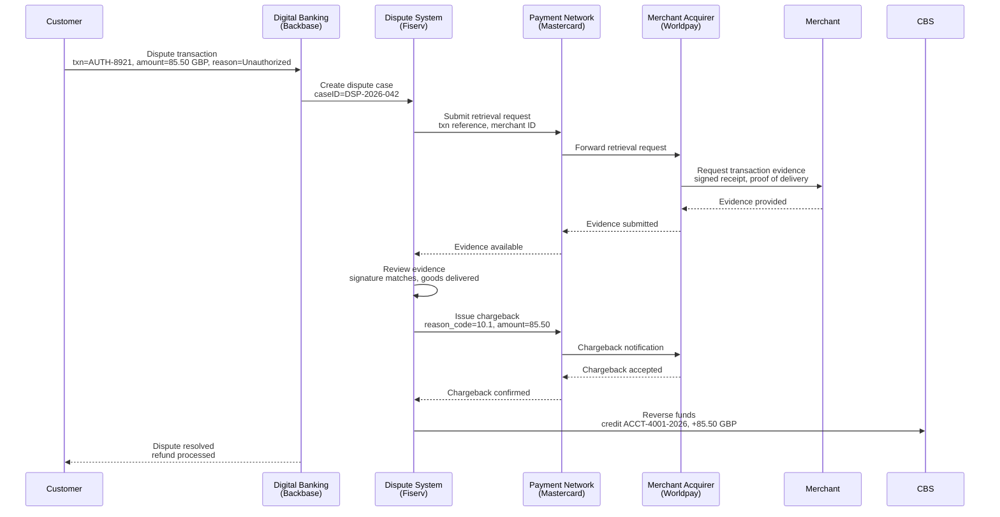
```mermaid
sequenceDiagram
    participant C as Customer
    participant DB as Digital Banking<br/>(Backbase)
    participant DIS as Dispute System<br/>(Fiserv)
    participant NET as Payment Network<br/>(Mastercard)
    participant ACQ as Merchant Acquirer<br/>(Worldpay)
    participant MER as Merchant
    C->>DB: Dispute transaction<br/>txn=AUTH-8921, amount=85.50 GBP, reason=Unauthorized
    DB->>DIS: Create dispute case<br/>caseID=DSP-2026-042
    DIS->>NET: Submit retrieval request<br/>txn reference, merchant ID
    NET->>ACQ: Forward retrieval request
    ACQ->>MER: Request transaction evidence<br/>signed receipt, proof of delivery
    MER-->>ACQ: Evidence provided
    ACQ-->>NET: Evidence submitted
    NET-->>DIS: Evidence available
    DIS->>DIS: Review evidence<br/>signature matches, goods delivered
    DIS->>NET: Issue chargeback<br/>reason_code=10.1, amount=85.50
    NET->>ACQ: Chargeback notification
    ACQ-->>NET: Chargeback accepted
    NET-->>DIS: Chargeback confirmed
    DIS->>CBS: Reverse funds<br/>credit ACCT-4001-2026, +85.50 GBP
    DB-->>C: Dispute resolved<br/>refund processed
```

#### Integration Details

| Flow | Entity | Info Flow | Source | Target | Source Conn | Target Conn | Pattern | Complexity |
|------|--------|-----------|--------|--------|-------------|-------------|---------|------------|
| Card Dispute | Case | CreateDisputeCase | Digital Banking (Backbase) | Dispute System (Fiserv) | Backbase REST API | Fiserv Dispute API (SOAP) | API-led (Real-time) | Medium |
| Card Dispute | Retrieval | SubmitRetrievalRequest | Dispute System (Fiserv) | Payment Network (Mastercard) | Fiserv API | Mastercard Dispute API (ISO 8583) | API-led (Real-time) | High |
| Card Dispute | Chargeback | IssueChargeback | Dispute System (Fiserv) | Payment Network (Mastercard) | Fiserv API | Mastercard Chargeback API | API-led (Real-time) | High |
| Card Dispute | Reversal | ReverseFunds | Dispute System (Fiserv) | Core Banking (Temenos Transact) | Fiserv REST API | Temenos REST API (API Key) | Event-driven | Medium |
| Card Dispute | Evidence | UploadDisputeEvidence | Digital Banking (Backbase) | Dispute System (Fiserv) | Backbase REST API | Fiserv Dispute API (SOAP) | API-led (Real-time) | Simple |
| Card Dispute | Notification | NotifyDisputeOutcome | Dispute System (Fiserv) | Notification Service (Firebase) | Fiserv REST API | Firebase FCM API | Event-driven | Simple |

#### Acceptance Criteria

| Flow | Entity | Acceptance Criterion | Expected Outcome |
|------|--------|---------------------|------------------|
| Card Dispute | Case | Dispute case created with all transaction details and reason codes | Case ID generated; mandatory fields validated; duplicate case detection active |
| Card Dispute | Retrieval | Retrieval request sent to acquirer via Mastercard dispute network | Acquirer acknowledges within 48hrs; evidence due within 10 calendar days |
| Card Dispute | Chargeback | Chargeback issued with correct reason code and amount | Chargeback accepted by network; funds provisionally reversed to cardholder |
| Card Dispute | Reversal | Funds reversed to customer account upon chargeback confirmation | Customer account credited; reversal appears on next statement |
| Card Dispute | Evidence | Customer can upload evidence directly via digital banking | Evidence attached to dispute case; max file size 10MB; accepted formats PDF/JPEG/PNG |
| Card Dispute | Notification | Customer notified of dispute outcome at each lifecycle stage | Notification sent on case creation, chargeback issuance, and final resolution |
---

---

### 4.4 Card Rewards & Loyalty

**Description:** Cardholder earns rewards on qualifying transactions. Rewards engine calculates points, manages redemption, and integrates with partner systems.

**Actors:** Customer, Card Operations, Marketing Manager  
**Systems:** Card Management (Fiserv), Rewards Engine (LoyaltyPlus), Digital Banking (Backbase), Partner Portal (Avios), Notification Service (Firebase)

#### Sequence Diagram

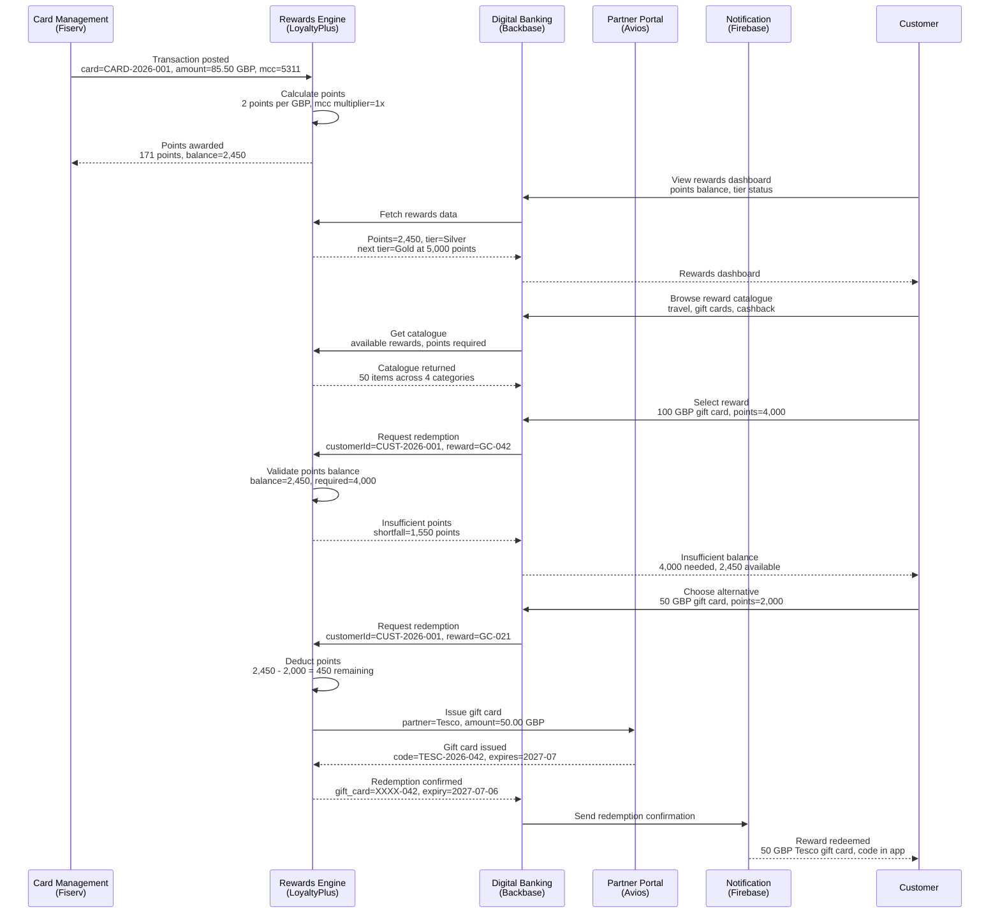
```mermaid
sequenceDiagram
    participant CMS as Card Management<br/>(Fiserv)
    participant REW as Rewards Engine<br/>(LoyaltyPlus)
    participant DB as Digital Banking<br/>(Backbase)
    participant PART as Partner Portal<br/>(Avios)
    participant NOT as Notification<br/>(Firebase)
    participant C as Customer
    CMS->>REW: Transaction posted<br/>card=CARD-2026-001, amount=85.50 GBP, mcc=5311
    REW->>REW: Calculate points<br/>2 points per GBP, mcc multiplier=1x
    REW-->>CMS: Points awarded<br/>171 points, balance=2,450
    C->>DB: View rewards dashboard<br/>points balance, tier status
    DB->>REW: Fetch rewards data
    REW-->>DB: Points=2,450, tier=Silver<br/>next tier=Gold at 5,000 points
    DB-->>C: Rewards dashboard
    C->>DB: Browse reward catalogue<br/>travel, gift cards, cashback
    DB->>REW: Get catalogue<br/>available rewards, points required
    REW-->>DB: Catalogue returned<br/>50 items across 4 categories
    C->>DB: Select reward<br/>100 GBP gift card, points=4,000
    DB->>REW: Request redemption<br/>customerId=CUST-2026-001, reward=GC-042
    REW->>REW: Validate points balance<br/>balance=2,450, required=4,000
    REW-->>DB: Insufficient points<br/>shortfall=1,550 points
    DB-->>C: Insufficient balance<br/>4,000 needed, 2,450 available
    C->>DB: Choose alternative<br/>50 GBP gift card, points=2,000
    DB->>REW: Request redemption<br/>customerId=CUST-2026-001, reward=GC-021
    REW->>REW: Deduct points<br/>2,450 - 2,000 = 450 remaining
    REW->>PART: Issue gift card<br/>partner=Tesco, amount=50.00 GBP
    PART-->>REW: Gift card issued<br/>code=TESC-2026-042, expires=2027-07
    REW-->>DB: Redemption confirmed<br/>gift_card=XXXX-042, expiry=2027-07-06
    DB->>NOT: Send redemption confirmation
    NOT-->>C: Reward redeemed<br/>50 GBP Tesco gift card, code in app
```

#### Integration Details

| Flow | Entity | Info Flow | Source | Target | Source Conn | Target Conn | Pattern | Complexity |
|------|--------|-----------|--------|--------|-------------|-------------|---------|------------|
| Card Rewards | Earning | award_points | Card Management (Fiserv) | Rewards Engine (LoyaltyPlus) | Fiserv REST API | LoyaltyPlus API (REST) | Event-driven | Medium |
| Card Rewards | Dashboard | GetRewardsDashboard | Digital Banking (Backbase) | Rewards Engine (LoyaltyPlus) | Backbase REST API | LoyaltyPlus API (REST) | API-led (Real-time) | Simple |
| Card Rewards | Catalogue | GetRewardCatalogue | Digital Banking (Backbase) | Rewards Engine (LoyaltyPlus) | Backbase REST API | LoyaltyPlus API (REST) | API-led (Real-time) | Simple |
| Card Rewards | Redemption | RedeemReward | Digital Banking (Backbase) | Rewards Engine (LoyaltyPlus) | Backbase REST API | LoyaltyPlus API (REST) | API-led (Real-time) | Medium |
| Card Rewards | Partner | IssuePartnerReward | Rewards Engine (LoyaltyPlus) | Partner Portal (Avios) | LoyaltyPlus API | Avios API (SOAP) | API-led (Real-time) | High |
| Card Rewards | Notification | SendRedemptionConfirm | Digital Banking (Backbase) | Notification Service (Firebase) | Backbase REST API | Firebase FCM API | Event-driven | Simple |

#### Acceptance Criteria

| Flow | Entity | Acceptance Criterion | Expected Outcome |
|------|--------|---------------------|------------------|
| Card Rewards | Earning | Reward points calculated and awarded on qualifying transaction posting | Points calculated per card programme rules; points awarded within 60 seconds of posting |
| Card Rewards | Dashboard | Customer views rewards dashboard with points balance and tier | Dashboard loads within 2 seconds; points balance accurate; tier progress shown |
| Card Rewards | Catalogue | Reward catalogue returned with available items and points required | Catalogue filtered by eligibility; out-of-stock items hidden; regional availability enforced |
| Card Rewards | Redemption | Points redeemed for selected reward; sufficient balance validated | Sufficient points: redemption confirmed; insufficient points: clear shortfall message shown |
| Card Rewards | Partner | Partner reward issued via partner API for third-party fulfilment | Partner confirms fulfilment; gift card code returned; expiry date provided |
| Card Rewards | Notification | Redemption confirmation sent to customer | Notification includes reward details, delivery method, and expected timeline |

# 5: Deposits & Savings Products  - `BC072` `BC073`

### 5.1 Account Operations (Current/Savings)

**Description:** Customer performs basic account operations — deposits, withdrawals, standing orders, direct debits. Systems process transactions and update ledgers.

**Actors:** Customer, Product Manager  
**Systems:** Core Banking (Temenos Transact), Digital Banking (Backbase), Payment Hub (Volante), Direct Debit Scheme (Bacs/SDD)

#### Sequence Diagram

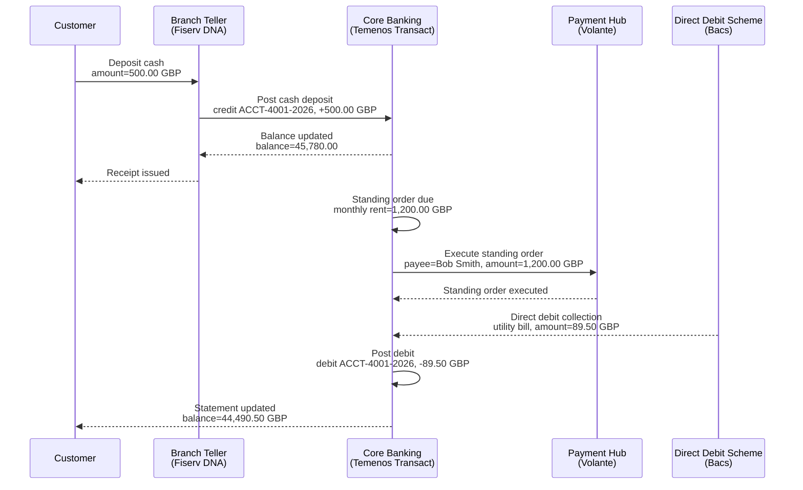
```mermaid
sequenceDiagram
    participant C as Customer
    participant BR as Branch Teller<br/>(Fiserv DNA)
    participant CBS as Core Banking<br/>(Temenos Transact)
    participant PH as Payment Hub<br/>(Volante)
    participant DD as Direct Debit Scheme<br/>(Bacs)
    C->>BR: Deposit cash<br/>amount=500.00 GBP
    BR->>CBS: Post cash deposit<br/>credit ACCT-4001-2026, +500.00 GBP
    CBS-->>BR: Balance updated<br/>balance=45,780.00
    BR-->>C: Receipt issued
    CBS->>CBS: Standing order due<br/>monthly rent=1,200.00 GBP
    CBS->>PH: Execute standing order<br/>payee=Bob Smith, amount=1,200.00 GBP
    PH-->>CBS: Standing order executed
    DD-->>CBS: Direct debit collection<br/>utility bill, amount=89.50 GBP
    CBS->>CBS: Post debit<br/>debit ACCT-4001-2026, -89.50 GBP
    CBS-->>C: Statement updated<br/>balance=44,490.50 GBP
```

#### Integration Details

| Flow | Entity | Info Flow | Source | Target | Source Conn | Target Conn | Pattern | Complexity |
|------|--------|-----------|--------|--------|-------------|-------------|---------|------------|
| Account Operations | Cash Deposit | PostCashDeposit | Branch Teller (Fiserv DNA) | Core Banking (Temenos Transact) | Fiserv Teller API | Temenos REST API (API Key) | API-led (Real-time) | Simple |
| Account Operations | Standing Order | ExecuteStandingOrder | Core Banking (Temenos Transact) | Payment Hub (Volante) | Temenos REST API | Volante API (ISO 20022) | API-led (Real-time) | Medium |
| Account Operations | Direct Debit | ProcessDirectDebit | Direct Debit Scheme (Bacs) | Core Banking (Temenos Transact) | Bacs API (ISO 20022) | Temenos REST API | Batch (Scheduled) | Medium |
| Account Operations | Fee | ApplyMonthlyFee | Core Banking (Temenos Transact) | Core Banking (Temenos Transact) | Internal | Internal | Batch (Scheduled) | Simple |
| Account Operations | Statement | GenerateMonthlyStatement | Core Banking (Temenos Transact) | Document Generation (Adobe Sign) | Temenos REST API | Adobe Sign API (REST) | Batch (Scheduled) | Medium |

#### Acceptance Criteria

| Flow | Entity | Acceptance Criterion | Expected Outcome |
|------|--------|---------------------|------------------|
| Account Operations | Cash Deposit | Cash deposit posted to correct account with accurate amount | Balance updated immediately; receipt generated with transaction reference |
| Account Operations | Standing Order | Standing order executed on due date for correct amount and payee | Payment sent to payment hub; next run date calculated correctly |
| Account Operations | Direct Debit | Direct debit collection processed correctly via Bacs scheme | Account debited on due date; unsuccessful collections retried per scheme rules |
| Account Operations | Fee | Monthly account fee applied on correct schedule | Fee applied on last day of month; fee waiver rules checked; zero-fee accounts not charged |
| Account Operations | Statement | Monthly statement generated and made available digitally | Statement PDF generated; available in digital banking; notification sent |
---

---

### 5.2 Term Deposits

**Description:** Customer places term deposit. System applies interest rate, manages maturity, handles renewal/redemption.

**Actors:** Customer, Product Manager, Treasury  
**Systems:** Core Banking (Temenos Transact), Digital Banking (Backbase), Pricing Engine

#### Sequence Diagram

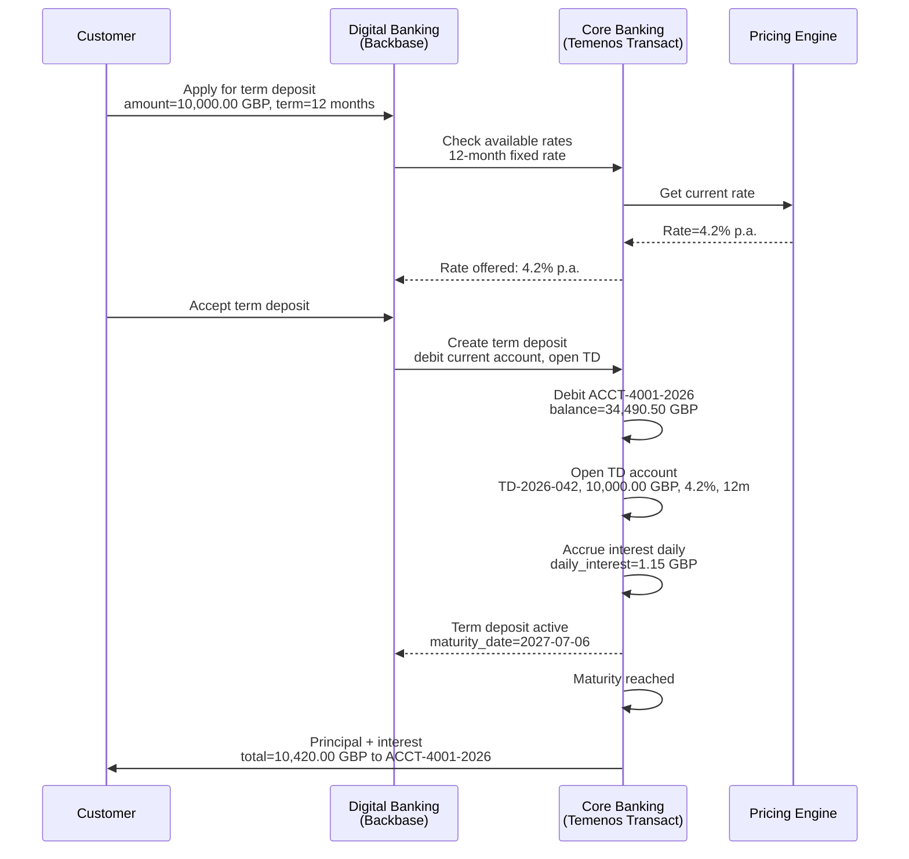
```mermaid
sequenceDiagram
    participant C as Customer
    participant DB as Digital Banking<br/>(Backbase)
    participant CBS as Core Banking<br/>(Temenos Transact)
    participant PR as Pricing Engine
    C->>DB: Apply for term deposit<br/>amount=10,000.00 GBP, term=12 months
    DB->>CBS: Check available rates<br/>12-month fixed rate
    CBS->>PR: Get current rate
    PR-->>CBS: Rate=4.2% p.a.
    CBS-->>DB: Rate offered: 4.2% p.a.
    C->>DB: Accept term deposit
    DB->>CBS: Create term deposit<br/>debit current account, open TD
    CBS->>CBS: Debit ACCT-4001-2026<br/>balance=34,490.50 GBP
    CBS->>CBS: Open TD account<br/>TD-2026-042, 10,000.00 GBP, 4.2%, 12m
    CBS->>CBS: Accrue interest daily<br/>daily_interest=1.15 GBP
    CBS-->>DB: Term deposit active<br/>maturity_date=2027-07-06
    CBS->>CBS: Maturity reached
    CBS->>C: Principal + interest<br/>total=10,420.00 GBP to ACCT-4001-2026
```

#### Integration Details

| Flow | Entity | Info Flow | Source | Target | Source Conn | Target Conn | Pattern | Complexity |
|------|--------|-----------|--------|--------|-------------|-------------|---------|------------|
| Term Deposit | Rate Quote | GetCurrentRate | Core Banking (Temenos Transact) | Pricing Engine | Temenos REST API | Pricing API (REST) | API-led (Real-time) | Simple |
| Term Deposit | Placement | CreateTermDeposit | Core Banking (Temenos Transact) | Core Banking (Temenos Transact) | Internal | Internal | API-led (Real-time) | Medium |
| Term Deposit | Maturity | ProcessMaturity | Core Banking (Temenos Transact) | Core Banking (Temenos Transact) | Internal | Internal | Batch (Scheduled) | Simple |
| Term Deposit | Break | ProcessEarlyBreakFee | Core Banking (Temenos Transact) | Core Banking (Temenos Transact) | Internal | Internal | API-led (Real-time) | Simple |
| Term Deposit | Renewal | ProcessAutoRenewal | Core Banking (Temenos Transact) | Notification Service (Firebase) | Temenos REST API | Firebase FCM API | Batch (Scheduled) | Simple |

#### Acceptance Criteria

| Flow | Entity | Acceptance Criterion | Expected Outcome |
|------|--------|---------------------|------------------|
| Term Deposit | Rate Quote | Current term deposit rate returned from pricing engine | Rate matches published product rate; rate guaranteed for quote validity period |
| Term Deposit | Placement | Term deposit account created with principal debited from current account | TD account opened with correct rate, term, and maturity date; principal debited |
| Term Deposit | Maturity | Principal plus interest credited at maturity; renewal option processed | Maturity proceeds credited on value date; auto-renewal terms applied if configured |
| Term Deposit | Break | Early break fee calculated and applied correctly | Break fee = interest penalty per T&Cs; remaining interest recalculated; net amount credited |
| Term Deposit | Renewal | Auto-renewal processed at maturity with current rate | Principal + interest reinvested; new rate applied; renewal confirmation sent |
---

---

### 5.3 Sweep & Investment Products

**Description:** Customer sets up sweep rules between accounts. Excess funds swept to savings or investment product.

**Actors:** Customer, Treasury  
**Systems:** Core Banking (Temenos Transact), Digital Banking (Backbase), Treasury System (Murex)

#### Sequence Diagram

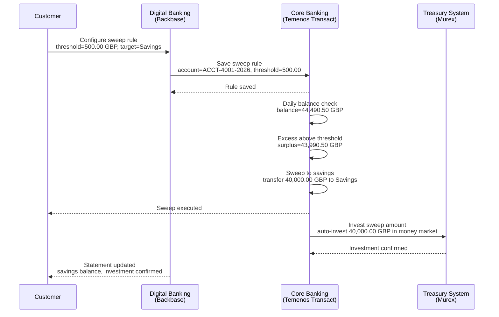
```mermaid
sequenceDiagram
    participant C as Customer
    participant DB as Digital Banking<br/>(Backbase)
    participant CBS as Core Banking<br/>(Temenos Transact)
    participant TR as Treasury System<br/>(Murex)
    C->>DB: Configure sweep rule<br/>threshold=500.00 GBP, target=Savings
    DB->>CBS: Save sweep rule<br/>account=ACCT-4001-2026, threshold=500.00
    CBS-->>DB: Rule saved
    CBS->>CBS: Daily balance check<br/>balance=44,490.50 GBP
    CBS->>CBS: Excess above threshold<br/>surplus=43,990.50 GBP
    CBS->>CBS: Sweep to savings<br/>transfer 40,000.00 GBP to Savings
    CBS-->>C: Sweep executed
    CBS->>TR: Invest sweep amount<br/>auto-invest 40,000.00 GBP in money market
    TR-->>CBS: Investment confirmed
    DB-->>C: Statement updated<br/>savings balance, investment confirmed
```

#### Integration Details

| Flow | Entity | Info Flow | Source | Target | Source Conn | Target Conn | Pattern | Complexity |
|------|--------|-----------|--------|--------|-------------|-------------|---------|------------|
| Sweep Products | Rule | SaveSweepRule | Digital Banking (Backbase) | Core Banking (Temenos Transact) | Backbase REST API | Temenos REST API (API Key) | API-led (Real-time) | Simple |
| Sweep Products | Sweep | ExecuteSweep | Core Banking (Temenos Transact) | Core Banking (Temenos Transact) | Internal | Internal | Batch (Scheduled) | Medium |
| Sweep Products | Investment | AutoInvestSurplus | Core Banking (Temenos Transact) | Treasury System (Murex) | Temenos REST API | Murex API (SOAP) | API-led (Real-time) | Medium |
| Sweep Products | Reporting | GenerateSweepReport | Core Banking (Temenos Transact) | Treasury System (Murex) | Temenos REST API | Murex API (SOAP) | Batch (Scheduled) | Simple |
| Sweep Products | Tax | CalculateTaxOnInterest | Core Banking (Temenos Transact) | Tax Engine (Vertex) | Temenos REST API | Vertex API (SOAP) | Event-driven | Medium |

#### Acceptance Criteria

| Flow | Entity | Acceptance Criterion | Expected Outcome |
|------|--------|---------------------|------------------|
| Sweep Products | Rule | Sweep rule saved with correct threshold, source, and target accounts | Rule activated; sweep runs at next balance check cycle |
| Sweep Products | Sweep | Excess funds swept from source to target account per configured threshold | Funds transferred; both accounts updated; sweep amount = balance - threshold |
| Sweep Products | Investment | Swept funds auto-invested in money market fund via Murex treasury system | Investment confirmed; fund price and units recorded; NAV reported daily |
| Sweep Products | Reporting | Sweep activity report generated for treasury | Report includes all sweeps, amounts, timestamps; daily summary sent to treasury team |
| Sweep Products | Tax | Tax on interest calculated at correct rate | Tax calculated per account tax status; tax voucher generated; HMRC reporting filed |
---

---

### 5.4 Overdraft Management

**Description:** Customer manages overdraft facility. System monitors usage, applies interest, sends alerts, handles limit increase requests and fee processing.

**Actors:** Customer, Product Manager, Risk Analyst  
**Systems:** Core Banking (Temenos Transact), Digital Banking (Backbase), Decision Engine (FICO), Notification Service (Firebase), CRM (Salesforce Financial Services)

#### Sequence Diagram

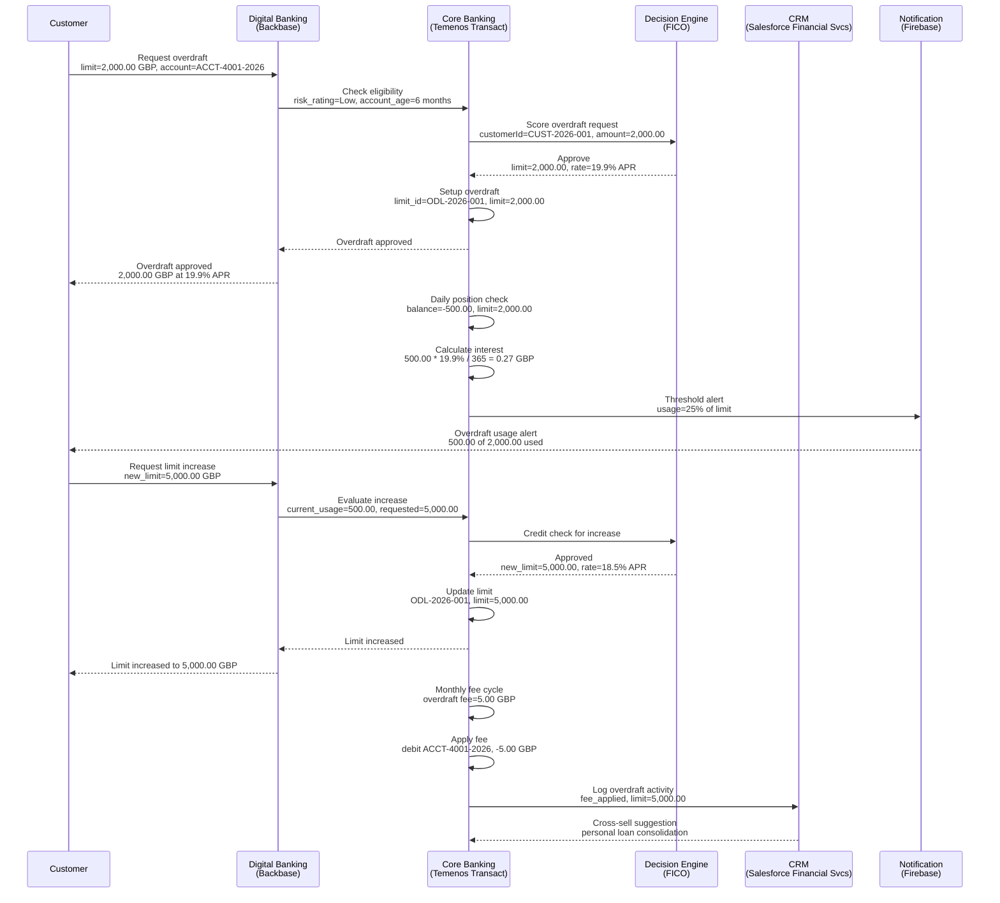
```mermaid
sequenceDiagram
    participant C as Customer
    participant DB as Digital Banking<br/>(Backbase)
    participant CBS as Core Banking<br/>(Temenos Transact)
    participant DE as Decision Engine<br/>(FICO)
    participant CRM as CRM<br/>(Salesforce Financial Svcs)
    participant NOT as Notification<br/>(Firebase)
    C->>DB: Request overdraft<br/>limit=2,000.00 GBP, account=ACCT-4001-2026
    DB->>CBS: Check eligibility<br/>risk_rating=Low, account_age=6 months
    CBS->>DE: Score overdraft request<br/>customerId=CUST-2026-001, amount=2,000.00
    DE-->>CBS: Approve<br/>limit=2,000.00, rate=19.9% APR
    CBS->>CBS: Setup overdraft<br/>limit_id=ODL-2026-001, limit=2,000.00
    CBS-->>DB: Overdraft approved
    DB-->>C: Overdraft approved<br/>2,000.00 GBP at 19.9% APR
    CBS->>CBS: Daily position check<br/>balance=-500.00, limit=2,000.00
    CBS->>CBS: Calculate interest<br/>500.00 * 19.9% / 365 = 0.27 GBP
    CBS->>NOT: Threshold alert<br/>usage=25% of limit
    NOT-->>C: Overdraft usage alert<br/>500.00 of 2,000.00 used
    C->>DB: Request limit increase<br/>new_limit=5,000.00 GBP
    DB->>CBS: Evaluate increase<br/>current_usage=500.00, requested=5,000.00
    CBS->>DE: Credit check for increase
    DE-->>CBS: Approved<br/>new_limit=5,000.00, rate=18.5% APR
    CBS->>CBS: Update limit<br/>ODL-2026-001, limit=5,000.00
    CBS-->>DB: Limit increased
    DB-->>C: Limit increased to 5,000.00 GBP
    CBS->>CBS: Monthly fee cycle<br/>overdraft fee=5.00 GBP
    CBS->>CBS: Apply fee<br/>debit ACCT-4001-2026, -5.00 GBP
    CBS->>CRM: Log overdraft activity<br/>fee_applied, limit=5,000.00
    CRM-->>CBS: Cross-sell suggestion<br/>personal loan consolidation
```

#### Integration Details

| Flow | Entity | Info Flow | Source | Target | Source Conn | Target Conn | Pattern | Complexity |
|------|--------|-----------|--------|--------|-------------|-------------|---------|------------|
| Overdraft | Setup | SetupOverdraftLimit | Digital Banking (Backbase) | Core Banking (Temenos Transact) | Backbase REST API | Temenos REST API (API Key) | API-led (Real-time) | Medium |
| Overdraft | Scoring | ScoreOverdraftRequest | Core Banking (Temenos Transact) | Decision Engine (FICO) | Temenos REST API | FICO Blaze API (REST) | API-led (Real-time) | Medium |
| Overdraft | Alert | SendUsageAlert | Core Banking (Temenos Transact) | Notification Service (Firebase) | Temenos REST API | Firebase FCM API | Event-driven | Simple |
| Overdraft | Increase | ProcessLimitIncrease | Digital Banking (Backbase) | Core Banking (Temenos Transact) | Backbase REST API | Temenos REST API (API Key) | API-led (Real-time) | Medium |
| Overdraft | Fee | ApplyOverdraftFee | Core Banking (Temenos Transact) | Core Banking (Temenos Transact) | Internal | Internal | Batch (Scheduled) | Simple |
| Overdraft | CrossSell | GetCrossSellOffer | Core Banking (Temenos Transact) | CRM (Salesforce Financial Services) | Temenos REST API | Salesforce REST API (OAuth2) | API-led (Real-time) | Medium |

#### Acceptance Criteria

| Flow | Entity | Acceptance Criterion | Expected Outcome |
|------|--------|---------------------|------------------|
| Overdraft | Setup | Customer requests overdraft; eligibility checked and limit set | Eligibility verified; limit <= risk-based max; overdraft activated immediately |
| Overdraft | Scoring | Credit score-based decision for overdraft approval | Score threshold determines approval; auto-approved for scores >680; manual review <680 |
| Overdraft | Alert | Customer notified when overdraft usage crosses thresholds (25%, 50%, 75%, 90%) | Alert sent within 5 minutes of crossing threshold; contains usage details and interest info |
| Overdraft | Increase | Limit increase processed after re-scoring | Increase approved within customer risk profile; new limit effective immediately |
| Overdraft | Fee | Monthly overdraft fee applied on correct schedule | Fee applied; fee waived if balance positive for 80% of month; fee amount per published schedule |
| Overdraft | CrossSell | Cross-sell offer generated based on overdraft usage patterns | Relevant offer displayed; consolidation loan offered for persistent overdraft >60 days |

# 6: Risk & Compliance  - `BC012` `BC013`

### 6.1 Fraud Detection & Prevention

**Description:** Transactions monitored in real-time. Fraud detection system scores transactions, triggers alerts, blocks suspicious activity, escalates to investigators.

**Actors:** Fraud Investigator, Risk Analyst  
**Systems:** Fraud Detection (FICO Falcon), Core Banking (Temenos Transact), Case Management (Pega)

#### Sequence Diagram

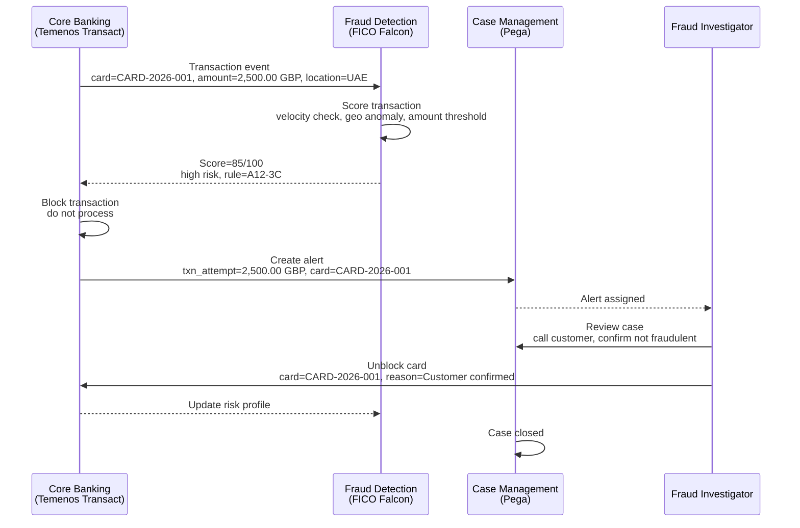
```mermaid
sequenceDiagram
    participant CBS as Core Banking<br/>(Temenos Transact)
    participant FR as Fraud Detection<br/>(FICO Falcon)
    participant CM as Case Management<br/>(Pega)
    participant FI as Fraud Investigator
    CBS->>FR: Transaction event<br/>card=CARD-2026-001, amount=2,500.00 GBP, location=UAE
    FR->>FR: Score transaction<br/>velocity check, geo anomaly, amount threshold
    FR-->>CBS: Score=85/100<br/>high risk, rule=A12-3C
    CBS->>CBS: Block transaction<br/>do not process
    CBS->>CM: Create alert<br/>txn_attempt=2,500.00 GBP, card=CARD-2026-001
    CM-->>FI: Alert assigned
    FI->>CM: Review case<br/>call customer, confirm not fraudulent
    FI->>CBS: Unblock card<br/>card=CARD-2026-001, reason=Customer confirmed
    CBS-->>FR: Update risk profile
    CM->>CM: Case closed
```

#### Integration Details

| Flow | Entity | Info Flow | Source | Target | Source Conn | Target Conn | Pattern | Complexity |
|------|--------|-----------|--------|--------|-------------|-------------|---------|------------|
| Fraud Detection | Transaction | SendTransactionEvent | Core Banking (Temenos Transact) | Fraud Detection (FICO Falcon) | Temenos REST API | Falcon API (ISO 8583) | API-led (Real-time) | High |
| Fraud Detection | Alert | CreateFraudAlert | Core Banking (Temenos Transact) | Case Management (Pega) | Temenos REST API | Pega REST API (OAuth2) | Event-driven | Medium |
| Fraud Detection | Unblock | UnblockCard | Case Management (Pega) | Core Banking (Temenos Transact) | Pega REST API (OAuth2) | Temenos REST API | API-led (Real-time) | Simple |
| Fraud Detection | Rule | UpdateFraudRuleSet | Fraud Detection (FICO Falcon) | Fraud Detection (FICO Falcon) | Internal | Internal | Batch (Scheduled) | Medium |
| Fraud Detection | Report | GenerateFraudDashboard | Case Management (Pega) | BI Platform (Tableau) | Pega REST API (OAuth2) | Tableau REST API | Batch (Scheduled) | Simple |

#### Acceptance Criteria

| Flow | Entity | Acceptance Criterion | Expected Outcome |
|------|--------|---------------------|------------------|
| Fraud Detection | Transaction | Transaction event sent to FICO Falcon for scoring in real-time | Score returned in <100ms; high-risk transactions blocked before completion |
| Fraud Detection | Alert | Pega case created for transactions exceeding fraud threshold | Alert created with all context; assigned to investigator queue; SLA 30 minutes for high risk |
| Fraud Detection | Unblock | Card unblocked by fraud investigator after customer confirms authenticity | Card status restored to Active within 60 seconds of investigator action |
| Fraud Detection | Rule | Fraud detection rules updated from central rule repository | New rules active within 5 minutes; version history maintained; rollback capability exists |
| Fraud Detection | Report | Fraud dashboard updated with real-time metrics | Dashboard refreshes every 60 seconds; alert counts, score distribution, false positive rate visible |
---

---

### 6.2 AML/Sanctions Screening

**Description:** Customer and transaction screening against sanctions lists, PEP databases, adverse media. Alerts generated for compliance review.

**Actors:** Compliance Officer, Risk Analyst  
**Systems:** AML System (Oracle FCCM), Sanctions Screening (WorldCheck), Case Management (Pega), Core Banking (Temenos Transact)

#### Sequence Diagram

```mermaid
sequenceDiagram
    participant CBS as Core Banking<br/>(Temenos Transact)
    participant AML as AML System<br/>(Oracle FCCM)
    participant SCR as Sanctions Screening<br/>(WorldCheck)
    participant CM as Case Management<br/>(Pega)
    participant CO as Compliance Officer
    CBS->>AML: Payment for screening<br/>customer=Bob Smith, IBAN=DE89370400440532013000, amount=15,000 GBP
    AML->>SCR: Sanctions check<br/>UN, OFAC, EU, HMT sanctions lists
    SCR-->>AML: Possible match<br/>name variant, score=87%
    AML->>SCR: PEP check<br/>Bob Smith, country=DE
    SCR-->>AML: PEP status=No
    AML->>SCR: Adverse media scan
    SCR-->>AML: No adverse media
    AML->>AML: Composite risk score<br/>score=42/100, medium risk
    AML->>CM: Create alert<br/>caseID=AML-2026-088, severity=Medium
    CM-->>CO: Alert for review
    CO->>CM: Review & clear<br/>false positive, name variant
    CM->>CBS: Release payment
    CBS->>CBS: Process payment
```

#### Integration Details

| Flow | Entity | Info Flow | Source | Target | Source Conn | Target Conn | Pattern | Complexity |
|------|--------|-----------|--------|--------|-------------|-------------|---------|------------|
| AML Screening | Payment | ScreenPayment | Core Banking (Temenos Transact) | AML System (Oracle FCCM) | Temenos REST API | Oracle FCCM API (SOAP) | API-led (Real-time) | High |
| AML Screening | Sanctions | CheckSanctionsLists | AML System (Oracle FCCM) | Sanctions Screening (WorldCheck) | Oracle FCCM API | WorldCheck API (SOAP) | API-led (Real-time) | High |
| AML Screening | Alert | CreateAMLAlert | AML System (Oracle FCCM) | Case Management (Pega) | Oracle FCCM API | Pega REST API (OAuth2) | Event-driven | Medium |
| AML Screening | Release | ReleasePayment | Case Management (Pega) | Core Banking (Temenos Transact) | Pega REST API (OAuth2) | Temenos REST API | API-led (Real-time) | Simple |
| AML Screening | List | UpdateSanctionsLists | Sanctions Screening (WorldCheck) | AML System (Oracle FCCM) | WorldCheck API (SOAP) | Oracle FCCM API (SOAP) | Batch (Scheduled) | Medium |
| AML Screening | SAR | SubmitSuspiciousActivityReport | Case Management (Pega) | Regulator Portal (NCA) | Pega REST API (OAuth2) | NCA Gateway (SFTP) | Batch (Scheduled) | High |

#### Acceptance Criteria

| Flow | Entity | Acceptance Criterion | Expected Outcome |
|------|--------|---------------------|------------------|
| AML Screening | Payment | Payment sent to Oracle FCCM for AML screening before processing | Payment held in pending state; released only after compliance clearance |
| AML Screening | Sanctions | Payment checked against UN, OFAC, EU, and HMT sanctions lists | Clear matches >=90% blocked; false positive process allows compliance override |
| AML Screening | Alert | AML alert created in Pega for compliance officer review | Alert with risk score and match details; SLA for review: 24 hours for medium risk |
| AML Screening | Release | Payment released by compliance officer after false positive determination | Payment processed within 60 seconds of release; audit trail of release decision logged |
| AML Screening | List | Sanctions lists updated within 24 hours of regulatory release | List version tracked; update applied without system restart; audit of list changes maintained |
| AML Screening | SAR | SAR report submitted to NCA within required timeframe | SAR submitted within 24 hours of determination; reference number received; archive copy retained |
---

---

### 6.3 Regulatory Reporting

**Description:** Bank generates regulatory reports (COREP, FINREP, Basel IV, PSD2). Data extracted from source systems, transformed, validated, submitted to regulators.

**Actors:** Compliance Officer, Finance Manager  
**Systems:** Regulatory Reporting (AxiomSL), Core Banking (Temenos Transact), Lending System (nCino), Treasury System (Murex), Regulator Portal (PRA/ECB)

#### Sequence Diagram

```mermaid
sequenceDiagram
    participant CBS as Core Banking<br/>(Temenos Transact)
    participant LEN as Lending System<br/>(nCino)
    participant TR as Treasury System<br/>(Murex)
    participant RR as Regulatory Reporting<br/>(AxiomSL)
    participant REG as Regulator Portal<br/>(PRA)
    CBS->>RR: Extract balance sheet data<br/>loans, deposits, capital
    LEN->>RR: Extract lending portfolio<br/>EAD, PD, LGD parameters
    TR->>RR: Extract treasury positions<br/>liquidity coverage ratio
    RR->>RR: Aggregate & validate<br/>Basel IV capital adequacy
    RR->>RR: Generate COREP report<br/>own_funds, credit_risk, market_risk
    RR->>RR: Generate FINREP report<br/>financial statements
    RR->>REG: Submit COREP<br/>XBRL format, encrypted
    REG-->>RR: Ack received<br/>submissionID=SUB-2026-088
    RR->>RR: Archive audit trail
```

#### Integration Details

| Flow | Entity | Info Flow | Source | Target | Source Conn | Target Conn | Pattern | Complexity |
|------|--------|-----------|--------|--------|-------------|-------------|---------|------------|
| Regulatory Reporting | Balance Sheet | ExtractBalanceSheet | Core Banking (Temenos Transact) | Regulatory Reporting (AxiomSL) | Temenos ODBC | AxiomSL JDBC | Batch (ETL) | Medium |
| Regulatory Reporting | Lending Data | ExtractLendingPortfolio | Lending System (nCino) | Regulatory Reporting (AxiomSL) | nCino REST API | AxiomSL REST API | Batch (ETL) | Medium |
| Regulatory Reporting | Treasury Data | ExtractTreasuryPositions | Treasury System (Murex) | Regulatory Reporting (AxiomSL) | Murex API (SFTP) | AxiomSL SFTP | Batch (Scheduled) | High |
| Regulatory Reporting | Submission | SubmitToRegulator | Regulatory Reporting (AxiomSL) | Regulator Portal (PRA) | AxiomSL XBRL | PRA Gateway (SFTP) | Batch (Scheduled) | High |
| Regulatory Reporting | Validation | ValidateReportData | Regulatory Reporting (AxiomSL) | Data Quality Tool (Informatica) | AxiomSL REST API | Informatica API (REST) | Batch (ETL) | Medium |
| Regulatory Reporting | SignOff | DigitalSignReport | Regulatory Reporting (AxiomSL) | Digital Signature (DocuSign) | AxiomSL REST API | DocuSign API (REST) | API-led (Real-time) | Simple |

#### Acceptance Criteria

| Flow | Entity | Acceptance Criterion | Expected Outcome |
|------|--------|---------------------|------------------|
| Regulatory Reporting | Balance Sheet | Balance sheet data extracted from Temenos Transact to AxiomSL | Extract completed for all entities; data validated against GL; discrepancies <0.01% |
| Regulatory Reporting | Lending Data | Lending portfolio data (EAD, PD, LGD) extracted from nCino | All active loans included; risk parameters match source system |
| Regulatory Reporting | Treasury Data | Treasury position data extracted from Murex for liquidity reporting | LCR and NSFR calculated correctly; intraday positions included |
| Regulatory Reporting | Submission | COREP/FINREP reports submitted to regulator via XBRL | Regulator acknowledgment received; submission timestamp logged; retry on failure with backoff |
| Regulatory Reporting | Validation | Report data validated against data quality rules | All data quality rules passed; failure rate <1%; invalid data flagged and quarantined |
| Regulatory Reporting | SignOff | Report digitally signed by authorized signatory | Digital signature applied; signatory verified; signing chain auditable |

# 7: Channels & Digital Banking  - `BC001` `BC003` `BC002`

### 7.1 Internet Banking

**Description:** Customer logs in, views dashboard, performs banking activities. System authenticates, presents consolidated view, processes requests.

**Actors:** Customer, Digital Team  
**Systems:** Internet Banking (Backbase), Core Banking (Temenos Transact), CRM (Salesforce Financial Services), Content Management (Adobe AEM), Analytics (Google Analytics)

#### Sequence Diagram

```mermaid
sequenceDiagram
    participant C as Customer
    participant IB as Internet Banking<br/>(Backbase)
    participant CBS as Core Banking<br/>(Temenos Transact)
    participant CRM as CRM<br/>(Salesforce Financial Svcs)
    participant CMS as Content Mgmt<br/>(Adobe AEM)
    C->>IB: Login with credentials<br/>username=alice.j
    IB->>IB: MFA authentication<br/>OTP sent to +44 7700 900001
    C->>IB: Enter OTP
    IB->>IB: Authenticated
    IB->>CBS: Fetch account balances<br/>customerId=CUST-2026-001
    CBS-->>IB: Accounts<br/>current=44,490.50 GBP, savings=40,000.00 GBP
    IB->>CRM: Fetch customer profile<br/>offers, alerts
    CRM-->>IB: Profile with 2 offers
    IB->>CMS: Fetch marketing content<br/>banners, promotions
    CMS-->>IB: Content rendered
    IB-->>C: Dashboard displayed<br/>aggregated balances, offers
    C->>IB: Initiate bill payment<br/>utility, amount=89.50 GBP
    IB->>CBS: Process payment
    CBS-->>IB: Payment confirmed
    IB-->>C: Confirmation displayed
```

#### Integration Details

| Flow | Entity | Info Flow | Source | Target | Source Conn | Target Conn | Pattern | Complexity |
|------|--------|-----------|--------|--------|-------------|-------------|---------|------------|
| Internet Banking | Authentication | AuthenticateUser | Internet Banking (Backbase) | Internet Banking (Backbase) | Internal | Internal | API-led (Real-time) | Simple |
| Internet Banking | Balances | FetchAccountBalances | Internet Banking (Backbase) | Core Banking (Temenos Transact) | Backbase REST API | Temenos REST API (API Key) | API-led (Real-time) | Medium |
| Internet Banking | Profile | GetCustomerProfile | Internet Banking (Backbase) | CRM (Salesforce Financial Services) | Backbase REST API | Salesforce REST API (OAuth2) | API-led (Real-time) | Simple |
| Internet Banking | Content | FetchMarketingContent | Internet Banking (Backbase) | Content Mgmt (Adobe AEM) | Backbase REST API | AEM REST API | API-led (Real-time) | Simple |
| Internet Banking | Analytics | TrackUserBehavior | Internet Banking (Backbase) | Analytics (Google Analytics) | Backbase REST API | GA4 API (REST) | Event-driven | Simple |
| Internet Banking | Search | IndexSearchResults | Internet Banking (Backbase) | Search Engine (Elasticsearch) | Backbase REST API | Elasticsearch REST API | Event-driven | Medium |

#### Acceptance Criteria

| Flow | Entity | Acceptance Criterion | Expected Outcome |
|------|--------|---------------------|------------------|
| Internet Banking | Authentication | User authenticated via MFA (OTP) with correct credentials | Valid credentials -> access granted; invalid OTP -> locked after 3 attempts |
| Internet Banking | Balances | Account balances fetched from Temenos for all customer accounts | All accounts displayed; balances updated to real-time; masking for inactive accounts |
| Internet Banking | Profile | Customer profile and offers retrieved from Salesforce CRM | Personalized offers displayed; profile data matches CRM source |
| Internet Banking | Content | Marketing content fetched from Adobe AEM CMS | Content rendered correctly; A/B variants served per customer segment |
| Internet Banking | Analytics | User behavior tracked and sent to analytics platform | Page views, clicks, and session duration recorded; privacy-compliant data anonymization applied |
| Internet Banking | Search | Search results indexed by Elasticsearch with fuzzy matching | Search returns results within 500ms; typos corrected; most relevant results ranked first |
---

---

### 7.2 Mobile Banking

**Description:** Customer uses mobile app. Biometric authentication, push notifications, mobile check deposit, card management.

**Actors:** Customer, Digital Team  
**Systems:** Mobile App (Backbase), Core Banking (Temenos Transact), Push Notification (Firebase/APNs), Cheque Processing

#### Sequence Diagram

```mermaid
sequenceDiagram
    participant C as Customer
    participant MB as Mobile Banking App<br/>(Backbase)
    participant CBS as Core Banking<br/>(Temenos Transact)
    participant PUSH as Push Notification<br/>(Firebase)
    participant CHQ as Cheque Processing
    C->>MB: Open app & authenticate<br/>fingerprint biometric
    MB->>MB: Biometric match<br/>device bound credential
    MB-->>C: Authenticated
    PUSH->>MB: Pending approval alert<br/>authorize new payee + 1,250.00 GBP
    MB-->>C: Approve payment?<br/>notification tap
    C->>MB: Authorize payment
    MB->>CBS: Process payment
    CBS-->>MB: Payment confirmed
    C->>MB: Deposit cheque<br/>photo front & back
    MB->>CHQ: Process image<br/>MICR read, amount OCR
    CHQ-->>MB: Cheque accepted<br/>amount=500.00 GBP, hold=2 days
    MB-->>C: Cheque deposit confirmed
```

#### Integration Details

| Flow | Entity | Info Flow | Source | Target | Source Conn | Target Conn | Pattern | Complexity |
|------|--------|-----------|--------|--------|-------------|-------------|---------|------------|
| Mobile Banking | Authentication | BiometricAuth | Mobile Banking App (Backbase) | Mobile Banking App (Backbase) | Device Biometric API | Internal | API-led (Real-time) | Simple |
| Mobile Banking | Notification | SendPushAlert | Push Notification (Firebase) | Mobile Banking App (Backbase) | Firebase Cloud Messaging | Backbase Mobile SDK | Event-driven | Simple |
| Mobile Banking | Payment | AuthorizePayment | Mobile Banking App (Backbase) | Core Banking (Temenos Transact) | Backbase REST API | Temenos REST API (API Key) | API-led (Real-time) | Medium |
| Mobile Banking | Cheque Deposit | ProcessChequeImage | Mobile Banking App (Backbase) | Cheque Processing | Backbase REST API | Cheque API (Image) | API-led (Real-time) | Medium |
| Mobile Banking | Location | GetNearbyBranches | Mobile Banking App (Backbase) | Location Service (Google Maps) | Backbase Mobile SDK | Google Maps API (REST) | API-led (Real-time) | Simple |
| Mobile Banking | Feedback | SubmitAppFeedback | Mobile Banking App (Backbase) | CRM (Salesforce Financial Services) | Backbase REST API | Salesforce REST API (OAuth2) | API-led (Real-time) | Simple |

#### Acceptance Criteria

| Flow | Entity | Acceptance Criterion | Expected Outcome |
|------|--------|---------------------|------------------|
| Mobile Banking | Authentication | Biometric authentication (fingerprint/face) matches device-bound credential | Authentication completes <1 second; biometric mismatch shows PIN fallback |
| Mobile Banking | Notification | Push notification sent via Firebase for pending payment approval | Notification delivered within 5 seconds; tap opens correct approval screen |
| Mobile Banking | Payment | Payment authorized and processed via mobile approval flow | Payment confirmed; transaction appears in history; notification sent |
| Mobile Banking | Cheque Deposit | Cheque image processed with MICR read and amount OCR | MICR and OCR accuracy >99%; cheque accepted with 2-day hold applied |
| Mobile Banking | Location | Nearby branches retrieved based on device GPS location | Branches sorted by distance; opening hours displayed; directions link provided |
| Mobile Banking | Feedback | App feedback submitted and stored in CRM | Feedback linked to customer record; rating captured; feedback routed to product team |
---

---

### 7.3 Branch Banking (Teller)

**Description:** Customer visits branch. Teller processes cash/cheque transactions. Branch system integrates with core banking for real-time balance and transaction posting.

**Actors:** Customer, Branch Staff, Teller  
**Systems:** Branch Teller (Fiserv DNA), Queue Management (Qmatic), Core Banking (Temenos Transact), CRM (Salesforce Financial Services)

#### Sequence Diagram

```mermaid
sequenceDiagram
    participant C as Customer
    participant QM as Queue Management<br/>(Qmatic)
    participant TEL as Branch Teller<br/>(Fiserv DNA)
    participant CBS as Core Banking<br/>(Temenos Transact)
    participant CRM as CRM<br/>(Salesforce Financial Svcs)
    C->>QM: Check in at kiosk<br/>customerId=CUST-2026-001
    QM-->>C: Ticket #42, estimated wait 3 min
    QM->>TEL: Customer assigned to teller
    TEL->>TEL: Identify customer
    TEL->>CBS: View customer accounts<br/>ACCT-4001-2026
    CBS-->>TEL: Balance=44,490.50 GBP
    C->>TEL: Deposit cash<br/>amount=1,000.00 GBP
    TEL->>CBS: Post cash deposit<br/>credit ACCT-4001-2026, +1,000.00 GBP
    CBS-->>TEL: Balance updated=45,490.50 GBP
    TEL-->>C: Receipt printed
    TEL->>CRM: Log interaction<br/>type=cash_deposit, amount=1,000.00
    CRM-->>TEL: Cross-sell suggestion<br/>term deposit offer, 4.2% p.a.
    TEL->>C: Offer term deposit<br/>10,000 GBP at 4.2%, 12 months
```

#### Integration Details

| Flow | Entity | Info Flow | Source | Target | Source Conn | Target Conn | Pattern | Complexity |
|------|--------|-----------|--------|--------|-------------|-------------|---------|------------|
| Branch Banking | Queue | CheckInCustomer | Queue Management (Qmatic) | Branch Teller (Fiserv DNA) | Qmatic API | Fiserv Teller API (REST) | Event-driven | Simple |
| Branch Banking | Transaction | PostCashDeposit | Branch Teller (Fiserv DNA) | Core Banking (Temenos Transact) | Fiserv Teller API | Temenos REST API (API Key) | API-led (Real-time) | Simple |
| Branch Banking | Interaction | LogCustomerInteraction | Branch Teller (Fiserv DNA) | CRM (Salesforce Financial Services) | Fiserv REST API | Salesforce REST API (OAuth2) | API-led (Real-time) | Simple |
| Branch Banking | Cross-Sell | GetCrossSellOffer | Branch Teller (Fiserv DNA) | CRM (Salesforce Financial Services) | Fiserv REST API | Salesforce REST API (OAuth2) | API-led (Real-time) | Medium |
| Branch Banking | Appointment | BookAppointment | Queue Management (Qmatic) | CRM (Salesforce Financial Services) | Qmatic API | Salesforce REST API (OAuth2) | Event-driven | Simple |
| Branch Banking | Cash | ReconcileTellerCash | Branch Teller (Fiserv DNA) | Core Banking (Temenos Transact) | Fiserv Teller API | Temenos REST API (API Key) | Batch (Scheduled) | Medium |

#### Acceptance Criteria

| Flow | Entity | Acceptance Criterion | Expected Outcome |
|------|--------|---------------------|------------------|
| Branch Banking | Queue | Customer checked in at Qmatic kiosk and assigned to next available teller | Ticket issued; estimated wait time displayed; teller assignment within <5 minutes |
| Branch Banking | Transaction | Cash deposit posted to customer account in real-time via teller system | Balance updated; receipt generated with transaction reference; teller cash drawer reconciled |
| Branch Banking | Interaction | Customer interaction logged in Salesforce CRM with type and amount | Interaction record created; customer 360 view updated |
| Branch Banking | Cross-Sell | CRM returns cross-sell suggestion based on customer profile and transaction | Offer displayed to teller within 1 second; offer accepted/rejected tracked |
| Branch Banking | Appointment | Customer appointment booked and synced with teller schedule | Appointment slot confirmed; reminder sent 24 hours before; wait time minimized |
| Branch Banking | Cash | Teller cash position reconciled at end of shift | Cash difference <0.01% of total; discrepancies flagged; supervisor sign-off required |

# 8: Finance, Treasury & Settlement  - `BC010` `BC014` `BC061` `BC062`

### 8.1 Nostro/Vostro Reconciliation

**Description:** Bank reconciles nostro (domestic bank's accounts held at foreign banks) and vostro (foreign bank's accounts held at domestic bank) positions daily.

**Actors:** Settlement Operations, Finance Manager  
**Systems:** SWIFT Alliance Gateway, Reconciliation Engine (SmartStream/Duco), Core Banking (Temenos Transact), General Ledger (SAP)

#### Sequence Diagram

```mermaid
sequenceDiagram
    participant SW as SWIFT Alliance<br/>(Correspondent Bank)
    participant REC as Reconciliation Engine<br/>(SmartStream)
    participant CBS as Core Banking<br/>(Temenos Transact)
    participant GL as General Ledger<br/>(SAP)
    participant OPS as Settlement Operations
    SW->>REC: Send MT950 statement<br/>nostro account, date=2026-07-05
    REC->>REC: Load statement<br/>125 transactions, total=4,250,000.00 GBP
    CBS->>REC: Internal transactions<br/>matching period=2026-07-05
    REC->>REC: Auto-match<br/>122 matched, 3 unmatched
    REC-->>OPS: Exception report<br/>3 unmatched items, total=12,500.00 GBP
    OPS->>REC: Manual match<br/>investigate discrepancies
    REC-->>GL: Post adjustments<br/>journal entries for matched items
    GL-->>REC: Adjustments posted
    REC->>SW: Send MT940 response<br/>confirmed balance
    REC->>REC: Generate reconciliation report<br/>breakdown=99.5% matched
```

#### Integration Details

| Flow | Entity | Info Flow | Source | Target | Source Conn | Target Conn | Pattern | Complexity |
|------|--------|-----------|--------|--------|-------------|-------------|---------|------------|
| Nostro Reconciliation | Statement | ReceiveMT950 | SWIFT Alliance (Correspondent) | Reconciliation Engine (SmartStream) | SWIFT MT950 | SmartStream API (REST) | Batch (Scheduled) | High |
| Nostro Reconciliation | Transactions | LoadInternalTxns | Core Banking (Temenos Transact) | Reconciliation Engine (SmartStream) | Temenos ODBC | SmartStream JDBC | Batch (ETL) | Medium |
| Nostro Reconciliation | Adjustments | PostAdjustments | Reconciliation Engine (SmartStream) | General Ledger (SAP) | SmartStream REST API | SAP API (SOAP) | Event-driven | Medium |
| Nostro Reconciliation | Response | SendMT940 | Reconciliation Engine (SmartStream) | SWIFT Alliance (Correspondent) | SmartStream API | SWIFT MT940 | Batch (Scheduled) | Medium |
| Nostro Reconciliation | Reporting | GenerateAgedBreakReport | Reconciliation Engine (SmartStream) | General Ledger (SAP) | SmartStream REST API | SAP API (SOAP) | Batch (Scheduled) | Medium |
| Nostro Reconciliation | Alert | SendBreakAlert | Reconciliation Engine (SmartStream) | Notification Service (Firebase) | SmartStream REST API | Firebase FCM API | Event-driven | Simple |

#### Acceptance Criteria

| Flow | Entity | Acceptance Criterion | Expected Outcome |
|------|--------|---------------------|------------------|
| Nostro Reconciliation | Statement | SWIFT MT950 statement received from correspondent bank and loaded | Statement parsed correctly; all 125 transactions loaded; unmatched items <5% |
| Nostro Reconciliation | Transactions | Internal transactions loaded from Temenos for matching period | All internal txns loaded; date range matches statement period |
| Nostro Reconciliation | Adjustments | Unmatched items manually reviewed and adjustment journals posted to SAP GL | Adjustment entries posted; GL impact correctly calculated; audit trail maintained |
| Nostro Reconciliation | Response | MT940 response sent to correspondent bank with confirmed balance | Balance confirmed within tolerance; discrepancies escalated to treasury |
| Nostro Reconciliation | Reporting | Aged break report generated with items >30 days highlighted | Report generated daily; aged items tracked and escalated; break aging trend visible |
| Nostro Reconciliation | Alert | Alert sent to operations team when break exceeds threshold | Alert sent within 5 minutes of break detection; threshold configurable per currency |
---

---

### 8.2 Treasury & Liquidity Management

**Description:** Treasury monitors liquidity position, executes money market trades, manages FX exposure, ensures regulatory liquidity ratios met.

**Actors:** Treasury Analyst, Finance Manager  
**Systems:** Treasury System (Murex), Core Banking (Temenos Transact), FX Matching Platform (FXall), SWIFT Alliance, General Ledger (SAP)

#### Sequence Diagram

```mermaid
sequenceDiagram
    participant CBS as Core Banking<br/>(Temenos Transact)
    participant TR as Treasury System<br/>(Murex)
    participant FX as FX Matching<br/>(FXall)
    participant SW as SWIFT Alliance
    participant GL as General Ledger<br/>(SAP)
    CBS->>TR: Position data feed<br/>cash_balance=12,500,000 GBP, forecast=3d
    TR->>TR: Calculate liquidity gaps<br/>LCR=145%, NSFR=112%
    TR->>TR: Identify FX exposure<br/>EUR/USD open=5,000,000 EUR
    Treasury Analyst->>TR: Execute FX trade<br/>sell 5M EUR, buy 5.75M USD
    TR->>FX: Submit FX order<br/>EUR/USD, spot, 5M EUR
    FX-->>TR: Trade executed<br/>rate=1.15, value_date=2026-07-08
    TR->>SW: Send confirmation MT300
    SW-->>TR: Confirmation matched
    TR->>GL: Post FX P&L<br/>realized P&L=12,500 GBP
    TR->>GL: Post liquidity report<br/>LCR=145%, NSFR=112%
```

#### Integration Details

| Flow | Entity | Info Flow | Source | Target | Source Conn | Target Conn | Pattern | Complexity |
|------|--------|-----------|--------|--------|-------------|-------------|---------|------------|
| Treasury Management | Position | ReceivePositionData | Core Banking (Temenos Transact) | Treasury System (Murex) | Temenos REST API | Murex API (REST) | Event-driven | Medium |
| Treasury Management | FX Trade | ExecuteFXOrder | Treasury System (Murex) | FX Matching (FXall) | Murex API | FXall API (FIX) | API-led (Real-time) | High |
| Treasury Management | Confirmation | SendMT300 | Treasury System (Murex) | SWIFT Alliance | Murex API (MT300) | SWIFT Alliance | API-led (Real-time) | Medium |
| Treasury Management | Liquidity | PostLiquidityReport | Treasury System (Murex) | General Ledger (SAP) | Murex API (REST) | SAP API (SOAP) | Batch (Scheduled) | Medium |
| Treasury Management | Forecast | GenerateLiquidityForecast | Treasury System (Murex) | Core Banking (Temenos Transact) | Murex API (REST) | Temenos REST API (API Key) | API-led (Real-time) | Medium |
| Treasury Management | Hedge | ExecuteFXHedge | Treasury System (Murex) | FX Matching (FXall) | Murex API | FXall API (FIX) | API-led (Real-time) | High |

#### Acceptance Criteria

| Flow | Entity | Acceptance Criterion | Expected Outcome |
|------|--------|---------------------|------------------|
| Treasury Management | Position | Cash position data received from Temenos Transact into Murex | Position updated in real-time; forecast horizon configurable (1-30 days) |
| Treasury Management | FX Trade | FX order submitted to FXall and executed at quoted rate | Trade executed within 10 seconds; rate within 0.1% of quoted; confirmation received |
| Treasury Management | Confirmation | SWIFT MT300 confirmation sent and matched with counterparty | Confirmation matched; unmatched confirmations escalated within 1 hour |
| Treasury Management | Liquidity | LCR and NSFR liquidity ratios calculated and posted to SAP GL | Ratios within regulatory limits; breach alert generated if below threshold |
| Treasury Management | Forecast | Liquidity forecast generated with 30-day forward view | Forecast accuracy within 95%; cash flow waterfall visible; what-if scenarios supported |
| Treasury Management | Hedge | FX hedge executed to mitigate open currency exposure | Hedge covers 100% of projected exposure; hedge effectiveness tested monthly |
---

---

### 8.3 End-of-Day Settlement

**Description:** Bank settles all payment obligations, net positions submitted to RTGS, finality achieved, GL updated.

**Actors:** Settlement Operations, Treasury  
**Systems:** Payment Hub (Volante), RTGS System (TARGET2/Bank of England), Core Banking (Temenos Transact), General Ledger (SAP), Reconciliation Engine (SmartStream)

#### Sequence Diagram

```mermaid
sequenceDiagram
    participant PH as Payment Hub<br/>(Volante)
    participant RTGS as RTGS System<br/>(TARGET2)
    participant CBS as Core Banking<br/>(Temenos Transact)
    participant GL as General Ledger<br/>(SAP)
    participant REC as Reconciliation Engine<br/>(SmartStream)
    PH->>PH: Aggregate net positions<br/>total_outgoing=85,000,000 GBP, incoming=72,500,000 GBP
    PH->>RTGS: Submit net settlement<br/>multilateral net position=-12,500,000 GBP
    RTGS->>RTGS: Process settlement<br/>queue, collateral check, finality
    RTGS-->>PH: Settlement finality<br/>timestamp=2026-07-06T18:00:00Z
    PH->>CBS: Post settlement entries<br/>debit/credit positions
    CBS-->>PH: Settlement posted
    PH->>GL: Post GL journal<br/>EOD settlement entries
    GL-->>PH: GL updated
    PH->>REC: Settlement transactions
    REC->>REC: Match settled items<br/>all matched, no breaks
    PH->>PH: Generate EOD report<br/>settlement summary
```

#### Integration Details

| Flow | Entity | Info Flow | Source | Target | Source Conn | Target Conn | Pattern | Complexity |
|------|--------|-----------|--------|--------|-------------|-------------|---------|------------|
| EOD Settlement | Net Position | SubmitNetSettlement | Payment Hub (Volante) | RTGS System (TARGET2) | Volante API (ISO 20022) | TARGET2 API (ISO 20022) | Batch (Scheduled) | High |
| EOD Settlement | Posting | PostSettlementEntries | Payment Hub (Volante) | Core Banking (Temenos Transact) | Volante REST API | Temenos REST API (API Key) | API-led (Real-time) | Medium |
| EOD Settlement | GL | PostGLJournal | Payment Hub (Volante) | General Ledger (SAP) | Volante REST API | SAP API (SOAP) | API-led (Real-time) | Medium |
| EOD Settlement | Matching | MatchSettledItems | Payment Hub (Volante) | Reconciliation Engine (SmartStream) | Volante REST API | SmartStream API (REST) | Event-driven | Simple |
| EOD Settlement | Reporting | GenerateSettlementReport | Payment Hub (Volante) | Regulatory Reporting (AxiomSL) | Volante REST API | AxiomSL REST API | Batch (Scheduled) | Medium |
| EOD Settlement | Audit | LogSettlementAudit | Payment Hub (Volante) | Audit System (LogRhythm) | Volante REST API | LogRhythm API (SIEM) | Event-driven | Simple |

#### Acceptance Criteria

| Flow | Entity | Acceptance Criterion | Expected Outcome |
|------|--------|---------------------|------------------|
| EOD Settlement | Net Position | Multilateral net position calculated and submitted to TARGET2 RTGS | Net position calculated correctly; submission before cut-off time |
| EOD Settlement | Posting | Settlement entries posted to Temenos core banking | All entries posted; debit/credit match net position; rejected entries investigated |
| EOD Settlement | GL | End-of-day GL journal posted in SAP | GL balanced; suspense accounts zero; variances <0.001% |
| EOD Settlement | Matching | Settled transactions matched by SmartStream reconciliation engine | 100% matched; any breaks investigated and resolved before next day opening |
| EOD Settlement | Reporting | Settlement report generated with full audit trail | Report includes all transactions; settlement status for each; exception summary provided |
| EOD Settlement | Audit | Settlement audit log sent to SIEM system for compliance | All EOD events logged; tamper-proof audit trail maintained; retention period 7 years |

# 9: Trade Finance  - `BC063`

Trade finance operations covering letter of credit issuance, bank guarantees, and invoice financing. Supports international trade with documentary credit instruments.

### 9.1 Letter of Credit Issuance

**Description:** Importer applies for LC. Bank issues LC via SWIFT MT700 to advising bank. Exporter ships goods, presents documents, bank checks compliance and pays.

**Actors:** Customer (Importer), Trade Operations Officer, Compliance Officer  
**Systems:** Trade Finance System (Finacle Trade), SWIFT Alliance Gateway, Core Banking (Temenos Transact), Compliance (WorldCheck), Document Mgmt (M-Files)

#### Sequence Diagram

```mermaid
sequenceDiagram
    participant IMP as Importer<br/>(Acme Corp Ltd)
    participant TFS as Trade Finance<br/>(Finacle Trade)
    participant SW as SWIFT Alliance
    participant ADV as Advising Bank<br/>(Deutsche Bank)
    participant EXP as Exporter<br/>(Global Exports GmbH)
    participant CBS as Core Banking<br/>(Temenos Transact)
    participant COMP as Compliance<br/>(WorldCheck)
    IMP->>TFS: Submit LC application<br/>beneficiary=Global Exports GmbH, amount=500,000 USD
    TFS->>CBS: Check collateral/limit<br/>applicant=Acme Corp Ltd, limit=2,000,000 USD
    CBS-->>TFS: Limit available<br/>used=750,000, available=1,250,000 USD
    TFS->>COMP: Screen parties<br/>applicant, beneficiary, goods description
    COMP-->>TFS: No sanctions matches<br/>risk=Low
    TFS->>TFS: Generate LC terms<br/>Irrevocable Sight LC, exp=2026-12-31
    TFS->>SW: Issue LC via MT700<br/>LC-2026-001, amount=500,000 USD
    SW->>ADV: Forward MT700
    ADV->>ADV: Authenticate & advise<br/>verify SWIFT keys
    ADV-->>EXP: LC advised<br/>LC-2026-001, terms confirmed
    EXP->>EXP: Ship goods<br/>per LC terms, bill of lading issued
    EXP->>ADV: Present documents<br/>invoice, B/L, packing list, COO
    ADV->>ADV: Check documents<br/>against LC terms, discrepancy check
    ADV-->>SW: Forward docs + MT730
    SW->>TFS: Documents received
    TFS->>TFS: Verify documents<br/>compliant, no discrepancies
    TFS->>CBS: Debit applicant<br/>500,000 USD, fee=1,500 USD
    CBS-->>TFS: Payment ready
    TFS->>SW: Issue MT202 cover<br/>payment to advising bank
    SW->>ADV: Cover received
    ADV-->>EXP: Payment credited<br/>500,000 USD less charges
    TFS->>TFS: Archive LC record<br/>closure, audit trail
```

#### Integration Details

| Flow | Entity | Info Flow | Source | Target | Source Conn | Target Conn | Pattern | Complexity |
|------|--------|-----------|--------|--------|-------------|-------------|---------|------------|
| LC Issuance | Application | SubmitLCApplication | Importer Portal (Finacle Trade) | Trade Finance System (Finacle Trade) | Finacle Web Portal | Finacle Trade API | API-led (Real-time) | Medium |
| LC Issuance | Limit | CheckCustomerLimit | Trade Finance System (Finacle Trade) | Core Banking (Temenos Transact) | Finacle REST API | Temenos REST API (API Key) | API-led (Real-time) | Medium |
| LC Issuance | Compliance | ScreenTradeParties | Trade Finance System (Finacle Trade) | Compliance (WorldCheck) | Finacle REST API | WorldCheck API (SOAP) | API-led (Real-time) | High |
| LC Issuance | SWIFT | IssueMT700 | Trade Finance System (Finacle Trade) | SWIFT Alliance Gateway | Finacle Trade API (MT) | SWIFT Alliance (MT700) | API-led (Real-time) | High |
| LC Issuance | Payment | ProcessLCPayment | Trade Finance System (Finacle Trade) | Core Banking (Temenos Transact) | Finacle REST API | Temenos REST API (API Key) | API-led (Real-time) | Medium |
| LC Issuance | Archive | ArchiveLC | Trade Finance System (Finacle Trade) | Document Mgmt (M-Files) | Finacle REST API | M-Files REST API (API Key) | Event-driven | Simple |

#### Acceptance Criteria

| Flow | Entity | Acceptance Criterion | Expected Outcome |
|------|--------|---------------------|------------------|
| LC Issuance | Application | LC application submitted with all required fields and supporting documents | Application validated; limit checked; incomplete applications rejected with clear errors |
| LC Issuance | Limit | Customer limit checked and sufficient for LC face value plus margin | Limit reserved; available limit reduced; margin requirement of 10-30% verified |
| LC Issuance | Compliance | All trade parties screened against sanctions and PEP lists | Parties screened; high-risk jurisdictions flagged; enhanced due diligence triggered if required |
| LC Issuance | SWIFT | SWIFT MT700 message issued and sent to advising bank | MT700 authenticated by SWIFT; UETR assigned; advising bank acknowledges within 24hrs |
| LC Issuance | Payment | Payment processed on compliant document presentation | Documents verified compliant; payment made within agreed tenor; discrepancies handled per UCP600 |
| LC Issuance | Archive | LC record archived with full document set and audit trail | All documents indexed; audit trail complete; retention period 7 years post-expiry |

---

### 9.2 Bank Guarantee Issuance

**Description:** Customer requests bank guarantee for a contract bid. Bank issues guarantee to beneficiary, manages margin/collateral, handles claim and expiry.

**Actors:** Customer (Corporate), Trade Operations, Risk Analyst  
**Systems:** Trade Finance System (Finacle Trade), SWIFT Alliance Gateway, Core Banking (Temenos Transact), Risk System (Moody's), Document Mgmt (M-Files)

#### Sequence Diagram

```mermaid
sequenceDiagram
    participant C as Customer<br/>(Acme Corp Ltd)
    participant TFS as Trade Finance<br/>(Finacle Trade)
    participant CBS as Core Banking<br/>(Temenos Transact)
    participant RISK as Risk System<br/>(Moody's)
    participant SW as SWIFT Alliance
    participant BEN as Beneficiary<br/>(Govt Procurement)
    C->>TFS: Request bid bond<br/>project=Infra Tender, amount=50,000 GBP expiry=2026-10-15
    TFS->>CBS: Block margin<br/>margin=100% cash, hold=50,000 GBP
    CBS-->>TFS: Margin held<br/>available_balance reduced
    TFS->>RISK: Assess counterparty risk<br/>applicant=Acme Corp Ltd
    RISK-->>TFS: Risk rating=A<br/>low risk, standard terms
    TFS->>TFS: Generate guarantee text<br/>bid bond template, jurisdiction=English
    TFS->>SW: Issue guarantee via MT760<br/>GUA-2026-001, amount=50,000 GBP
    SW-->>TFS: Guarantee issued
    TFS-->>C: Guarantee issued<br/>ref=GUA-2026-001, sent to beneficiary
    BEN->>BEN: Submit winning bid
    BEN-->>TFS: Claim on guarantee<br/>demand letter, certified default
    TFS->>TFS: Validate claim<br/>check terms, expiry, demand format
    TFS->>C: Notify customer<br/>claim received, 5 days to respond
    C->>TFS: Accept claim<br/>authorize payment
    TFS->>CBS: Release margin & pay<br/>debit margin, pay 50,000 GBP to beneficiary
    CBS-->>TFS: Payment completed
    TFS->>SW: Claim paid confirmation
    BEN-->>BEN: Funds received
```

#### Integration Details

| Flow | Entity | Info Flow | Source | Target | Source Conn | Target Conn | Pattern | Complexity |
|------|--------|-----------|--------|--------|-------------|-------------|---------|------------|
| Guarantee | Request | RequestGuarantee | Customer Portal (Finacle Trade) | Trade Finance System (Finacle Trade) | Finacle Web Portal | Finacle Trade API | API-led (Real-time) | Simple |
| Guarantee | Margin | BlockCashMargin | Trade Finance System (Finacle Trade) | Core Banking (Temenos Transact) | Finacle REST API | Temenos REST API (API Key) | API-led (Real-time) | Medium |
| Guarantee | Risk | AssessCounterpartyRisk | Trade Finance System (Finacle Trade) | Risk System (Moody's) | Finacle REST API | Moody's Risk Analyst API (SOAP) | API-led (Real-time) | Medium |
| Guarantee | SWIFT | IssueMT760 | Trade Finance System (Finacle Trade) | SWIFT Alliance Gateway | Finacle Trade API (MT) | SWIFT Alliance (MT760) | API-led (Real-time) | High |
| Guarantee | Claim | ProcessGuaranteeClaim | Trade Finance System (Finacle Trade) | Core Banking (Temenos Transact) | Finacle REST API | Temenos REST API (API Key) | Event-driven | High |

#### Acceptance Criteria

| Flow | Entity | Acceptance Criterion | Expected Outcome |
|------|--------|---------------------|------------------|
| Guarantee | Request | Guarantee request submitted with all required details | Application validated; guarantee type and template selected; terms confirmed |
| Guarantee | Margin | Cash margin blocked in customer account for guarantee value | Margin successfully held; funds ear-marked; margin release triggered on expiry |
| Guarantee | Risk | Counterparty risk assessed and risk rating determined | Risk rating assigned; rated A-E; rating determines margin % and pricing |
| Guarantee | SWIFT | SWIFT MT760 message issued to beneficiary bank | MT760 authenticated; beneficiary bank notified; guarantee registered |
| Guarantee | Claim | Claim processed correctly per guarantee terms | Claim validated against terms; payment made only if demand compliant; customer notified |

---

### 9.3 Invoice Financing

**Description:** Exporter requests financing against unpaid invoices. Bank evaluates invoices, advances funds, manages collection from buyer.

**Actors:** Customer (Exporter), Trade Operations Officer, Risk Analyst  
**Systems:** Trade Finance System (Finacle Trade), Core Banking (Temenos Transact), Risk System (Moody's), Receivables Platform (TradeIX), Credit Insurance (Euler Hermes)

#### Sequence Diagram

```mermaid
sequenceDiagram
    participant EXP as Exporter<br/>(Global Exports GmbH)
    participant TFS as Trade Finance<br/>(Finacle Trade)
    participant CBS as Core Banking<br/>(Temenos Transact)
    participant RISK as Risk System<br/>(Moody's)
    participant INS as Credit Insurance<br/>(Euler Hermes)
    participant BUY as Buyer<br/>(Acme Corp Ltd)
    EXP->>TFS: Submit invoice for financing<br/>INV-2026-001, amount=150,000 EUR, buyer=Acme Corp
    TFS->>RISK: Assess buyer credit<br/>Acme Corp Ltd, country=UK
    RISK-->>TFS: Buyer rating=A-<br/>credit_limit=200,000 EUR
    TFS->>INS: Check credit insurance<br/>buyer covered, limit=200,000 EUR
    INS-->>TFS: Coverage confirmed<br/>90% indemnity, premium=0.5%
    TFS->>TFS: Calculate advance<br/>invoice=150,000 EUR, advance_rate=85%
    TFS-->>EXP: Offer financing<br/>127,500 EUR advance, fee=1.5%, rate=SOFR+3%
    EXP->>TFS: Accept financing
    TFS->>CBS: Disburse advance<br/>127,500 EUR to exporter account
    CBS-->>TFS: Disbursed
    TFS->>BUY: Notify assignment<br/>pay TFS directly, invoice due=2026-09-30
    BUY->>CBS: Pay invoice at maturity<br/>150,000 EUR
    CBS->>TFS: Payment received<br/>buyer paid 150,000 EUR
    TFS->>TFS: Calculate final<br/>advance=127,500, fees=1,912.50, reserve=20,587.50
    TFS->>CBS: Release reserve<br/>20,587.50 EUR to exporter
    CBS-->>EXP: Reserve released<br/>financing closed
```

#### Integration Details

| Flow | Entity | Info Flow | Source | Target | Source Conn | Target Conn | Pattern | Complexity |
|------|--------|-----------|--------|--------|-------------|-------------|---------|------------|
| Invoice Financing | Submission | SubmitInvoiceForFinancing | Exporter Portal (Finacle Trade) | Trade Finance System (Finacle Trade) | Finacle Web Portal | Finacle Trade API | API-led (Real-time) | Simple |
| Invoice Financing | Credit Assessment | AssessBuyerCredit | Trade Finance System (Finacle Trade) | Risk System (Moody's) | Finacle REST API | Moody's Risk Analyst API (SOAP) | API-led (Real-time) | Medium |
| Invoice Financing | Insurance | CheckCreditInsurance | Trade Finance System (Finacle Trade) | Credit Insurance (Euler Hermes) | Finacle REST API | Euler Hermes API (SOAP) | API-led (Real-time) | Medium |
| Invoice Financing | Advance | DisburseAdvance | Trade Finance System (Finacle Trade) | Core Banking (Temenos Transact) | Finacle REST API | Temenos REST API (API Key) | API-led (Real-time) | Medium |
| Invoice Financing | Collection | ProcessCollection | Core Banking (Temenos Transact) | Trade Finance System (Finacle Trade) | Temenos REST API | Finacle REST API | Event-driven | Medium |

#### Acceptance Criteria

| Flow | Entity | Acceptance Criterion | Expected Outcome |
|------|--------|---------------------|------------------|
| Invoice Financing | Submission | Valid invoice submitted with proof of delivery and assignment clause | Invoice validated against buyer; duplicate checks performed; fraud checks passed |
| Invoice Financing | Credit Assessment | Buyer credit assessed and facility limit checked | Buyer within insured limit; credit rating determines advance rate; excess requires approval |
| Invoice Financing | Insurance | Credit insurance policy checked and coverage confirmed for buyer | Coverage in force; indemnity % confirmed; premium calculated and quoted |
| Invoice Financing | Advance | Advance disbursed to exporter account per agreed terms | Funds credited within 2 hours; advance rate applied correctly; fees deducted upfront |
| Invoice Financing | Collection | Maturity proceeds collected and reserve remitted to exporter | Payment from buyer received; reserve calculated correctly; all fees accounted |

# 10: Wealth Management  - `BC074` `BC075`

Wealth management services covering portfolio management, financial advisory, and asset allocation. Integration with market data, custody, and reporting systems.

### 10.1 Portfolio Management & Rebalancing

**Description:** Wealth manager reviews portfolio performance against benchmarks. System executes rebalancing trades, generates performance reports, monitors risk.

**Actors:** Portfolio Manager, Wealth Advisor, Client  
**Systems:** Portfolio Management (Bloomberg AIM), Custody System (BNY Mellon), Market Data (Reuters), Execution Mgmt (FlexTrade), Core Banking (Temenos Transact)

#### Sequence Diagram

```mermaid
sequenceDiagram
    participant PM as Portfolio Manager
    participant PMS as Portfolio Mgmt<br/>(Bloomberg AIM)
    participant CUST as Custody<br/>(BNY Mellon)
    participant MKT as Market Data<br/>(Reuters)
    participant EXEC as Execution<br/>(FlexTrade)
    participant CBS as Core Banking<br/>(Temenos Transact)
    PMS->>CUST: Download holdings<br/>portfolio=PF-2026-001, date=2026-07-05
    CUST-->>PMS: Holdings report<br/>10 positions, total=1,250,000.00 GBP
    PMS->>MKT: Get current prices<br/>GBP bonds, equities, funds
    MKT-->>PMS: Prices updated<br/>FTSE 100, Gilt yields, FX rates
    PMS->>PMS: Calculate allocation<br/>actual vs target allocation
    PMS->>PMS: Identify drift<br/>equity=70% vs target=65%, drift=+5%
    PM->>PMS: Review rebalancing proposal<br/>sell equities, buy bonds
    PM->>PMS: Approve rebalancing
    PMS->>EXEC: Submit orders<br/>sell 100,000 GBP equities, buy bonds
    EXEC->>MKT: Execute trades<br/>market orders, TWAP schedule
    MKT-->>EXEC: Trades filled<br/>sells at avg 98.20, buys at 97.80
    EXEC-->>PMS: Execution report<br/>fills, avg prices, commissions
    PMS->>PMS: Rebalance complete<br/>allocation within tolerance
    PMS->>CUST: Settlement instructions<br/>trade settlement T+2
    PMS->>PMS: Generate report<br/>pre/post rebalancing comparison
    PMS-->>PM: Rebalancing summary<br/>tracking error reduced to 0.5%
```

#### Integration Details

| Flow | Entity | Info Flow | Source | Target | Source Conn | Target Conn | Pattern | Complexity |
|------|--------|-----------|--------|--------|-------------|-------------|---------|------------|
| Portfolio Mgmt | Holdings | DownloadHoldings | Portfolio Mgmt (Bloomberg AIM) | Custody (BNY Mellon) | Bloomberg AIM API | BNY Mellon API (SFTP) | Batch (Scheduled) | High |
| Portfolio Mgmt | Pricing | GetMarketPrices | Portfolio Mgmt (Bloomberg AIM) | Market Data (Reuters) | Bloomberg AIM API | Reuters API (REST) | API-led (Real-time) | Medium |
| Portfolio Mgmt | Rebalancing | ExecuteRebalancing | Portfolio Mgmt (Bloomberg AIM) | Execution Mgmt (FlexTrade) | Bloomberg AIM FIX | FlexTrade FIX | API-led (Real-time) | High |
| Portfolio Mgmt | Settlement | SendSettlementInstructions | Portfolio Mgmt (Bloomberg AIM) | Custody (BNY Mellon) | Bloomberg AIM API | BNY Mellon API (SFTP) | Batch (Scheduled) | Medium |

#### Acceptance Criteria

| Flow | Entity | Acceptance Criterion | Expected Outcome |
|------|--------|---------------------|------------------|
| Portfolio Mgmt | Holdings | Daily holdings downloaded from custody and reconciled | All positions reconciled; price variances >0.5% flagged; failed downloads retried |
| Portfolio Mgmt | Pricing | Market prices retrieved for all instruments in portfolio | Prices within 30 minutes of market open; stale prices flagged; estimated prices used as fallback |
| Portfolio Mgmt | Rebalancing | Portfolio rebalanced to target allocation within tolerance bands | Drift >3% triggers rebalancing; execution within 1% of target; tracking error <=0.5% |
| Portfolio Mgmt | Settlement | Settlement instructions sent to custodian for executed trades | Instructions match execution; T+2 settlement; failed trades investigated within 1 hour |

---

### 10.2 Financial Advisory & Planning

**Description:** Wealth advisor meets client, reviews financial goals, builds financial plan. System runs projections, tax optimization, retirement modeling.

**Actors:** Wealth Advisor, Client  
**Systems:** Financial Planning (MoneyGuidePro/Advisor360), CRM (Salesforce Financial Services), Portfolio Mgmt (Bloomberg AIM), Document Mgmt (M-Files), Tax Engine (Vertex)

#### Sequence Diagram

```mermaid
sequenceDiagram
    participant AD as Wealth Advisor
    participant CRM as CRM<br/>(Salesforce Financial Svcs)
    participant FP as Financial Planning<br/>(MoneyGuidePro)
    participant PMS as Portfolio Mgmt<br/>(Bloomberg AIM)
    participant TAX as Tax Engine<br/>(Vertex)
    participant C as Client<br/>(Alice Johnson)
    AD->>CRM: Schedule review<br/>client=CUST-2026-001, review=Annual
    CRM-->>AD: Profile loaded<br/>risk=Low, net_worth=450,000 GBP
    C->>AD: Attend review meeting
    AD->>FP: Initiate financial plan<br/>clientAge=36, retirementAge=65
    FP->>PMS: Fetch current holdings<br/>PF-2026-001, total=1,250,000 GBP
    PMS-->>FP: Holdings data
    FP->>FP: Run projections<br/>retirement=1,500,000 GBP target
    FP->>FP: Monte Carlo simulation<br/>5,000 scenarios, success_rate=82%
    FP-->>AD: Projection results<br/>deficit=250,000 GBP, inc savings 500/m
    FP->>TAX: Tax optimization calc<br/>ISA allowance, CGT threshold
    TAX-->>FP: Tax-efficient strategy<br/>use ISA, bed & ISA, harvest losses
    AD->>C: Present plan<br/>increase savings, rebalance, tax strategy
    C->>AD: Approve recommendations
    AD->>FP: Implement plan<br/>increase standing order to 2,000/m
    FP->>CRM: Log plan acceptance<br/>recommendations, review_date=annual
    CRM-->>AD: Next review scheduled<br/>2027-07-06
    AD-->>C: Plan summary sent<br/>digital copy in secure portal
```

#### Integration Details

| Flow | Entity | Info Flow | Source | Target | Source Conn | Target Conn | Pattern | Complexity |
|------|--------|-----------|--------|--------|-------------|-------------|---------|------------|
| Financial Advisory | Planning | InitiateFinancialPlan | Wealth Advisor Portal (Advisor360) | Financial Planning (MoneyGuidePro) | Advisor360 API | MoneyGuidePro API (SOAP) | API-led (Real-time) | Medium |
| Financial Advisory | Holdings | FetchCurrentHoldings | Financial Planning (MoneyGuidePro) | Portfolio Mgmt (Bloomberg AIM) | MoneyGuidePro API | Bloomberg AIM API (REST) | API-led (Real-time) | Medium |
| Financial Advisory | Tax Calc | CalculateTaxStrategy | Financial Planning (MoneyGuidePro) | Tax Engine (Vertex) | MoneyGuidePro API | Vertex API (SOAP) | API-led (Real-time) | High |
| Financial Advisory | CRM | LogPlanAcceptance | Financial Planning (MoneyGuidePro) | CRM (Salesforce Financial Services) | MoneyGuidePro API | Salesforce REST API (OAuth2) | Event-driven | Simple |

#### Acceptance Criteria

| Flow | Entity | Acceptance Criterion | Expected Outcome |
|------|--------|---------------------|------------------|
| Financial Advisory | Planning | Financial plan created with client goals, risk profile, and time horizon | Plan includes retirement projection, education funding, and cash flow analysis |
| Financial Advisory | Holdings | Current holdings fetched from portfolio management and included in plan | Holdings accurately reflected; unrealized gains calculated; asset allocation shown |
| Financial Advisory | Tax Calc | Tax optimization recommendations generated based on client tax position | ISA allowance utilization; CGT harvesting; bed & ISA; pension contribution calc |
| Financial Advisory | CRM | Plan acceptance recorded and next review scheduled in CRM | Plan status=Accepted; next review date set; recommendations tracked for follow-up |

---

### 10.3 Asset Allocation & Rebalancing Automation

**Description:** Automated model portfolio management. System monitors allocation drift, executes threshold-based rebalancing, handles cash flows and dividend reinvestment.

**Actors:** Investment Committee, Portfolio Manager, Client  
**Systems:** Portfolio Mgmt (Bloomberg AIM), Risk Analytics (MSCI Barra), Execution Mgmt (FlexTrade), OMS (Charles River), Custody (BNY Mellon)

#### Sequence Diagram

```mermaid
sequenceDiagram
    participant IC as Investment Committee
    participant PMS as Portfolio Mgmt<br/>(Bloomberg AIM)
    participant RISK as Risk Analytics<br/>(MSCI Barra)
    participant OMS as OMS<br/>(Charles River)
    participant EXEC as Execution<br/>(FlexTrade)
    participant CUST as Custody<br/>(BNY Mellon)
    IC->>PMS: Set strategic allocation<br/>equity=60%, bonds=30%, cash=10%
    PMS->>RISK: Validate allocation<br/>risk budget=12%, VaR=8.5%
    RISK-->>PMS: Within risk budget<br/>expected tracking error=1.2%
    PMS->>PMS: Model portfolios updated<br/>5 risk profiles, 3 models each
    PMS->>CUST: Reconcile all accounts<br/>client holdings vs model
    CUST-->>PMS: 150 accounts, 12 drifted<br/>drift >3% threshold
    PMS->>PMS: Auto-rebalance candidates<br/>12 accounts, total=480,000 GBP
    PMS->>OMS: Generate trade list<br/>offsetting trades across accounts
    OMS->>OMS: Net orders<br/>buy=600,000, sell=120,000, net=480,000
    OMS->>EXEC: Execute net trades
    EXEC-->>OMS: Fills reported
    OMS->>PMS: Allocation restored<br/>all accounts within 0.5% of model
    PMS->>PMS: Generate report<br/>rebalance summary, cost=1,200 GBP
    PMS-->>IC: Monthly rebalance report<br/>12 accounts rebalanced, total cost=0.10%
```

#### Integration Details

| Flow | Entity | Info Flow | Source | Target | Source Conn | Target Conn | Pattern | Complexity |
|------|--------|-----------|--------|--------|-------------|-------------|---------|------------|
| Asset Allocation | SAA | SetStrategicAllocation | Investment Committee Portal | Portfolio Mgmt (Bloomberg AIM) | Bloomberg AIM API | Bloomberg AIM API | API-led (Real-time) | Simple |
| Asset Allocation | Risk Validation | ValidateRiskBudget | Portfolio Mgmt (Bloomberg AIM) | Risk Analytics (MSCI Barra) | Bloomberg AIM API | MSCI Barra API (SOAP) | Batch (Scheduled) | High |
| Asset Allocation | Rebalancing | AutoRebalancePortfolios | Portfolio Mgmt (Bloomberg AIM) | OMS (Charles River) | Bloomberg AIM FIX | Charles River FIX | Batch (Scheduled) | High |
| Asset Allocation | Execution | ExecuteNetTrades | OMS (Charles River) | Execution Mgmt (FlexTrade) | Charles River FIX | FlexTrade FIX | API-led (Real-time) | High |

#### Acceptance Criteria

| Flow | Entity | Acceptance Criterion | Expected Outcome |
|------|--------|---------------------|------------------|
| Asset Allocation | SAA | Strategic asset allocation set by investment committee per risk profile | SAA recorded; bands around each asset class; rebalancing thresholds defined |
| Asset Allocation | Risk Validation | Proposed allocation validated against risk budget | VaR within limit; tracking error vs benchmark below threshold; stress tests passed |
| Asset Allocation | Rebalancing | Accounts with drift >threshold identified and auto-rebalanced | Drift calculated daily; auto-rebalance within 1% of model; full or threshold rebalance selectable |
| Asset Allocation | Execution | Net trades executed efficiently across all rebalancing accounts | Netting optimized; execution cost <15bps; T+2 settlement confirmed |

# 11: Contact Center  - `BC002` `BC034`

Omnichannel contact center operations. Voice, email, chat, and social media interactions managed through IVR, CTI, and CRM integration with knowledge management.

### 11.1 Omnichannel Customer Service

**Description:** Customer contacts via phone. IVR authenticates, routes to agent. Agent handles query with CRM context, knowledge articles, and follow-up actions.

**Actors:** Customer, Contact Center Agent, Supervisor  
**Systems:** Contact Center (Genesys Cloud CX), CRM (Salesforce Service Cloud), IVR System (Avaya), Knowledge Mgmt (ServiceNow), Voice Biometrics (Nuance)

#### Sequence Diagram

```mermaid
sequenceDiagram
    participant C as Customer<br/>(Alice Johnson)
    participant IVR as IVR<br/>(Avaya)
    participant CC as Contact Center<br/>(Genesys Cloud CX)
    participant CRM as CRM<br/>(Salesforce Service Cloud)
    participant KB as Knowledge Mgmt<br/>(ServiceNow)
    participant AG as Agent
    C->>IVR: Call inbound<br/>+44 7700 900001
    IVR->>IVR: Play welcome menu<br/>press 1 for banking, 2 for cards
    C->>IVR: Press 1<br/>account services
    IVR->>IVR: Authenticate caller<br/>ANR matched to customer record
    IVR->>CRM: Lookup customer<br/>phone=+44 7700 900001
    CRM-->>IVR: Customer found<br/>CUST-2026-001, Alice Johnson
    IVR->>CC: Route to agent<br/>skill=GeneralBanking, priority=Normal
    CC->>CRM: Screen pop<br/>customer context, last interaction
    CRM-->>CC: Context: 7 days ago<br/>missed payment inquiry
    CC->>AG: Call delivered<br/>customer=CUST-2026-001, context
    AG-->>C: Greeting<br/>Hello Alice, how can I help?
    C->>AG: Query about<br/>recent international payment fee
    AG->>CRM: Review payment history<br/>TXN-2026-8901, 1,250.00 GBP
    AG->>KB: Search fee schedule<br/>international transfer fee=15 GBP
    KB-->>AG: Fee explained<br/>15 GBP + 0.5% FX fee = 21.25 GBP
    AG-->>C: Explanation provided
    C->>AG: Request fee waiver<br/>one-time goodwill
    AG->>CRM: Submit waiver request<br/>amount=21.25 GBP, reason=Goodwill
    CRM->>CRM: Approval workflow<br/>supervisor approval required
    CRM-->>AG: Approved<br/>waiver reference=GW-2026-042
    AG-->>C: Fee waived<br/>credited to account, 3-5 days
    AG->>CC: End call<br/>wrap-up code=Inquiry Resolved
```

#### Integration Details

| Flow | Entity | Info Flow | Source | Target | Source Conn | Target Conn | Pattern | Complexity |
|------|--------|-----------|--------|--------|-------------|-------------|---------|------------|
| Omnichannel | IVR | AuthenticateCaller | IVR (Avaya) | CRM (Salesforce Service Cloud) | Avaya CTI API | Salesforce CTI (Open CTI) | API-led (Real-time) | Medium |
| Omnichannel | Routing | RouteToAgent | IVR (Avaya) | Contact Center (Genesys Cloud CX) | Avaya API | Genesys API (REST) | API-led (Real-time) | High |
| Omnichannel | Screen Pop | DeliverCustomerContext | Contact Center (Genesys Cloud CX) | CRM (Salesforce Service Cloud) | Genesys Cloud CX API | Salesforce REST API (OAuth2) | Event-driven | Medium |
| Omnichannel | Knowledge | SearchKnowledgeBase | Contact Center (Genesys Cloud CX) | Knowledge Mgmt (ServiceNow) | Genesys API | ServiceNow API (REST) | API-led (Real-time) | Simple |
| Omnichannel | Waiver | ProcessFeeWaiver | CRM (Salesforce Service Cloud) | Core Banking (Temenos Transact) | Salesforce REST API (OAuth2) | Temenos REST API (API Key) | Event-driven | Medium |

#### Acceptance Criteria

| Flow | Entity | Acceptance Criterion | Expected Outcome |
|------|--------|---------------------|------------------|
| Omnichannel | IVR | Caller authenticated via ANR matching to customer record in CRM | Authenticated within 3 seconds; unrecognized callers routed to verification flow |
| Omnichannel | Routing | Call routed to agent with appropriate skill set and availability | Routed within 5 seconds; skill-based routing honors priority; queue position displayed |
| Omnichannel | Screen Pop | Agent receives screen pop with customer context before answer | Customer name, account, last interaction, risk flag displayed; context loads in <1 second |
| Omnichannel | Knowledge | Agent retrieves relevant knowledge articles during call | Search returns top 5 articles; articles relevance >80%; outdated articles flagged |
| Omnichannel | Waiver | Fee waiver processed and approved through supervisor workflow | Waiver approved/declined within workflow SLA; credited to account; notification sent to customer |

---

### 11.2 IVR Self-Service & Automation

**Description:** Customer interacts with automated IVR to perform transactions - balance inquiry, card activation, payment, password reset - without agent intervention.

**Actors:** Customer, IVR Administrator  
**Systems:** IVR System (Avaya/Genesys), Core Banking (Temenos Transact), Card Management (Fiserv), Authentication (Nuance Voice Biometrics), Speech Analytics (CallMiner)

#### Sequence Diagram

```mermaid
sequenceDiagram
    participant C as Customer
    participant IVR as IVR System<br/>(Avaya)
    participant VB as Voice Biometrics<br/>(Nuance)
    participant CBS as Core Banking<br/>(Temenos Transact)
    participant CMS as Card Mgmt<br/>(Fiserv)
    C->>IVR: Call IVR<br/>+44 7700 900001
    IVR->>IVR: Welcome & menu<br/>speech enabled
    C->>IVR: Say 'Check my balance'
    IVR->>VB: Voiceprint match<br/>utterance compared to enrolled
    VB-->>IVR: Authenticated<br/>confidence=92%, Alice Johnson
    IVR->>CBS: Fetch balance<br/>customerId=CUST-2026-001
    CBS-->>IVR: Balance=43,996.75 GBP<br/>ACCT-4001-2026
    IVR-->>C: Your balance is<br/>43,996 pounds and 75 pence
    C->>IVR: Say 'Make payment'<br/>50 GBP to Bob Smith
    IVR->>CBS: Lookup beneficiary<br/>BEN-2026-301, Bob Smith
    CBS-->>IVR: Beneficiary found
    IVR->>IVR: Confirm payment<br/>50 GBP to Bob Smith?
    C->>IVR: Say 'Yes'
    IVR->>CBS: Execute payment<br/>50.00 GBP, BEN-2026-301
    CBS-->>IVR: Payment confirmed<br/>ref=TXN-2026-8903
    IVR-->>C: Payment of 50 GBP<br/>to Bob Smith confirmed
    C->>IVR: Say 'Activate card'<br/>CARD-2026-001
    IVR->>CMS: Activate card<br/>cardId=CARD-2026-001
    CMS-->>IVR: Card activated
    IVR-->>C: Card activated<br/>you can now use it
    C->>IVR: End call
```

#### Integration Details

| Flow | Entity | Info Flow | Source | Target | Source Conn | Target Conn | Pattern | Complexity |
|------|--------|-----------|--------|--------|-------------|-------------|---------|------------|
| IVR Self-Service | Auth | VoiceBiometricAuth | IVR System (Avaya) | Voice Biometrics (Nuance) | Avaya VXML | Nuance API (SOAP) | API-led (Real-time) | High |
| IVR Self-Service | Balance | CheckAccountBalance | IVR System (Avaya) | Core Banking (Temenos Transact) | Avaya REST API | Temenos REST API (API Key) | API-led (Real-time) | Medium |
| IVR Self-Service | Payment | ExecuteIVRPayment | IVR System (Avaya) | Core Banking (Temenos Transact) | Avaya REST API | Temenos REST API (API Key) | API-led (Real-time) | Medium |
| IVR Self-Service | Card Activation | ActivateCardIVR | IVR System (Avaya) | Card Management (Fiserv) | Avaya REST API | Fiserv API (SOAP) | API-led (Real-time) | Medium |

#### Acceptance Criteria

| Flow | Entity | Acceptance Criterion | Expected Outcome |
|------|--------|---------------------|------------------|
| IVR Self-Service | Auth | Voice biometrics authenticates customer with >=90% confidence | Enrolled customers authenticated in <5 seconds; low confidence fallback to PIN; impostor detection active |
| IVR Self-Service | Balance | Account balance read out accurately via text-to-speech | Balance matches core system; multiple accounts offered for selection; masking for security |
| IVR Self-Service | Payment | Payment executed via IVR with verbal confirmation and 2FA | Payment confirmed with amount and payee; SMS confirmation sent; same-day cut-off enforced |
| IVR Self-Service | Card Activation | Card activated via IVR with activation code verification | Card status changes to Active within 5 seconds; SMS confirmation sent; activation logged |

---

### 11.3 Complaints & Case Management

**Description:** Customer submits complaint via digital channel. System creates case, routes to team, tracks resolution SLA, manages escalation, captures feedback.

**Actors:** Customer, Complaints Officer, Supervisor, Ombudsman  
**Systems:** CRM (Salesforce Service Cloud), Case Management (Pega), Workflow (ServiceNow), Digital Banking (Backbase), Quality Mgmt (CallMiner)

#### Sequence Diagram

```mermaid
sequenceDiagram
    participant C as Customer<br/>(Alice Johnson)
    participant DB as Digital Banking<br/>(Backbase)
    participant CRM as CRM<br/>(Salesforce Service Cloud)
    participant CM as Case Mgmt<br/>(Pega)
    participant WF as Workflow<br/>(ServiceNow)
    participant CO as Complaints Officer
    C->>DB: Submit complaint<br/>type=Unauthorized Transaction, ref=TXN-2026-8901
    DB->>CRM: Create case<br/>customer=CUST-2026-001, category=Dispute
    CRM->>CM: Initiate complaint workflow<br/>caseID=COMP-2026-042, severity=Medium
    CM->>WF: Assign case<br/>team=CardDisputes, SLA=48 hours
    WF-->>CO: Case assigned<br/>COMP-2026-042, priority=Medium
    CO->>CM: Review complaint<br/>txn details, customer history
    CO->>CBS: Investigate txn<br/>TXN-2026-8901, amount=1,250.00 GBP
    CBS-->>CO: Transaction found<br/>IP=192.168.1.1, device=Unknown
    CO->>CM: Interim response<br/>investigating, 24hr update expected
    CRM-->>C: Update received<br/>we are looking into this
    CO->>CBS: Reverse transaction<br/>goodwill reversal
    CBS-->>CO: Reversal completed<br/>TXN-2026-8901 reversed
    CO->>CM: Resolve complaint<br/>outcome=Resolved, compensation=21.25 GBP
    CM->>WF: Close case<br/>resolution documented
    WF-->>CO: Case closed<br/>reference=COMP-2026-042, SLA met
    CRM-->>C: Final resolution<br/>transaction reversed, fee waived
    C->>DB: Provide feedback<br/>satisfaction=5/5, resolved quickly
    DB->>CRM: Log satisfaction<br/>CSAT=5, NPS=9, comment=Excellent
```

#### Integration Details

| Flow | Entity | Info Flow | Source | Target | Source Conn | Target Conn | Pattern | Complexity |
|------|--------|-----------|--------|--------|-------------|-------------|---------|------------|
| Complaints | Case Creation | CreateComplaintCase | Digital Banking (Backbase) | CRM (Salesforce Service Cloud) | Backbase REST API | Salesforce REST API (OAuth2) | API-led (Real-time) | Medium |
| Complaints | Workflow | AssignComplaintWorkflow | CRM (Salesforce Service Cloud) | Case Management (Pega) | Salesforce REST API (OAuth2) | Pega REST API (OAuth2) | Event-driven | Medium |
| Complaints | Resolution | ProcessComplaintResolution | Case Management (Pega) | Core Banking (Temenos Transact) | Pega REST API (OAuth2) | Temenos REST API (API Key) | Event-driven | Medium |
| Complaints | Satisfaction | CaptureCustomerFeedback | Digital Banking (Backbase) | CRM (Salesforce Service Cloud) | Backbase REST API | Salesforce REST API (OAuth2) | API-led (Real-time) | Simple |

#### Acceptance Criteria

| Flow | Entity | Acceptance Criterion | Expected Outcome |
|------|--------|---------------------|------------------|
| Complaints | Case Creation | Complaint case created with correct category, severity, and customer context | Case ID generated; category mapped to internal workflow; duplicate detection run |
| Complaints | Workflow | Case assigned to correct team with SLA tracking | Team assignment based on category; SLA timer started; escalation path defined |
| Complaints | Resolution | Resolution action completed within SLA; customer updated at each milestone | Resolution within SLA; customer communication sent at each stage; compensation logged |
| Complaints | Satisfaction | Customer satisfaction feedback captured post-resolution | CSAT and NPS captured; feedback routed to quality team; trends tracked monthly |

# 12: Collections & Recovery  - `BC077`

End-to-end collections and recovery lifecycle. Early-stage collection campaigns, late-stage recovery, restructuring and forbearance, and charged-off account management.

### 12.1 Early Collections & Delinquency Management

**Description:** Accounts become past due. Collections system applies treatment strategies, automated outreach via SMS/email, payment arrangement offers, and self-service cure.

**Actors:** Collections Officer, Customer, Risk Analyst  
**Systems:** Collections System (FICO Debt Manager), Core Banking (Temenos Transact), Communication Engine (Twilio), CRM (Salesforce Financial Services), Decision Engine (FICO)

#### Sequence Diagram

```mermaid
sequenceDiagram
    participant CBS as Core Banking<br/>(Temenos Transact)
    participant COL as Collections<br/>(FICO Debt Manager)
    participant DE as Decision Engine<br/>(FICO)
    participant COMM as Communication<br/>(Twilio)
    participant CRM as CRM<br/>(Salesforce Financial Svcs)
    participant C as Customer
    CBS->>COL: Delinquency feed<br/>LN-2026-043, DPD=5, amount=550.00 GBP
    COL->>COL: Score account<br/>propensity_to_pay=78%, risk=Low
    COL->>DE: Determine treatment<br/>segment=Early, product=Consumer Loan
    DE-->>COL: Strategy=Gentle_Reminder<br/>channel=SMS, frequency=7 days
    COL->>COMM: Send SMS reminder<br/>+44 7700 900001, amount=550.00 GBP
    COMM-->>C: Payment reminder<br/>Your payment of 550.00 GBP is due
    C->>CBS: Make payment<br/>550.00 GBP, reference=LN-2026-043
    CBS->>COL: Payment received<br/>account cured, DPD=0
    COL->>COL: Close collection<br/>case_status=Cured
    COL->>CRM: Log collection<br/>case=COL-2026-077, status=Cured
    CBS->>COL: New delinquency feed<br/>LN-2026-044, DPD=15, amount=1,200.00 GBP
    COL->>COL: Score account<br/>propensity_to_pay=45%, risk=Medium
    COL->>DE: Determine treatment<br/>segment=Mid, product=Personal Loan
    DE-->>COL: Strategy=Payment_Arrangement<br/>channel=Email+Phone
    COL->>COMM: Send email offer<br/>payment plan, hardship options
    C->>COL: Accept arrangement<br/>6 months, 200 GBP/month
    COL->>CBS: Setup arrangement<br/>payment_schedule=SCH-2026-001
    CBS-->>COL: Arrangement active
    COL->>COMM: Confirmation SMS<br/>arrangement confirmed, 200 GBP/m
```

#### Integration Details

| Flow | Entity | Info Flow | Source | Target | Source Conn | Target Conn | Pattern | Complexity |
|------|--------|-----------|--------|--------|-------------|-------------|---------|------------|
| Early Collections | Delinquency | ReceiveDelinquencyFeed | Core Banking (Temenos Transact) | Collections (FICO Debt Manager) | Temenos REST API | FICO API (SOAP) | Batch (Scheduled) | Medium |
| Early Collections | Treatment | DetermineTreatmentStrategy | Collections (FICO Debt Manager) | Decision Engine (FICO) | FICO API | FICO Blaze API (REST) | API-led (Real-time) | Medium |
| Early Collections | Outreach | SendPaymentReminder | Collections (FICO Debt Manager) | Communication (Twilio) | FICO REST API | Twilio SMS/Email API | Batch (Scheduled) | Simple |
| Early Collections | Arrangement | SetupPaymentArrangement | Collections (FICO Debt Manager) | Core Banking (Temenos Transact) | FICO REST API | Temenos REST API (API Key) | API-led (Real-time) | Medium |
| Early Collections | Logging | LogCollectionActivity | Collections (FICO Debt Manager) | CRM (Salesforce Financial Services) | FICO REST API | Salesforce REST API (OAuth2) | Event-driven | Simple |

#### Acceptance Criteria

| Flow | Entity | Acceptance Criterion | Expected Outcome |
|------|--------|---------------------|------------------|
| Early Collections | Delinquency | Delinquent accounts scored and segmented by risk and propensity | Accounts scored within 1 hour of delinquency detection; segment determines strategy |
| Early Collections | Treatment | Treatment strategy assigned based on risk score and product type | Strategy applied; channel and frequency set; strategy effectiveness tracked by cohort |
| Early Collections | Outreach | Automated outreach sent via appropriate channel (SMS/email/phone) | Message delivered; open/read rate tracked; opt-out honored; regulatory compliance maintained |
| Early Collections | Arrangement | Payment arrangement setup correctly with schedule and amount | Arrangement recorded in core banking; payments deducted automatically; cure tracked |
| Early Collections | Logging | Collection activity logged to CRM for customer 360 view | Activity visible to all teams; contact history maintained; Do Not Contact list checked |

---

### 12.2 Late-Stage Recovery & Legal

**Description:** Accounts in advanced delinquency. Collections system escalates to recovery team, manages litigation, agency placement, asset repossession, and charged-off account management.

**Actors:** Recovery Officer, Collections Manager, Legal Counsel, External Agency  
**Systems:** Collections System (FICO Debt Manager), Legal Case Mgmt (Pega), Agency Portal (Experian Collections), Core Banking (Temenos Transact), Document Mgmt (M-Files)

#### Sequence Diagram

```mermaid
sequenceDiagram
    participant COL as Collections<br/>(FICO Debt Manager)
    participant CBS as Core Banking<br/>(Temenos Transact)
    participant LEG as Legal Case Mgmt<br/>(Pega)
    participant AG as External Agency<br/>(Experian Collections)
    participant DOC as Document Mgmt<br/>(M-Files)
    participant RO as Recovery Officer
    COL->>COL: Escalate to recovery<br/>LN-2026-045, DPD=90, amount=15,000 GBP
    COL->>RO: Case assigned<br/>priority=High, segment=Late_Stage
    RO->>COL: Review case<br/>borrower=CUST-2026-003, history=6 months
    COL->>CBS: Restrict account<br/>freeze further drawdowns
    CBS-->>COL: Account restricted
    RO->>CBS: Send demand letter<br/>formal demand, 14 days to pay
    CBS-->>C: Demand letter sent<br/>recorded delivery
    RO->>LEG: Instruct legal action<br/>caseID=LEG-2026-042, claim=15,000 GBP
    LEG->>DOC: File documents<br/>claim form, statement of debt
    RO->>COL: Update status<br/>legal_proceedings_initiated
    COL->>AG: Place with agency<br/>agency=FIRSTGROUP, commission=15%
    AG-->>COL: Account accepted<br/>collection strategy=Legal
    C->>AG: Make partial payment<br/>5,000.00 GBP
    AG-->>COL: Payment received<br/>5,000.00, net_after_commission=4,250.00
    COL->>CBS: Post recovery payment<br/>credit LN-2026-045, -5,000.00 GBP
    CBS-->>COL: Posted, balance=10,000.00 GBP
    COL->>COL: Recalculate position<br/>outstanding=10,000, status=With_Agency
```

#### Integration Details

| Flow | Entity | Info Flow | Source | Target | Source Conn | Target Conn | Pattern | Complexity |
|------|--------|-----------|--------|--------|-------------|-------------|---------|------------|
| Late Recovery | Escalation | EscalateToRecovery | Collections (FICO Debt Manager) | Collections (FICO Debt Manager) | Internal | Internal | Event-driven | Medium |
| Late Recovery | Legal | InstructLegalProceedings | Collections (FICO Debt Manager) | Legal Case Mgmt (Pega) | FICO REST API | Pega REST API (OAuth2) | Event-driven | High |
| Late Recovery | Agency | PlaceWithExternalAgency | Collections (FICO Debt Manager) | Agency Portal (Experian Collections) | FICO API | Experian API (SOAP) | API-led (Real-time) | High |
| Late Recovery | Payment | PostRecoveryPayment | Collections (FICO Debt Manager) | Core Banking (Temenos Transact) | FICO REST API | Temenos REST API (API Key) | Event-driven | Medium |

#### Acceptance Criteria

| Flow | Entity | Acceptance Criterion | Expected Outcome |
|------|--------|---------------------|------------------|
| Late Recovery | Escalation | Account escalated to recovery team at correct DPD threshold with full history | Escalation triggered at DPD>=90; full payment/contact history included; priority assigned |
| Late Recovery | Legal | Legal proceedings initiated with proper documentation and court filing | Claim filed within 5 working days of instruction; all evidence attached; court fee accounted |
| Late Recovery | Agency | Account placed with external agency with correct commission structure | Agency accepts within 24hrs; data shared securely; regulatory compliance maintained |
| Late Recovery | Payment | Recovery payment posted correctly net of agency commission/fees | Payment allocated correctly; commission deducted per agreement; balance updated |

---

### 12.3 Restructuring & Forbearance

**Description:** Customer facing financial difficulty requests forbearance. Bank assesses eligibility, offers restructuring options (payment holiday, term extension, rate reduction), monitors cure.

**Actors:** Customer, Collections Officer, Credit Risk Analyst, Underwriter  
**Systems:** Collections System (FICO Debt Manager), Decision Engine (FICO), Core Banking (Temenos Transact), CRM (Salesforce Financial Services), Document Mgmt (M-Files)

#### Sequence Diagram

```mermaid
sequenceDiagram
    participant C as Customer<br/>(Alice Johnson)
    participant COL as Collections<br/>(FICO Debt Manager)
    participant DE as Decision Engine<br/>(FICO)
    participant CBS as Core Banking<br/>(Temenos Transact)
    participant CRM as CRM<br/>(Salesforce Financial Svcs)
    participant DOC as Document Mgmt<br/>(M-Files)
    C->>COL: Request forbearance<br/>hardship=Loss of income, account=LN-2026-042
    COL->>CBS: Verify hardship<br/>review transaction history, income profile
    CBS-->>COL: Income reduced 40%<br/>employed part-time
    COL->>DE: Assess restructuring<br/>customer=CUST-2026-001, loan=LN-2026-042
    DE->>DE: Affordability model<br/>DTI=55%, reduced_income=2,500 GBP/m
    DE-->>COL: Options available<br/>1: holiday 3m, 2: extend to 96m, 3: reduce rate
    COL->>C: Present options<br/>payment holiday, extend term, mix
    C->>COL: Select option 2<br/>extend term to 96 months, rate=4.5%
    COL->>CBS: Modify loan terms<br/>LN-2026-042, new_term=96, new_rate=4.5%
    CBS-->>COL: Terms modified<br/>new_payment=295.00 GBP/month
    COL->>DOC: Store forbearance agreement<br/>signed digital document
    DOC-->>COL: Agreement stored
    COL->>CRM: Log forbearance<br/>type=Term Extension, status=Active
    COL->>C: Confirmation<br/>new terms effective, payment=295.00 GBP
    COL->>COL: Set monitoring<br/>next_review=90 days, cure triggers
    CBS->>COL: Payment received<br/>295.00 GBP, on time, month 1 of 96
    COL->>COL: Update status<br/>forbearance_active, compliant
```

#### Integration Details

| Flow | Entity | Info Flow | Source | Target | Source Conn | Target Conn | Pattern | Complexity |
|------|--------|-----------|--------|--------|-------------|-------------|---------|------------|
| Restructuring | Request | RequestForbearance | Customer Portal (Digital Banking) | Collections (FICO Debt Manager) | Backbase REST API | FICO API (SOAP) | API-led (Real-time) | Medium |
| Restructuring | Assessment | AssessRestructuringOptions | Collections (FICO Debt Manager) | Decision Engine (FICO) | FICO API | FICO Blaze API (REST) | API-led (Real-time) | High |
| Restructuring | Modification | ModifyLoanTerms | Collections (FICO Debt Manager) | Core Banking (Temenos Transact) | FICO REST API | Temenos REST API (API Key) | API-led (Real-time) | High |
| Restructuring | Documentation | StoreForbearanceAgreement | Collections (FICO Debt Manager) | Document Mgmt (M-Files) | FICO REST API | M-Files REST API (API Key) | Event-driven | Simple |
| Restructuring | Monitoring | MonitorForbearanceCompliance | Collections (FICO Debt Manager) | Collections (FICO Debt Manager) | Internal | Internal | Batch (Scheduled) | Medium |

#### Acceptance Criteria

| Flow | Entity | Acceptance Criterion | Expected Outcome |
|------|--------|---------------------|------------------|
| Restructuring | Request | Customer submits forbearance request with hardship details via digital channel | Request acknowledged within 24hrs; hardship evidence submitted; income/expense collected |
| Restructuring | Assessment | Restructuring options assessed based on affordability and risk model | Options generated: payment holiday, term extension, rate reduction; DTI model accurate |
| Restructuring | Modification | Loan terms modified in core banking with correct repayment schedule | All terms updated; new schedule generated; system prevents overlapping forbearance |
| Restructuring | Documentation | Forbearance agreement stored with digital signature | Document signed and stored; terms visible to customer; regulatory disclosure provided |
| Restructuring | Monitoring | Forbearance compliance monitored monthly; cure triggers defined | Payments tracked; missed payment triggers re-evaluation; cure resets loan to original terms |

---
