# Healthcare Process Flows — HL7 FHIR / HIMSS Healthcare Capability Model

> Generated on 2026-07-08 | Domain: Health Care | Framework: HL7 FHIR R5 / HIMSS Healthcare Capability Model

## HIMSS Healthcare Capability Model Reference

The HIMSS Healthcare Capability Model **v1.0** defines the standard business capabilities for healthcare delivery organizations. The table below lists all Level 2 capabilities grouped by Level 1 domain. Each process flow in this document is mapped to its relevant HIMSS capability codes.

*Source: [HIMSS Healthcare Capability Model](https://www.himss.org/resources/healthcare-capability-model) — used under CC BY-NC-SA 4.0*

### Patient Administration

| Capability | Code | Description |
|-----------|------|-------------|
| **Patient Registration & Demographics** | `HC001` | Register, maintain, and manage patient demographic data and unique identifiers |
| **Patient Identity Management** | `HC002` | Manage patient identity matching, MPI, and record linkage across systems |
| **Consent & Privacy Management** | `HC003` | Manage patient consent directives, HIPAA authorizations, and privacy preferences |
| **Patient Portal & Self-Service** | `HC004` | Provide patient access to health records, appointments, billing, and secure messaging |
| **Advance Directives & Goals of Care** | `HC005` | Capture and manage advance directives, living wills, and goals of care documentation |

### Clinical Documentation & EHR

| Capability | Code | Description |
|-----------|------|-------------|
| **Clinical Note Management** | `HC010` | Create, manage, and store clinical documentation including H&P, progress notes, and summaries |
| **Order Entry & Management (CPOE)** | `HC011` | Computerized provider order entry for medications, labs, radiology, and procedures |
| **Problem List & Medical History** | `HC012` | Maintain patient problem list, past medical history, allergies, and social determinants |

### Laboratory & Diagnostics

| Capability | Code | Description |
|-----------|------|-------------|
| **Lab Order & Specimen Management** | `HC020` | Order laboratory tests, collect specimens, and track throughout the testing lifecycle |
| **Lab Results & Reporting** | `HC021` | Receive, validate, and report laboratory results with critical value alerting |
| **Radiology & Imaging Management** | `HC022` | Order imaging studies, schedule modalities, and distribute reports and images |

### Pharmacy & Medication Management

| Capability | Code | Description |
|-----------|------|-------------|
| **Medication Ordering & Reconciliation** | `HC030` | Order medications, perform drug-drug interaction checks, and reconcile across transitions |
| **Pharmacy Dispensing & Verification** | `HC031` | Dispense medications, perform verification checks, and manage formularies |
| **Medication Administration (MAR)** | `HC032` | Document medication administration, barcode scanning, and dosage tracking |

### Billing & Revenue Cycle

| Capability | Code | Description |
|-----------|------|-------------|
| **Charge Capture & Coding** | `HC040` | Capture charges, apply ICD-10/CPT/HCPCS coding, and validate claim readiness |
| **Claims Submission & Adjudication** | `HC041` | Submit claims to payers, manage electronic clearinghouse exchanges, and track status |
| **Payment Posting & Denial Management** | `HC042` | Post payments, manage denials, process appeals, and reconcile accounts |

### Scheduling & Access

| Capability | Code | Description |
|-----------|------|-------------|
| **Appointment Scheduling & Check-in** | `HC050` | Schedule patient appointments, manage waitlists, and process check-in/check-out |
| **Referral Management & Authorizations** | `HC051` | Manage referrals, obtain prior authorizations, and coordinate specialist access |

### Care Coordination & Population Health

| Capability | Code | Description |
|-----------|------|-------------|
| **Care Plan Development & Management** | `HC060` | Develop, share, and track interdisciplinary care plans across the care continuum |
| **Transition of Care & Discharge** | `HC061` | Manage care transitions, discharge planning, and post-acute follow-up coordination |
| **Population Health Risk Stratification** | `HC062` | Stratify patient populations by risk, manage outreach, and track quality gaps |

### Health Information Exchange

| Capability | Code | Description |
|-----------|------|-------------|
| **HIE Document Sharing & Query** | `HC070` | Query and share clinical documents across organizational boundaries via HIE |
| **Public Health Reporting & Immunization** | `HC071` | Report immunizations, communicable diseases, and vital records to public health agencies |

### Supply Chain & Inventory

| Capability | Code | Description |
|-----------|------|-------------|
| **Medical Supply Procurement** | `HC080` | Manage procurement, vendor contracts, and purchase orders for medical supplies |
| **Inventory & Asset Management** | `HC081` | Track medical inventory levels, manage par levels, and locate medical equipment |

### Regulatory Compliance & Quality

| Capability | Code | Description |
|-----------|------|-------------|
| **Quality Measure Reporting (HEDIS/MIPS)** | `HC090` | Calculate and report quality measures for HEDIS, MIPS, and value-based programs |
| **Regulatory Audit & Compliance** | `HC091` | Manage regulatory audits, accreditation surveys, and compliance documentation |
| **Incident & Patient Safety Reporting** | `HC092` | Report and track patient safety incidents, adverse events, and root cause analyses |

---

## Table of Contents

- [Patient Administration  - HC001, HC002, HC003, HC004, HC005](#patient-administration)
  - [1.1 Patient Registration & Demographics](#11-patient-registration--demographics)
  - [1.2 Patient Identity & MPI Management](#12-patient-identity--mpi-management)
  - [1.3 Patient Portal & Self-Service](#13-patient-portal--self-service)
  - [1.4 Consent & Privacy Management](#14-consent--privacy-management)
- [Clinical Documentation & EHR  - HC010, HC011, HC012](#clinical-documentation--ehr)
  - [2.1 Clinical Notes & H&P Documentation](#21-clinical-notes--hp-documentation)
  - [2.2 Order Entry & Management (CPOE)](#22-order-entry--management-cpoe)
  - [2.3 Problem List & Medical History](#23-problem-list--medical-history)
- [Laboratory & Diagnostics  - HC020, HC021, HC022](#laboratory--diagnostics)
  - [3.1 Lab Order & Specimen Collection](#31-lab-order--specimen-collection)
  - [3.2 Lab Results Reporting](#32-lab-results-reporting)
  - [3.3 Radiology & Imaging Management](#33-radiology--imaging-management)
- [Pharmacy & Medication Management  - HC030, HC031, HC032](#pharmacy--medication-management)
  - [4.1 Medication Ordering & Reconciliation](#41-medication-ordering--reconciliation)
  - [4.2 Pharmacy Dispensing & Verification](#42-pharmacy-dispensing--verification)
  - [4.3 Medication Administration (MAR)](#43-medication-administration-mar)
- [Billing & Revenue Cycle Management  - HC040, HC041, HC042](#billing--revenue-cycle-management)
  - [5.1 Charge Capture & Coding](#51-charge-capture--coding)
  - [5.2 Claims Submission & Adjudication](#52-claims-submission--adjudication)
  - [5.3 Payment Posting & Denial Management](#53-payment-posting--denial-management)
- [Appointment Scheduling & Access  - HC050, HC051](#appointment-scheduling--access)
  - [6.1 Patient Scheduling & Check-in](#61-patient-scheduling--check-in)
  - [6.2 Referral Management & Authorizations](#62-referral-management--authorizations)
- [Care Coordination & Population Health  - HC060, HC061, HC062](#care-coordination--population-health)
  - [7.1 Care Plan Development & Management](#71-care-plan-development--management)
  - [7.2 Transition of Care & Discharge](#72-transition-of-care--discharge)
  - [7.3 Population Health Risk Stratification](#73-population-health-risk-stratification)
- [Health Information Exchange  - HC070, HC071](#health-information-exchange)
  - [8.1 HIE Document Sharing & Query](#81-hie-document-sharing--query)
  - [8.2 Public Health Reporting & Immunization](#82-public-health-reporting--immunization)
- [Supply Chain & Inventory Management  - HC080, HC081](#supply-chain--inventory-management)
  - [9.1 Medical Supply Procurement](#91-medical-supply-procurement)
  - [9.2 Inventory & Asset Management](#92-inventory--asset-management)
- [Regulatory Compliance & Quality  - HC090, HC091, HC092](#regulatory-compliance--quality)
  - [10.1 Quality Measure Reporting (HEDIS/MIPS)](#101-quality-measure-reporting-hedismips)
  - [10.2 Regulatory Audit & Compliance](#102-regulatory-audit--compliance)
  - [10.3 Incident & Patient Safety Reporting](#103-incident--patient-safety-reporting)

## Test Data

The following test data is used consistently across all sequence diagrams:

| Entity | Field | Value |
|--------|-------|-------|
| **Patient** | patient_id | PT-2026-001 |
|  | name | John Doe |
|  | dob | 1985-04-12 |
|  | mrn | MRN-2026-0001 |
|  | gender | Male |
|  | phone | 555-0100 |
| **Provider** | provider_id | PROV-101 |
|  | name | Dr. Sarah Williams |
|  | specialty | Internal Medicine |
|  | npi | 1234567890 |
|  | department | Medicine |
| **Encounter** | encounter_id | ENC-2026-001 |
|  | type | Inpatient |
|  | start_date | 2026-06-15 |
|  | end_date | 2026-06-18 |
|  | patient_id | PT-2026-001 |
|  | provider_id | PROV-101 |
| **Order** | order_id | ORD-2026-001 |
|  | type | Lab |
|  | status | Active |
|  | patient_id | PT-2026-001 |
|  | ordering_provider | PROV-101 |
| **Observation** | observation_id | OBS-2026-001 |
|  | type | Blood Glucose |
|  | value | 98 |
|  | unit | mg/dL |
|  | status | Final |
|  | patient_id | PT-2026-001 |
| **Medication** | med_id | MED-2026-001 |
|  | name | Metformin 500mg |
|  | dose | 500mg |
|  | route | Oral |
|  | frequency | BID |
|  | patient_id | PT-2026-001 |
| **Claim** | claim_id | CLM-2026-001 |
|  | type | Professional |
|  | amount | 1250.00 |
|  | status | Submitted |
|  | patient_id | PT-2026-001 |
|  | payer_id | PAYER-001 |
| **Appointment** | appt_id | APT-2026-001 |
|  | type | Office Visit |
|  | date | 2026-07-10 |
|  | status | Scheduled |
|  | patient_id | PT-2026-001 |
|  | provider_id | PROV-101 |
| **CarePlan** | careplan_id | CP-2026-001 |
|  | type | Diabetes Management |
|  | status | Active |
|  | patient_id | PT-2026-001 |
|  | start_date | 2026-06-01 |
| **Allergy** | allergy_id | ALG-2026-001 |
|  | substance | Penicillin |
|  | reaction | Rash |
|  | severity | Moderate |
|  | patient_id | PT-2026-001 |
| **Insurance** | insurance_id | INS-001 |
|  | payer_name | Blue Cross Blue Shield |
|  | plan_type | PPO |
|  | member_id | MBR-2026-001 |
|  | group_num | GRP-7890 |
|  | patient_id | PT-2026-001 |
| **LabResult** | lab_result_id | LR-2026-001 |
|  | test_name | CBC |
|  | result | Normal |
|  | collected_date | 2026-06-15 |
|  | resulted_date | 2026-06-16 |
|  | order_id | ORD-2026-001 |
| **ImagingStudy** | study_id | IMG-2026-001 |
|  | modality | X-Ray |
|  | body_part | Chest |
|  | status | Completed |
|  | patient_id | PT-2026-001 |
| **Immunization** | imm_id | IMM-2026-001 |
|  | vaccine | Influenza |
|  | dose | 0.5mL |
|  | admin_date | 2026-09-01 |
|  | patient_id | PT-2026-001 |
| **Consent** | consent_id | CON-2026-001 |
|  | type | Treatment Consent |
|  | status | Signed |
|  | signed_date | 2026-06-10 |
|  | patient_id | PT-2026-001 |
| **Referral** | referral_id | REF-2026-001 |
|  | type | Specialist |
|  | from_provider | PROV-101 |
|  | to_specialty | Cardiology |
|  | status | Pending |
|  | patient_id | PT-2026-001 |
| **SupplyItem** | item_id | SUP-2026-001 |
|  | name | Surgical Gloves - Box |
|  | category | PPE |
|  | quantity | 500 |
|  | reorder_level | 100 |
| **Incident** | incident_id | INC-2026-001 |
|  | type | Medication Error |
|  | severity | Moderate |
|  | status | Investigating |
|  | patient_id | PT-2026-001 |
| **QualityMeasure** | measure_id | QM-2026-001 |
|  | name | Diabetes HbA1c Control |
|  | type | HEDIS |
|  | score | 85.5 |
|  | reporting_period | 2026-Q2 |

---

# Patient Administration  - `HC001` `HC002` `HC003` `HC004` `HC005`

End-to-end management of patient identity, registration, consent, and self-service access across the healthcare enterprise.

### 1.1 Patient Registration & Demographics

**Description:** A new patient arrives at the hospital and is registered in the admissions system. Patient demographics are captured, insurance is verified, and a unique medical record number is assigned.

**Actors:** Patient, Registration Clerk  
**Systems:** Admissions (Epic), Enterprise Master Patient Index (Rhapsody EMPI), Revenue Cycle (Epic), Insurance Verification (Change Healthcare)

#### Sequence Diagram

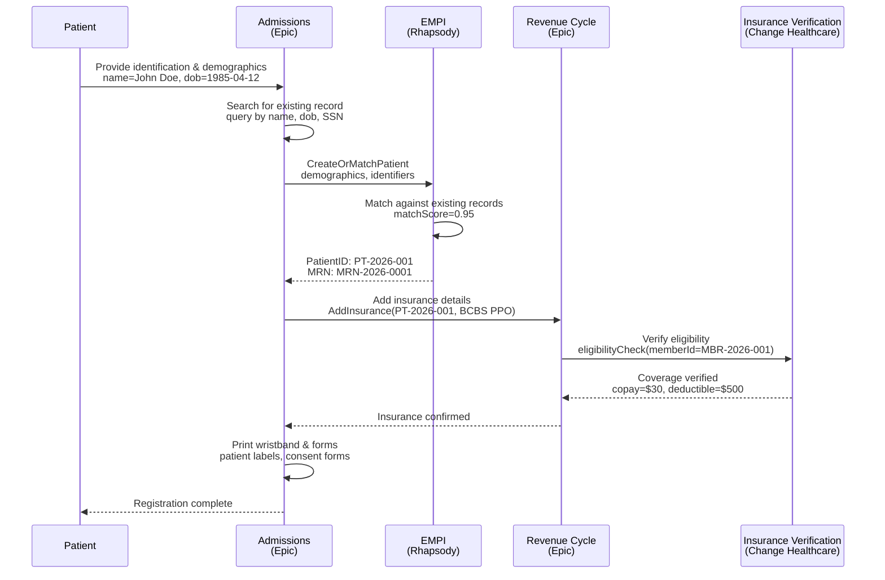
```mermaid
sequenceDiagram
    participant PT as Patient
    participant REG as Admissions<br/>(Epic)
    participant MPI as EMPI<br/>(Rhapsody)
    participant RC as Revenue Cycle<br/>(Epic)
    participant INS as Insurance Verification<br/>(Change Healthcare)
    PT->>REG: Provide identification & demographics<br/>name=John Doe, dob=1985-04-12
    REG->>REG: Search for existing record<br/>query by name, dob, SSN
    REG->>MPI: CreateOrMatchPatient<br/>demographics, identifiers
    MPI->>MPI: Match against existing records<br/>matchScore=0.95
    MPI-->>REG: PatientID: PT-2026-001<br/>MRN: MRN-2026-0001
    REG->>RC: Add insurance details<br/>AddInsurance(PT-2026-001, BCBS PPO)
    RC->>INS: Verify eligibility<br/>eligibilityCheck(memberId=MBR-2026-001)
    INS-->>RC: Coverage verified<br/>copay=$30, deductible=$500
    RC-->>REG: Insurance confirmed
    REG->>REG: Print wristband & forms<br/>patient labels, consent forms
    REG-->>PT: Registration complete
```

#### Integration Details

| Flow | Entity | Info Flow | Source | Target | Source Conn | Target Conn | Pattern | Complexity |
|------|--------|-----------|--------|--------|-------------|-------------|---------|------------|
| Patient Registration | Patient | RegisterPatient | Admissions (Epic) | Enterprise Master Patient Index (Rhapsody EMPI) | Epic REST API (FHIR R5) | EMPI SOAP API (IHE PIX) | API-led (Real-time) | Medium |
| Patient Registration | Patient | AddInsurance | Admissions (Epic) | Revenue Cycle (Epic) | Epic REST API (FHIR) | Epic REST API (FHIR) | API-led (Real-time) | Simple |
| Patient Registration | Insurance | VerifyEligibility | Revenue Cycle (Epic) | Insurance Verification (Change Healthcare) | Epic REST API (FHIR) | Change Healthcare REST API (OAuth2) | API-led (Real-time) | Medium |
| Patient Registration | Patient | PrintWristband | Admissions (Epic) | Label Printing System | Epic API (HL7 v2) | Print Server (RAW TCP) | Event-driven | Simple |
| Patient Registration | Encounter | CreateEncounter | Admissions (Epic) | EMR (Epic) | Epic REST API (FHIR) | Epic REST API (FHIR) | API-led (Real-time) | Simple |
| Patient Registration | Guarantor | AddGuarantor | Admissions (Epic) | Revenue Cycle (Epic) | Epic REST API (FHIR) | Epic REST API (FHIR) | API-led (Real-time) | Simple |

#### Acceptance Criteria

| AC ID | Description | Related Info Flow | Expected Outcome | Priority |
|-------|------------|-------------------|------------------|----------|
| AC-1.1-01 | Data integrity: Patient demographic data transferred from Admissions to MPI via RegisterPatient must be complete and consistent | RegisterPatient | Patient records in MPI match source; no data loss; reconciliation report confirms accuracy | Critical |
| AC-1.1-02 | Data integrity: Insurance data transferred from Admissions to Revenue Cycle via AddInsurance must be complete and consistent | AddInsurance | Insurance records in Revenue Cycle match source; no data loss; reconciliation report confirms accuracy | High |
| AC-1.1-03 | Data integrity: Eligibility data transferred from Revenue Cycle to Insurance Verification via VerifyEligibility must be complete and consistent | VerifyEligibility | Eligibility records in Revenue Cycle match source; no data loss; reconciliation report confirms accuracy | High |
| AC-1.1-04 | Error handling: Failed transactions between Admissions and MPI are logged with error context and trigger automatic retry or alert | RegisterPatient | Errors logged with timestamp, HTTP status, request payload excerpt; retry up to 3 times; alert sent after consecutive failures | Critical |
| AC-1.1-05 | Security: All endpoints enforce authentication (Epic REST API (FHIR R5), EMPI SOAP API (IHE PIX), ...) and encrypt data in transit via TLS 1.2+ | All flows | Unauthenticated requests rejected with 401; tokens validated per call; invalid/expired tokens logged | Critical |

### 1.2 Patient Identity & MPI Management

**Description:** The Enterprise Master Patient Index receives patient data from multiple sources, performs probabilistic matching, and manages duplicate detection and consolidation across the health system.

**Actors:** Identity Analyst, HIM Specialist  
**Systems:** Enterprise Master Patient Index (Rhapsody EMPI), EHR (Epic), Community MPI (State HIE), Identity Resolution (Verato)

#### Sequence Diagram

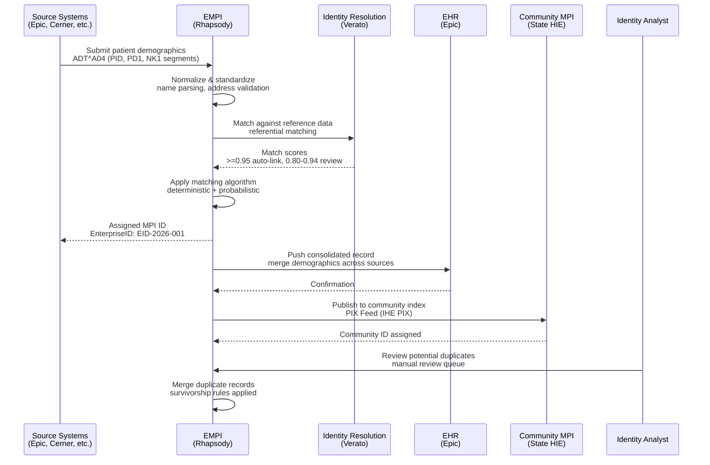
```mermaid
sequenceDiagram
    participant SRC as Source Systems<br/>(Epic, Cerner, etc.)
    participant MPI as EMPI<br/>(Rhapsody)
    participant VER as Identity Resolution<br/>(Verato)
    participant EHR as EHR<br/>(Epic)
    participant HIE as Community MPI<br/>(State HIE)
    SRC->>MPI: Submit patient demographics<br/>ADT^A04 (PID, PD1, NK1 segments)
    MPI->>MPI: Normalize & standardize<br/>name parsing, address validation
    MPI->>VER: Match against reference data<br/>referential matching
    VER-->>MPI: Match scores<br/>>=0.95 auto-link, 0.80-0.94 review
    MPI->>MPI: Apply matching algorithm<br/>deterministic + probabilistic
    MPI-->>SRC: Assigned MPI ID<br/>EnterpriseID: EID-2026-001
    MPI->>EHR: Push consolidated record<br/>merge demographics across sources
    EHR-->>MPI: Confirmation
    MPI->>HIE: Publish to community index<br/>PIX Feed (IHE PIX)
    HIE-->>MPI: Community ID assigned
    Identity Analyst->>MPI: Review potential duplicates<br/>manual review queue
    MPI->>MPI: Merge duplicate records<br/>survivorship rules applied
```

#### Integration Details

| Flow | Entity | Info Flow | Source | Target | Source Conn | Target Conn | Pattern | Complexity |
|------|--------|-----------|--------|--------|-------------|-------------|---------|------------|
| Identity Management | Patient | CreateOrMatchPatient | Source Systems (Epic, Cerner, etc.) | Enterprise Master Patient Index (Rhapsody EMPI) | HL7 v2 ADT (MLLP) | EMPI SOAP API (IHE PIX) | Event-driven | Medium |
| Identity Management | Patient | ReferentialMatch | Enterprise Master Patient Index (Rhapsody EMPI) | Identity Resolution (Verato) | EMPI REST API | Verato REST API (OAuth2) | API-led (Real-time) | High |
| Identity Management | Patient | PushConsolidated | Enterprise Master Patient Index (Rhapsody EMPI) | EHR (Epic) | EMPI SOAP API (IHE PDQ) | Epic REST API (FHIR) | Event-driven | Medium |
| Identity Management | Patient | PublishToCommunity | Enterprise Master Patient Index (Rhapsody EMPI) | Community MPI (State HIE) | EMPI SOAP API (IHE PIX) | State HIE SOAP (IHE PIX) | Batch (Scheduled) | High |
| Identity Management | Patient | MergeDuplicates | Enterprise Master Patient Index (Rhapsody EMPI) | Enterprise Master Patient Index (Rhapsody EMPI) | EMPI Admin Console | EMPI API | API-led (Real-time) | High |
| Identity Management | Patient | QueryMatches | Enterprise Master Patient Index (Rhapsody EMPI) | EHR (Epic) | EMPI REST API | Epic REST API (FHIR) | API-led (Real-time) | Medium |

#### Acceptance Criteria

| AC ID | Description | Related Info Flow | Expected Outcome | Priority |
|-------|------------|-------------------|------------------|----------|
| AC-1.2-01 | Data integrity: Patient identity data transferred from Source Systems to EMPI via CreateOrMatchPatient must be complete and consistent | CreateOrMatchPatient | Patient records in EMPI match source; no data loss; reconciliation report confirms accuracy | Critical |
| AC-1.2-02 | Data integrity: Consolidated patient data transferred from EMPI to EHR via PushConsolidated must be complete and consistent | PushConsolidated | Patient records in EHR match EMPI source; no data loss; reconciliation report confirms accuracy | Critical |
| AC-1.2-03 | Error handling: Failed identity matching transactions are logged with error context and trigger manual review or alert | CreateOrMatchPatient | Errors logged with timestamp, match score, request payload; manual review queue populated | Critical |

### 1.3 Patient Portal & Self-Service

**Description:** A patient accesses the patient portal to view health records, communicate with providers, request prescription refills, and manage appointments.

**Actors:** Patient  
**Systems:** Patient Portal (MyChart), EHR (Epic), Pharmacy System (BD Pyxis), Scheduling (Epic Cadence)

#### Sequence Diagram

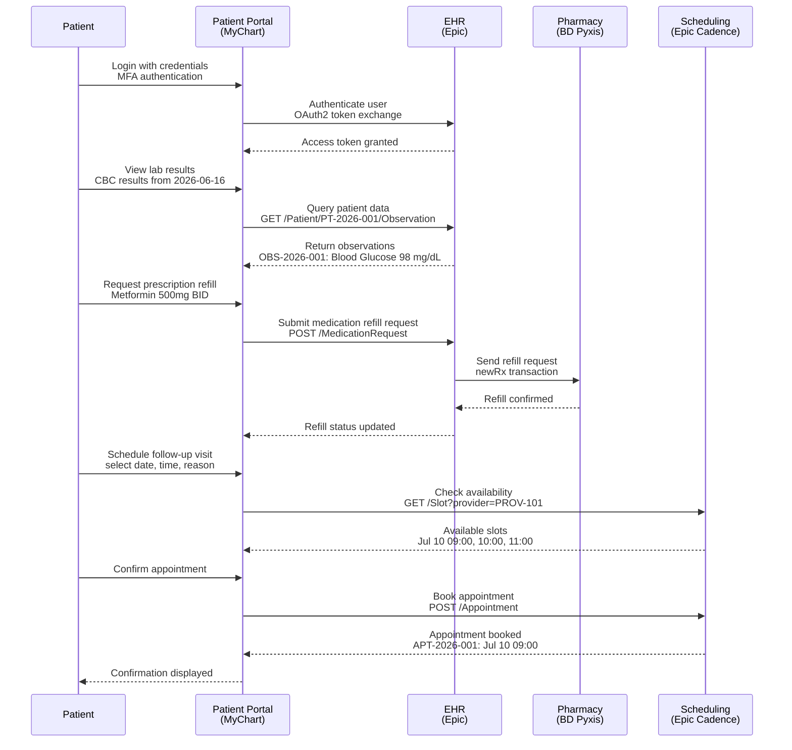
```mermaid
sequenceDiagram
    participant PT as Patient
    participant PORT as Patient Portal<br/>(MyChart)
    participant EHR as EHR<br/>(Epic)
    participant PHARM as Pharmacy<br/>(BD Pyxis)
    participant SCH as Scheduling<br/>(Epic Cadence)
    PT->>PORT: Login with credentials<br/>MFA authentication
    PORT->>EHR: Authenticate user<br/>OAuth2 token exchange
    EHR-->>PORT: Access token granted
    PT->>PORT: View lab results<br/>CBC results from 2026-06-16
    PORT->>EHR: Query patient data<br/>GET /Patient/PT-2026-001/Observation
    EHR-->>PORT: Return observations<br/>OBS-2026-001: Blood Glucose 98 mg/dL
    PT->>PORT: Request prescription refill<br/>Metformin 500mg BID
    PORT->>EHR: Submit medication refill request<br/>POST /MedicationRequest
    EHR->>PHARM: Send refill request<br/>newRx transaction
    PHARM-->>EHR: Refill confirmed
    EHR-->>PORT: Refill status updated
    PT->>PORT: Schedule follow-up visit<br/>select date, time, reason
    PORT->>SCH: Check availability<br/>GET /Slot?provider=PROV-101
    SCH-->>PORT: Available slots<br/>Jul 10 09:00, 10:00, 11:00
    PT->>PORT: Confirm appointment
    PORT->>SCH: Book appointment<br/>POST /Appointment
    SCH-->>PORT: Appointment booked<br/>APT-2026-001: Jul 10 09:00
    PORT-->>PT: Confirmation displayed
```

#### Integration Details

| Flow | Entity | Info Flow | Source | Target | Source Conn | Target Conn | Pattern | Complexity |
|------|--------|-----------|--------|--------|-------------|-------------|---------|------------|
| Portal Access | Patient | AuthenticateUser | Patient Portal (MyChart) | EHR (Epic) | MyChart REST API | Epic REST API (FHIR) | API-led (Real-time) | Medium |
| Lab Results | Observation | QueryObservations | Patient Portal (MyChart) | EHR (Epic) | MyChart REST API | Epic REST API (FHIR) | API-led (Real-time) | Simple |
| Refill Request | Medication | RequestRefill | Patient Portal (MyChart) | EHR (Epic) | MyChart REST API | Epic REST API (FHIR) | API-led (Real-time) | Medium |
| Refill Notification | Medication | SendRefillRx | EHR (Epic) | Pharmacy System (BD Pyxis) | Epic REST API (FHIR) | Pyxis REST API (NCPDP) | Event-driven | Medium |
| Appointment Booking | Appointment | BookAppointment | Patient Portal (MyChart) | Scheduling (Epic Cadence) | MyChart REST API | Epic Cadence REST API (FHIR) | API-led (Real-time) | Simple |
| Slot Availability | Slot | CheckAvailability | Patient Portal (MyChart) | Scheduling (Epic Cadence) | MyChart REST API | Epic Cadence REST API (FHIR) | API-led (Real-time) | Simple |

#### Acceptance Criteria

| AC ID | Description | Related Info Flow | Expected Outcome | Priority |
|-------|------------|-------------------|------------------|----------|
| AC-1.3-01 | Data integrity: Observation data transferred from Patient Portal to EHR via QueryObservations must be complete and consistent | QueryObservations | Observation records returned match source; no data loss | Medium |
| AC-1.3-02 | Data integrity: Refill data transferred from Patient Portal to EHR via RequestRefill must be complete and consistent | RequestRefill | Refill requests in EHR match source; no data loss | High |
| AC-1.3-03 | Data integrity: Appointment data transferred from Patient Portal to Scheduling via BookAppointment must be complete and consistent | BookAppointment | Appointment records in Scheduling match source; no data loss | Medium |
| AC-1.3-04 | Security: Patient Portal enforces MFA and all APIs use OAuth2 with appropriate scopes | All flows | Unauthorized access to patient data rejected with 403; scope violations logged | Critical |

### 1.4 Consent & Privacy Management

**Description:** Patient consent directives are captured, stored, and enforced across the health system. HIPAA authorizations are managed and shared with downstream systems.

**Actors:** Patient, Privacy Officer  
**Systems:** Patient Portal (MyChart), EHR (Epic), Consent Management (IHE ATNA), HIE (HealthShare)

#### Sequence Diagram

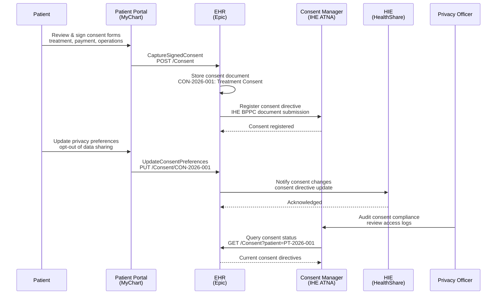
```mermaid
sequenceDiagram
    participant PT as Patient
    participant PORT as Patient Portal<br/>(MyChart)
    participant EHR as EHR<br/>(Epic)
    participant CM as Consent Manager<br/>(IHE ATNA)
    participant HIE as HIE<br/>(HealthShare)
    PT->>PORT: Review & sign consent forms<br/>treatment, payment, operations
    PORT->>EHR: CaptureSignedConsent<br/>POST /Consent
    EHR->>EHR: Store consent document<br/>CON-2026-001: Treatment Consent
    EHR->>CM: Register consent directive<br/>IHE BPPC document submission
    CM-->>EHR: Consent registered
    PT->>PORT: Update privacy preferences<br/>opt-out of data sharing
    PORT->>EHR: UpdateConsentPreferences<br/>PUT /Consent/CON-2026-001
    EHR->>HIE: Notify consent changes<br/>consent directive update
    HIE-->>EHR: Acknowledged
    Privacy Officer->>CM: Audit consent compliance<br/>review access logs
    CM->>EHR: Query consent status<br/>GET /Consent?patient=PT-2026-001
    EHR-->>CM: Current consent directives
```

#### Integration Details

| Flow | Entity | Info Flow | Source | Target | Source Conn | Target Conn | Pattern | Complexity |
|------|--------|-----------|--------|--------|-------------|-------------|---------|------------|
| Consent Capture | Consent | CaptureSignedConsent | Patient Portal (MyChart) | EHR (Epic) | MyChart REST API | Epic REST API (FHIR) | API-led (Real-time) | Medium |
| Consent Registration | Consent | RegisterConsent | EHR (Epic) | Consent Manager (IHE ATNA) | Epic REST API (FHIR) | ATNA SOAP (IHE BPPC) | API-led (Real-time) | High |
| Privacy Update | Consent | UpdateConsentPreferences | Patient Portal (MyChart) | EHR (Epic) | MyChart REST API | Epic REST API (FHIR) | API-led (Real-time) | Medium |
| Consent Notification | Consent | NotifyConsentChange | EHR (Epic) | HIE (HealthShare) | Epic REST API (FHIR) | HealthShare REST API (IHE BPPC) | Event-driven | Medium |
| Consent Audit | Consent | QueryConsentStatus | Consent Manager (IHE ATNA) | EHR (Epic) | ATNA SOAP | Epic REST API (FHIR) | API-led (Real-time) | Medium |

#### Acceptance Criteria

| AC ID | Description | Related Info Flow | Expected Outcome | Priority |
|-------|------------|-------------------|------------------|----------|
| AC-1.4-01 | Data integrity: Consent data transferred from Patient Portal to EHR via CaptureSignedConsent must be complete and consistent | CaptureSignedConsent | Consent records in EHR match source; no data loss; reconciliation report confirms accuracy | Critical |
| AC-1.4-02 | Data integrity: Consent directive data transferred from EHR to Consent Manager via RegisterConsent must be complete and consistent | RegisterConsent | Consent directives in Consent Manager match source; no data loss; reconciliation report confirms accuracy | High |
| AC-1.4-03 | Error handling: Failed consent registration transactions are logged with error context and trigger manual review | RegisterConsent | Errors logged with timestamp, HTTP status, request payload excerpt; manual review queue populated | Critical |

---

# Clinical Documentation & EHR  - `HC010` `HC011` `HC012`

Comprehensive clinical documentation management including structured notes, computerized provider order entry, and patient problem lists.

### 2.1 Clinical Notes & H&P Documentation

**Description:** A physician documents a patient encounter including history and physical examination findings, assessment, and plan. The note is signed and stored in the clinical data repository.

**Actors:** Physician (Dr. Sarah Williams), Medical Coder  
**Systems:** EHR (Epic), Clinical Data Repository (CDR), Speech Recognition (Nuance Dragon), Coding Workflow (3M 360)

#### Sequence Diagram

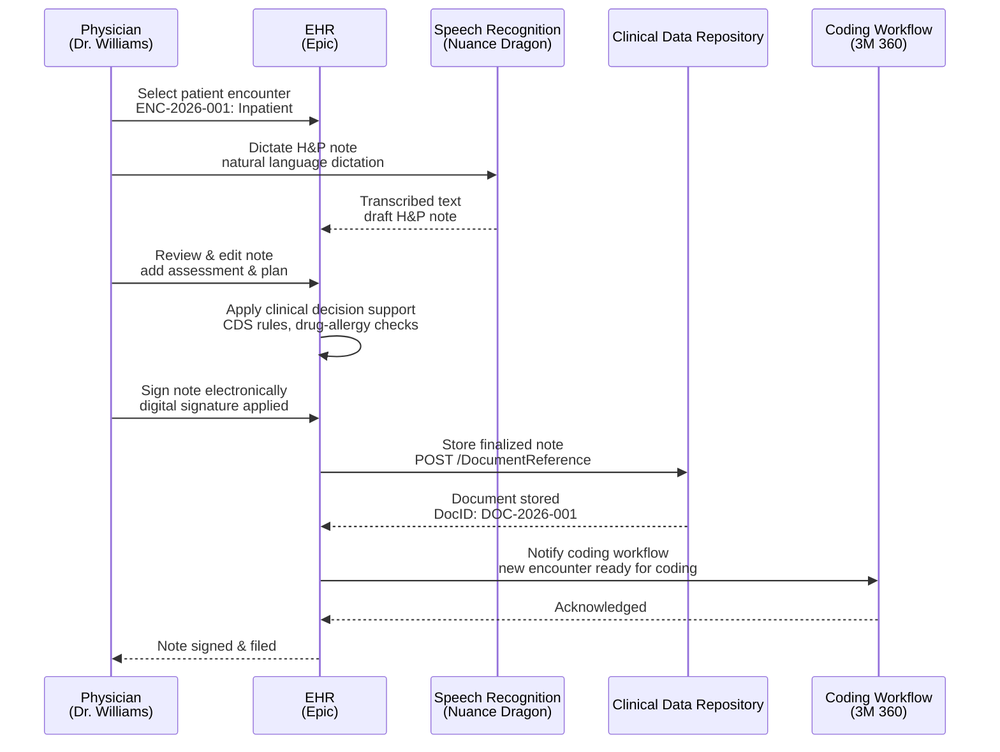
```mermaid
sequenceDiagram
    participant DOC as Physician<br/>(Dr. Williams)
    participant EHR as EHR<br/>(Epic)
    participant SR as Speech Recognition<br/>(Nuance Dragon)
    participant CDR as Clinical Data Repository
    participant COD as Coding Workflow<br/>(3M 360)
    DOC->>EHR: Select patient encounter<br/>ENC-2026-001: Inpatient
    DOC->>SR: Dictate H&P note<br/>natural language dictation
    SR-->>EHR: Transcribed text<br/>draft H&P note
    DOC->>EHR: Review & edit note<br/>add assessment & plan
    EHR->>EHR: Apply clinical decision support<br/>CDS rules, drug-allergy checks
    DOC->>EHR: Sign note electronically<br/>digital signature applied
    EHR->>CDR: Store finalized note<br/>POST /DocumentReference
    CDR-->>EHR: Document stored<br/>DocID: DOC-2026-001
    EHR->>COD: Notify coding workflow<br/>new encounter ready for coding
    COD-->>EHR: Acknowledged
    EHR-->>DOC: Note signed & filed
```

#### Integration Details

| Flow | Entity | Info Flow | Source | Target | Source Conn | Target Conn | Pattern | Complexity |
|------|--------|-----------|--------|--------|-------------|-------------|---------|------------|
| Clinical Documentation | Encounter | DictateNote | Speech Recognition (Nuance Dragon) | EHR (Epic) | Dragon REST API | Epic REST API (FHIR) | API-led (Real-time) | Medium |
| Clinical Documentation | Document | StoreNote | EHR (Epic) | Clinical Data Repository (CDR) | Epic REST API (FHIR) | CDR REST API (IHE XDS) | API-led (Real-time) | Medium |
| Clinical Documentation | Encounter | SignNote | EHR (Epic) | EHR (Epic) | Epic REST API (FHIR) | Epic REST API (FHIR) | API-led (Real-time) | Simple |
| Clinical Documentation | Encounter | NotifyCoding | EHR (Epic) | Coding Workflow (3M 360) | Epic REST API (FHIR) | 3M REST API (HL7 FHIR) | Event-driven | Medium |
| Clinical Documentation | Encounter | ApplyCDS | EHR (Epic) | EHR (Epic) | Epic Clinical Rules Engine | Epic REST API (FHIR) | API-led (Real-time) | Medium |

#### Acceptance Criteria

| AC ID | Description | Related Info Flow | Expected Outcome | Priority |
|-------|------------|-------------------|------------------|----------|
| AC-2.1-01 | Data integrity: Clinical note data transferred from EHR to CDR via StoreNote must be complete and consistent | StoreNote | Clinical notes in CDR match source; no data loss; reconciliation report confirms accuracy | Critical |
| AC-2.1-02 | Data integrity: Dictated note data transferred from Dragon to EHR via DictateNote must be complete and consistent | DictateNote | Dictated notes in EHR match source; no data loss; reconciliation report confirms accuracy | High |
| AC-2.1-03 | Error handling: Failed clinical note storage transactions are logged with error context and trigger automatic retry or alert | StoreNote | Errors logged with timestamp, HTTP status, request payload excerpt; retry up to 3 times; alert sent after consecutive failures | Critical |

### 2.2 Order Entry & Management (CPOE)

**Description:** A physician enters a set of orders for an inpatient including lab tests, medications, and imaging studies through the computerized provider order entry system.

**Actors:** Physician (Dr. Sarah Williams), Nurse  
**Systems:** CPOE (Epic), Pharmacy System (BD Pyxis), LIS (Cerner Lab), RIS (GE PACS), Clinical Decision Support (Cerner CDS)

#### Sequence Diagram

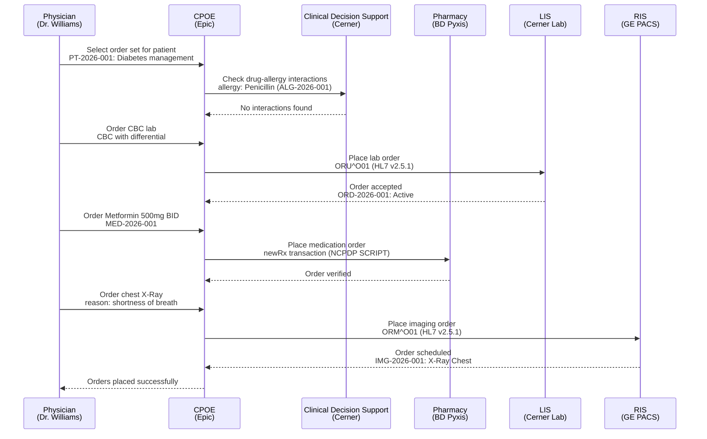
```mermaid
sequenceDiagram
    participant DOC as Physician<br/>(Dr. Williams)
    participant CPOE as CPOE<br/>(Epic)
    participant CDS as Clinical Decision Support<br/>(Cerner)
    participant PHARM as Pharmacy<br/>(BD Pyxis)
    participant LIS as LIS<br/>(Cerner Lab)
    participant RIS as RIS<br/>(GE PACS)
    DOC->>CPOE: Select order set for patient<br/>PT-2026-001: Diabetes management
    CPOE->>CDS: Check drug-allergy interactions<br/>allergy: Penicillin (ALG-2026-001)
    CDS-->>CPOE: No interactions found
    DOC->>CPOE: Order CBC lab<br/>CBC with differential
    CPOE->>LIS: Place lab order<br/>ORU^O01 (HL7 v2.5.1)
    LIS-->>CPOE: Order accepted<br/>ORD-2026-001: Active
    DOC->>CPOE: Order Metformin 500mg BID<br/>MED-2026-001
    CPOE->>PHARM: Place medication order<br/>newRx transaction (NCPDP SCRIPT)
    PHARM-->>CPOE: Order verified
    DOC->>CPOE: Order chest X-Ray<br/>reason: shortness of breath
    CPOE->>RIS: Place imaging order<br/>ORM^O01 (HL7 v2.5.1)
    RIS-->>CPOE: Order scheduled<br/>IMG-2026-001: X-Ray Chest
    CPOE-->>DOC: Orders placed successfully
```

#### Integration Details

| Flow | Entity | Info Flow | Source | Target | Source Conn | Target Conn | Pattern | Complexity |
|------|--------|-----------|--------|--------|-------------|-------------|---------|------------|
| CPOE | Order | CheckDrugAllergy | CPOE (Epic) | Clinical Decision Support (Cerner CDS) | Epic REST API (FHIR) | Cerner CDS REST API (CDS Hooks) | API-led (Real-time) | Medium |
| CPOE | Order | PlaceLabOrder | CPOE (Epic) | LIS (Cerner Lab) | Epic REST API (FHIR) | Cerner Lab HL7 v2.5.1 (MLLP) | API-led (Real-time) | Medium |
| CPOE | Medication | PlaceMedicationOrder | CPOE (Epic) | Pharmacy System (BD Pyxis) | Epic REST API (FHIR) | Pyxis NCPDP SCRIPT (SOAP) | API-led (Real-time) | Medium |
| CPOE | Order | PlaceImagingOrder | CPOE (Epic) | RIS (GE PACS) | Epic REST API (FHIR) | GE RIS HL7 v2.5.1 (MLLP) | API-led (Real-time) | Medium |
| CPOE | Order | OrderSetSelection | CPOE (Epic) | CPOE (Epic) | Epic REST API (FHIR) | Epic REST API (FHIR) | API-led (Real-time) | Simple |

#### Acceptance Criteria

| AC ID | Description | Related Info Flow | Expected Outcome | Priority |
|-------|------------|-------------------|------------------|----------|
| AC-2.2-01 | Data integrity: Lab order data transferred from CPOE to LIS via PlaceLabOrder must be complete and consistent | PlaceLabOrder | Lab orders in LIS match source; no data loss; reconciliation report confirms accuracy | Critical |
| AC-2.2-02 | Data integrity: Medication order data transferred from CPOE to Pharmacy via PlaceMedicationOrder must be complete and consistent | PlaceMedicationOrder | Medication orders in Pharmacy match source; no data loss; reconciliation report confirms accuracy | Critical |
| AC-2.2-03 | Data integrity: Imaging order data transferred from CPOE to RIS via PlaceImagingOrder must be complete and consistent | PlaceImagingOrder | Imaging orders in RIS match source; no data loss; reconciliation report confirms accuracy | Critical |
| AC-2.2-04 | Security: All CPOE transactions enforce provider authentication and electronic signature | All flows | Unauthenticated orders rejected; orders require valid provider digital signature | Critical |

### 2.3 Problem List & Medical History

**Description:** The physician updates the patient's problem list, adds new diagnoses, reconciles medications, and documents allergies during an encounter.

**Actors:** Physician (Dr. Sarah Williams), Clinical Informaticist  
**Systems:** EHR (Epic), Clinical Data Repository (CDR), Pharmacy System (BD Pyxis), Allergy Registry

#### Sequence Diagram

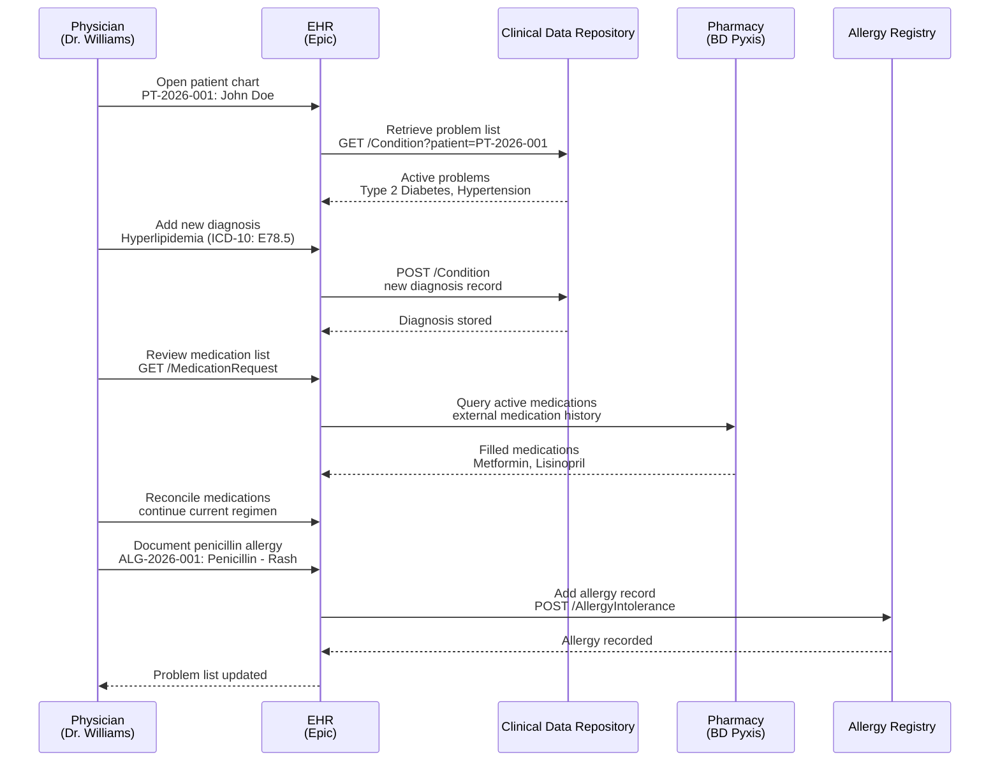
```mermaid
sequenceDiagram
    participant DOC as Physician<br/>(Dr. Williams)
    participant EHR as EHR<br/>(Epic)
    participant CDR as Clinical Data Repository
    participant PHARM as Pharmacy<br/>(BD Pyxis)
    participant ALLERGY as Allergy Registry
    DOC->>EHR: Open patient chart<br/>PT-2026-001: John Doe
    EHR->>CDR: Retrieve problem list<br/>GET /Condition?patient=PT-2026-001
    CDR-->>EHR: Active problems<br/>Type 2 Diabetes, Hypertension
    DOC->>EHR: Add new diagnosis<br/>Hyperlipidemia (ICD-10: E78.5)
    EHR->>CDR: POST /Condition<br/>new diagnosis record
    CDR-->>EHR: Diagnosis stored
    DOC->>EHR: Review medication list<br/>GET /MedicationRequest
    EHR->>PHARM: Query active medications<br/>external medication history
    PHARM-->>EHR: Filled medications<br/>Metformin, Lisinopril
    DOC->>EHR: Reconcile medications<br/>continue current regimen
    DOC->>EHR: Document penicillin allergy<br/>ALG-2026-001: Penicillin - Rash
    EHR->>ALLERGY: Add allergy record<br/>POST /AllergyIntolerance
    ALLERGY-->>EHR: Allergy recorded
    EHR-->>DOC: Problem list updated
```

#### Integration Details

| Flow | Entity | Info Flow | Source | Target | Source Conn | Target Conn | Pattern | Complexity |
|------|--------|-----------|--------|--------|-------------|-------------|---------|------------|
| Problem List | Condition | RetrieveProblemList | EHR (Epic) | Clinical Data Repository (CDR) | Epic REST API (FHIR) | CDR REST API (FHIR) | API-led (Real-time) | Simple |
| Problem List | Condition | AddDiagnosis | EHR (Epic) | Clinical Data Repository (CDR) | Epic REST API (FHIR) | CDR REST API (FHIR) | API-led (Real-time) | Simple |
| Medication Reconcile | Medication | QueryActiveMeds | EHR (Epic) | Pharmacy System (BD Pyxis) | Epic REST API (FHIR) | Pyxis REST API (NCPDP) | API-led (Real-time) | Medium |
| Allergy | AllergyIntolerance | DocumentAllergy | EHR (Epic) | Allergy Registry | Epic REST API (FHIR) | Allergy Registry REST API | API-led (Real-time) | Medium |
| Medication Reconcile | Medication | ReconcileMeds | EHR (Epic) | EHR (Epic) | Epic REST API (FHIR) | Epic REST API (FHIR) | API-led (Real-time) | Medium |

#### Acceptance Criteria

| AC ID | Description | Related Info Flow | Expected Outcome | Priority |
|-------|------------|-------------------|------------------|----------|
| AC-2.3-01 | Data integrity: Diagnosis data transferred from EHR to CDR via AddDiagnosis must be complete and consistent | AddDiagnosis | Diagnosis records in CDR match source; no data loss; reconciliation report confirms accuracy | High |
| AC-2.3-02 | Data integrity: Medication data transferred from EHR to Pharmacy via QueryActiveMeds must be complete and consistent | QueryActiveMeds | Medication records in EHR match Pharmacy source; no data loss; reconciliation report confirms accuracy | High |
| AC-2.3-03 | Data integrity: Allergy data transferred from EHR to Allergy Registry via DocumentAllergy must be complete and consistent | DocumentAllergy | Allergy records in Registry match source; no data loss; reconciliation report confirms accuracy | High |

---

# Laboratory & Diagnostics  - `HC020` `HC021` `HC022`

End-to-end laboratory and diagnostic imaging management from order entry through results reporting and clinical interpretation.

### 3.1 Lab Order & Specimen Collection

**Description:** A lab order is placed, specimen is collected from the patient, labeled, and transported to the lab for processing.

**Actors:** Physician, Phlebotomist, Lab Technician  
**Systems:** CPOE (Epic), LIS (Cerner Lab), Phlebotomy (BD Pyxis), Specimen Tracking (SCC SoftLab)

#### Sequence Diagram

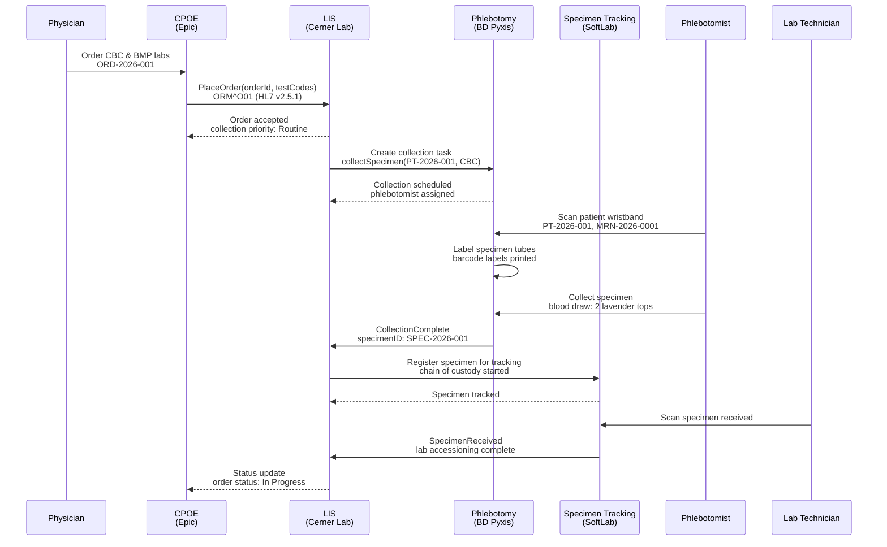
```mermaid
sequenceDiagram
    participant DOC as Physician
    participant CPOE as CPOE<br/>(Epic)
    participant LIS as LIS<br/>(Cerner Lab)
    participant PHL as Phlebotomy<br/>(BD Pyxis)
    participant SPEC as Specimen Tracking<br/>(SoftLab)
    DOC->>CPOE: Order CBC & BMP labs<br/>ORD-2026-001
    CPOE->>LIS: PlaceOrder(orderId, testCodes)<br/>ORM^O01 (HL7 v2.5.1)
    LIS-->>CPOE: Order accepted<br/>collection priority: Routine
    LIS->>PHL: Create collection task<br/>collectSpecimen(PT-2026-001, CBC)
    PHL-->>LIS: Collection scheduled<br/>phlebotomist assigned
    Phlebotomist->>PHL: Scan patient wristband<br/>PT-2026-001, MRN-2026-0001
    PHL->>PHL: Label specimen tubes<br/>barcode labels printed
    Phlebotomist->>PHL: Collect specimen<br/>blood draw: 2 lavender tops
    PHL->>LIS: CollectionComplete<br/>specimenID: SPEC-2026-001
    LIS->>SPEC: Register specimen for tracking<br/>chain of custody started
    SPEC-->>LIS: Specimen tracked
    Lab Technician->>SPEC: Scan specimen received
    SPEC->>LIS: SpecimenReceived<br/>lab accessioning complete
    LIS-->>CPOE: Status update<br/>order status: In Progress
```

#### Integration Details

| Flow | Entity | Info Flow | Source | Target | Source Conn | Target Conn | Pattern | Complexity |
|------|--------|-----------|--------|--------|-------------|-------------|---------|------------|
| Lab Order | Order | PlaceOrder | CPOE (Epic) | LIS (Cerner Lab) | Epic REST API (FHIR) | Cerner Lab HL7 v2.5.1 (MLLP) | API-led (Real-time) | Medium |
| Lab Order | Order | CreateCollectionTask | LIS (Cerner Lab) | Phlebotomy (BD Pyxis) | Cerner Lab HL7 v2.5.1 (MLLP) | Pyxis REST API | Event-driven | Medium |
| Lab Order | Specimen | CollectionComplete | Phlebotomy (BD Pyxis) | LIS (Cerner Lab) | Pyxis REST API | Cerner Lab HL7 v2.5.1 (MLLP) | API-led (Real-time) | Medium |
| Lab Order | Specimen | RegisterSpecimen | LIS (Cerner Lab) | Specimen Tracking (SCC SoftLab) | Cerner Lab HL7 v2.5.1 (MLLP) | SoftLab REST API (IHE LSWF) | Event-driven | Medium |
| Lab Order | Order | UpdateStatus | LIS (Cerner Lab) | CPOE (Epic) | Cerner Lab HL7 v2.5.1 (MLLP) | Epic REST API (FHIR) | Event-driven | Medium |

#### Acceptance Criteria

| AC ID | Description | Related Info Flow | Expected Outcome | Priority |
|-------|------------|-------------------|------------------|----------|
| AC-3.1-01 | Data integrity: Lab order data transferred from CPOE to LIS via PlaceOrder must be complete and consistent | PlaceOrder | Lab orders in LIS match source; no data loss; reconciliation report confirms accuracy | Critical |
| AC-3.1-02 | Data integrity: Collection task data transferred from LIS to Phlebotomy via CreateCollectionTask must be complete and consistent | CreateCollectionTask | Collection tasks in Phlebotomy match source; no data loss | High |
| AC-3.1-03 | Error handling: Failed lab order transactions are logged with error context and trigger automatic retry or alert | PlaceOrder | Errors logged with timestamp, HTTP status, request payload excerpt; retry up to 3 times; alert sent after consecutive failures | Critical |

### 3.2 Lab Results Reporting

**Description:** Lab results are resulted, validated, and reported back to the ordering provider. Critical values trigger immediate alerts.

**Actors:** Lab Technician, Pathologist, Physician  
**Systems:** LIS (Cerner Lab), EHR (Epic), Clinical Decision Support (Cerner CDS), Critical Alerting (Spok)

#### Sequence Diagram

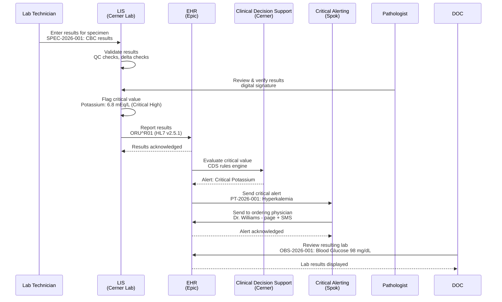
```mermaid
sequenceDiagram
    participant LAB as Lab Technician
    participant LIS as LIS<br/>(Cerner Lab)
    participant EHR as EHR<br/>(Epic)
    participant CDS as Clinical Decision Support<br/>(Cerner)
    participant ALERT as Critical Alerting<br/>(Spok)
    LAB->>LIS: Enter results for specimen<br/>SPEC-2026-001: CBC results
    LIS->>LIS: Validate results<br/>QC checks, delta checks
    Pathologist->>LIS: Review & verify results<br/>digital signature
    LIS->>LIS: Flag critical value<br/>Potassium: 6.8 mEq/L (Critical High)
    LIS->>EHR: Report results<br/>ORU^R01 (HL7 v2.5.1)
    EHR-->>LIS: Results acknowledged
    EHR->>CDS: Evaluate critical value<br/>CDS rules engine
    CDS-->>EHR: Alert: Critical Potassium
    EHR->>ALERT: Send critical alert<br/>PT-2026-001: Hyperkalemia
    ALERT->>EHR: Send to ordering physician<br/>Dr. Williams - page + SMS
    EHR-->>ALERT: Alert acknowledged
    DOC->>EHR: Review resulting lab<br/>OBS-2026-001: Blood Glucose 98 mg/dL
    EHR-->>DOC: Lab results displayed
```

#### Integration Details

| Flow | Entity | Info Flow | Source | Target | Source Conn | Target Conn | Pattern | Complexity |
|------|--------|-----------|--------|--------|-------------|-------------|---------|------------|
| Lab Results | Observation | ReportResults | LIS (Cerner Lab) | EHR (Epic) | Cerner Lab HL7 v2.5.1 (MLLP) | Epic REST API (FHIR) | Event-driven | Medium |
| Lab Results | Observation | EvaluateCriticalValue | EHR (Epic) | Clinical Decision Support (Cerner CDS) | Epic REST API (FHIR) | Cerner CDS REST API (CDS Hooks) | API-led (Real-time) | Medium |
| Lab Results | Observation | SendCriticalAlert | EHR (Epic) | Critical Alerting (Spok) | Epic REST API (FHIR) | Spok REST API (HL7 FHIR) | Event-driven | High |
| Lab Results | Observation | AcknowledgeAlert | Critical Alerting (Spok) | EHR (Epic) | Spok REST API (HL7 FHIR) | Epic REST API (FHIR) | API-led (Real-time) | Medium |
| Lab Results | Observation | ReviewResults | Physician | EHR (Epic) | Epic UI (Web) | Epic REST API (FHIR) | API-led (Real-time) | Simple |

#### Acceptance Criteria

| AC ID | Description | Related Info Flow | Expected Outcome | Priority |
|-------|------------|-------------------|------------------|----------|
| AC-3.2-01 | Data integrity: Lab result data transferred from LIS to EHR via ReportResults must be complete and consistent | ReportResults | Lab results in EHR match source; no data loss; reconciliation report confirms accuracy | Critical |
| AC-3.2-02 | Data integrity: Critical alert data transferred from EHR to Alerting via SendCriticalAlert must be complete and consistent | SendCriticalAlert | Critical alerts delivered to correct provider within 5 minutes | Critical |
| AC-3.2-03 | Security: Lab results are only accessible to authorized providers; patient consent verified before disclosure | All flows | Unauthorized access to lab results rejected with 403; audit trail logged | Critical |

### 3.3 Radiology & Imaging Management

**Description:** An imaging order is scheduled, the study is performed, images are interpreted by a radiologist, and the report is distributed to the ordering provider.

**Actors:** Physician, Radiologist, Radiology Technician  
**Systems:** CPOE (Epic), RIS (GE PACS), PACS (GE PACS), Speech Recognition (Nuance PowerScribe), EHR (Epic)

#### Sequence Diagram

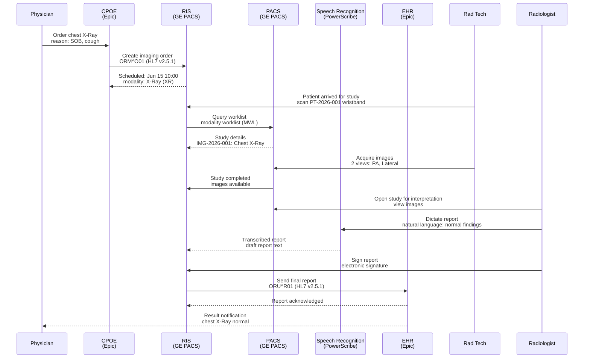
```mermaid
sequenceDiagram
    participant DOC as Physician
    participant CPOE as CPOE<br/>(Epic)
    participant RIS as RIS<br/>(GE PACS)
    participant PACS as PACS<br/>(GE PACS)
    participant SR as Speech Recognition<br/>(PowerScribe)
    participant EHR as EHR<br/>(Epic)
    DOC->>CPOE: Order chest X-Ray<br/>reason: SOB, cough
    CPOE->>RIS: Create imaging order<br/>ORM^O01 (HL7 v2.5.1)
    RIS-->>CPOE: Scheduled: Jun 15 10:00<br/>modality: X-Ray (XR)
    Rad Tech->>RIS: Patient arrived for study<br/>scan PT-2026-001 wristband
    RIS->>PACS: Query worklist<br/>modality worklist (MWL)
    PACS-->>RIS: Study details<br/>IMG-2026-001: Chest X-Ray
    Rad Tech->>PACS: Acquire images<br/>2 views: PA, Lateral
    PACS->>RIS: Study completed<br/>images available
    Radiologist->>PACS: Open study for interpretation<br/>view images
    Radiologist->>SR: Dictate report<br/>natural language: normal findings
    SR-->>RIS: Transcribed report<br/>draft report text
    Radiologist->>RIS: Sign report<br/>electronic signature
    RIS->>EHR: Send final report<br/>ORU^R01 (HL7 v2.5.1)
    EHR-->>RIS: Report acknowledged
    EHR-->>DOC: Result notification<br/>chest X-Ray normal
```

#### Integration Details

| Flow | Entity | Info Flow | Source | Target | Source Conn | Target Conn | Pattern | Complexity |
|------|--------|-----------|--------|--------|-------------|-------------|---------|------------|
| Imaging | Order | CreateImagingOrder | CPOE (Epic) | RIS (GE PACS) | Epic REST API (FHIR) | GE RIS HL7 v2.5.1 (MLLP) | API-led (Real-time) | Medium |
| Imaging | Study | QueryWorklist | RIS (GE PACS) | PACS (GE PACS) | GE RIS HL7 v2.5.1 (MLLP) | DICOM MWL (TCP) | API-led (Real-time) | Medium |
| Imaging | Study | AcquireImages | Radiology Technician | PACS (GE PACS) | DICOM Modality (TCP) | DICOM Storage (TCP) | Event-driven | High |
| Imaging | Report | DictateReport | Speech Recognition (Nuance PowerScribe) | RIS (GE PACS) | PowerScribe REST API | GE RIS HL7 v2.5.1 (MLLP) | API-led (Real-time) | Medium |
| Imaging | Report | SendFinalReport | RIS (GE PACS) | EHR (Epic) | GE RIS HL7 v2.5.1 (MLLP) | Epic REST API (FHIR) | Event-driven | Medium |

#### Acceptance Criteria

| AC ID | Description | Related Info Flow | Expected Outcome | Priority |
|-------|------------|-------------------|------------------|----------|
| AC-3.3-01 | Data integrity: Imaging order data transferred from CPOE to RIS via CreateImagingOrder must be complete and consistent | CreateImagingOrder | Imaging orders in RIS match source; no data loss; reconciliation report confirms accuracy | Critical |
| AC-3.3-02 | Data integrity: Report data transferred from RIS to EHR via SendFinalReport must be complete and consistent | SendFinalReport | Report records in EHR match source; no data loss; reconciliation report confirms accuracy | High |
| AC-3.3-03 | Error handling: Failed imaging report transactions are logged with error context and trigger automatic retry or alert | SendFinalReport | Errors logged with timestamp, HTTP status, request payload excerpt; retry up to 3 times; alert sent after consecutive failures | High |

---

# Pharmacy & Medication Management  - `HC030` `HC031` `HC032`

Comprehensive medication management including ordering, dispensing, verification, and administration with barcode scanning and safety checks.

### 4.1 Medication Ordering & Reconciliation

**Description:** A physician orders medications, performs drug interaction checks, reconciles home medications, and reviews allergy information before signing.

**Actors:** Physician (Dr. Sarah Williams), Clinical Pharmacist  
**Systems:** CPOE (Epic), Pharmacy System (BD Pyxis), Clinical Decision Support (Cerner CDS), Medication Reconciliation (PillDrill)

#### Sequence Diagram

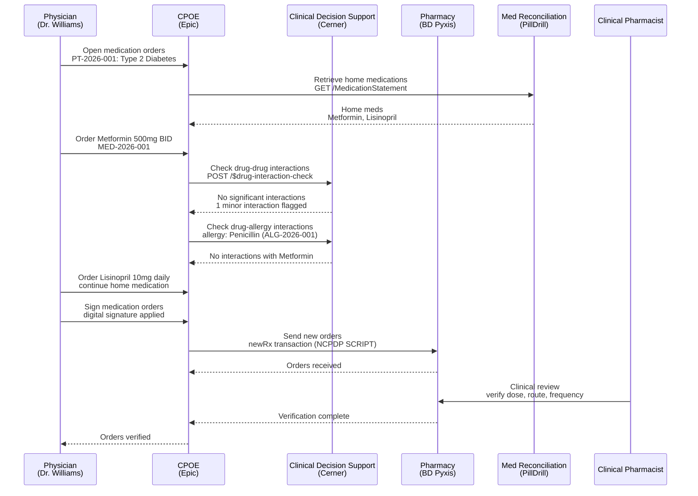
```mermaid
sequenceDiagram
    participant DOC as Physician<br/>(Dr. Williams)
    participant CPOE as CPOE<br/>(Epic)
    participant CDS as Clinical Decision Support<br/>(Cerner)
    participant PHARM as Pharmacy<br/>(BD Pyxis)
    participant MR as Med Reconciliation<br/>(PillDrill)
    DOC->>CPOE: Open medication orders<br/>PT-2026-001: Type 2 Diabetes
    CPOE->>MR: Retrieve home medications<br/>GET /MedicationStatement
    MR-->>CPOE: Home meds<br/>Metformin, Lisinopril
    DOC->>CPOE: Order Metformin 500mg BID<br/>MED-2026-001
    CPOE->>CDS: Check drug-drug interactions<br/>POST /$drug-interaction-check
    CDS-->>CPOE: No significant interactions<br/>1 minor interaction flagged
    CPOE->>CDS: Check drug-allergy interactions<br/>allergy: Penicillin (ALG-2026-001)
    CDS-->>CPOE: No interactions with Metformin
    DOC->>CPOE: Order Lisinopril 10mg daily<br/>continue home medication
    DOC->>CPOE: Sign medication orders<br/>digital signature applied
    CPOE->>PHARM: Send new orders<br/>newRx transaction (NCPDP SCRIPT)
    PHARM-->>CPOE: Orders received
    Clinical Pharmacist->>PHARM: Clinical review<br/>verify dose, route, frequency
    PHARM-->>CPOE: Verification complete
    CPOE-->>DOC: Orders verified
```

#### Integration Details

| Flow | Entity | Info Flow | Source | Target | Source Conn | Target Conn | Pattern | Complexity |
|------|--------|-----------|--------|--------|-------------|-------------|---------|------------|
| Med Order | Medication | RetrieveHomeMeds | CPOE (Epic) | Medication Reconciliation (PillDrill) | Epic REST API (FHIR) | PillDrill REST API (FHIR) | API-led (Real-time) | Medium |
| Med Order | Medication | CheckDrugInteractions | CPOE (Epic) | Clinical Decision Support (Cerner CDS) | Epic REST API (FHIR) | Cerner CDS REST API (CDS Hooks) | API-led (Real-time) | Medium |
| Med Order | Medication | CheckDrugAllergy | CPOE (Epic) | Clinical Decision Support (Cerner CDS) | Epic REST API (FHIR) | Cerner CDS REST API (CDS Hooks) | API-led (Real-time) | Medium |
| Med Order | Medication | SendNewOrders | CPOE (Epic) | Pharmacy System (BD Pyxis) | Epic REST API (FHIR) | Pyxis NCPDP SCRIPT (SOAP) | API-led (Real-time) | Medium |
| Med Order | Medication | ClinicalReview | Clinical Pharmacist | Pharmacy System (BD Pyxis) | Pyxis Admin UI | Pyxis REST API | API-led (Real-time) | Medium |

#### Acceptance Criteria

| AC ID | Description | Related Info Flow | Expected Outcome | Priority |
|-------|------------|-------------------|------------------|----------|
| AC-4.1-01 | Data integrity: Medication order data transferred from CPOE to Pharmacy via SendNewOrders must be complete and consistent | SendNewOrders | Medication orders in Pharmacy match source; no data loss; reconciliation report confirms accuracy | Critical |
| AC-4.1-02 | Data integrity: Interaction check results transferred from CDS to CPOE via CheckDrugInteractions must be complete and consistent | CheckDrugInteractions | Interaction check results in CPOE match source; no data loss; reconciliation report confirms accuracy | Critical |
| AC-4.1-03 | Error handling: Failed medication order transactions are logged with error context and trigger automatic retry or alert | SendNewOrders | Errors logged with timestamp, HTTP status, request payload excerpt; retry up to 3 times; alert sent after consecutive failures | Critical |

### 4.2 Pharmacy Dispensing & Verification

**Description:** The pharmacy receives medication orders, performs verification, prepares doses, and manages the dispensing process with barcode verification.

**Actors:** Pharmacist, Pharmacy Technician  
**Systems:** Pharmacy System (BD Pyxis), ADM (Omnicell), Barcode Scanning (BD Pyxis), Inventory Management (BD Supply)

#### Sequence Diagram

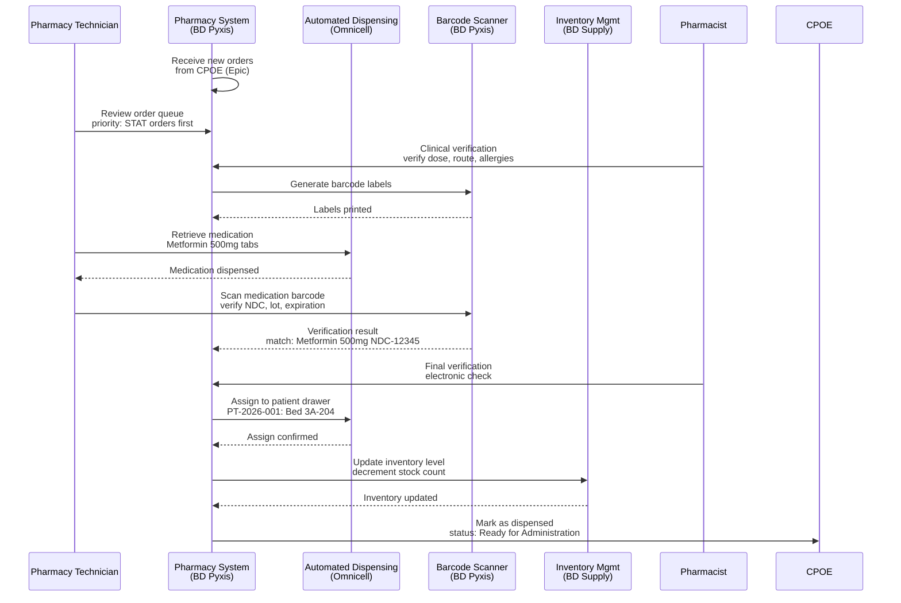
```mermaid
sequenceDiagram
    participant TECH as Pharmacy Technician
    participant PHARM as Pharmacy System<br/>(BD Pyxis)
    participant ADC as Automated Dispensing<br/>(Omnicell)
    participant BAR as Barcode Scanner<br/>(BD Pyxis)
    participant INV as Inventory Mgmt<br/>(BD Supply)
    PHARM->>PHARM: Receive new orders<br/>from CPOE (Epic)
    TECH->>PHARM: Review order queue<br/>priority: STAT orders first
    Pharmacist->>PHARM: Clinical verification<br/>verify dose, route, allergies
    PHARM->>BAR: Generate barcode labels
    BAR-->>PHARM: Labels printed
    TECH->>ADC: Retrieve medication<br/>Metformin 500mg tabs
    ADC-->>TECH: Medication dispensed
    TECH->>BAR: Scan medication barcode<br/>verify NDC, lot, expiration
    BAR-->>PHARM: Verification result<br/>match: Metformin 500mg NDC-12345
    Pharmacist->>PHARM: Final verification<br/>electronic check
    PHARM->>ADC: Assign to patient drawer<br/>PT-2026-001: Bed 3A-204
    ADC-->>PHARM: Assign confirmed
    PHARM->>INV: Update inventory level<br/>decrement stock count
    INV-->>PHARM: Inventory updated
    PHARM->>CPOE: Mark as dispensed<br/>status: Ready for Administration
```

#### Integration Details

| Flow | Entity | Info Flow | Source | Target | Source Conn | Target Conn | Pattern | Complexity |
|------|--------|-----------|--------|--------|-------------|-------------|---------|------------|
| Dispensing | Medication | GenerateLabel | Pharmacy System (BD Pyxis) | Barcode Scanner (BD Pyxis) | Pyxis REST API | Pyxis Printing Service (RAW) | Event-driven | Simple |
| Dispensing | Medication | DispenseFromADC | Pharmacy Technician | Automated Dispensing (Omnicell) | Omnicell UI | Omnicell REST API | API-led (Real-time) | Medium |
| Dispensing | Medication | ScanAndVerify | Barcode Scanner (BD Pyxis) | Pharmacy System (BD Pyxis) | Pyxis Barcode API | Pyxis REST API | API-led (Real-time) | Medium |
| Dispensing | Medication | AssignToPatient | Pharmacy System (BD Pyxis) | Automated Dispensing (Omnicell) | Pyxis REST API | Omnicell REST API | Event-driven | Medium |
| Dispensing | Medication | UpdateInventory | Pharmacy System (BD Pyxis) | Inventory Mgmt (BD Supply) | Pyxis REST API | BD Supply REST API (EDI) | Event-driven | Medium |

#### Acceptance Criteria

| AC ID | Description | Related Info Flow | Expected Outcome | Priority |
|-------|------------|-------------------|------------------|----------|
| AC-4.2-01 | Data integrity: Barcode verification data transferred from Scanner to Pharmacy via ScanAndVerify must be complete and consistent | ScanAndVerify | Barcode verification results match; incorrect medication rejected with alert | Critical |
| AC-4.2-02 | Data integrity: Inventory data transferred from Pharmacy to Inventory via UpdateInventory must be complete and consistent | UpdateInventory | Inventory levels accurately reflect dispensed quantities; no stock discrepancies | High |
| AC-4.2-03 | Error handling: Failed barcode verification triggers immediate alert and prevents dispensing | ScanAndVerify | Mismatched barcode triggers visual/audio alert; dispensing blocked until resolved | Critical |

### 4.3 Medication Administration (MAR)

**Description:** A nurse administers medications to the patient using barcode-assisted medication administration (BCMA) and documents the MAR.

**Actors:** Nurse  
**Systems:** EHR (Epic), Barcode Scanner (BD Pyxis), ADM (Omnicell), MAR (Epic)

#### Sequence Diagram

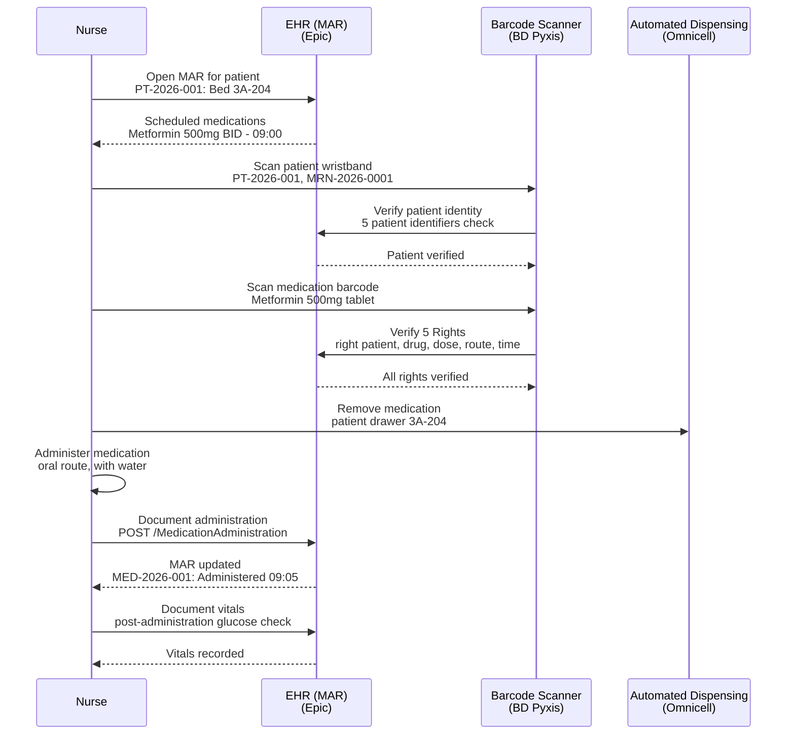
```mermaid
sequenceDiagram
    participant NURSE as Nurse
    participant EHR as EHR (MAR)<br/>(Epic)
    participant BAR as Barcode Scanner<br/>(BD Pyxis)
    participant ADC as Automated Dispensing<br/>(Omnicell)
    NURSE->>EHR: Open MAR for patient<br/>PT-2026-001: Bed 3A-204
    EHR-->>NURSE: Scheduled medications<br/>Metformin 500mg BID - 09:00
    NURSE->>BAR: Scan patient wristband<br/>PT-2026-001, MRN-2026-0001
    BAR->>EHR: Verify patient identity<br/>5 patient identifiers check
    EHR-->>BAR: Patient verified
    NURSE->>BAR: Scan medication barcode<br/>Metformin 500mg tablet
    BAR->>EHR: Verify 5 Rights<br/>right patient, drug, dose, route, time
    EHR-->>BAR: All rights verified
    NURSE->>ADC: Remove medication<br/>patient drawer 3A-204
    NURSE->>NURSE: Administer medication<br/>oral route, with water
    NURSE->>EHR: Document administration<br/>POST /MedicationAdministration
    EHR-->>NURSE: MAR updated<br/>MED-2026-001: Administered 09:05
    NURSE->>EHR: Document vitals<br/>post-administration glucose check
    EHR-->>NURSE: Vitals recorded
```

#### Integration Details

| Flow | Entity | Info Flow | Source | Target | Source Conn | Target Conn | Pattern | Complexity |
|------|--------|-----------|--------|--------|-------------|-------------|---------|------------|
| BCMA | Patient | ScanPatientWristband | Barcode Scanner (BD Pyxis) | EHR (Epic) | Pyxis Barcode API | Epic REST API (FHIR) | API-led (Real-time) | Medium |
| BCMA | Medication | ScanMedicationBarcode | Barcode Scanner (BD Pyxis) | EHR (Epic) | Pyxis Barcode API | Epic REST API (FHIR) | API-led (Real-time) | Medium |
| BCMA | Medication | Verify5Rights | EHR (Epic) | EHR (Epic) | Epic REST API (FHIR) | Epic REST API (FHIR) | API-led (Real-time) | Medium |
| BCMA | Medication | DocumentAdministration | EHR (Epic) | EHR (Epic) | Epic REST API (FHIR) | Epic REST API (FHIR) | API-led (Real-time) | Simple |
| BCMA | Observation | DocumentVitals | EHR (Epic) | EHR (Epic) | Epic REST API (FHIR) | Epic REST API (FHIR) | API-led (Real-time) | Simple |
| BCMA | Medication | RetrieveFromADC | Nurse | Automated Dispensing (Omnicell) | Omnicell UI | Omnicell REST API | API-led (Real-time) | Simple |

#### Acceptance Criteria

| AC ID | Description | Related Info Flow | Expected Outcome | Priority |
|-------|------------|-------------------|------------------|----------|
| AC-4.3-01 | Data integrity: Barcode scan data transferred from Scanner to EHR via ScanPatientWristband must be complete and consistent | ScanPatientWristband | Patient identity verified against 5 identifiers; mismatch blocks administration | Critical |
| AC-4.3-02 | Data integrity: Medication administration data transferred via DocumentAdministration must be complete and consistent | DocumentAdministration | MAR records match administered dose; no data loss; reconciliation report confirms accuracy | Critical |
| AC-4.3-03 | Error handling: Failed barcode verification during BCMA triggers immediate alert and prevents administration | ScanMedicationBarcode | Mismatched barcode triggers visual/audio alert; administration blocked | Critical |
| AC-4.3-04 | Security: BCMA ensures 5 Rights verification before administration is allowed | All flows | Administration blocked if any of 5 Rights fails validation | Critical |

---

# Billing & Revenue Cycle Management  - `HC040` `HC041` `HC042`

End-to-end revenue cycle management from charge capture through claim submission, payment posting, and denial management.

### 5.1 Charge Capture & Coding

**Description:** Charges are captured from clinical documentation, coded with appropriate ICD-10/CPT codes, and validated before claim submission.

**Actors:** Physician (Dr. Sarah Williams), Medical Coder, Charge Capture Specialist  
**Systems:** EHR (Epic), Coding Workflow (3M 360), Charge Capture (Epic), CDI (Nuance CDI)

#### Sequence Diagram

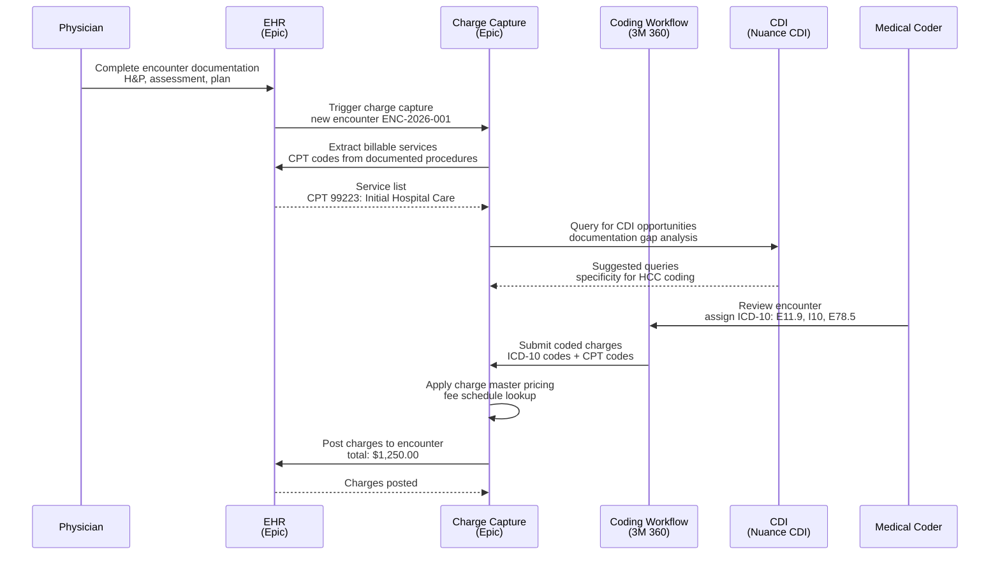
```mermaid
sequenceDiagram
    participant DOC as Physician
    participant EHR as EHR<br/>(Epic)
    participant CC as Charge Capture<br/>(Epic)
    participant COD as Coding Workflow<br/>(3M 360)
    participant CDI as CDI<br/>(Nuance CDI)
    DOC->>EHR: Complete encounter documentation<br/>H&P, assessment, plan
    EHR->>CC: Trigger charge capture<br/>new encounter ENC-2026-001
    CC->>EHR: Extract billable services<br/>CPT codes from documented procedures
    EHR-->>CC: Service list<br/>CPT 99223: Initial Hospital Care
    CC->>CDI: Query for CDI opportunities<br/>documentation gap analysis
    CDI-->>CC: Suggested queries<br/>specificity for HCC coding
    Medical Coder->>COD: Review encounter<br/>assign ICD-10: E11.9, I10, E78.5
    COD->>CC: Submit coded charges<br/>ICD-10 codes + CPT codes
    CC->>CC: Apply charge master pricing<br/>fee schedule lookup
    CC->>EHR: Post charges to encounter<br/>total: $1,250.00
    EHR-->>CC: Charges posted
```

#### Integration Details

| Flow | Entity | Info Flow | Source | Target | Source Conn | Target Conn | Pattern | Complexity |
|------|--------|-----------|--------|--------|-------------|-------------|---------|------------|
| Charge Capture | Encounter | ExtractBillableServices | Charge Capture (Epic) | EHR (Epic) | Epic Charge Services API | Epic REST API (FHIR) | API-led (Real-time) | Medium |
| Charge Capture | Encounter | QueryCDIOpportunities | Charge Capture (Epic) | CDI (Nuance CDI) | Epic REST API | Nuance CDI REST API (FHIR) | API-led (Real-time) | Medium |
| Charge Capture | Encounter | SubmitCodedCharges | Coding Workflow (3M 360) | Charge Capture (Epic) | 3M REST API | Epic REST API | API-led (Real-time) | Medium |
| Charge Capture | Encounter | PostCharges | Charge Capture (Epic) | EHR (Epic) | Epic Charge Services API | Epic REST API (FHIR) | API-led (Real-time) | Simple |
| Charge Capture | Encounter | ApplyChargeMaster | Charge Capture (Epic) | Charge Capture (Epic) | Epic Fee Schedule DB | Epic Charge Services API | API-led (Real-time) | Medium |

#### Acceptance Criteria

| AC ID | Description | Related Info Flow | Expected Outcome | Priority |
|-------|------------|-------------------|------------------|----------|
| AC-5.1-01 | Data integrity: Charge data transferred from EHR to Charge Capture via ExtractBillableServices must be complete and consistent | ExtractBillableServices | Charge records match documented services; no unbilled services identified | Critical |
| AC-5.1-02 | Data integrity: Coding data transferred from Coding Workflow to Charge Capture via SubmitCodedCharges must be complete and consistent | SubmitCodedCharges | Coded charges match clinical documentation; audit trail confirms accuracy | High |
| AC-5.1-03 | Error handling: Failed charge capture transactions are logged with error context and trigger automatic retry or alert | ExtractBillableServices | Errors logged with timestamp, HTTP status, request payload excerpt; retry up to 3 times; alert sent after consecutive failures | Critical |

### 5.2 Claims Submission & Adjudication

**Description:** Claims are generated from posted charges, validated through clearinghouse edits, submitted to payers, and adjudication results are received.

**Actors:** Billing Specialist, Payer  
**Systems:** Revenue Cycle (Epic), Clearinghouse (Change Healthcare), Payer Portal (BCBS), Payment Processor (InstaMed)

#### Sequence Diagram

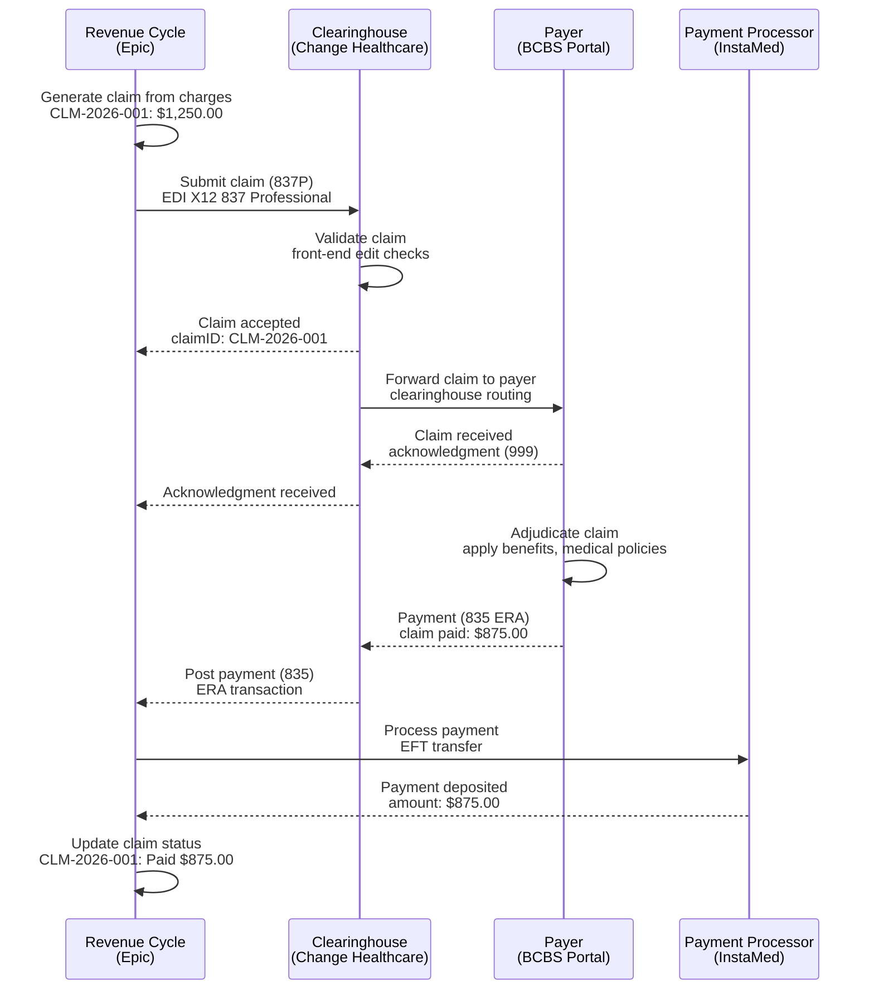
```mermaid
sequenceDiagram
    participant RC as Revenue Cycle<br/>(Epic)
    participant CLR as Clearinghouse<br/>(Change Healthcare)
    participant PAYER as Payer<br/>(BCBS Portal)
    participant PP as Payment Processor<br/>(InstaMed)
    RC->>RC: Generate claim from charges<br/>CLM-2026-001: $1,250.00
    RC->>CLR: Submit claim (837P)<br/>EDI X12 837 Professional
    CLR->>CLR: Validate claim<br/>front-end edit checks
    CLR-->>RC: Claim accepted<br/>claimID: CLM-2026-001
    CLR->>PAYER: Forward claim to payer<br/>clearinghouse routing
    PAYER-->>CLR: Claim received<br/>acknowledgment (999)
    CLR-->>RC: Acknowledgment received
    PAYER->>PAYER: Adjudicate claim<br/>apply benefits, medical policies
    PAYER-->>CLR: Payment (835 ERA)<br />claim paid: $875.00
    CLR-->>RC: Post payment (835)<br/>ERA transaction
    RC->>PP: Process payment<br/>EFT transfer
    PP-->>RC: Payment deposited<br/>amount: $875.00
    RC->>RC: Update claim status<br/>CLM-2026-001: Paid $875.00
```

#### Integration Details

| Flow | Entity | Info Flow | Source | Target | Source Conn | Target Conn | Pattern | Complexity |
|------|--------|-----------|--------|--------|-------------|-------------|---------|------------|
| Claims | Claim | SubmitClaim (837P) | Revenue Cycle (Epic) | Clearinghouse (Change Healthcare) | Epic EDI Gateway (SFTP) | Change Healthcare EDI (SFTP/AS2) | Batch (Scheduled) | High |
| Claims | Claim | ValidateClaim | Clearinghouse (Change Healthcare) | Clearinghouse (Change Healthcare) | Change Healthcare EDI Engine | Change Healthcare EDI Engine | API-led (Real-time) | Medium |
| Claims | Claim | RouteToPayer | Clearinghouse (Change Healthcare) | Payer (BCBS Portal) | Change Healthcare EDI (AS2) | BCBS EDI (AS2) | Batch (Scheduled) | High |
| Claims | Claim | AdjudicateClaim | Payer (BCBS Portal) | Payer (BCBS Portal) | BCBS Adjudication Engine | BCBS Adjudication Engine | Batch (Scheduled) | High |
| Claims | Claim | PostPayment (835) | Clearinghouse (Change Healthcare) | Revenue Cycle (Epic) | Change Healthcare EDI (SFTP) | Epic EDI Gateway (SFTP) | Batch (Scheduled) | High |
| Claims | Payment | ProcessEFT | Revenue Cycle (Epic) | Payment Processor (InstaMed) | Epic REST API | InstaMed REST API (ACH) | API-led (Real-time) | Medium |

#### Acceptance Criteria

| AC ID | Description | Related Info Flow | Expected Outcome | Priority |
|-------|------------|-------------------|------------------|----------|
| AC-5.2-01 | Data integrity: Claim data transferred from Revenue Cycle to Clearinghouse via SubmitClaim must be complete and consistent | SubmitClaim | Claims in Clearinghouse match source; no data loss; reconciliation report confirms accuracy | Critical |
| AC-5.2-02 | Data integrity: Payment data transferred from Clearinghouse to Revenue Cycle via PostPayment must be complete and consistent | PostPayment | Payment records in Revenue Cycle match payer source; no data loss; reconciliation report confirms accuracy | Critical |
| AC-5.2-03 | Error handling: Claim submission failures are logged with error context and trigger automatic retry or alert | SubmitClaim | Errors logged with timestamp, EDI status, claim payload excerpt; retry up to 3 times; alert sent after consecutive failures | Critical |

### 5.3 Payment Posting & Denial Management

**Description:** Payments are posted to patient accounts, denials are analyzed and appealed, and accounts are reconciled.

**Actors:** Payment Poster, Denial Specialist, Patient  
**Systems:** Revenue Cycle (Epic), Clearinghouse (Change Healthcare), Denial Management (Cerner), Patient Portal (MyChart)

#### Sequence Diagram

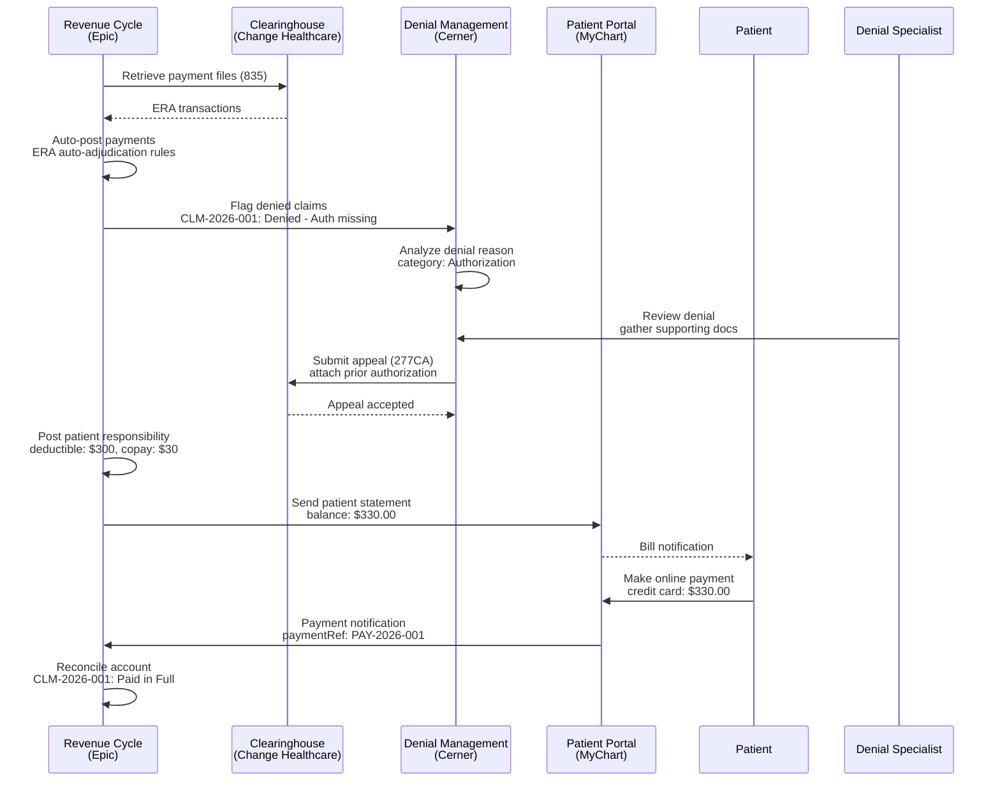
```mermaid
sequenceDiagram
    participant RP as Revenue Cycle<br/>(Epic)
    participant CLR as Clearinghouse<br/>(Change Healthcare)
    participant DM as Denial Management<br/>(Cerner)
    participant PORT as Patient Portal<br/>(MyChart)
    participant PT as Patient
    RP->>CLR: Retrieve payment files (835)
    CLR-->>RP: ERA transactions
    RP->>RP: Auto-post payments<br/>ERA auto-adjudication rules
    RP->>DM: Flag denied claims<br/>CLM-2026-001: Denied - Auth missing
    DM->>DM: Analyze denial reason<br/>category: Authorization
    Denial Specialist->>DM: Review denial<br/>gather supporting docs
    DM->>CLR: Submit appeal (277CA)<br/>attach prior authorization
    CLR-->>DM: Appeal accepted
    RP->>RP: Post patient responsibility<br/>deductible: $300, copay: $30
    RP->>PORT: Send patient statement<br/>balance: $330.00
    PORT-->>PT: Bill notification
    PT->>PORT: Make online payment<br/>credit card: $330.00
    PORT->>RP: Payment notification<br/>paymentRef: PAY-2026-001
    RP->>RP: Reconcile account<br/>CLM-2026-001: Paid in Full
```

#### Integration Details

| Flow | Entity | Info Flow | Source | Target | Source Conn | Target Conn | Pattern | Complexity |
|------|--------|-----------|--------|--------|-------------|-------------|---------|------------|
| Payment Posting | Claim | RetrievePaymentFiles (835) | Revenue Cycle (Epic) | Clearinghouse (Change Healthcare) | Epic EDI Gateway (SFTP) | Change Healthcare EDI (SFTP/AS2) | Batch (Scheduled) | High |
| Denial Mgmt | Claim | FlagDeniedClaim | Revenue Cycle (Epic) | Denial Management (Cerner) | Epic REST API (FHIR) | Cerner REST API | Event-driven | Medium |
| Denial Mgmt | Claim | SubmitAppeal (277CA) | Denial Management (Cerner) | Clearinghouse (Change Healthcare) | Cerner REST API | Change Healthcare EDI (SFTP) | API-led (Real-time) | High |
| Payment Posting | Claim | PostPatientResponsibility | Revenue Cycle (Epic) | Revenue Cycle (Epic) | Epic ERA Auto-post | Epic REST API | Batch (Scheduled) | Medium |
| Patient Billing | Claim | SendPatientStatement | Revenue Cycle (Epic) | Patient Portal (MyChart) | Epic REST API (FHIR) | MyChart REST API | Batch (Scheduled) | Medium |
| Patient Billing | Payment | ProcessPatientPayment | Patient Portal (MyChart) | Revenue Cycle (Epic) | MyChart REST API | Epic Payment API | API-led (Real-time) | Medium |

#### Acceptance Criteria

| AC ID | Description | Related Info Flow | Expected Outcome | Priority |
|-------|------------|-------------------|------------------|----------|
| AC-5.3-01 | Data integrity: Payment data transferred from Clearinghouse to Revenue Cycle via RetrievePaymentFiles must be complete and consistent | RetrievePaymentFiles | Payment records match ERA source; no data loss; reconciliation report confirms accuracy | Critical |
| AC-5.3-02 | Data integrity: Denial data transferred from Revenue Cycle to Denial Management via FlagDeniedClaim must be complete and consistent | FlagDeniedClaim | Denial records in Denial Management match source; no data loss; reconciliation report confirms accuracy | High |
| AC-5.3-03 | Error handling: Failed appeal submissions are logged with error context and trigger automatic retry or alert | SubmitAppeal | Errors logged with timestamp, HTTP status, request payload excerpt; retry up to 3 times; alert sent after consecutive failures | High |

---

# Appointment Scheduling & Access  - `HC050` `HC051`

Patient access management including appointment scheduling, check-in/check-out, referral management, and prior authorization.

### 6.1 Patient Scheduling & Check-in

**Description:** A patient schedules an appointment online, receives confirmation, checks in at the facility, and completes pre-visit registration.

**Actors:** Patient, Front Desk Staff  
**Systems:** Patient Portal (MyChart), Scheduling (Epic Cadence), EHR (Epic), Kiosk (Phreesia)

#### Sequence Diagram

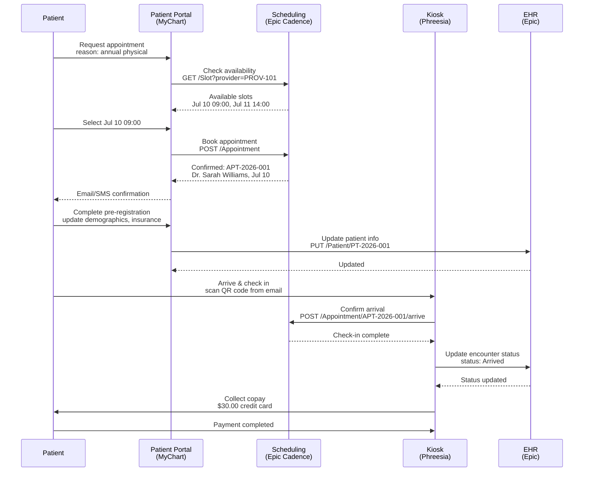
```mermaid
sequenceDiagram
    participant PT as Patient
    participant PORT as Patient Portal<br/>(MyChart)
    participant SCH as Scheduling<br/>(Epic Cadence)
    participant KIOSK as Kiosk<br/>(Phreesia)
    participant EHR as EHR<br/>(Epic)
    PT->>PORT: Request appointment<br/>reason: annual physical
    PORT->>SCH: Check availability<br/>GET /Slot?provider=PROV-101
    SCH-->>PORT: Available slots<br/>Jul 10 09:00, Jul 11 14:00
    PT->>PORT: Select Jul 10 09:00
    PORT->>SCH: Book appointment<br/>POST /Appointment
    SCH-->>PORT: Confirmed: APT-2026-001<br/>Dr. Sarah Williams, Jul 10
    PORT-->>PT: Email/SMS confirmation
    PT->>PORT: Complete pre-registration<br/>update demographics, insurance
    PORT->>EHR: Update patient info<br/>PUT /Patient/PT-2026-001
    EHR-->>PORT: Updated
    PT->>KIOSK: Arrive & check in<br/>scan QR code from email
    KIOSK->>SCH: Confirm arrival<br/>POST /Appointment/APT-2026-001/arrive
    SCH-->>KIOSK: Check-in complete
    KIOSK->>EHR: Update encounter status<br/>status: Arrived
    EHR-->>KIOSK: Status updated
    KIOSK->>PT: Collect copay<br/>$30.00 credit card
    PT->>KIOSK: Payment completed
```

#### Integration Details

| Flow | Entity | Info Flow | Source | Target | Source Conn | Target Conn | Pattern | Complexity |
|------|--------|-----------|--------|--------|-------------|-------------|---------|------------|
| Scheduling | Appointment | CheckAvailability | Patient Portal (MyChart) | Scheduling (Epic Cadence) | MyChart REST API | Epic Cadence REST API (FHIR) | API-led (Real-time) | Simple |
| Scheduling | Appointment | BookAppointment | Patient Portal (MyChart) | Scheduling (Epic Cadence) | MyChart REST API | Epic Cadence REST API (FHIR) | API-led (Real-time) | Simple |
| Pre-registration | Patient | UpdateDemographics | Patient Portal (MyChart) | EHR (Epic) | MyChart REST API | Epic REST API (FHIR) | API-led (Real-time) | Simple |
| Check-in | Appointment | ConfirmArrival | Kiosk (Phreesia) | Scheduling (Epic Cadence) | Phreesia REST API | Epic Cadence REST API (FHIR) | API-led (Real-time) | Medium |
| Check-in | Encounter | UpdateStatus | Kiosk (Phreesia) | EHR (Epic) | Phreesia REST API | Epic REST API (FHIR) | API-led (Real-time) | Medium |
| Check-in | Payment | CollectCopay | Kiosk (Phreesia) | Payment Processor | Phreesia Payment API | Payment Gateway REST API | API-led (Real-time) | Medium |

#### Acceptance Criteria

| AC ID | Description | Related Info Flow | Expected Outcome | Priority |
|-------|------------|-------------------|------------------|----------|
| AC-6.1-01 | Data integrity: Appointment data transferred from Patient Portal to Scheduling via BookAppointment must be complete and consistent | BookAppointment | Appointment records in Scheduling match source; no data loss; reconciliation report confirms accuracy | Medium |
| AC-6.1-02 | Data integrity: Check-in data transferred from Kiosk to EHR via ConfirmArrival must be complete and consistent | ConfirmArrival | Check-in records in EHR match source; no data loss; reconciliation report confirms accuracy | High |
| AC-6.1-03 | Error handling: Failed scheduling transactions are logged with error context and trigger automatic retry or alert | BookAppointment | Errors logged with timestamp, HTTP status, request payload excerpt; retry up to 3 times; alert sent after consecutive failures | High |

### 6.2 Referral Management & Authorizations

**Description:** A primary care physician refers a patient to a specialist. The referral is submitted, prior authorization is obtained, and the specialist appointment is scheduled.

**Actors:** PCP (Dr. Sarah Williams), Patient, Specialist Office, Payer  
**Systems:** EHR (Epic), Referral Management (Epic), Payer Portal (BCBS), Scheduling (Epic Cadence)

#### Sequence Diagram

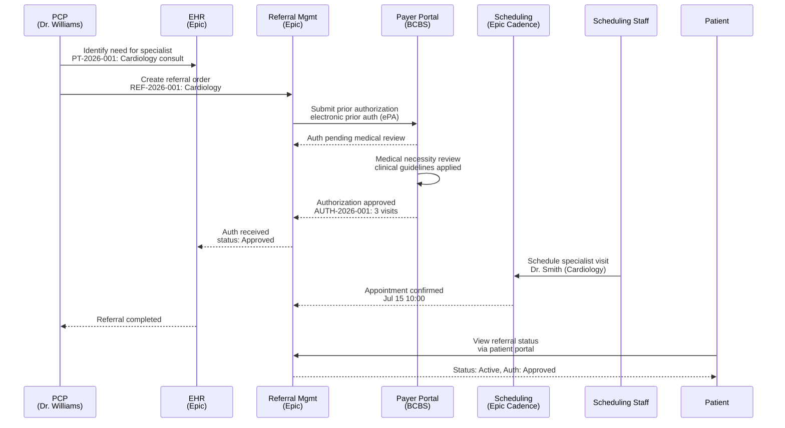
```mermaid
sequenceDiagram
    participant PCP as PCP<br/>(Dr. Williams)
    participant EHR as EHR<br/>(Epic)
    participant REF as Referral Mgmt<br/>(Epic)
    participant PAYER as Payer Portal<br/>(BCBS)
    participant SCH as Scheduling<br/>(Epic Cadence)
    PCP->>EHR: Identify need for specialist<br/>PT-2026-001: Cardiology consult
    PCP->>REF: Create referral order<br/>REF-2026-001: Cardiology
    REF->>PAYER: Submit prior authorization<br/>electronic prior auth (ePA)
    PAYER-->>REF: Auth pending medical review
    PAYER->>PAYER: Medical necessity review<br/>clinical guidelines applied
    PAYER-->>REF: Authorization approved<br/>AUTH-2026-001: 3 visits
    REF-->>EHR: Auth received<br/>status: Approved
    Scheduling Staff->>SCH: Schedule specialist visit<br/>Dr. Smith (Cardiology)
    SCH-->>REF: Appointment confirmed<br/>Jul 15 10:00
    EHR-->>PCP: Referral completed
    Patient->>REF: View referral status<br/>via patient portal
    REF-->>Patient: Status: Active, Auth: Approved
```

#### Integration Details

| Flow | Entity | Info Flow | Source | Target | Source Conn | Target Conn | Pattern | Complexity |
|------|--------|-----------|--------|--------|-------------|-------------|---------|------------|
| Referral | Referral | CreateReferral | EHR (Epic) | Referral Mgmt (Epic) | Epic REST API (FHIR) | Epic REST API (FHIR) | API-led (Real-time) | Simple |
| Referral | Referral | SubmitPriorAuth | Referral Mgmt (Epic) | Payer Portal (BCBS) | Epic REST API (FHIR) | BCBS ePA REST API (X12 278) | API-led (Real-time) | High |
| Referral | Referral | ReceiveAuthResponse | Payer Portal (BCBS) | Referral Mgmt (Epic) | BCBS ePA REST API (X12 278) | Epic REST API (FHIR) | API-led (Real-time) | High |
| Referral | Appointment | ScheduleSpecialist | Scheduling (Epic Cadence) | Referral Mgmt (Epic) | Epic Cadence REST API (FHIR) | Epic REST API (FHIR) | API-led (Real-time) | Medium |
| Referral | Referral | ViewReferralStatus | Patient Portal (MyChart) | Referral Mgmt (Epic) | MyChart REST API | Epic REST API (FHIR) | API-led (Real-time) | Simple |

#### Acceptance Criteria

| AC ID | Description | Related Info Flow | Expected Outcome | Priority |
|-------|------------|-------------------|------------------|----------|
| AC-6.2-01 | Data integrity: Referral data transferred from EHR to Referral Management via CreateReferral must be complete and consistent | CreateReferral | Referral records in Referral Management match source; no data loss; reconciliation report confirms accuracy | High |
| AC-6.2-02 | Data integrity: Authorization data transferred from Payer Portal to Referral Management via ReceiveAuthResponse must be complete and consistent | ReceiveAuthResponse | Authorization records in Referral Management match payer source; no data loss; reconciliation report confirms accuracy | Critical |
| AC-6.2-03 | Error handling: Failed prior authorization submissions are logged with error context and trigger automatic retry or alert | SubmitPriorAuth | Errors logged with timestamp, HTTP status, request payload excerpt; retry up to 3 times; alert sent after consecutive failures | Critical |

---

# Care Coordination & Population Health  - `HC060` `HC061` `HC062`

Integrated care coordination including care plan management, transition of care, discharge planning, and population health risk stratification.

### 7.1 Care Plan Development & Management

**Description:** An interdisciplinary team develops a comprehensive care plan for a patient with complex chronic conditions, sets goals, and tracks progress.

**Actors:** Care Coordinator, Physician (Dr. Sarah Williams), Patient  
**Systems:** Care Management (Cerner HealtheIntent), EHR (Epic), Patient Portal (MyChart), HIE (HealthShare)

#### Sequence Diagram

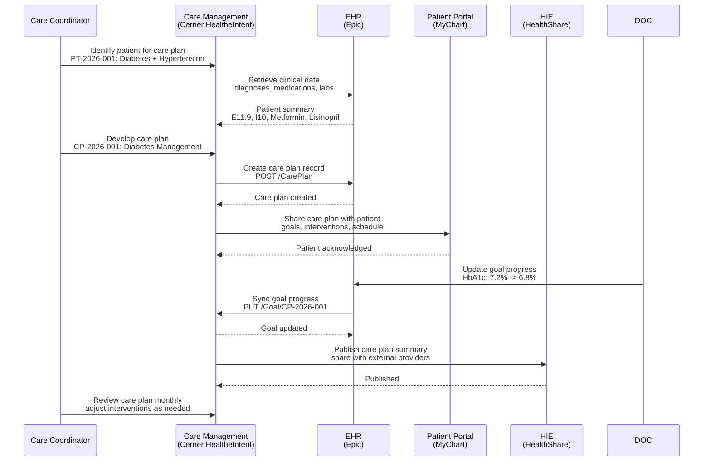
```mermaid
sequenceDiagram
    participant COORD as Care Coordinator
    participant CM as Care Management<br/>(Cerner HealtheIntent)
    participant EHR as EHR<br/>(Epic)
    participant PORT as Patient Portal<br/>(MyChart)
    participant HIE as HIE<br/>(HealthShare)
    COORD->>CM: Identify patient for care plan<br/>PT-2026-001: Diabetes + Hypertension
    CM->>EHR: Retrieve clinical data<br/>diagnoses, medications, labs
    EHR-->>CM: Patient summary<br/>E11.9, I10, Metformin, Lisinopril
    COORD->>CM: Develop care plan<br/>CP-2026-001: Diabetes Management
    CM->>EHR: Create care plan record<br/>POST /CarePlan
    EHR-->>CM: Care plan created
    CM->>PORT: Share care plan with patient<br/>goals, interventions, schedule
    PORT-->>CM: Patient acknowledged
    DOC->>EHR: Update goal progress<br/>HbA1c: 7.2% -> 6.8%
    EHR->>CM: Sync goal progress<br/>PUT /Goal/CP-2026-001
    CM-->>EHR: Goal updated
    CM->>HIE: Publish care plan summary<br/>share with external providers
    HIE-->>CM: Published
    COORD->>CM: Review care plan monthly<br/>adjust interventions as needed
```

#### Integration Details

| Flow | Entity | Info Flow | Source | Target | Source Conn | Target Conn | Pattern | Complexity |
|------|--------|-----------|--------|--------|-------------|-------------|---------|------------|
| Care Plan | Patient | RetrieveClinicalData | Care Management (Cerner HealtheIntent) | EHR (Epic) | Cerner REST API | Epic REST API (FHIR) | API-led (Real-time) | Medium |
| Care Plan | CarePlan | CreateCarePlan | Care Management (Cerner HealtheIntent) | EHR (Epic) | Cerner REST API | Epic REST API (FHIR) | API-led (Real-time) | Medium |
| Care Plan | CarePlan | ShareWithPatient | Care Management (Cerner HealtheIntent) | Patient Portal (MyChart) | Cerner REST API | MyChart REST API | API-led (Real-time) | Medium |
| Care Plan | Goal | SyncGoalProgress | EHR (Epic) | Care Management (Cerner HealtheIntent) | Epic REST API (FHIR) | Cerner REST API | Event-driven | Medium |
| Care Plan | CarePlan | PublishToHIE | Care Management (Cerner HealtheIntent) | HIE (HealthShare) | Cerner REST API | HealthShare REST API (IHE XDS) | Batch (Scheduled) | High |

#### Acceptance Criteria

| AC ID | Description | Related Info Flow | Expected Outcome | Priority |
|-------|------------|-------------------|------------------|----------|
| AC-7.1-01 | Data integrity: Care Plan data transferred from Care Management to EHR via CreateCarePlan must be complete and consistent | CreateCarePlan | Care Plan records in EHR match source; no data loss; reconciliation report confirms accuracy | High |
| AC-7.1-02 | Data integrity: Goal progress data transferred from EHR to Care Management via SyncGoalProgress must be complete and consistent | SyncGoalProgress | Goal progress records in Care Management match source; no data loss; reconciliation report confirms accuracy | Medium |
| AC-7.1-03 | Error handling: Failed care plan transactions are logged with error context and trigger automatic retry or alert | CreateCarePlan | Errors logged with timestamp, HTTP status, request payload excerpt; retry up to 3 times; alert sent after consecutive failures | High |

### 7.2 Transition of Care & Discharge

**Description:** A patient is discharged from inpatient care. Discharge summary is created, medications are reconciled, follow-up is scheduled, and the summary is shared with the PCP.

**Actors:** Hospitalist, Patient, PCP, Discharge Planner  
**Systems:** EHR (Epic), Care Management (Cerner HealtheIntent), Patient Portal (MyChart), HIE (HealthShare), Pharmacy (BD Pyxis)

#### Sequence Diagram

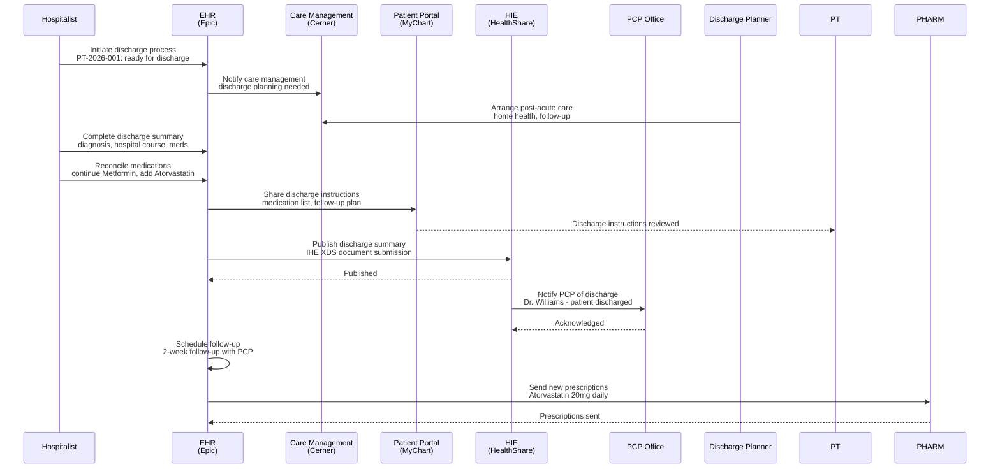
```mermaid
sequenceDiagram
    participant HOSP as Hospitalist
    participant EHR as EHR<br/>(Epic)
    participant CM as Care Management<br/>(Cerner)
    participant PORT as Patient Portal<br/>(MyChart)
    participant HIE as HIE<br/>(HealthShare)
    participant PCP as PCP Office
    HOSP->>EHR: Initiate discharge process<br/>PT-2026-001: ready for discharge
    EHR->>CM: Notify care management<br/>discharge planning needed
    Discharge Planner->>CM: Arrange post-acute care<br/>home health, follow-up
    HOSP->>EHR: Complete discharge summary<br/>diagnosis, hospital course, meds
    HOSP->>EHR: Reconcile medications<br/>continue Metformin, add Atorvastatin
    EHR->>PORT: Share discharge instructions<br/>medication list, follow-up plan
    PORT-->>PT: Discharge instructions reviewed
    EHR->>HIE: Publish discharge summary<br/>IHE XDS document submission
    HIE-->>EHR: Published
    HIE->>PCP: Notify PCP of discharge<br/>Dr. Williams - patient discharged
    PCP-->>HIE: Acknowledged
    EHR->>EHR: Schedule follow-up<br/>2-week follow-up with PCP
    EHR->>PHARM: Send new prescriptions<br/>Atorvastatin 20mg daily
    PHARM-->>EHR: Prescriptions sent
```

#### Integration Details

| Flow | Entity | Info Flow | Source | Target | Source Conn | Target Conn | Pattern | Complexity |
|------|--------|-----------|--------|--------|-------------|-------------|---------|------------|
| Discharge | Encounter | NotifyDischargePlanning | EHR (Epic) | Care Management (Cerner HealtheIntent) | Epic REST API (FHIR) | Cerner REST API | Event-driven | Medium |
| Discharge | Document | CompleteDischargeSummary | EHR (Epic) | EHR (Epic) | Epic REST API (FHIR) | Epic REST API (FHIR) | API-led (Real-time) | Simple |
| Discharge | Medication | ReconcileMedications | EHR (Epic) | EHR (Epic) | Epic REST API (FHIR) | Epic REST API (FHIR) | API-led (Real-time) | Medium |
| Discharge | Document | PublishDischargeSummary | EHR (Epic) | HIE (HealthShare) | Epic REST API (FHIR) | HealthShare REST API (IHE XDS) | API-led (Real-time) | High |
| Discharge | Document | NotifyPCP | HIE (HealthShare) | PCP Office | HealthShare REST API (IHE XDS) | PCP EHR REST API (FHIR) | Event-driven | High |
| Discharge | Medication | SendNewPrescriptions | EHR (Epic) | Pharmacy System (BD Pyxis) | Epic REST API (FHIR) | Pyxis NCPDP SCRIPT (SOAP) | API-led (Real-time) | Medium |

#### Acceptance Criteria

| AC ID | Description | Related Info Flow | Expected Outcome | Priority |
|-------|------------|-------------------|------------------|----------|
| AC-7.2-01 | Data integrity: Discharge summary data transferred from EHR to HIE via PublishDischargeSummary must be complete and consistent | PublishDischargeSummary | Discharge summaries in HIE match source; no data loss; reconciliation report confirms accuracy | Critical |
| AC-7.2-02 | Data integrity: Medication reconciliation data must be complete and consistent across all systems | ReconcileMedications | Medication list matches at discharge; discrepancies flagged for review | Critical |
| AC-7.2-03 | Error handling: Failed discharge summary publication transactions are logged with error context and trigger automatic retry or alert | PublishDischargeSummary | Errors logged with timestamp, HTTP status, request payload excerpt; retry up to 3 times; alert sent after consecutive failures | High |

### 7.3 Population Health Risk Stratification

**Description:** The population health platform analyzes patient data to stratify risk, identify gaps in care, and trigger outreach for high-risk patients.

**Actors:** Population Health Analyst, Care Coordinator  
**Systems:** Population Health (Cerner HealtheIntent), EHR (Epic), CRM (Salesforce Health Cloud), Patient Portal (MyChart)

#### Sequence Diagram

```mermaid
sequenceDiagram
    participant PH as Population Health<br/>(Cerner HealtheIntent)
    participant EHR as EHR<br/>(Epic)
    participant CRM as CRM<br/>(Salesforce Health Cloud)
    participant PORT as Patient Portal<br/>(MyChart)
    PH->>EHR: Extract patient population data<br/>GET /Patient, GET /Condition
    EHR-->>PH: Patient data batch<br/>10,000 patients
    PH->>PH: Run risk stratification model<br/>predictive analytics, HCC scores
    PH->>PH: Identify care gaps<br/>missing HbA1c, mammogram due
    PH->>CRM: Create outreach list<br/>high-risk patients with gaps
    CRM-->>PH: Outreach list created
    PH->>EHR: Update patient risk scores<br/>PUT /Patient/PT-2026-001/risk
    EHR-->>PH: Risk scores updated
    Care Coordinator->>CRM: Review high-risk list<br/>PT-2026-001: Risk Score 8.5/10
    CRM->>PORT: Send patient outreach<br/>appointment reminder, health tip
    PORT-->>Patient: Notification sent
    CRM->>EHR: Document outreach<br/>communication log
    EHR-->>CRM: Outreach documented
```

#### Integration Details

| Flow | Entity | Info Flow | Source | Target | Source Conn | Target Conn | Pattern | Complexity |
|------|--------|-----------|--------|--------|-------------|-------------|---------|------------|
| Population Health | Patient | ExtractPatientData | Population Health (Cerner HealtheIntent) | EHR (Epic) | Cerner REST API | Epic REST API (FHIR) | Batch (Scheduled) | High |
| Population Health | Patient | RunRiskStratification | Population Health (Cerner HealtheIntent) | Population Health (Cerner HealtheIntent) | Cerner Analytics Engine | Cerner Analytics Engine | Batch (Scheduled) | High |
| Population Health | Patient | CreateOutreachList | Population Health (Cerner HealtheIntent) | CRM (Salesforce Health Cloud) | Cerner REST API | Salesforce REST API (OAuth2) | Event-driven | Medium |
| Population Health | Patient | UpdateRiskScores | Population Health (Cerner HealtheIntent) | EHR (Epic) | Cerner REST API | Epic REST API (FHIR) | Batch (Scheduled) | Medium |
| Population Health | Patient | SendPatientOutreach | CRM (Salesforce Health Cloud) | Patient Portal (MyChart) | Salesforce REST API | MyChart REST API | Event-driven | Medium |
| Population Health | Patient | DocumentOutreach | CRM (Salesforce Health Cloud) | EHR (Epic) | Salesforce REST API | Epic REST API (FHIR) | API-led (Real-time) | Medium |

#### Acceptance Criteria

| AC ID | Description | Related Info Flow | Expected Outcome | Priority |
|-------|------------|-------------------|------------------|----------|
| AC-7.3-01 | Data integrity: Patient population data transferred from EHR to Population Health via ExtractPatientData must be complete and consistent | ExtractPatientData | Patient data in Population Health matches source; no data loss; reconciliation report confirms accuracy | Critical |
| AC-7.3-02 | Data integrity: Risk score data transferred from Population Health to EHR via UpdateRiskScores must be complete and consistent | UpdateRiskScores | Risk scores in EHR match source; no data loss; reconciliation report confirms accuracy | High |
| AC-7.3-03 | Error handling: Failed population health data extraction transactions are logged with error context and trigger automatic retry or alert | ExtractPatientData | Errors logged with timestamp, HTTP status, request payload excerpt; retry up to 3 times; alert sent after consecutive failures | High |

---

# Health Information Exchange  - `HC070` `HC071`

Interoperability services including clinical document sharing, query across organizational boundaries, and public health reporting.

### 8.1 HIE Document Sharing & Query

**Description:** A provider queries the health information exchange for a patient's external records. Documents are retrieved from other organizations and incorporated into the local EHR.

**Actors:** Physician (Dr. Sarah Williams), HIE Operator  
**Systems:** EHR (Epic), HIE (HealthShare), External EHR (Cerner), Document Repository (IHE XDS Registry)

#### Sequence Diagram

```mermaid
sequenceDiagram
    participant DOC as Physician<br/>(Dr. Williams)
    participant EHR as EHR<br/>(Epic)
    participant HIE as HIE<br/>(HealthShare)
    participant EXT as External EHR<br/>(Cerner)
    participant REPO as Document Repository<br/>(IHE XDS)
    DOC->>EHR: Open patient chart<br/>PT-2026-001: John Doe
    EHR->>HIE: Query for external docs<br/>IHE XCA Cross-Community Query
    HIE->>HIE: Search patient index<br/>community MPI lookup
    HIE-->>EHR: Documents found<br/>3 external documents available
    DOC->>EHR: Request external records<br/>select documents to retrieve
    EHR->>HIE: Retrieve documents<br/>IHE XCA Cross-Community Retrieve
    HIE->>EXT: Request documents<br/>from external organization
    EXT-->>HIE: Documents returned<br/>discharge summary, lab results
    HIE->>REPO: Store in repository<br/>cache for future access
    REPO-->>HIE: Stored
    HIE-->>EHR: Documents delivered<br/>CCD, PDF, lab report
    EHR-->>DOC: External records available<br/>view in chart
```

#### Integration Details

| Flow | Entity | Info Flow | Source | Target | Source Conn | Target Conn | Pattern | Complexity |
|------|--------|-----------|--------|--------|-------------|-------------|---------|------------|
| HIE | Document | QueryExternalDocuments | EHR (Epic) | HIE (HealthShare) | Epic REST API (FHIR) | HealthShare REST API (IHE XCA) | API-led (Real-time) | High |
| HIE | Document | RetrieveDocuments | EHR (Epic) | HIE (HealthShare) | Epic REST API (FHIR) | HealthShare REST API (IHE XCA) | API-led (Real-time) | High |
| HIE | Document | RequestFromExternal | HIE (HealthShare) | External EHR (Cerner) | HealthShare REST API (IHE XCA) | Cerner REST API (FHIR) | API-led (Real-time) | High |
| HIE | Document | StoreInRepository | HIE (HealthShare) | Document Repository (IHE XDS) | HealthShare REST API | XDS SOAP (IHE XDS) | API-led (Real-time) | Medium |
| HIE | Document | DeliverToEHR | HIE (HealthShare) | EHR (Epic) | HealthShare REST API (IHE XCA) | Epic REST API (FHIR) | API-led (Real-time) | Medium |

#### Acceptance Criteria

| AC ID | Description | Related Info Flow | Expected Outcome | Priority |
|-------|------------|-------------------|------------------|----------|
| AC-8.1-01 | Data integrity: Document data transferred from HIE to EHR via DeliverToEHR must be complete and consistent | DeliverToEHR | Document records in EHR match source; no data loss; reconciliation report confirms accuracy | Critical |
| AC-8.1-02 | Data integrity: Query results transferred from HIE to EHR via QueryExternalDocuments must be complete and consistent | QueryExternalDocuments | Query results in EHR match source; no data loss; reconciliation report confirms accuracy | High |
| AC-8.1-03 | Security: All endpoints enforce authentication (HealthShare REST API (IHE XCA), Epic REST API (FHIR), ...) and encrypt data in transit via TLS 1.2+ | All flows | Unauthenticated requests rejected with 401; tokens validated per call; invalid/expired tokens logged | Critical |
| AC-8.1-04 | Privacy: Patient consent verified before disclosure of external records | All flows | Consent directive checked; disclosure blocked if opt-out status detected | Critical |

### 8.2 Public Health Reporting & Immunization

**Description:** Immunization records are reported to the state immunization registry and communicable disease reports are submitted to public health authorities.

**Actors:** Clinical Informaticist, Public Health Agency  
**Systems:** EHR (Epic), Immunization Registry (State IIS), Public Health Portal (CDC), HIE (HealthShare)

#### Sequence Diagram

```mermaid
sequenceDiagram
    participant EHR as EHR<br/>(Epic)
    participant IIS as Immunization Registry<br/>(State IIS)
    participant PH as Public Health Portal<br/>(CDC)
    participant HIE as HIE<br/>(HealthShare)
    Nurse->>EHR: Administer influenza vaccine<br/>IMM-2026-001: Influenza 0.5mL
    EHR->>IIS: Report immunization<br/>HL7 VXU (v2.5.1)
    IIS-->>EHR: Acknowledged<br/>registry ID: IIS-2026-001
    EHR->>EHR: Update patient record<br/>immunization status: Complete
    LAB->>EHR: Report positive lab result<br/>COVID-19 detected
    EHR->>PH: Report communicable disease<br/>electronic lab reporting (ELR)
    PH-->>EHR: Report accepted<br/>case ID: CD-2026-001
    EHR->>HIE: Publish syndromic data<br/>emergency department chief complaints
    HIE-->>EHR: Syndromic data submitted
    Clinical Informaticist->>EHR: Review reporting dashboard<br/>compliance metrics
```

#### Integration Details

| Flow | Entity | Info Flow | Source | Target | Source Conn | Target Conn | Pattern | Complexity |
|------|--------|-----------|--------|--------|-------------|-------------|---------|------------|
| Immunization | Immunization | ReportImmunization | EHR (Epic) | Immunization Registry (State IIS) | Epic REST API (FHIR) | State IIS HL7 VXU (SOAP) | API-led (Real-time) | Medium |
| Public Health | Observation | ReportCommunicableDisease | EHR (Epic) | Public Health Portal (CDC) | Epic REST API (FHIR) | CDC ELR REST API (HL7 FHIR) | Event-driven | High |
| Public Health | Encounter | SubmitSyndromicData | EHR (Epic) | HIE (HealthShare) | Epic REST API (FHIR) | HealthShare REST API (IHE SD) | Batch (Scheduled) | Medium |
| Public Health | Immunization | ReviewCompliance | Clinical Informaticist | EHR (Epic) | Epic UI (Web) | Epic REST API (FHIR) | API-led (Real-time) | Simple |
| Immunization | Immunization | QueryRegistry | EHR (Epic) | Immunization Registry (State IIS) | Epic REST API (FHIR) | State IIS HL7 VXQ (SOAP) | API-led (Real-time) | Medium |

#### Acceptance Criteria

| AC ID | Description | Related Info Flow | Expected Outcome | Priority |
|-------|------------|-------------------|------------------|----------|
| AC-8.2-01 | Data integrity: Immunization data transferred from EHR to Immunization Registry via ReportImmunization must be complete and consistent | ReportImmunization | Immunization records in Registry match source; no data loss; reconciliation report confirms accuracy | High |
| AC-8.2-02 | Data integrity: Communicable disease data transferred from EHR to CDC via ReportCommunicableDisease must be complete and consistent | ReportCommunicableDisease | Disease reports in CDC match source; no data loss; reconciliation report confirms accuracy | Critical |
| AC-8.2-03 | Error handling: Failed public health reporting transactions are logged with error context and trigger automatic retry or alert | ReportCommunicableDisease | Errors logged with timestamp, HTTP status, request payload excerpt; retry up to 3 times; alert sent after consecutive failures | Critical |

---

# Supply Chain & Inventory Management  - `HC080` `HC081`

Medical supply chain management including procurement, inventory tracking, asset management, and vendor coordination.

### 9.1 Medical Supply Procurement

**Description:** The supply chain department identifies a need for medical supplies, creates a purchase order, receives vendor approval, and manages the procurement lifecycle.

**Actors:** Supply Chain Manager, Vendor  
**Systems:** Procurement (Workday), Finance ERP (Oracle EBS), Vendor Portal (Global Healthcare Exchange), Inventory (BD Supply)

#### Sequence Diagram

```mermaid
sequenceDiagram
    participant SCM as Supply Chain Manager
    participant PROC as Procurement<br/>(Workday)
    participant FIN as Finance ERP<br/>(Oracle EBS)
    participant VENDOR as Vendor Portal<br/>(GHX)
    participant INV as Inventory<br/>(BD Supply)
    SCM->>PROC: Identify supply need<br/>Surgical Gloves - 500 boxes
    PROC->>INV: Check current stock<br/>GET /Inventory/SUP-2026-001
    INV-->>PROC: Stock level: 50 boxes<br/>reorder level: 100
    PROC->>PROC: Create purchase requisition<br/>reqID: PR-2026-001
    PROC->>FIN: Submit for budget approval<br/>check department budget
    FIN-->>PROC: Budget approved<br/>$6,000.00 available
    PROC->>PROC: Convert to purchase order<br/>PO-2026-001: 500 boxes
    PROC->>VENDOR: Send purchase order<br/>EDI 850 transaction
    VENDOR-->>PROC: PO acknowledged<br/>expected delivery: 5 days
    PROC->>INV: Update expected receipt<br/>in-transit inventory
    INV-->>PROC: Updated
    SCM->>PROC: Receive shipment confirmation<br/>delivery received
    PROC->>FIN: Trigger payment<br/>invoice matching (3-way match)
    FIN-->>PROC: Payment scheduled
```

#### Integration Details

| Flow | Entity | Info Flow | Source | Target | Source Conn | Target Conn | Pattern | Complexity |
|------|--------|-----------|--------|--------|-------------|-------------|---------|------------|
| Procurement | SupplyItem | CheckStockLevel | Procurement (Workday) | Inventory (BD Supply) | Workday REST API | BD Supply REST API (GS1) | API-led (Real-time) | Simple |
| Procurement | PurchaseOrder | SubmitBudgetApproval | Procurement (Workday) | Finance ERP (Oracle EBS) | Workday REST API | Oracle EBS SOAP (EDI) | API-led (Real-time) | Medium |
| Procurement | PurchaseOrder | SendPO (EDI 850) | Procurement (Workday) | Vendor Portal (GHX) | Workday EDI Gateway | GHX EDI (AS2) | Batch (Scheduled) | High |
| Procurement | PurchaseOrder | UpdateInventoryExpected | Procurement (Workday) | Inventory (BD Supply) | Workday REST API | BD Supply REST API (GS1) | Event-driven | Medium |
| Procurement | PurchaseOrder | TriggerPayment | Procurement (Workday) | Finance ERP (Oracle EBS) | Workday REST API | Oracle EBS SOAP (EDI) | Event-driven | Medium |

#### Acceptance Criteria

| AC ID | Description | Related Info Flow | Expected Outcome | Priority |
|-------|------------|-------------------|------------------|----------|
| AC-9.1-01 | Data integrity: Purchase Order data transferred from Procurement to Vendor via SendPO must be complete and consistent | SendPO | Purchase Orders in Vendor Portal match source; no data loss; reconciliation report confirms accuracy | High |
| AC-9.1-02 | Data integrity: Budget approval data transferred from Procurement to Finance via SubmitBudgetApproval must be complete and consistent | SubmitBudgetApproval | Budget records in Finance match source; no data loss; reconciliation report confirms accuracy | Critical |
| AC-9.1-03 | Error handling: Failed procurement transactions are logged with error context and trigger automatic retry or alert | SendPO | Errors logged with timestamp, HTTP status, EDI status; retry up to 3 times; alert sent after consecutive failures | High |

### 9.2 Inventory & Asset Management

**Description:** Medical inventory levels are monitored, par levels are maintained, expiring items are flagged, and medical equipment assets are tracked across the facility.

**Actors:** Inventory Specialist, Biomedical Engineer  
**Systems:** Inventory (BD Supply), Asset Management (GE Healthcare), EHR (Epic), Procurement (Workday)

#### Sequence Diagram

```mermaid
sequenceDiagram
    participant INV as Inventory<br/>(BD Supply)
    participant ASSET as Asset Management<br/>(GE Healthcare)
    participant EHR as EHR<br/>(Epic)
    participant PROC as Procurement<br/>(Workday)
    INV->>INV: Monitor inventory levels<br/>real-time par level monitoring
    INV->>PROC: Trigger auto-reorder<br/>SUP-2026-001: below par level
    PROC-->>INV: Reorder initiated<br/>PR-2026-002
    Inventory Specialist->>INV: Count physical inventory<br/>cycle count verification
    INV->>INV: Adjust inventory counts<br/>quantity: 480 (5 damaged)
    INV->>EHR: Sync supply to patient charges<br/>supply items used in procedures
    EHR-->>INV: Charges captured
    Biomedical Engineer->>ASSET: Track infusion pump<br/>location: Floor 3, Room 304
    ASSET-->>Biomedical Engineer: Asset located<br/>last calibration: 2026-03-01
    ASSET->>ASSET: Flag calibration due<br/>Infusion Pump #IP-2026-001
    ASSET->>INV: Update asset status<br/>maintenance mode
    INV-->>ASSET: Status updated
```

#### Integration Details

| Flow | Entity | Info Flow | Source | Target | Source Conn | Target Conn | Pattern | Complexity |
|------|--------|-----------|--------|--------|-------------|-------------|---------|------------|
| Inventory | SupplyItem | MonitorParLevels | Inventory (BD Supply) | Inventory (BD Supply) | BD Supply REST API | BD Supply REST API | API-led (Real-time) | Medium |
| Inventory | SupplyItem | TriggerAutoReorder | Inventory (BD Supply) | Procurement (Workday) | BD Supply REST API (GS1) | Workday REST API | Event-driven | Medium |
| Inventory | SupplyItem | SyncSupplyToCharges | Inventory (BD Supply) | EHR (Epic) | BD Supply REST API | Epic REST API (FHIR) | Batch (Scheduled) | Medium |
| Asset Mgmt | Asset | TrackAssetLocation | Biomedical Engineer | Asset Management (GE Healthcare) | GE Asset UI | GE Healthcare REST API | API-led (Real-time) | Simple |
| Asset Mgmt | Asset | FlagCalibrationDue | Asset Management (GE Healthcare) | Asset Management (GE Healthcare) | GE Healthcare REST API | GE Healthcare REST API | Event-driven | Medium |
| Asset Mgmt | Asset | UpdateAssetStatus | Asset Management (GE Healthcare) | Inventory (BD Supply) | GE Healthcare REST API | BD Supply REST API (GS1) | Event-driven | Medium |

#### Acceptance Criteria

| AC ID | Description | Related Info Flow | Expected Outcome | Priority |
|-------|------------|-------------------|------------------|----------|
| AC-9.2-01 | Data integrity: Inventory level data monitored via MonitorParLevels must be accurate and up-to-date | MonitorParLevels | Inventory levels match physical counts within tolerance; discrepancies flagged for review | High |
| AC-9.2-02 | Data integrity: Supply charge data transferred from Inventory to EHR via SyncSupplyToCharges must be complete and consistent | SyncSupplyToCharges | Supply charges in EHR match inventory usage; no data loss; reconciliation report confirms accuracy | High |
| AC-9.2-03 | Error handling: Failed auto-reorder transactions are logged with error context and trigger manual review | TriggerAutoReorder | Errors logged with timestamp, stock level, item ID; manual review queue populated | Medium |

---

# Regulatory Compliance & Quality  - `HC090` `HC091` `HC092`

Comprehensive regulatory compliance, quality measurement, patient safety incident reporting, and accreditation management.

### 10.1 Quality Measure Reporting (HEDIS/MIPS)

**Description:** Quality measure data is extracted from the EHR, calculated against HEDIS and MIPS specifications, validated, and submitted to regulatory bodies.

**Actors:** Quality Analyst, Compliance Officer  
**Systems:** EHR (Epic), Quality Analytics (Cerner HealtheIntent), Registry (NCQA), CMS Portal (HHS)

#### Sequence Diagram

```mermaid
sequenceDiagram
    participant EHR as EHR<br/>(Epic)
    participant QA as Quality Analytics<br/>(Cerner HealtheIntent)
    participant REG as Registry<br/>(NCQA HEDIS)
    participant CMS as CMS Portal<br/>(HHS)
    EHR->>QA: Extract quality measure data<br/>diabetes HbA1c, mammogram, etc.
    QA->>QA: Calculate measure scores<br/>HEDIS specifications
    QA->>QA: Validate data completeness<br/>gap analysis
    Quality Analyst->>QA: Review measure results<br/>QM-2026-001: HbA1c Control 85.5%
    QA->>EHR: Update quality gaps<br/>patient-level gap list
    EHR-->>QA: Gaps updated
    QA->>REG: Submit HEDIS measures<br/>NCQA HEDIS submission format
    REG-->>QA: Submission accepted<br/>measureID: HEDIS-2026-001
    QA->>CMS: Submit MIPS data<br/>QRDA Category III
    CMS-->>QA: MIPS submission confirmed<br/>score: 92/100
    Compliance Officer->>QA: Review quality dashboard<br/>compliance status
```

#### Integration Details

| Flow | Entity | Info Flow | Source | Target | Source Conn | Target Conn | Pattern | Complexity |
|------|--------|-----------|--------|--------|-------------|-------------|---------|------------|
| Quality | Measure | ExtractMeasureData | EHR (Epic) | Quality Analytics (Cerner HealtheIntent) | Epic REST API (FHIR) | Cerner REST API | Batch (ETL) | High |
| Quality | Measure | CalculateMeasureScores | Quality Analytics (Cerner HealtheIntent) | Quality Analytics (Cerner HealtheIntent) | Cerner Analytics Engine | Cerner Analytics Engine | Batch (Scheduled) | High |
| Quality | Measure | UpdateQualityGaps | Quality Analytics (Cerner HealtheIntent) | EHR (Epic) | Cerner REST API | Epic REST API (FHIR) | Batch (Scheduled) | Medium |
| Quality | Measure | SubmitHEDIS | Quality Analytics (Cerner HealtheIntent) | Registry (NCQA HEDIS) | Cerner REST API | NCQA SFTP (EDI) | Batch (Scheduled) | High |
| Quality | Measure | SubmitMIPS | Quality Analytics (Cerner HealtheIntent) | CMS Portal (HHS) | Cerner REST API | CMS REST API (QRDA) | Batch (Scheduled) | High |

#### Acceptance Criteria

| AC ID | Description | Related Info Flow | Expected Outcome | Priority |
|-------|------------|-------------------|------------------|----------|
| AC-10.1-01 | Data integrity: Quality measure data transferred from EHR to Quality Analytics via ExtractMeasureData must be complete and consistent | ExtractMeasureData | Quality measure records in Quality Analytics match source; no data loss; reconciliation report confirms accuracy | Critical |
| AC-10.1-02 | Data integrity: HEDIS submission data transferred from Quality Analytics to NCQA via SubmitHEDIS must be complete and consistent | SubmitHEDIS | HEDIS submission accepted by NCQA; no data loss; submission report confirms accuracy | Critical |
| AC-10.1-03 | Error handling: Failed quality measure reporting transactions are logged with error context and trigger automatic retry or alert | SubmitHEDIS | Errors logged with timestamp, HTTP status, measure payload excerpt; retry up to 3 times; alert sent after consecutive failures | Critical |

### 10.2 Regulatory Audit & Compliance

**Description:** The organization prepares for a regulatory audit by gathering compliance documentation, tracking corrective actions, and managing accreditation surveys.

**Actors:** Compliance Officer, Auditor, Department Head  
**Systems:** Compliance Management (Cerner), EHR (Epic), Document Management (OnBase), Accreditation Portal (The Joint Commission)

#### Sequence Diagram

```mermaid
sequenceDiagram
    participant COMP as Compliance Officer
    participant CMS as Compliance Mgmt<br/>(Cerner)
    participant EHR as EHR<br/>(Epic)
    participant DOC as Document Mgmt<br/>(OnBase)
    participant JCAHO as Accreditation Portal<br/>(The Joint Commission)
    COMP->>CMS: Initiate audit preparation<br/>survey type: TJC Accreditation
    CMS->>DOC: Gather compliance documents<br/>policies, procedures, records
    DOC-->>CMS: Documents compiled<br/>25 policies, 50 training records
    CMS->>EHR: Audit clinical records<br/>random sampling of 50 charts
    EHR-->>CMS: Audit results<br/>98.5% documentation compliance
    COMP->>CMS: Track corrective actions<br/>findings from mock survey
    CMS->>CMS: Assign remediation tasks<br/>dept: Medicine, due: 30 days
    Department Head->>CMS: Complete remedial actions<br/>evidence uploaded
    CMS-->>COMP: Corrective actions closed
    COMP->>JCAHO: Submit accreditation documents<br/>portal upload
    JCAHO-->>COMP: Documents received
    Auditor->>CMS: Conduct on-site survey<br/>review evidence
    CMS-->>Auditor: Survey complete<br/>preliminary findings
```

#### Integration Details

| Flow | Entity | Info Flow | Source | Target | Source Conn | Target Conn | Pattern | Complexity |
|------|--------|-----------|--------|--------|-------------|-------------|---------|------------|
| Audit | Document | GatherComplianceDocs | Compliance Mgmt (Cerner) | Document Mgmt (OnBase) | Cerner REST API | OnBase REST API (CMIS) | API-led (Real-time) | Medium |
| Audit | Encounter | AuditClinicalRecords | Compliance Mgmt (Cerner) | EHR (Epic) | Cerner REST API | Epic REST API (FHIR) | API-led (Real-time) | Medium |
| Audit | Incident | TrackCorrectiveActions | Compliance Mgmt (Cerner) | Compliance Mgmt (Cerner) | Cerner REST API | Cerner REST API | API-led (Real-time) | Medium |
| Audit | Document | SubmitAccreditationDocs | Compliance Officer | Accreditation Portal (The Joint Commission) | TJC Portal Web UI | TJC REST API | Batch (Scheduled) | Medium |
| Audit | Incident | ConductOnSiteSurvey | Auditor | Compliance Mgmt (Cerner) | Auditor Mobile App | Cerner REST API | API-led (Real-time) | Medium |

#### Acceptance Criteria

| AC ID | Description | Related Info Flow | Expected Outcome | Priority |
|-------|------------|-------------------|------------------|----------|
| AC-10.2-01 | Data integrity: Compliance document data transferred from Document Mgmt to Compliance Mgmt via GatherComplianceDocs must be complete and consistent | GatherComplianceDocs | Compliance documents indexed correctly; no data loss; audit trail confirms accuracy | High |
| AC-10.2-02 | Data integrity: Clinical audit data transferred from EHR to Compliance Mgmt via AuditClinicalRecords must be complete and consistent | AuditClinicalRecords | Audit results accurately reflect chart data; no data loss; reconciliation report confirms accuracy | Critical |
| AC-10.2-03 | Error handling: Failed accreditation document submission transactions are logged with error context and trigger manual intervention | SubmitAccreditationDocs | Errors logged with timestamp, document ID, portal status; manual review triggered | High |

### 10.3 Incident & Patient Safety Reporting

**Description:** A patient safety incident is reported, investigated, and tracked through resolution. Root cause analysis is performed and preventive actions are implemented.

**Actors:** Nurse, Risk Manager, Patient Safety Officer  
**Systems:** Incident Management (RL Solutions), EHR (Epic), Risk Management (Origami Risk), Quality Analytics (Cerner HealtheIntent)

#### Sequence Diagram

```mermaid
sequenceDiagram
    participant NURSE as Nurse
    participant INC as Incident Mgmt<br/>(RL Solutions)
    participant EHR as EHR<br/>(Epic)
    participant RISK as Risk Management<br/>(Origami Risk)
    participant QA as Quality Analytics<br/>(Cerner HealtheIntent)
    NURSE->>INC: Report patient safety incident<br/>INC-2026-001: Medication Error
    INC->>INC: Classify incident<br/>type: Medication, severity: Moderate
    INC->>EHR: Flag patient record<br/>PT-2026-001: incident reported
    EHR-->>INC: Patient flagged
    Risk Manager->>INC: Investigate incident<br/>review details, interview staff
    INC->>RISK: Perform root cause analysis<br/>RCA framework
    RISK-->>INC: RCA findings<br/>cause: look-alike packaging
    Patient Safety Officer->>INC: Define corrective actions<br/>implement barcode scanning
    INC->>EHR: Update patient safety plan<br/>add monitoring requirements
    EHR-->>INC: Safety plan updated
    INC->>QA: Submit incident for trending<br/>aggregate incident data
    QA-->>INC: Incident registered
    Risk Manager->>INC: Close incident loop<br/>actions verified, report finalized
```

#### Integration Details

| Flow | Entity | Info Flow | Source | Target | Source Conn | Target Conn | Pattern | Complexity |
|------|--------|-----------|--------|--------|-------------|-------------|---------|------------|
| Incident | Incident | ReportIncident | Nurse | Incident Mgmt (RL Solutions) | RL Solutions Web UI | RL Solutions REST API | API-led (Real-time) | Simple |
| Incident | Incident | FlagPatientRecord | Incident Mgmt (RL Solutions) | EHR (Epic) | RL Solutions REST API | Epic REST API (FHIR) | Event-driven | Medium |
| Incident | Incident | PerformRootCauseAnalysis | Incident Mgmt (RL Solutions) | Risk Management (Origami Risk) | RL Solutions REST API | Origami Risk REST API | API-led (Real-time) | High |
| Incident | Incident | UpdatePatientSafetyPlan | Incident Mgmt (RL Solutions) | EHR (Epic) | RL Solutions REST API | Epic REST API (FHIR) | API-led (Real-time) | Medium |
| Incident | Incident | SubmitForTrending | Incident Mgmt (RL Solutions) | Quality Analytics (Cerner HealtheIntent) | RL Solutions REST API | Cerner REST API | Batch (Scheduled) | Medium |

#### Acceptance Criteria

| AC ID | Description | Related Info Flow | Expected Outcome | Priority |
|-------|------------|-------------------|------------------|----------|
| AC-10.3-01 | Data integrity: Incident data transferred from Nurse to Incident Mgmt via ReportIncident must be complete and consistent | ReportIncident | Incident records in RL Solutions match source; no data loss; reconciliation report confirms accuracy | High |
| AC-10.3-02 | Data integrity: RCA data transferred from Incident Mgmt to Risk Management via PerformRootCauseAnalysis must be complete and consistent | PerformRootCauseAnalysis | RCA records in Risk Management match source; no data loss; reconciliation report confirms accuracy | High |
| AC-10.3-03 | Error handling: Failed incident reporting transactions are logged with error context and trigger manual review | ReportIncident | Errors logged with timestamp, HTTP status, incident details; manual review queue populated | Critical |

---

