# Higher Education Process Flows — CAUDIT HERM Reference Model

> Generated on 2026-07-06 | Domain: Higher Education | Framework: CAUDIT Higher Education Reference Models (HERM)

## CAUDIT HERM Business Capability Model Reference

The CAUDIT Higher Education Reference Model (HERM) **Business Reference Model v3.2** defines the standard business capabilities for higher education institutions. The table below lists all Level 2 capabilities grouped by Level 1 domain. Each process flow in this document is mapped to its relevant HERM capability codes.

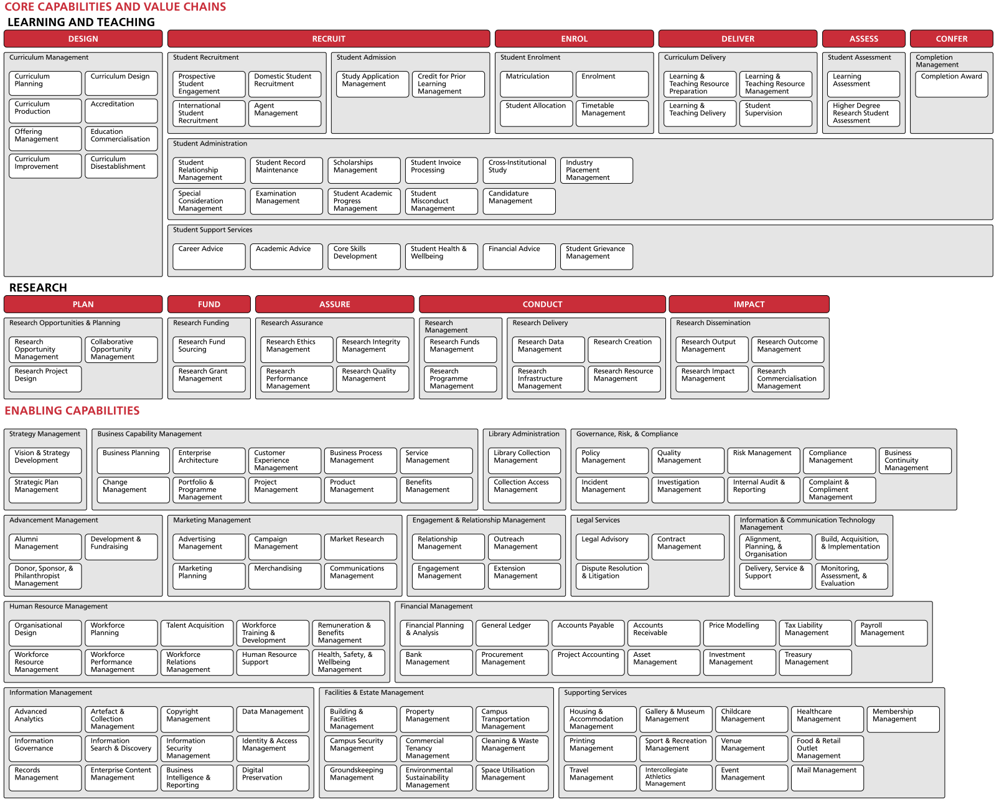

*Source: [CAUDIT Higher Education Reference Models](https://www.ucd.ie/itservices/ea/highereducationreferencemodels/) — used under CC BY-NC-SA 4.0*

### Learning & Teaching

| Capability | Code | Description |
|-----------|------|-------------|
| **Curriculum Management** | `BC001` | Design, develop, and maintain academic programs, courses, and curricula |
| **Curriculum Delivery** | `BC023` | Deliver teaching and learning experiences across modalities |
| **Student Assessment** | `BC028` | Assess, grade, and certify student learning outcomes |

### Research & Innovation

| Capability | Code | Description |
|-----------|------|-------------|
| **Research Opportunities & Planning** | `BC065` | Identify, evaluate, and plan research opportunities and strategy |
| **Research Funding** | `BC071` | Secure, administer, and report on research funding and grants |
| **Research Activity** | `BC074` | Conduct and manage research projects and investigations |
| **Research Dissemination** | `BC086` | Publish, disseminate, and commercialise research outputs |
| **Research Management** | `BC093` | Manage research portfolios, performance, and reporting |
| **Research Assurance** | `BC245` | Ensure research integrity, ethics, and regulatory compliance |

### Student Administration

| Capability | Code | Description |
|-----------|------|-------------|
| **Student Recruitment** | `BC008` | Attract, engage, and recruit prospective students |
| **Student Admission** | `BC014` | Process applications, make admission decisions, and manage offers |
| **Student Enrolment** | `BC019` | Enrol, register, and orient students into programs |
| **Student Management** | `BC044` | Maintain student records, progression, and academic history |
| **Student Support** | `BC052` | Provide wellbeing, academic support, and student services |
| **Completion Management** | `BC032` | Manage graduation, certification, and program completion |

### Corporate Services

| Capability | Code | Description |
|-----------|------|-------------|
| **Financial Management** | `BC184` | Manage budgeting, accounting, procurement, and financial control |
| **Human Resource Management** | `BC171` | Manage workforce planning, recruitment, payroll, and development |
| **Legal Services** | `BC155` | Provide legal counsel, contracts, and compliance advice |
| **Governance Risk & Compliance** | `BC160` | Oversee governance, risk management, audit, and regulatory compliance |
| **Strategy Management** | `BC147` | Develop institutional strategy, planning, and performance monitoring |
| **Business Capability Management** | `BC206` | Manage enterprise architecture and business capability evolution |

### Engagement & Advancement

| Capability | Code | Description |
|-----------|------|-------------|
| **Marketing Management** | `BC107` | Manage brand, communications, and market engagement |
| **Advancement Management** | `BC232` | Manage alumni relations, fundraising, and donor stewardship |
| **Engagement & Relationship Management** | `BC238` | Manage stakeholder engagement, partnerships, and community relations |

### Infrastructure & Operations

| Capability | Code | Description |
|-----------|------|-------------|
| **Facilities & Estate Management** | `BC125` | Manage campus, buildings, space, and physical infrastructure |
| **Supporting Services** | `BC114` | Provide ancillary services (catering, printing, transport, etc.) |

### Information & Library

| Capability | Code | Description |
|-----------|------|-------------|
| **Library Administration** | `BC133` | Manage library collections, access, and information services |
| **Information Management** | `BC135` | Manage information assets, records, and data governance |
| **Publishing Management** | `BC250` | Manage institutional publishing and university press operations |
| **Archive Management** | `BC255` | Preserve and provide access to permanently valuable records |

### Technology

| Capability | Code | Description |
|-----------|------|-------------|
| **ICT Management** | `BC201` | Plan, deliver, and support information and communication technology services |

---

## Table of Contents

- [Student Administration  - BC008, BC014, BC019, BC044, BC052, BC032](#student-administration)
  - [1.1 Student Onboarding (Prospect → Enrollment)](#1.1-student-onboarding-prospect--enrollment)
  - [1.2 Enrollment & Registration](#1.2-enrollment--registration)
- [Student Administration  - BC008, BC014, BC019, BC044, BC052, BC032](#student-administration)
  - [1.3 Academic Records Management](#1.3-academic-records-management)
  - [1.4 Graduation & Certification](#1.4-graduation--certification)
- [Learning & Teaching  - BC001, BC023, BC028](#learning-teaching)
  - [2.1 Curriculum Management](#2.1-curriculum-management)
  - [2.2 Course Delivery & Assessment](#2.2-course-delivery--assessment)
  - [2.3 Timetable & Scheduling](#2.3-timetable--scheduling)
- [HR & Faculty Management  - BC171](#hr-faculty-management)
  - [3.1 Faculty Recruitment](#3.1-faculty-recruitment)
  - [3.2 Payroll & Benefits](#3.2-payroll--benefits)
  - [3.3 Faculty Performance & Development](#3.3-faculty-performance--development)
- [Finance & Resource Management  - BC184](#finance-resource-management)
  - [4.1 Fee Assessment & Billing](#4.1-fee-assessment--billing)
  - [4.2 Financial Aid Management](#4.2-financial-aid-management)
  - [4.3 Procurement & Vendor Management](#4.3-procurement--vendor-management)
- [Research Management  - BC065, BC071, BC074, BC086, BC093, BC245](#research-management)
  - [5.1 Grant Lifecycle Management](#5.1-grant-lifecycle-management)
  - [5.2 Research Outputs & Publishing](#5.2-research-outputs--publishing)
- [Institutional Engagement  - BC107, BC232, BC238](#institutional-engagement)
  - [6.1 Marketing & Student Recruitment](#6.1-marketing--student-recruitment)
  - [6.2 Alumni Relations & Fundraising](#6.2-alumni-relations--fundraising)
- [Library & Learning Support  - BC133, BC135](#library-learning-support)
  - [7.1 Library Resource Management](#7.1-library-resource-management)
- [Enterprise Data & Analytics  - BC201, BC135](#enterprise-data-analytics)
  - [8.1 Data Integration & Warehousing](#8.1-data-integration--warehousing)
  - [8.2 Institutional Reporting & BI](#8.2-institutional-reporting--bi)

## Test Data

The following test data is used consistently across all sequence diagrams:

| Entity | Field | Value |
|--------|-------|-------|
| **Student** | id | STU-2026-001 |
| **Student** | name | John Doe |
| **Student** | email | john.doe@university.edu |
| **Student** | program | B.Sc. Computer Science |
| **Student** | semester | Fall 2026 |
| **Student** | gpa | 3.75 |
| **Prospect** | id | PRO-2026-042 |
| **Prospect** | name | Jane Smith |
| **Prospect** | email | jane.smith@prospect.com |
| **Prospect** | program | M.Sc. Data Science |
| **Prospect** | source | Open Day |
| **Course** | id | CS501 |
| **Course** | title | Artificial Intelligence & ML |
| **Course** | credits | 4 |
| **Course** | instructor | Dr. Sarah Smith |
| **Course** | capacity | 120 |
| **Course** | enrolled | 98 |
| **Faculty** | id | FAC-101 |
| **Faculty** | name | Dr. Sarah Smith |
| **Faculty** | dept | Computer Science |
| **Faculty** | email | sarah.smith@university.edu |
| **Faculty** | hire_date | 2024-08-15 |
| **Faculty** | salary | 95000 |
| **Finance** | fee_amount | 12500.0 |
| **Finance** | scholarship | 2500.0 |
| **Finance** | grant_amount | 5000.0 |
| **Finance** | invoice_no | INV-2026-8901 |
| **Finance** | payment_ref | PAY-7X3K2 |
| **Research** | grant_id | GR-2026-045 |
| **Research** | title | AI-Driven Personalized Learning |
| **Research** | amount | 250000.0 |
| **Research** | sponsor | NSF |
| **Research** | pi | Dr. Sarah Smith |
| **Research** | status | Active |
| **Alumni** | id | ALUM-2019-088 |
| **Alumni** | name | Emily Johnson |
| **Alumni** | grad_year | 2019 |
| **Alumni** | degree | B.Sc. Computer Science |
| **Alumni** | email | emily.j@corp.com |

---

## Table of Contents

- [Student Administration  - BC008, BC014, BC019, BC044, BC052, BC032](#student-administration)
  - [1.1 Student Onboarding (Prospect → Enrollment)](#11-student-onboarding-prospect--enrollment)
  - [1.2 Enrollment & Registration](#12-enrollment--registration)
  - [1.3 Academic Records Management](#13-academic-records-management)
  - [1.4 Graduation & Certification](#14-graduation--certification)
- [Learning & Teaching  - BC001, BC023, BC028](#learning-teaching)
  - [2.1 Curriculum Management](#21-curriculum-management)
  - [2.2 Course Delivery & Assessment](#22-course-delivery--assessment)
  - [2.3 Timetable & Scheduling](#23-timetable--scheduling)
  - [2.4 Academic Advising & Progression Management](#24-academic-advising--progression-management)
- [HR & Faculty Management  - BC171](#hr-faculty-management)
  - [3.1 Faculty Recruitment](#31-faculty-recruitment)
  - [3.2 Payroll & Benefits](#32-payroll--benefits)
  - [3.3 Faculty Performance & Development](#33-faculty-performance--development)
- [Finance & Resource Management  - BC184](#finance-resource-management)
  - [4.1 Fee Assessment & Billing](#41-fee-assessment--billing)
  - [4.2 Financial Aid Management](#42-financial-aid-management)
  - [4.3 Procurement & Vendor Management](#43-procurement--vendor-management)
- [Research Management  - BC065, BC071, BC074, BC086, BC093, BC245](#research-management)
  - [5.1 Grant Lifecycle Management](#51-grant-lifecycle-management)
  - [5.2 Research Outputs & Publishing](#52-research-outputs--publishing)
  - [5.3 Research Compliance & Ethics](#53-research-compliance--ethics)
- [Institutional Engagement  - BC107, BC232, BC238](#institutional-engagement)
  - [6.1 Marketing & Student Recruitment](#61-marketing--student-recruitment)
  - [6.2 Alumni Relations & Fundraising](#62-alumni-relations--fundraising)
  - [6.3 Community & Industry Partnerships](#63-community--industry-partnerships)
- [Library & Learning Support  - BC133, BC135](#library-learning-support)
  - [7.1 Library Resource Management](#71-library-resource-management)
  - [7.2 Digital Content Delivery & Course Reserves](#72-digital-content-delivery--course-reserves)
- [Enterprise Data & Analytics  - BC201, BC135](#enterprise-data-analytics)
  - [8.1 Data Integration & Warehousing](#81-data-integration--warehousing)
  - [8.2 Institutional Reporting & BI](#82-institutional-reporting--bi)
  - [8.3 Data Governance & Quality Management](#83-data-governance--quality-management)
- [Student Services & Wellbeing  - BC052, BC019](#student-services--wellbeing)
  - [9.1 Student Support & Counselling Services](#91-student-support--counselling-services)
  - [9.2 Career Services & Placement](#92-career-services--placement)
- [Facilities & Campus Operations  - BC125, BC114](#facilities--campus-operations)
  - [10.1 Facility Management & Space Allocation](#101-facility-management--space-allocation)
  - [10.2 Security & Access Control](#102-security--access-control)
  - [10.3 Ancillary Services Management](#103-ancillary-services-management)
- [Governance, Risk & Compliance  - BC160, BC155](#governance-risk--compliance)
  - [11.1 Policy Management & Accreditation](#111-policy-management--accreditation)
  - [11.2 Risk Management & Audit](#112-risk-management--audit)

## Test Data

The following test data is used consistently across all sequence diagrams:

| Entity | Field | Value |
|--------|-------|-------|
| **Admission** | admission_id | ADM-2026-042 |
|  | decision | Accepted |
|  | decision_date | 2026-04-01 |
|  | conditions | Submit final transcripts |
|  | application_id | APP-2026-088 |
| **Alumni** | id | ALUM-2019-088 |
|  | name | Emily Johnson |
|  | grad_year | 2019 |
|  | degree | B.Sc. Computer Science |
|  | email | emily.j@corp.com |
| **Application** | application_id | APP-2026-088 |
|  | program | M.Sc. Data Science |
|  | submitted_date | 2026-03-15 |
|  | status | Admitted |
|  | prospect_id | PRO-2026-042 |
| **Assessment** | assessment_id | ASMT-2026-001 |
|  | type | Midterm |
|  | score | 42 |
|  | max_score | 50 |
|  | student_id | STU-2026-001 |
|  | course_id | CS501 |
| **Building** | building_id | BLD-001 |
|  | name | Adams Hall |
|  | location | Main Campus - East Quad |
| **Campaign** | campaign_id | CMP-2026-001 |
|  | name | Fall 2026 Open Day |
|  | type | Recruitment |
|  | target | 12,000 prospects |
|  | status | Active |
| **CareerListing** | listing_id | CL-2026-088 |
|  | company | Google |
|  | role | Software Engineer Intern |
|  | deadline | 2026-09-30 |
|  | status | Open |
| **Compliance** | compliance_id | COMP-2026-001 |
|  | type | IRB Approval |
|  | status | Approved |
|  | approval_date | 2026-04-15 |
|  | dept | Computer Science |
| **Contract** | contract_id | CON-2026-001 |
|  | vendor_id | VEN-2026-001 |
|  | amount | 120000.0 |
|  | start_date | 2026-02-01 |
|  | end_date | 2028-01-31 |
| **Course** | id | CS501 |
|  | title | Artificial Intelligence & ML |
|  | credits | 4 |
|  | instructor | Dr. Sarah Smith |
|  | capacity | 120 |
|  | enrolled | 98 |
| **Dataset** | dataset_id | DS-2026-001 |
|  | name | Student Enrollment Fact |
|  | source | SIS (Ellucian Banner) |
|  | frequency | Daily |
| **Department** | dept_id | DEPT-CS |
|  | name | Computer Science |
|  | budget | 5000000.0 |
| **Donation** | donation_id | DON-2026-042 |
|  | donor_id | ALUM-2019-088 |
|  | amount | 5000.0 |
|  | fund | CS Scholarship |
|  | date | 2026-06-01 |
| **Enrollment** | enrollment_id | ENR-2026-001 |
|  | semester | Fall 2026 |
|  | status | Active |
|  | credits | 15 |
|  | student_id | STU-2026-001 |
| **Facility** | facility_id | FAC-BLD-001 |
|  | name | Adams Hall Building |
|  | type | Academic Building |
|  | location | Main Campus |
| **Faculty** | id | FAC-101 |
|  | name | Dr. Sarah Smith |
|  | dept | Computer Science |
|  | email | sarah.smith@university.edu |
|  | hire_date | 2024-08-15 |
|  | salary | 95000 |
| **Finance** | fee_amount | 12500.0 |
|  | scholarship | 2500.0 |
|  | grant_amount | 5000.0 |
|  | invoice_no | INV-2026-8901 |
|  | payment_ref | PAY-7X3K2 |
| **Grant** | grant_id | GR-2026-045 |
|  | title | AI-Driven Personalized Learning |
|  | amount | 250000.0 |
|  | sponsor | NSF |
|  | pi | Dr. Sarah Smith |
|  | status | Active |
| **Invoice** | invoice_id | INV-2026-8901 |
|  | amount | 12500.0 |
|  | due_date | 2026-08-15 |
|  | status | Paid |
|  | student_id | STU-2026-001 |
| **LibraryResource** | resource_id | LR-2026-001 |
|  | title | Deep Learning - Goodfellow et al |
|  | type | eBook |
|  | status | Available |
|  | copies | 5 |
| **Payment** | payment_id | PAY-7X3K2 |
|  | amount | 12500.0 |
|  | method | Credit Card |
|  | ref | CC-4242 |
|  | invoice_id | INV-2026-8901 |
| **Placement** | placement_id | PL-2026-001 |
|  | student_id | STU-2026-001 |
|  | company | Google |
|  | role | SWE Intern |
|  | status | Confirmed |
| **Policy** | policy_id | POL-2026-001 |
|  | name | Student Data Privacy Policy |
|  | category | Data Governance |
|  | effective_date | 2026-01-01 |
| **Program** | program_id | PG-BSC-CS |
|  | name | B.Sc. Computer Science |
|  | level | Undergraduate |
|  | dept | Computer Science |
| **Prospect** | id | PRO-2026-042 |
|  | name | Jane Smith |
|  | email | jane.smith@prospect.com |
|  | program | M.Sc. Data Science |
|  | source | Open Day |
| **Publication** | publication_id | PUB-2026-001 |
|  | title | Deep Learning in Higher Education |
|  | doi | 10.1234/edu.2026.005 |
|  | journal | Journal of Educational AI |
|  | date | 2026-06-15 |
|  | grant_id | GR-2026-045 |
| **PurchaseOrder** | po_id | PO-2026-301 |
|  | amount | 6000.0 |
|  | date | 2026-05-15 |
|  | status | Delivered |
|  | vendor_id | VEN-2026-001 |
| **Report** | report_id | RPT-2026-001 |
|  | name | Institutional KPI Dashboard |
|  | type | Executive Dashboard |
|  | frequency | Real-time |
| **Research** | grant_id | GR-2026-045 |
|  | title | AI-Driven Personalized Learning |
|  | amount | 250000.0 |
|  | sponsor | NSF |
|  | pi | Dr. Sarah Smith |
|  | status | Active |
| **RiskAssessment** | risk_id | RISK-2026-001 |
|  | area | Data Privacy |
|  | score | Medium |
|  | mitigation | Encryption and access controls implemented |
| **Room** | room_id | RM-HALLB-204 |
|  | building | Adams Hall |
|  | capacity | 60 |
|  | type | Lecture Theatre |
| **Student** | id | STU-2026-001 |
|  | name | John Doe |
|  | email | john.doe@university.edu |
|  | program | B.Sc. Computer Science |
|  | semester | Fall 2026 |
|  | gpa | 3.75 |
| **SupportCase** | case_id | SC-2026-042 |
|  | type | Academic Counselling |
|  | status | Open |
|  | student_id | STU-2026-001 |
|  | priority | Medium |
| **Syllabus** | syllabus_id | SYL-2026-014 |
|  | course_id | CS501 |
|  | learning_outcomes | AI/ML fundamentals, neural networks, ethics |
| **Timetable** | timetable_id | TT-2026-FALL |
|  | semester | Fall 2026 |
|  | status | Published |
| **Vendor** | vendor_id | VEN-2026-001 |
|  | name | LabTech Supplies Inc |
|  | category | Laboratory Equipment |
|  | status | Approved |

---

# Student Administration  - `BC008` `BC014` `BC019` `BC044` `BC052` `BC032`

End-to-end management of the student lifecycle from prospect engagement through graduation.

### 1.1 Student Onboarding (Prospect → Enrollment)

**Description:** A prospective student expresses interest, submits an application, is admitted, accepts the offer, enrolls, and registers for courses.

**Actors:** Prospect/Student, Admissions Officer  
**Systems:** CRM, SIS, LMS, Finance, Housing  

#### Sequence Diagram

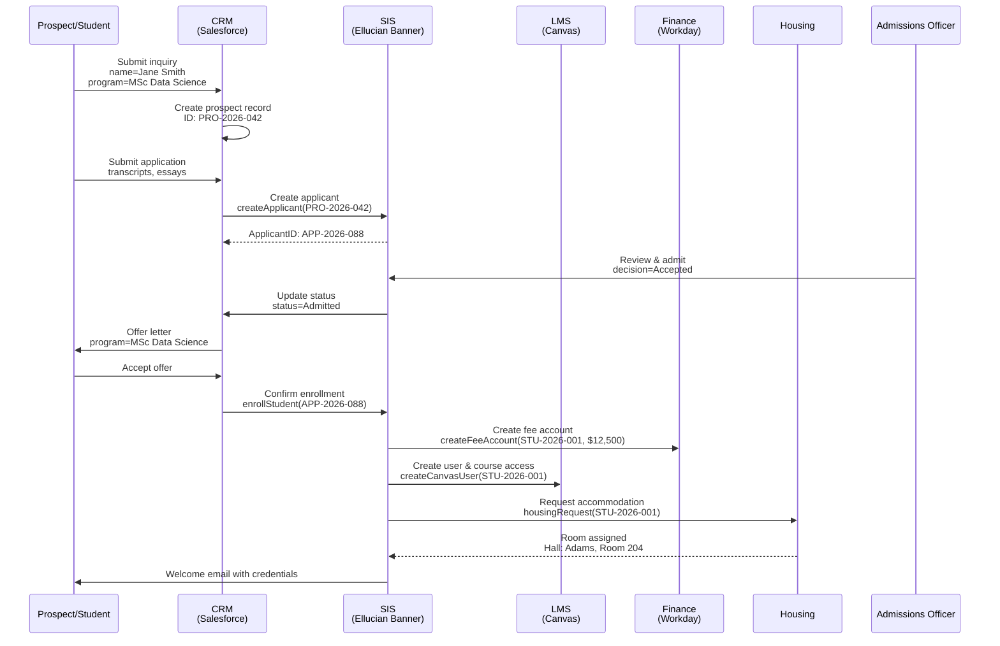
```mermaid
sequenceDiagram
    participant P as Prospect/Student
    participant CRM as CRM<br/>(Salesforce)
    participant SIS as SIS<br/>(Ellucian Banner)
    participant LMS as LMS<br/>(Canvas)
    participant FIN as Finance<br/>(Workday)
    participant HOUS as Housing
    P->>CRM: Submit inquiry<br/>name=Jane Smith<br/>program=MSc Data Science
    CRM->>CRM: Create prospect record<br/>ID: PRO-2026-042
    P->>CRM: Submit application<br/>transcripts, essays
    CRM->>SIS: Create applicant<br/>createApplicant(PRO-2026-042)
    SIS-->>CRM: ApplicantID: APP-2026-088
    Admissions Officer->>SIS: Review & admit<br/>decision=Accepted
    SIS->>CRM: Update status<br/>status=Admitted
    CRM->>P: Offer letter<br/>program=MSc Data Science
    P->>CRM: Accept offer
    CRM->>SIS: Confirm enrollment<br/>enrollStudent(APP-2026-088)
    SIS->>FIN: Create fee account<br/>createFeeAccount(STU-2026-001, $12,500)
    SIS->>LMS: Create user & course access<br/>createCanvasUser(STU-2026-001)
    SIS->>HOUS: Request accommodation<br/>housingRequest(STU-2026-001)
    HOUS-->>SIS: Room assigned<br/>Hall: Adams, Room 204
    SIS->>P: Welcome email with credentials
```

#### Integration Details

| Flow | Entity | Info Flow | Source | Target | Source Conn | Target Conn | Pattern | Complexity |
|------|--------|-----------|--------|--------|-------------|-------------|---------|------------|
| Student Onboarding | Prospect | CreateProspect | CRM (Salesforce Education Cloud) | SIS (Ellucian Banner) | REST API (OAuth2) | REST API (API Key) | API-led (Real-time) | Medium |
| Student Onboarding | Application | SubmitApplication | CRM (Salesforce Education Cloud) | SIS (Ellucian Banner) | REST API (OAuth2) | REST API (API Key) | API-led (Real-time) | Medium |
| Student Onboarding | Student | EnrollStudent | SIS (Ellucian Banner) | LMS (Canvas) | Banner API (Basic Auth) | Canvas API (OAuth2) | Event-driven | Simple |
| Student Onboarding | Fee Account | CreateFeeAccount | SIS (Ellucian Banner) | Finance ERP (Workday Financials) | Banner Workflow (SOAP) | Workday API (WS-Security) | API-led (Real-time) | Medium |
| Student Onboarding | Transcript | SubmitTranscript | CRM (Salesforce Education Cloud) | Credential Evaluation Service | Salesforce REST API (OAuth2) | Credential API (REST) | API-led (Real-time) | Medium |
| Student Onboarding | Visa | InitiateVisaProcess | SIS (Ellucian Banner) | International Office Portal | Banner API (API Key) | Portal REST API | Event-driven | Medium |

#### Acceptance Criteria

| AC ID | Description | Related Info Flow | Expected Outcome | Priority |
|-------|------------|-------------------|------------------|----------|
| AC-1.1-01 | Data integrity: Prospect data transferred from CRM (Salesforce Education Cloud) to SIS (Ellucian Banner) via CreateProspect must be complete and consistent | CreateProspect | Prospect records in SIS (Ellucian Banner) match source; no data loss; reconciliation report confirms accuracy | High |
| AC-1.1-02 | Data integrity: Application data transferred from CRM (Salesforce Education Cloud) to SIS (Ellucian Banner) via SubmitApplication must be complete and consistent | SubmitApplication | Application records in SIS (Ellucian Banner) match source; no data loss; reconciliation report confirms accuracy | High |
| AC-1.1-03 | Data integrity: Student data transferred from SIS (Ellucian Banner) to LMS (Canvas) via EnrollStudent must be complete and consistent | EnrollStudent | Student records in LMS (Canvas) match source; no data loss; reconciliation report confirms accuracy | Medium |
| AC-1.1-04 | Data integrity: Fee Account data transferred from SIS (Ellucian Banner) to Finance ERP (Workday Financials) via CreateFeeAccount must be complete and consistent | CreateFeeAccount | Fee Account records in Finance ERP (Workday Financials) match source; no data loss; reconciliation report confirms accuracy | High |
| AC-1.1-05 | Data integrity: Transcript data transferred from CRM (Salesforce Education Cloud) to Credential Evaluation Service via SubmitTranscript must be complete and consistent | SubmitTranscript | Transcript records in Credential Evaluation Service match source; no data loss; reconciliation report confirms accuracy | High |
| AC-1.1-06 | Data integrity: Visa data transferred from SIS (Ellucian Banner) to International Office Portal via InitiateVisaProcess must be complete and consistent | InitiateVisaProcess | Visa records in International Office Portal match source; no data loss; reconciliation report confirms accuracy | High |
| AC-1.1-07 | Error handling: Failed transactions between CRM (Salesforce Education Cloud) and SIS (Ellucian Banner) are logged with error context and trigger automatic retry or alert | CreateProspect | Errors logged with timestamp, HTTP status, request payload excerpt; retry up to 3 times; alert sent after consecutive failures | Critical |
| AC-1.1-08 | Security: All endpoints enforce authentication (Salesforce REST API (OAuth2), REST API (OAuth2), ...) and encrypt data in transit via TLS 1.2+ | All flows | Unauthenticated requests rejected with 401; tokens validated per call; invalid/expired tokens logged | Critical |

---

---

### 1.2 Enrollment & Registration

**Description:** Existing students register for courses each semester. System validates prerequisites, checks seat availability, processes fees, and confirms enrollment.

**Actors:** Student, Registrar  
**Systems:** Student Portal, SIS, LMS, Finance  

#### Sequence Diagram

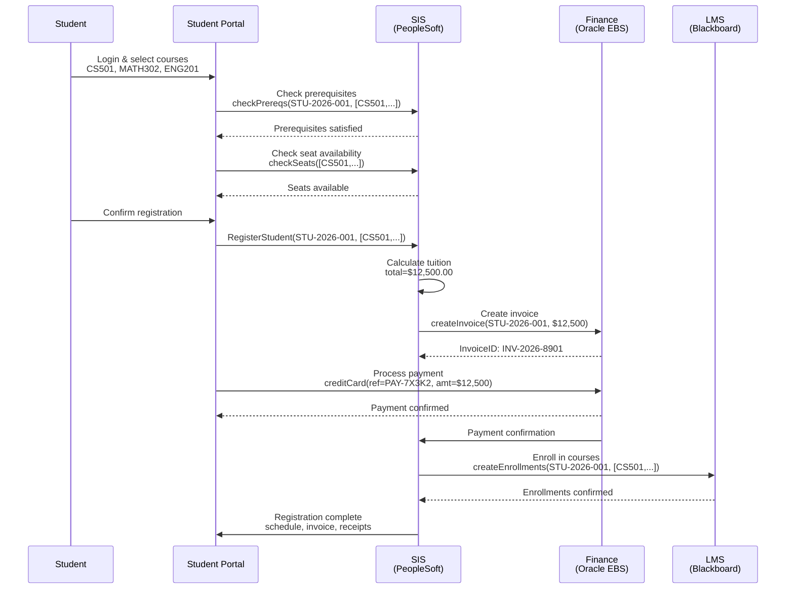
```mermaid
sequenceDiagram
    participant STU as Student
    participant PORT as Student Portal
    participant SIS as SIS<br/>(PeopleSoft)
    participant FIN as Finance<br/>(Oracle EBS)
    participant LMS as LMS<br/>(Blackboard)
    STU->>PORT: Login & select courses<br/>CS501, MATH302, ENG201
    PORT->>SIS: Check prerequisites<br/>checkPrereqs(STU-2026-001, [CS501,...])
    SIS-->>PORT: Prerequisites satisfied
    PORT->>SIS: Check seat availability<br/>checkSeats([CS501,...])
    SIS-->>PORT: Seats available
    STU->>PORT: Confirm registration
    PORT->>SIS: RegisterStudent(STU-2026-001, [CS501,...])
    SIS->>SIS: Calculate tuition<br/>total=$12,500.00
    SIS->>FIN: Create invoice<br/>createInvoice(STU-2026-001, $12,500)
    FIN-->>SIS: InvoiceID: INV-2026-8901
    PORT->>FIN: Process payment<br/>creditCard(ref=PAY-7X3K2, amt=$12,500)
    FIN-->>PORT: Payment confirmed
    FIN->>SIS: Payment confirmation
    SIS->>LMS: Enroll in courses<br/>createEnrollments(STU-2026-001, [CS501,...])
    LMS-->>SIS: Enrollments confirmed
    SIS->>PORT: Registration complete<br/>schedule, invoice, receipts
```

#### Integration Details

| Flow | Entity | Info Flow | Source | Target | Source Conn | Target Conn | Pattern | Complexity |
|------|--------|-----------|--------|--------|-------------|-------------|---------|------------|
| Enrollment & Registration | Course Enrollment | RegisterCourse | Student Portal | SIS (PeopleSoft Campus Solutions) | Portal REST API | PeopleSoft REST API (JWT) | API-led (Real-time) | Simple |
| Enrollment & Registration | Invoice | CreateInvoice | SIS (PeopleSoft Campus Solutions) | Finance ERP (Oracle EBS) | PeopleSoft Integration Broker | Oracle EBS API (SOAP) | API-led (Real-time) | Medium |
| Enrollment & Registration | Payment | ProcessPayment | Payment Gateway (TouchNet) | Finance ERP (Oracle EBS) | Payment Gateway API | Oracle EBS REST API | Event-driven | High |
| Enrollment & Registration | Enrollment | SyncEnrollmentToLMS | SIS (PeopleSoft Campus Solutions) | LMS (Blackboard Learn) | PeopleSoft REST API (JWT) | Blackboard REST API (OAuth2) | Batch (Scheduled) | Simple |
| Enrollment & Registration | Schedule | BuildStudentSchedule | SIS (PeopleSoft Campus Solutions) | Student Portal | PeopleSoft REST API (JWT) | Portal REST API | API-led (Real-time) | Simple |
| Enrollment & Registration | Prerequisite | ValidatePrerequisite | Student Portal | SIS (PeopleSoft Campus Solutions) | Portal REST API | PeopleSoft REST API (JWT) | API-led (Real-time) | Medium |

#### Acceptance Criteria

| AC ID | Description | Related Info Flow | Expected Outcome | Priority |
|-------|------------|-------------------|------------------|----------|
| AC-1.2-01 | Data integrity: Course Enrollment data transferred from Student Portal to SIS (PeopleSoft Campus Solutions) via RegisterCourse must be complete and consistent | RegisterCourse | Course Enrollment records in SIS (PeopleSoft Campus Solutions) match source; no data loss; reconciliation report confirms accuracy | Medium |
| AC-1.2-02 | Data integrity: Invoice data transferred from SIS (PeopleSoft Campus Solutions) to Finance ERP (Oracle EBS) via CreateInvoice must be complete and consistent | CreateInvoice | Invoice records in Finance ERP (Oracle EBS) match source; no data loss; reconciliation report confirms accuracy | High |
| AC-1.2-03 | Data integrity: Payment data transferred from Payment Gateway (TouchNet) to Finance ERP (Oracle EBS) via ProcessPayment must be complete and consistent | ProcessPayment | Payment records in Finance ERP (Oracle EBS) match source; no data loss; reconciliation report confirms accuracy | Critical |
| AC-1.2-04 | Data integrity: Enrollment data transferred from SIS (PeopleSoft Campus Solutions) to LMS (Blackboard Learn) via SyncEnrollmentToLMS must be complete and consistent | SyncEnrollmentToLMS | Enrollment records in LMS (Blackboard Learn) match source; no data loss; reconciliation report confirms accuracy | Medium |
| AC-1.2-05 | Data integrity: Schedule data transferred from SIS (PeopleSoft Campus Solutions) to Student Portal via BuildStudentSchedule must be complete and consistent | BuildStudentSchedule | Schedule records in Student Portal match source; no data loss; reconciliation report confirms accuracy | Medium |
| AC-1.2-06 | Data integrity: Prerequisite data transferred from Student Portal to SIS (PeopleSoft Campus Solutions) via ValidatePrerequisite must be complete and consistent | ValidatePrerequisite | Prerequisite records in SIS (PeopleSoft Campus Solutions) match source; no data loss; reconciliation report confirms accuracy | High |
| AC-1.2-07 | Error handling: Failed transactions between Student Portal and SIS (PeopleSoft Campus Solutions) are logged with error context and trigger automatic retry or alert | RegisterCourse | Errors logged with timestamp, HTTP status, request payload excerpt; retry up to 3 times; alert sent after consecutive failures | Critical |
| AC-1.2-08 | Security: All endpoints enforce authentication (Payment Gateway API, PeopleSoft REST API (JWT), ...) and encrypt data in transit via TLS 1.2+ | All flows | Unauthenticated requests rejected with 401; tokens validated per call; invalid/expired tokens logged | Critical |

---

---

### 1.3 Academic Records Management

**Description:** Faculty submit grades. SIS calculates GPA, updates transcripts, notifies students. Transcript requests fulfilled digitally.

**Actors:** Faculty, Student, Registrar  
**Systems:** LMS, SIS, Student Portal, Data Warehouse  

#### Sequence Diagram

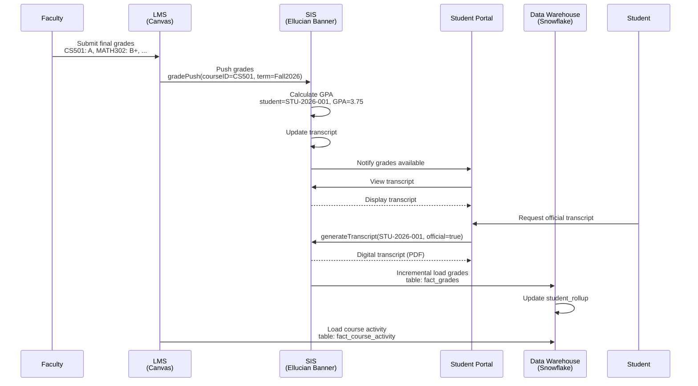
```mermaid
sequenceDiagram
    participant FAC as Faculty
    participant LMS as LMS<br/>(Canvas)
    participant SIS as SIS<br/>(Ellucian Banner)
    participant PORT as Student Portal
    participant DW as Data Warehouse<br/>(Snowflake)
    FAC->>LMS: Submit final grades<br/>CS501: A, MATH302: B+, ...
    LMS->>SIS: Push grades<br/>gradePush(courseID=CS501, term=Fall2026)
    SIS->>SIS: Calculate GPA<br/>student=STU-2026-001, GPA=3.75
    SIS->>SIS: Update transcript
    SIS->>PORT: Notify grades available
    PORT->>SIS: View transcript
    SIS-->>PORT: Display transcript
    Student->>PORT: Request official transcript
    PORT->>SIS: generateTranscript(STU-2026-001, official=true)
    SIS-->>PORT: Digital transcript (PDF)
    SIS->>DW: Incremental load grades<br/>table: fact_grades
    DW->>DW: Update student_rollup
    LMS->>DW: Load course activity<br/>table: fact_course_activity
```

#### Integration Details

| Flow | Entity | Info Flow | Source | Target | Source Conn | Target Conn | Pattern | Complexity |
|------|--------|-----------|--------|--------|-------------|-------------|---------|------------|
| Academic Records | Grade | GradePush | LMS (Canvas) | SIS (Ellucian Banner) | Canvas API (OAuth2) | Banner API (API Key) | Batch (Scheduled) | Simple |
| Academic Records | Transcript | GenerateTranscript | SIS (Ellucian Banner) | Student Portal | Banner REST API | Portal REST API | API-led (Real-time) | Simple |
| Academic Records | Grade | GradeToDW | SIS (Ellucian Banner) | Data Warehouse (Snowflake) | Banner ODBC / CDC | Snowflake JDBC | Batch (ETL) | Medium |
| Academic Records | Enrollment | EnrollmentStatusToDW | SIS (Ellucian Banner) | Data Warehouse (Snowflake) | Banner ODBC | Snowflake JDBC | Batch (ETL) | Simple |
| Academic Records | Notification | NotifyGradeAvailable | SIS (Ellucian Banner) | Notification Service | Banner REST API | SMTP / Push API | Event-driven | Simple |

#### Acceptance Criteria

| AC ID | Description | Related Info Flow | Expected Outcome | Priority |
|-------|------------|-------------------|------------------|----------|
| AC-1.3-01 | Data integrity: Grade data transferred from LMS (Canvas) to SIS (Ellucian Banner) via GradePush must be complete and consistent | GradePush | Grade records in SIS (Ellucian Banner) match source; no data loss; reconciliation report confirms accuracy | Medium |
| AC-1.3-02 | Data integrity: Transcript data transferred from SIS (Ellucian Banner) to Student Portal via GenerateTranscript must be complete and consistent | GenerateTranscript | Transcript records in Student Portal match source; no data loss; reconciliation report confirms accuracy | Medium |
| AC-1.3-03 | Data integrity: Grade data transferred from SIS (Ellucian Banner) to Data Warehouse (Snowflake) via GradeToDW must be complete and consistent | GradeToDW | Grade records in Data Warehouse (Snowflake) match source; no data loss; reconciliation report confirms accuracy | High |
| AC-1.3-04 | Data integrity: Enrollment data transferred from SIS (Ellucian Banner) to Data Warehouse (Snowflake) via EnrollmentStatusToDW must be complete and consistent | EnrollmentStatusToDW | Enrollment records in Data Warehouse (Snowflake) match source; no data loss; reconciliation report confirms accuracy | Medium |
| AC-1.3-05 | Data integrity: Notification data transferred from SIS (Ellucian Banner) to Notification Service via NotifyGradeAvailable must be complete and consistent | NotifyGradeAvailable | Notification records in Notification Service match source; no data loss; reconciliation report confirms accuracy | Medium |
| AC-1.3-06 | Error handling: Failed transactions between LMS (Canvas) and SIS (Ellucian Banner) are logged with error context and trigger automatic retry or alert | GradePush | Errors logged with timestamp, HTTP status, request payload excerpt; retry up to 3 times; alert sent after consecutive failures | Critical |
| AC-1.3-07 | Security: All endpoints enforce authentication (Banner REST API, Banner ODBC / CDC, ...) and encrypt data in transit via TLS 1.2+ | All flows | Unauthenticated requests rejected with 401; tokens validated per call; invalid/expired tokens logged | Critical |

---

---

### 1.4 Graduation & Certification

**Description:** Students apply to graduate. System audits degree requirements, clears financial holds, confers degree, issues digital diploma.

**Actors:** Student, Registrar  
**Systems:** Student Portal, SIS, Finance, Alumni CRM  

#### Sequence Diagram

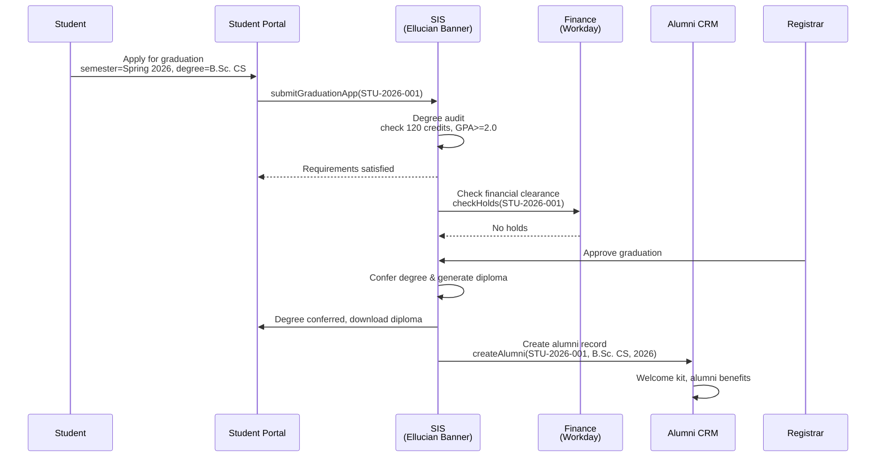
```mermaid
sequenceDiagram
    participant STU as Student
    participant PORT as Student Portal
    participant SIS as SIS<br/>(Ellucian Banner)
    participant FIN as Finance<br/>(Workday)
    participant CRM as Alumni CRM
    STU->>PORT: Apply for graduation<br/>semester=Spring 2026, degree=B.Sc. CS
    PORT->>SIS: submitGraduationApp(STU-2026-001)
    SIS->>SIS: Degree audit<br/>check 120 credits, GPA>=2.0
    SIS-->>PORT: Requirements satisfied
    SIS->>FIN: Check financial clearance<br/>checkHolds(STU-2026-001)
    FIN-->>SIS: No holds
    Registrar->>SIS: Approve graduation
    SIS->>SIS: Confer degree & generate diploma
    SIS->>PORT: Degree conferred, download diploma
    SIS->>CRM: Create alumni record<br/>createAlumni(STU-2026-001, B.Sc. CS, 2026)
    CRM->>CRM: Welcome kit, alumni benefits
```

#### Integration Details

| Flow | Entity | Info Flow | Source | Target | Source Conn | Target Conn | Pattern | Complexity |
|------|--------|-----------|--------|--------|-------------|-------------|---------|------------|
| Graduation & Certification | Graduation Application | SubmitGradApp | Student Portal | SIS (Ellucian Banner) | Portal REST API | Banner REST API (API Key) | API-led (Real-time) | Simple |
| Graduation & Certification | Financial Clearance | CheckFinancialHolds | SIS (Ellucian Banner) | Finance ERP (Workday Financials) | Banner Workflow (SOAP) | Workday API (WS-Security) | API-led (Real-time) | Medium |
| Graduation & Certification | Alumni Record | CreateAlumniRecord | SIS (Ellucian Banner) | Alumni CRM (Blackbaud) | Banner REST API | Blackbaud API (OAuth2) | Event-driven | Simple |
| Graduation & Certification | Degree | GenerateDiploma | SIS (Ellucian Banner) | Diploma Printing Service | Banner REST API | Print Service API (SFTP) | Batch (Scheduled) | Medium |
| Graduation & Certification | Survey | SendGraduateSurvey | SIS (Ellucian Banner) | Alumni CRM (Blackbaud) | Banner REST API | Blackbaud API (OAuth2) | Event-driven | Simple |

#### Acceptance Criteria

| AC ID | Description | Related Info Flow | Expected Outcome | Priority |
|-------|------------|-------------------|------------------|----------|
| AC-1.4-01 | Data integrity: Graduation Application data transferred from Student Portal to SIS (Ellucian Banner) via SubmitGradApp must be complete and consistent | SubmitGradApp | Graduation Application records in SIS (Ellucian Banner) match source; no data loss; reconciliation report confirms accuracy | Medium |
| AC-1.4-02 | Data integrity: Financial Clearance data transferred from SIS (Ellucian Banner) to Finance ERP (Workday Financials) via CheckFinancialHolds must be complete and consistent | CheckFinancialHolds | Financial Clearance records in Finance ERP (Workday Financials) match source; no data loss; reconciliation report confirms accuracy | High |
| AC-1.4-03 | Data integrity: Alumni Record data transferred from SIS (Ellucian Banner) to Alumni CRM (Blackbaud) via CreateAlumniRecord must be complete and consistent | CreateAlumniRecord | Alumni Record records in Alumni CRM (Blackbaud) match source; no data loss; reconciliation report confirms accuracy | Medium |
| AC-1.4-04 | Data integrity: Degree data transferred from SIS (Ellucian Banner) to Diploma Printing Service via GenerateDiploma must be complete and consistent | GenerateDiploma | Degree records in Diploma Printing Service match source; no data loss; reconciliation report confirms accuracy | High |
| AC-1.4-05 | Data integrity: Survey data transferred from SIS (Ellucian Banner) to Alumni CRM (Blackbaud) via SendGraduateSurvey must be complete and consistent | SendGraduateSurvey | Survey records in Alumni CRM (Blackbaud) match source; no data loss; reconciliation report confirms accuracy | Medium |
| AC-1.4-06 | Error handling: Failed transactions between Student Portal and SIS (Ellucian Banner) are logged with error context and trigger automatic retry or alert | SubmitGradApp | Errors logged with timestamp, HTTP status, request payload excerpt; retry up to 3 times; alert sent after consecutive failures | Critical |
| AC-1.4-07 | Security: All endpoints enforce authentication (Banner REST API, Banner Workflow (SOAP), ...) and encrypt data in transit via TLS 1.2+ | All flows | Unauthenticated requests rejected with 401; tokens validated per call; invalid/expired tokens logged | Critical |

# Learning & Teaching  - `BC001` `BC023` `BC028`

Design, develop, deliver, and assess academic programs and courses. Spans curriculum planning, timetable scheduling, delivery, and assessment.

### 2.1 Curriculum Management

**Description:** Academic committees design new programs/courses. Approved curricula published to SIS catalog and LMS.

**Actors:** Curriculum Committee, Dean, Registrar  
**Systems:** Curriculum Mgmt System, SIS, Student Portal, LMS  

#### Sequence Diagram

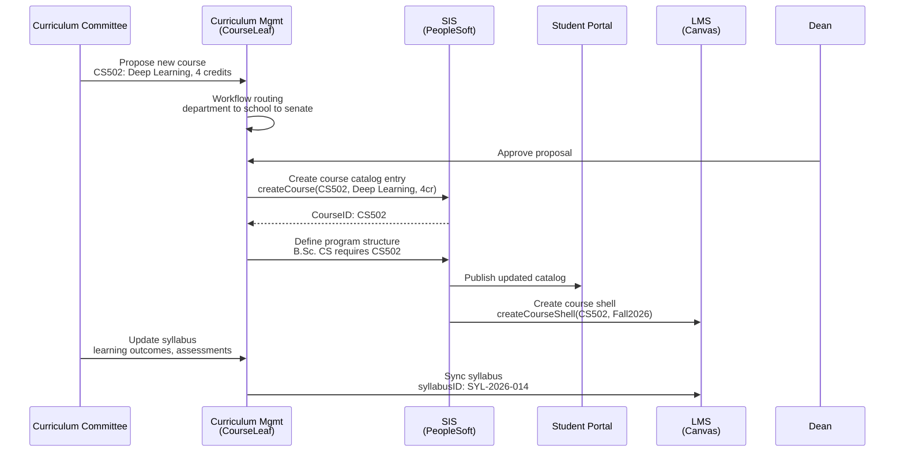
```mermaid
sequenceDiagram
    participant CC as Curriculum Committee
    participant CMS as Curriculum Mgmt<br/>(CourseLeaf)
    participant SIS as SIS<br/>(PeopleSoft)
    participant PORT as Student Portal
    participant LMS as LMS<br/>(Canvas)
    CC->>CMS: Propose new course<br/>CS502: Deep Learning, 4 credits
    CMS->>CMS: Workflow routing<br/>department to school to senate
    Dean->>CMS: Approve proposal
    CMS->>SIS: Create course catalog entry<br/>createCourse(CS502, Deep Learning, 4cr)
    SIS-->>CMS: CourseID: CS502
    CMS->>SIS: Define program structure<br/>B.Sc. CS requires CS502
    SIS->>PORT: Publish updated catalog
    SIS->>LMS: Create course shell<br/>createCourseShell(CS502, Fall2026)
    CC->>CMS: Update syllabus<br/>learning outcomes, assessments
    CMS->>LMS: Sync syllabus<br/>syllabusID: SYL-2026-014
```

#### Integration Details

| Flow | Entity | Info Flow | Source | Target | Source Conn | Target Conn | Pattern | Complexity |
|------|--------|-----------|--------|--------|-------------|-------------|---------|------------|
| Curriculum Management | Course | CreateCourse | Curriculum Mgmt (CourseLeaf) | SIS (PeopleSoft Campus Solutions) | CourseLeaf CIM API | PeopleSoft REST API (JWT) | API-led (Real-time) | Medium |
| Curriculum Management | Course Shell | CreateCourseShell | SIS (PeopleSoft Campus Solutions) | LMS (Canvas) | PeopleSoft REST API (JWT) | Canvas API (OAuth2) | Event-driven | Simple |
| Curriculum Management | Syllabus | SyncSyllabus | Curriculum Mgmt (CourseLeaf) | LMS (Canvas) | CourseLeaf REST API | Canvas API (OAuth2) | Batch (Scheduled) | Simple |
| Curriculum Management | Program | DefineProgramStructure | Curriculum Mgmt (CourseLeaf) | SIS (PeopleSoft Campus Solutions) | CourseLeaf CIM API | PeopleSoft REST API (JWT) | API-led (Real-time) | Medium |
| Curriculum Management | Catalog | PublishCatalog | SIS (PeopleSoft Campus Solutions) | Student Portal | PeopleSoft REST API (JWT) | Portal REST API | Batch (Scheduled) | Simple |

#### Acceptance Criteria

| AC ID | Description | Related Info Flow | Expected Outcome | Priority |
|-------|------------|-------------------|------------------|----------|
| AC-2.1-01 | Data integrity: Course data transferred from Curriculum Mgmt (CourseLeaf) to SIS (PeopleSoft Campus Solutions) via CreateCourse must be complete and consistent | CreateCourse | Course records in SIS (PeopleSoft Campus Solutions) match source; no data loss; reconciliation report confirms accuracy | High |
| AC-2.1-02 | Data integrity: Course Shell data transferred from SIS (PeopleSoft Campus Solutions) to LMS (Canvas) via CreateCourseShell must be complete and consistent | CreateCourseShell | Course Shell records in LMS (Canvas) match source; no data loss; reconciliation report confirms accuracy | Medium |
| AC-2.1-03 | Data integrity: Syllabus data transferred from Curriculum Mgmt (CourseLeaf) to LMS (Canvas) via SyncSyllabus must be complete and consistent | SyncSyllabus | Syllabus records in LMS (Canvas) match source; no data loss; reconciliation report confirms accuracy | Medium |
| AC-2.1-04 | Data integrity: Program data transferred from Curriculum Mgmt (CourseLeaf) to SIS (PeopleSoft Campus Solutions) via DefineProgramStructure must be complete and consistent | DefineProgramStructure | Program records in SIS (PeopleSoft Campus Solutions) match source; no data loss; reconciliation report confirms accuracy | High |
| AC-2.1-05 | Data integrity: Catalog data transferred from SIS (PeopleSoft Campus Solutions) to Student Portal via PublishCatalog must be complete and consistent | PublishCatalog | Catalog records in Student Portal match source; no data loss; reconciliation report confirms accuracy | Medium |
| AC-2.1-06 | Error handling: Failed transactions between Curriculum Mgmt (CourseLeaf) and SIS (PeopleSoft Campus Solutions) are logged with error context and trigger automatic retry or alert | CreateCourse | Errors logged with timestamp, HTTP status, request payload excerpt; retry up to 3 times; alert sent after consecutive failures | Critical |
| AC-2.1-07 | Security: All endpoints enforce authentication (PeopleSoft REST API (JWT), CourseLeaf REST API, ...) and encrypt data in transit via TLS 1.2+ | All flows | Unauthenticated requests rejected with 401; tokens validated per call; invalid/expired tokens logged | Critical |

---

---

### 2.2 Course Delivery & Assessment

**Description:** Courses delivered via LMS. Students submit assignments, take quizzes. Faculty grade and final grades push to SIS.

**Actors:** Student, Faculty  
**Systems:** LMS, Assessment Tool, SIS  

#### Sequence Diagram

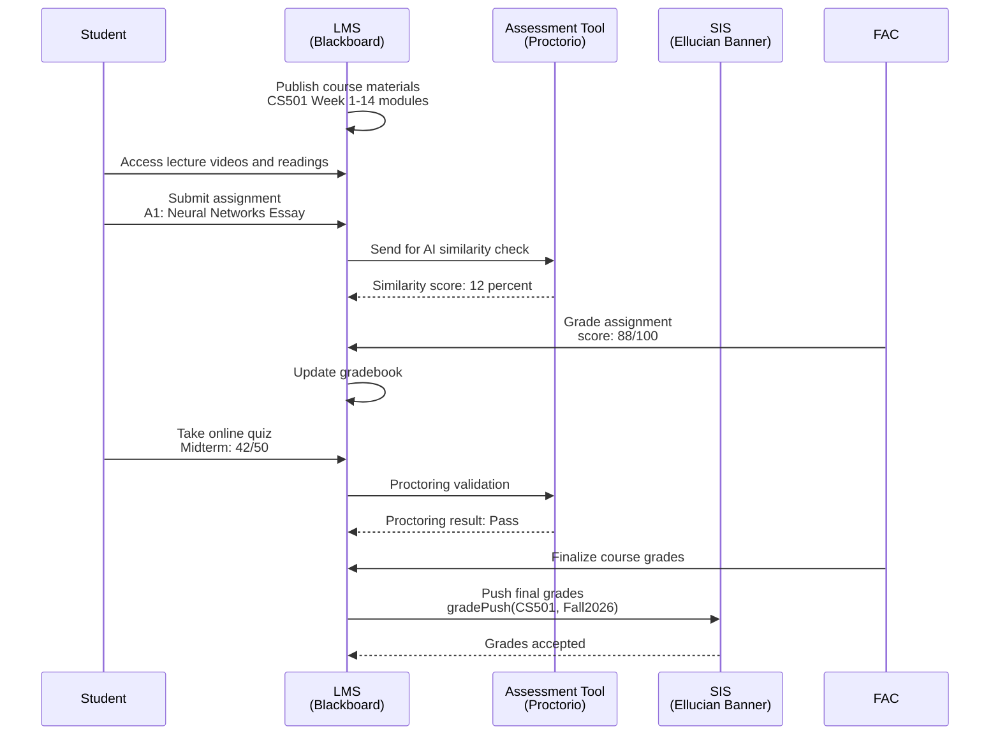
```mermaid
sequenceDiagram
    participant STU as Student
    participant LMS as LMS<br/>(Blackboard)
    participant ASSESS as Assessment Tool<br/>(Proctorio)
    participant SIS as SIS<br/>(Ellucian Banner)
    LMS->>LMS: Publish course materials<br/>CS501 Week 1-14 modules
    STU->>LMS: Access lecture videos and readings
    STU->>LMS: Submit assignment<br/>A1: Neural Networks Essay
    LMS->>ASSESS: Send for AI similarity check
    ASSESS-->>LMS: Similarity score: 12 percent
    FAC->>LMS: Grade assignment<br/>score: 88/100
    LMS->>LMS: Update gradebook
    STU->>LMS: Take online quiz<br/>Midterm: 42/50
    LMS->>ASSESS: Proctoring validation
    ASSESS-->>LMS: Proctoring result: Pass
    FAC->>LMS: Finalize course grades
    LMS->>SIS: Push final grades<br/>gradePush(CS501, Fall2026)
    SIS-->>LMS: Grades accepted
```

#### Integration Details

| Flow | Entity | Info Flow | Source | Target | Source Conn | Target Conn | Pattern | Complexity |
|------|--------|-----------|--------|--------|-------------|-------------|---------|------------|
| Course Delivery & Assessment | Assignment Submission | SubmitAssignment | LMS (Blackboard Learn) | Assessment Tool (Proctorio) | Blackboard REST API (OAuth2) | Proctorio API (API Key) | API-led (Real-time) | Medium |
| Course Delivery & Assessment | Final Grade | GradePushToSIS | LMS (Blackboard Learn) | SIS (Ellucian Banner) | Blackboard REST API (OAuth2) | Banner API (API Key) | Batch (Scheduled) | Simple |
| Course Delivery & Assessment | Content | PublishCourseContent | LMS (Blackboard Learn) | LMS (Blackboard Learn) | Internal | Internal | API-led (Real-time) | Simple |
| Course Delivery & Assessment | Gradebook | SyncGradebook | LMS (Blackboard Learn) | Assessment Tool (Proctorio) | Blackboard REST API (OAuth2) | Proctorio API (API Key) | Event-driven | Simple |

#### Acceptance Criteria

| AC ID | Description | Related Info Flow | Expected Outcome | Priority |
|-------|------------|-------------------|------------------|----------|
| AC-2.2-01 | Data integrity: Assignment Submission data transferred from LMS (Blackboard Learn) to Assessment Tool (Proctorio) via SubmitAssignment must be complete and consistent | SubmitAssignment | Assignment Submission records in Assessment Tool (Proctorio) match source; no data loss; reconciliation report confirms accuracy | High |
| AC-2.2-02 | Data integrity: Final Grade data transferred from LMS (Blackboard Learn) to SIS (Ellucian Banner) via GradePushToSIS must be complete and consistent | GradePushToSIS | Final Grade records in SIS (Ellucian Banner) match source; no data loss; reconciliation report confirms accuracy | Medium |
| AC-2.2-03 | Data integrity: Content data transferred from LMS (Blackboard Learn) to LMS (Blackboard Learn) via PublishCourseContent must be complete and consistent | PublishCourseContent | Content records in LMS (Blackboard Learn) match source; no data loss; reconciliation report confirms accuracy | Medium |
| AC-2.2-04 | Data integrity: Gradebook data transferred from LMS (Blackboard Learn) to Assessment Tool (Proctorio) via SyncGradebook must be complete and consistent | SyncGradebook | Gradebook records in Assessment Tool (Proctorio) match source; no data loss; reconciliation report confirms accuracy | Medium |
| AC-2.2-05 | Error handling: Failed transactions between LMS (Blackboard Learn) and Assessment Tool (Proctorio) are logged with error context and trigger automatic retry or alert | SubmitAssignment | Errors logged with timestamp, HTTP status, request payload excerpt; retry up to 3 times; alert sent after consecutive failures | Critical |
| AC-2.2-06 | Security: All endpoints enforce authentication (Blackboard REST API (OAuth2), Internal, ...) and encrypt data in transit via TLS 1.2+ | All flows | Unauthenticated requests rejected with 401; tokens validated per call; invalid/expired tokens logged | Critical |

---

---

### 2.3 Timetable & Scheduling

**Description:** Schedulers create master timetable, assign rooms, check conflicts, publish schedules.

**Actors:** Scheduler, Faculty, Student  
**Systems:** Scheduling Engine, SIS, Room Booking, Portal  

#### Sequence Diagram

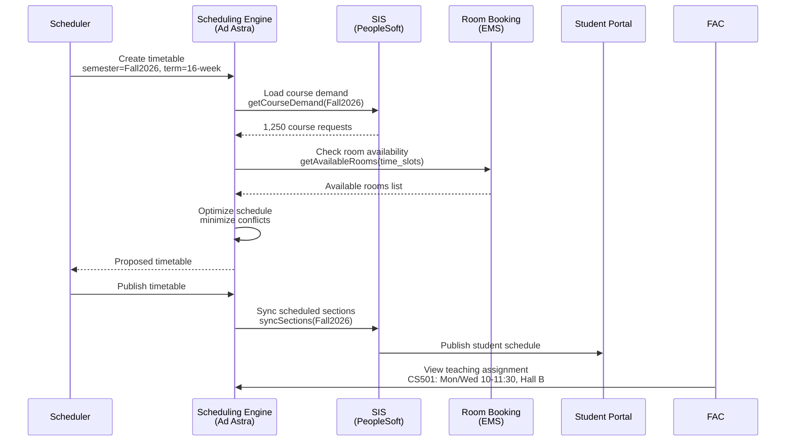
```mermaid
sequenceDiagram
    participant SCH as Scheduler
    participant ENG as Scheduling Engine<br/>(Ad Astra)
    participant SIS as SIS<br/>(PeopleSoft)
    participant ROOM as Room Booking<br/>(EMS)
    participant PORT as Student Portal
    SCH->>ENG: Create timetable<br/>semester=Fall2026, term=16-week
    ENG->>SIS: Load course demand<br/>getCourseDemand(Fall2026)
    SIS-->>ENG: 1,250 course requests
    ENG->>ROOM: Check room availability<br/>getAvailableRooms(time_slots)
    ROOM-->>ENG: Available rooms list
    ENG->>ENG: Optimize schedule<br/>minimize conflicts
    ENG-->>SCH: Proposed timetable
    SCH->>ENG: Publish timetable
    ENG->>SIS: Sync scheduled sections<br/>syncSections(Fall2026)
    SIS->>PORT: Publish student schedule
    FAC->>ENG: View teaching assignment<br/>CS501: Mon/Wed 10-11:30, Hall B
```

#### Integration Details

| Flow | Entity | Info Flow | Source | Target | Source Conn | Target Conn | Pattern | Complexity |
|------|--------|-----------|--------|--------|-------------|-------------|---------|------------|
| Timetable & Scheduling | Course Demand | LoadCourseDemand | SIS (PeopleSoft Campus Solutions) | Scheduling Engine (Ad Astra) | PeopleSoft REST API (JWT) | Ad Astra API (API Key) | Batch (Scheduled) | Simple |
| Timetable & Scheduling | Room Availability | CheckRoomAvailability | Scheduling Engine (Ad Astra) | Room Booking (EMS) | Ad Astra REST API | EMS Web API (Basic Auth) | API-led (Real-time) | Medium |
| Timetable & Scheduling | Scheduled Section | SyncSections | Scheduling Engine (Ad Astra) | SIS (PeopleSoft Campus Solutions) | Ad Astra REST API | PeopleSoft REST API (JWT) | Batch (Scheduled) | Simple |
| Timetable & Scheduling | Conflict | DetectScheduleConflict | Scheduling Engine (Ad Astra) | Scheduling Engine (Ad Astra) | Internal | Internal | Batch (Scheduled) | Medium |
| Timetable & Scheduling | Faculty Assignment | AssignFaculty | Scheduling Engine (Ad Astra) | SIS (PeopleSoft Campus Solutions) | Ad Astra REST API | PeopleSoft REST API (JWT) | API-led (Real-time) | Simple |

#### Acceptance Criteria

| AC ID | Description | Related Info Flow | Expected Outcome | Priority |
|-------|------------|-------------------|------------------|----------|
| AC-2.3-01 | Data integrity: Course Demand data transferred from SIS (PeopleSoft Campus Solutions) to Scheduling Engine (Ad Astra) via LoadCourseDemand must be complete and consistent | LoadCourseDemand | Course Demand records in Scheduling Engine (Ad Astra) match source; no data loss; reconciliation report confirms accuracy | Medium |
| AC-2.3-02 | Data integrity: Room Availability data transferred from Scheduling Engine (Ad Astra) to Room Booking (EMS) via CheckRoomAvailability must be complete and consistent | CheckRoomAvailability | Room Availability records in Room Booking (EMS) match source; no data loss; reconciliation report confirms accuracy | High |
| AC-2.3-03 | Data integrity: Scheduled Section data transferred from Scheduling Engine (Ad Astra) to SIS (PeopleSoft Campus Solutions) via SyncSections must be complete and consistent | SyncSections | Scheduled Section records in SIS (PeopleSoft Campus Solutions) match source; no data loss; reconciliation report confirms accuracy | Medium |
| AC-2.3-04 | Data integrity: Conflict data transferred from Scheduling Engine (Ad Astra) to Scheduling Engine (Ad Astra) via DetectScheduleConflict must be complete and consistent | DetectScheduleConflict | Conflict records in Scheduling Engine (Ad Astra) match source; no data loss; reconciliation report confirms accuracy | High |
| AC-2.3-05 | Data integrity: Faculty Assignment data transferred from Scheduling Engine (Ad Astra) to SIS (PeopleSoft Campus Solutions) via AssignFaculty must be complete and consistent | AssignFaculty | Faculty Assignment records in SIS (PeopleSoft Campus Solutions) match source; no data loss; reconciliation report confirms accuracy | Medium |
| AC-2.3-06 | Error handling: Failed transactions between SIS (PeopleSoft Campus Solutions) and Scheduling Engine (Ad Astra) are logged with error context and trigger automatic retry or alert | LoadCourseDemand | Errors logged with timestamp, HTTP status, request payload excerpt; retry up to 3 times; alert sent after consecutive failures | Critical |
| AC-2.3-07 | Security: All endpoints enforce authentication (PeopleSoft REST API (JWT), Ad Astra REST API, ...) and encrypt data in transit via TLS 1.2+ | All flows | Unauthenticated requests rejected with 401; tokens validated per call; invalid/expired tokens logged | Critical |

---

---

### 2.4 Academic Advising & Progression Management

**Description:** Academic advisors monitor student progress, review grades and course completion, intervene for at-risk students, and plan degree pathways.

**Actors:** Student, Academic Advisor, Registrar  
**Systems:** SIS (Ellucian Banner), CRM (Salesforce Education Cloud), Early Alert System (Starfish), LMS (Canvas), Degree Audit Tool

#### Sequence Diagram

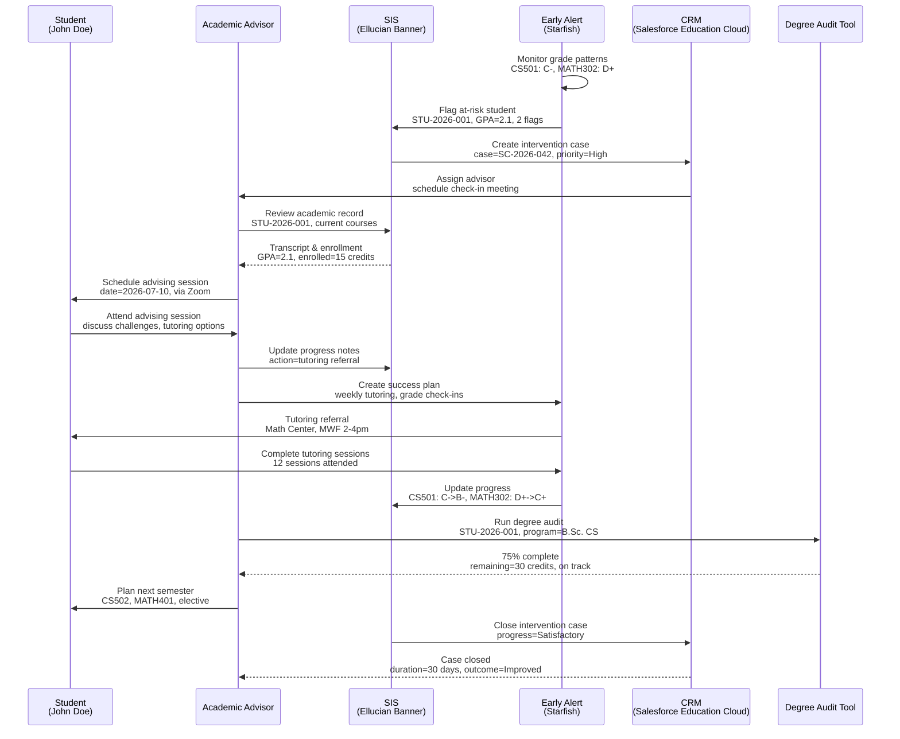
```mermaid
sequenceDiagram
    participant STU as Student<br/>(John Doe)
    participant ADV as Academic Advisor
    participant SIS as SIS<br/>(Ellucian Banner)
    participant EA as Early Alert<br/>(Starfish)
    participant CRM as CRM<br/>(Salesforce Education Cloud)
    participant DEG as Degree Audit Tool
    EA->>EA: Monitor grade patterns<br/>CS501: C-, MATH302: D+
    EA->>SIS: Flag at-risk student<br/>STU-2026-001, GPA=2.1, 2 flags
    SIS->>CRM: Create intervention case<br/>case=SC-2026-042, priority=High
    CRM->>ADV: Assign advisor<br/>schedule check-in meeting
    ADV->>SIS: Review academic record<br/>STU-2026-001, current courses
    SIS-->>ADV: Transcript & enrollment<br/>GPA=2.1, enrolled=15 credits
    ADV->>STU: Schedule advising session<br/>date=2026-07-10, via Zoom
    STU->>ADV: Attend advising session<br/>discuss challenges, tutoring options
    ADV->>SIS: Update progress notes<br/>action=tutoring referral
    ADV->>EA: Create success plan<br/>weekly tutoring, grade check-ins
    EA->>STU: Tutoring referral<br/>Math Center, MWF 2-4pm
    STU->>EA: Complete tutoring sessions<br/>12 sessions attended
    EA->>SIS: Update progress<br/>CS501: C->B-, MATH302: D+->C+
    ADV->>DEG: Run degree audit<br/>STU-2026-001, program=B.Sc. CS
    DEG-->>ADV: 75% complete<br/>remaining=30 credits, on track
    ADV->>STU: Plan next semester<br/>CS502, MATH401, elective
    SIS->>CRM: Close intervention case<br/>progress=Satisfactory
    CRM-->>ADV: Case closed<br/>duration=30 days, outcome=Improved
```

#### Integration Details

| Flow | Entity | Info Flow | Source | Target | Source Conn | Target Conn | Pattern | Complexity |
|------|--------|-----------|--------|--------|-------------|-------------|---------|------------|
| Academic Advising | Flag | FlagAtRiskStudent | Early Alert (Starfish) | SIS (Ellucian Banner) | Starfish API (API Key) | Banner API (API Key) | Event-driven | Medium |
| Academic Advising | Case | CreateInterventionCase | SIS (Ellucian Banner) | CRM (Salesforce Education Cloud) | Banner API (API Key) | Salesforce REST API (OAuth2) | Event-driven | Medium |
| Academic Advising | Advising | ScheduleAdvisingSession | CRM (Salesforce Education Cloud) | CRM (Salesforce Education Cloud) | Internal | Internal | API-led (Real-time) | Simple |
| Academic Advising | Success Plan | CreateSuccessPlan | Early Alert (Starfish) | Early Alert (Starfish) | Internal | Internal | API-led (Real-time) | Simple |
| Academic Advising | Degree Audit | RunDegreeAudit | Degree Audit Tool | SIS (Ellucian Banner) | Degree Audit API | Banner API (API Key) | API-led (Real-time) | Medium |
| Academic Advising | Progress | UpdateAcademicProgress | SIS (Ellucian Banner) | CRM (Salesforce Education Cloud) | Banner API (API Key) | Salesforce REST API (OAuth2) | Event-driven | Simple |

#### Acceptance Criteria

| AC ID | Description | Related Info Flow | Expected Outcome | Priority |
|-------|------------|-------------------|------------------|----------|
| AC-2.4-01 | Data integrity: Flag data transferred from Early Alert (Starfish) to SIS (Ellucian Banner) via FlagAtRiskStudent must be complete and consistent | FlagAtRiskStudent | Flag records in SIS (Ellucian Banner) match source; no data loss; reconciliation report confirms accuracy | High |
| AC-2.4-02 | Data integrity: Case data transferred from SIS (Ellucian Banner) to CRM (Salesforce Education Cloud) via CreateInterventionCase must be complete and consistent | CreateInterventionCase | Case records in CRM (Salesforce Education Cloud) match source; no data loss; reconciliation report confirms accuracy | High |
| AC-2.4-03 | Data integrity: Advising data transferred from CRM (Salesforce Education Cloud) to CRM (Salesforce Education Cloud) via ScheduleAdvisingSession must be complete and consistent | ScheduleAdvisingSession | Advising records in CRM (Salesforce Education Cloud) match source; no data loss; reconciliation report confirms accuracy | Medium |
| AC-2.4-04 | Data integrity: Success Plan data transferred from Early Alert (Starfish) to Early Alert (Starfish) via CreateSuccessPlan must be complete and consistent | CreateSuccessPlan | Success Plan records in Early Alert (Starfish) match source; no data loss; reconciliation report confirms accuracy | Medium |
| AC-2.4-05 | Data integrity: Degree Audit data transferred from Degree Audit Tool to SIS (Ellucian Banner) via RunDegreeAudit must be complete and consistent | RunDegreeAudit | Degree Audit records in SIS (Ellucian Banner) match source; no data loss; reconciliation report confirms accuracy | High |
| AC-2.4-06 | Data integrity: Progress data transferred from SIS (Ellucian Banner) to CRM (Salesforce Education Cloud) via UpdateAcademicProgress must be complete and consistent | UpdateAcademicProgress | Progress records in CRM (Salesforce Education Cloud) match source; no data loss; reconciliation report confirms accuracy | Medium |
| AC-2.4-07 | Error handling: Failed transactions between Early Alert (Starfish) and SIS (Ellucian Banner) are logged with error context and trigger automatic retry or alert | FlagAtRiskStudent | Errors logged with timestamp, HTTP status, request payload excerpt; retry up to 3 times; alert sent after consecutive failures | Critical |
| AC-2.4-08 | Security: All endpoints enforce authentication (Degree Audit API, Banner API (API Key), ...) and encrypt data in transit via TLS 1.2+ | All flows | Unauthenticated requests rejected with 401; tokens validated per call; invalid/expired tokens logged | Critical |

# HR & Faculty Management  - `BC171`

Full lifecycle of faculty and staff: recruitment, onboarding, payroll, performance management, professional development.

### 3.1 Faculty Recruitment

**Description:** Departments request new positions. HR posts job, screens applicants, coordinates interviews, manages offer/acceptance.

**Actors:** Hiring Manager, HR, Candidate  
**Systems:** HRIS, ATS, Finance, SIS  

#### Sequence Diagram

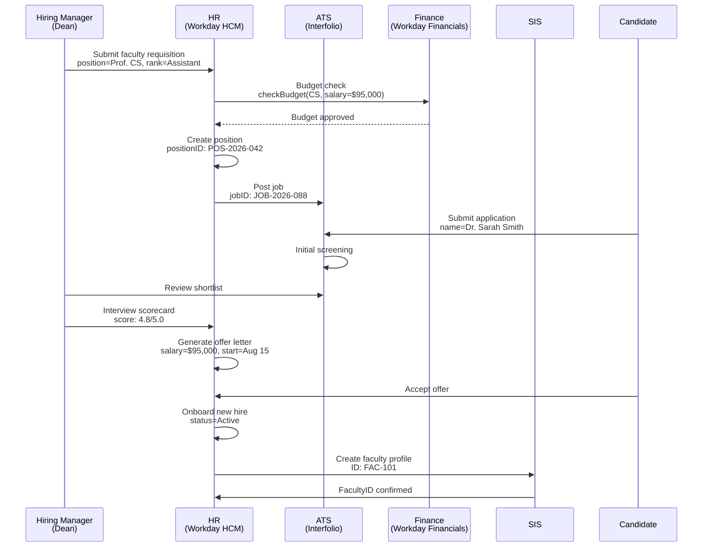
```mermaid
sequenceDiagram
    participant HM as Hiring Manager<br/>(Dean)
    participant HR as HR<br/>(Workday HCM)
    participant ATS as ATS<br/>(Interfolio)
    participant FIN as Finance<br/>(Workday Financials)
    participant SIS as SIS
    HM->>HR: Submit faculty requisition<br/>position=Prof. CS, rank=Assistant
    HR->>FIN: Budget check<br/>checkBudget(CS, salary=$95,000)
    FIN-->>HR: Budget approved
    HR->>HR: Create position<br/>positionID: POS-2026-042
    HR->>ATS: Post job<br/>jobID: JOB-2026-088
    Candidate->>ATS: Submit application<br/>name=Dr. Sarah Smith
    ATS->>ATS: Initial screening
    HM->>ATS: Review shortlist
    HM->>HR: Interview scorecard<br/>score: 4.8/5.0
    HR->>HR: Generate offer letter<br/>salary=$95,000, start=Aug 15
    Candidate->>HR: Accept offer
    HR->>HR: Onboard new hire<br/>status=Active
    HR->>SIS: Create faculty profile<br/>ID: FAC-101
    SIS->>HR: FacultyID confirmed
```

#### Integration Details

| Flow | Entity | Info Flow | Source | Target | Source Conn | Target Conn | Pattern | Complexity |
|------|--------|-----------|--------|--------|-------------|-------------|---------|------------|
| Faculty Recruitment | Position Requisition | SubmitRequisition | HRIS (Workday HCM) | Finance ERP (Workday Financials) | Workday API (WS-Security) | Workday API (WS-Security) | API-led (Real-time) | Simple |
| Faculty Recruitment | Job Posting | PostJob | HRIS (Workday HCM) | ATS (Interfolio) | Workday Recruiting API | Interfolio API (OAuth2) | API-led (Real-time) | Medium |
| Faculty Recruitment | Faculty Profile | CreateFacultyProfile | HRIS (Workday HCM) | SIS (Ellucian Banner) | Workday API (WS-Security) | Banner API (API Key) | Event-driven | Simple |
| Faculty Recruitment | Background | RunBackgroundCheck | HRIS (Workday HCM) | Background Check Provider | Workday API (WS-Security) | Provider API (SOAP) | API-led (Real-time) | High |
| Faculty Recruitment | Orientation | ScheduleOrientation | HRIS (Workday HCM) | LMS (Canvas) | Workday API (WS-Security) | Canvas API (OAuth2) | Event-driven | Simple |

#### Acceptance Criteria

| AC ID | Description | Related Info Flow | Expected Outcome | Priority |
|-------|------------|-------------------|------------------|----------|
| AC-3.1-01 | Data integrity: Position Requisition data transferred from HRIS (Workday HCM) to Finance ERP (Workday Financials) via SubmitRequisition must be complete and consistent | SubmitRequisition | Position Requisition records in Finance ERP (Workday Financials) match source; no data loss; reconciliation report confirms accuracy | Medium |
| AC-3.1-02 | Data integrity: Job Posting data transferred from HRIS (Workday HCM) to ATS (Interfolio) via PostJob must be complete and consistent | PostJob | Job Posting records in ATS (Interfolio) match source; no data loss; reconciliation report confirms accuracy | High |
| AC-3.1-03 | Data integrity: Faculty Profile data transferred from HRIS (Workday HCM) to SIS (Ellucian Banner) via CreateFacultyProfile must be complete and consistent | CreateFacultyProfile | Faculty Profile records in SIS (Ellucian Banner) match source; no data loss; reconciliation report confirms accuracy | Medium |
| AC-3.1-04 | Data integrity: Background data transferred from HRIS (Workday HCM) to Background Check Provider via RunBackgroundCheck must be complete and consistent | RunBackgroundCheck | Background records in Background Check Provider match source; no data loss; reconciliation report confirms accuracy | Critical |
| AC-3.1-05 | Data integrity: Orientation data transferred from HRIS (Workday HCM) to LMS (Canvas) via ScheduleOrientation must be complete and consistent | ScheduleOrientation | Orientation records in LMS (Canvas) match source; no data loss; reconciliation report confirms accuracy | Medium |
| AC-3.1-06 | Error handling: Failed transactions between HRIS (Workday HCM) and Finance ERP (Workday Financials) are logged with error context and trigger automatic retry or alert | SubmitRequisition | Errors logged with timestamp, HTTP status, request payload excerpt; retry up to 3 times; alert sent after consecutive failures | Critical |
| AC-3.1-07 | Security: All endpoints enforce authentication (Workday API (WS-Security), Workday Recruiting API, ...) and encrypt data in transit via TLS 1.2+ | All flows | Unauthenticated requests rejected with 401; tokens validated per call; invalid/expired tokens logged | Critical |

---

---

### 3.2 Payroll & Benefits

**Description:** Monthly payroll: time/attendance to payroll, calculations, payslips, GL journal entries.

**Actors:** Faculty, HR, Finance  
**Systems:** HRIS, Payroll, Finance, Time Tracking  

#### Sequence Diagram

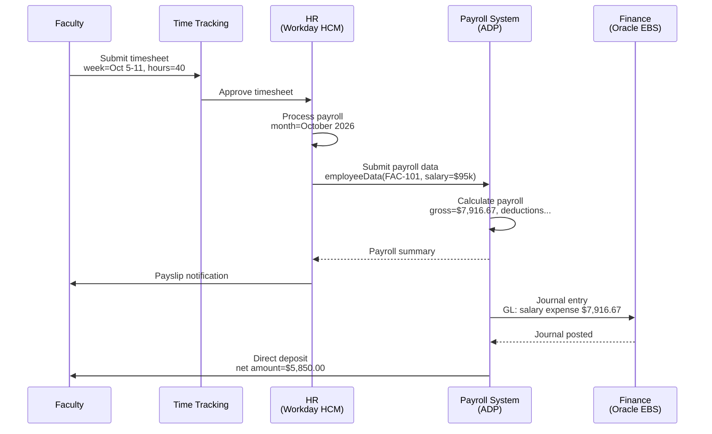
```mermaid
sequenceDiagram
    participant FAC as Faculty
    participant TIME as Time Tracking
    participant HR as HR<br/>(Workday HCM)
    participant PAY as Payroll System<br/>(ADP)
    participant FIN as Finance<br/>(Oracle EBS)
    FAC->>TIME: Submit timesheet<br/>week=Oct 5-11, hours=40
    TIME->>HR: Approve timesheet
    HR->>HR: Process payroll<br/>month=October 2026
    HR->>PAY: Submit payroll data<br/>employeeData(FAC-101, salary=$95k)
    PAY->>PAY: Calculate payroll<br/>gross=$7,916.67, deductions...
    PAY-->>HR: Payroll summary
    HR->>FAC: Payslip notification
    PAY->>FIN: Journal entry<br/>GL: salary expense $7,916.67
    FIN-->>PAY: Journal posted
    PAY->>FAC: Direct deposit<br/>net amount=$5,850.00
```

#### Integration Details

| Flow | Entity | Info Flow | Source | Target | Source Conn | Target Conn | Pattern | Complexity |
|------|--------|-----------|--------|--------|-------------|-------------|---------|------------|
| Payroll & Benefits | Timesheet | SubmitTimesheet | Time Tracking System | HRIS (Workday HCM) | Time API (REST) | Workday API (WS-Security) | API-led (Real-time) | Simple |
| Payroll & Benefits | Payroll Data | SubmitPayroll | HRIS (Workday HCM) | Payroll System (ADP) | Workday Payroll Interface | ADP API (SFTP) | Batch (Scheduled) | High |
| Payroll & Benefits | Journal Entry | PostGLJournal | Payroll System (ADP) | Finance ERP (Oracle EBS) | ADP GL Interface (SFTP) | Oracle EBS REST API (SOAP) | Batch (Scheduled) | Medium |
| Payroll & Benefits | Benefits | EnrollBenefits | HRIS (Workday HCM) | Benefits Provider | Workday API (WS-Security) | Provider API (REST) | API-led (Real-time) | Medium |
| Payroll & Benefits | Tax | CalculateTaxWithholding | Payroll System (ADP) | Tax Authority Portal | ADP API (SOAP) | HMRC RTI API (SOAP) | Batch (Scheduled) | High |

#### Acceptance Criteria

| AC ID | Description | Related Info Flow | Expected Outcome | Priority |
|-------|------------|-------------------|------------------|----------|
| AC-3.2-01 | Data integrity: Timesheet data transferred from Time Tracking System to HRIS (Workday HCM) via SubmitTimesheet must be complete and consistent | SubmitTimesheet | Timesheet records in HRIS (Workday HCM) match source; no data loss; reconciliation report confirms accuracy | Medium |
| AC-3.2-02 | Data integrity: Payroll Data data transferred from HRIS (Workday HCM) to Payroll System (ADP) via SubmitPayroll must be complete and consistent | SubmitPayroll | Payroll Data records in Payroll System (ADP) match source; no data loss; reconciliation report confirms accuracy | Critical |
| AC-3.2-03 | Data integrity: Journal Entry data transferred from Payroll System (ADP) to Finance ERP (Oracle EBS) via PostGLJournal must be complete and consistent | PostGLJournal | Journal Entry records in Finance ERP (Oracle EBS) match source; no data loss; reconciliation report confirms accuracy | High |
| AC-3.2-04 | Data integrity: Benefits data transferred from HRIS (Workday HCM) to Benefits Provider via EnrollBenefits must be complete and consistent | EnrollBenefits | Benefits records in Benefits Provider match source; no data loss; reconciliation report confirms accuracy | High |
| AC-3.2-05 | Data integrity: Tax data transferred from Payroll System (ADP) to Tax Authority Portal via CalculateTaxWithholding must be complete and consistent | CalculateTaxWithholding | Tax records in Tax Authority Portal match source; no data loss; reconciliation report confirms accuracy | Critical |
| AC-3.2-06 | Error handling: Failed transactions between Time Tracking System and HRIS (Workday HCM) are logged with error context and trigger automatic retry or alert | SubmitTimesheet | Errors logged with timestamp, HTTP status, request payload excerpt; retry up to 3 times; alert sent after consecutive failures | Critical |
| AC-3.2-07 | Security: All endpoints enforce authentication (ADP GL Interface (SFTP), ADP API (SOAP), ...) and encrypt data in transit via TLS 1.2+ | All flows | Unauthenticated requests rejected with 401; tokens validated per call; invalid/expired tokens logged | Critical |

---

---

### 3.3 Faculty Performance & Development

**Description:** Performance reviews, professional development, tenure tracking with inputs from SIS and LMS.

**Actors:** Faculty, Department Chair, HR  
**Systems:** HRIS, LMS, SIS, Development Platform  

#### Sequence Diagram

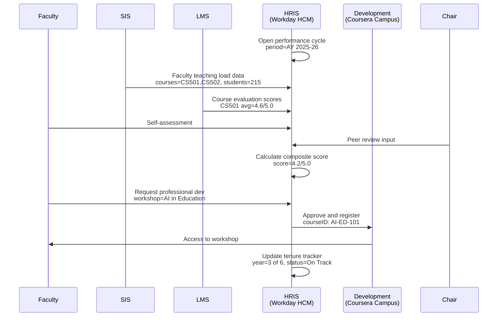
```mermaid
sequenceDiagram
    participant FAC as Faculty
    participant SIS as SIS
    participant LMS as LMS
    participant HR as HRIS<br/>(Workday HCM)
    participant DEV as Development<br/>(Coursera Campus)
    HR->>HR: Open performance cycle<br/>period=AY 2025-26
    SIS->>HR: Faculty teaching load data<br/>courses=CS501,CS502, students=215
    LMS->>HR: Course evaluation scores<br/>CS501 avg=4.6/5.0
    FAC->>HR: Self-assessment
    Chair->>HR: Peer review input
    HR->>HR: Calculate composite score<br/>score=4.2/5.0
    FAC->>HR: Request professional dev<br/>workshop=AI in Education
    HR->>DEV: Approve and register<br/>courseID: AI-ED-101
    DEV->>FAC: Access to workshop
    HR->>HR: Update tenure tracker<br/>year=3 of 6, status=On Track
```

#### Integration Details

| Flow | Entity | Info Flow | Source | Target | Source Conn | Target Conn | Pattern | Complexity |
|------|--------|-----------|--------|--------|-------------|-------------|---------|------------|
| Faculty Performance & Development | Teaching Load | GetTeachingLoad | SIS (Ellucian Banner) | HRIS (Workday HCM) | Banner REST API | Workday API (WS-Security) | Batch (Scheduled) | Simple |
| Faculty Performance & Development | Course Evaluation | SyncEvalScores | LMS (Canvas) | HRIS (Workday HCM) | Canvas API (OAuth2) | Workday API (WS-Security) | Batch (Scheduled) | Medium |
| Faculty Performance & Development | Development Request | ApproveTraining | HRIS (Workday HCM) | Development Platform (Coursera Campus) | Workday API (WS-Security) | Coursera API (OAuth2) | API-led (Real-time) | Simple |
| Faculty Performance & Development | Goal | SetPerformanceGoal | HRIS (Workday HCM) | HRIS (Workday HCM) | Internal | Internal | API-led (Real-time) | Simple |
| Faculty Performance & Development | Review | SubmitPerformanceReview | HRIS (Workday HCM) | HRIS (Workday HCM) | Internal | Internal | API-led (Real-time) | Medium |

#### Acceptance Criteria

| AC ID | Description | Related Info Flow | Expected Outcome | Priority |
|-------|------------|-------------------|------------------|----------|
| AC-3.3-01 | Data integrity: Teaching Load data transferred from SIS (Ellucian Banner) to HRIS (Workday HCM) via GetTeachingLoad must be complete and consistent | GetTeachingLoad | Teaching Load records in HRIS (Workday HCM) match source; no data loss; reconciliation report confirms accuracy | Medium |
| AC-3.3-02 | Data integrity: Course Evaluation data transferred from LMS (Canvas) to HRIS (Workday HCM) via SyncEvalScores must be complete and consistent | SyncEvalScores | Course Evaluation records in HRIS (Workday HCM) match source; no data loss; reconciliation report confirms accuracy | High |
| AC-3.3-03 | Data integrity: Development Request data transferred from HRIS (Workday HCM) to Development Platform (Coursera Campus) via ApproveTraining must be complete and consistent | ApproveTraining | Development Request records in Development Platform (Coursera Campus) match source; no data loss; reconciliation report confirms accuracy | Medium |
| AC-3.3-04 | Data integrity: Goal data transferred from HRIS (Workday HCM) to HRIS (Workday HCM) via SetPerformanceGoal must be complete and consistent | SetPerformanceGoal | Goal records in HRIS (Workday HCM) match source; no data loss; reconciliation report confirms accuracy | Medium |
| AC-3.3-05 | Data integrity: Review data transferred from HRIS (Workday HCM) to HRIS (Workday HCM) via SubmitPerformanceReview must be complete and consistent | SubmitPerformanceReview | Review records in HRIS (Workday HCM) match source; no data loss; reconciliation report confirms accuracy | High |
| AC-3.3-06 | Error handling: Failed transactions between SIS (Ellucian Banner) and HRIS (Workday HCM) are logged with error context and trigger automatic retry or alert | GetTeachingLoad | Errors logged with timestamp, HTTP status, request payload excerpt; retry up to 3 times; alert sent after consecutive failures | Critical |
| AC-3.3-07 | Security: All endpoints enforce authentication (Banner REST API, Workday API (WS-Security), ...) and encrypt data in transit via TLS 1.2+ | All flows | Unauthenticated requests rejected with 401; tokens validated per call; invalid/expired tokens logged | Critical |

# Finance & Resource Management  - `BC184`

Manage financial resources: student fees, financial aid, procurement, budgeting, general ledger.

### 4.1 Fee Assessment & Billing

**Description:** Student fees assessed per term. Invoices generated, payments processed, holds cleared.

**Actors:** Student, Finance, Bursar  
**Systems:** SIS, Finance ERP, Payment Gateway, Student Portal  

#### Sequence Diagram

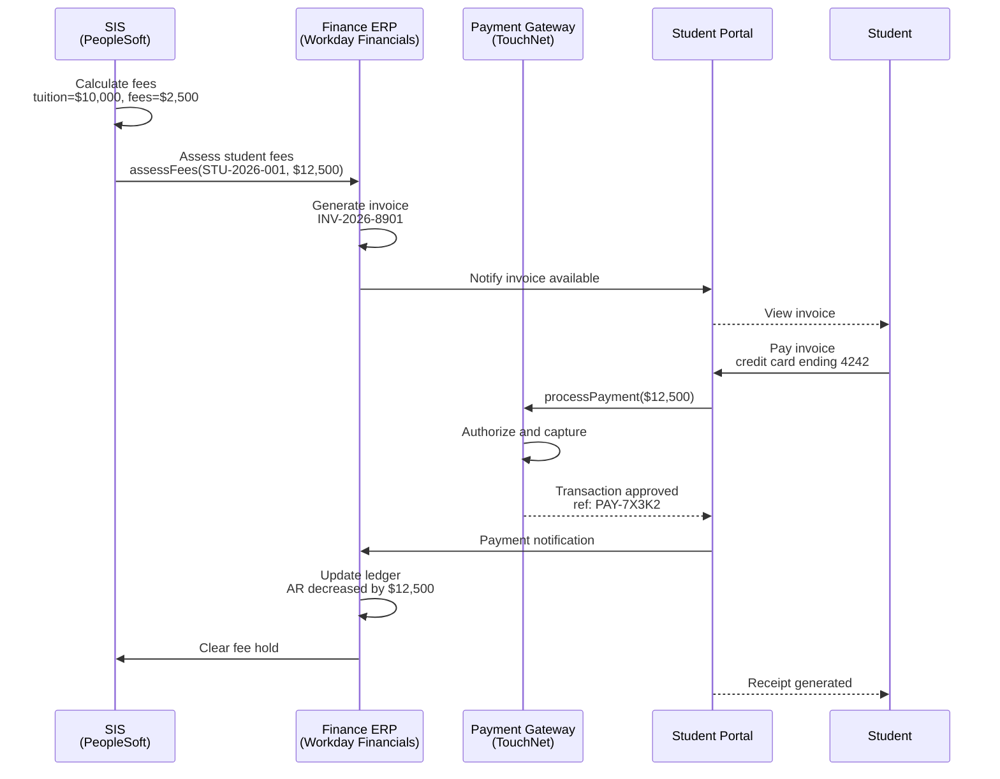
```mermaid
sequenceDiagram
    participant SIS as SIS<br/>(PeopleSoft)
    participant FIN as Finance ERP<br/>(Workday Financials)
    participant PG as Payment Gateway<br/>(TouchNet)
    participant PORT as Student Portal
    SIS->>SIS: Calculate fees<br/>tuition=$10,000, fees=$2,500
    SIS->>FIN: Assess student fees<br/>assessFees(STU-2026-001, $12,500)
    FIN->>FIN: Generate invoice<br/>INV-2026-8901
    FIN->>PORT: Notify invoice available
    PORT-->>Student: View invoice
    Student->>PORT: Pay invoice<br/>credit card ending 4242
    PORT->>PG: processPayment($12,500)
    PG->>PG: Authorize and capture
    PG-->>PORT: Transaction approved<br/>ref: PAY-7X3K2
    PORT->>FIN: Payment notification
    FIN->>FIN: Update ledger<br/>AR decreased by $12,500
    FIN->>SIS: Clear fee hold
    PORT-->>Student: Receipt generated
```

#### Integration Details

| Flow | Entity | Info Flow | Source | Target | Source Conn | Target Conn | Pattern | Complexity |
|------|--------|-----------|--------|--------|-------------|-------------|---------|------------|
| Fee Assessment & Billing | Student Fee | AssessFees | SIS (PeopleSoft Campus Solutions) | Finance ERP (Workday Financials) | PeopleSoft Integration Broker | Workday API (WS-Security) | API-led (Real-time) | Medium |
| Fee Assessment & Billing | Payment | ProcessPayment | Payment Gateway (TouchNet) | Finance ERP (Workday Financials) | TouchNet API | Workday API (WS-Security) | Event-driven | High |
| Fee Assessment & Billing | Fee Hold | ClearFeeHold | Finance ERP (Workday Financials) | SIS (PeopleSoft Campus Solutions) | Workday API (WS-Security) | PeopleSoft REST API (JWT) | Event-driven | Medium |
| Fee Assessment & Billing | Scholarship | ApplyScholarshipCredit | Financial Aid (PowerFAIDS) | Finance ERP (Workday Financials) | PowerFAIDS REST API | Workday API (WS-Security) | Event-driven | Medium |
| Fee Assessment & Billing | Receipt | GenerateReceipt | Finance ERP (Workday Financials) | Student Portal | Workday API (WS-Security) | Portal REST API | Event-driven | Simple |

#### Acceptance Criteria

| AC ID | Description | Related Info Flow | Expected Outcome | Priority |
|-------|------------|-------------------|------------------|----------|
| AC-4.1-01 | Data integrity: Student Fee data transferred from SIS (PeopleSoft Campus Solutions) to Finance ERP (Workday Financials) via AssessFees must be complete and consistent | AssessFees | Student Fee records in Finance ERP (Workday Financials) match source; no data loss; reconciliation report confirms accuracy | High |
| AC-4.1-02 | Data integrity: Payment data transferred from Payment Gateway (TouchNet) to Finance ERP (Workday Financials) via ProcessPayment must be complete and consistent | ProcessPayment | Payment records in Finance ERP (Workday Financials) match source; no data loss; reconciliation report confirms accuracy | Critical |
| AC-4.1-03 | Data integrity: Fee Hold data transferred from Finance ERP (Workday Financials) to SIS (PeopleSoft Campus Solutions) via ClearFeeHold must be complete and consistent | ClearFeeHold | Fee Hold records in SIS (PeopleSoft Campus Solutions) match source; no data loss; reconciliation report confirms accuracy | High |
| AC-4.1-04 | Data integrity: Scholarship data transferred from Financial Aid (PowerFAIDS) to Finance ERP (Workday Financials) via ApplyScholarshipCredit must be complete and consistent | ApplyScholarshipCredit | Scholarship records in Finance ERP (Workday Financials) match source; no data loss; reconciliation report confirms accuracy | High |
| AC-4.1-05 | Data integrity: Receipt data transferred from Finance ERP (Workday Financials) to Student Portal via GenerateReceipt must be complete and consistent | GenerateReceipt | Receipt records in Student Portal match source; no data loss; reconciliation report confirms accuracy | Medium |
| AC-4.1-06 | Error handling: Failed transactions between SIS (PeopleSoft Campus Solutions) and Finance ERP (Workday Financials) are logged with error context and trigger automatic retry or alert | AssessFees | Errors logged with timestamp, HTTP status, request payload excerpt; retry up to 3 times; alert sent after consecutive failures | Critical |
| AC-4.1-07 | Security: All endpoints enforce authentication (TouchNet API, Workday API (WS-Security), ...) and encrypt data in transit via TLS 1.2+ | All flows | Unauthenticated requests rejected with 401; tokens validated per call; invalid/expired tokens logged | Critical |

---

---

### 4.2 Financial Aid Management

**Description:** Students apply for aid. System determines eligibility, packages aid, disburses funds.

**Actors:** Student, Financial Aid Officer, Finance  
**Systems:** Financial Aid System, SIS, Finance ERP, Government Portal  

#### Sequence Diagram

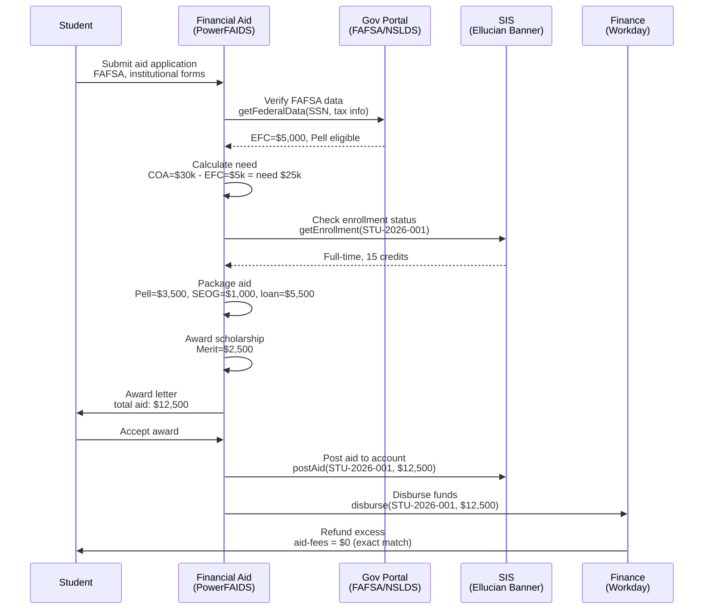
```mermaid
sequenceDiagram
    participant STU as Student
    participant FAN as Financial Aid<br/>(PowerFAIDS)
    participant GOV as Gov Portal<br/>(FAFSA/NSLDS)
    participant SIS as SIS<br/>(Ellucian Banner)
    participant FIN as Finance<br/>(Workday)
    STU->>FAN: Submit aid application<br/>FAFSA, institutional forms
    FAN->>GOV: Verify FAFSA data<br/>getFederalData(SSN, tax info)
    GOV-->>FAN: EFC=$5,000, Pell eligible
    FAN->>FAN: Calculate need<br/>COA=$30k - EFC=$5k = need $25k
    FAN->>SIS: Check enrollment status<br/>getEnrollment(STU-2026-001)
    SIS-->>FAN: Full-time, 15 credits
    FAN->>FAN: Package aid<br/>Pell=$3,500, SEOG=$1,000, loan=$5,500
    FAN->>FAN: Award scholarship<br/>Merit=$2,500
    FAN->>STU: Award letter<br/>total aid: $12,500
    STU->>FAN: Accept award
    FAN->>SIS: Post aid to account<br/>postAid(STU-2026-001, $12,500)
    FAN->>FIN: Disburse funds<br/>disburse(STU-2026-001, $12,500)
    FIN->>STU: Refund excess<br/>aid-fees = $0 (exact match)
```

#### Integration Details

| Flow | Entity | Info Flow | Source | Target | Source Conn | Target Conn | Pattern | Complexity |
|------|--------|-----------|--------|--------|-------------|-------------|---------|------------|
| Financial Aid Management | FAFSA Data | VerifyFAFSA | Financial Aid System (PowerFAIDS) | Government Portal (FAFSA/NSLDS) | PowerFAIDS API | NSLDS Web Services (SOAP) | API-led (Real-time) | High |
| Financial Aid Management | Enrollment Status | CheckEnrollment | Financial Aid System (PowerFAIDS) | SIS (Ellucian Banner) | PowerFAIDS REST API | Banner API (API Key) | API-led (Real-time) | Simple |
| Financial Aid Management | Aid Disbursement | DisburseAid | Financial Aid System (PowerFAIDS) | Finance ERP (Workday Financials) | PowerFAIDS REST API | Workday API (WS-Security) | Event-driven | Medium |
| Financial Aid Management | Cost | CalculateCOA | Financial Aid (PowerFAIDS) | Financial Aid (PowerFAIDS) | Internal | Internal | Batch (Scheduled) | Medium |
| Financial Aid Management | Verification | VerifyTaxData | Financial Aid (PowerFAIDS) | Government Portal (FAFSA/NSLDS) | PowerFAIDS API | NSLDS Web Services (SOAP) | API-led (Real-time) | High |

#### Acceptance Criteria

| AC ID | Description | Related Info Flow | Expected Outcome | Priority |
|-------|------------|-------------------|------------------|----------|
| AC-4.2-01 | Data integrity: FAFSA Data data transferred from Financial Aid System (PowerFAIDS) to Government Portal (FAFSA/NSLDS) via VerifyFAFSA must be complete and consistent | VerifyFAFSA | FAFSA Data records in Government Portal (FAFSA/NSLDS) match source; no data loss; reconciliation report confirms accuracy | Critical |
| AC-4.2-02 | Data integrity: Enrollment Status data transferred from Financial Aid System (PowerFAIDS) to SIS (Ellucian Banner) via CheckEnrollment must be complete and consistent | CheckEnrollment | Enrollment Status records in SIS (Ellucian Banner) match source; no data loss; reconciliation report confirms accuracy | Medium |
| AC-4.2-03 | Data integrity: Aid Disbursement data transferred from Financial Aid System (PowerFAIDS) to Finance ERP (Workday Financials) via DisburseAid must be complete and consistent | DisburseAid | Aid Disbursement records in Finance ERP (Workday Financials) match source; no data loss; reconciliation report confirms accuracy | High |
| AC-4.2-04 | Data integrity: Cost data transferred from Financial Aid (PowerFAIDS) to Financial Aid (PowerFAIDS) via CalculateCOA must be complete and consistent | CalculateCOA | Cost records in Financial Aid (PowerFAIDS) match source; no data loss; reconciliation report confirms accuracy | High |
| AC-4.2-05 | Data integrity: Verification data transferred from Financial Aid (PowerFAIDS) to Government Portal (FAFSA/NSLDS) via VerifyTaxData must be complete and consistent | VerifyTaxData | Verification records in Government Portal (FAFSA/NSLDS) match source; no data loss; reconciliation report confirms accuracy | Critical |
| AC-4.2-06 | Error handling: Failed transactions between Financial Aid System (PowerFAIDS) and Government Portal (FAFSA/NSLDS) are logged with error context and trigger automatic retry or alert | VerifyFAFSA | Errors logged with timestamp, HTTP status, request payload excerpt; retry up to 3 times; alert sent after consecutive failures | Critical |
| AC-4.2-07 | Security: All endpoints enforce authentication (PowerFAIDS API, PowerFAIDS REST API, ...) and encrypt data in transit via TLS 1.2+ | All flows | Unauthenticated requests rejected with 401; tokens validated per call; invalid/expired tokens logged | Critical |

---

---

### 4.3 Procurement & Vendor Management

**Description:** Departments submit requisitions. Procurement processes POs, confirms receipt, matches invoices.

**Actors:** Department Admin, Procurement, Finance, Vendor  
**Systems:** Procurement System, Finance ERP, Vendor Portal  

#### Sequence Diagram

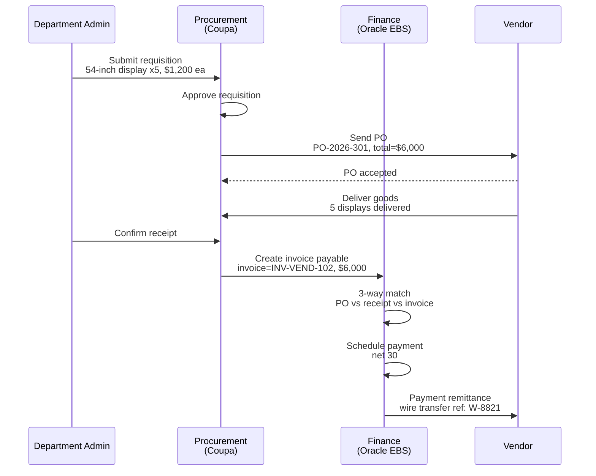
```mermaid
sequenceDiagram
    participant DEPT as Department Admin
    participant PROC as Procurement<br/>(Coupa)
    participant FIN as Finance<br/>(Oracle EBS)
    participant VEND as Vendor
    DEPT->>PROC: Submit requisition<br/>54-inch display x5, $1,200 ea
    PROC->>PROC: Approve requisition
    PROC->>VEND: Send PO<br/>PO-2026-301, total=$6,000
    VEND-->>PROC: PO accepted
    VEND->>PROC: Deliver goods<br/>5 displays delivered
    DEPT->>PROC: Confirm receipt
    PROC->>FIN: Create invoice payable<br/>invoice=INV-VEND-102, $6,000
    FIN->>FIN: 3-way match<br/>PO vs receipt vs invoice
    FIN->>FIN: Schedule payment<br/>net 30
    FIN->>VEND: Payment remittance<br/>wire transfer ref: W-8821
```

#### Integration Details

| Flow | Entity | Info Flow | Source | Target | Source Conn | Target Conn | Pattern | Complexity |
|------|--------|-----------|--------|--------|-------------|-------------|---------|------------|
| Procurement & Vendor Management | Purchase Order | SendPO | Procurement System (Coupa) | Vendor Portal | Coupa API (OAuth2) | Vendor cXML / EDI | API-led (Real-time) | High |
| Procurement & Vendor Management | Invoice | SyncInvoice | Procurement System (Coupa) | Finance ERP (Oracle EBS) | Coupa API (OAuth2) | Oracle EBS REST API (SOAP) | Batch (Scheduled) | Medium |
| Procurement & Vendor Management | Requisition | ApproveRequisition | Procurement (Coupa) | Procurement (Coupa) | Internal | Internal | API-led (Real-time) | Simple |
| Procurement & Vendor Management | Receipt | ConfirmGoodsReceipt | Procurement (Coupa) | Finance ERP (Oracle EBS) | Coupa API (OAuth2) | Oracle EBS REST API (SOAP) | API-led (Real-time) | Simple |

#### Acceptance Criteria

| AC ID | Description | Related Info Flow | Expected Outcome | Priority |
|-------|------------|-------------------|------------------|----------|
| AC-4.3-01 | Data integrity: Purchase Order data transferred from Procurement System (Coupa) to Vendor Portal via SendPO must be complete and consistent | SendPO | Purchase Order records in Vendor Portal match source; no data loss; reconciliation report confirms accuracy | Critical |
| AC-4.3-02 | Data integrity: Invoice data transferred from Procurement System (Coupa) to Finance ERP (Oracle EBS) via SyncInvoice must be complete and consistent | SyncInvoice | Invoice records in Finance ERP (Oracle EBS) match source; no data loss; reconciliation report confirms accuracy | High |
| AC-4.3-03 | Data integrity: Requisition data transferred from Procurement (Coupa) to Procurement (Coupa) via ApproveRequisition must be complete and consistent | ApproveRequisition | Requisition records in Procurement (Coupa) match source; no data loss; reconciliation report confirms accuracy | Medium |
| AC-4.3-04 | Data integrity: Receipt data transferred from Procurement (Coupa) to Finance ERP (Oracle EBS) via ConfirmGoodsReceipt must be complete and consistent | ConfirmGoodsReceipt | Receipt records in Finance ERP (Oracle EBS) match source; no data loss; reconciliation report confirms accuracy | Medium |
| AC-4.3-05 | Error handling: Failed transactions between Procurement System (Coupa) and Vendor Portal are logged with error context and trigger automatic retry or alert | SendPO | Errors logged with timestamp, HTTP status, request payload excerpt; retry up to 3 times; alert sent after consecutive failures | Critical |
| AC-4.3-06 | Security: All endpoints enforce authentication (Coupa API (OAuth2), Internal, ...) and encrypt data in transit via TLS 1.2+ | All flows | Unauthenticated requests rejected with 401; tokens validated per call; invalid/expired tokens logged | Critical |

# Research Management  - `BC065` `BC071` `BC074` `BC086` `BC093` `BC245`

Full research lifecycle: opportunity discovery, grant applications, award management, project execution, publication, compliance.

### 5.1 Grant Lifecycle Management

**Description:** Researchers identify funding, submit proposals, manage awarded grants, track expenditures, report to sponsors.

**Actors:** Researcher, Research Admin, Finance, Sponsor  
**Systems:** Research Admin, Finance ERP, Compliance, Sponsor Portal  

#### Sequence Diagram

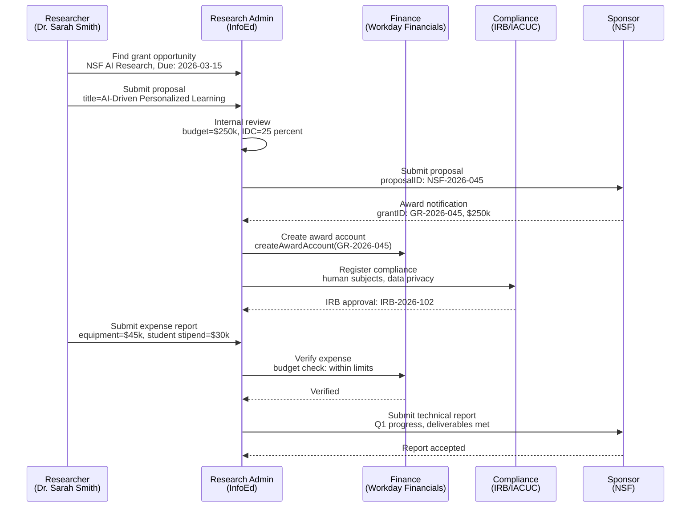
```mermaid
sequenceDiagram
    participant RES as Researcher<br/>(Dr. Sarah Smith)
    participant RAD as Research Admin<br/>(InfoEd)
    participant FIN as Finance<br/>(Workday Financials)
    participant COMP as Compliance<br/>(IRB/IACUC)
    participant SPON as Sponsor<br/>(NSF)
    RES->>RAD: Find grant opportunity<br/>NSF AI Research, Due: 2026-03-15
    RES->>RAD: Submit proposal<br/>title=AI-Driven Personalized Learning
    RAD->>RAD: Internal review<br/>budget=$250k, IDC=25 percent
    RAD->>SPON: Submit proposal<br/>proposalID: NSF-2026-045
    SPON-->>RAD: Award notification<br/>grantID: GR-2026-045, $250k
    RAD->>FIN: Create award account<br/>createAwardAccount(GR-2026-045)
    RAD->>COMP: Register compliance<br/>human subjects, data privacy
    COMP-->>RAD: IRB approval: IRB-2026-102
    RES->>RAD: Submit expense report<br/>equipment=$45k, student stipend=$30k
    RAD->>FIN: Verify expense<br/>budget check: within limits
    FIN-->>RAD: Verified
    RAD->>SPON: Submit technical report<br/>Q1 progress, deliverables met
    SPON-->>RAD: Report accepted
```

#### Integration Details

| Flow | Entity | Info Flow | Source | Target | Source Conn | Target Conn | Pattern | Complexity |
|------|--------|-----------|--------|--------|-------------|-------------|---------|------------|
| Grant Lifecycle Management | Proposal | SubmitProposal | Research Admin (InfoEd) | Sponsor Portal (NSF FastLane) | InfoEd API (OAuth2) | NSF FastLane API (Research.gov SOAP) | API-led (Real-time) | High |
| Grant Lifecycle Management | Award Account | CreateAwardAccount | Research Admin (InfoEd) | Finance ERP (Workday Financials) | InfoEd API (OAuth2) | Workday API (WS-Security) | Event-driven | Medium |
| Grant Lifecycle Management | Compliance | RegisterCompliance | Research Admin (InfoEd) | Compliance System (IRB Manager) | InfoEd REST API | IRB Manager API (API Key) | API-led (Real-time) | Simple |
| Grant Lifecycle Management | Expense | VerifyExpense | Research Admin (InfoEd) | Finance ERP (Workday Financials) | InfoEd API (OAuth2) | Workday API (WS-Security) | API-led (Real-time) | Medium |
| Grant Lifecycle Management | Budget | ValidateGrantBudget | Research Admin (InfoEd) | Finance ERP (Workday Financials) | InfoEd API (OAuth2) | Workday API (WS-Security) | API-led (Real-time) | Medium |
| Grant Lifecycle Management | Report | SubmitProgressReport | Research Admin (InfoEd) | Sponsor Portal (NSF FastLane) | InfoEd API (OAuth2) | NSF FastLane API (Research.gov SOAP) | API-led (Real-time) | High |

#### Acceptance Criteria

| AC ID | Description | Related Info Flow | Expected Outcome | Priority |
|-------|------------|-------------------|------------------|----------|
| AC-5.1-01 | Data integrity: Proposal data transferred from Research Admin (InfoEd) to Sponsor Portal (NSF FastLane) via SubmitProposal must be complete and consistent | SubmitProposal | Proposal records in Sponsor Portal (NSF FastLane) match source; no data loss; reconciliation report confirms accuracy | Critical |
| AC-5.1-02 | Data integrity: Award Account data transferred from Research Admin (InfoEd) to Finance ERP (Workday Financials) via CreateAwardAccount must be complete and consistent | CreateAwardAccount | Award Account records in Finance ERP (Workday Financials) match source; no data loss; reconciliation report confirms accuracy | High |
| AC-5.1-03 | Data integrity: Compliance data transferred from Research Admin (InfoEd) to Compliance System (IRB Manager) via RegisterCompliance must be complete and consistent | RegisterCompliance | Compliance records in Compliance System (IRB Manager) match source; no data loss; reconciliation report confirms accuracy | Medium |
| AC-5.1-04 | Data integrity: Expense data transferred from Research Admin (InfoEd) to Finance ERP (Workday Financials) via VerifyExpense must be complete and consistent | VerifyExpense | Expense records in Finance ERP (Workday Financials) match source; no data loss; reconciliation report confirms accuracy | High |
| AC-5.1-05 | Data integrity: Budget data transferred from Research Admin (InfoEd) to Finance ERP (Workday Financials) via ValidateGrantBudget must be complete and consistent | ValidateGrantBudget | Budget records in Finance ERP (Workday Financials) match source; no data loss; reconciliation report confirms accuracy | High |
| AC-5.1-06 | Data integrity: Report data transferred from Research Admin (InfoEd) to Sponsor Portal (NSF FastLane) via SubmitProgressReport must be complete and consistent | SubmitProgressReport | Report records in Sponsor Portal (NSF FastLane) match source; no data loss; reconciliation report confirms accuracy | Critical |
| AC-5.1-07 | Error handling: Failed transactions between Research Admin (InfoEd) and Sponsor Portal (NSF FastLane) are logged with error context and trigger automatic retry or alert | SubmitProposal | Errors logged with timestamp, HTTP status, request payload excerpt; retry up to 3 times; alert sent after consecutive failures | Critical |
| AC-5.1-08 | Security: All endpoints enforce authentication (InfoEd API (OAuth2), InfoEd REST API, ...) and encrypt data in transit via TLS 1.2+ | All flows | Unauthenticated requests rejected with 401; tokens validated per call; invalid/expired tokens logged | Critical |

---

---

### 5.2 Research Outputs & Publishing

**Description:** Researchers publish findings. Publications tracked in institutional repository and linked to grants.

**Actors:** Researcher, Library, Publisher  
**Systems:** Research Admin, Institutional Repository, Publisher Portal  

#### Sequence Diagram

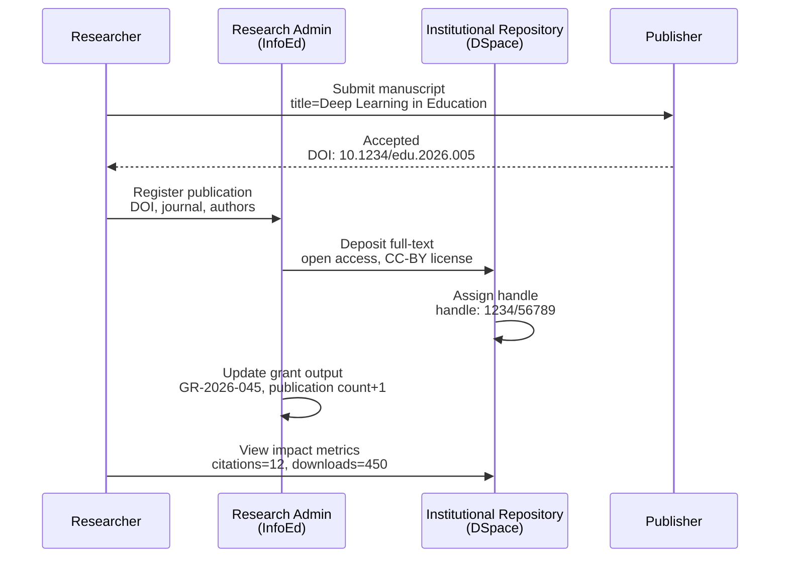
```mermaid
sequenceDiagram
    participant RES as Researcher
    participant RAD as Research Admin<br/>(InfoEd)
    participant REPO as Institutional Repository<br/>(DSpace)
    participant PUB as Publisher
    RES->>PUB: Submit manuscript<br/>title=Deep Learning in Education
    PUB-->>RES: Accepted<br/>DOI: 10.1234/edu.2026.005
    RES->>RAD: Register publication<br/>DOI, journal, authors
    RAD->>REPO: Deposit full-text<br/>open access, CC-BY license
    REPO->>REPO: Assign handle<br/>handle: 1234/56789
    RAD->>RAD: Update grant output<br/>GR-2026-045, publication count+1
    RES->>REPO: View impact metrics<br/>citations=12, downloads=450
```

#### Integration Details

| Flow | Entity | Info Flow | Source | Target | Source Conn | Target Conn | Pattern | Complexity |
|------|--------|-----------|--------|--------|-------------|-------------|---------|------------|
| Research Outputs & Publishing | Publication | RegisterPublication | Research Admin (InfoEd) | Institutional Repository (DSpace) | InfoEd API (OAuth2) | DSpace REST API (API Key) | API-led (Real-time) | Simple |
| Research Outputs & Publishing | Grant Output | UpdateGrantOutput | Research Admin (InfoEd) | Research Admin (InfoEd) | Internal | Internal | API-led (Real-time) | Simple |
| Research Outputs & Publishing | Citation | TrackCitationMetrics | Institutional Repository (DSpace) | Research Admin (InfoEd) | DSpace REST API (API Key) | InfoEd API (OAuth2) | Batch (Scheduled) | Simple |
| Research Outputs & Publishing | Altmetric | SyncAltmetricScore | Institutional Repository (DSpace) | Altmetric Service | DSpace REST API (API Key) | Altmetric API (REST) | Batch (Scheduled) | Simple |

#### Acceptance Criteria

| AC ID | Description | Related Info Flow | Expected Outcome | Priority |
|-------|------------|-------------------|------------------|----------|
| AC-5.2-01 | Data integrity: Publication data transferred from Research Admin (InfoEd) to Institutional Repository (DSpace) via RegisterPublication must be complete and consistent | RegisterPublication | Publication records in Institutional Repository (DSpace) match source; no data loss; reconciliation report confirms accuracy | Medium |
| AC-5.2-02 | Data integrity: Grant Output data transferred from Research Admin (InfoEd) to Research Admin (InfoEd) via UpdateGrantOutput must be complete and consistent | UpdateGrantOutput | Grant Output records in Research Admin (InfoEd) match source; no data loss; reconciliation report confirms accuracy | Medium |
| AC-5.2-03 | Data integrity: Citation data transferred from Institutional Repository (DSpace) to Research Admin (InfoEd) via TrackCitationMetrics must be complete and consistent | TrackCitationMetrics | Citation records in Research Admin (InfoEd) match source; no data loss; reconciliation report confirms accuracy | Medium |
| AC-5.2-04 | Data integrity: Altmetric data transferred from Institutional Repository (DSpace) to Altmetric Service via SyncAltmetricScore must be complete and consistent | SyncAltmetricScore | Altmetric records in Altmetric Service match source; no data loss; reconciliation report confirms accuracy | Medium |
| AC-5.2-05 | Error handling: Failed transactions between Research Admin (InfoEd) and Institutional Repository (DSpace) are logged with error context and trigger automatic retry or alert | RegisterPublication | Errors logged with timestamp, HTTP status, request payload excerpt; retry up to 3 times; alert sent after consecutive failures | Critical |
| AC-5.2-06 | Security: All endpoints enforce authentication (DSpace REST API (API Key), InfoEd API (OAuth2), ...) and encrypt data in transit via TLS 1.2+ | All flows | Unauthenticated requests rejected with 401; tokens validated per call; invalid/expired tokens logged | Critical |

---

---

### 5.3 Research Compliance & Ethics

**Description:** Researchers submit protocols for ethics/IRB review. Compliance system tracks approvals, manages renewals, ensures regulatory adherence throughout the project lifecycle.

**Actors:** Researcher, IRB Committee, Compliance Officer  
**Systems:** Research Admin (InfoEd), Compliance System (IRB Manager), SIS, Finance ERP (Workday Financials), Grantor Portal

#### Sequence Diagram

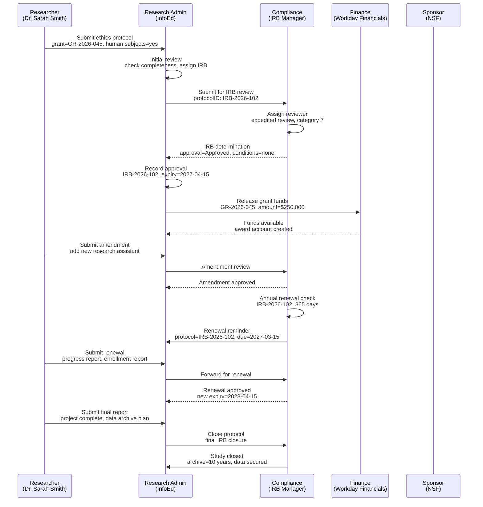
```mermaid
sequenceDiagram
    participant RES as Researcher<br/>(Dr. Sarah Smith)
    participant RAD as Research Admin<br/>(InfoEd)
    participant COMP as Compliance<br/>(IRB Manager)
    participant FIN as Finance<br/>(Workday Financials)
    participant SPON as Sponsor<br/>(NSF)
    RES->>RAD: Submit ethics protocol<br/>grant=GR-2026-045, human subjects=yes
    RAD->>RAD: Initial review<br/>check completeness, assign IRB
    RAD->>COMP: Submit for IRB review<br/>protocolID: IRB-2026-102
    COMP->>COMP: Assign reviewer<br/>expedited review, category 7
    COMP-->>RAD: IRB determination<br/>approval=Approved, conditions=none
    RAD->>RAD: Record approval<br/>IRB-2026-102, expiry=2027-04-15
    RAD->>FIN: Release grant funds<br/>GR-2026-045, amount=$250,000
    FIN-->>RAD: Funds available<br/>award account created
    RES->>RAD: Submit amendment<br/>add new research assistant
    RAD->>COMP: Amendment review
    COMP-->>RAD: Amendment approved
    COMP->>COMP: Annual renewal check<br/>IRB-2026-102, 365 days
    COMP->>RAD: Renewal reminder<br/>protocol=IRB-2026-102, due=2027-03-15
    RES->>RAD: Submit renewal<br/>progress report, enrollment report
    RAD->>COMP: Forward for renewal
    COMP-->>RAD: Renewal approved<br/>new expiry=2028-04-15
    RES->>RAD: Submit final report<br/>project complete, data archive plan
    RAD->>COMP: Close protocol<br/>final IRB closure
    COMP->>RAD: Study closed<br/>archive=10 years, data secured
```

#### Integration Details

| Flow | Entity | Info Flow | Source | Target | Source Conn | Target Conn | Pattern | Complexity |
|------|--------|-----------|--------|--------|-------------|-------------|---------|------------|
| Research Compliance | Protocol | SubmitEthicsProtocol | Research Admin (InfoEd) | Compliance (IRB Manager) | InfoEd API (OAuth2) | IRB Manager API (API Key) | API-led (Real-time) | Medium |
| Research Compliance | IRB | ProcessIRBReview | Compliance (IRB Manager) | Compliance (IRB Manager) | Internal | Internal | API-led (Real-time) | Medium |
| Research Compliance | Funds | ReleaseGrantFunds | Research Admin (InfoEd) | Finance ERP (Workday Financials) | InfoEd API (OAuth2) | Workday API (WS-Security) | Event-driven | Medium |
| Research Compliance | Renewal | ProcessAnnualRenewal | Compliance (IRB Manager) | Research Admin (InfoEd) | IRB Manager API (API Key) | InfoEd API (OAuth2) | Event-driven | Simple |
| Research Compliance | Closure | CloseProtocol | Compliance (IRB Manager) | Research Admin (InfoEd) | IRB Manager API (API Key) | InfoEd API (OAuth2) | Event-driven | Simple |

#### Acceptance Criteria

| AC ID | Description | Related Info Flow | Expected Outcome | Priority |
|-------|------------|-------------------|------------------|----------|
| AC-5.3-01 | Data integrity: Protocol data transferred from Research Admin (InfoEd) to Compliance (IRB Manager) via SubmitEthicsProtocol must be complete and consistent | SubmitEthicsProtocol | Protocol records in Compliance (IRB Manager) match source; no data loss; reconciliation report confirms accuracy | High |
| AC-5.3-02 | Data integrity: IRB data transferred from Compliance (IRB Manager) to Compliance (IRB Manager) via ProcessIRBReview must be complete and consistent | ProcessIRBReview | IRB records in Compliance (IRB Manager) match source; no data loss; reconciliation report confirms accuracy | High |
| AC-5.3-03 | Data integrity: Funds data transferred from Research Admin (InfoEd) to Finance ERP (Workday Financials) via ReleaseGrantFunds must be complete and consistent | ReleaseGrantFunds | Funds records in Finance ERP (Workday Financials) match source; no data loss; reconciliation report confirms accuracy | High |
| AC-5.3-04 | Data integrity: Renewal data transferred from Compliance (IRB Manager) to Research Admin (InfoEd) via ProcessAnnualRenewal must be complete and consistent | ProcessAnnualRenewal | Renewal records in Research Admin (InfoEd) match source; no data loss; reconciliation report confirms accuracy | Medium |
| AC-5.3-05 | Data integrity: Closure data transferred from Compliance (IRB Manager) to Research Admin (InfoEd) via CloseProtocol must be complete and consistent | CloseProtocol | Closure records in Research Admin (InfoEd) match source; no data loss; reconciliation report confirms accuracy | Medium |
| AC-5.3-06 | Error handling: Failed transactions between Research Admin (InfoEd) and Compliance (IRB Manager) are logged with error context and trigger automatic retry or alert | SubmitEthicsProtocol | Errors logged with timestamp, HTTP status, request payload excerpt; retry up to 3 times; alert sent after consecutive failures | Critical |
| AC-5.3-07 | Security: All endpoints enforce authentication (IRB Manager API (API Key), InfoEd API (OAuth2), ...) and encrypt data in transit via TLS 1.2+ | All flows | Unauthenticated requests rejected with 401; tokens validated per call; invalid/expired tokens logged | Critical |

# Institutional Engagement  - `BC107` `BC232` `BC238`

Marketing, recruitment, alumni relations, fundraising, and community partnerships.

### 6.1 Marketing & Student Recruitment

**Description:** Marketing campaigns generate prospects. Inquiries route to CRM for nurturing. Events tracked. Applications originate from recruitment activities.

**Actors:** Marketing Team, Prospective Student, Admissions  
**Systems:** Marketing Automation, CRM, CMS, Event Mgmt  

#### Sequence Diagram

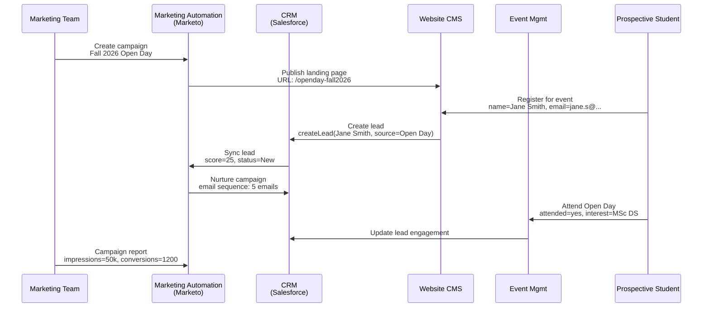
```mermaid
sequenceDiagram
    participant MKT as Marketing Team
    participant MA as Marketing Automation<br/>(Marketo)
    participant CRM as CRM<br/>(Salesforce)
    participant CMS as Website CMS
    participant EVT as Event Mgmt
    MKT->>MA: Create campaign<br/>Fall 2026 Open Day
    MA->>CMS: Publish landing page<br/>URL: /openday-fall2026
    Prospective Student->>CMS: Register for event<br/>name=Jane Smith, email=jane.s@...
    CMS->>CRM: Create lead<br/>createLead(Jane Smith, source=Open Day)
    CRM->>MA: Sync lead<br/>score=25, status=New
    MA->>CRM: Nurture campaign<br/>email sequence: 5 emails
    Prospective Student->>EVT: Attend Open Day<br/>attended=yes, interest=MSc DS
    EVT->>CRM: Update lead engagement
    MKT->>MA: Campaign report<br/>impressions=50k, conversions=1200
```

#### Integration Details

| Flow | Entity | Info Flow | Source | Target | Source Conn | Target Conn | Pattern | Complexity |
|------|--------|-----------|--------|--------|-------------|-------------|---------|------------|
| Marketing & Recruitment | Lead | CreateLead | Website CMS | CRM (Salesforce Education Cloud) | Webhook / REST API | Salesforce REST API (OAuth2) | Event-driven | Simple |
| Marketing & Recruitment | Campaign Lead | SyncCampaignLead | CRM (Salesforce Education Cloud) | Marketing Automation (Marketo) | Salesforce REST API (OAuth2) | Marketo REST API (OAuth2) | Batch (Scheduled) | Medium |
| Marketing & Recruitment | Event Engagement | UpdateEventEngagement | Event Mgmt System | CRM (Salesforce Education Cloud) | Event API (REST) | Salesforce REST API (OAuth2) | API-led (Real-time) | Simple |
| Marketing & Recruitment | Inquiry | RouteWebInquiry | Website CMS | CRM (Salesforce Education Cloud) | Webhook | Salesforce REST API (OAuth2) | Event-driven | Simple |
| Marketing & Recruitment | ROI | CalculateCampaignROI | Marketing Automation (Marketo) | CRM (Salesforce Education Cloud) | Marketo REST API (OAuth2) | Salesforce REST API (OAuth2) | Batch (Scheduled) | Medium |

#### Acceptance Criteria

| AC ID | Description | Related Info Flow | Expected Outcome | Priority |
|-------|------------|-------------------|------------------|----------|
| AC-6.1-01 | Data integrity: Lead data transferred from Website CMS to CRM (Salesforce Education Cloud) via CreateLead must be complete and consistent | CreateLead | Lead records in CRM (Salesforce Education Cloud) match source; no data loss; reconciliation report confirms accuracy | Medium |
| AC-6.1-02 | Data integrity: Campaign Lead data transferred from CRM (Salesforce Education Cloud) to Marketing Automation (Marketo) via SyncCampaignLead must be complete and consistent | SyncCampaignLead | Campaign Lead records in Marketing Automation (Marketo) match source; no data loss; reconciliation report confirms accuracy | High |
| AC-6.1-03 | Data integrity: Event Engagement data transferred from Event Mgmt System to CRM (Salesforce Education Cloud) via UpdateEventEngagement must be complete and consistent | UpdateEventEngagement | Event Engagement records in CRM (Salesforce Education Cloud) match source; no data loss; reconciliation report confirms accuracy | Medium |
| AC-6.1-04 | Data integrity: Inquiry data transferred from Website CMS to CRM (Salesforce Education Cloud) via RouteWebInquiry must be complete and consistent | RouteWebInquiry | Inquiry records in CRM (Salesforce Education Cloud) match source; no data loss; reconciliation report confirms accuracy | Medium |
| AC-6.1-05 | Data integrity: ROI data transferred from Marketing Automation (Marketo) to CRM (Salesforce Education Cloud) via CalculateCampaignROI must be complete and consistent | CalculateCampaignROI | ROI records in CRM (Salesforce Education Cloud) match source; no data loss; reconciliation report confirms accuracy | High |
| AC-6.1-06 | Error handling: Failed transactions between Website CMS and CRM (Salesforce Education Cloud) are logged with error context and trigger automatic retry or alert | CreateLead | Errors logged with timestamp, HTTP status, request payload excerpt; retry up to 3 times; alert sent after consecutive failures | Critical |
| AC-6.1-07 | Security: All endpoints enforce authentication (Webhook / REST API, Salesforce REST API (OAuth2), ...) and encrypt data in transit via TLS 1.2+ | All flows | Unauthenticated requests rejected with 401; tokens validated per call; invalid/expired tokens logged | Critical |

---

---

### 6.2 Alumni Relations & Fundraising

**Description:** Alumni records maintained. Fundraising campaigns target donors. Donations processed and receipts issued.

**Actors:** Alumni, Development Officer, Finance  
**Systems:** Alumni CRM, Fundraising Platform, Finance ERP  

#### Sequence Diagram

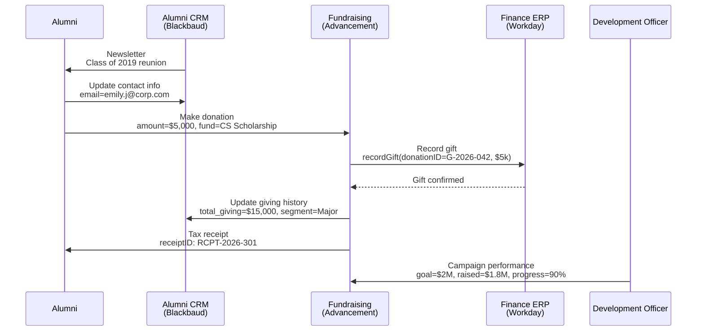
```mermaid
sequenceDiagram
    participant ALUM as Alumni
    participant CRM as Alumni CRM<br/>(Blackbaud)
    participant FUND as Fundraising<br/>(Advancement)
    participant FIN as Finance ERP<br/>(Workday)
    CRM->>ALUM: Newsletter<br/>Class of 2019 reunion
    ALUM->>CRM: Update contact info<br/>email=emily.j@corp.com
    ALUM->>FUND: Make donation<br/>amount=$5,000, fund=CS Scholarship
    FUND->>FIN: Record gift<br/>recordGift(donationID=G-2026-042, $5k)
    FIN-->>FUND: Gift confirmed
    FUND->>CRM: Update giving history<br/>total_giving=$15,000, segment=Major
    FUND->>ALUM: Tax receipt<br/>receiptID: RCPT-2026-301
    Development Officer->>FUND: Campaign performance<br/>goal=$2M, raised=$1.8M, progress=90%
```

#### Integration Details

| Flow | Entity | Info Flow | Source | Target | Source Conn | Target Conn | Pattern | Complexity |
|------|--------|-----------|--------|--------|-------------|-------------|---------|------------|
| Alumni Relations & Fundraising | Donation | RecordGift | Fundraising Platform (Advancement) | Finance ERP (Workday Financials) | Advancement API (OAuth2) | Workday API (WS-Security) | API-led (Real-time) | Medium |
| Alumni Relations & Fundraising | Giving History | SyncGivingHistory | Fundraising Platform (Advancement) | Alumni CRM (Blackbaud) | Advancement API (OAuth2) | Blackbaud API (OAuth2) | Event-driven | Simple |
| Alumni Relations & Fundraising | Contact | UpdateContactInfo | Alumni Portal | Alumni CRM (Blackbaud) | Portal REST API | Blackbaud API (OAuth2) | API-led (Real-time) | Simple |
| Alumni Relations & Fundraising | Campaign | CreateFundraisingCampaign | Fundraising Platform (Advancement) | Alumni CRM (Blackbaud) | Advancement API (OAuth2) | Blackbaud API (OAuth2) | API-led (Real-time) | Medium |

#### Acceptance Criteria

| AC ID | Description | Related Info Flow | Expected Outcome | Priority |
|-------|------------|-------------------|------------------|----------|
| AC-6.2-01 | Data integrity: Donation data transferred from Fundraising Platform (Advancement) to Finance ERP (Workday Financials) via RecordGift must be complete and consistent | RecordGift | Donation records in Finance ERP (Workday Financials) match source; no data loss; reconciliation report confirms accuracy | High |
| AC-6.2-02 | Data integrity: Giving History data transferred from Fundraising Platform (Advancement) to Alumni CRM (Blackbaud) via SyncGivingHistory must be complete and consistent | SyncGivingHistory | Giving History records in Alumni CRM (Blackbaud) match source; no data loss; reconciliation report confirms accuracy | Medium |
| AC-6.2-03 | Data integrity: Contact data transferred from Alumni Portal to Alumni CRM (Blackbaud) via UpdateContactInfo must be complete and consistent | UpdateContactInfo | Contact records in Alumni CRM (Blackbaud) match source; no data loss; reconciliation report confirms accuracy | Medium |
| AC-6.2-04 | Data integrity: Campaign data transferred from Fundraising Platform (Advancement) to Alumni CRM (Blackbaud) via CreateFundraisingCampaign must be complete and consistent | CreateFundraisingCampaign | Campaign records in Alumni CRM (Blackbaud) match source; no data loss; reconciliation report confirms accuracy | High |
| AC-6.2-05 | Error handling: Failed transactions between Fundraising Platform (Advancement) and Finance ERP (Workday Financials) are logged with error context and trigger automatic retry or alert | RecordGift | Errors logged with timestamp, HTTP status, request payload excerpt; retry up to 3 times; alert sent after consecutive failures | Critical |
| AC-6.2-06 | Security: All endpoints enforce authentication (Advancement API (OAuth2), Portal REST API, ...) and encrypt data in transit via TLS 1.2+ | All flows | Unauthenticated requests rejected with 401; tokens validated per call; invalid/expired tokens logged | Critical |

---

---

### 6.3 Community & Industry Partnerships

**Description:** Institution establishes partnerships with industry and community organizations. MOUs signed, internship pipelines created, joint research agreements managed.

**Actors:** Partnership Manager, Industry Partner, Legal, Dean  
**Systems:** CRM (Salesforce Education Cloud), Legal Document Mgmt, Partner Portal, SIS, Career Services Platform

#### Sequence Diagram

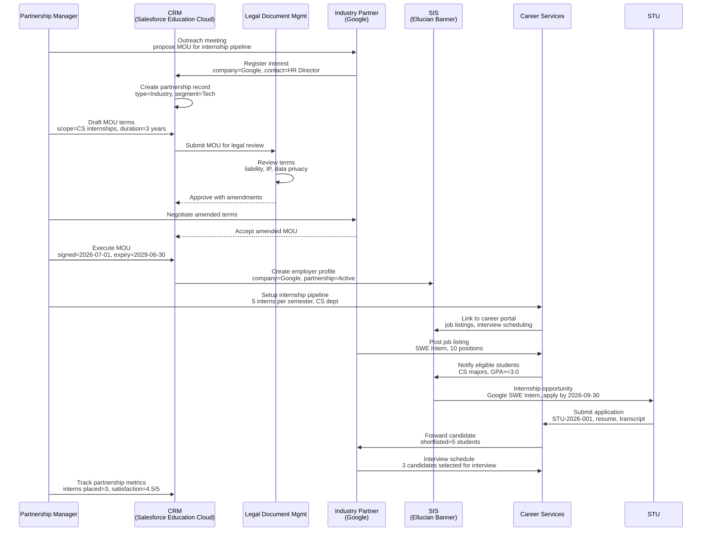
```mermaid
sequenceDiagram
    participant PM as Partnership Manager
    participant CRM as CRM<br/>(Salesforce Education Cloud)
    participant LEGAL as Legal Document Mgmt
    participant PART as Industry Partner<br/>(Google)
    participant SIS as SIS<br/>(Ellucian Banner)
    participant CAREER as Career Services
    PM->>PART: Outreach meeting<br/>propose MOU for internship pipeline
    PART->>CRM: Register interest<br/>company=Google, contact=HR Director
    CRM->>CRM: Create partnership record<br/>type=Industry, segment=Tech
    PM->>CRM: Draft MOU terms<br/>scope=CS internships, duration=3 years
    CRM->>LEGAL: Submit MOU for legal review
    LEGAL->>LEGAL: Review terms<br/>liability, IP, data privacy
    LEGAL-->>CRM: Approve with amendments
    PM->>PART: Negotiate amended terms
    PART-->>CRM: Accept amended MOU
    PM->>CRM: Execute MOU<br/>signed=2026-07-01, expiry=2029-06-30
    CRM->>SIS: Create employer profile<br/>company=Google, partnership=Active
    PM->>CAREER: Setup internship pipeline<br/>5 interns per semester, CS dept
    CAREER->>SIS: Link to career portal<br/>job listings, interview scheduling
    PART->>CAREER: Post job listing<br/>SWE Intern, 10 positions
    CAREER->>SIS: Notify eligible students<br/>CS majors, GPA>=3.0
    SIS->>STU: Internship opportunity<br/>Google SWE Intern, apply by 2026-09-30
    STU->>CAREER: Submit application<br/>STU-2026-001, resume, transcript
    CAREER->>PART: Forward candidate<br/>shortlisted=5 students
    PART->>CAREER: Interview schedule<br/>3 candidates selected for interview
    PM->>CRM: Track partnership metrics<br/>interns placed=3, satisfaction=4.5/5
```

#### Integration Details

| Flow | Entity | Info Flow | Source | Target | Source Conn | Target Conn | Pattern | Complexity |
|------|--------|-----------|--------|--------|-------------|-------------|---------|------------|
| Industry Partnership | Registration | RegisterPartnership | CRM (Salesforce Education Cloud) | CRM (Salesforce Education Cloud) | Internal | Internal | API-led (Real-time) | Simple |
| Industry Partnership | MOU | SubmitMOUForReview | CRM (Salesforce Education Cloud) | Legal Document Mgmt | Salesforce REST API (OAuth2) | DocMgmt API (REST) | API-led (Real-time) | Medium |
| Industry Partnership | Employer | CreateEmployerProfile | CRM (Salesforce Education Cloud) | SIS (Ellucian Banner) | Salesforce REST API (OAuth2) | Banner API (API Key) | Event-driven | Simple |
| Industry Partnership | Internship | SetupInternshipPipeline | Career Services Platform | SIS (Ellucian Banner) | Career API (REST) | Banner API (API Key) | API-led (Real-time) | Medium |
| Industry Partnership | Placement | ForwardCandidate | Career Services Platform | Partner Portal | Career API (REST) | Partner API (OAuth2) | API-led (Real-time) | Medium |
| Industry Partnership | Metrics | TrackPartnershipKPIs | CRM (Salesforce Education Cloud) | BI Platform (Tableau) | Salesforce REST API (OAuth2) | Tableau REST API | Batch (Scheduled) | Simple |

#### Acceptance Criteria

| AC ID | Description | Related Info Flow | Expected Outcome | Priority |
|-------|------------|-------------------|------------------|----------|
| AC-6.3-01 | Data integrity: Registration data transferred from CRM (Salesforce Education Cloud) to CRM (Salesforce Education Cloud) via RegisterPartnership must be complete and consistent | RegisterPartnership | Registration records in CRM (Salesforce Education Cloud) match source; no data loss; reconciliation report confirms accuracy | Medium |
| AC-6.3-02 | Data integrity: MOU data transferred from CRM (Salesforce Education Cloud) to Legal Document Mgmt via SubmitMOUForReview must be complete and consistent | SubmitMOUForReview | MOU records in Legal Document Mgmt match source; no data loss; reconciliation report confirms accuracy | High |
| AC-6.3-03 | Data integrity: Employer data transferred from CRM (Salesforce Education Cloud) to SIS (Ellucian Banner) via CreateEmployerProfile must be complete and consistent | CreateEmployerProfile | Employer records in SIS (Ellucian Banner) match source; no data loss; reconciliation report confirms accuracy | Medium |
| AC-6.3-04 | Data integrity: Internship data transferred from Career Services Platform to SIS (Ellucian Banner) via SetupInternshipPipeline must be complete and consistent | SetupInternshipPipeline | Internship records in SIS (Ellucian Banner) match source; no data loss; reconciliation report confirms accuracy | High |
| AC-6.3-05 | Data integrity: Placement data transferred from Career Services Platform to Partner Portal via ForwardCandidate must be complete and consistent | ForwardCandidate | Placement records in Partner Portal match source; no data loss; reconciliation report confirms accuracy | High |
| AC-6.3-06 | Data integrity: Metrics data transferred from CRM (Salesforce Education Cloud) to BI Platform (Tableau) via TrackPartnershipKPIs must be complete and consistent | TrackPartnershipKPIs | Metrics records in BI Platform (Tableau) match source; no data loss; reconciliation report confirms accuracy | Medium |
| AC-6.3-07 | Error handling: Failed transactions between CRM (Salesforce Education Cloud) and CRM (Salesforce Education Cloud) are logged with error context and trigger automatic retry or alert | RegisterPartnership | Errors logged with timestamp, HTTP status, request payload excerpt; retry up to 3 times; alert sent after consecutive failures | Critical |
| AC-6.3-08 | Security: All endpoints enforce authentication (Career API (REST), Salesforce REST API (OAuth2), ...) and encrypt data in transit via TLS 1.2+ | All flows | Unauthenticated requests rejected with 401; tokens validated per call; invalid/expired tokens logged | Critical |

# Library & Learning Support  - `BC133` `BC135`

Library resource management, digital content delivery, research support, and course resource lists integrated with LMS.

### 7.1 Library Resource Management

**Description:** Library acquires, catalogs, and circulates resources. Course reading lists linked to LMS. Digital resources accessed via portal.

**Actors:** Librarian, Student, Faculty  
**Systems:** Library System, LMS, Student Portal, Discovery Service  

#### Sequence Diagram

```mermaid
sequenceDiagram
    participant LIB as Librarian
    participant LS as Library System<br/>(Ex Libris Alma)
    participant DIS as Discovery Service<br/>(Primo)
    participant LMS as LMS<br/>(Canvas)
    participant PORT as Student Portal
    LIB->>LS: Acquire new resource<br/>ebook=Deep Learning, 5 copies
    LS->>DIS: Publish to discovery
    Faculty->>LS: Create reading list<br/>CS501: 3 textbooks, 5 articles
    LS->>LMS: Push reading list<br/>LTI integration, course=CS501
    Student->>PORT: Search library<br/>keyword=Neural Networks
    PORT->>DIS: Query discovery<br/>search("Neural Networks")
    DIS-->>PORT: 125 results
    Student->>LMS: Access course readings<br/>listID: RL-CS501-Fall2026
    Student->>LS: Checkout ebook<br/>7-day loan
    LS->>LS: Update circulation
    LS->>LMS: Return reading analytics<br/>usage stats for course CS501
```

#### Integration Details

| Flow | Entity | Info Flow | Source | Target | Source Conn | Target Conn | Pattern | Complexity |
|------|--------|-----------|--------|--------|-------------|-------------|---------|------------|
| Library Resource Management | Reading List | PushReadingList | Library System (Ex Libris Alma) | LMS (Canvas) | Alma API (API Key) | Canvas LTI / REST API (OAuth2) | API-led (Real-time) | Medium |
| Library Resource Management | Search Query | SearchDiscovery | Student Portal | Discovery Service (Ex Libris Primo) | Portal REST API | Primo API (API Key) | API-led (Real-time) | Simple |
| Library Resource Management | Usage Analytics | SyncUsageAnalytics | Library System (Ex Libris Alma) | LMS (Canvas) | Alma API (API Key) | Canvas API (OAuth2) | Batch (Scheduled) | Simple |
| Library Resource Management | Acquisition | AcquireLibraryResource | Library System (Ex Libris Alma) | Vendor Portal | Alma API (API Key) | Vendor EDI / REST | API-led (Real-time) | Medium |
| Library Resource Management | Reserve | ManageCourseReserve | Library System (Ex Libris Alma) | LMS (Canvas) | Alma API (API Key) | Canvas LTI / REST API (OAuth2) | API-led (Real-time) | Simple |

#### Acceptance Criteria

| AC ID | Description | Related Info Flow | Expected Outcome | Priority |
|-------|------------|-------------------|------------------|----------|
| AC-7.1-01 | Data integrity: Reading List data transferred from Library System (Ex Libris Alma) to LMS (Canvas) via PushReadingList must be complete and consistent | PushReadingList | Reading List records in LMS (Canvas) match source; no data loss; reconciliation report confirms accuracy | High |
| AC-7.1-02 | Data integrity: Search Query data transferred from Student Portal to Discovery Service (Ex Libris Primo) via SearchDiscovery must be complete and consistent | SearchDiscovery | Search Query records in Discovery Service (Ex Libris Primo) match source; no data loss; reconciliation report confirms accuracy | Medium |
| AC-7.1-03 | Data integrity: Usage Analytics data transferred from Library System (Ex Libris Alma) to LMS (Canvas) via SyncUsageAnalytics must be complete and consistent | SyncUsageAnalytics | Usage Analytics records in LMS (Canvas) match source; no data loss; reconciliation report confirms accuracy | Medium |
| AC-7.1-04 | Data integrity: Acquisition data transferred from Library System (Ex Libris Alma) to Vendor Portal via AcquireLibraryResource must be complete and consistent | AcquireLibraryResource | Acquisition records in Vendor Portal match source; no data loss; reconciliation report confirms accuracy | High |
| AC-7.1-05 | Data integrity: Reserve data transferred from Library System (Ex Libris Alma) to LMS (Canvas) via ManageCourseReserve must be complete and consistent | ManageCourseReserve | Reserve records in LMS (Canvas) match source; no data loss; reconciliation report confirms accuracy | Medium |
| AC-7.1-06 | Error handling: Failed transactions between Library System (Ex Libris Alma) and LMS (Canvas) are logged with error context and trigger automatic retry or alert | PushReadingList | Errors logged with timestamp, HTTP status, request payload excerpt; retry up to 3 times; alert sent after consecutive failures | Critical |
| AC-7.1-07 | Security: All endpoints enforce authentication (Alma API (API Key), Portal REST API, ...) and encrypt data in transit via TLS 1.2+ | All flows | Unauthenticated requests rejected with 401; tokens validated per call; invalid/expired tokens logged | Critical |

---

---

### 7.2 Digital Content Delivery & Course Reserves

**Description:** Library digitizes course materials, manages electronic reserves, delivers content through LMS integration, tracks copyright compliance and usage analytics.

**Actors:** Librarian, Faculty, Student  
**Systems:** Library System (Ex Libris Alma), Course Reserves Module, LMS (Canvas), Copyright Clearance Service, Discovery Service (Primo)

#### Sequence Diagram

```mermaid
sequenceDiagram
    participant LIB as Librarian
    participant LS as Library System<br/>(Ex Libris Alma)
    participant RES as Course Reserves Module
    participant LMS as LMS<br/>(Canvas)
    participant CC as Copyright Clearance
    participant DIS as Discovery<br/>(Primo)
    Faculty->>LS: Submit reserve request<br/>course=CS501, articles=5, chapters=2
    LS->>LS: Check existing holdings<br/>3 of 7 items in collection
    LS->>CC: Check copyright<br/>items for electronic reserve
    CC-->>LS: Clearance obtained<br/>2 items require purchase
    LIB->>LS: Digitize materials<br/>scan, OCR, PDF creation
    LS->>LS: Create electronic reserve<br/>course=CS501, term=Fall2026
    LS->>RES: Link to course reserves
    RES->>LMS: Push to course shell<br/>LTI link, CS501 readings tab
    LMS-->>RES: Reading list live<br/>CS501 - Week 1 readings
    Student->>LMS: Access course reading<br/>Deep Learning Ch.1-3
    LMS->>RES: Authenticate & redirect
    RES-->>LMS: Content served<br/>PDF stream, watermark applied
    Student->>LMS: Continue reading<br/>Chapter 4-6, highlight & annotate
    DIS->>LS: Harvest metadata<br/>for discovery indexing
    LS->>LS: Track usage analytics<br/>CS501: 450 views, 120 downloads
    LS->>CC: Report usage for royalty<br/>pay-per-use: 120 downloads x $0.10
    LIB->>LS: Review reserve stats<br/>most accessed: Ch.3 (85 views)
```

#### Integration Details

| Flow | Entity | Info Flow | Source | Target | Source Conn | Target Conn | Pattern | Complexity |
|------|--------|-----------|--------|--------|-------------|-------------|---------|------------|
| Digital Content | Reserve Request | SubmitReserveRequest | LMS (Canvas) | Library System (Ex Libris Alma) | Canvas LTI API (OAuth2) | Alma API (API Key) | API-led (Real-time) | Simple |
| Digital Content | Copyright | CheckCopyrightClearance | Library System (Ex Libris Alma) | Copyright Clearance Service | Alma API (API Key) | CCC API (REST) | API-led (Real-time) | Medium |
| Digital Content | Reserve | CreateElectronicReserve | Library System (Ex Libris Alma) | Course Reserves Module | Alma API (API Key) | Internal | API-led (Real-time) | Simple |
| Digital Content | Delivery | DeliverContentToLMS | Course Reserves Module | LMS (Canvas) | Reserves REST API | Canvas LTI / REST API (OAuth2) | API-led (Real-time) | Medium |
| Digital Content | Analytics | TrackUsageAnalytics | Library System (Ex Libris Alma) | Library System (Ex Libris Alma) | Internal | Internal | Event-driven | Simple |
| Digital Content | Royalty | ReportUsageForRoyalty | Library System (Ex Libris Alma) | Copyright Clearance Service | Alma API (API Key) | CCC API (REST) | Batch (Scheduled) | Simple |

#### Acceptance Criteria

| AC ID | Description | Related Info Flow | Expected Outcome | Priority |
|-------|------------|-------------------|------------------|----------|
| AC-7.2-01 | Data integrity: Reserve Request data transferred from LMS (Canvas) to Library System (Ex Libris Alma) via SubmitReserveRequest must be complete and consistent | SubmitReserveRequest | Reserve Request records in Library System (Ex Libris Alma) match source; no data loss; reconciliation report confirms accuracy | Medium |
| AC-7.2-02 | Data integrity: Copyright data transferred from Library System (Ex Libris Alma) to Copyright Clearance Service via CheckCopyrightClearance must be complete and consistent | CheckCopyrightClearance | Copyright records in Copyright Clearance Service match source; no data loss; reconciliation report confirms accuracy | High |
| AC-7.2-03 | Data integrity: Reserve data transferred from Library System (Ex Libris Alma) to Course Reserves Module via CreateElectronicReserve must be complete and consistent | CreateElectronicReserve | Reserve records in Course Reserves Module match source; no data loss; reconciliation report confirms accuracy | Medium |
| AC-7.2-04 | Data integrity: Delivery data transferred from Course Reserves Module to LMS (Canvas) via DeliverContentToLMS must be complete and consistent | DeliverContentToLMS | Delivery records in LMS (Canvas) match source; no data loss; reconciliation report confirms accuracy | High |
| AC-7.2-05 | Data integrity: Analytics data transferred from Library System (Ex Libris Alma) to Library System (Ex Libris Alma) via TrackUsageAnalytics must be complete and consistent | TrackUsageAnalytics | Analytics records in Library System (Ex Libris Alma) match source; no data loss; reconciliation report confirms accuracy | Medium |
| AC-7.2-06 | Data integrity: Royalty data transferred from Library System (Ex Libris Alma) to Copyright Clearance Service via ReportUsageForRoyalty must be complete and consistent | ReportUsageForRoyalty | Royalty records in Copyright Clearance Service match source; no data loss; reconciliation report confirms accuracy | Medium |
| AC-7.2-07 | Error handling: Failed transactions between LMS (Canvas) and Library System (Ex Libris Alma) are logged with error context and trigger automatic retry or alert | SubmitReserveRequest | Errors logged with timestamp, HTTP status, request payload excerpt; retry up to 3 times; alert sent after consecutive failures | Critical |
| AC-7.2-08 | Security: All endpoints enforce authentication (Canvas LTI API (OAuth2), Reserves REST API, ...) and encrypt data in transit via TLS 1.2+ | All flows | Unauthenticated requests rejected with 401; tokens validated per call; invalid/expired tokens logged | Critical |

# Enterprise Data & Analytics  - `BC201` `BC135`

Centralized data integration, data warehousing, business intelligence, and institutional reporting across all domains.

### 8.1 Data Integration & Warehousing

**Description:** Data from all source systems (SIS, LMS, HR, Finance, CRM) is ingested, transformed, and loaded into the enterprise data warehouse for reporting and analytics.

**Actors:** Data Engineer, Data Analyst  
**Systems:** SIS, LMS, HRIS, Finance ERP, CRM, Data Warehouse, BI Tool  

#### Sequence Diagram

```mermaid
sequenceDiagram
    participant SIS as SIS<br/>(Ellucian Banner)
    participant LMS as LMS<br/>(Canvas)
    participant HR as HRIS<br/>(Workday HCM)
    participant FIN as Finance<br/>(Workday Financials)
    participant CRM as CRM<br/>(Salesforce)
    participant DW as Data Warehouse<br/>(Snowflake)
    participant BI as BI Tool<br/>(Tableau)
    SIS->>DW: CDC replication<br/>tables: student, course, enrollment, grade
    LMS->>DW: Daily extract<br/>tables: course_activity, assignment, quiz
    HR->>DW: Full refresh<br/>tables: employee, faculty_assignment, payroll
    FIN->>DW: Incremental load<br/>tables: invoice, payment, ledger, budget
    CRM->>DW: Hourly sync<br/>tables: lead, prospect, campaign, alumni
    DW->>DW: Transform & model<br/>star schema: fact_enrollment, dim_student
    BI->>DW: Query data<br/>DAX/MDX: retention, graduation rate
    DW-->>BI: Results
    BI->>BI: Dashboard: Institutional KPIs
    BI->>BI: Report: Student Success Analytics
```

#### Integration Details

| Flow | Entity | Info Flow | Source | Target | Source Conn | Target Conn | Pattern | Complexity |
|------|--------|-----------|--------|--------|-------------|-------------|---------|------------|
| Data Integration & Warehousing | Student Data | ReplicateStudent | SIS (Ellucian Banner) | Data Warehouse (Snowflake) | Banner CDC (HVR/Attunity) | Snowflake JDBC / Snowpipe | Database Replication (CDC) | High |
| Data Integration & Warehousing | Course Activity | ExtractCourseActivity | LMS (Canvas) | Data Warehouse (Snowflake) | Canvas API (OAuth2) | Snowflake JDBC / Snowpipe | Batch (ETL) | Medium |
| Data Integration & Warehousing | Employee Data | SyncEmployee | HRIS (Workday HCM) | Data Warehouse (Snowflake) | Workday API (WS-Security) | Snowflake JDBC / Snowpipe | Batch (ETL) | Medium |
| Data Integration & Warehousing | Financial Data | LoadFinancialData | Finance ERP (Workday Financials) | Data Warehouse (Snowflake) | Workday API (WS-Security) | Snowflake JDBC / Snowpipe | Batch (ETL) | Medium |
| Data Integration & Warehousing | CRM Data | SyncCRMData | CRM (Salesforce Education Cloud) | Data Warehouse (Snowflake) | Salesforce REST API (OAuth2) | Snowflake JDBC / Snowpipe | Batch (ETL) | Medium |
| Data Integration & Warehousing | Metadata | UpdateDataCatalog | Data Warehouse (Snowflake) | Data Catalog (Collibra) | Snowflake JDBC | Collibra API (REST) | Event-driven | Medium |
| Data Integration & Warehousing | Quality | RunDataQualityCheck | Data Warehouse (Snowflake) | Data Quality Tool (Informatica) | Snowflake JDBC | Informatica API (REST) | Batch (ETL) | Medium |

#### Acceptance Criteria

| AC ID | Description | Related Info Flow | Expected Outcome | Priority |
|-------|------------|-------------------|------------------|----------|
| AC-8.1-01 | Data integrity: Student Data data transferred from SIS (Ellucian Banner) to Data Warehouse (Snowflake) via ReplicateStudent must be complete and consistent | ReplicateStudent | Student Data records in Data Warehouse (Snowflake) match source; no data loss; reconciliation report confirms accuracy | Critical |
| AC-8.1-02 | Data integrity: Course Activity data transferred from LMS (Canvas) to Data Warehouse (Snowflake) via ExtractCourseActivity must be complete and consistent | ExtractCourseActivity | Course Activity records in Data Warehouse (Snowflake) match source; no data loss; reconciliation report confirms accuracy | High |
| AC-8.1-03 | Data integrity: Employee Data data transferred from HRIS (Workday HCM) to Data Warehouse (Snowflake) via SyncEmployee must be complete and consistent | SyncEmployee | Employee Data records in Data Warehouse (Snowflake) match source; no data loss; reconciliation report confirms accuracy | High |
| AC-8.1-04 | Data integrity: Financial Data data transferred from Finance ERP (Workday Financials) to Data Warehouse (Snowflake) via LoadFinancialData must be complete and consistent | LoadFinancialData | Financial Data records in Data Warehouse (Snowflake) match source; no data loss; reconciliation report confirms accuracy | High |
| AC-8.1-05 | Data integrity: CRM Data data transferred from CRM (Salesforce Education Cloud) to Data Warehouse (Snowflake) via SyncCRMData must be complete and consistent | SyncCRMData | CRM Data records in Data Warehouse (Snowflake) match source; no data loss; reconciliation report confirms accuracy | High |
| AC-8.1-06 | Data integrity: Metadata data transferred from Data Warehouse (Snowflake) to Data Catalog (Collibra) via UpdateDataCatalog must be complete and consistent | UpdateDataCatalog | Metadata records in Data Catalog (Collibra) match source; no data loss; reconciliation report confirms accuracy | High |
| AC-8.1-07 | Data integrity: Quality data transferred from Data Warehouse (Snowflake) to Data Quality Tool (Informatica) via RunDataQualityCheck must be complete and consistent | RunDataQualityCheck | Quality records in Data Quality Tool (Informatica) match source; no data loss; reconciliation report confirms accuracy | High |
| AC-8.1-08 | Error handling: Failed transactions between SIS (Ellucian Banner) and Data Warehouse (Snowflake) are logged with error context and trigger automatic retry or alert | ReplicateStudent | Errors logged with timestamp, HTTP status, request payload excerpt; retry up to 3 times; alert sent after consecutive failures | Critical |
| AC-8.1-09 | Security: All endpoints enforce authentication (Salesforce REST API (OAuth2), Snowflake JDBC, ...) and encrypt data in transit via TLS 1.2+ | All flows | Unauthenticated requests rejected with 401; tokens validated per call; invalid/expired tokens logged | Critical |

---

---

### 8.2 Institutional Reporting & BI

**Description:** Dashboards and reports for institutional KPIs: enrollment trends, retention rates, graduation rates, financial health, faculty metrics.

**Actors:** Executive, Department Head, Institutional Research  
**Systems:** Data Warehouse, BI Tool, Report Distribution  

#### Sequence Diagram

```mermaid
sequenceDiagram
    participant EXEC as Executive<br/>(Dean / Provost)
    participant BI as BI Tool<br/>(Tableau / Power BI)
    participant DW as Data Warehouse<br/>(Snowflake)
    participant DIST as Report Distribution<br/>(Email / Portal)
    EXEC->>BI: Open dashboard<br/>Institutional KPI Dashboard
    BI->>DW: Query metrics<br/>enrollment trends, retention, graduation
    DW-->>BI: Metrics data
    BI-->>EXEC: Dashboard rendered<br/>enrollment=12,500, retention=87%, grad=68%
    Department Head->>BI: Department drill-down<br/>CS dept: enrollment=1,250
    BI->>DW: Query department facts
    DW-->>BI: Department data
    Institutional Research->>BI: Generate compliance report<br/>IPEDS, accreditation
    BI->>DW: Aggregate queries
    DW-->>BI: Compliance data
    BI->>DIST: Distribute report<br/>PDF emailed to stakeholders
```

#### Integration Details

| Flow | Entity | Info Flow | Source | Target | Source Conn | Target Conn | Pattern | Complexity |
|------|--------|-----------|--------|--------|-------------|-------------|---------|------------|
| Institutional Reporting & BI | Dashboard Metrics | QueryDashboard | BI Tool (Tableau / Power BI) | Data Warehouse (Snowflake) | Tableau Server / Power BI Gateway | Snowflake ODBC / JDBC | API-led (Real-time) | Simple |
| Institutional Reporting & BI | Compliance Report | GenerateComplianceReport | BI Tool (Tableau / Power BI) | Report Distribution (Email / Portal) | Tableau REST API / Power BI API | SMTP / Portal API | Batch (Scheduled) | Medium |
| Institutional Reporting & BI | Data | RefreshDataset | BI Tool (Tableau / Power BI) | Data Warehouse (Snowflake) | Tableau Server API / Power BI API | Snowflake ODBC / JDBC | Batch (Scheduled) | Simple |
| Institutional Reporting & BI | Schedule | ScheduleReportRefresh | BI Tool (Tableau / Power BI) | BI Tool (Tableau / Power BI) | Internal | Internal | Batch (Scheduled) | Simple |

#### Acceptance Criteria

| AC ID | Description | Related Info Flow | Expected Outcome | Priority |
|-------|------------|-------------------|------------------|----------|
| AC-8.2-01 | Data integrity: Dashboard Metrics data transferred from BI Tool (Tableau / Power BI) to Data Warehouse (Snowflake) via QueryDashboard must be complete and consistent | QueryDashboard | Dashboard Metrics records in Data Warehouse (Snowflake) match source; no data loss; reconciliation report confirms accuracy | Medium |
| AC-8.2-02 | Data integrity: Compliance Report data transferred from BI Tool (Tableau / Power BI) to Report Distribution (Email / Portal) via GenerateComplianceReport must be complete and consistent | GenerateComplianceReport | Compliance Report records in Report Distribution (Email / Portal) match source; no data loss; reconciliation report confirms accuracy | High |
| AC-8.2-03 | Data integrity: Data data transferred from BI Tool (Tableau / Power BI) to Data Warehouse (Snowflake) via RefreshDataset must be complete and consistent | RefreshDataset | Data records in Data Warehouse (Snowflake) match source; no data loss; reconciliation report confirms accuracy | Medium |
| AC-8.2-04 | Data integrity: Schedule data transferred from BI Tool (Tableau / Power BI) to BI Tool (Tableau / Power BI) via ScheduleReportRefresh must be complete and consistent | ScheduleReportRefresh | Schedule records in BI Tool (Tableau / Power BI) match source; no data loss; reconciliation report confirms accuracy | Medium |
| AC-8.2-05 | Error handling: Failed transactions between BI Tool (Tableau / Power BI) and Data Warehouse (Snowflake) are logged with error context and trigger automatic retry or alert | QueryDashboard | Errors logged with timestamp, HTTP status, request payload excerpt; retry up to 3 times; alert sent after consecutive failures | Critical |
| AC-8.2-06 | Security: All endpoints enforce authentication (Tableau Server / Power BI Gateway, Tableau Server API / Power BI API, ...) and encrypt data in transit via TLS 1.2+ | All flows | Unauthenticated requests rejected with 401; tokens validated per call; invalid/expired tokens logged | Critical |

---

---

### 8.3 Data Governance & Quality Management

**Description:** Data governance team manages data catalog, quality rules, stewardship, and master data management. Ensures data across all systems is accurate, consistent, and compliant.

**Actors:** Data Steward, Data Quality Analyst, Data Engineer, CIO  
**Systems:** Data Warehouse (Snowflake), Data Catalog (Collibra), Data Quality Tool (Informatica), MDM System, SIS, LMS, HRIS, Compliance Portal

#### Sequence Diagram

```mermaid
sequenceDiagram
    participant DS as Data Steward
    participant CAT as Data Catalog<br/>(Collibra)
    participant DQ as Data Quality<br/>(Informatica)
    participant MDM as MDM System
    participant DW as Data Warehouse<br/>(Snowflake)
    participant COMP as Compliance Portal
    DS->>CAT: Define student data domain<br/>entity=Student, owner=Registrar
    CAT->>CAT: Create business glossary<br/>term=GPA, definition, lineage
    DQ->>DW: Run quality checks<br/>table=dim_student, rules=12
    DW-->>DQ: Quality results<br/>98.5% pass rate, 1,250 records checked
    DQ->>DS: Alert: duplicates found<br/>student_id=STU-2026-001, 2 records
    DS->>MDM: Investigate duplicate<br/>source A=SIS, source B=CRM
    MDM->>MDM: Merge records<br/>survivor=STU-2026-001, golden record
    MDM->>DW: Update master record<br/>STU-2026-001, consolidated
    DS->>CAT: Create data quality rule<br/>rule=unique_student_id, severity=Critical
    CAT->>DQ: Deploy quality rule
    DQ->>DW: Schedule monthly check<br/>first of month, full scan
    DW-->>DQ: 100% unique constraint satisfied
    COMP->>CAT: Request data lineage<br/>for FERPA compliance audit
    CAT->>CAT: Trace lineage<br/>student_email: CRM -> DW -> BI
    CAT-->>COMP: Lineage report<br/>7 systems, 12 transformations
    DS->>CAT: Review data access<br/>STU-2026-001 accessed by 3 users
    CIO->>CAT: Data governance dashboard<br/>quality=96.3%, coverage=89%
```

#### Integration Details

| Flow | Entity | Info Flow | Source | Target | Source Conn | Target Conn | Pattern | Complexity |
|------|--------|-----------|--------|--------|-------------|-------------|---------|------------|
| Data Governance | Glossary | CreateBusinessGlossary | Data Catalog (Collibra) | Data Catalog (Collibra) | Internal | Internal | API-led (Real-time) | Simple |
| Data Governance | Quality | RunDataQualityCheck | Data Quality (Informatica) | Data Warehouse (Snowflake) | Informatica API (REST) | Snowflake JDBC | Batch (Scheduled) | Medium |
| Data Governance | Duplicate | AlertDuplicateRecord | Data Quality (Informatica) | Data Steward Portal | Informatica API (REST) | Workflow API | Event-driven | Simple |
| Data Governance | MDM | MergeDuplicateRecord | MDM System | Data Warehouse (Snowflake) | MDM API (SOAP) | Snowflake JDBC | Batch (ETL) | Medium |
| Data Governance | Lineage | TraceDataLineage | Data Catalog (Collibra) | Compliance Portal | Collibra API (REST) | Compliance API (REST) | API-led (Real-time) | Medium |
| Data Governance | Dashboard | GenerateGovernanceDashboard | Data Catalog (Collibra) | BI Platform (Tableau) | Collibra API (REST) | Tableau REST API | Batch (Scheduled) | Simple |

#### Acceptance Criteria

| AC ID | Description | Related Info Flow | Expected Outcome | Priority |
|-------|------------|-------------------|------------------|----------|
| AC-8.3-01 | Data integrity: Glossary data transferred from Data Catalog (Collibra) to Data Catalog (Collibra) via CreateBusinessGlossary must be complete and consistent | CreateBusinessGlossary | Glossary records in Data Catalog (Collibra) match source; no data loss; reconciliation report confirms accuracy | Medium |
| AC-8.3-02 | Data integrity: Quality data transferred from Data Quality (Informatica) to Data Warehouse (Snowflake) via RunDataQualityCheck must be complete and consistent | RunDataQualityCheck | Quality records in Data Warehouse (Snowflake) match source; no data loss; reconciliation report confirms accuracy | High |
| AC-8.3-03 | Data integrity: Duplicate data transferred from Data Quality (Informatica) to Data Steward Portal via AlertDuplicateRecord must be complete and consistent | AlertDuplicateRecord | Duplicate records in Data Steward Portal match source; no data loss; reconciliation report confirms accuracy | Medium |
| AC-8.3-04 | Data integrity: MDM data transferred from MDM System to Data Warehouse (Snowflake) via MergeDuplicateRecord must be complete and consistent | MergeDuplicateRecord | MDM records in Data Warehouse (Snowflake) match source; no data loss; reconciliation report confirms accuracy | High |
| AC-8.3-05 | Data integrity: Lineage data transferred from Data Catalog (Collibra) to Compliance Portal via TraceDataLineage must be complete and consistent | TraceDataLineage | Lineage records in Compliance Portal match source; no data loss; reconciliation report confirms accuracy | High |
| AC-8.3-06 | Data integrity: Dashboard data transferred from Data Catalog (Collibra) to BI Platform (Tableau) via GenerateGovernanceDashboard must be complete and consistent | GenerateGovernanceDashboard | Dashboard records in BI Platform (Tableau) match source; no data loss; reconciliation report confirms accuracy | Medium |
| AC-8.3-07 | Error handling: Failed transactions between Data Catalog (Collibra) and Data Catalog (Collibra) are logged with error context and trigger automatic retry or alert | CreateBusinessGlossary | Errors logged with timestamp, HTTP status, request payload excerpt; retry up to 3 times; alert sent after consecutive failures | Critical |
| AC-8.3-08 | Security: All endpoints enforce authentication (Collibra API (REST), MDM API (SOAP), ...) and encrypt data in transit via TLS 1.2+ | All flows | Unauthenticated requests rejected with 401; tokens validated per call; invalid/expired tokens logged | Critical |

# Student Services & Wellbeing  - `BC052` `BC019`

Student support services: academic counselling, health and wellbeing, career services, financial guidance, and disability support. These services ensure student retention and success beyond academics.

### 9.1 Student Support & Counselling Services

**Description:** Students submit support requests. Counselling team triages, schedules appointments, manages case notes, tracks outcomes, and escalates as needed.

**Actors:** Student, Counsellor, Student Support Manager  
**Systems:** Student Services CRM (Salesforce Education Cloud), Scheduling System, SIS (Ellucian Banner), Case Management System

#### Sequence Diagram

```mermaid
sequenceDiagram
    participant STU as Student<br/>(John Doe)
    participant CRM as Student Services CRM<br/>(Salesforce)
    participant SCHED as Scheduling System
    participant COUN as Counsellor
    participant SIS as SIS<br/>(Ellucian Banner)
    STU->>CRM: Submit support request<br/>type=Academic Counselling, priority=Medium
    CRM->>CRM: Create case<br/>case_id=SC-2026-042, status=Open
    CRM->>SIS: Load student context<br/>STU-2026-001, GPA=3.75, program=B.Sc. CS
    SIS-->>CRM: Student profile<br/>enrolled=15 credits, no holds
    CRM->>SCHED: Find available slot<br/>counsellor=next available, duration=45min
    SCHED-->>CRM: Slot available<br/>2026-07-08 14:00, counsellor=Sarah
    CRM->>STU: Offer appointment<br/>Academic Counselling, 2026-07-08 14:00
    STU->>CRM: Confirm appointment
    CRM->>SCHED: Book slot<br/>case=SC-2026-042, confirmed
    COUN->>CRM: Prepare for session<br/>review case notes, student history
    STU->>COUN: Attend counselling session<br/>discuss course selection, career goals
    COUN->>CRM: Record case notes<br/>issues=workload mgmt, action=tutoring referral
    COUN->>CRM: Update case status<br/>status=In Progress, follow-up=2 weeks
    COUN->>CRM: Create referral<br/>service=Tutoring Centre, auto-approved
    CRM->>STU: Referral notification<br/>Tutoring Centre, Math block MWF 2-4pm
    STU->>CRM: Session feedback<br/>rating=4.5/5, helpful=Yes
    COUN->>CRM: Close case<br/>status=Resolved, outcome=Strategies provided
```

#### Integration Details

| Flow | Entity | Info Flow | Source | Target | Source Conn | Target Conn | Pattern | Complexity |
|------|--------|-----------|--------|--------|-------------|-------------|---------|------------|
| Student Support | Case | CreateSupportCase | Student Portal | Student Services CRM (Salesforce) | Portal REST API | Salesforce REST API (OAuth2) | API-led (Real-time) | Simple |
| Student Support | Profile | LoadStudentContext | Student Services CRM (Salesforce) | SIS (Ellucian Banner) | Salesforce REST API (OAuth2) | Banner API (API Key) | API-led (Real-time) | Simple |
| Student Support | Appointment | BookCounsellingSlot | Student Services CRM (Salesforce) | Scheduling System | Salesforce REST API (OAuth2) | Scheduling API (REST) | API-led (Real-time) | Medium |
| Student Support | Notes | RecordCaseNotes | Counsellor Portal | Student Services CRM (Salesforce) | Portal REST API | Salesforce REST API (OAuth2) | API-led (Real-time) | Simple |
| Student Support | Referral | CreateReferral | Student Services CRM (Salesforce) | Student Services CRM (Salesforce) | Internal | Internal | Event-driven | Simple |
| Student Support | Feedback | CaptureSessionFeedback | Student Portal | Student Services CRM (Salesforce) | Portal REST API | Salesforce REST API (OAuth2) | API-led (Real-time) | Simple |

#### Acceptance Criteria

| AC ID | Description | Related Info Flow | Expected Outcome | Priority |
|-------|------------|-------------------|------------------|----------|
| AC-9.1-01 | Data integrity: Case data transferred from Student Portal to Student Services CRM (Salesforce) via CreateSupportCase must be complete and consistent | CreateSupportCase | Case records in Student Services CRM (Salesforce) match source; no data loss; reconciliation report confirms accuracy | Medium |
| AC-9.1-02 | Data integrity: Profile data transferred from Student Services CRM (Salesforce) to SIS (Ellucian Banner) via LoadStudentContext must be complete and consistent | LoadStudentContext | Profile records in SIS (Ellucian Banner) match source; no data loss; reconciliation report confirms accuracy | Medium |
| AC-9.1-03 | Data integrity: Appointment data transferred from Student Services CRM (Salesforce) to Scheduling System via BookCounsellingSlot must be complete and consistent | BookCounsellingSlot | Appointment records in Scheduling System match source; no data loss; reconciliation report confirms accuracy | High |
| AC-9.1-04 | Data integrity: Notes data transferred from Counsellor Portal to Student Services CRM (Salesforce) via RecordCaseNotes must be complete and consistent | RecordCaseNotes | Notes records in Student Services CRM (Salesforce) match source; no data loss; reconciliation report confirms accuracy | Medium |
| AC-9.1-05 | Data integrity: Referral data transferred from Student Services CRM (Salesforce) to Student Services CRM (Salesforce) via CreateReferral must be complete and consistent | CreateReferral | Referral records in Student Services CRM (Salesforce) match source; no data loss; reconciliation report confirms accuracy | Medium |
| AC-9.1-06 | Data integrity: Feedback data transferred from Student Portal to Student Services CRM (Salesforce) via CaptureSessionFeedback must be complete and consistent | CaptureSessionFeedback | Feedback records in Student Services CRM (Salesforce) match source; no data loss; reconciliation report confirms accuracy | Medium |
| AC-9.1-07 | Error handling: Failed transactions between Student Portal and Student Services CRM (Salesforce) are logged with error context and trigger automatic retry or alert | CreateSupportCase | Errors logged with timestamp, HTTP status, request payload excerpt; retry up to 3 times; alert sent after consecutive failures | Critical |
| AC-9.1-08 | Security: All endpoints enforce authentication (Salesforce REST API (OAuth2), Internal, ...) and encrypt data in transit via TLS 1.2+ | All flows | Unauthenticated requests rejected with 401; tokens validated per call; invalid/expired tokens logged | Critical |

---

### 9.2 Career Services & Placement

**Description:** Career services team manages job listings, resume workshops, interview preparation, employer networking events, and tracks graduate employment outcomes.

**Actors:** Student, Career Advisor, Employer, Alumni  
**Systems:** Career Services Platform (Handshake), CRM (Salesforce Education Cloud), SIS (Ellucian Banner), Alumni CRM (Blackbaud), LMS (Canvas)

#### Sequence Diagram

```mermaid
sequenceDiagram
    participant STU as Student<br/>(John Doe)
    participant CAREER as Career Services<br/>(Handshake)
    participant CRM as CRM<br/>(Salesforce Education Cloud)
    participant SIS as SIS<br/>(Ellucian Banner)
    participant EMP as Employer<br/>(Google)
    STU->>CAREER: Create profile<br/>STU-2026-001, resume uploaded
    CAREER->>SIS: Verify enrollment<br/>program=B.Sc. CS, year=3, GPA=3.75
    SIS-->>CAREER: Verified<br/>active student, good standing
    CAREER->>CAREER: Suggest opportunities<br/>based on major, skills, preferences
    EMP->>CAREER: Post job listing<br/>SWE Intern, 10 positions, deadline=2026-09-30
    CAREER->>STU: Notify matching listing<br/>SWE Intern @ Google, match=92%
    STU->>CAREER: Submit application<br/>resume, cover letter, transcript
    CAREER->>EMP: Forward application<br/>applicant=STU-2026-001, score=88
    EMP-->>CAREER: Interview selected<br/>STU-2026-001 shortlisted
    CAREER->>STU: Interview invitation<br/>Google SWE, 2026-08-15
    STU->>STU: Attend interview<br/>technical + behavioural rounds
    EMP->>CAREER: Offer extended<br/>STU-2026-001, SWE Intern, start=Jan 2027
    CAREER->>STU: Offer notification<br/>review and accept by 2026-09-01
    STU->>CAREER: Accept offer<br/>placement_id=PL-2026-001
    CAREER->>SIS: Record placement<br/>STU-2026-001, Google, SWE Intern
    CAREER->>CRM: Update student record<br/>placement_confirmed=Yes
    CAREER->>CAREER: Create outcome survey<br/>First Destination Survey
    STU->>CAREER: Complete survey<br/>salary=$8,000/month, satisfaction=5/5
```

#### Integration Details

| Flow | Entity | Info Flow | Source | Target | Source Conn | Target Conn | Pattern | Complexity |
|------|--------|-----------|--------|--------|-------------|-------------|---------|------------|
| Career Services | Profile | CreateStudentProfile | Career Services (Handshake) | SIS (Ellucian Banner) | Handshake API (OAuth2) | Banner API (API Key) | API-led (Real-time) | Simple |
| Career Services | Listing | PostJobListing | Employer Portal | Career Services (Handshake) | Employer API (OAuth2) | Handshake API (OAuth2) | API-led (Real-time) | Simple |
| Career Services | Application | SubmitApplication | Student Portal | Career Services (Handshake) | Portal REST API | Handshake API (OAuth2) | API-led (Real-time) | Simple |
| Career Services | Placement | RecordPlacement | Career Services (Handshake) | SIS (Ellucian Banner) | Handshake API (OAuth2) | Banner API (API Key) | Event-driven | Medium |
| Career Services | Survey | CompleteOutcomeSurvey | Student Portal | Career Services (Handshake) | Portal REST API | Handshake API (OAuth2) | API-led (Real-time) | Simple |
| Career Services | Analytics | TrackPlacementRate | Career Services (Handshake) | BI Platform (Tableau) | Handshake API (OAuth2) | Tableau REST API | Batch (Scheduled) | Simple |

#### Acceptance Criteria

| AC ID | Description | Related Info Flow | Expected Outcome | Priority |
|-------|------------|-------------------|------------------|----------|
| AC-9.2-01 | Data integrity: Profile data transferred from Career Services (Handshake) to SIS (Ellucian Banner) via CreateStudentProfile must be complete and consistent | CreateStudentProfile | Profile records in SIS (Ellucian Banner) match source; no data loss; reconciliation report confirms accuracy | Medium |
| AC-9.2-02 | Data integrity: Listing data transferred from Employer Portal to Career Services (Handshake) via PostJobListing must be complete and consistent | PostJobListing | Listing records in Career Services (Handshake) match source; no data loss; reconciliation report confirms accuracy | Medium |
| AC-9.2-03 | Data integrity: Application data transferred from Student Portal to Career Services (Handshake) via SubmitApplication must be complete and consistent | SubmitApplication | Application records in Career Services (Handshake) match source; no data loss; reconciliation report confirms accuracy | Medium |
| AC-9.2-04 | Data integrity: Placement data transferred from Career Services (Handshake) to SIS (Ellucian Banner) via RecordPlacement must be complete and consistent | RecordPlacement | Placement records in SIS (Ellucian Banner) match source; no data loss; reconciliation report confirms accuracy | High |
| AC-9.2-05 | Data integrity: Survey data transferred from Student Portal to Career Services (Handshake) via CompleteOutcomeSurvey must be complete and consistent | CompleteOutcomeSurvey | Survey records in Career Services (Handshake) match source; no data loss; reconciliation report confirms accuracy | Medium |
| AC-9.2-06 | Data integrity: Analytics data transferred from Career Services (Handshake) to BI Platform (Tableau) via TrackPlacementRate must be complete and consistent | TrackPlacementRate | Analytics records in BI Platform (Tableau) match source; no data loss; reconciliation report confirms accuracy | Medium |
| AC-9.2-07 | Error handling: Failed transactions between Career Services (Handshake) and SIS (Ellucian Banner) are logged with error context and trigger automatic retry or alert | CreateStudentProfile | Errors logged with timestamp, HTTP status, request payload excerpt; retry up to 3 times; alert sent after consecutive failures | Critical |
| AC-9.2-08 | Security: All endpoints enforce authentication (Employer API (OAuth2), Portal REST API, ...) and encrypt data in transit via TLS 1.2+ | All flows | Unauthenticated requests rejected with 401; tokens validated per call; invalid/expired tokens logged | Critical |

---

# Facilities & Campus Operations  - `BC125` `BC114`

Management of physical campus infrastructure: building maintenance, room scheduling and space allocation, security and access control, and ancillary services including catering, printing, and transportation.

### 10.1 Facility Management & Space Allocation

**Description:** Facilities team manages building maintenance requests, room booking and allocation, space utilization tracking, and capital project planning.

**Actors:** Facilities Manager, Department Admin, Vendor, Student  
**Systems:** Facility Management System (Archibus), Room Booking (EMS), SIS (PeopleSoft), Procurement (Coupa), Vendor Portal

#### Sequence Diagram

```mermaid
sequenceDiagram
    participant FM as Facilities Manager
    participant ARCH as Facility Mgmt<br/>(Archibus)
    participant ROOM as Room Booking<br/>(EMS)
    participant SIS as SIS<br/>(PeopleSoft)
    participant VEND as Vendor
    FM->>ARCH: Record building asset<br/>Adams Hall, floor=3, rooms=12
    ARCH->>ARCH: Schedule preventive maint<br/>HVAC check, quarterly
    Dept Admin->>ROOM: Request room booking<br/>CS501 lecture, Mon/Wed 10-11:30, Hall B
    ROOM->>SIS: Check course schedule<br/>CS501: 98 enrolled, room=204
    SIS-->>ROOM: Capacity check<br/>Hall B rm 204: cap=120, OK
    ROOM-->>Dept Admin: Room confirmed<br/>Hall B 204, Fall 2026
    FM->>ARCH: Log maintenance request<br/>room=204, issue=projector bulb
    ARCH->>VEND: Dispatch work order<br/>WO-2026-042, priority=Medium
    VEND-->>ARCH: Service completed<br/>bulb replaced, cost=$150
    FM->>ARCH: Review utilization<br/>room 204: 68% booked, efficiency=Good
    ARCH->>SIS: Optimize scheduling<br/>consolidate low-usage rooms
    Student->>ROOM: Find available room<br/>study group, capacity=10+
    ROOM-->>Student: Room 108 available<br/>Hall B, 7-10pm, capacity=15
```

#### Integration Details

| Flow | Entity | Info Flow | Source | Target | Source Conn | Target Conn | Pattern | Complexity |
|------|--------|-----------|--------|--------|-------------|-------------|---------|------------|
| Facility Management | Asset | RecordBuildingAsset | Facility Mgmt (Archibus) | Facility Mgmt (Archibus) | Internal | Internal | API-led (Real-time) | Simple |
| Facility Management | Room | BookRoom | Room Booking (EMS) | SIS (PeopleSoft Campus Solutions) | EMS Web API (Basic Auth) | PeopleSoft REST API (JWT) | API-led (Real-time) | Medium |
| Facility Management | Maintenance | LogMaintenanceRequest | Facility Mgmt (Archibus) | Vendor Portal | Archibus API (REST) | Vendor API (EDI) | Event-driven | Medium |
| Facility Management | Utilization | ReviewSpaceUtilization | Facility Mgmt (Archibus) | BI Platform (Tableau) | Archibus API (REST) | Tableau REST API | Batch (Scheduled) | Simple |
| Facility Management | Optimize | OptimizeRoomSchedule | Facility Mgmt (Archibus) | SIS (PeopleSoft Campus Solutions) | Archibus API (REST) | PeopleSoft REST API (JWT) | Batch (Scheduled) | Medium |

#### Acceptance Criteria

| AC ID | Description | Related Info Flow | Expected Outcome | Priority |
|-------|------------|-------------------|------------------|----------|
| AC-10.1-01 | Data integrity: Asset data transferred from Facility Mgmt (Archibus) to Facility Mgmt (Archibus) via RecordBuildingAsset must be complete and consistent | RecordBuildingAsset | Asset records in Facility Mgmt (Archibus) match source; no data loss; reconciliation report confirms accuracy | Medium |
| AC-10.1-02 | Data integrity: Room data transferred from Room Booking (EMS) to SIS (PeopleSoft Campus Solutions) via BookRoom must be complete and consistent | BookRoom | Room records in SIS (PeopleSoft Campus Solutions) match source; no data loss; reconciliation report confirms accuracy | High |
| AC-10.1-03 | Data integrity: Maintenance data transferred from Facility Mgmt (Archibus) to Vendor Portal via LogMaintenanceRequest must be complete and consistent | LogMaintenanceRequest | Maintenance records in Vendor Portal match source; no data loss; reconciliation report confirms accuracy | High |
| AC-10.1-04 | Data integrity: Utilization data transferred from Facility Mgmt (Archibus) to BI Platform (Tableau) via ReviewSpaceUtilization must be complete and consistent | ReviewSpaceUtilization | Utilization records in BI Platform (Tableau) match source; no data loss; reconciliation report confirms accuracy | Medium |
| AC-10.1-05 | Data integrity: Optimize data transferred from Facility Mgmt (Archibus) to SIS (PeopleSoft Campus Solutions) via OptimizeRoomSchedule must be complete and consistent | OptimizeRoomSchedule | Optimize records in SIS (PeopleSoft Campus Solutions) match source; no data loss; reconciliation report confirms accuracy | High |
| AC-10.1-06 | Error handling: Failed transactions between Facility Mgmt (Archibus) and Facility Mgmt (Archibus) are logged with error context and trigger automatic retry or alert | RecordBuildingAsset | Errors logged with timestamp, HTTP status, request payload excerpt; retry up to 3 times; alert sent after consecutive failures | Critical |
| AC-10.1-07 | Security: All endpoints enforce authentication (Archibus API (REST), EMS Web API (Basic Auth), ...) and encrypt data in transit via TLS 1.2+ | All flows | Unauthenticated requests rejected with 401; tokens validated per call; invalid/expired tokens logged | Critical |

---

### 10.2 Security & Access Control

**Description:** Security team manages campus access control, visitor management, CCTV monitoring, incident response, and emergency notification systems.

**Actors:** Security Officer, Student, Visitor, Emergency Coordinator  
**Systems:** Access Control System (Lenel), Visitor Mgmt System, CCTV System, Emergency Notification, SIS

#### Sequence Diagram

```mermaid
sequenceDiagram
    participant SEC as Security Officer
    participant ACS as Access Control<br/>(Lenel)
    participant VIS as Visitor Mgmt
    participant CCTV as CCTV System
    participant NOTIF as Emergency Notification
    Student->>ACS: Swipe access card<br/>STU-2026-001, Adams Hall, 08:15
    ACS->>ACS: Validate credential<br/>active student, no restrictions
    ACS->>ACS: Grant access<br/>door=B-204, entry_logged
    Visitor->>VIS: Check-in at reception<br/>name=External Guest, host=Dr. Smith
    VIS->>VIS: Print visitor badge<br/>expiry=2026-07-06 17:00
    VIS->>ACS: Grant temporary access<br/>floor=3, time=09:00-17:00
    CCTV->>SEC: Motion alert<br/>unusual activity, library loading bay
    SEC->>CCTV: Review footage<br/>identify person, assess threat
    SEC->>ACS: Lockdown zone<br/>library east wing, flag=Investigate
    SEC->>NOTIF: Trigger alarm<br/>fire drill, building B, 14:00
    NOTIF->>NOTIF: Broadcast alert<br/>evacuate, assembly point E
    ACS->>ACS: Release all doors<br/>emergency mode, egress enabled
```

#### Integration Details

| Flow | Entity | Info Flow | Source | Target | Source Conn | Target Conn | Pattern | Complexity |
|------|--------|-----------|--------|--------|-------------|-------------|---------|------------|
| Security & Access | Credential | ValidateAccessCard | Access Control (Lenel) | SIS (Ellucian Banner) | Lenel API (SOAP) | Banner API (API Key) | API-led (Real-time) | Medium |
| Security & Access | Visitor | RegisterVisitor | Visitor Mgmt System | Access Control (Lenel) | Visitor API (REST) | Lenel API (SOAP) | API-led (Real-time) | Simple |
| Security & Access | CCTV | ReviewCCTVFootage | CCTV System | Security Console | CCTV API (REST) | Internal | API-led (Real-time) | Simple |
| Security & Access | Lockdown | InitiateLockdown | Security Console | Access Control (Lenel) | Internal | Lenel API (SOAP) | Event-driven | High |
| Security & Access | Emergency | BroadcastEmergencyAlert | Emergency Notification System | Notification Service | ENS API (REST) | Push/SMS/Email | Event-driven | High |

#### Acceptance Criteria

| AC ID | Description | Related Info Flow | Expected Outcome | Priority |
|-------|------------|-------------------|------------------|----------|
| AC-10.2-01 | Data integrity: Credential data transferred from Access Control (Lenel) to SIS (Ellucian Banner) via ValidateAccessCard must be complete and consistent | ValidateAccessCard | Credential records in SIS (Ellucian Banner) match source; no data loss; reconciliation report confirms accuracy | High |
| AC-10.2-02 | Data integrity: Visitor data transferred from Visitor Mgmt System to Access Control (Lenel) via RegisterVisitor must be complete and consistent | RegisterVisitor | Visitor records in Access Control (Lenel) match source; no data loss; reconciliation report confirms accuracy | Medium |
| AC-10.2-03 | Data integrity: CCTV data transferred from CCTV System to Security Console via ReviewCCTVFootage must be complete and consistent | ReviewCCTVFootage | CCTV records in Security Console match source; no data loss; reconciliation report confirms accuracy | Medium |
| AC-10.2-04 | Data integrity: Lockdown data transferred from Security Console to Access Control (Lenel) via InitiateLockdown must be complete and consistent | InitiateLockdown | Lockdown records in Access Control (Lenel) match source; no data loss; reconciliation report confirms accuracy | Critical |
| AC-10.2-05 | Data integrity: Emergency data transferred from Emergency Notification System to Notification Service via BroadcastEmergencyAlert must be complete and consistent | BroadcastEmergencyAlert | Emergency records in Notification Service match source; no data loss; reconciliation report confirms accuracy | Critical |
| AC-10.2-06 | Error handling: Failed transactions between Access Control (Lenel) and SIS (Ellucian Banner) are logged with error context and trigger automatic retry or alert | ValidateAccessCard | Errors logged with timestamp, HTTP status, request payload excerpt; retry up to 3 times; alert sent after consecutive failures | Critical |
| AC-10.2-07 | Security: All endpoints enforce authentication (Internal, Visitor API (REST), ...) and encrypt data in transit via TLS 1.2+ | All flows | Unauthenticated requests rejected with 401; tokens validated per call; invalid/expired tokens logged | Critical |

---

### 10.3 Ancillary Services Management

**Description:** Management of auxiliary services: campus dining, printing/copy centres, bookstores, transportation, and vending services with POS integration and financial reconciliation.

**Actors:** Student, Ancillary Manager, Vendor, Finance  
**Systems:** POS System, Dining Management, Print Management, Finance ERP (Oracle EBS), Student ID/Card System

#### Sequence Diagram

```mermaid
sequenceDiagram
    participant STU as Student
    participant POS as POS System
    participant DINE as Dining Mgmt
    participant PRINT as Print Mgmt
    participant FIN as Finance<br/>(Oracle EBS)
    Student->>POS: Purchase meal<br/>student ID card, Adams Hall Cafeteria
    POS->>POS: Swipe student card<br/>STU-2026-001, meal plan swipe
    POS->>DINE: Record transaction<br/>item=Combo Meal, amount=$8.50
    DINE->>FIN: Daily settlement<br/>total=125 transactions, $1,062.50
    Student->>PRINT: Release print job<br/>student ID, 20 pages B&W
    PRINT->>PRINT: Deduct print quota<br/>20 of 200 remaining
    PRINT->>FIN: Monthly billing<br/>dept=CS, 450 pages, $45.00
    FIN->>FIN: Internal chargeback<br/>dept cost center allocated
    Ancillary Manager->>DINE: Review sales report<br/>top items, revenue by day
    DINE->>DINE: Adjust menu pricing<br/>seasonal update, vendor costs
    FIN->>DINE: Monthly P&L review<br/>revenue=$32,450, COGS=$18,200
    Vendor->>FIN: Submit invoice<br/>catering supplies, PO-2026-301
```

#### Integration Details

| Flow | Entity | Info Flow | Source | Target | Source Conn | Target Conn | Pattern | Complexity |
|------|--------|-----------|--------|--------|-------------|-------------|---------|------------|
| Ancillary Services | Meal | ProcessMealTransaction | POS System | Dining Management System | POS API (REST) | Dining API (REST) | API-led (Real-time) | Simple |
| Ancillary Services | Settlement | DailySettlement | Dining Management System | Finance ERP (Oracle EBS) | Dining API (REST) | Oracle EBS REST API (SOAP) | Batch (Scheduled) | Medium |
| Ancillary Services | Print | ProcessPrintJob | Print Management System | Student ID System | Print API (REST) | Card API | API-led (Real-time) | Simple |
| Ancillary Services | Chargeback | InternalDeptChargeback | Finance ERP (Oracle EBS) | Finance ERP (Oracle EBS) | Internal | Internal | Batch (Scheduled) | Medium |
| Ancillary Services | P&L | MonthlyPnLReview | Dining Management System | Finance ERP (Oracle EBS) | Dining API (REST) | Oracle EBS REST API (SOAP) | Batch (Scheduled) | Simple |

#### Acceptance Criteria

| AC ID | Description | Related Info Flow | Expected Outcome | Priority |
|-------|------------|-------------------|------------------|----------|
| AC-10.3-01 | Data integrity: Meal data transferred from POS System to Dining Management System via ProcessMealTransaction must be complete and consistent | ProcessMealTransaction | Meal records in Dining Management System match source; no data loss; reconciliation report confirms accuracy | Medium |
| AC-10.3-02 | Data integrity: Settlement data transferred from Dining Management System to Finance ERP (Oracle EBS) via DailySettlement must be complete and consistent | DailySettlement | Settlement records in Finance ERP (Oracle EBS) match source; no data loss; reconciliation report confirms accuracy | High |
| AC-10.3-03 | Data integrity: Print data transferred from Print Management System to Student ID System via ProcessPrintJob must be complete and consistent | ProcessPrintJob | Print records in Student ID System match source; no data loss; reconciliation report confirms accuracy | Medium |
| AC-10.3-04 | Data integrity: Chargeback data transferred from Finance ERP (Oracle EBS) to Finance ERP (Oracle EBS) via InternalDeptChargeback must be complete and consistent | InternalDeptChargeback | Chargeback records in Finance ERP (Oracle EBS) match source; no data loss; reconciliation report confirms accuracy | High |
| AC-10.3-05 | Data integrity: P&L data transferred from Dining Management System to Finance ERP (Oracle EBS) via MonthlyPnLReview must be complete and consistent | MonthlyPnLReview | P&L records in Finance ERP (Oracle EBS) match source; no data loss; reconciliation report confirms accuracy | Medium |
| AC-10.3-06 | Error handling: Failed transactions between POS System and Dining Management System are logged with error context and trigger automatic retry or alert | ProcessMealTransaction | Errors logged with timestamp, HTTP status, request payload excerpt; retry up to 3 times; alert sent after consecutive failures | Critical |
| AC-10.3-07 | Security: All endpoints enforce authentication (POS API (REST), Dining API (REST), ...) and encrypt data in transit via TLS 1.2+ | All flows | Unauthenticated requests rejected with 401; tokens validated per call; invalid/expired tokens logged | Critical |

---

# Governance, Risk & Compliance  - `BC160` `BC155`

Institutional governance framework: policy management, accreditation compliance, risk assessment, internal audit, legal services and contract management.

### 11.1 Policy Management & Accreditation

**Description:** Institutional policies created, reviewed, approved and published. Accreditation bodies evaluated. Self-study reports, evidence collection, and site visit coordination managed.

**Actors:** Policy Officer, Compliance Officer, Accreditation Body, Executive  
**Systems:** Policy Management System, Document Mgmt (M-Files), Accreditation Portal, SIS, LMS

#### Sequence Diagram

```mermaid
sequenceDiagram
    participant PO as Policy Officer
    participant POL as Policy Mgmt System
    participant DOC as Document Mgmt<br/>(M-Files)
    participant ACC as Accreditation Portal
    participant SIS as SIS<br/>(Ellucian Banner)
    PO->>POL: Draft new policy<br/>Student Data Privacy Policy, POL-2026-001
    POL->>POL: Workflow routing<br/>legal review -> committee -> exec
    PO->>DOC: Upload supporting docs<br/>FERPA guidelines, GDPR references
    DOC-->>POL: Documents attached
    Executive->>POL: Approve policy<br/>effective=2026-01-01
    POL->>POL: Publish policy<br/>category=Data Governance
    PO->>SIS: Notify stakeholders<br/>all staff, faculty, relevant depts
    ACC->>ACC: Accreditation cycle<br/>ABET review, Computer Science program
    Accreditation Body->>ACC: Request evidence<br/>standard=3, criteria=a-e
    ACC->>SIS: Pull enrollment data<br/>CS program: 350 students
    SIS-->>ACC: Enrollment report
    ACC->>LMS: Pull course artifacts<br/>CS501 syllabi, assessments
    LMS-->>ACC: Course files<br/>SYL-2026-014, 120 graded samples
    ACC->>ACC: Self-study report<br/>strengths=4, weaknesses=2
    Accreditation Body->>ACC: Site visit scheduled<br/>2026-10-15 to 10-17
```

#### Integration Details

| Flow | Entity | Info Flow | Source | Target | Source Conn | Target Conn | Pattern | Complexity |
|------|--------|-----------|--------|--------|-------------|-------------|---------|------------|
| Policy Management | Draft | CreatePolicyDraft | Policy Mgmt System | Document Mgmt (M-Files) | Policy API (REST) | M-Files REST API (API Key) | API-led (Real-time) | Simple |
| Policy Management | Approval | ApprovePolicyWorkflow | Policy Mgmt System | Policy Mgmt System | Internal | Internal | API-led (Real-time) | Medium |
| Policy Management | Notification | NotifyPolicyStakeholders | Policy Mgmt System | SIS (Ellucian Banner) | Policy API (REST) | Banner API (API Key) | Event-driven | Simple |
| Accreditation | Evidence | RequestAccreditationEvidence | Accreditation Portal | SIS (Ellucian Banner) | Accreditation API (REST) | Banner API (API Key) | API-led (Real-time) | Medium |
| Accreditation | Artifacts | PullCourseArtifacts | Accreditation Portal | LMS (Canvas) | Accreditation API (REST) | Canvas API (OAuth2) | Batch (Scheduled) | Medium |
| Accreditation | Report | GenerateSelfStudyReport | Accreditation Portal | Document Mgmt (M-Files) | Accreditation API (REST) | M-Files REST API (API Key) | API-led (Real-time) | High |

#### Acceptance Criteria

| AC ID | Description | Related Info Flow | Expected Outcome | Priority |
|-------|------------|-------------------|------------------|----------|
| AC-11.1-01 | Data integrity: Draft data transferred from Policy Mgmt System to Document Mgmt (M-Files) via CreatePolicyDraft must be complete and consistent | CreatePolicyDraft | Draft records in Document Mgmt (M-Files) match source; no data loss; reconciliation report confirms accuracy | Medium |
| AC-11.1-02 | Data integrity: Approval data transferred from Policy Mgmt System to Policy Mgmt System via ApprovePolicyWorkflow must be complete and consistent | ApprovePolicyWorkflow | Approval records in Policy Mgmt System match source; no data loss; reconciliation report confirms accuracy | High |
| AC-11.1-03 | Data integrity: Notification data transferred from Policy Mgmt System to SIS (Ellucian Banner) via NotifyPolicyStakeholders must be complete and consistent | NotifyPolicyStakeholders | Notification records in SIS (Ellucian Banner) match source; no data loss; reconciliation report confirms accuracy | Medium |
| AC-11.1-04 | Data integrity: Evidence data transferred from Accreditation Portal to SIS (Ellucian Banner) via RequestAccreditationEvidence must be complete and consistent | RequestAccreditationEvidence | Evidence records in SIS (Ellucian Banner) match source; no data loss; reconciliation report confirms accuracy | High |
| AC-11.1-05 | Data integrity: Artifacts data transferred from Accreditation Portal to LMS (Canvas) via PullCourseArtifacts must be complete and consistent | PullCourseArtifacts | Artifacts records in LMS (Canvas) match source; no data loss; reconciliation report confirms accuracy | High |
| AC-11.1-06 | Data integrity: Report data transferred from Accreditation Portal to Document Mgmt (M-Files) via GenerateSelfStudyReport must be complete and consistent | GenerateSelfStudyReport | Report records in Document Mgmt (M-Files) match source; no data loss; reconciliation report confirms accuracy | Critical |
| AC-11.1-07 | Error handling: Failed transactions between Policy Mgmt System and Document Mgmt (M-Files) are logged with error context and trigger automatic retry or alert | CreatePolicyDraft | Errors logged with timestamp, HTTP status, request payload excerpt; retry up to 3 times; alert sent after consecutive failures | Critical |
| AC-11.1-08 | Security: All endpoints enforce authentication (Policy API (REST), Accreditation API (REST), ...) and encrypt data in transit via TLS 1.2+ | All flows | Unauthenticated requests rejected with 401; tokens validated per call; invalid/expired tokens logged | Critical |

---

### 11.2 Risk Management & Audit

**Description:** Enterprise risk management: risk register, control testing, internal audit planning, issue tracking, and management reporting to audit committee.

**Actors:** Risk Officer, Internal Auditor, Department Head, Audit Committee  
**Systems:** Risk Management System (RSA Archer), Audit Management System, SIS, Data Warehouse (Snowflake), BI Platform (Tableau)

#### Sequence Diagram

```mermaid
sequenceDiagram
    participant RO as Risk Officer
    participant RSK as Risk Mgmt<br/>(RSA Archer)
    participant AUD as Internal Audit
    participant SIS as SIS<br/>(Ellucian Banner)
    participant DW as Data Warehouse<br/>(Snowflake)
    RO->>RSK: Identify risk<br/>area=Data Privacy, score=Medium
    RSK->>RSK: Risk assessment<br/>likelihood=3, impact=4, risk_score=12
    RO->>RSK: Define mitigation<br/>encryption, access control, training
    RSK->>SIS: Audit access logs<br/>sensitive data access report
    SIS-->>RSK: 125 users, 3 unauthorized attempts
    RSK->>DW: Analyze breach patterns<br/>fact_access_log, 6 months
    DW-->>RSK: Anomaly report<br/>2 outliers, further investigation
    AUD->>AUD: Plan audit engagement<br/>scope=Data Privacy, period=2025-26
    AUD->>RSK: Request risk register<br/>control test sample size=25
    RSK-->>AUD: Risk register extract<br/>12 risks, 40 controls
    AUD->>AUD: Test controls<br/>24 of 25 effective, 1 improvement
    AUD->>SIS: Verify access controls<br/>sample=25 users, roles, permissions
    SIS-->>AUD: 1 exception found<br/>user has excess privileges
    AUD->>AUD: Draft audit report<br/>findings=3, recommendations=5
    AUD->>Department Head: Management letter<br/>remediate by 2026-09-30
    Department Head->>AUD: Remediation plan<br/>actions=5, owner=CISO
```

#### Integration Details

| Flow | Entity | Info Flow | Source | Target | Source Conn | Target Conn | Pattern | Complexity |
|------|--------|-----------|--------|--------|-------------|-------------|---------|------------|
| Risk Management | Assessment | PerformRiskAssessment | Risk Mgmt (RSA Archer) | Risk Mgmt (RSA Archer) | Internal | Internal | API-led (Real-time) | Medium |
| Risk Management | Log | AuditAccessLogs | Risk Mgmt (RSA Archer) | SIS (Ellucian Banner) | Archer API (SOAP) | Banner API (API Key) | Batch (Scheduled) | Medium |
| Risk Management | Anomaly | AnalyzeBreachPatterns | Risk Mgmt (RSA Archer) | Data Warehouse (Snowflake) | Archer API (SOAP) | Snowflake JDBC | Batch (ETL) | High |
| Audit | Engagement | PlanAuditEngagement | Internal Audit System | Risk Mgmt (RSA Archer) | Audit API (REST) | Archer API (SOAP) | API-led (Real-time) | Simple |
| Audit | Testing | TestControls | Internal Audit System | SIS (Ellucian Banner) | Audit API (REST) | Banner API (API Key) | API-led (Real-time) | Medium |
| Audit | Report | IssueAuditReport | Internal Audit System | BI Platform (Tableau) | Audit API (REST) | Tableau REST API | Batch (Scheduled) | Simple |

#### Acceptance Criteria

| AC ID | Description | Related Info Flow | Expected Outcome | Priority |
|-------|------------|-------------------|------------------|----------|
| AC-11.2-01 | Data integrity: Assessment data transferred from Risk Mgmt (RSA Archer) to Risk Mgmt (RSA Archer) via PerformRiskAssessment must be complete and consistent | PerformRiskAssessment | Assessment records in Risk Mgmt (RSA Archer) match source; no data loss; reconciliation report confirms accuracy | High |
| AC-11.2-02 | Data integrity: Log data transferred from Risk Mgmt (RSA Archer) to SIS (Ellucian Banner) via AuditAccessLogs must be complete and consistent | AuditAccessLogs | Log records in SIS (Ellucian Banner) match source; no data loss; reconciliation report confirms accuracy | High |
| AC-11.2-03 | Data integrity: Anomaly data transferred from Risk Mgmt (RSA Archer) to Data Warehouse (Snowflake) via AnalyzeBreachPatterns must be complete and consistent | AnalyzeBreachPatterns | Anomaly records in Data Warehouse (Snowflake) match source; no data loss; reconciliation report confirms accuracy | Critical |
| AC-11.2-04 | Data integrity: Engagement data transferred from Internal Audit System to Risk Mgmt (RSA Archer) via PlanAuditEngagement must be complete and consistent | PlanAuditEngagement | Engagement records in Risk Mgmt (RSA Archer) match source; no data loss; reconciliation report confirms accuracy | Medium |
| AC-11.2-05 | Data integrity: Testing data transferred from Internal Audit System to SIS (Ellucian Banner) via TestControls must be complete and consistent | TestControls | Testing records in SIS (Ellucian Banner) match source; no data loss; reconciliation report confirms accuracy | High |
| AC-11.2-06 | Data integrity: Report data transferred from Internal Audit System to BI Platform (Tableau) via IssueAuditReport must be complete and consistent | IssueAuditReport | Report records in BI Platform (Tableau) match source; no data loss; reconciliation report confirms accuracy | Medium |
| AC-11.2-07 | Error handling: Failed transactions between Risk Mgmt (RSA Archer) and Risk Mgmt (RSA Archer) are logged with error context and trigger automatic retry or alert | PerformRiskAssessment | Errors logged with timestamp, HTTP status, request payload excerpt; retry up to 3 times; alert sent after consecutive failures | Critical |
| AC-11.2-08 | Security: All endpoints enforce authentication (Archer API (SOAP), Audit API (REST), ...) and encrypt data in transit via TLS 1.2+ | All flows | Unauthenticated requests rejected with 401; tokens validated per call; invalid/expired tokens logged | Critical |

---
