# Higher Education Process Flows — CAUDIT HERM Reference Model

> Generated on 2026-07-06 | Domain: Higher Education | Framework: CAUDIT Higher Education Reference Models (HERM)

## CAUDIT HERM Business Capability Model Reference

The CAUDIT Higher Education Reference Model (HERM) **Business Reference Model v3.2** defines the standard business capabilities for higher education institutions. The table below lists all Level 2 capabilities grouped by Level 1 domain. Each process flow in this document is mapped to its relevant HERM capability codes.

*Source: [CAUDIT Higher Education Reference Models](https://www.ucd.ie/itservices/ea/highereducationreferencemodels/) — used under CC BY-NC-SA 4.0*

### Learning & Teaching

| Capability | Code | Description |
|-----------|------|-------------|
| **Curriculum Management** | `BC001` | Design, develop, and maintain academic programs, courses, and curricula |
| **Curriculum Delivery** | `BC023` | Deliver teaching and learning experiences across modalities |
| **Student Assessment** | `BC028` | Assess, grade, and certify student learning outcomes |

### Research & Innovation

| Capability | Code | Description |
|-----------|------|-------------|
| **Research Opportunities & Planning** | `BC065` | Identify, evaluate, and plan research opportunities and strategy |
| **Research Funding** | `BC071` | Secure, administer, and report on research funding and grants |
| **Research Activity** | `BC074` | Conduct and manage research projects and investigations |
| **Research Dissemination** | `BC086` | Publish, disseminate, and commercialise research outputs |
| **Research Management** | `BC093` | Manage research portfolios, performance, and reporting |
| **Research Assurance** | `BC245` | Ensure research integrity, ethics, and regulatory compliance |

### Student Administration

| Capability | Code | Description |
|-----------|------|-------------|
| **Student Recruitment** | `BC008` | Attract, engage, and recruit prospective students |
| **Student Admission** | `BC014` | Process applications, make admission decisions, and manage offers |
| **Student Enrolment** | `BC019` | Enrol, register, and orient students into programs |
| **Student Management** | `BC044` | Maintain student records, progression, and academic history |
| **Student Support** | `BC052` | Provide wellbeing, academic support, and student services |
| **Completion Management** | `BC032` | Manage graduation, certification, and program completion |

### Corporate Services

| Capability | Code | Description |
|-----------|------|-------------|
| **Financial Management** | `BC184` | Manage budgeting, accounting, procurement, and financial control |
| **Human Resource Management** | `BC171` | Manage workforce planning, recruitment, payroll, and development |
| **Legal Services** | `BC155` | Provide legal counsel, contracts, and compliance advice |
| **Governance Risk & Compliance** | `BC160` | Oversee governance, risk management, audit, and regulatory compliance |
| **Strategy Management** | `BC147` | Develop institutional strategy, planning, and performance monitoring |
| **Business Capability Management** | `BC206` | Manage enterprise architecture and business capability evolution |

### Engagement & Advancement

| Capability | Code | Description |
|-----------|------|-------------|
| **Marketing Management** | `BC107` | Manage brand, communications, and market engagement |
| **Advancement Management** | `BC232` | Manage alumni relations, fundraising, and donor stewardship |
| **Engagement & Relationship Management** | `BC238` | Manage stakeholder engagement, partnerships, and community relations |

### Infrastructure & Operations

| Capability | Code | Description |
|-----------|------|-------------|
| **Facilities & Estate Management** | `BC125` | Manage campus, buildings, space, and physical infrastructure |
| **Supporting Services** | `BC114` | Provide ancillary services (catering, printing, transport, etc.) |

### Information & Library

| Capability | Code | Description |
|-----------|------|-------------|
| **Library Administration** | `BC133` | Manage library collections, access, and information services |
| **Information Management** | `BC135` | Manage information assets, records, and data governance |
| **Publishing Management** | `BC250` | Manage institutional publishing and university press operations |
| **Archive Management** | `BC255` | Preserve and provide access to permanently valuable records |

### Technology

| Capability | Code | Description |
|-----------|------|-------------|
| **ICT Management** | `BC201` | Plan, deliver, and support information and communication technology services |

---

## Table of Contents

- [Student Administration  - BC008, BC014, BC019, BC044, BC052, BC032](#student-administration)
  - [1.1 Student Onboarding (Prospect → Enrollment)](#1.1-student-onboarding-prospect--enrollment)
  - [1.2 Enrollment & Registration](#1.2-enrollment--registration)
- [Student Administration  - BC008, BC014, BC019, BC044, BC052, BC032](#student-administration)
  - [1.3 Academic Records Management](#1.3-academic-records-management)
  - [1.4 Graduation & Certification](#1.4-graduation--certification)
- [Learning & Teaching  - BC001, BC023, BC028](#learning-teaching)
  - [2.1 Curriculum Management](#2.1-curriculum-management)
  - [2.2 Course Delivery & Assessment](#2.2-course-delivery--assessment)
  - [2.3 Timetable & Scheduling](#2.3-timetable--scheduling)
- [HR & Faculty Management  - BC171](#hr-faculty-management)
  - [3.1 Faculty Recruitment](#3.1-faculty-recruitment)
  - [3.2 Payroll & Benefits](#3.2-payroll--benefits)
  - [3.3 Faculty Performance & Development](#3.3-faculty-performance--development)
- [Finance & Resource Management  - BC184](#finance-resource-management)
  - [4.1 Fee Assessment & Billing](#4.1-fee-assessment--billing)
  - [4.2 Financial Aid Management](#4.2-financial-aid-management)
  - [4.3 Procurement & Vendor Management](#4.3-procurement--vendor-management)
- [Research Management  - BC065, BC071, BC074, BC086, BC093, BC245](#research-management)
  - [5.1 Grant Lifecycle Management](#5.1-grant-lifecycle-management)
  - [5.2 Research Outputs & Publishing](#5.2-research-outputs--publishing)
- [Institutional Engagement  - BC107, BC232, BC238](#institutional-engagement)
  - [6.1 Marketing & Student Recruitment](#6.1-marketing--student-recruitment)
  - [6.2 Alumni Relations & Fundraising](#6.2-alumni-relations--fundraising)
- [Library & Learning Support  - BC133, BC135](#library-learning-support)
  - [7.1 Library Resource Management](#7.1-library-resource-management)
- [Enterprise Data & Analytics  - BC201, BC135](#enterprise-data-analytics)
  - [8.1 Data Integration & Warehousing](#8.1-data-integration--warehousing)
  - [8.2 Institutional Reporting & BI](#8.2-institutional-reporting--bi)

## Test Data

The following test data is used consistently across all sequence diagrams:

| Entity | Field | Value |
|--------|-------|-------|
| **Student** | id | STU-2026-001 |
| **Student** | name | John Doe |
| **Student** | email | john.doe@university.edu |
| **Student** | program | B.Sc. Computer Science |
| **Student** | semester | Fall 2026 |
| **Student** | gpa | 3.75 |
| **Prospect** | id | PRO-2026-042 |
| **Prospect** | name | Jane Smith |
| **Prospect** | email | jane.smith@prospect.com |
| **Prospect** | program | M.Sc. Data Science |
| **Prospect** | source | Open Day |
| **Course** | id | CS501 |
| **Course** | title | Artificial Intelligence & ML |
| **Course** | credits | 4 |
| **Course** | instructor | Dr. Sarah Smith |
| **Course** | capacity | 120 |
| **Course** | enrolled | 98 |
| **Faculty** | id | FAC-101 |
| **Faculty** | name | Dr. Sarah Smith |
| **Faculty** | dept | Computer Science |
| **Faculty** | email | sarah.smith@university.edu |
| **Faculty** | hire_date | 2024-08-15 |
| **Faculty** | salary | 95000 |
| **Finance** | fee_amount | 12500.0 |
| **Finance** | scholarship | 2500.0 |
| **Finance** | grant_amount | 5000.0 |
| **Finance** | invoice_no | INV-2026-8901 |
| **Finance** | payment_ref | PAY-7X3K2 |
| **Research** | grant_id | GR-2026-045 |
| **Research** | title | AI-Driven Personalized Learning |
| **Research** | amount | 250000.0 |
| **Research** | sponsor | NSF |
| **Research** | pi | Dr. Sarah Smith |
| **Research** | status | Active |
| **Alumni** | id | ALUM-2019-088 |
| **Alumni** | name | Emily Johnson |
| **Alumni** | grad_year | 2019 |
| **Alumni** | degree | B.Sc. Computer Science |
| **Alumni** | email | emily.j@corp.com |

---

# Student Administration  - `BC008` `BC014` `BC019` `BC044` `BC052` `BC032`

End-to-end management of the student lifecycle from prospect engagement through graduation.

### 1.1 Student Onboarding (Prospect → Enrollment)

**Description:** A prospective student expresses interest, submits an application, is admitted, accepts the offer, enrolls, and registers for courses.

**Actors:** Prospect/Student, Admissions Officer  
**Systems:** CRM, SIS, LMS, Finance, Housing  

#### Sequence Diagram

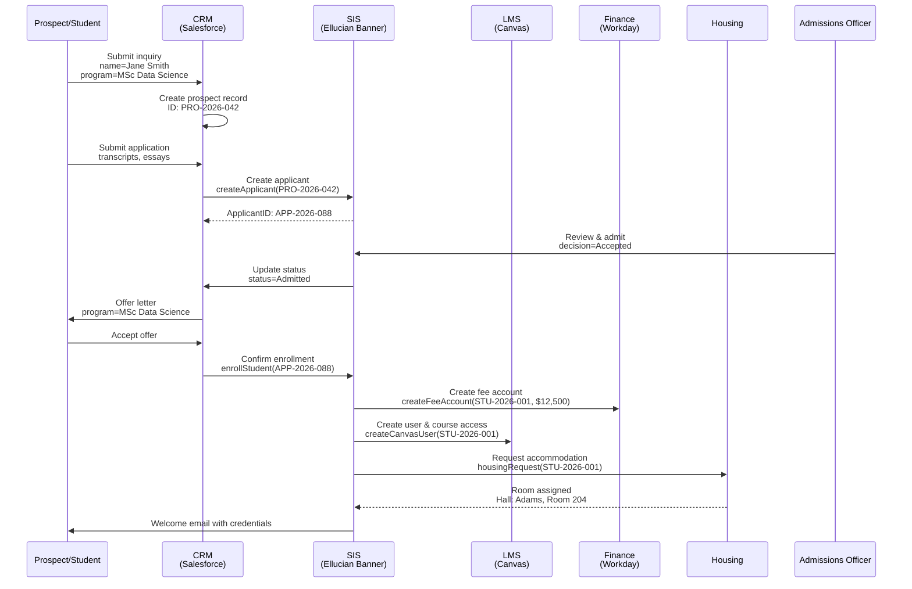
```mermaid
sequenceDiagram
    participant P as Prospect/Student
    participant CRM as CRM<br/>(Salesforce)
    participant SIS as SIS<br/>(Ellucian Banner)
    participant LMS as LMS<br/>(Canvas)
    participant FIN as Finance<br/>(Workday)
    participant HOUS as Housing
    P->>CRM: Submit inquiry<br/>name=Jane Smith<br/>program=MSc Data Science
    CRM->>CRM: Create prospect record<br/>ID: PRO-2026-042
    P->>CRM: Submit application<br/>transcripts, essays
    CRM->>SIS: Create applicant<br/>createApplicant(PRO-2026-042)
    SIS-->>CRM: ApplicantID: APP-2026-088
    Admissions Officer->>SIS: Review & admit<br/>decision=Accepted
    SIS->>CRM: Update status<br/>status=Admitted
    CRM->>P: Offer letter<br/>program=MSc Data Science
    P->>CRM: Accept offer
    CRM->>SIS: Confirm enrollment<br/>enrollStudent(APP-2026-088)
    SIS->>FIN: Create fee account<br/>createFeeAccount(STU-2026-001, $12,500)
    SIS->>LMS: Create user & course access<br/>createCanvasUser(STU-2026-001)
    SIS->>HOUS: Request accommodation<br/>housingRequest(STU-2026-001)
    HOUS-->>SIS: Room assigned<br/>Hall: Adams, Room 204
    SIS->>P: Welcome email with credentials
```

#### Integration Details

| Flow | Entity | Info Flow | Source | Target | Source Conn | Target Conn | Pattern | Complexity |
|------|--------|-----------|--------|--------|-------------|-------------|---------|------------|
| Student Onboarding | Prospect | CreateProspect | CRM (Salesforce Education Cloud) | SIS (Ellucian Banner) | REST API (OAuth2) | REST API (API Key) | API-led (Real-time) | Medium |
| Student Onboarding | Application | SubmitApplication | CRM (Salesforce Education Cloud) | SIS (Ellucian Banner) | REST API (OAuth2) | REST API (API Key) | API-led (Real-time) | Medium |
| Student Onboarding | Student | EnrollStudent | SIS (Ellucian Banner) | LMS (Canvas) | Banner API (Basic Auth) | Canvas API (OAuth2) | Event-driven | Simple |
| Student Onboarding | Fee Account | CreateFeeAccount | SIS (Ellucian Banner) | Finance ERP (Workday Financials) | Banner Workflow (SOAP) | Workday API (WS-Security) | API-led (Real-time) | Medium |
---

### 1.2 Enrollment & Registration

**Description:** Existing students register for courses each semester. System validates prerequisites, checks seat availability, processes fees, and confirms enrollment.

**Actors:** Student, Registrar  
**Systems:** Student Portal, SIS, LMS, Finance  

#### Sequence Diagram

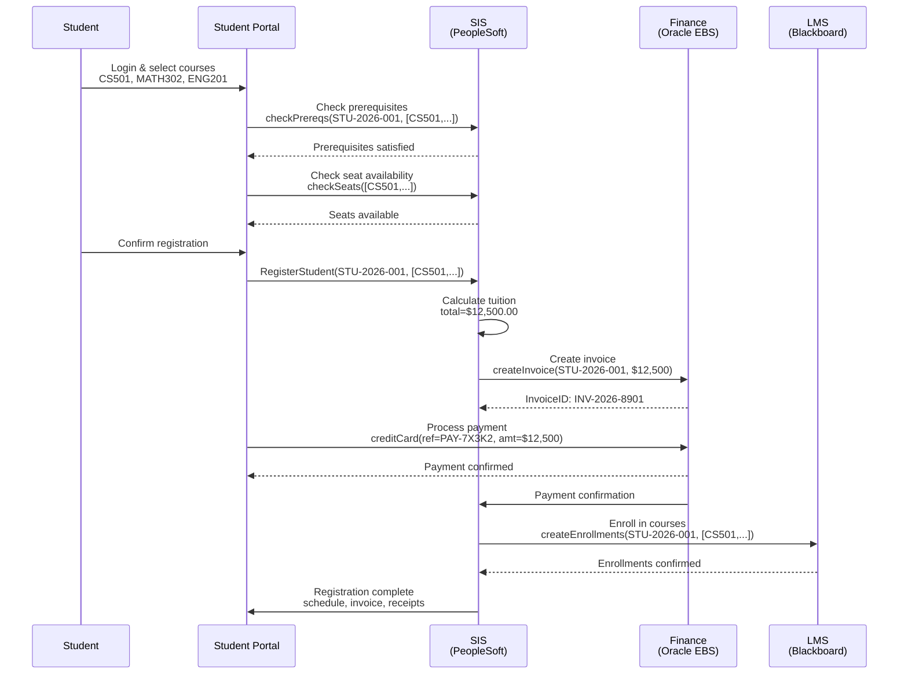
```mermaid
sequenceDiagram
    participant STU as Student
    participant PORT as Student Portal
    participant SIS as SIS<br/>(PeopleSoft)
    participant FIN as Finance<br/>(Oracle EBS)
    participant LMS as LMS<br/>(Blackboard)
    STU->>PORT: Login & select courses<br/>CS501, MATH302, ENG201
    PORT->>SIS: Check prerequisites<br/>checkPrereqs(STU-2026-001, [CS501,...])
    SIS-->>PORT: Prerequisites satisfied
    PORT->>SIS: Check seat availability<br/>checkSeats([CS501,...])
    SIS-->>PORT: Seats available
    STU->>PORT: Confirm registration
    PORT->>SIS: RegisterStudent(STU-2026-001, [CS501,...])
    SIS->>SIS: Calculate tuition<br/>total=$12,500.00
    SIS->>FIN: Create invoice<br/>createInvoice(STU-2026-001, $12,500)
    FIN-->>SIS: InvoiceID: INV-2026-8901
    PORT->>FIN: Process payment<br/>creditCard(ref=PAY-7X3K2, amt=$12,500)
    FIN-->>PORT: Payment confirmed
    FIN->>SIS: Payment confirmation
    SIS->>LMS: Enroll in courses<br/>createEnrollments(STU-2026-001, [CS501,...])
    LMS-->>SIS: Enrollments confirmed
    SIS->>PORT: Registration complete<br/>schedule, invoice, receipts
```

#### Integration Details

| Flow | Entity | Info Flow | Source | Target | Source Conn | Target Conn | Pattern | Complexity |
|------|--------|-----------|--------|--------|-------------|-------------|---------|------------|
| Enrollment & Registration | Course Enrollment | RegisterCourse | Student Portal | SIS (PeopleSoft Campus Solutions) | Portal REST API | PeopleSoft REST API (JWT) | API-led (Real-time) | Simple |
| Enrollment & Registration | Invoice | CreateInvoice | SIS (PeopleSoft Campus Solutions) | Finance ERP (Oracle EBS) | PeopleSoft Integration Broker | Oracle EBS API (SOAP) | API-led (Real-time) | Medium |
| Enrollment & Registration | Payment | ProcessPayment | Payment Gateway (TouchNet) | Finance ERP (Oracle EBS) | Payment Gateway API | Oracle EBS REST API | Event-driven | High |
| Enrollment & Registration | Enrollment | SyncEnrollmentToLMS | SIS (PeopleSoft Campus Solutions) | LMS (Blackboard Learn) | PeopleSoft REST API (JWT) | Blackboard REST API (OAuth2) | Batch (Scheduled) | Simple |
---

# Student Administration  - `BC008` `BC014` `BC019` `BC044` `BC052` `BC032`

### 1.3 Academic Records Management

**Description:** Faculty submit grades. SIS calculates GPA, updates transcripts, notifies students. Transcript requests fulfilled digitally.

**Actors:** Faculty, Student, Registrar  
**Systems:** LMS, SIS, Student Portal, Data Warehouse  

#### Sequence Diagram

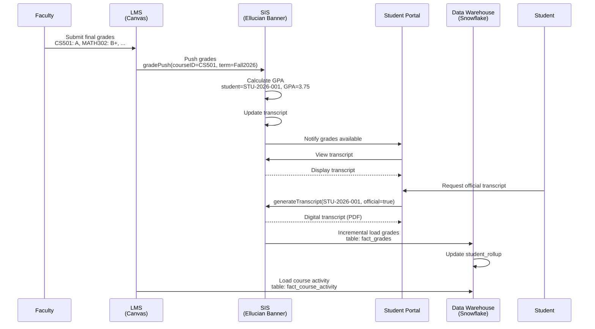
```mermaid
sequenceDiagram
    participant FAC as Faculty
    participant LMS as LMS<br/>(Canvas)
    participant SIS as SIS<br/>(Ellucian Banner)
    participant PORT as Student Portal
    participant DW as Data Warehouse<br/>(Snowflake)
    FAC->>LMS: Submit final grades<br/>CS501: A, MATH302: B+, ...
    LMS->>SIS: Push grades<br/>gradePush(courseID=CS501, term=Fall2026)
    SIS->>SIS: Calculate GPA<br/>student=STU-2026-001, GPA=3.75
    SIS->>SIS: Update transcript
    SIS->>PORT: Notify grades available
    PORT->>SIS: View transcript
    SIS-->>PORT: Display transcript
    Student->>PORT: Request official transcript
    PORT->>SIS: generateTranscript(STU-2026-001, official=true)
    SIS-->>PORT: Digital transcript (PDF)
    SIS->>DW: Incremental load grades<br/>table: fact_grades
    DW->>DW: Update student_rollup
    LMS->>DW: Load course activity<br/>table: fact_course_activity
```

#### Integration Details

| Flow | Entity | Info Flow | Source | Target | Source Conn | Target Conn | Pattern | Complexity |
|------|--------|-----------|--------|--------|-------------|-------------|---------|------------|
| Academic Records | Grade | GradePush | LMS (Canvas) | SIS (Ellucian Banner) | Canvas API (OAuth2) | Banner API (API Key) | Batch (Scheduled) | Simple |
| Academic Records | Transcript | GenerateTranscript | SIS (Ellucian Banner) | Student Portal | Banner REST API | Portal REST API | API-led (Real-time) | Simple |
| Academic Records | Grade | GradeToDW | SIS (Ellucian Banner) | Data Warehouse (Snowflake) | Banner ODBC / CDC | Snowflake JDBC | Batch (ETL) | Medium |
---

### 1.4 Graduation & Certification

**Description:** Students apply to graduate. System audits degree requirements, clears financial holds, confers degree, issues digital diploma.

**Actors:** Student, Registrar  
**Systems:** Student Portal, SIS, Finance, Alumni CRM  

#### Sequence Diagram

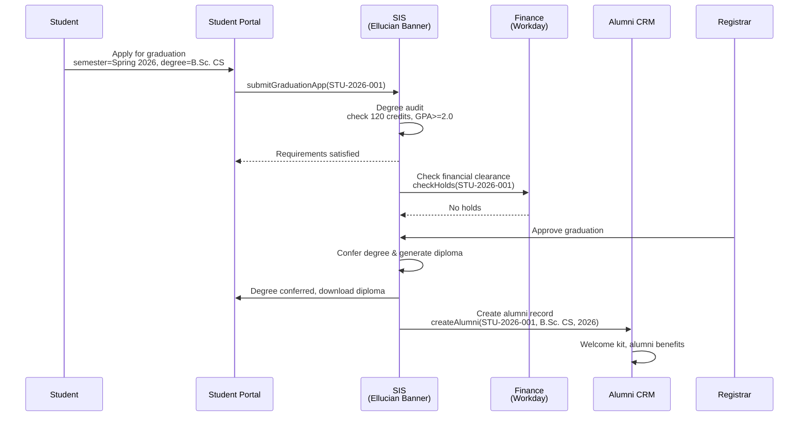
```mermaid
sequenceDiagram
    participant STU as Student
    participant PORT as Student Portal
    participant SIS as SIS<br/>(Ellucian Banner)
    participant FIN as Finance<br/>(Workday)
    participant CRM as Alumni CRM
    STU->>PORT: Apply for graduation<br/>semester=Spring 2026, degree=B.Sc. CS
    PORT->>SIS: submitGraduationApp(STU-2026-001)
    SIS->>SIS: Degree audit<br/>check 120 credits, GPA>=2.0
    SIS-->>PORT: Requirements satisfied
    SIS->>FIN: Check financial clearance<br/>checkHolds(STU-2026-001)
    FIN-->>SIS: No holds
    Registrar->>SIS: Approve graduation
    SIS->>SIS: Confer degree & generate diploma
    SIS->>PORT: Degree conferred, download diploma
    SIS->>CRM: Create alumni record<br/>createAlumni(STU-2026-001, B.Sc. CS, 2026)
    CRM->>CRM: Welcome kit, alumni benefits
```

#### Integration Details

| Flow | Entity | Info Flow | Source | Target | Source Conn | Target Conn | Pattern | Complexity |
|------|--------|-----------|--------|--------|-------------|-------------|---------|------------|
| Graduation & Certification | Graduation Application | SubmitGradApp | Student Portal | SIS (Ellucian Banner) | Portal REST API | Banner REST API (API Key) | API-led (Real-time) | Simple |
| Graduation & Certification | Financial Clearance | CheckFinancialHolds | SIS (Ellucian Banner) | Finance ERP (Workday Financials) | Banner Workflow (SOAP) | Workday API (WS-Security) | API-led (Real-time) | Medium |
| Graduation & Certification | Alumni Record | CreateAlumniRecord | SIS (Ellucian Banner) | Alumni CRM (Blackbaud) | Banner REST API | Blackbaud API (OAuth2) | Event-driven | Simple |
---

# Learning & Teaching  - `BC001` `BC023` `BC028`

Design, develop, deliver, and assess academic programs and courses. Spans curriculum planning, timetable scheduling, delivery, and assessment.

### 2.1 Curriculum Management

**Description:** Academic committees design new programs/courses. Approved curricula published to SIS catalog and LMS.

**Actors:** Curriculum Committee, Dean, Registrar  
**Systems:** Curriculum Mgmt System, SIS, Student Portal, LMS  

#### Sequence Diagram

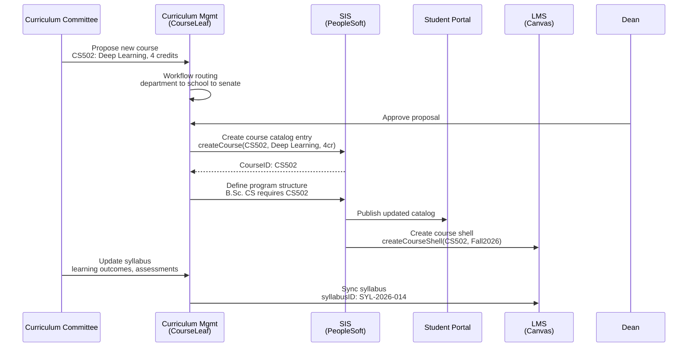
```mermaid
sequenceDiagram
    participant CC as Curriculum Committee
    participant CMS as Curriculum Mgmt<br/>(CourseLeaf)
    participant SIS as SIS<br/>(PeopleSoft)
    participant PORT as Student Portal
    participant LMS as LMS<br/>(Canvas)
    CC->>CMS: Propose new course<br/>CS502: Deep Learning, 4 credits
    CMS->>CMS: Workflow routing<br/>department to school to senate
    Dean->>CMS: Approve proposal
    CMS->>SIS: Create course catalog entry<br/>createCourse(CS502, Deep Learning, 4cr)
    SIS-->>CMS: CourseID: CS502
    CMS->>SIS: Define program structure<br/>B.Sc. CS requires CS502
    SIS->>PORT: Publish updated catalog
    SIS->>LMS: Create course shell<br/>createCourseShell(CS502, Fall2026)
    CC->>CMS: Update syllabus<br/>learning outcomes, assessments
    CMS->>LMS: Sync syllabus<br/>syllabusID: SYL-2026-014
```

#### Integration Details

| Flow | Entity | Info Flow | Source | Target | Source Conn | Target Conn | Pattern | Complexity |
|------|--------|-----------|--------|--------|-------------|-------------|---------|------------|
| Curriculum Management | Course | CreateCourse | Curriculum Mgmt (CourseLeaf) | SIS (PeopleSoft Campus Solutions) | CourseLeaf CIM API | PeopleSoft REST API (JWT) | API-led (Real-time) | Medium |
| Curriculum Management | Course Shell | CreateCourseShell | SIS (PeopleSoft Campus Solutions) | LMS (Canvas) | PeopleSoft REST API (JWT) | Canvas API (OAuth2) | Event-driven | Simple |
| Curriculum Management | Syllabus | SyncSyllabus | Curriculum Mgmt (CourseLeaf) | LMS (Canvas) | CourseLeaf REST API | Canvas API (OAuth2) | Batch (Scheduled) | Simple |
---

### 2.2 Course Delivery & Assessment

**Description:** Courses delivered via LMS. Students submit assignments, take quizzes. Faculty grade and final grades push to SIS.

**Actors:** Student, Faculty  
**Systems:** LMS, Assessment Tool, SIS  

#### Sequence Diagram

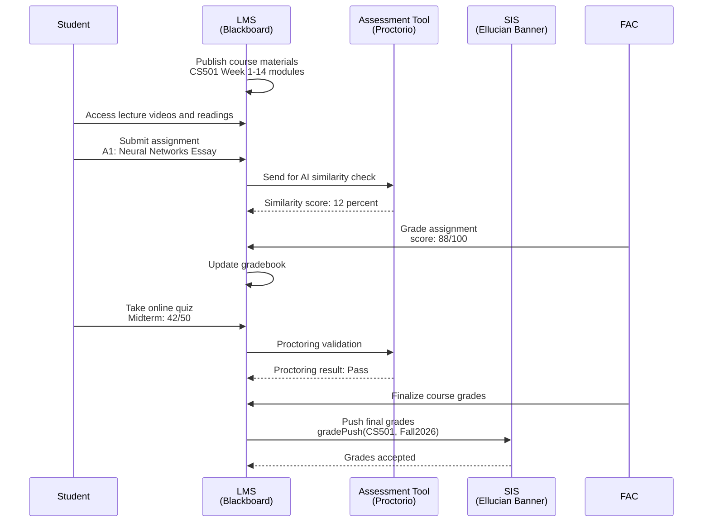
```mermaid
sequenceDiagram
    participant STU as Student
    participant LMS as LMS<br/>(Blackboard)
    participant ASSESS as Assessment Tool<br/>(Proctorio)
    participant SIS as SIS<br/>(Ellucian Banner)
    LMS->>LMS: Publish course materials<br/>CS501 Week 1-14 modules
    STU->>LMS: Access lecture videos and readings
    STU->>LMS: Submit assignment<br/>A1: Neural Networks Essay
    LMS->>ASSESS: Send for AI similarity check
    ASSESS-->>LMS: Similarity score: 12 percent
    FAC->>LMS: Grade assignment<br/>score: 88/100
    LMS->>LMS: Update gradebook
    STU->>LMS: Take online quiz<br/>Midterm: 42/50
    LMS->>ASSESS: Proctoring validation
    ASSESS-->>LMS: Proctoring result: Pass
    FAC->>LMS: Finalize course grades
    LMS->>SIS: Push final grades<br/>gradePush(CS501, Fall2026)
    SIS-->>LMS: Grades accepted
```

#### Integration Details

| Flow | Entity | Info Flow | Source | Target | Source Conn | Target Conn | Pattern | Complexity |
|------|--------|-----------|--------|--------|-------------|-------------|---------|------------|
| Course Delivery & Assessment | Assignment Submission | SubmitAssignment | LMS (Blackboard Learn) | Assessment Tool (Proctorio) | Blackboard REST API (OAuth2) | Proctorio API (API Key) | API-led (Real-time) | Medium |
| Course Delivery & Assessment | Final Grade | GradePushToSIS | LMS (Blackboard Learn) | SIS (Ellucian Banner) | Blackboard REST API (OAuth2) | Banner API (API Key) | Batch (Scheduled) | Simple |
---

### 2.3 Timetable & Scheduling

**Description:** Schedulers create master timetable, assign rooms, check conflicts, publish schedules.

**Actors:** Scheduler, Faculty, Student  
**Systems:** Scheduling Engine, SIS, Room Booking, Portal  

#### Sequence Diagram

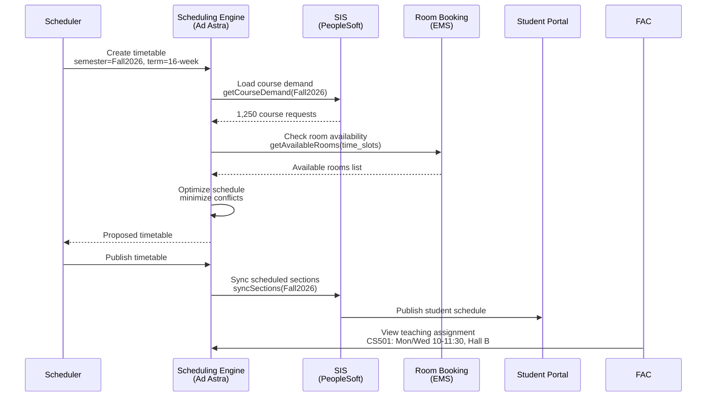
```mermaid
sequenceDiagram
    participant SCH as Scheduler
    participant ENG as Scheduling Engine<br/>(Ad Astra)
    participant SIS as SIS<br/>(PeopleSoft)
    participant ROOM as Room Booking<br/>(EMS)
    participant PORT as Student Portal
    SCH->>ENG: Create timetable<br/>semester=Fall2026, term=16-week
    ENG->>SIS: Load course demand<br/>getCourseDemand(Fall2026)
    SIS-->>ENG: 1,250 course requests
    ENG->>ROOM: Check room availability<br/>getAvailableRooms(time_slots)
    ROOM-->>ENG: Available rooms list
    ENG->>ENG: Optimize schedule<br/>minimize conflicts
    ENG-->>SCH: Proposed timetable
    SCH->>ENG: Publish timetable
    ENG->>SIS: Sync scheduled sections<br/>syncSections(Fall2026)
    SIS->>PORT: Publish student schedule
    FAC->>ENG: View teaching assignment<br/>CS501: Mon/Wed 10-11:30, Hall B
```

#### Integration Details

| Flow | Entity | Info Flow | Source | Target | Source Conn | Target Conn | Pattern | Complexity |
|------|--------|-----------|--------|--------|-------------|-------------|---------|------------|
| Timetable & Scheduling | Course Demand | LoadCourseDemand | SIS (PeopleSoft Campus Solutions) | Scheduling Engine (Ad Astra) | PeopleSoft REST API (JWT) | Ad Astra API (API Key) | Batch (Scheduled) | Simple |
| Timetable & Scheduling | Room Availability | CheckRoomAvailability | Scheduling Engine (Ad Astra) | Room Booking (EMS) | Ad Astra REST API | EMS Web API (Basic Auth) | API-led (Real-time) | Medium |
| Timetable & Scheduling | Scheduled Section | SyncSections | Scheduling Engine (Ad Astra) | SIS (PeopleSoft Campus Solutions) | Ad Astra REST API | PeopleSoft REST API (JWT) | Batch (Scheduled) | Simple |
---

# HR & Faculty Management  - `BC171`

Full lifecycle of faculty and staff: recruitment, onboarding, payroll, performance management, professional development.

### 3.1 Faculty Recruitment

**Description:** Departments request new positions. HR posts job, screens applicants, coordinates interviews, manages offer/acceptance.

**Actors:** Hiring Manager, HR, Candidate  
**Systems:** HRIS, ATS, Finance, SIS  

#### Sequence Diagram

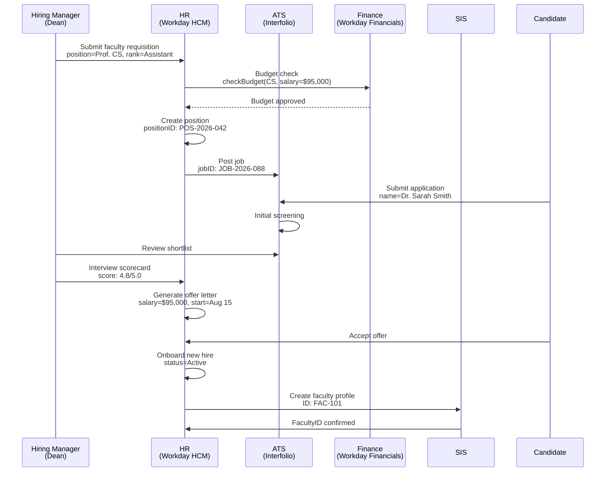
```mermaid
sequenceDiagram
    participant HM as Hiring Manager<br/>(Dean)
    participant HR as HR<br/>(Workday HCM)
    participant ATS as ATS<br/>(Interfolio)
    participant FIN as Finance<br/>(Workday Financials)
    participant SIS as SIS
    HM->>HR: Submit faculty requisition<br/>position=Prof. CS, rank=Assistant
    HR->>FIN: Budget check<br/>checkBudget(CS, salary=$95,000)
    FIN-->>HR: Budget approved
    HR->>HR: Create position<br/>positionID: POS-2026-042
    HR->>ATS: Post job<br/>jobID: JOB-2026-088
    Candidate->>ATS: Submit application<br/>name=Dr. Sarah Smith
    ATS->>ATS: Initial screening
    HM->>ATS: Review shortlist
    HM->>HR: Interview scorecard<br/>score: 4.8/5.0
    HR->>HR: Generate offer letter<br/>salary=$95,000, start=Aug 15
    Candidate->>HR: Accept offer
    HR->>HR: Onboard new hire<br/>status=Active
    HR->>SIS: Create faculty profile<br/>ID: FAC-101
    SIS->>HR: FacultyID confirmed
```

#### Integration Details

| Flow | Entity | Info Flow | Source | Target | Source Conn | Target Conn | Pattern | Complexity |
|------|--------|-----------|--------|--------|-------------|-------------|---------|------------|
| Faculty Recruitment | Position Requisition | SubmitRequisition | HRIS (Workday HCM) | Finance ERP (Workday Financials) | Workday API (WS-Security) | Workday API (WS-Security) | API-led (Real-time) | Simple |
| Faculty Recruitment | Job Posting | PostJob | HRIS (Workday HCM) | ATS (Interfolio) | Workday Recruiting API | Interfolio API (OAuth2) | API-led (Real-time) | Medium |
| Faculty Recruitment | Faculty Profile | CreateFacultyProfile | HRIS (Workday HCM) | SIS (Ellucian Banner) | Workday API (WS-Security) | Banner API (API Key) | Event-driven | Simple |
---

### 3.2 Payroll & Benefits

**Description:** Monthly payroll: time/attendance to payroll, calculations, payslips, GL journal entries.

**Actors:** Faculty, HR, Finance  
**Systems:** HRIS, Payroll, Finance, Time Tracking  

#### Sequence Diagram

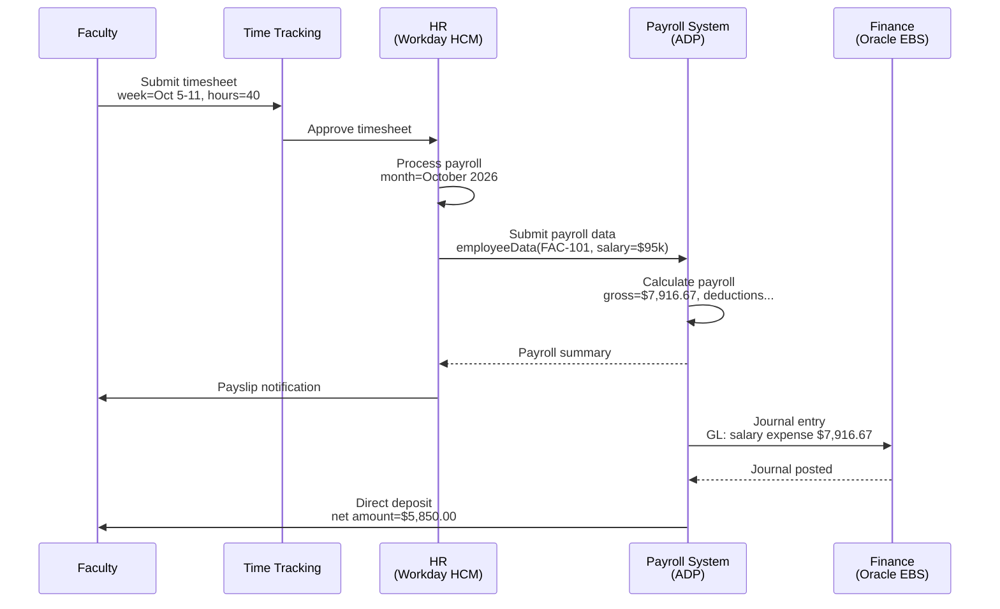
```mermaid
sequenceDiagram
    participant FAC as Faculty
    participant TIME as Time Tracking
    participant HR as HR<br/>(Workday HCM)
    participant PAY as Payroll System<br/>(ADP)
    participant FIN as Finance<br/>(Oracle EBS)
    FAC->>TIME: Submit timesheet<br/>week=Oct 5-11, hours=40
    TIME->>HR: Approve timesheet
    HR->>HR: Process payroll<br/>month=October 2026
    HR->>PAY: Submit payroll data<br/>employeeData(FAC-101, salary=$95k)
    PAY->>PAY: Calculate payroll<br/>gross=$7,916.67, deductions...
    PAY-->>HR: Payroll summary
    HR->>FAC: Payslip notification
    PAY->>FIN: Journal entry<br/>GL: salary expense $7,916.67
    FIN-->>PAY: Journal posted
    PAY->>FAC: Direct deposit<br/>net amount=$5,850.00
```

#### Integration Details

| Flow | Entity | Info Flow | Source | Target | Source Conn | Target Conn | Pattern | Complexity |
|------|--------|-----------|--------|--------|-------------|-------------|---------|------------|
| Payroll & Benefits | Timesheet | SubmitTimesheet | Time Tracking System | HRIS (Workday HCM) | Time API (REST) | Workday API (WS-Security) | API-led (Real-time) | Simple |
| Payroll & Benefits | Payroll Data | SubmitPayroll | HRIS (Workday HCM) | Payroll System (ADP) | Workday Payroll Interface | ADP API (SFTP) | Batch (Scheduled) | High |
| Payroll & Benefits | Journal Entry | PostGLJournal | Payroll System (ADP) | Finance ERP (Oracle EBS) | ADP GL Interface (SFTP) | Oracle EBS REST API (SOAP) | Batch (Scheduled) | Medium |
---

### 3.3 Faculty Performance & Development

**Description:** Performance reviews, professional development, tenure tracking with inputs from SIS and LMS.

**Actors:** Faculty, Department Chair, HR  
**Systems:** HRIS, LMS, SIS, Development Platform  

#### Sequence Diagram

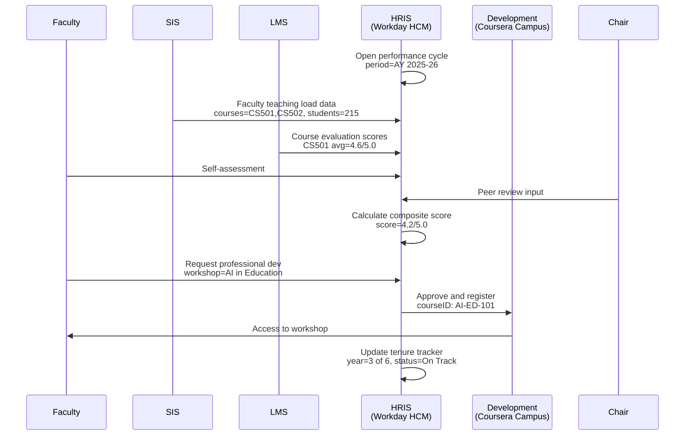
```mermaid
sequenceDiagram
    participant FAC as Faculty
    participant SIS as SIS
    participant LMS as LMS
    participant HR as HRIS<br/>(Workday HCM)
    participant DEV as Development<br/>(Coursera Campus)
    HR->>HR: Open performance cycle<br/>period=AY 2025-26
    SIS->>HR: Faculty teaching load data<br/>courses=CS501,CS502, students=215
    LMS->>HR: Course evaluation scores<br/>CS501 avg=4.6/5.0
    FAC->>HR: Self-assessment
    Chair->>HR: Peer review input
    HR->>HR: Calculate composite score<br/>score=4.2/5.0
    FAC->>HR: Request professional dev<br/>workshop=AI in Education
    HR->>DEV: Approve and register<br/>courseID: AI-ED-101
    DEV->>FAC: Access to workshop
    HR->>HR: Update tenure tracker<br/>year=3 of 6, status=On Track
```

#### Integration Details

| Flow | Entity | Info Flow | Source | Target | Source Conn | Target Conn | Pattern | Complexity |
|------|--------|-----------|--------|--------|-------------|-------------|---------|------------|
| Faculty Performance & Development | Teaching Load | GetTeachingLoad | SIS (Ellucian Banner) | HRIS (Workday HCM) | Banner REST API | Workday API (WS-Security) | Batch (Scheduled) | Simple |
| Faculty Performance & Development | Course Evaluation | SyncEvalScores | LMS (Canvas) | HRIS (Workday HCM) | Canvas API (OAuth2) | Workday API (WS-Security) | Batch (Scheduled) | Medium |
| Faculty Performance & Development | Development Request | ApproveTraining | HRIS (Workday HCM) | Development Platform (Coursera Campus) | Workday API (WS-Security) | Coursera API (OAuth2) | API-led (Real-time) | Simple |
---

# Finance & Resource Management  - `BC184`

Manage financial resources: student fees, financial aid, procurement, budgeting, general ledger.

### 4.1 Fee Assessment & Billing

**Description:** Student fees assessed per term. Invoices generated, payments processed, holds cleared.

**Actors:** Student, Finance, Bursar  
**Systems:** SIS, Finance ERP, Payment Gateway, Student Portal  

#### Sequence Diagram

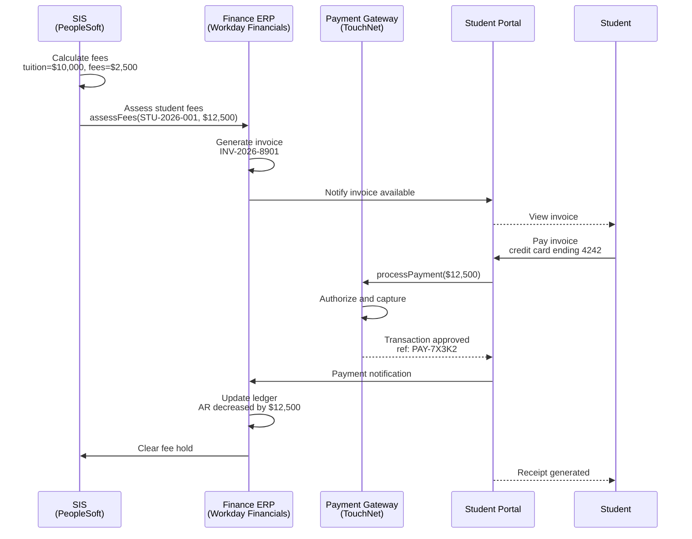
```mermaid
sequenceDiagram
    participant SIS as SIS<br/>(PeopleSoft)
    participant FIN as Finance ERP<br/>(Workday Financials)
    participant PG as Payment Gateway<br/>(TouchNet)
    participant PORT as Student Portal
    SIS->>SIS: Calculate fees<br/>tuition=$10,000, fees=$2,500
    SIS->>FIN: Assess student fees<br/>assessFees(STU-2026-001, $12,500)
    FIN->>FIN: Generate invoice<br/>INV-2026-8901
    FIN->>PORT: Notify invoice available
    PORT-->>Student: View invoice
    Student->>PORT: Pay invoice<br/>credit card ending 4242
    PORT->>PG: processPayment($12,500)
    PG->>PG: Authorize and capture
    PG-->>PORT: Transaction approved<br/>ref: PAY-7X3K2
    PORT->>FIN: Payment notification
    FIN->>FIN: Update ledger<br/>AR decreased by $12,500
    FIN->>SIS: Clear fee hold
    PORT-->>Student: Receipt generated
```

#### Integration Details

| Flow | Entity | Info Flow | Source | Target | Source Conn | Target Conn | Pattern | Complexity |
|------|--------|-----------|--------|--------|-------------|-------------|---------|------------|
| Fee Assessment & Billing | Student Fee | AssessFees | SIS (PeopleSoft Campus Solutions) | Finance ERP (Workday Financials) | PeopleSoft Integration Broker | Workday API (WS-Security) | API-led (Real-time) | Medium |
| Fee Assessment & Billing | Payment | ProcessPayment | Payment Gateway (TouchNet) | Finance ERP (Workday Financials) | TouchNet API | Workday API (WS-Security) | Event-driven | High |
| Fee Assessment & Billing | Fee Hold | ClearFeeHold | Finance ERP (Workday Financials) | SIS (PeopleSoft Campus Solutions) | Workday API (WS-Security) | PeopleSoft REST API (JWT) | Event-driven | Medium |
---

### 4.2 Financial Aid Management

**Description:** Students apply for aid. System determines eligibility, packages aid, disburses funds.

**Actors:** Student, Financial Aid Officer, Finance  
**Systems:** Financial Aid System, SIS, Finance ERP, Government Portal  

#### Sequence Diagram

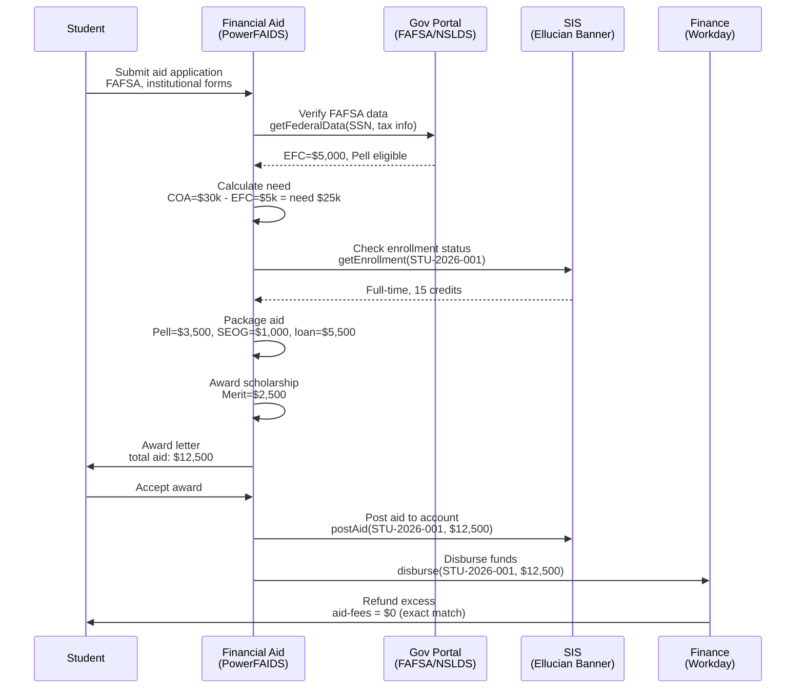
```mermaid
sequenceDiagram
    participant STU as Student
    participant FAN as Financial Aid<br/>(PowerFAIDS)
    participant GOV as Gov Portal<br/>(FAFSA/NSLDS)
    participant SIS as SIS<br/>(Ellucian Banner)
    participant FIN as Finance<br/>(Workday)
    STU->>FAN: Submit aid application<br/>FAFSA, institutional forms
    FAN->>GOV: Verify FAFSA data<br/>getFederalData(SSN, tax info)
    GOV-->>FAN: EFC=$5,000, Pell eligible
    FAN->>FAN: Calculate need<br/>COA=$30k - EFC=$5k = need $25k
    FAN->>SIS: Check enrollment status<br/>getEnrollment(STU-2026-001)
    SIS-->>FAN: Full-time, 15 credits
    FAN->>FAN: Package aid<br/>Pell=$3,500, SEOG=$1,000, loan=$5,500
    FAN->>FAN: Award scholarship<br/>Merit=$2,500
    FAN->>STU: Award letter<br/>total aid: $12,500
    STU->>FAN: Accept award
    FAN->>SIS: Post aid to account<br/>postAid(STU-2026-001, $12,500)
    FAN->>FIN: Disburse funds<br/>disburse(STU-2026-001, $12,500)
    FIN->>STU: Refund excess<br/>aid-fees = $0 (exact match)
```

#### Integration Details

| Flow | Entity | Info Flow | Source | Target | Source Conn | Target Conn | Pattern | Complexity |
|------|--------|-----------|--------|--------|-------------|-------------|---------|------------|
| Financial Aid Management | FAFSA Data | VerifyFAFSA | Financial Aid System (PowerFAIDS) | Government Portal (FAFSA/NSLDS) | PowerFAIDS API | NSLDS Web Services (SOAP) | API-led (Real-time) | High |
| Financial Aid Management | Enrollment Status | CheckEnrollment | Financial Aid System (PowerFAIDS) | SIS (Ellucian Banner) | PowerFAIDS REST API | Banner API (API Key) | API-led (Real-time) | Simple |
| Financial Aid Management | Aid Disbursement | DisburseAid | Financial Aid System (PowerFAIDS) | Finance ERP (Workday Financials) | PowerFAIDS REST API | Workday API (WS-Security) | Event-driven | Medium |
---

### 4.3 Procurement & Vendor Management

**Description:** Departments submit requisitions. Procurement processes POs, confirms receipt, matches invoices.

**Actors:** Department Admin, Procurement, Finance, Vendor  
**Systems:** Procurement System, Finance ERP, Vendor Portal  

#### Sequence Diagram

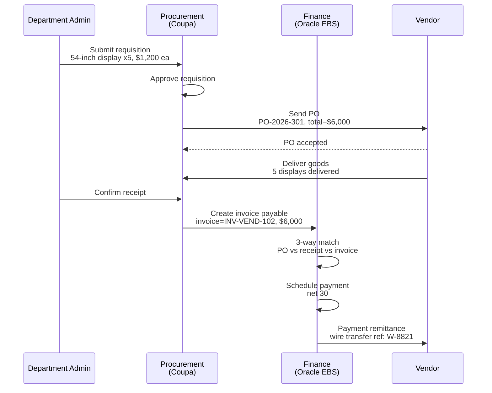
```mermaid
sequenceDiagram
    participant DEPT as Department Admin
    participant PROC as Procurement<br/>(Coupa)
    participant FIN as Finance<br/>(Oracle EBS)
    participant VEND as Vendor
    DEPT->>PROC: Submit requisition<br/>54-inch display x5, $1,200 ea
    PROC->>PROC: Approve requisition
    PROC->>VEND: Send PO<br/>PO-2026-301, total=$6,000
    VEND-->>PROC: PO accepted
    VEND->>PROC: Deliver goods<br/>5 displays delivered
    DEPT->>PROC: Confirm receipt
    PROC->>FIN: Create invoice payable<br/>invoice=INV-VEND-102, $6,000
    FIN->>FIN: 3-way match<br/>PO vs receipt vs invoice
    FIN->>FIN: Schedule payment<br/>net 30
    FIN->>VEND: Payment remittance<br/>wire transfer ref: W-8821
```

#### Integration Details

| Flow | Entity | Info Flow | Source | Target | Source Conn | Target Conn | Pattern | Complexity |
|------|--------|-----------|--------|--------|-------------|-------------|---------|------------|
| Procurement & Vendor Management | Purchase Order | SendPO | Procurement System (Coupa) | Vendor Portal | Coupa API (OAuth2) | Vendor cXML / EDI | API-led (Real-time) | High |
| Procurement & Vendor Management | Invoice | SyncInvoice | Procurement System (Coupa) | Finance ERP (Oracle EBS) | Coupa API (OAuth2) | Oracle EBS REST API (SOAP) | Batch (Scheduled) | Medium |
---

# Research Management  - `BC065` `BC071` `BC074` `BC086` `BC093` `BC245`

Full research lifecycle: opportunity discovery, grant applications, award management, project execution, publication, compliance.

### 5.1 Grant Lifecycle Management

**Description:** Researchers identify funding, submit proposals, manage awarded grants, track expenditures, report to sponsors.

**Actors:** Researcher, Research Admin, Finance, Sponsor  
**Systems:** Research Admin, Finance ERP, Compliance, Sponsor Portal  

#### Sequence Diagram

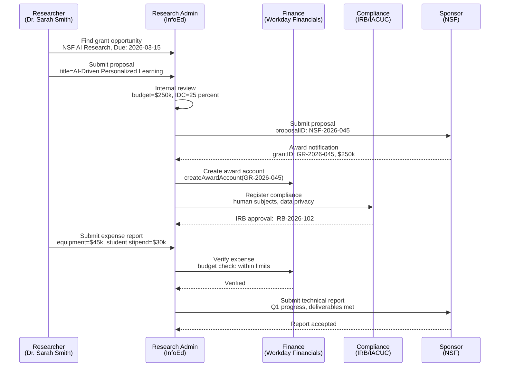
```mermaid
sequenceDiagram
    participant RES as Researcher<br/>(Dr. Sarah Smith)
    participant RAD as Research Admin<br/>(InfoEd)
    participant FIN as Finance<br/>(Workday Financials)
    participant COMP as Compliance<br/>(IRB/IACUC)
    participant SPON as Sponsor<br/>(NSF)
    RES->>RAD: Find grant opportunity<br/>NSF AI Research, Due: 2026-03-15
    RES->>RAD: Submit proposal<br/>title=AI-Driven Personalized Learning
    RAD->>RAD: Internal review<br/>budget=$250k, IDC=25 percent
    RAD->>SPON: Submit proposal<br/>proposalID: NSF-2026-045
    SPON-->>RAD: Award notification<br/>grantID: GR-2026-045, $250k
    RAD->>FIN: Create award account<br/>createAwardAccount(GR-2026-045)
    RAD->>COMP: Register compliance<br/>human subjects, data privacy
    COMP-->>RAD: IRB approval: IRB-2026-102
    RES->>RAD: Submit expense report<br/>equipment=$45k, student stipend=$30k
    RAD->>FIN: Verify expense<br/>budget check: within limits
    FIN-->>RAD: Verified
    RAD->>SPON: Submit technical report<br/>Q1 progress, deliverables met
    SPON-->>RAD: Report accepted
```

#### Integration Details

| Flow | Entity | Info Flow | Source | Target | Source Conn | Target Conn | Pattern | Complexity |
|------|--------|-----------|--------|--------|-------------|-------------|---------|------------|
| Grant Lifecycle Management | Proposal | SubmitProposal | Research Admin (InfoEd) | Sponsor Portal (NSF FastLane) | InfoEd API (OAuth2) | NSF FastLane API (Research.gov SOAP) | API-led (Real-time) | High |
| Grant Lifecycle Management | Award Account | CreateAwardAccount | Research Admin (InfoEd) | Finance ERP (Workday Financials) | InfoEd API (OAuth2) | Workday API (WS-Security) | Event-driven | Medium |
| Grant Lifecycle Management | Compliance | RegisterCompliance | Research Admin (InfoEd) | Compliance System (IRB Manager) | InfoEd REST API | IRB Manager API (API Key) | API-led (Real-time) | Simple |
| Grant Lifecycle Management | Expense | VerifyExpense | Research Admin (InfoEd) | Finance ERP (Workday Financials) | InfoEd API (OAuth2) | Workday API (WS-Security) | API-led (Real-time) | Medium |
---

### 5.2 Research Outputs & Publishing

**Description:** Researchers publish findings. Publications tracked in institutional repository and linked to grants.

**Actors:** Researcher, Library, Publisher  
**Systems:** Research Admin, Institutional Repository, Publisher Portal  

#### Sequence Diagram

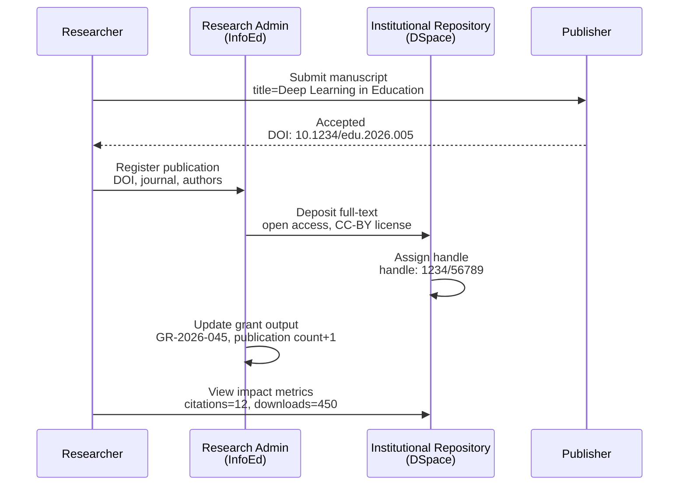
```mermaid
sequenceDiagram
    participant RES as Researcher
    participant RAD as Research Admin<br/>(InfoEd)
    participant REPO as Institutional Repository<br/>(DSpace)
    participant PUB as Publisher
    RES->>PUB: Submit manuscript<br/>title=Deep Learning in Education
    PUB-->>RES: Accepted<br/>DOI: 10.1234/edu.2026.005
    RES->>RAD: Register publication<br/>DOI, journal, authors
    RAD->>REPO: Deposit full-text<br/>open access, CC-BY license
    REPO->>REPO: Assign handle<br/>handle: 1234/56789
    RAD->>RAD: Update grant output<br/>GR-2026-045, publication count+1
    RES->>REPO: View impact metrics<br/>citations=12, downloads=450
```

#### Integration Details

| Flow | Entity | Info Flow | Source | Target | Source Conn | Target Conn | Pattern | Complexity |
|------|--------|-----------|--------|--------|-------------|-------------|---------|------------|
| Research Outputs & Publishing | Publication | RegisterPublication | Research Admin (InfoEd) | Institutional Repository (DSpace) | InfoEd API (OAuth2) | DSpace REST API (API Key) | API-led (Real-time) | Simple |
| Research Outputs & Publishing | Grant Output | UpdateGrantOutput | Research Admin (InfoEd) | Research Admin (InfoEd) | Internal | Internal | API-led (Real-time) | Simple |
---

# Institutional Engagement  - `BC107` `BC232` `BC238`

Marketing, recruitment, alumni relations, fundraising, and community partnerships.

### 6.1 Marketing & Student Recruitment

**Description:** Marketing campaigns generate prospects. Inquiries route to CRM for nurturing. Events tracked. Applications originate from recruitment activities.

**Actors:** Marketing Team, Prospective Student, Admissions  
**Systems:** Marketing Automation, CRM, CMS, Event Mgmt  

#### Sequence Diagram

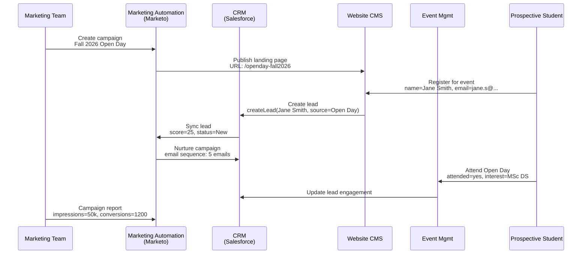
```mermaid
sequenceDiagram
    participant MKT as Marketing Team
    participant MA as Marketing Automation<br/>(Marketo)
    participant CRM as CRM<br/>(Salesforce)
    participant CMS as Website CMS
    participant EVT as Event Mgmt
    MKT->>MA: Create campaign<br/>Fall 2026 Open Day
    MA->>CMS: Publish landing page<br/>URL: /openday-fall2026
    Prospective Student->>CMS: Register for event<br/>name=Jane Smith, email=jane.s@...
    CMS->>CRM: Create lead<br/>createLead(Jane Smith, source=Open Day)
    CRM->>MA: Sync lead<br/>score=25, status=New
    MA->>CRM: Nurture campaign<br/>email sequence: 5 emails
    Prospective Student->>EVT: Attend Open Day<br/>attended=yes, interest=MSc DS
    EVT->>CRM: Update lead engagement
    MKT->>MA: Campaign report<br/>impressions=50k, conversions=1200
```

#### Integration Details

| Flow | Entity | Info Flow | Source | Target | Source Conn | Target Conn | Pattern | Complexity |
|------|--------|-----------|--------|--------|-------------|-------------|---------|------------|
| Marketing & Recruitment | Lead | CreateLead | Website CMS | CRM (Salesforce Education Cloud) | Webhook / REST API | Salesforce REST API (OAuth2) | Event-driven | Simple |
| Marketing & Recruitment | Campaign Lead | SyncCampaignLead | CRM (Salesforce Education Cloud) | Marketing Automation (Marketo) | Salesforce REST API (OAuth2) | Marketo REST API (OAuth2) | Batch (Scheduled) | Medium |
| Marketing & Recruitment | Event Engagement | UpdateEventEngagement | Event Mgmt System | CRM (Salesforce Education Cloud) | Event API (REST) | Salesforce REST API (OAuth2) | API-led (Real-time) | Simple |
---

### 6.2 Alumni Relations & Fundraising

**Description:** Alumni records maintained. Fundraising campaigns target donors. Donations processed and receipts issued.

**Actors:** Alumni, Development Officer, Finance  
**Systems:** Alumni CRM, Fundraising Platform, Finance ERP  

#### Sequence Diagram

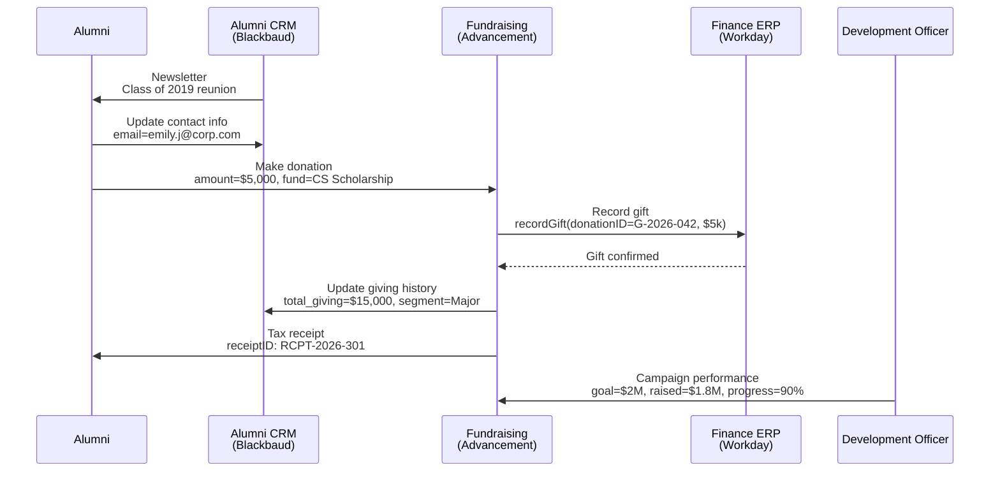
```mermaid
sequenceDiagram
    participant ALUM as Alumni
    participant CRM as Alumni CRM<br/>(Blackbaud)
    participant FUND as Fundraising<br/>(Advancement)
    participant FIN as Finance ERP<br/>(Workday)
    CRM->>ALUM: Newsletter<br/>Class of 2019 reunion
    ALUM->>CRM: Update contact info<br/>email=emily.j@corp.com
    ALUM->>FUND: Make donation<br/>amount=$5,000, fund=CS Scholarship
    FUND->>FIN: Record gift<br/>recordGift(donationID=G-2026-042, $5k)
    FIN-->>FUND: Gift confirmed
    FUND->>CRM: Update giving history<br/>total_giving=$15,000, segment=Major
    FUND->>ALUM: Tax receipt<br/>receiptID: RCPT-2026-301
    Development Officer->>FUND: Campaign performance<br/>goal=$2M, raised=$1.8M, progress=90%
```

#### Integration Details

| Flow | Entity | Info Flow | Source | Target | Source Conn | Target Conn | Pattern | Complexity |
|------|--------|-----------|--------|--------|-------------|-------------|---------|------------|
| Alumni Relations & Fundraising | Donation | RecordGift | Fundraising Platform (Advancement) | Finance ERP (Workday Financials) | Advancement API (OAuth2) | Workday API (WS-Security) | API-led (Real-time) | Medium |
| Alumni Relations & Fundraising | Giving History | SyncGivingHistory | Fundraising Platform (Advancement) | Alumni CRM (Blackbaud) | Advancement API (OAuth2) | Blackbaud API (OAuth2) | Event-driven | Simple |
---

# Library & Learning Support  - `BC133` `BC135`

Library resource management, digital content delivery, research support, and course resource lists integrated with LMS.

### 7.1 Library Resource Management

**Description:** Library acquires, catalogs, and circulates resources. Course reading lists linked to LMS. Digital resources accessed via portal.

**Actors:** Librarian, Student, Faculty  
**Systems:** Library System, LMS, Student Portal, Discovery Service  

#### Sequence Diagram

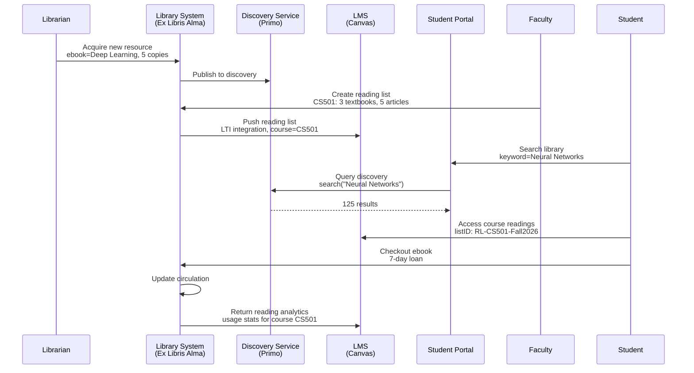
```mermaid
sequenceDiagram
    participant LIB as Librarian
    participant LS as Library System<br/>(Ex Libris Alma)
    participant DIS as Discovery Service<br/>(Primo)
    participant LMS as LMS<br/>(Canvas)
    participant PORT as Student Portal
    LIB->>LS: Acquire new resource<br/>ebook=Deep Learning, 5 copies
    LS->>DIS: Publish to discovery
    Faculty->>LS: Create reading list<br/>CS501: 3 textbooks, 5 articles
    LS->>LMS: Push reading list<br/>LTI integration, course=CS501
    Student->>PORT: Search library<br/>keyword=Neural Networks
    PORT->>DIS: Query discovery<br/>search("Neural Networks")
    DIS-->>PORT: 125 results
    Student->>LMS: Access course readings<br/>listID: RL-CS501-Fall2026
    Student->>LS: Checkout ebook<br/>7-day loan
    LS->>LS: Update circulation
    LS->>LMS: Return reading analytics<br/>usage stats for course CS501
```

#### Integration Details

| Flow | Entity | Info Flow | Source | Target | Source Conn | Target Conn | Pattern | Complexity |
|------|--------|-----------|--------|--------|-------------|-------------|---------|------------|
| Library Resource Management | Reading List | PushReadingList | Library System (Ex Libris Alma) | LMS (Canvas) | Alma API (API Key) | Canvas LTI / REST API (OAuth2) | API-led (Real-time) | Medium |
| Library Resource Management | Search Query | SearchDiscovery | Student Portal | Discovery Service (Ex Libris Primo) | Portal REST API | Primo API (API Key) | API-led (Real-time) | Simple |
| Library Resource Management | Usage Analytics | SyncUsageAnalytics | Library System (Ex Libris Alma) | LMS (Canvas) | Alma API (API Key) | Canvas API (OAuth2) | Batch (Scheduled) | Simple |
---

# Enterprise Data & Analytics  - `BC201` `BC135`

Centralized data integration, data warehousing, business intelligence, and institutional reporting across all domains.

### 8.1 Data Integration & Warehousing

**Description:** Data from all source systems (SIS, LMS, HR, Finance, CRM) is ingested, transformed, and loaded into the enterprise data warehouse for reporting and analytics.

**Actors:** Data Engineer, Data Analyst  
**Systems:** SIS, LMS, HRIS, Finance ERP, CRM, Data Warehouse, BI Tool  

#### Sequence Diagram

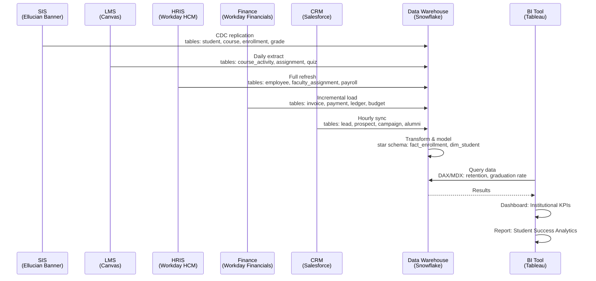
```mermaid
sequenceDiagram
    participant SIS as SIS<br/>(Ellucian Banner)
    participant LMS as LMS<br/>(Canvas)
    participant HR as HRIS<br/>(Workday HCM)
    participant FIN as Finance<br/>(Workday Financials)
    participant CRM as CRM<br/>(Salesforce)
    participant DW as Data Warehouse<br/>(Snowflake)
    participant BI as BI Tool<br/>(Tableau)
    SIS->>DW: CDC replication<br/>tables: student, course, enrollment, grade
    LMS->>DW: Daily extract<br/>tables: course_activity, assignment, quiz
    HR->>DW: Full refresh<br/>tables: employee, faculty_assignment, payroll
    FIN->>DW: Incremental load<br/>tables: invoice, payment, ledger, budget
    CRM->>DW: Hourly sync<br/>tables: lead, prospect, campaign, alumni
    DW->>DW: Transform & model<br/>star schema: fact_enrollment, dim_student
    BI->>DW: Query data<br/>DAX/MDX: retention, graduation rate
    DW-->>BI: Results
    BI->>BI: Dashboard: Institutional KPIs
    BI->>BI: Report: Student Success Analytics
```

#### Integration Details

| Flow | Entity | Info Flow | Source | Target | Source Conn | Target Conn | Pattern | Complexity |
|------|--------|-----------|--------|--------|-------------|-------------|---------|------------|
| Data Integration & Warehousing | Student Data | ReplicateStudent | SIS (Ellucian Banner) | Data Warehouse (Snowflake) | Banner CDC (HVR/Attunity) | Snowflake JDBC / Snowpipe | Database Replication (CDC) | High |
| Data Integration & Warehousing | Course Activity | ExtractCourseActivity | LMS (Canvas) | Data Warehouse (Snowflake) | Canvas API (OAuth2) | Snowflake JDBC / Snowpipe | Batch (ETL) | Medium |
| Data Integration & Warehousing | Employee Data | SyncEmployee | HRIS (Workday HCM) | Data Warehouse (Snowflake) | Workday API (WS-Security) | Snowflake JDBC / Snowpipe | Batch (ETL) | Medium |
| Data Integration & Warehousing | Financial Data | LoadFinancialData | Finance ERP (Workday Financials) | Data Warehouse (Snowflake) | Workday API (WS-Security) | Snowflake JDBC / Snowpipe | Batch (ETL) | Medium |
| Data Integration & Warehousing | CRM Data | SyncCRMData | CRM (Salesforce Education Cloud) | Data Warehouse (Snowflake) | Salesforce REST API (OAuth2) | Snowflake JDBC / Snowpipe | Batch (ETL) | Medium |
---

### 8.2 Institutional Reporting & BI

**Description:** Dashboards and reports for institutional KPIs: enrollment trends, retention rates, graduation rates, financial health, faculty metrics.

**Actors:** Executive, Department Head, Institutional Research  
**Systems:** Data Warehouse, BI Tool, Report Distribution  

#### Sequence Diagram

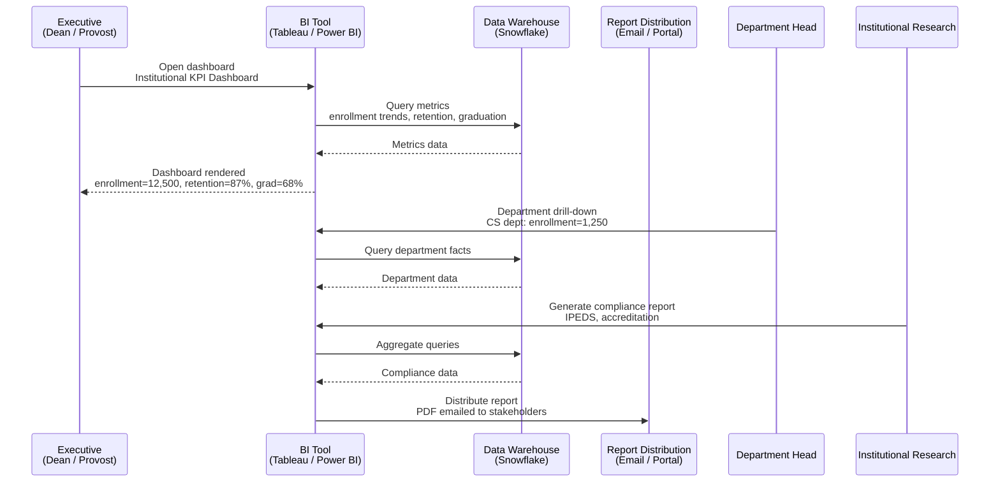
```mermaid
sequenceDiagram
    participant EXEC as Executive<br/>(Dean / Provost)
    participant BI as BI Tool<br/>(Tableau / Power BI)
    participant DW as Data Warehouse<br/>(Snowflake)
    participant DIST as Report Distribution<br/>(Email / Portal)
    EXEC->>BI: Open dashboard<br/>Institutional KPI Dashboard
    BI->>DW: Query metrics<br/>enrollment trends, retention, graduation
    DW-->>BI: Metrics data
    BI-->>EXEC: Dashboard rendered<br/>enrollment=12,500, retention=87%, grad=68%
    Department Head->>BI: Department drill-down<br/>CS dept: enrollment=1,250
    BI->>DW: Query department facts
    DW-->>BI: Department data
    Institutional Research->>BI: Generate compliance report<br/>IPEDS, accreditation
    BI->>DW: Aggregate queries
    DW-->>BI: Compliance data
    BI->>DIST: Distribute report<br/>PDF emailed to stakeholders
```

#### Integration Details

| Flow | Entity | Info Flow | Source | Target | Source Conn | Target Conn | Pattern | Complexity |
|------|--------|-----------|--------|--------|-------------|-------------|---------|------------|
| Institutional Reporting & BI | Dashboard Metrics | QueryDashboard | BI Tool (Tableau / Power BI) | Data Warehouse (Snowflake) | Tableau Server / Power BI Gateway | Snowflake ODBC / JDBC | API-led (Real-time) | Simple |
| Institutional Reporting & BI | Compliance Report | GenerateComplianceReport | BI Tool (Tableau / Power BI) | Report Distribution (Email / Portal) | Tableau REST API / Power BI API | SMTP / Portal API | Batch (Scheduled) | Medium |
---
