# Insurance Analytics Dashboards — ACORD Capability Reference

> 16 master dashboards • 192 KPIs • Solvency II / NAIC / IFRS 17 / APRA / GDPR / NIST

## Table of Contents

- [01. Product Lifecycle Performance Dashboard](#dashboard-01) — IN001, IN002, IN003, IN004
- [02. Distribution & Channel Analytics Dashboard](#dashboard-02) — IN005, IN006, IN007, IN008
- [03. Underwriting Dashboard](#dashboard-03) — IN009, IN010, IN011, IN012
- [04. Policy Administration Dashboard](#dashboard-04) — IN013, IN014, IN015
- [05. Claims Operations Dashboard](#dashboard-05) — IN016, IN017, IN018, IN019
- [06. Reinsurance Dashboard](#dashboard-06) — IN020, IN021, IN022
- [07. Actuarial & Pricing Dashboard](#dashboard-07) — IN023, IN024, IN025
- [08. Billing & Collections Dashboard](#dashboard-08) — IN031
- [09. Customer Analytics Dashboard](#dashboard-09) — IN026, IN027
- [10. Risk & Compliance Dashboard](#dashboard-10) — IN028, IN029, IN030
- [11. IFRS 17 Accounting Dashboard](#dashboard-11) — IN032
- [12. Regulatory Reporting Dashboard](#dashboard-12) — IN029
- [13. Data & Analytics Governance Dashboard](#dashboard-13) — IN033
- [14. Information Security Dashboard](#dashboard-14) — IN034
- [15. Enterprise Services Dashboard](#dashboard-15) — IN035
- [16. IT & Digital Platform Operations Dashboard](#dashboard-16) — IN036
- [ACORD Capability Cross-Reference](#acord-capability-cross-reference)

## Dashboard 01: Product Lifecycle Performance Dashboard

**ACORD:** `IN001` • `IN002` • `IN003` • `IN004`  
**Business Question:** Which products are underperforming and why?  
**Owner:** Head of Product Management  

Tracks product pipeline from concept through filing, launch, and in-force performance. Enables product managers to compare loss/expense/combined ratios across products, monitor rate filing progress, and identify underperforming coverages before they erode margin.

### KPIs

| KPI | Formula / Source | Chart | Source System | Refresh | Reg Ref |
|-----|-----------------|-------|--------------|---------|---------|
|Products in Pipeline|Count of products in concept/design/filing|Count|Duck Creek PLM|Weekly|NAIC Product Filing|
|Time to Market|Avg days from concept to launch|Bar (trend)|Duck Creek PLM|Monthly|—|
|In-Force Policies|Total active policies by product|Count|Guidewire PolicyCenter|Daily|—|
|Premium Written (GWP)|Gross premium written by product line|Bar (stacked)|Duck Creek Rating|Monthly|IFRS 17.55(a)|
|Loss Ratio (LR)|Incurred Claims / Earned Premium|Line + Gauge|Guidewire ClaimCenter|Monthly|NAIC SSAP 53; IFRS 17.55(c)|
|Expense Ratio (ER)|Acquisition + Admin Expenses / EP|Line + Gauge|SAP GL|Monthly|NAIC SSAP 61|
|Combined Ratio|LR + ER|Gauge|BI (Tableau)|Monthly|NAIC IRIS 4a|
|Product Profitability|Underwriting result by product|Bar (waterfall)|Snowflake DW|Monthly|IFRS 17.55(d)|
|Rate Filing Approval %|Filed rates approved vs pending|Donut|Duck Creek Rating|Monthly|NAIC SERFF|
|Coverage Utilization|% of policies with optional coverages attached|Bar|Guidewire PolicyCenter|Quarterly|—|
|Retention by Product|% of renewable policies retained|Line|Guidewire PolicyCenter|Monthly|—|
|Benchmark Comparison|LR/ER vs industry benchmark by product line|Table (heatmap)|BI (Tableau)|Quarterly|NAIC IRIS|

### Filters & Drill-Down

**Filters:** Product Line, Region, Distribution Channel, Time Period  
**Drill-Down Path:** `Product > Coverage > Policy > Claim`  

### Data Flow Diagram

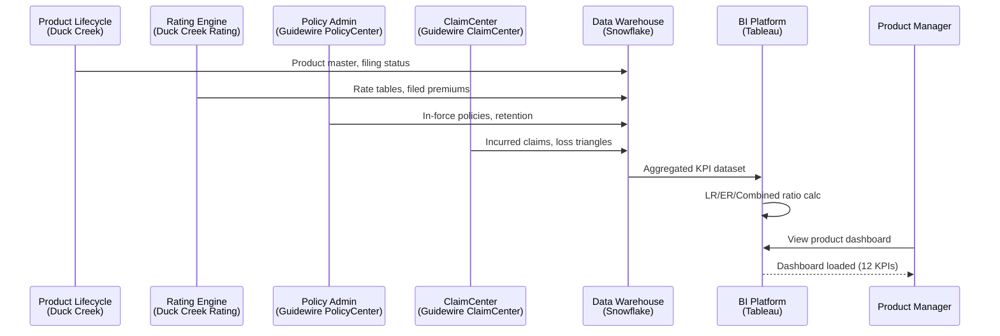

## Dashboard 02: Distribution & Channel Analytics Dashboard

**ACORD:** `IN005` • `IN006` • `IN007` • `IN008`  
**Business Question:** Which channels and producers deliver the best ROI?  
**Owner:** Head of Distribution  

Monitors channel performance (agents, brokers, direct, bancassurance, aggregators) on premium volume, acquisition cost, conversion, retention, and cross-sell. Includes producer scorecards with traffic-light indicators and peer percentile ranking.

### KPIs

| KPI | Formula / Source | Chart | Source System | Refresh | Reg Ref |
|-----|-----------------|-------|--------------|---------|---------|
|Premium by Channel|GWP split by channel|Pie + Bar|Guidewire PolicyCenter|Monthly|—|
|Customer Acquisition Cost|Total channel cost / new policies|Bar (by channel)|SAP GL|Monthly|—|
|Conversion Rate|Quotes accepted / quotes issued by channel|Line + Gauge|Duck Creek Rating|Monthly|—|
|Retention Rate|Policies renewed / policies expiring by channel|Line|Guidewire PolicyCenter|Monthly|—|
|Active Producer Count|Producers with >=1 policy in period|Count|Guidewire PolicyCenter|Monthly|NAIC Producer Licensing|
|Commission Ratio|Commission paid / premium written by channel|Bar|Duck Creek Billing|Monthly|—|
|Cross-Sell Ratio|% of multi-policy households by channel|Bar|CRM (Salesforce)|Monthly|—|
|Cost-to-Serve|Service cost per policy by channel|Bar|SAP GL|Monthly|—|
|Producer Scorecard|KPI vs target with traffic-light per producer|Table (heatmap)|BI (Tableau)|Monthly|—|
|Channel Profitability|Channel P&L: premium - commissions - expenses|Waterfall|Snowflake DW|Monthly|IFRS 17.55(d)|
|Lead Conversion Funnel|Lead > quote > bind by source|Funnel|Marketo + CRM|Weekly|—|
|Agency Contingent Pay|Profit-sharing % vs loss-ratio threshold|Gauge|Duck Creek Billing|Annual|NAIC SSAP 54|

### Filters & Drill-Down

**Filters:** Channel Type, Region, Producer Tier, Time Period  
**Drill-Down Path:** `Channel > Producer > Policy > Commission`  

### Data Flow Diagram

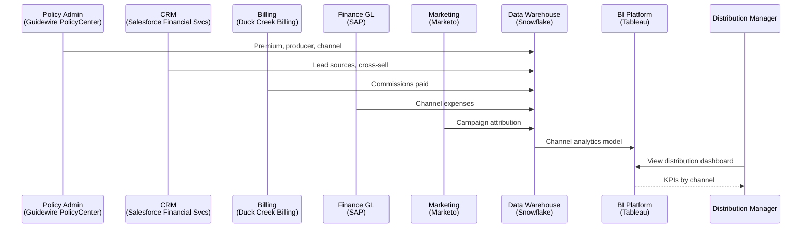

## Dashboard 03: Underwriting Dashboard

**ACORD:** `IN009` • `IN010` • `IN011` • `IN012`  
**Business Question:** Is underwriting risk selection improving or deteriorating?  
**Owner:** Chief Underwriting Officer  

Provides real-time visibility into new business pipeline, risk selection quality, quote-to-bind conversion, referral bottlenecks, and portfolio risk concentration. Helps underwriters balance growth against risk appetite.

### KPIs

| KPI | Formula / Source | Chart | Source System | Refresh | Reg Ref |
|-----|-----------------|-------|--------------|---------|---------|
|Submission Volume|New business submissions received|Count (trend)|Origami Risk UW|Daily|—|
|Quote-to-Bind Ratio|Policies bound / quotes issued|Gauge|Duck Creek Rating|Daily|—|
|Average Premium|Mean premium per bound policy|Line|Duck Creek Rating|Monthly|—|
|Risk Score Distribution|Count of risks by score decile|Histogram|Origami Risk UW|Monthly|Solvency II UW Risk 1.2|
|Referral Rate|% of submissions requiring UW referral|Line|Origami Risk UW|Monthly|—|
|TAT (Submission > Quote)|Avg hours from submission to quote issued|Bar|Origami Risk UW|Weekly|—|
|TAT (Quote > Bind)|Avg days from quote to policy bound|Bar|Guidewire PolicyCenter|Weekly|—|
|Portfolio Concentration|% of premium in top 3 risk categories|Donut|BI (Tableau)|Monthly|Solvency II Risk Concentration|
|Declination Rate|Quotes declined / submissions|Line|Origami Risk UW|Monthly|—|
|UW Authority Utilization|% decided within UW authority limit|Gauge|Origami Risk UW|Monthly|—|
|Reinsurance Impact|Premium ceded vs retained by risk band|Bar (stacked)|Sapiens Re|Monthly|Solvency II RI Risk|
|New Business LR|Incurred loss ratio on policies <=12 months|Line|Guidewire ClaimCenter|Quarterly|NAIC IRIS 7|

### Filters & Drill-Down

**Filters:** Product Line, Region, UW Team, Risk Band  
**Drill-Down Path:** `Submission > Quote > Policy > Claims Experience`  

### Data Flow Diagram

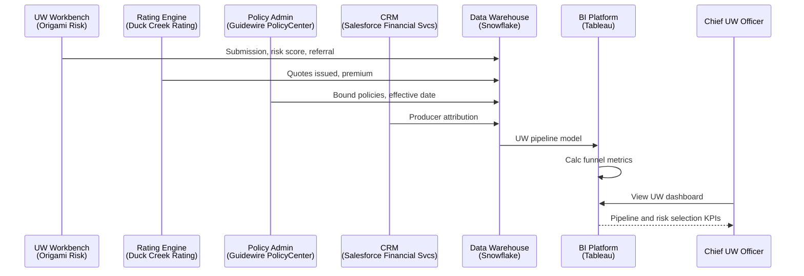

## Dashboard 04: Policy Administration Dashboard

**ACORD:** `IN013` • `IN014` • `IN015`  
**Business Question:** How healthy is the in-force book and policy servicing?  
**Owner:** Head of Policy Services  

Provides a complete view of the policy lifecycle: new business, in-force book, renewals, mid-term adjustments, cancellations, and endorsements. Tracks service levels including TAT for endorsements and policy inquiry response.

### KPIs

| KPI | Formula / Source | Chart | Source System | Refresh | Reg Ref |
|-----|-----------------|-------|--------------|---------|---------|
|In-Force Policies|Total active policies|Count (trend)|Guidewire PolicyCenter|Daily|—|
|New Business Count|Policies issued (first-time) this period|Bar|Guidewire PolicyCenter|Daily|—|
|Renewal Rate|Policies renewed / renewals offered|Gauge + Line|Guidewire PolicyCenter|Monthly|—|
|Mid-Term Adjustments|Endorsements processed this period|Bar|Guidewire PolicyCenter|Monthly|—|
|Cancellation Rate|Policies cancelled / in-force count|Line|Guidewire PolicyCenter|Monthly|—|
|Cancellation Reason Mix|% by reason (non-pay, UW, fraud, request)|Pie|Guidewire PolicyCenter|Monthly|—|
|Endorsement TAT|Avg hours from request to endorsement issued|Bar|Guidewire PolicyCenter|Weekly|—|
|Policy Inquiry Volume|Customer/producer inquiries received|Count (trend)|CRM (Salesforce)|Weekly|—|
|Average Policy Tenure|Mean days policy has been in-force|Line|Guidewire PolicyCenter|Monthly|—|
|NPS (Policy Servicing)|Net promoter score from servicing survey|Gauge|CRM (Salesforce)|Quarterly|—|
|Auto-Issue %|Policies issued without manual intervention|Gauge|Guidewire PolicyCenter|Monthly|—|
|Document Generation|Policy documents generated (schedules, COIs)|Count|M-Files|Monthly|—|

### Filters & Drill-Down

**Filters:** Product Line, Region, Coverage Type, Time Period  
**Drill-Down Path:** `Policy > Endorsement > Document > Inquiry`  

### Data Flow Diagram

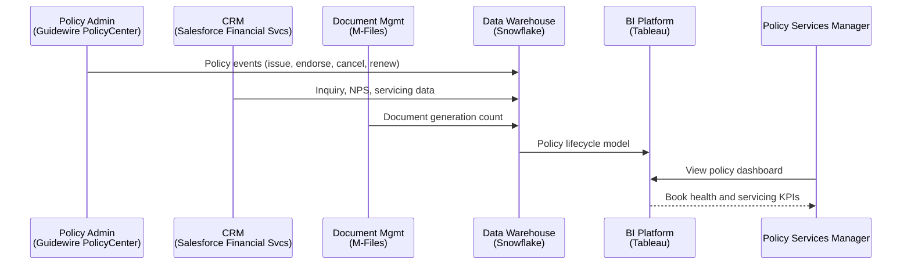

## Dashboard 05: Claims Operations Dashboard

**ACORD:** `IN016` • `IN017` • `IN018` • `IN019`  
**Business Question:** Are claims being handled efficiently, fairly, and within reserve?  
**Owner:** Chief Claims Officer  

End-to-end claims analytics covering FNOL intake, investigation, adjudication, payment, litigation, and subrogation. Monitors leakage, cycle times, adjuster workload, and reserve adequacy. Alerts when claims exceed authority or outlier severity thresholds.

### KPIs

| KPI | Formula / Source | Chart | Source System | Refresh | Reg Ref |
|-----|-----------------|-------|--------------|---------|---------|
|FNOL Volume|First notices of loss received|Count (trend)|Guidewire ClaimCenter|Daily|NAIC Claims Handling|
|Open Claims Count|Claims currently open (by status)|Count|Guidewire ClaimCenter|Daily|—|
|Average Severity|Total paid / closed claims|Line + Bar|Guidewire ClaimCenter|Monthly|—|
|Claims Frequency|Claim count / in-force policies|Line|Guidewire ClaimCenter|Monthly|Solvency II Premium Risk|
|Leakage Rate|Indemnity paid / expected reserve (deviation)|Gauge|Guidewire ClaimCenter|Monthly|—|
|Cycle Time (FNOL > Payment)|Avg days from FNOL to first payment|Bar|Guidewire ClaimCenter|Weekly|NAIC Timely Claims Handling|
|Cycle Time (FNOL > Close)|Avg days from FNOL to claim closure|Bar|Guidewire ClaimCenter|Weekly|—|
|Reserve Adequacy|Case reserve adequacy ratio|Line|SAS Actuarial|Monthly|Solvency II TP 2.2; NAIC SSAP 55|
|Subrogation Recovery Rate|Amount recovered / amount recoverable|Gauge|Guidewire ClaimCenter|Monthly|—|
|Litigation Rate|% of claims with active litigation|Line|Guidewire ClaimCenter|Monthly|—|
|Adjuster Workload|Open claims per adjuster|Bar|Guidewire ClaimCenter|Weekly|—|
|Claims NPS|Customer satisfaction survey post-settlement|Gauge|CRM (Salesforce)|Quarterly|NAIC Fair Claims Practices|

### Filters & Drill-Down

**Filters:** Line of Business, Claim Status, Adjuster Team, Time Period  
**Drill-Down Path:** `Claim > Coverage > Payment > Litigation > Recovery`  

### Data Flow Diagram

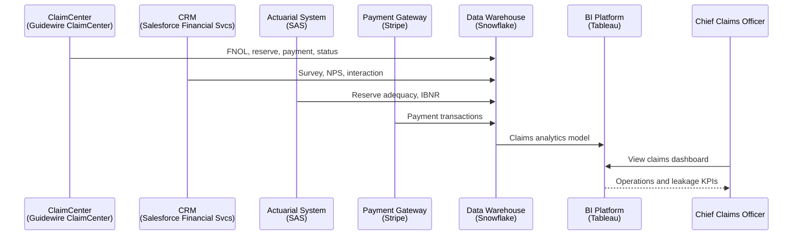

## Dashboard 06: Reinsurance Dashboard

**ACORD:** `IN020` • `IN021` • `IN022`  
**Business Question:** Are our reinsurance programmes adequately covering our risk exposure?  
**Owner:** Head of Reinsurance  

Monitors treaty and facultative placements, premium ceded, recoveries, bordereaux accuracy and timeliness, counterparty credit risk, and retrocession coverage. Provides early warning if treaty capacity is approaching exhaustion.

### KPIs

| KPI | Formula / Source | Chart | Source System | Refresh | Reg Ref |
|-----|-----------------|-------|--------------|---------|---------|
|Treaty Capacity Utilisation|% of treaty limit consumed by claims|Gauge + Bar|Sapiens Re|Monthly|Solvency II RI Risk 2.1|
|Premium Ceded Ratio|Ceded premium / gross written premium|Line|Sapiens Re + PAS|Quarterly|IFRS 17.62; NAIC SSAP 61|
|Recoveries Received|Reinsurance recoveries collected this period|Bar|Sapiens Re|Monthly|—|
|Recovery Cycle Time|Avg days from cession notification to cash received|Bar|Sapiens Re|Monthly|—|
|Bordereaux Accuracy|% of bordereaux records error-free on submission|Gauge|Sapiens Re|Monthly|—|
|Bordereaux Timeliness|% submitted within contractual deadline|Gauge|Sapiens Re|Monthly|—|
|RI Credit Risk|Exposure weighted by reinsurer credit rating|Bar|Sapiens Re + Moody's|Quarterly|Solvency II Counterparty Risk 3.1|
|Facultative Placement|Number of facultative placements requested/placed|Count (bar)|Sapiens Re|Monthly|—|
|Retrocession Coverage|% of ceded risk covered by retrocession|Gauge|Sapiens Re|Quarterly|Solvency II RI Risk 2.3|
|Catastrophe RI Cover|Per-occurrence limit vs modelled PML|Gauge|Moody's RMS|Annual|Solvency II Cat Risk|
|Treaty Expiry Calendar|Upcoming treaty renewals in next 6 months|Timeline table|Sapiens Re|Monthly|—|
|RI Programme ROE|Return on equity of RI programme|Line|Snowflake DW|Annual|—|

### Filters & Drill-Down

**Filters:** Treaty Type, Reinsurer, Line of Business, Year  
**Drill-Down Path:** `Treaty > Cession > Claim Recovery > Reinsurer`  

### Data Flow Diagram

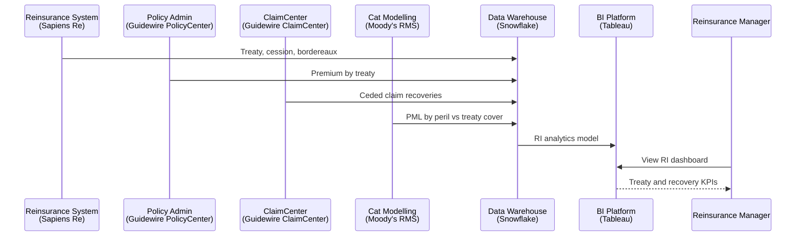

## Dashboard 07: Actuarial & Pricing Dashboard

**ACORD:** `IN023` • `IN024` • `IN025`  
**Business Question:** Are our rates adequate and reserves sufficient?  
**Owner:** Chief Actuary  

Aggregates pricing, rate monitoring, reserving, and catastrophe modelling analytics. Enables the actuarial team to assess rate adequacy, track IBNR emergence, validate reserve assumptions, and understand catastrophe exposure. Links pricing decisions to actual loss experience.

### KPIs

| KPI | Formula / Source | Chart | Source System | Refresh | Reg Ref |
|-----|-----------------|-------|--------------|---------|---------|
|Rate Adequacy|Indicated rate change vs filed (by product)|Gauge + Table|Duck Creek Rating|Monthly|NAIC SERFF; Solvency II Pricing|
|Actual vs Expected LR|Incurred LR vs pricing assumption LR|Line (pair)|SAS + DW|Monthly|Solvency II TP 2.2|
|IBNR Ratio|IBNR reserve / total reserve|Line|SAS Actuarial|Monthly|IFRS 17.37; NAIC SSAP 55|
|Reserve Adequacy Ratio|Best estimate vs central estimate|Gauge|SAS Actuarial|Quarterly|Solvency II TP 2.3|
|Chain-Ladder IBNR|IBNR via chain-ladder method|Line (development)|SAS Actuarial|Quarterly|—|
|Bornhuetter-Ferguson IBNR|IBNR via BF method for immature periods|Line (development)|SAS Actuarial|Quarterly|—|
|Probable Maximum Loss|OEP 100yr / AEP 100yr / AAL|Bar (by peril)|Moody's RMS|Quarterly|Solvency II Cat Risk|
|PML vs Treaty Cover|PML as % of per-occurrence treaty limit|Gauge|Moody's RMS|Annual|Solvency II Cat Risk 4.1|
|Credibility-Weighted LR|LR weighted by credibility factor|Line|SAS Actuarial|Monthly|—|
|Loss Development Pattern|Paid + incurred loss triangles|Line (multi-series)|SAS Actuarial|Quarterly|IFRS 17.37; NAIC SSAP 55|
|Expense Load|Expense provision as % of gross premium|Bar|SAP GL|Monthly|—|
|Model Stability|Variance of reserve estimates across quarterly runs|Bar (variance)|SAS Actuarial|Quarterly|Solvency II TP 2.5|

### Filters & Drill-Down

**Filters:** Product Line, Accident Year, Development Period, Peril  
**Drill-Down Path:** `Product > Accident Year > Reserve Method > Model Run`  

### Data Flow Diagram

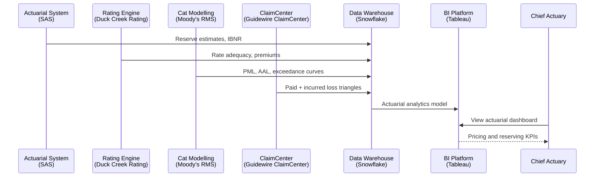

## Dashboard 08: Billing & Collections Dashboard

**ACORD:** `IN031`  
**Business Question:** Are premiums being collected efficiently and on time?  
**Owner:** Head of Finance Operations  

Monitors premium billing, payment processing, accounts receivable aging, collection effectiveness, refunds, and commission disbursement. Flags overdue accounts and tracks DSO improvements.

### KPIs

| KPI | Formula / Source | Chart | Source System | Refresh | Reg Ref |
|-----|-----------------|-------|--------------|---------|---------|
|Premium Billed|Total premium billed this period|Bar|Duck Creek Billing|Monthly|—|
|Premium Collected|Cash received against billed premium|Bar|Duck Creek Billing|Monthly|—|
|Collection Rate|Collected / billed (%)|Gauge|Duck Creek Billing|Monthly|—|
|Aging (0-30 days)|Receivables 0-30 days overdue|Bar (stacked)|Duck Creek Billing|Weekly|—|
|Aging (31-60 days)|Receivables 31-60 days overdue|Bar (stacked)|Duck Creek Billing|Weekly|—|
|Aging (61-90 days)|Receivables 61-90 days overdue|Bar (stacked)|Duck Creek Billing|Weekly|—|
|Aging (90+ days)|Receivables >90 days overdue|Bar (stacked)|Duck Creek Billing|Weekly|—|
|DSO|Days sales outstanding to collect premium|Line|BI (Tableau)|Monthly|—|
|Payment Method Mix|% by method (CC, bank transfer, direct debit, cheque)|Pie|Stripe + Billing|Monthly|—|
|Failed Payment Rate|Auto-pay attempts failed / total attempts|Line|Stripe|Monthly|—|
|Refund Volume|Premium refunds processed this period|Count (bar)|Duck Creek Billing|Monthly|—|
|Commission Payable|Commission due to producers this period|Bar|Duck Creek Billing|Monthly|—|

### Filters & Drill-Down

**Filters:** Product Line, Payment Method, Aging Bucket, Time Period  
**Drill-Down Path:** `Billing Account > Policy > Payment > Refund`  

### Data Flow Diagram

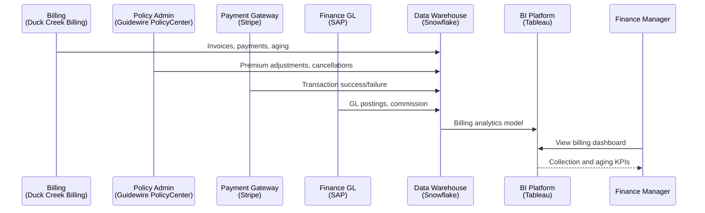

## Dashboard 09: Customer Analytics Dashboard

**ACORD:** `IN026` • `IN027`  
**Business Question:** How satisfied are our customers and what drives loyalty?  
**Owner:** Chief Customer Officer  

360-degree view of customer health including NPS, CSAT, customer lifetime value, retention and loyalty programme effectiveness, cross-sell penetration, complaints trends, and service experience metrics. Segments customers by behaviour, value, and risk profile.

### KPIs

| KPI | Formula / Source | Chart | Source System | Refresh | Reg Ref |
|-----|-----------------|-------|--------------|---------|---------|
|Net Promoter Score|Promoters - Detractors (scale -100 to +100)|Gauge + Line|CRM (Salesforce)|Quarterly|—|
|Customer Satisfaction|Avg satisfaction score (1-5) post-interaction|Gauge|CRM (Salesforce)|Monthly|NAIC Fair Treatment|
|Customer Lifetime Value|Present value of future profit from customer|Bar (segment)|BI (Tableau)|Monthly|—|
|Retention Rate|Customers retained / customers at risk|Gauge + Line|Guidewire PolicyCenter|Monthly|—|
|Cross-Sell Penetration|% customers with >1 policy|Bar (trend)|CRM (Salesforce)|Monthly|—|
|Complaint Volume|Complaints received by category|Count (bar)|CRM (Salesforce)|Monthly|NAIC Consumer Complaints|
|First-Contact Resolution|Issues resolved in first interaction|Gauge|CRM (Salesforce)|Monthly|—|
|Average Response Time|Avg hours to respond to customer enquiry|Line|CRM (Salesforce)|Weekly|—|
|Customer Segment Mix|% by value tier (platinum/gold/silver/bronze)|Pie|BI (Tableau)|Monthly|—|
|Loyalty Programme Engagement|Active members / eligible customers|Gauge|CRM (Salesforce)|Monthly|—|
|Cost-to-Serve per Customer|Service cost / customer count by segment|Bar|SAP GL|Monthly|—|
|Churn Prediction Score|Avg churn probability for at-risk population|Gauge|H2O.ai ML Model|Monthly|—|

### Filters & Drill-Down

**Filters:** Customer Segment, Product Line, Channel, Time Period  
**Drill-Down Path:** `Segment > Customer > Policy > Interaction`  

### Data Flow Diagram

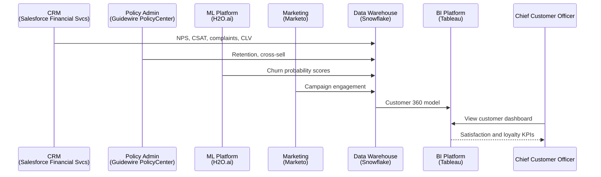

## Dashboard 10: Risk & Compliance Dashboard

**ACORD:** `IN028` • `IN029` • `IN030`  
**Business Question:** Are we operating within risk appetite and meeting regulatory obligations?  
**Owner:** Chief Risk Officer  

Consolidates enterprise risk management, capital adequacy (SCR/MCR), operational risk incidents, compliance monitoring, internal audit findings, and conduct risk metrics. Provides a single pane of glass for the CRO and board risk committee.

### KPIs

| KPI | Formula / Source | Chart | Source System | Refresh | Reg Ref |
|-----|-----------------|-------|--------------|---------|---------|
|SCR Coverage Ratio|Eligible own funds / SCR|Gauge + Line|Moody's Capital|Quarterly|Solvency II SCR 3.1|
|MCR Coverage Ratio|Eligible own funds / MCR|Gauge|Moody's Capital|Quarterly|Solvency II MCR 4.1|
|KRI Dashboard|15 green, 3 amber, 2 red indicators|Traffic-light heatmap|Moody's Risk|Monthly|Solvency II ORSA 5.1|
|Risk Appetite Utilisation|Risk exposure / risk appetite limit|Bullet chart|Moody's Risk|Monthly|Solvency II ORSA 5.2|
|Operational Risk Incidents|Operational loss events by category|Bar|ServiceNow GRC|Monthly|Solvency II OpRisk 6.1|
|Compliance Breaches|Regulatory or internal policy breaches|Count (trend)|ServiceNow GRC|Monthly|—|
|Internal Audit Findings|Open findings by severity|Bar (stacked)|ServiceNow GRC|Monthly|IAIS ICPs|
|Open Regulatory Queries|Outstanding regulatory information requests|Count|AxiomSL|Weekly|—|
|RCSA Completion|Risk and control self-assessment completion by BU|Gauge|ServiceNow GRC|Quarterly|—|
|Conduct Risk Score|Fair value assessment score by product|Bar|Compliance System|Monthly|NAIC Market Conduct|
|Capital Allocation|Capital allocated by risk type|Waterfall|Moody's Capital|Quarterly|Solvency II SCR 3.2|
|Board Risk Summary|CRO summary for board risk committee|Table (executive)|BI (Tableau)|Quarterly|Solvency II ORSA 5.3|

### Filters & Drill-Down

**Filters:** Risk Category, Business Unit, KRI Status, Time Period  
**Drill-Down Path:** `Risk Category > KRI > Incident > Remediation`  

### Data Flow Diagram

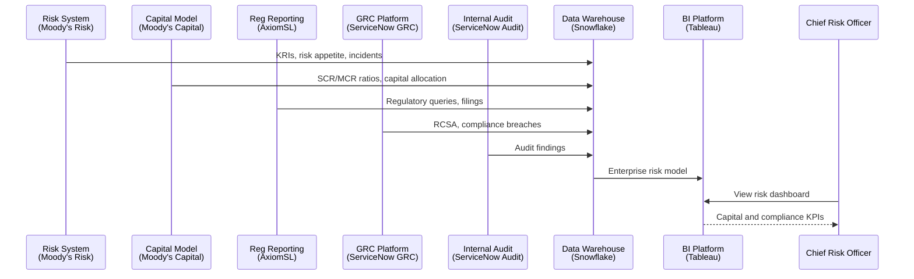

## Dashboard 11: IFRS 17 Accounting Dashboard

**ACORD:** `IN032`  
**Business Question:** What is the IFRS 17 profit profile and CSM emergence pattern?  
**Owner:** CFO / IFRS 17 Programme Director  

Provides full visibility into IFRS 17 financial metrics: CSM balance and amortisation, risk adjustment, insurance revenue recognition by PAA/GMM/VFA, insurance service result, and reinsurance impact. Essential for internal and external financial reporting.

### KPIs

| KPI | Formula / Source | Chart | Source System | Refresh | Reg Ref |
|-----|-----------------|-------|--------------|---------|---------|
|CSM Balance|CSM opening + movement - amortised|Waterfall|SAP IFRS17|Quarterly|IFRS 17.43-46|
|CSM Amortisation|CSM released to P&L this period|Bar|SAP IFRS17|Quarterly|IFRS 17.44(b)|
|Risk Adjustment (RA)|Non-financial risk adjustment movement|Bar|SAP IFRS17|Quarterly|IFRS 17.37, 17.84|
|Insurance Revenue|Revenue recognised (PAA/GMM/VFA by group)|Line + Bar|SAP IFRS17|Quarterly|IFRS 17.83-86|
|Insurance Service Expenses|Incurred claims + expenses recognised|Bar|SAP IFRS17|Quarterly|IFRS 17.87-88|
|Net Insurance Result|Insurance revenue - service expenses|Line|SAP IFRS17|Quarterly|IFRS 17.80|
|GWP vs NEP|Gross written vs net earned premium|Bar (paired)|SAP IFRS17|Quarterly|IFRS 17.55(a)|
|PAA Eligibility|% of groups qualifying for PAA|Pie|SAP IFRS17|Annual|IFRS 17.53-54|
|Group Aggregation|Groups by profitability (onerous/other)|Bar (stacked)|SAP IFRS17|Quarterly|IFRS 17.16-24|
|Reinsurance Impact|Reinsurance share of CSM, RA, revenue|Bar (stacked)|SAP + Sapiens|Quarterly|IFRS 17.62-65|
|Discount Rate Sensitivity|CSM sensitivity to -50bp/+50bp yield curve|Table|SAP IFRS17|Quarterly|IFRS 17.56-58|
|Transition Balances|Opening IFRS 17 equity adjustment by method|Waterfall|SAP IFRS17|Annual|IFRS 17.C1-C8|

### Filters & Drill-Down

**Filters:** IFRS 17 Group, Measurement Approach, Transition Method, Reporting Period  
**Drill-Down Path:** `Group > Measurement Approach > Movement Component > Journal`  

### Data Flow Diagram

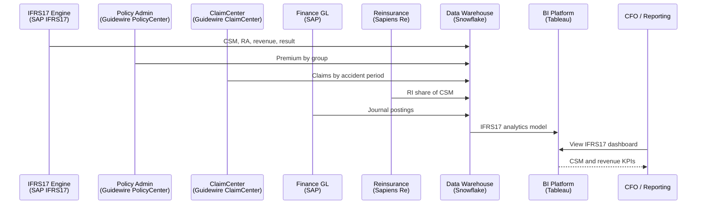

## Dashboard 12: Regulatory Reporting Dashboard

**ACORD:** `IN029`  
**Business Question:** Are all regulatory filings accurate and on time?  
**Owner:** Head of Regulatory Reporting  

Tracks the end-to-end regulatory reporting lifecycle across Solvency II QRTs, NAIC statutory statements, APRA GPS/LRS filings, and tax returns. Monitors filing calendar, submission status, data quality scores, and regulator queries.

### KPIs

| KPI | Formula / Source | Chart | Source System | Refresh | Reg Ref |
|-----|-----------------|-------|--------------|---------|---------|
|Filings Due|Number of regulatory returns due this period|Count|AxiomSL|Monthly|—|
|Filings Submitted|Returns submitted on time|Count|AxiomSL|Monthly|—|
|On-Time Filing Rate|Submitted on time / due (%)|Gauge|AxiomSL|Monthly|Solvency II, NAIC, APRA|
|Data Quality Score|DQ pass rate across all regulatory data|Gauge + Line|AxiomSL + Informatica|Monthly|—|
|QRT Completion %|Solvency II QRT completeness (0-100%)|Gauge|AxiomSL|Quarterly|Solvency II QRT|
|NAIC Filing Status|Annual/quarterly statement status by state|Table (traffic-light)|AxiomSL|Quarterly|NAIC SSAP|
|APRA Filing Status|GPS 001 / LRS 750.0 / other status|Table (traffic-light)|AxiomSL|Quarterly|APRA GPS 001|
|Regulatory Queries|Open queries from regulators|Count (trend)|AxiomSL|Monthly|—|
|Query Resolution TAT|Avg days to respond to regulator query|Line|AxiomSL|Monthly|—|
|Tax Filing Status|GST / premium tax / income tax filing status|Table|AxiomSL + SAP|Quarterly|ATO / IRS / HMRC|
|Filing Calendar Adherence|Days ahead of deadline for each filing|Bar|AxiomSL|Monthly|—|
|Regulatory Change Impact|Number of regulatory changes affecting reporting|Count|AxiomSL|Quarterly|—|

### Filters & Drill-Down

**Filters:** Regulator, Filing Type, Jurisdiction, Status  
**Drill-Down Path:** `Regulator > Filing Type > Submission > Query`  

### Data Flow Diagram

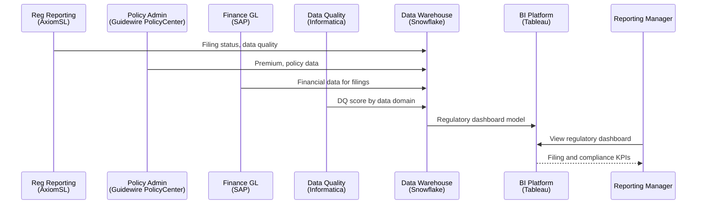

## Dashboard 13: Data & Analytics Governance Dashboard

**ACORD:** `IN033`  
**Business Question:** Can we trust our data for decision-making and reporting?  
**Owner:** Chief Data Officer  

Monitors data quality across all insurance data domains (policy, claims, customer, finance, risk), data cataloguing coverage, data lineage completeness, master data management health, and ML model performance. Drives the data governance operating model.

### KPIs

| KPI | Formula / Source | Chart | Source System | Refresh | Reg Ref |
|-----|-----------------|-------|--------------|---------|---------|
|Overall DQ Score|Weighted avg of completeness, timeliness, accuracy, consistency|Gauge + Line|Informatica DQ|Weekly|BCBS 239; Solvency II Data|
|Completeness %|Mandatory fields populated correctly|Gauge|Informatica DQ|Weekly|—|
|Timeliness %|Data available within SLA|Gauge|Informatica DQ|Weekly|—|
|Accuracy %|Data values match authoritative source|Gauge|Informatica DQ|Weekly|—|
|Consistency %|Data consistent across source systems|Gauge|Informatica DQ|Weekly|—|
|DQ Domain Coverage|% of data domains with active DQ rules|Donut|Informatica DQ|Monthly|—|
|Data Catalog Coverage|Data assets catalogued in Collibra|Gauge|Collibra|Monthly|—|
|Data Lineage Coverage|Critical data elements with documented lineage|Gauge|Collibra + Informatica|Monthly|BCBS 239|
|Open DQ Issues|Data quality issues by severity|Bar (stacked)|Informatica DQ|Weekly|—|
|MDM Match Rate|Customer/policy master match rate|Gauge|Informatica MDM|Monthly|—|
|ML Model Performance|Avg MAE / R2 across deployed models|Gauge + Table|H2O.ai ML Ops|Monthly|—|
|DG Adoption|Business units with active data governance representation|Gauge|Collibra|Quarterly|—|

### Filters & Drill-Down

**Filters:** Data Domain, Business Unit, DQ Dimension, Time Period  
**Drill-Down Path:** `Data Domain > DQ Rule > Issue > Remediation`  

### Data Flow Diagram

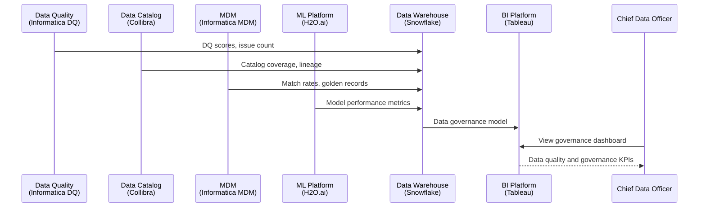

## Dashboard 14: Information Security Dashboard

**ACORD:** `IN034`  
**Business Question:** Are we effectively protecting company and customer data?  
**Owner:** Chief Information Security Officer  

Provides a comprehensive view of the security posture including security incidents, vulnerability management, identity and access management, business continuity readiness, and third-party risk. Essential for board risk reporting and regulatory compliance (GDPR, CCPA, DORA).

### KPIs

| KPI | Formula / Source | Chart | Source System | Refresh | Reg Ref |
|-----|-----------------|-------|--------------|---------|---------|
|Security Incidents|Incidents by type (phishing, malware, DDoS, insider)|Bar (stacked)|SIEM (Azure Sentinel)|Daily|GDPR Art 33; NIST 800-61|
|MTTR (Incidents)|Mean time to resolve security incidents (hours)|Line|SIEM (Azure Sentinel)|Monthly|—|
|Critical Vulnerabilities|CVSS >=9.0 unpatched|Count (trend)|Qualys / Tenable|Daily|NIST 800-53; CIS Controls|
|High Vulnerabilities|CVSS 7.0-8.9 unpatched|Count (trend)|Qualys / Tenable|Daily|—|
|Patch Compliance %|Systems patched within SLA|Gauge|Qualys + ServiceNow|Weekly|NIST 800-53 SI-2|
|Privileged Access Reviews|Reviews completed / due (%)|Gauge|CyberArk + ServiceNow|Monthly|SOX; NIST AC-6|
|Phishing Simulation Click Rate|Click-through rate on simulated phishing|Gauge|KnowBe4|Monthly|—|
|BCP Tests Completed|Tests passed / scheduled (%)|Gauge|ServiceNow BCM|Quarterly|Solvency II BCM; DORA|
|RPO/RTO Adherence|Systems meeting recovery point/time objectives|Gauge|ServiceNow BCM|Quarterly|Solvency II BCM|
|Third-Party Risk|Vendors with active security assessments|Count (bar)|ServiceNow VRM|Monthly|DORA; NIST SP 800-53|
|Data Breach Notifications|Breaches reported to regulator / affected parties|Count|SIEM + DPO Tracker|Monthly|GDPR Art 33-34|
|Security Awareness Training|Employees with up-to-date training|Gauge|KnowBe4|Monthly|NIST AT-2|

### Filters & Drill-Down

**Filters:** Incident Type, Severity, System, Time Period  
**Drill-Down Path:** `Incident > System > Vulnerability > Remediation`  

### Data Flow Diagram

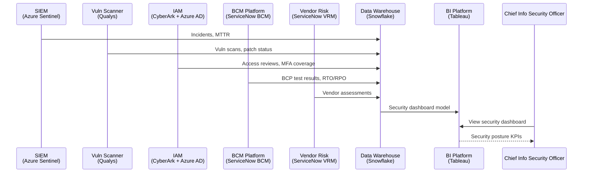

## Dashboard 15: Enterprise Services Dashboard

**ACORD:** `IN035`  
**Business Question:** Are enterprise operations running efficiently?  
**Owner:** Chief Operating Officer  

Covers corporate functions: HR and payroll, financial accounting, procurement and vendor management, legal and contract management, and facilities. Provides a cost-centre view of enterprise operations with headcount trends, attrition, vendor performance, open legal cases, and facilities utilisation.

### KPIs

| KPI | Formula / Source | Chart | Source System | Refresh | Reg Ref |
|-----|-----------------|-------|--------------|---------|---------|
|Headcount (FTE)|Total active employees|Count (trend)|Workday|Monthly|—|
|Attrition Rate|Departures / avg headcount|Line + Gauge|Workday|Monthly|—|
|Open Positions|Unfilled requisitions by department|Bar|Workday|Monthly|—|
|Time-to-Hire|Avg days from req open to offer accepted|Line|Workday|Monthly|—|
|Active Vendors|Vendors with active PO or contract|Count|SAP Procurement|Monthly|—|
|PO Value (YTD)|Total purchase order value placed YTD|Bar|SAP Procurement|Monthly|—|
|Vendor Scorecard|Avg vendor rating (quality, delivery, cost)|Gauge + Table|SAP Procurement|Quarterly|—|
|Legal Cases Open|Active litigation and regulatory matters|Count|ServiceNow Legal|Monthly|—|
|Contract Expiry Calendar|Contracts expiring within 6 months|Timeline table|ServiceNow Contracts|Monthly|—|
|Facilities Utilisation|% of office space occupied|Gauge|Facilities Mgmt System|Monthly|—|
|HR Cost per FTE|Total HR cost / headcount|Line|SAP GL|Quarterly|—|
|Finance Close TAT|Days to complete month-end close|Line|SAP GL|Monthly|—|

### Filters & Drill-Down

**Filters:** Department, Cost Centre, Vendor Category, Time Period  
**Drill-Down Path:** `Function > Cost Centre > Vendor/Employee > Transaction`  

### Data Flow Diagram

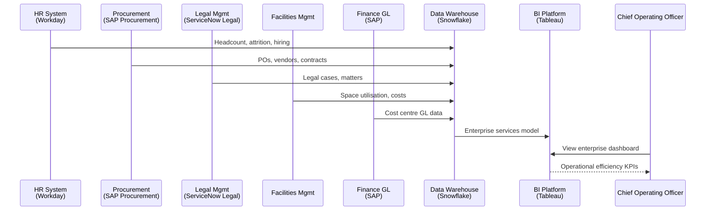

## Dashboard 16: IT & Digital Platform Operations Dashboard

**ACORD:** `IN036`  
**Business Question:** Are our digital platforms reliable, performant, and cost-effective?  
**Owner:** Chief Information Officer  

Monitors IT operations across cloud infrastructure, API gateway performance, CI/CD pipeline health, testing coverage, service desk, and cloud cost management. Provides real-time and trend visibility into platform reliability, developer productivity, and IT financial management.

### KPIs

| KPI | Formula / Source | Chart | Source System | Refresh | Reg Ref |
|-----|-----------------|-------|--------------|---------|---------|
|API Uptime|% of time API gateway is available|Gauge|Azure API Mgmt|Real-time|—|
|API Call Volume|API requests per minute by endpoint|Line (multi-series)|Azure API Mgmt|Real-time|—|
|API Latency (P50/P95/P99)|Response time in ms at percentiles|Line|Azure API Mgmt|Real-time|—|
|Deployment Frequency|Production deployments per week|Bar|Azure DevOps|Weekly|—|
|Deployment Success Rate|% of deployments without rollback|Gauge|Azure DevOps|Weekly|—|
|MTTR (Incidents)|Mean time to resolve P1/P2 incidents|Line|ServiceNow ITSM|Monthly|—|
|Service Desk Tickets|Tickets opened by category|Bar (stacked)|ServiceNow ITSM|Weekly|—|
|Ticket FCR Rate|First-contact resolution rate|Gauge|ServiceNow ITSM|Monthly|—|
|Cloud Cost (Monthly)|Monthly cloud infrastructure spend by provider|Bar (stacked)|Azure Cost Mgmt|Monthly|—|
|Cloud Cost per Transaction|Cloud cost / API transactions|Line|Azure Cost Mgmt|Monthly|—|
|Test Coverage|Code coverage % by criticality|Gauge|SonarQube + ADO|Monthly|—|
|SLA Adherence|IT services meeting published SLAs|Gauge|ServiceNow ITSM|Monthly|—|

### Filters & Drill-Down

**Filters:** Service, Environment, Cloud Provider, Time Period  
**Drill-Down Path:** `Service > API > Deployment > Incident > Ticket`  

### Data Flow Diagram

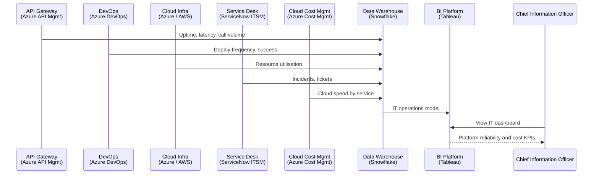

## ACORD Capability Cross-Reference

| ACORD Code | Capability | Dashboard(s) |
|------------|-----------|--------------|
| `IN001` | Product Concept & Design | Dashboard #01 |
| `IN002` | Rate & Form Filing | Dashboard #01 |
| `IN003` | Product Launch | Dashboard #01 |
| `IN004` | Product Performance Monitoring | Dashboard #01 |
| `IN005` | Agency & Producer Onboarding | Dashboard #02 |
| `IN006` | Commission Management | Dashboard #02 |
| `IN007` | Producer Performance | Dashboard #02 |
| `IN008` | Distribution Analytics | Dashboard #02 |
| `IN009` | Risk Assessment & Scoring | Dashboard #03 |
| `IN010` | Underwriting Decision | Dashboard #03 |
| `IN011` | Quote Generation | Dashboard #03 |
| `IN012` | Bind & Evidence | Dashboard #03 |
| `IN013` | Policy Issuance | Dashboard #04 |
| `IN014` | Mid-Term Adjustments | Dashboard #04 |
| `IN015` | Renewal Processing | Dashboard #04 |
| `IN016` | First Notice of Loss | Dashboard #05 |
| `IN017` | Claims Investigation | Dashboard #05 |
| `IN018` | Claims Adjudication | Dashboard #05 |
| `IN019` | Payment & Settlement | Dashboard #05 |
| `IN020` | Treaty Administration | Dashboard #06 |
| `IN021` | Facultative Placement | Dashboard #06 |
| `IN022` | Retrocession Management | Dashboard #06 |
| `IN023` | Pricing Model Development | Dashboard #07 |
| `IN024` | Rate Monitoring | Dashboard #07 |
| `IN025` | Reserve Estimation | Dashboard #07 |
| `IN026` | Customer Onboarding | Dashboard #09 |
| `IN027` | Customer Relationship Management | Dashboard #09 |
| `IN028` | Enterprise Risk Management | Dashboard #10 |
| `IN029` | Regulatory Compliance | Dashboard #10, #12 |
| `IN030` | Capital Adequacy & ORSA | Dashboard #10 |
| `IN031` | Billing & Collections | Dashboard #08 |
| `IN032` | IFRS 17 Accounting | Dashboard #11 |
| `IN033` | Data & Analytics | Dashboard #13 |
| `IN034` | Information Security | Dashboard #14 |
| `IN035` | Enterprise Services | Dashboard #15 |
| `IN036` | IT & Digital Platforms | Dashboard #16 |