# Insurance Domain Process Flows — ACORD Capability Model Reference

> Generated on 2026-07-09 | Domain: Insurance | Framework: ACORD (Association for Cooperative Operations Research and Development)

## ACORD Business Capability Model Reference

The ACORD (Association for Cooperative Operations Research and Development) Capability Model defines the standard business capabilities for insurance institutions. The table below lists all relevant capabilities across 10 Level-1 domains. Each process flow in this document is mapped to its relevant ACORD capability codes.

### Product

| Capability | Code | Description |
|-----------|------|-------------|
| **Product Lifecycle Management** | `IN001` | Design, develop, and manage insurance products across lifecycle from concept to retirement |
| **Product Configuration & Rating** | `IN002` | Configure product rules, rating algorithms, and coverage options |
| **Product Filing & Compliance** | `IN003` | Manage regulatory product filings, approvals, and compliance across jurisdictions |
| **Product Performance Analytics** | `IN004` | Monitor product profitability, loss ratios, and distribution performance |

### Distribution

| Capability | Code | Description |
|-----------|------|-------------|
| **Channel Management** | `IN005` | Manage distribution channels including agents, brokers, bancassurance, and direct |
| **Producer/Agent Lifecycle Management** | `IN006` | Onboard, license, appoint, and manage producers and agents |
| **Commission Management** | `IN007` | Calculate, process, and disburse commissions across compensation structures |
| **Lead & Campaign Management** | `IN008` | Manage marketing campaigns, lead generation, and distribution analytics |

### Underwriting

| Capability | Code | Description |
|-----------|------|-------------|
| **New Business Submission** | `IN009` | Receive, validate, and triage new business submissions from producers |
| **Risk Assessment & Scoring** | `IN010` | Assess risk using rules, models, and third-party data sources |
| **Underwriting Decision** | `IN011` | Make underwriting decisions with authority-based approval and referral workflows |
| **Quote Generation & Bind** | `IN012` | Generate quotes, bind coverage, and issue evidence of insurance |

### Policy

| Capability | Code | Description |
|-----------|------|-------------|
| **Policy Issuance & Administration** | `IN013` | Issue policies, manage policy documents, and maintain in-force records |
| **Policy Servicing & Adjustments** | `IN014` | Process mid-term adjustments, endorsements, and policy changes |
| **Renewal & Termination** | `IN015` | Manage renewal lifecycle, non-renewal notices, cancellations, and reinstatements |

### Claims

| Capability | Code | Description |
|-----------|------|-------------|
| **First Notice of Loss** | `IN016` | Capture claim notifications through multi-channel intake and triage |
| **Claims Investigation & Evaluation** | `IN017` | Investigate claims, gather evidence, assess liability, and estimate reserves |
| **Claims Adjudication & Payment** | `IN018` | Adjudicate claims, approve payments, and manage benefit disbursement |
| **Subrogation & Recovery** | `IN019` | Pursue subrogation, salvage, and third-party recoveries |

### Reinsurance

| Capability | Code | Description |
|-----------|------|-------------|
| **Treaty Management** | `IN020` | Manage proportional and non-proportional treaty agreements and session schedules |
| **Facultative Placement** | `IN021` | Place facultative reinsurance for individual large or complex risks |
| **Reinsurance Accounting & Bordereaux** | `IN022` | Prepare premium and loss bordereaux, manage cessions, and reconcile recoveries |

### Financial & Actuarial

| Capability | Code | Description |
|-----------|------|-------------|
| **Actuarial Modeling & Pricing** | `IN023` | Develop pricing models, rate indications, and actuarial assumptions |
| **Reserve Estimation & Management** | `IN024` | Estimate loss reserves, IBNR, and actuarial liabilities |
| **Catastrophe Modeling** | `IN025` | Model natural and man-made catastrophe exposure and accumulation risk |

### Customer

| Capability | Code | Description |
|-----------|------|-------------|
| **Customer Onboarding & KYC** | `IN026` | Onboard customers with identity verification, AML screening, and due diligence |
| **Customer Relationship Management** | `IN027` | Manage customer interactions, loyalty programs, and cross-sell opportunities |

### Risk & Compliance

| Capability | Code | Description |
|-----------|------|-------------|
| **Enterprise Risk Management** | `IN028` | Manage ERM framework, risk appetite, capital adequacy, and ORSA processes |
| **Regulatory Compliance** | `IN029` | Ensure compliance with Solvency II, NAIC, APRA, and other regulatory regimes |
| **Internal Audit & Assurance** | `IN030` | Conduct internal audits, control testing, and assurance activities |

### Enterprise & IT

| Capability | Code | Description |
|-----------|------|-------------|
| **Billing & Collections** | `IN031` | Manage premium billing, payment processing, collections, and dispute resolution |
| **IFRS 17 & Financial Accounting** | `IN032` | Apply IFRS 17 accounting including CSM, PAA, GMM, VFA calculations |
| **Data Governance & MDM** | `IN033` | Govern data assets, manage master data, and ensure data quality |
| **Information Security & Cybersecurity** | `IN034` | Protect information assets, manage cyber risk, and ensure business continuity |
| **Enterprise Services Management** | `IN035` | Manage HR, finance, procurement, legal, and facilities operations |
| **IT Operations & Digital Platforms** | `IN036` | Operate IT infrastructure, cloud platforms, API management, and DevOps |

---

## Table of Contents

- [1: Product Lifecycle Management](#1-product-lifecycle-management)
  - [1.1 Product Concept & Feasibility](#11-product-concept--feasibility)
  - [1.2 Product Design & Coverage Development](#12-product-design--coverage-development)
  - [1.3 Rate & Form Filing](#13-rate--form-filing)
  - [1.4 Product Launch & Distribution](#14-product-launch--distribution)
  - [1.5 Product Performance Monitoring](#15-product-performance-monitoring)
- [2: Distribution & Channel Management](#2-distribution--channel-management)
  - [2.1 Agency & Producer Onboarding](#21-agency--producer-onboarding)
  - [2.2 Commission Management](#22-commission-management)
  - [2.3 Producer Performance Management](#23-producer-performance-management)
  - [2.4 Lead Distribution & Campaign Management](#24-lead-distribution--campaign-management)
  - [2.5 Distribution Analytics & Optimization](#25-distribution-analytics--optimization)
- [3: Underwriting](#3-underwriting)
  - [3.1 New Business Submission](#31-new-business-submission)
  - [3.2 Risk Assessment & Scoring](#32-risk-assessment--scoring)
  - [3.3 Underwriting Decision & Referral](#33-underwriting-decision--referral)
  - [3.4 Quote Generation](#34-quote-generation)
  - [3.5 Bind & Evidence of Insurance](#35-bind--evidence-of-insurance)
- [4: Policy Administration](#4-policy-administration)
  - [4.1 Policy Issuance](#41-policy-issuance)
  - [4.2 Mid-Term Adjustments & Endorsements](#42-mid-term-adjustments--endorsements)
  - [4.3 Renewal Processing](#43-renewal-processing)
  - [4.4 Cancellation & Non-Renewal](#44-cancellation--non-renewal)
  - [4.5 Policy Inquiry & Evidence of Insurance](#45-policy-inquiry--evidence-of-insurance)
- [5: Claims Management](#5-claims-management)
  - [5.1 First Notice of Loss](#51-first-notice-of-loss)
  - [5.2 Claims Investigation & Evaluation](#52-claims-investigation--evaluation)
  - [5.3 Claims Adjudication](#53-claims-adjudication)
  - [5.4 Payment & Settlement](#54-payment--settlement)
  - [5.5 Subrogation & Recovery](#55-subrogation--recovery)
  - [5.6 Litigation Management](#56-litigation-management)
- [6: Reinsurance](#6-reinsurance)
  - [6.1 Treaty Setup & Administration](#61-treaty-setup--administration)
  - [6.2 Facultative Placement](#62-facultative-placement)
  - [6.3 Premium Bordereaux Processing](#63-premium-bordereaux-processing)
  - [6.4 Claims Bordereaux & Recovery](#64-claims-bordereaux--recovery)
  - [6.5 Retrocession Management](#65-retrocession-management)
- [7: Actuarial & Pricing](#7-actuarial--pricing)
  - [7.1 Pricing Model Development](#71-pricing-model-development)
  - [7.2 Rate Monitoring & Analysis](#72-rate-monitoring--analysis)
  - [7.3 Reserve Estimation & IBNR](#73-reserve-estimation--ibnr)
  - [7.4 Catastrophe Modeling](#74-catastrophe-modeling)
  - [7.5 Actuarial Assumption Setting](#75-actuarial-assumption-setting)
- [8: Billing & Collections](#8-billing--collections)
  - [8.1 Premium Billing Generation](#81-premium-billing-generation)
  - [8.2 Payment Processing](#82-payment-processing)
  - [8.3 Collections & Arrears Management](#83-collections--arrears-management)
  - [8.4 Commission Disbursement](#84-commission-disbursement)
  - [8.5 Refund & Return Premium Processing](#85-refund--return-premium-processing)
- [9: Customer Management](#9-customer-management)
  - [9.1 Customer Onboarding & KYC](#91-customer-onboarding--kyc)
  - [9.2 Customer Relationship Management](#92-customer-relationship-management)
  - [9.3 Loyalty & Retention Programs](#93-loyalty--retention-programs)
  - [9.4 Customer Portal & Self-Service](#94-customer-portal--self-service)
  - [9.5 Complaints & Enquiries Management](#95-complaints--enquiries-management)
- [10: Risk Management & Compliance](#10-risk-management--compliance)
  - [10.1 Enterprise Risk Management Framework](#101-enterprise-risk-management-framework)
  - [10.2 Capital Adequacy & ORSA](#102-capital-adequacy--orsa)
  - [10.3 Regulatory Compliance Monitoring](#103-regulatory-compliance-monitoring)
  - [10.4 Internal Audit & Assurance](#104-internal-audit--assurance)
  - [10.5 Conduct Risk & Fair Value Assessment](#105-conduct-risk--fair-value-assessment)
- [11: IFRS 17 Accounting & Finance](#11-ifrs-17-accounting--finance)
  - [11.1 CSM Calculation & Amortization](#111-csm-calculation--amortization)
  - [11.2 PAA / GMM / VFA Aggregation](#112-paa--gmm--vfa-aggregation)
  - [11.3 Insurance Revenue Recognition](#113-insurance-revenue-recognition)
  - [11.4 Reinsurance Impact on IFRS 17](#114-reinsurance-impact-on-ifrs-17)
  - [11.5 IFRS 17 Reporting & Disclosure](#115-ifrs-17-reporting--disclosure)
- [12: Regulatory Reporting](#12-regulatory-reporting)
  - [12.1 Solvency II QRT & Narrative Reporting](#121-solvency-ii-qrt--narrative-reporting)
  - [12.2 NAIC Statutory Filing](#122-naic-statutory-filing)
  - [12.3 APRA GPS 001 & LRS 750.0](#123-apra-gps-001--lrs-7500)
  - [12.4 Tax Reporting (GST / Premium Tax)](#124-tax-reporting-gst--premium-tax)
  - [12.5 Regulatory Data Submission & Validation](#125-regulatory-data-submission--validation)
- [13: Data & Analytics](#13-data--analytics)
  - [13.1 Data Governance Framework](#131-data-governance-framework)
  - [13.2 Master Data Management](#132-master-data-management)
  - [13.3 BI & Reporting Dashboards](#133-bi--reporting-dashboards)
  - [13.4 Predictive Analytics & Modeling](#134-predictive-analytics--modeling)
  - [13.5 Data Quality Management](#135-data-quality-management)
- [14: Information Security & Cybersecurity](#14-information-security--cybersecurity)
  - [14.1 Identity & Access Management](#141-identity--access-management)
  - [14.2 Security Operations & Monitoring](#142-security-operations--monitoring)
  - [14.3 Vulnerability & Patch Management](#143-vulnerability--patch-management)
  - [14.4 Business Continuity & Disaster Recovery](#144-business-continuity--disaster-recovery)
  - [14.5 Third-Party Risk Management](#145-third-party-risk-management)
- [15: Enterprise Services](#15-enterprise-services)
  - [15.1 HR & Payroll Management](#151-hr--payroll-management)
  - [15.2 Financial Accounting & General Ledger](#152-financial-accounting--general-ledger)
  - [15.3 Procurement & Vendor Management](#153-procurement--vendor-management)
  - [15.4 Legal & Contract Management](#154-legal--contract-management)
  - [15.5 Facilities & Administration](#155-facilities--administration)
- [16: IT & Digital Platforms](#16-it--digital-platforms)
  - [16.1 API Management & Integration Platform](#161-api-management--integration-platform)
  - [16.2 Cloud Infrastructure Management](#162-cloud-infrastructure-management)
  - [16.3 DevOps & CI/CD Pipeline](#163-devops--cicd-pipeline)
  - [16.4 Testing & Quality Assurance](#164-testing--quality-assurance)
  - [16.5 Service Desk & IT Support](#165-service-desk--it-support)

## Test Data

| Entity | Field | Value |
|--------|-------|-------|
| **APISpec** | api_id | API-2026-001 |
| | name | Policy Issuance API |
| | version | 2.1.0 |
| | protocol | REST |
| | status | Published |
| **AuditReport** | report_id | AUD-2026-001 |
| | scope | Underwriting Controls |
| | findings | 2 |
| | status | Issued |
| | auditor | Internal Audit Team |
| **Bordereaux** | bordereaux_id | BOR-2026-001 |
| | period | 2026-Q2 |
| | type | Premium |
| | total_premium | 2,500,000.00 |
| | total_cession | 1,750,000.00 |
| | status | Submitted |
| **CSM** | csm_id | CSM-2026-001 |
| | group_id | GRP-2026-001 |
| | opening_balance | 125,000.00 |
| | additions | 25,000.00 |
| | amortized | -15,000.00 |
| | closing_balance | 135,000.00 |
| | reporting_date | 2026-06-30 |
| **CatastropheModel** | model_id | CAT-2026-001 |
| | name | Australian Cyclone Model v3 |
| | peril | Cyclone |
| | return_period | 100 |
| | exposure_value | 500,000,000.00 |
| | probable_max_loss | 75,000,000.00 |
| **Claim** | claim_id | CLM-2026-001 |
| | policy_id | POL-2026-001 |
| | loss_date | 2026-06-20 |
| | loss_type | Motor Accident |
| | estimated_amount | 15,000.00 |
| | status | Open |
| | reserve_amount | 12,000.00 |
| **CommissionStatement** | statement_id | COM-2026-001 |
| | producer_id | PROD-2026-001 |
| | period | 2026-Q2 |
| | gross_premium | 150,000.00 |
| | commission_amount | 22,500.00 |
| | status | Approved |
| **Customer** | customer_id | CUST-2026-001 |
| | name | John Anderson |
| | email | john.anderson@email.com |
| | phone | +61 400 123 456 |
| | address | 123 George Street, Sydney NSW 2000 |
| | dob | 1985-04-12 |
| **DataQualityRule** | rule_id | DQ-2026-001 |
| | name | Policy Premium vs Product Rate |
| | severity | Critical |
| | last_run | 2026-07-01 |
| | pass_rate | 98.5 |
| **Employee** | employee_id | EMP-2026-001 |
| | name | Michael Wong |
| | role | Claims Adjuster |
| | department | Claims |
| | email | michael.wong@insurer.com |
| **IFRS17Group** | group_id | GRP-2026-001 |
| | name | Motor Insurance Annual Cohort 2026 |
| | aggregation_method | GMM |
| | total_premium | 5,000,000.00 |
| | total_csm | 135,000.00 |
| | insurance_revenue | 1,250,000.00 |
| **Invoice** | invoice_id | INV-2026-001 |
| | policy_id | POL-2026-001 |
| | amount | 1,250.00 |
| | due_date | 2026-02-01 |
| | status | Paid |
| | billing_period | Annual |
| **Payment** | payment_id | PAY-2026-001 |
| | invoice_id | INV-2026-001 |
| | amount | 1,250.00 |
| | method | Credit Card |
| | transaction_ref | TXN-AUD-001 |
| | date | 2026-01-20 |
| **Policy** | policy_id | POL-2026-001 |
| | product | Comprehensive Motor Insurance |
| | premium | 1,250.00 |
| | currency | AUD |
| | status | In-Force |
| | inception_date | 2026-01-15 |
| | expiry_date | 2027-01-14 |
| | customer_id | CUST-2026-001 |
| **Producer** | producer_id | PROD-2026-001 |
| | name | Sydney Insurance Brokers Pty Ltd |
| | license | AU-1234567 |
| | commission_rate | 15.0 |
| | status | Active |
| **Product** | product_id | PROD-001 |
| | name | Comprehensive Motor Insurance |
| | line_of_business | Motor |
| | status | Active |
| | effective_date | 2026-01-01 |
| **Quote** | quote_id | QTE-2026-001 |
| | premium | 1,250.00 |
| | status | Bound |
| | issued_date | 2026-01-10 |
| | expiry_date | 2026-02-10 |
| | policy_id | POL-2026-001 |
| **RegulatoryReturn** | return_id | REG-2026-001 |
| | type | Solvency II QRT S.17.01 |
| | period | 2026-Q2 |
| | submitted_date | 2026-07-15 |
| | status | Accepted |
| | authority | APRA |
| **ReinsuranceTreaty** | treaty_id | TRT-2026-001 |
| | type | Excess of Loss |
| | layer | 1,000,000.00 xs 500,000.00 |
| | ceded_percent | 70.0 |
| | reinsurer | Munich Re |
| **Reserve** | reserve_id | RES-2026-001 |
| | claim_id | CLM-2026-001 |
| | case_reserve | 12,000.00 |
| | ibrn_reserve | 3,500.00 |
| | total_reserve | 15,500.00 |
| | valuation_date | 2026-06-30 |
| **RiskAssessment** | assessment_id | RA-2026-001 |
| | risk_score | 72 |
| | risk_rating | Standard |
| | model_version | UW-Model-v4.2 |
| | decision | Accept |
| | underwriter_id | UW-2026-001 |
| **SecurityIncident** | incident_id | SEC-2026-001 |
| | type | Phishing Attempt |
| | severity | Medium |
| | status | Resolved |
| | detected_date | 2026-06-15 |
| | resolved_date | 2026-06-16 |
| **Underwriter** | underwriter_id | UW-2026-001 |
| | name | Sarah Chen |
| | authority_limit | 500,000.00 |
| | team | Motor Underwriting |
| **Vendor** | vendor_id | VEN-2026-001 |
| | name | Accident Investigation Services Pty Ltd |
| | category | Claims Investigation |
| | status | Approved |

# 1: Product Lifecycle Management  — `IN001` `IN002` `IN003` `IN004`

### 1.1 Product Concept & Feasibility

**Description:** Product manager submits new product concept. Feasibility assessment evaluates market demand, regulatory landscape, and profitability targets.

**Actors:** Product Manager, Actuary, Compliance Officer  
**Systems:** Idea Portal, Product Lifecycle Mgmt (Duck Creek), Market Intelligence (Mintel), CRM (Salesforce Financial Services)

#### Sequence Diagram

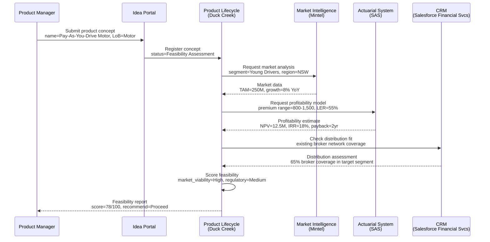
```mermaid
sequenceDiagram
    participant PM as Product Manager
    participant IP as Idea Portal
    participant PLM as Product Lifecycle<br/>(Duck Creek)
    participant MI as Market Intelligence<br/>(Mintel)
    participant ACT as Actuarial System<br/>(SAS)
    participant CRM as CRM<br/>(Salesforce Financial Svcs)
    PM->>IP: Submit product concept<br/>name=Pay-As-You-Drive Motor, LoB=Motor
    IP->>PLM: Register concept<br/>status=Feasibility Assessment
    PLM->>MI: Request market analysis<br/>segment=Young Drivers, region=NSW
    MI-->>PLM: Market data<br/>TAM=250M, growth=8% YoY
    PLM->>ACT: Request profitability model<br/>premium range=800-1,500, LER=55%
    ACT-->>PLM: Profitability estimate<br/>NPV=12.5M, IRR=18%, payback=2yr
    PLM->>CRM: Check distribution fit<br/>existing broker network coverage
    CRM-->>PLM: Distribution assessment<br/>65% broker coverage in target segment
    PLM->>PLM: Score feasibility<br/>market_viability=High, regulatory=Medium
    PLM-->>PM: Feasibility report<br/>score=78/100, recommend=Proceed
```

#### Integration Details

| Flow | Entity | Info Flow | Source | Target | Source Conn | Target Conn | Pattern | Complexity |
|------|--------|-----------|--------|--------|-------------|-------------|---------|------------|
| Product Concept | Concept | SubmitProductConcept | Idea Portal | Product Lifecycle (Duck Creek) | Portal REST API | Duck Creek REST API (OAuth2) | API-led (Real-time) | Simple |
| Product Concept | Market | RequestMarketAnalysis | Product Lifecycle (Duck Creek) | Market Intelligence (Mintel) | Duck Creek REST API | Mintel API (REST) | API-led (Real-time) | Medium |
| Product Concept | Profitability | ModelProfitability | Product Lifecycle (Duck Creek) | Actuarial System (SAS) | Duck Creek REST API | SAS API (SOAP) | API-led (Real-time) | High |
| Product Concept | Distribution | AssessDistributionFit | Product Lifecycle (Duck Creek) | CRM (Salesforce Financial Services) | Duck Creek REST API | Salesforce REST API (OAuth2) | API-led (Real-time) | Medium |
| Product Concept | Decision | RecordFeasibilityDecision | Product Lifecycle (Duck Creek) | Idea Portal | Duck Creek REST API | Portal REST API | Event-driven | Simple |

#### Acceptance Criteria

| Flow | Entity | Acceptance Criterion | Expected Outcome |
|------|--------|---------------------|------------------|
| Product Concept | Concept | Product concept submitted with all mandatory fields | Concept registered in Duck Creek with status 'Feasibility Assessment' and ID assigned |
| Product Concept | Market | Market analysis returned within 24 hours | Market size, growth rate, competitor share, and regulatory landscape populated |
| Product Concept | Profitability | Profitability model run with base assumptions | NPV positive, IRR > hurdle rate of 15%, payback period < 3 years |
| Product Concept | Distribution | Distribution channel assessment completed | Channel coverage score calculated; gap analysis for under-served channels |
| Product Concept | Decision | Feasibility score triggers proceed / revise / reject decision | Score >= 70 auto-proceeds; 50-70 requires HoD approval; <50 rejected |

---

### 1.2 Product Design & Coverage Development

**Description:** Product team designs coverage details, policy terms, conditions, exclusions, and configures rating rules in the product administration system.

**Actors:** Product Manager, Actuary, Legal Counsel  
**Systems:** Product Lifecycle Mgmt (Duck Creek), Rating Engine (Duck Creek Rating), Policy Admin (Guidewire PolicyCenter), Document Mgmt (M-Files), Legal Repository (SealSign)

#### Sequence Diagram

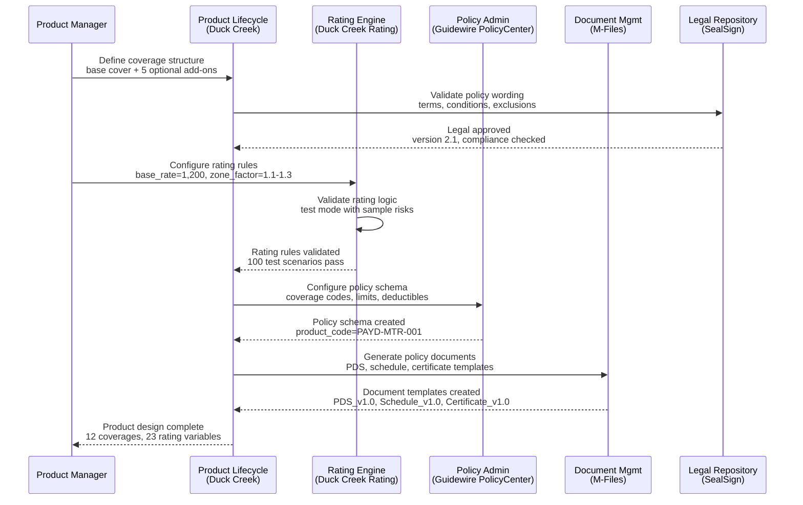
```mermaid
sequenceDiagram
    participant PM as Product Manager
    participant PLM as Product Lifecycle<br/>(Duck Creek)
    participant RATE as Rating Engine<br/>(Duck Creek Rating)
    participant PAS as Policy Admin<br/>(Guidewire PolicyCenter)
    participant DOC as Document Mgmt<br/>(M-Files)
    participant LEGAL as Legal Repository<br/>(SealSign)
    PM->>PLM: Define coverage structure<br/>base cover + 5 optional add-ons
    PLM->>LEGAL: Validate policy wording<br/>terms, conditions, exclusions
    LEGAL-->>PLM: Legal approved<br/>version 2.1, compliance checked
    PM->>RATE: Configure rating rules<br/>base_rate=1,200, zone_factor=1.1-1.3
    RATE->>RATE: Validate rating logic<br/>test mode with sample risks
    RATE-->>PLM: Rating rules validated<br/>100 test scenarios pass
    PLM->>PAS: Configure policy schema<br/>coverage codes, limits, deductibles
    PAS-->>PLM: Policy schema created<br/>product_code=PAYD-MTR-001
    PLM->>DOC: Generate policy documents<br/>PDS, schedule, certificate templates
    DOC-->>PLM: Document templates created<br/>PDS_v1.0, Schedule_v1.0, Certificate_v1.0
    PLM-->>PM: Product design complete<br/>12 coverages, 23 rating variables
```

#### Integration Details

| Flow | Entity | Info Flow | Source | Target | Source Conn | Target Conn | Pattern | Complexity |
|------|--------|-----------|--------|--------|-------------|-------------|---------|------------|
| Product Design | Coverage | DefineCoverageStructure | Product Lifecycle (Duck Creek) | Product Lifecycle (Duck Creek) | Internal | Internal | API-led (Real-time) | Medium |
| Product Design | Legal | ValidatePolicyWording | Product Lifecycle (Duck Creek) | Legal Repository (SealSign) | Duck Creek REST API | SealSign API (REST) | API-led (Real-time) | Simple |
| Product Design | Rating | ConfigureRatingRules | Product Lifecycle (Duck Creek) | Rating Engine (Duck Creek Rating) | Duck Creek REST API | Duck Creek Rating API (REST) | API-led (Real-time) | High |
| Product Design | Policy | ConfigurePolicySchema | Product Lifecycle (Duck Creek) | Policy Admin (Guidewire PolicyCenter) | Duck Creek REST API | Guidewire REST API (API Key) | API-led (Real-time) | Medium |
| Product Design | Document | GeneratePolicyDocuments | Product Lifecycle (Duck Creek) | Document Mgmt (M-Files) | Duck Creek REST API | M-Files REST API (API Key) | Batch (Scheduled) | Simple |

#### Acceptance Criteria

| Flow | Entity | Acceptance Criterion | Expected Outcome |
|------|--------|---------------------|------------------|
| Product Design | Coverage | Coverage structure defined with base and optional add-ons | All coverage codes created; limits and deductibles configured; relationship rules enforced |
| Product Design | Legal | Policy wording legally approved and version-controlled | Wording version recorded; compliance checked against regulatory requirements; approval timestamped |
| Product Design | Rating | Rating rules validated against 100+ test scenarios | All scenarios pass with expected premium output; rating engine response time < 500ms |
| Product Design | Policy | Policy schema configured in policy admin system | Schema contains all coverages, limits, deductibles; data model aligns with product definition |
| Product Design | Document | Policy document templates generated from approved wording | All document types generated; template version aligned with legal-approved wording version |

---

### 1.3 Rate & Form Filing

**Description:** Product team prepares rate and form filing submission for regulatory approval. Filing package includes actuarial justification, proposed rates, and policy forms.

**Actors:** Product Manager, Actuary, Compliance Officer, Regulator  
**Systems:** Product Lifecycle Mgmt (Duck Creek), Actuarial System (SAS), Filing Portal (Regulator), Document Mgmt (M-Files)

#### Sequence Diagram

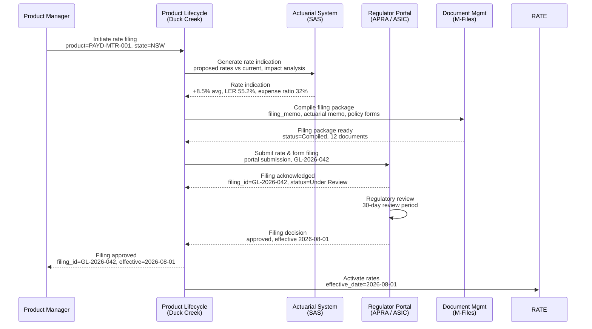
```mermaid
sequenceDiagram
    participant PM as Product Manager
    participant PLM as Product Lifecycle<br/>(Duck Creek)
    participant ACT as Actuarial System<br/>(SAS)
    participant REG as Regulator Portal<br/>(APRA / ASIC)
    participant DOC as Document Mgmt<br/>(M-Files)
    PM->>PLM: Initiate rate filing<br/>product=PAYD-MTR-001, state=NSW
    PLM->>ACT: Generate rate indication<br/>proposed rates vs current, impact analysis
    ACT-->>PLM: Rate indication<br/>+8.5% avg, LER 55.2%, expense ratio 32%
    PLM->>DOC: Compile filing package<br/>filing_memo, actuarial memo, policy forms
    DOC-->>PLM: Filing package ready<br/>status=Compiled, 12 documents
    PLM->>REG: Submit rate & form filing<br/>portal submission, GL-2026-042
    REG-->>PLM: Filing acknowledged<br/>filing_id=GL-2026-042, status=Under Review
    REG->>REG: Regulatory review<br/>30-day review period
    REG-->>PLM: Filing decision<br/>approved, effective 2026-08-01
    PLM-->>PM: Filing approved<br/>filing_id=GL-2026-042, effective=2026-08-01
    PLM->>RATE: Activate rates<br/>effective_date=2026-08-01
```

#### Integration Details

| Flow | Entity | Info Flow | Source | Target | Source Conn | Target Conn | Pattern | Complexity |
|------|--------|-----------|--------|--------|-------------|-------------|---------|------------|
| Rate Filing | Rate | GenerateRateIndication | Product Lifecycle (Duck Creek) | Actuarial System (SAS) | Duck Creek REST API | SAS API (SOAP) | API-led (Real-time) | High |
| Rate Filing | Package | CompileFilingPackage | Product Lifecycle (Duck Creek) | Document Mgmt (M-Files) | Duck Creek REST API | M-Files REST API (API Key) | Batch (Scheduled) | Medium |
| Rate Filing | Submit | SubmitFilingToRegulator | Product Lifecycle (Duck Creek) | Regulator Portal (APRA/ASIC) | Duck Creek REST API | Regulator Portal API (SOAP) | API-led (Real-time) | High |
| Rate Filing | Decision | RecordFilingDecision | Regulator Portal (APRA/ASIC) | Product Lifecycle (Duck Creek) | Regulator Portal API (SOAP) | Duck Creek REST API | Event-driven | Medium |
| Rate Filing | Activate | ActivateApprovedRates | Product Lifecycle (Duck Creek) | Rating Engine (Duck Creek Rating) | Duck Creek REST API | Duck Creek Rating API (REST) | API-led (Real-time) | Simple |

#### Acceptance Criteria

| Flow | Entity | Acceptance Criterion | Expected Outcome |
|------|--------|---------------------|------------------|
| Rate Filing | Rate | Rate indication prepared with actuarial justification | Rate indication includes current vs proposed comparison, impact analysis, and actuarial certification |
| Rate Filing | Package | Filing package compiled with all required documents | 12 documents generated; all mandatory forms present; package completeness validated |
| Rate Filing | Submit | Filing submitted to regulator via official portal | Submission acknowledged with filing ID; confirmation receipt stored in document management |
| Rate Filing | Decision | Regulatory decision recorded upon completion of review | Decision captured with effective date; approved/rejected/amended status recorded with reason |
| Rate Filing | Activate | Approved rates activated on effective date | Rates become live at 00:00 on effective date; new quotes use approved rates; audit trail maintained |

---

### 1.4 Product Launch & Distribution

**Description:** Product team coordinates launch across channels. System configuration enables quoting, training material distributed, and marketing campaigns activated.

**Actors:** Product Manager, Marketing Manager, Training Coordinator, IT Operations  
**Systems:** Product Lifecycle Mgmt (Duck Creek), CRM (Salesforce Financial Services), Learning Mgmt (Cornerstone), Marketing Platform (Marketo), Policy Admin (Guidewire PolicyCenter)

#### Sequence Diagram

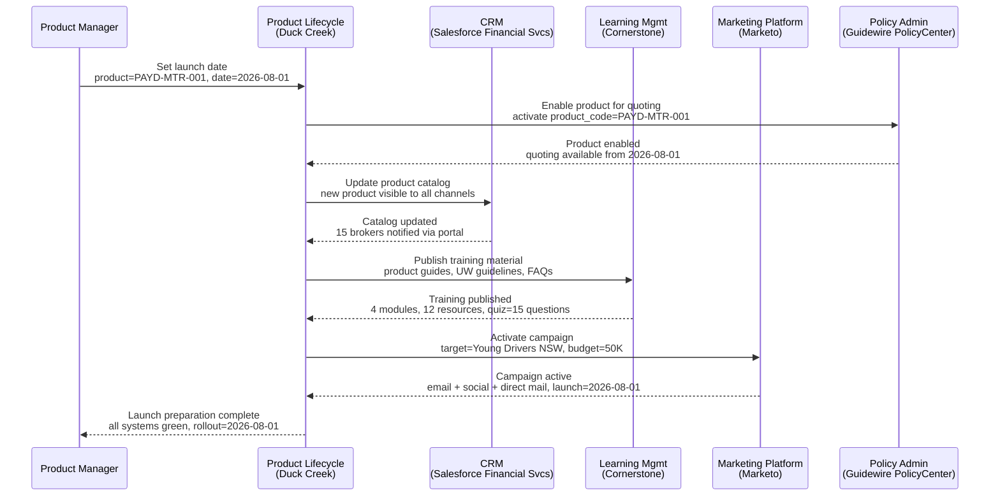
```mermaid
sequenceDiagram
    participant PM as Product Manager
    participant PLM as Product Lifecycle<br/>(Duck Creek)
    participant CRM as CRM<br/>(Salesforce Financial Svcs)
    participant LMS as Learning Mgmt<br/>(Cornerstone)
    participant MKT as Marketing Platform<br/>(Marketo)
    participant PAS as Policy Admin<br/>(Guidewire PolicyCenter)
    PM->>PLM: Set launch date<br/>product=PAYD-MTR-001, date=2026-08-01
    PLM->>PAS: Enable product for quoting<br/>activate product_code=PAYD-MTR-001
    PAS-->>PLM: Product enabled<br/>quoting available from 2026-08-01
    PLM->>CRM: Update product catalog<br/>new product visible to all channels
    CRM-->>PLM: Catalog updated<br/>15 brokers notified via portal
    PLM->>LMS: Publish training material<br/>product guides, UW guidelines, FAQs
    LMS-->>PLM: Training published<br/>4 modules, 12 resources, quiz=15 questions
    PLM->>MKT: Activate campaign<br/>target=Young Drivers NSW, budget=50K
    MKT-->>PLM: Campaign active<br/>email + social + direct mail, launch=2026-08-01
    PLM-->>PM: Launch preparation complete<br/>all systems green, rollout=2026-08-01
```

#### Integration Details

| Flow | Entity | Info Flow | Source | Target | Source Conn | Target Conn | Pattern | Complexity |
|------|--------|-----------|--------|--------|-------------|-------------|---------|------------|
| Product Launch | Enable | EnableProductForQuoting | Product Lifecycle (Duck Creek) | Policy Admin (Guidewire PolicyCenter) | Duck Creek REST API | Guidewire REST API (API Key) | API-led (Real-time) | Medium |
| Product Launch | Distribution | UpdateChannelProductCatalog | Product Lifecycle (Duck Creek) | CRM (Salesforce Financial Services) | Duck Creek REST API | Salesforce REST API (OAuth2) | Event-driven | Simple |
| Product Launch | Training | PublishTrainingMaterial | Product Lifecycle (Duck Creek) | Learning Mgmt (Cornerstone) | Duck Creek REST API | Cornerstone API (REST) | Batch (Scheduled) | Medium |
| Product Launch | Marketing | ActivateMarketingCampaign | Product Lifecycle (Duck Creek) | Marketing Platform (Marketo) | Duck Creek REST API | Marketo API (REST) | API-led (Real-time) | Simple |
| Product Launch | Notification | NotifyChannelPartners | CRM (Salesforce Financial Services) | Producers / Brokers | Salesforce REST API (OAuth2) | Email / Portal | Event-driven | Simple |

#### Acceptance Criteria

| Flow | Entity | Acceptance Criterion | Expected Outcome |
|------|--------|---------------------|------------------|
| Product Launch | Enable | Product enabled for quoting in policy admin system | Product active for quoting from launch date; all coverage codes available; rating engine responsive |
| Product Launch | Distribution | Product catalog updated across all channels | Product visible to all producers; pricing and coverage details displayed correctly; brochures available |
| Product Launch | Training | Training material published and available to all staff and producers | Training completion trackable; quiz result recorded; certificate issued on completion |
| Product Launch | Marketing | Marketing campaign activated targeting defined audience | Campaign launched on schedule; tracking pixels active; budget allocation confirmed |
| Product Launch | Notification | All channel partners notified of product launch | Notification sent 14 days pre-launch; reminder sent 48 hours before; launch-day confirmation sent |

---

### 1.5 Product Performance Monitoring

**Description:** Product team monitors in-force block performance. System tracks loss ratios, expense ratios, policy counts, and triggers alerts when thresholds breached.

**Actors:** Product Manager, Actuary, Underwriting Manager  
**Systems:** Product Lifecycle Mgmt (Duck Creek), Data Warehouse (Snowflake), BI Platform (Tableau), Actuarial System (SAS)

#### Sequence Diagram

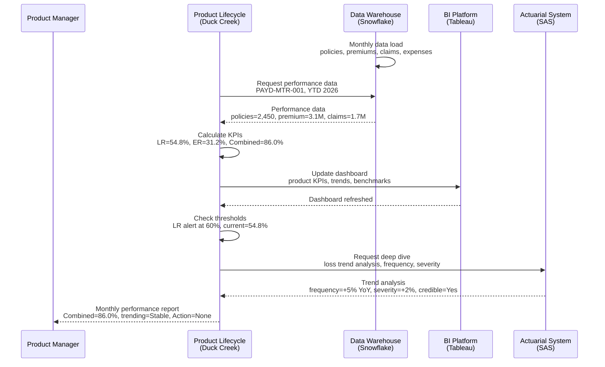
```mermaid
sequenceDiagram
    participant PM as Product Manager
    participant PLM as Product Lifecycle<br/>(Duck Creek)
    participant DW as Data Warehouse<br/>(Snowflake)
    participant BI as BI Platform<br/>(Tableau)
    participant ACT as Actuarial System<br/>(SAS)
    DW->>DW: Monthly data load<br/>policies, premiums, claims, expenses
    PLM->>DW: Request performance data<br/>PAYD-MTR-001, YTD 2026
    DW-->>PLM: Performance data<br/>policies=2,450, premium=3.1M, claims=1.7M
    PLM->>PLM: Calculate KPIs<br/>LR=54.8%, ER=31.2%, Combined=86.0%
    PLM->>BI: Update dashboard<br/>product KPIs, trends, benchmarks
    BI-->>PLM: Dashboard refreshed
    PLM->>PLM: Check thresholds<br/>LR alert at 60%, current=54.8%
    PLM->>ACT: Request deep dive<br/>loss trend analysis, frequency, severity
    ACT-->>PLM: Trend analysis<br/>frequency=+5% YoY, severity=+2%, credible=Yes
    PLM-->>PM: Monthly performance report<br/>Combined=86.0%, trending=Stable, Action=None
```

#### Integration Details

| Flow | Entity | Info Flow | Source | Target | Source Conn | Target Conn | Pattern | Complexity |
|------|--------|-----------|--------|--------|-------------|-------------|---------|------------|
| Product Monitoring | Data | RequestPerformanceData | Product Lifecycle (Duck Creek) | Data Warehouse (Snowflake) | Duck Creek REST API | Snowflake JDBC | API-led (Real-time) | Medium |
| Product Monitoring | KPI | CalculateProductKPIs | Product Lifecycle (Duck Creek) | Product Lifecycle (Duck Creek) | Internal | Internal | Batch (Scheduled) | Simple |
| Product Monitoring | Dashboard | UpdateDashboard | Product Lifecycle (Duck Creek) | BI Platform (Tableau) | Duck Creek REST API | Tableau REST API | Event-driven | Simple |
| Product Monitoring | Trend | AnalyzeLossTrends | Product Lifecycle (Duck Creek) | Actuarial System (SAS) | Duck Creek REST API | SAS API (SOAP) | Batch (Scheduled) | High |
| Product Monitoring | Alert | ThresholdBreachAlert | Product Lifecycle (Duck Creek) | Notification Service (Firebase) | Duck Creek REST API | Firebase FCM API | Event-driven | Simple |

#### Acceptance Criteria

| Flow | Entity | Acceptance Criterion | Expected Outcome |
|------|--------|---------------------|------------------|
| Product Monitoring | Data | Performance data loaded from warehouse within SLA | Data refreshed daily; T-1 data available by 6:00 AM; data completeness > 99.5% |
| Product Monitoring | KPI | KPIs calculated automatically on data refresh | Loss ratio, expense ratio, combined ratio, policy count, average premium all calculated |
| Product Monitoring | Dashboard | Product dashboard updated with latest KPIs | Dashboard loads within 3 seconds; drill-down to policy and claim level works |
| Product Monitoring | Trend | Actuarial trend analysis run monthly with credible data | Frequency and severity trends with confidence intervals; credible data flagged |
| Product Monitoring | Alert | Alert triggered when KPI threshold breached | Alert sent to product manager within 5 minutes; threshold levels configurable per KPI |

---

# 2: Distribution & Channel Management  — `IN005` `IN006` `IN007` `IN008`

### 2.1 Agency & Producer Onboarding

**Description:** Insurance company onboards new agency or broker. System verifies licensing, performs background checks, sets up commission structure, and activates producer.

**Actors:** Agency Manager, Compliance Officer, Producer  
**Systems:** CRM (Salesforce Financial Services), Producer Mgmt (Oracle Insurance), Licensing Database (Pinpoint), Commission System (Duck Creek Billing)

#### Sequence Diagram

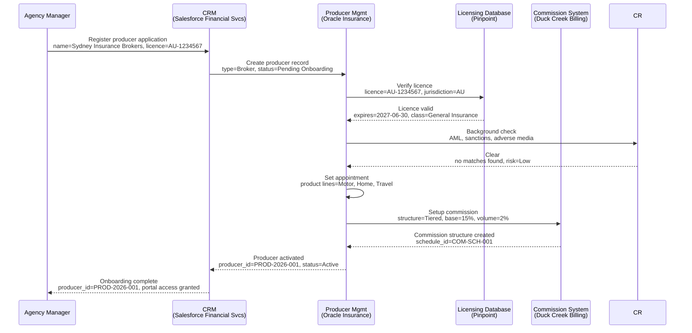
```mermaid
sequenceDiagram
    participant AM as Agency Manager
    participant CRM as CRM<br/>(Salesforce Financial Svcs)
    participant PROD as Producer Mgmt<br/>(Oracle Insurance)
    participant LIC as Licensing Database<br/>(Pinpoint)
    participant COMM as Commission System<br/>(Duck Creek Billing)
    AM->>CRM: Register producer application<br/>name=Sydney Insurance Brokers, licence=AU-1234567
    CRM->>PROD: Create producer record<br/>type=Broker, status=Pending Onboarding
    PROD->>LIC: Verify licence<br/>licence=AU-1234567, jurisdiction=AU
    LIC-->>PROD: Licence valid<br/>expires=2027-06-30, class=General Insurance
    PROD->>CR: Background check<br/>AML, sanctions, adverse media
    CR-->>PROD: Clear<br/>no matches found, risk=Low
    PROD->>PROD: Set appointment<br/>product lines=Motor, Home, Travel
    PROD->>COMM: Setup commission<br/>structure=Tiered, base=15%, volume=2%
    COMM-->>PROD: Commission structure created<br/>schedule_id=COM-SCH-001
    PROD-->>CRM: Producer activated<br/>producer_id=PROD-2026-001, status=Active
    CRM-->>AM: Onboarding complete<br/>producer_id=PROD-2026-001, portal access granted
```

#### Integration Details

| Flow | Entity | Info Flow | Source | Target | Source Conn | Target Conn | Pattern | Complexity |
|------|--------|-----------|--------|--------|-------------|-------------|---------|------------|
| Producer Onboarding | Registration | RegisterProducerApplication | CRM (Salesforce Financial Services) | Producer Mgmt (Oracle Insurance) | Salesforce REST API (OAuth2) | Oracle REST API (OAuth2) | API-led (Real-time) | Medium |
| Producer Onboarding | Licensing | VerifyLicense | Producer Mgmt (Oracle Insurance) | Licensing Database (Pinpoint) | Oracle REST API | Pinpoint API (SOAP) | API-led (Real-time) | Medium |
| Producer Onboarding | Background | PerformBackgroundCheck | Producer Mgmt (Oracle Insurance) | Screening (WorldCheck) | Oracle REST API | WorldCheck API (SOAP) | API-led (Real-time) | Medium |
| Producer Onboarding | Commission | SetupCommissionStructure | Producer Mgmt (Oracle Insurance) | Commission System (Duck Creek Billing) | Oracle REST API | Duck Creek REST API (OAuth2) | API-led (Real-time) | Medium |
| Producer Onboarding | Activation | ActivateProducer | Producer Mgmt (Oracle Insurance) | CRM (Salesforce Financial Services) | Oracle REST API | Salesforce REST API (OAuth2) | Event-driven | Simple |

#### Acceptance Criteria

| Flow | Entity | Acceptance Criterion | Expected Outcome |
|------|--------|---------------------|------------------|
| Producer Onboarding | Registration | Producer application registered with all mandatory fields | Producer record created with unique ID; status set to Pending Onboarding |
| Producer Onboarding | Licensing | Producer licence verified against regulatory database | Licence validated for jurisdiction; expiry date recorded; automatic renewal reminders configured |
| Producer Onboarding | Background | Background check completed with no adverse findings | AML, sanctions, and adverse media checks pass; any match >= 80% triggers compliance review |
| Producer Onboarding | Commission | Commission structure setup complete | Tiered commission schedule created; override and clawback rules configured |
| Producer Onboarding | Activation | Producer activated and portal access granted | Producer can log in, submit business, and view commissions; appointment letter generated |

---

### 2.2 Commission Management

**Description:** Commission system calculates producer commissions based on premium written, tier structure, and bonus programs. Commission statements generated and approved.

**Actors:** Finance Officer, Agency Manager, Producer  
**Systems:** Commission System (Duck Creek Billing), Policy Admin (Guidewire PolicyCenter), Finance GL (SAP), Producer Portal

#### Sequence Diagram

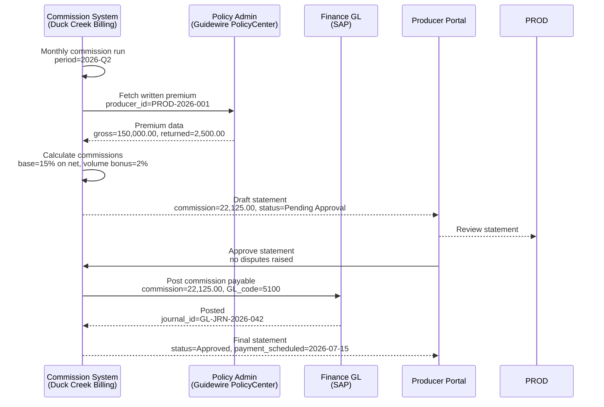
```mermaid
sequenceDiagram
    participant COMM as Commission System<br/>(Duck Creek Billing)
    participant PAS as Policy Admin<br/>(Guidewire PolicyCenter)
    participant GL as Finance GL<br/>(SAP)
    participant PORTAL as Producer Portal
    COMM->>COMM: Monthly commission run<br/>period=2026-Q2
    COMM->>PAS: Fetch written premium<br/>producer_id=PROD-2026-001
    PAS-->>COMM: Premium data<br/>gross=150,000.00, returned=2,500.00
    COMM->>COMM: Calculate commissions<br/>base=15% on net, volume bonus=2%
    COMM-->>PORTAL: Draft statement<br/>commission=22,125.00, status=Pending Approval
    PORTAL-->>PROD: Review statement
    PORTAL->>COMM: Approve statement<br/>no disputes raised
    COMM->>GL: Post commission payable<br/>commission=22,125.00, GL_code=5100
    GL-->>COMM: Posted<br/>journal_id=GL-JRN-2026-042
    COMM-->>PORTAL: Final statement<br/>status=Approved, payment_scheduled=2026-07-15
```

#### Integration Details

| Flow | Entity | Info Flow | Source | Target | Source Conn | Target Conn | Pattern | Complexity |
|------|--------|-----------|--------|--------|-------------|-------------|---------|------------|
| Commission | Premium | FetchWrittenPremium | Commission System (Duck Creek Billing) | Policy Admin (Guidewire PolicyCenter) | Duck Creek REST API | Guidewire REST API (API Key) | Batch (Scheduled) | Medium |
| Commission | Calculation | CalculateCommission | Commission System (Duck Creek Billing) | Commission System (Duck Creek Billing) | Internal | Internal | Batch (Scheduled) | Medium |
| Commission | Statement | PublishCommissionStatement | Commission System (Duck Creek Billing) | Producer Portal | Duck Creek REST API | Portal REST API (JWT) | Event-driven | Simple |
| Commission | Approval | ApproveCommissionStatement | Producer Portal | Commission System (Duck Creek Billing) | Portal REST API (JWT) | Duck Creek REST API | API-led (Real-time) | Simple |
| Commission | Posting | PostCommissionToGL | Commission System (Duck Creek Billing) | Finance GL (SAP) | Duck Creek REST API | SAP API (SOAP) | Batch (Scheduled) | High |

#### Acceptance Criteria

| Flow | Entity | Acceptance Criterion | Expected Outcome |
|------|--------|---------------------|------------------|
| Commission | Premium | Written premium data fetched for commission period | All in-force policies included; returned premiums deducted; multi-currency conversion applied |
| Commission | Calculation | Commission calculated per producer commission schedule | Base rate applied; volume bonus calculated; clawback rules applied for cancelled policies |
| Commission | Statement | Commission statement published to producer portal | Statement includes policy-level breakdown; dispute window open for 14 days |
| Commission | Approval | Approved commission statement processed for payment | Both producer and company approval captured; disputed items flagged and excluded |
| Commission | Posting | Commission payable posted to general ledger | GL entry balanced; accrual reversed on payment; audit trail links statement to journal |

---

### 2.3 Producer Performance Management

**Description:** Management monitors producer performance against KPIs including premium volume, loss ratio, retention rate, and compliance score.

**Actors:** Agency Manager, Underwriting Manager, Producer  
**Systems:** CRM (Salesforce Financial Services), BI Platform (Tableau), Policy Admin (Guidewire PolicyCenter), Data Warehouse (Snowflake)

#### Sequence Diagram

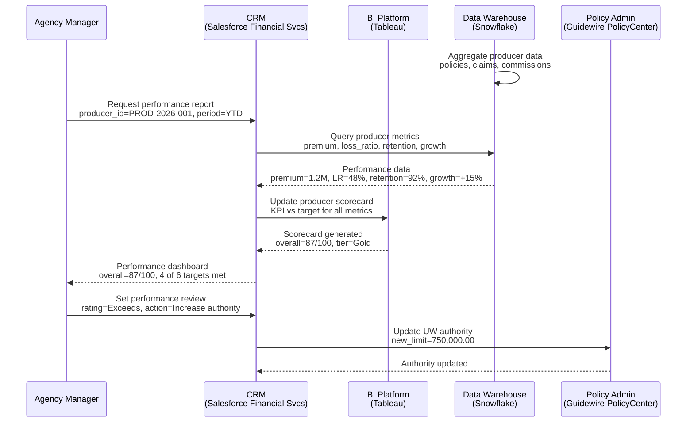
```mermaid
sequenceDiagram
    participant AM as Agency Manager
    participant CRM as CRM<br/>(Salesforce Financial Svcs)
    participant BI as BI Platform<br/>(Tableau)
    participant DW as Data Warehouse<br/>(Snowflake)
    participant PAS as Policy Admin<br/>(Guidewire PolicyCenter)
    DW->>DW: Aggregate producer data<br/>policies, claims, commissions
    AM->>CRM: Request performance report<br/>producer_id=PROD-2026-001, period=YTD
    CRM->>DW: Query producer metrics<br/>premium, loss_ratio, retention, growth
    DW-->>CRM: Performance data<br/>premium=1.2M, LR=48%, retention=92%, growth=+15%
    CRM->>BI: Update producer scorecard<br/>KPI vs target for all metrics
    BI-->>CRM: Scorecard generated<br/>overall=87/100, tier=Gold
    CRM-->>AM: Performance dashboard<br/>overall=87/100, 4 of 6 targets met
    AM->>CRM: Set performance review<br/>rating=Exceeds, action=Increase authority
    CRM->>PAS: Update UW authority<br/>new_limit=750,000.00
    PAS-->>CRM: Authority updated
```

#### Integration Details

| Flow | Entity | Info Flow | Source | Target | Source Conn | Target Conn | Pattern | Complexity |
|------|--------|-----------|--------|--------|-------------|-------------|---------|------------|
| Producer Performance | Data | AggregateProducerMetrics | Data Warehouse (Snowflake) | Data Warehouse (Snowflake) | Internal | Internal | Batch (Scheduled) | Medium |
| Producer Performance | Query | QueryProducerMetrics | CRM (Salesforce Financial Services) | Data Warehouse (Snowflake) | Salesforce REST API (OAuth2) | Snowflake JDBC | API-led (Real-time) | Medium |
| Producer Performance | Scorecard | GenerateProducerScorecard | CRM (Salesforce Financial Services) | BI Platform (Tableau) | Salesforce REST API (OAuth2) | Tableau REST API | Event-driven | Simple |
| Producer Performance | Review | RecordPerformanceReview | CRM (Salesforce Financial Services) | CRM (Salesforce Financial Services) | Internal | Internal | API-led (Real-time) | Simple |
| Producer Performance | Authority | UpdateUwAuthority | CRM (Salesforce Financial Services) | Policy Admin (Guidewire PolicyCenter) | Salesforce REST API (OAuth2) | Guidewire REST API (API Key) | API-led (Real-time) | Medium |

#### Acceptance Criteria

| Flow | Entity | Acceptance Criterion | Expected Outcome |
|------|--------|---------------------|------------------|
| Producer Performance | Data | Producer metrics aggregated from source systems daily | Data freshness < 24 hours; all producers included; metrics calculated consistently across periods |
| Producer Performance | Query | Producer performance query returns within 5 seconds | Premium volume, loss ratio, retention rate, policy growth, and compliance score returned |
| Producer Performance | Scorecard | Scorecard generated with KPI vs target comparison | Traffic-light indicators; trend arrows; peer comparison percentile; overall composite score |
| Producer Performance | Review | Performance review recorded with rating and action plan | Review history maintained; rating change triggers workflow; action items assigned |
| Producer Performance | Authority | Underwriting authority updated based on performance tier | Authority limit effective immediately; audit trail of change; notification sent to producer |

---

### 2.4 Lead Distribution & Campaign Management

**Description:** Marketing campaigns generate leads. Lead distribution engine assigns leads to producers based on rules including territory, product fit, and capacity.

**Actors:** Marketing Manager, Producer, Campaign Manager  
**Systems:** Marketing Platform (Marketo), Lead Distribution Engine, CRM (Salesforce Financial Services), Producer Portal

#### Sequence Diagram

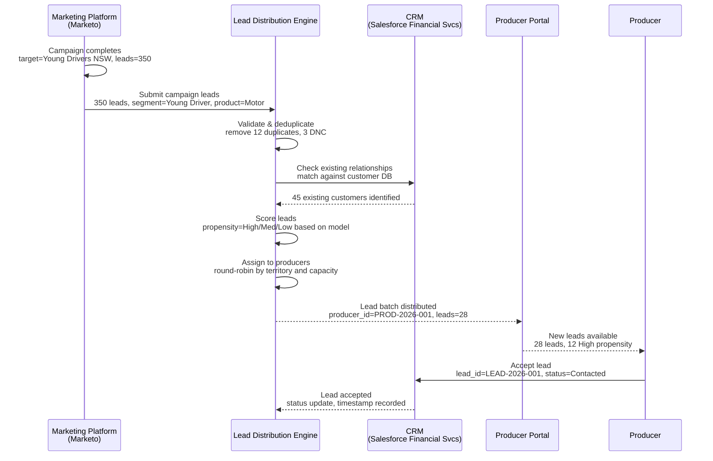
```mermaid
sequenceDiagram
    participant MKT as Marketing Platform<br/>(Marketo)
    participant LE as Lead Distribution Engine
    participant CRM as CRM<br/>(Salesforce Financial Svcs)
    participant PORTAL as Producer Portal
    participant PROD as Producer
    MKT->>MKT: Campaign completes<br/>target=Young Drivers NSW, leads=350
    MKT->>LE: Submit campaign leads<br/>350 leads, segment=Young Driver, product=Motor
    LE->>LE: Validate & deduplicate<br/>remove 12 duplicates, 3 DNC
    LE->>CRM: Check existing relationships<br/>match against customer DB
    CRM-->>LE: 45 existing customers identified
    LE->>LE: Score leads<br/>propensity=High/Med/Low based on model
    LE->>LE: Assign to producers<br/>round-robin by territory and capacity
    LE-->>PORTAL: Lead batch distributed<br/>producer_id=PROD-2026-001, leads=28
    PORTAL-->>PROD: New leads available<br/>28 leads, 12 High propensity
    PROD->>CRM: Accept lead<br/>lead_id=LEAD-2026-001, status=Contacted
    CRM-->>LE: Lead accepted<br/>status update, timestamp recorded
```

#### Integration Details

| Flow | Entity | Info Flow | Source | Target | Source Conn | Target Conn | Pattern | Complexity |
|------|--------|-----------|--------|--------|-------------|-------------|---------|------------|
| Lead Distribution | Source | SubmitCampaignLeads | Marketing Platform (Marketo) | Lead Distribution Engine | Marketo API (REST) | Lead Engine API (REST) | Event-driven | Medium |
| Lead Distribution | Validation | ValidateAndDeduplicate | Lead Distribution Engine | Lead Distribution Engine | Internal | Internal | API-led (Real-time) | Medium |
| Lead Distribution | Match | CheckExistingRelationship | Lead Distribution Engine | CRM (Salesforce Financial Services) | Lead Engine API (REST) | Salesforce REST API (OAuth2) | API-led (Real-time) | Simple |
| Lead Distribution | Score | ScoreLeadPropensity | Lead Distribution Engine | Lead Distribution Engine | Internal | Internal | Batch (Real-time) | Medium |
| Lead Distribution | Assign | AssignLeadToProducer | Lead Distribution Engine | Producer Portal | Lead Engine API (REST) | Portal REST API (JWT) | Event-driven | Simple |

#### Acceptance Criteria

| Flow | Entity | Acceptance Criterion | Expected Outcome |
|------|--------|---------------------|------------------|
| Lead Distribution | Source | Campaign leads ingested and validated within 60 minutes of campaign end | Duplicate removal, DNC check, and format validation completed; rejection report generated |
| Lead Distribution | Match | Existing customers identified and routed to relationship manager | Customer-producer relationship respected; cross-sell leads flagged; new business leads separate |
| Lead Distribution | Score | Lead propensity scored using predictive model | Score distribution captured; model confidence reported; feedback loop for model improvement |
| Lead Distribution | Assign | Leads assigned to producers based on rules | Round-robin balanced; territory mapped; producer capacity respected; unassigned leads queued |
| Lead Distribution | Response | Lead accepted within 24 hours triggers auto-reminder for unaccepted leads | Accepted leads show status change; unaccepted leads escalate at 24/48/72 hours |

---

### 2.5 Distribution Analytics & Optimization

**Description:** Distribution analytics team analyzes channel performance, cost-to-serve, conversion rates, and recommends optimization strategies.

**Actors:** Agency Manager, Data Analyst, Channel Manager  
**Systems:** Data Warehouse (Snowflake), BI Platform (Tableau), CRM (Salesforce Financial Services), Policy Admin (Guidewire PolicyCenter)

#### Sequence Diagram

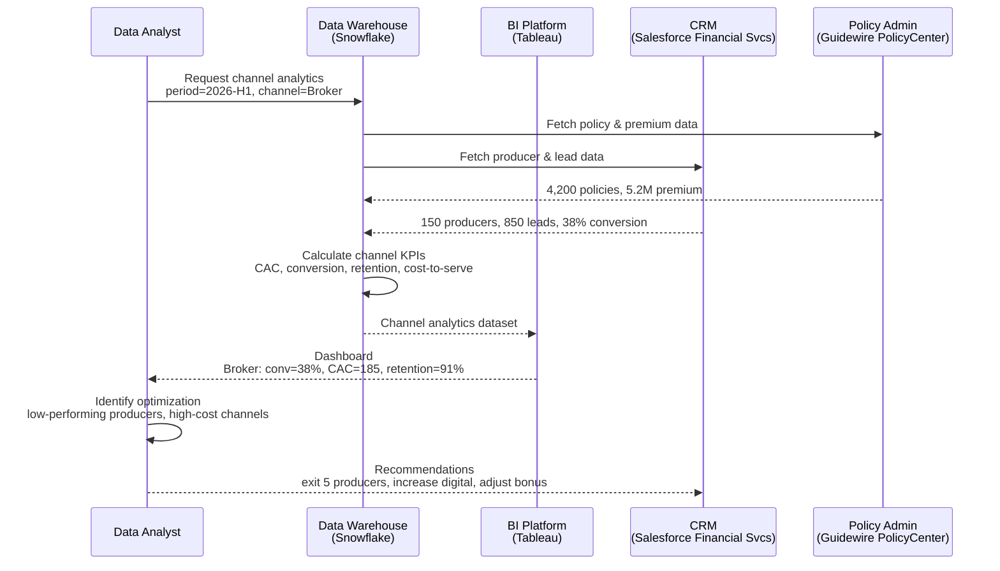
```mermaid
sequenceDiagram
    participant DA as Data Analyst
    participant DW as Data Warehouse<br/>(Snowflake)
    participant BI as BI Platform<br/>(Tableau)
    participant CRM as CRM<br/>(Salesforce Financial Svcs)
    participant PAS as Policy Admin<br/>(Guidewire PolicyCenter)
    DA->>DW: Request channel analytics<br/>period=2026-H1, channel=Broker
    DW->>PAS: Fetch policy & premium data
    DW->>CRM: Fetch producer & lead data
    PAS-->>DW: 4,200 policies, 5.2M premium
    CRM-->>DW: 150 producers, 850 leads, 38% conversion
    DW->>DW: Calculate channel KPIs<br/>CAC, conversion, retention, cost-to-serve
    DW-->>BI: Channel analytics dataset
    BI-->>DA: Dashboard<br/>Broker: conv=38%, CAC=185, retention=91%
    DA->>DA: Identify optimization<br/>low-performing producers, high-cost channels
    DA-->>CRM: Recommendations<br/>exit 5 producers, increase digital, adjust bonus
```

#### Integration Details

| Flow | Entity | Info Flow | Source | Target | Source Conn | Target Conn | Pattern | Complexity |
|------|--------|-----------|--------|--------|-------------|-------------|---------|------------|
| Distribution Analytics | Fetch | FetchChannelData | Data Warehouse (Snowflake) | Policy Admin (Guidewire PolicyCenter) | Snowflake JDBC | Guidewire REST API (API Key) | Batch (Scheduled) | Medium |
| Distribution Analytics | CRM | FetchCRMData | Data Warehouse (Snowflake) | CRM (Salesforce Financial Services) | Snowflake JDBC | Salesforce REST API (OAuth2) | Batch (Scheduled) | Medium |
| Distribution Analytics | KPI | CalculateChannelKPIs | Data Warehouse (Snowflake) | Data Warehouse (Snowflake) | Internal | Internal | Batch (Scheduled) | Medium |
| Distribution Analytics | Visualize | VisualizeChannelAnalytics | Data Warehouse (Snowflake) | BI Platform (Tableau) | Snowflake JDBC | Tableau REST API | Event-driven | Simple |
| Distribution Analytics | Recommend | SubmitOptimizationRecommendations | BI Platform (Tableau) | CRM (Salesforce Financial Services) | Tableau REST API | Salesforce REST API (OAuth2) | Event-driven | Simple |

#### Acceptance Criteria

| Flow | Entity | Acceptance Criterion | Expected Outcome |
|------|--------|---------------------|------------------|
| Distribution Analytics | Fetch | Channel data fetched from all source systems | Data reconciled across systems; date ranges aligned; multi-currency normalized |
| Distribution Analytics | CRM | Producer and lead data integrated | Lead-to-policy conversion traceable; producer activity log complete; attribution accurate |
| Distribution Analytics | KPI | Channel KPIs calculated consistently | CAC, conversion rate, retention rate, cost-to-serve, and cross-sell ratio all calculated |
| Distribution Analytics | Visualize | Channel analytics dashboard generated | Dashboard loads within 5 seconds; filterable by channel, region, product, period |
| Distribution Analytics | Recommend | Optimization recommendations submitted with business case | Recommendations ranked by ROI; expected impact modeled; approval workflow initiated |

---

# 3: Underwriting  — `IN009` `IN010` `IN011` `IN012`

### 3.1 New Business Submission

**Description:** Producer submits new business application. System validates data completeness, performs initial triage, and routes to underwriting queue.

**Actors:** Producer, Underwriter, Operations Coordinator  
**Systems:** Producer Portal, Policy Admin (Guidewire PolicyCenter), Document Mgmt (M-Files), Underwriting Workbench (Origami Risk)

#### Sequence Diagram

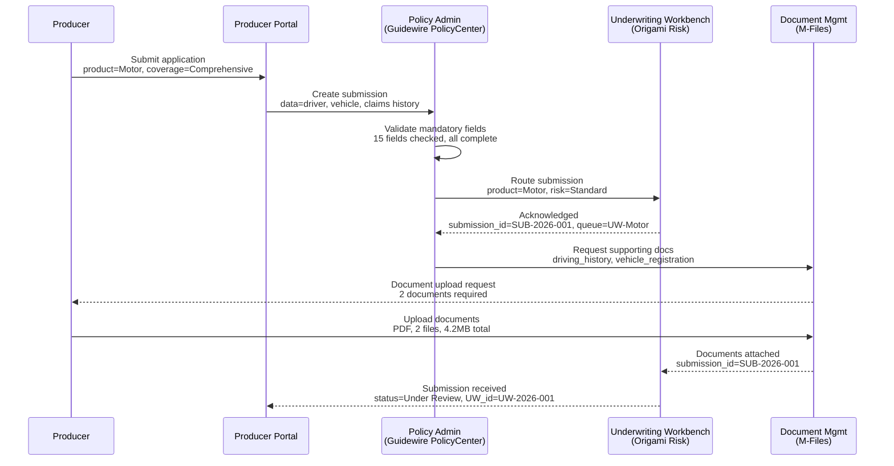
```mermaid
sequenceDiagram
    participant PROD as Producer
    participant PORTAL as Producer Portal
    participant PAS as Policy Admin<br/>(Guidewire PolicyCenter)
    participant UW as Underwriting Workbench<br/>(Origami Risk)
    participant DOC as Document Mgmt<br/>(M-Files)
    PROD->>PORTAL: Submit application<br/>product=Motor, coverage=Comprehensive
    PORTAL->>PAS: Create submission<br/>data=driver, vehicle, claims history
    PAS->>PAS: Validate mandatory fields<br/>15 fields checked, all complete
    PAS->>UW: Route submission<br/>product=Motor, risk=Standard
    UW-->>PAS: Acknowledged<br/>submission_id=SUB-2026-001, queue=UW-Motor
    PAS->>DOC: Request supporting docs<br/>driving_history, vehicle_registration
    DOC-->>PROD: Document upload request<br/>2 documents required
    PROD->>DOC: Upload documents<br/>PDF, 2 files, 4.2MB total
    DOC-->>UW: Documents attached<br/>submission_id=SUB-2026-001
    UW-->>PORTAL: Submission received<br/>status=Under Review, UW_id=UW-2026-001
```

#### Integration Details

| Flow | Entity | Info Flow | Source | Target | Source Conn | Target Conn | Pattern | Complexity |
|------|--------|-----------|--------|--------|-------------|-------------|---------|------------|
| New Business | Submit | SubmitApplication | Producer Portal | Policy Admin (Guidewire PolicyCenter) | Portal REST API (JWT) | Guidewire REST API (API Key) | API-led (Real-time) | Simple |
| New Business | Validate | ValidateMandatoryFields | Policy Admin (Guidewire PolicyCenter) | Policy Admin (Guidewire PolicyCenter) | Internal | Internal | API-led (Real-time) | Simple |
| New Business | Route | RouteSubmission | Policy Admin (Guidewire PolicyCenter) | Underwriting Workbench (Origami Risk) | Guidewire REST API (API Key) | Origami API (REST) | API-led (Real-time) | Medium |
| New Business | Document | RequestSupportingDocuments | Policy Admin (Guidewire PolicyCenter) | Document Mgmt (M-Files) | Guidewire REST API (API Key) | M-Files REST API (API Key) | Event-driven | Simple |
| New Business | Attachment | AttachDocumentsToSubmission | Document Mgmt (M-Files) | Underwriting Workbench (Origami Risk) | M-Files REST API (API Key) | Origami API (REST) | Event-driven | Medium |

#### Acceptance Criteria

| Flow | Entity | Acceptance Criterion | Expected Outcome |
|------|--------|---------------------|------------------|
| New Business | Submit | Application submitted with all mandatory data | Mandatory field validation passes; submission ID generated; confirmation sent to producer |
| New Business | Validate | Validation rules applied to all submission fields | All required fields populated; data format validated; out-of-range values flagged |
| New Business | Route | Submission routed to correct underwriting queue | Queue assignment based on product line, risk band, and workload balancing |
| New Business | Document | Document upload request sent to producer within 60 seconds | Upload portal link sent; document requirements clearly listed; deadline indicated |
| New Business | Attachment | Uploaded documents attached to submission record | Document index updated; OCR processing initiated; document status reflected in UW workbench |

---

### 3.2 Risk Assessment & Scoring

**Description:** Underwriting system evaluates risk using rules, third-party data, and predictive models. Risk score determines pricing tier and acceptance decision.

**Actors:** Underwriter, Risk Analyst  
**Systems:** Underwriting Workbench (Origami Risk), Rating Engine (Duck Creek Rating), Data Provider (Verisk), Credit Bureau (Equifax), Fraud Detection (FICO Falcon)

#### Sequence Diagram

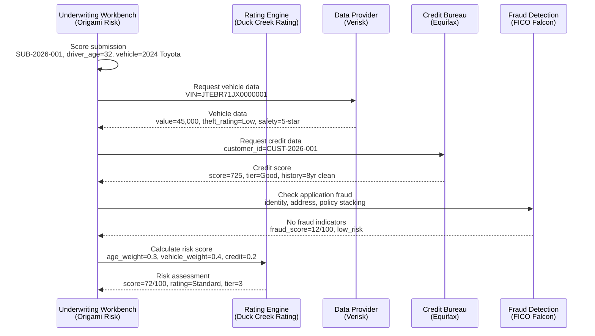
```mermaid
sequenceDiagram
    participant UW as Underwriting Workbench<br/>(Origami Risk)
    participant RATE as Rating Engine<br/>(Duck Creek Rating)
    participant VER as Data Provider<br/>(Verisk)
    participant EQ as Credit Bureau<br/>(Equifax)
    participant FRAUD as Fraud Detection<br/>(FICO Falcon)
    UW->>UW: Score submission<br/>SUB-2026-001, driver_age=32, vehicle=2024 Toyota
    UW->>VER: Request vehicle data<br/>VIN=JTEBR71JX0000001
    VER-->>UW: Vehicle data<br/>value=45,000, theft_rating=Low, safety=5-star
    UW->>EQ: Request credit data<br/>customer_id=CUST-2026-001
    EQ-->>UW: Credit score<br/>score=725, tier=Good, history=8yr clean
    UW->>FRAUD: Check application fraud<br/>identity, address, policy stacking
    FRAUD-->>UW: No fraud indicators<br/>fraud_score=12/100, low_risk
    UW->>RATE: Calculate risk score<br/>age_weight=0.3, vehicle_weight=0.4, credit=0.2
    RATE-->>UW: Risk assessment<br/>score=72/100, rating=Standard, tier=3
```

#### Integration Details

| Flow | Entity | Info Flow | Source | Target | Source Conn | Target Conn | Pattern | Complexity |
|------|--------|-----------|--------|--------|-------------|-------------|---------|------------|
| Risk Assessment | Vehicle | RequestVehicleData | Underwriting Workbench (Origami Risk) | Data Provider (Verisk) | Origami API (REST) | Verisk API (SOAP) | API-led (Real-time) | Medium |
| Risk Assessment | Credit | RequestCreditData | Underwriting Workbench (Origami Risk) | Credit Bureau (Equifax) | Origami API (REST) | Equifax API (SOAP) | API-led (Real-time) | Medium |
| Risk Assessment | Fraud | CheckFraudIndicators | Underwriting Workbench (Origami Risk) | Fraud Detection (FICO Falcon) | Origami API (REST) | Falcon API (ISO 8583) | API-led (Real-time) | High |
| Risk Assessment | Score | CalculateRiskScore | Underwriting Workbench (Origami Risk) | Rating Engine (Duck Creek Rating) | Origami API (REST) | Duck Creek Rating API (REST) | API-led (Real-time) | Medium |
| Risk Assessment | Result | RecordRiskAssessment | Underwriting Workbench (Origami Risk) | Underwriting Workbench (Origami Risk) | Internal | Internal | Event-driven | Simple |

#### Acceptance Criteria

| Flow | Entity | Acceptance Criterion | Expected Outcome |
|------|--------|---------------------|------------------|
| Risk Assessment | Vehicle | Vehicle data retrieved from Verisk within 5 seconds | VIN decoded correctly; vehicle value, theft rating, and safety rating populated |
| Risk Assessment | Credit | Credit data retrieved from Equifax within 10 seconds | Credit score retrieved; adverse flags reported; consent check confirmed |
| Risk Assessment | Fraud | Fraud check completed within 3 seconds | Fraud score returned; identity verification passed; policy stacking checked |
| Risk Assessment | Score | Risk score calculated using weighted model | Score 0-100; rating bands applied; score breakdown visible to underwriter |
| Risk Assessment | Result | Risk assessment recorded and attached to submission | Assessment timestamped; data sources logged; score and rating persisted |

---

### 3.3 Underwriting Decision & Referral

**Description:** Underwriter reviews risk assessment and makes decision. Referrals automatically escalated to senior underwriter or chief underwriter based on authority limits.

**Actors:** Underwriter, Senior Underwriter, Chief Underwriter  
**Systems:** Underwriting Workbench (Origami Risk), Decision Engine (FICO Blaze), Policy Admin (Guidewire PolicyCenter), CRM (Salesforce Financial Services)

#### Sequence Diagram

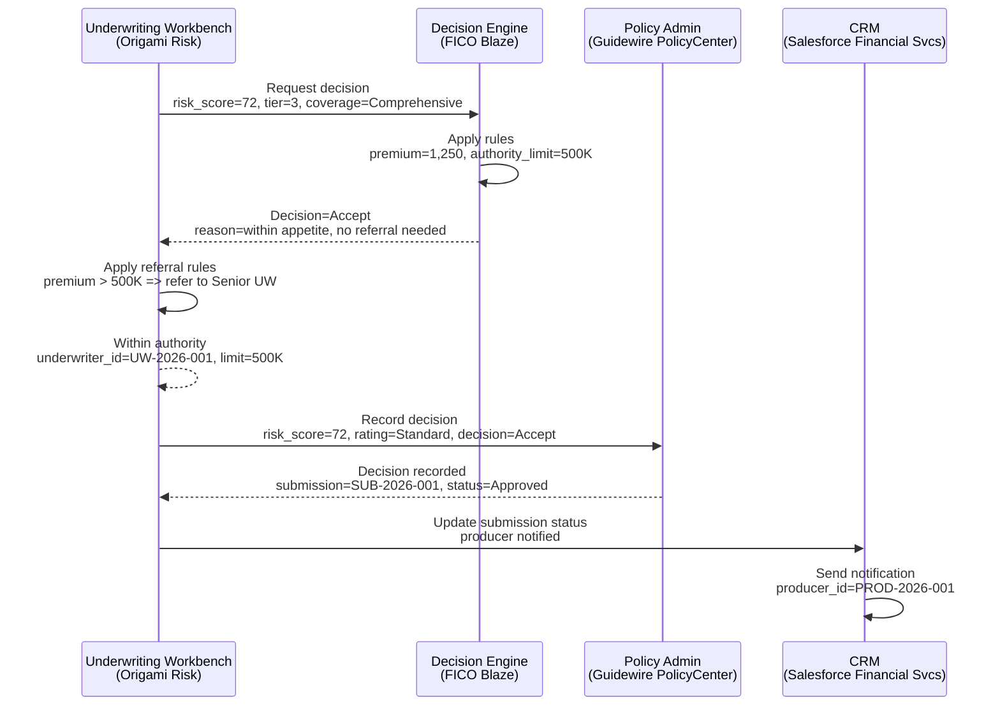
```mermaid
sequenceDiagram
    participant UW as Underwriting Workbench<br/>(Origami Risk)
    participant DE as Decision Engine<br/>(FICO Blaze)
    participant PAS as Policy Admin<br/>(Guidewire PolicyCenter)
    participant CRM as CRM<br/>(Salesforce Financial Svcs)
    UW->>DE: Request decision<br/>risk_score=72, tier=3, coverage=Comprehensive
    DE->>DE: Apply rules<br/>premium=1,250, authority_limit=500K
    DE-->>UW: Decision=Accept<br/>reason=within appetite, no referral needed
    UW->>UW: Apply referral rules<br/>premium > 500K => refer to Senior UW
    UW-->>UW: Within authority<br/>underwriter_id=UW-2026-001, limit=500K
    UW->>PAS: Record decision<br/>risk_score=72, rating=Standard, decision=Accept
    PAS-->>UW: Decision recorded<br/>submission=SUB-2026-001, status=Approved
    UW->>CRM: Update submission status<br/>producer notified
    CRM->>CRM: Send notification<br/>producer_id=PROD-2026-001
```

#### Integration Details

| Flow | Entity | Info Flow | Source | Target | Source Conn | Target Conn | Pattern | Complexity |
|------|--------|-----------|--------|--------|-------------|-------------|---------|------------|
| Uw Decision | Decision | RequestUnderwritingDecision | Underwriting Workbench (Origami Risk) | Decision Engine (FICO Blaze) | Origami API (REST) | FICO Blaze API (REST) | API-led (Real-time) | Medium |
| Uw Decision | Referral | ApplyReferralRules | Underwriting Workbench (Origami Risk) | Underwriting Workbench (Origami Risk) | Internal | Internal | API-led (Real-time) | Simple |
| Uw Decision | Record | RecordDecision | Underwriting Workbench (Origami Risk) | Policy Admin (Guidewire PolicyCenter) | Origami API (REST) | Guidewire REST API (API Key) | API-led (Real-time) | Medium |
| Uw Decision | Notify | NotifyProducerOfDecision | Underwriting Workbench (Origami Risk) | CRM (Salesforce Financial Services) | Origami API (REST) | Salesforce REST API (OAuth2) | Event-driven | Simple |
| Uw Decision | Escalate | EscalateToSeniorUw | Underwriting Workbench (Origami Risk) | Underwriting Workbench (Origami Risk) | Internal | Internal | Event-driven | Simple |

#### Acceptance Criteria

| Flow | Entity | Acceptance Criterion | Expected Outcome |
|------|--------|---------------------|------------------|
| Uw Decision | Decision | Decision engine evaluates risk score against underwriting rules | Decision returned with reason; rules version logged; auto-accept if all criteria met |
| Uw Decision | Referral | Referral rules applied based on authority matrix | Referral to senior UW when premium > authority limit; referral to chief UW when > senior limit |
| Uw Decision | Record | Decision recorded in policy admin system | Decision timestamped; UW ID recorded; decision reason persisted |
| Uw Decision | Notify | Producer notified of decision | Accept: quote link sent; Decline: decline letter with reason; Refer: expected timeline communicated |
| Uw Decision | Escalate | Referral escalated with full submission context | Senior UW sees risk assessment, data sources, and recommendation; SLA timer started |

---

### 3.4 Quote Generation

**Description:** System generates quote based on risk assessment, rates, and approved discounts. Quote presented to producer and customer with full breakdown.

**Actors:** Underwriter, Producer, Customer  
**Systems:** Rating Engine (Duck Creek Rating), Policy Admin (Guidewire PolicyCenter), Producer Portal, Document Mgmt (M-Files)

#### Sequence Diagram

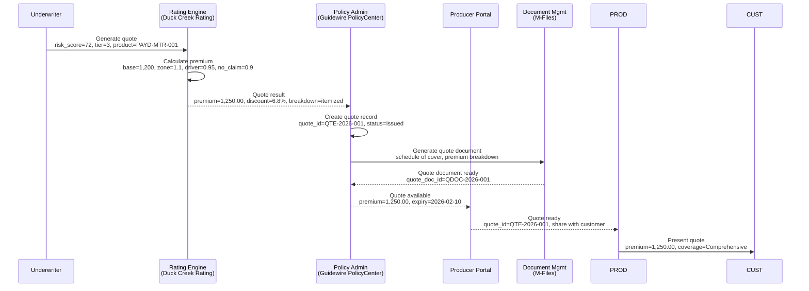
```mermaid
sequenceDiagram
    participant UW as Underwriter
    participant RATE as Rating Engine<br/>(Duck Creek Rating)
    participant PAS as Policy Admin<br/>(Guidewire PolicyCenter)
    participant PORTAL as Producer Portal
    participant DOC as Document Mgmt<br/>(M-Files)
    UW->>RATE: Generate quote<br/>risk_score=72, tier=3, product=PAYD-MTR-001
    RATE->>RATE: Calculate premium<br/>base=1,200, zone=1.1, driver=0.95, no_claim=0.9
    RATE-->>PAS: Quote result<br/>premium=1,250.00, discount=6.8%, breakdown=itemized
    PAS->>PAS: Create quote record<br/>quote_id=QTE-2026-001, status=Issued
    PAS->>DOC: Generate quote document<br/>schedule of cover, premium breakdown
    DOC-->>PAS: Quote document ready<br/>quote_doc_id=QDOC-2026-001
    PAS-->>PORTAL: Quote available<br/>premium=1,250.00, expiry=2026-02-10
    PORTAL-->>PROD: Quote ready<br/>quote_id=QTE-2026-001, share with customer
    PROD->>CUST: Present quote<br/>premium=1,250.00, coverage=Comprehensive
```

#### Integration Details

| Flow | Entity | Info Flow | Source | Target | Source Conn | Target Conn | Pattern | Complexity |
|------|--------|-----------|--------|--------|-------------|-------------|---------|------------|
| Quote | Calculate | CalculatePremium | Underwriting Workbench (Origami Risk) | Rating Engine (Duck Creek Rating) | Origami API (REST) | Duck Creek Rating API (REST) | API-led (Real-time) | Medium |
| Quote | Create | CreateQuoteRecord | Policy Admin (Guidewire PolicyCenter) | Policy Admin (Guidewire PolicyCenter) | Internal | Internal | API-led (Real-time) | Simple |
| Quote | Document | GenerateQuoteDocument | Policy Admin (Guidewire PolicyCenter) | Document Mgmt (M-Files) | Guidewire REST API (API Key) | M-Files REST API (API Key) | Event-driven | Simple |
| Quote | Distribute | DistributeQuote | Policy Admin (Guidewire PolicyCenter) | Producer Portal | Guidewire REST API (API Key) | Portal REST API (JWT) | Event-driven | Simple |
| Quote | Expiry | MonitorQuoteExpiry | Policy Admin (Guidewire PolicyCenter) | Policy Admin (Guidewire PolicyCenter) | Internal | Internal | Batch (Scheduled) | Simple |

#### Acceptance Criteria

| Flow | Entity | Acceptance Criterion | Expected Outcome |
|------|--------|---------------------|------------------|
| Quote | Calculate | Premium calculated using approved rates and rating rules | Premium calculation matches rate manual; all rating factors applied correctly; discounts itemized |
| Quote | Create | Quote record created with unique ID | Quote ID format QTE-YYYY-NNN; status = Issued; all pricing fields populated |
| Quote | Document | Quote document generated from approved templates | Schedule of cover accurate; premium breakdown matches system calculation; document watermarked |
| Quote | Distribute | Quote available to producer and customer | Quote accessible via portal; email notification sent; quote PDF available for download |
| Quote | Expiry | Quote expiry monitored and notifications sent before expiry | Expiry reminder at T-14, T-7, T-1 days; expired quotes flagged and removed from active view |

---

### 3.5 Bind & Evidence of Insurance

**Description:** Customer accepts quote, payment is processed, policy is bound, and evidence of insurance (certificate) is issued immediately.

**Actors:** Customer, Producer, Operations  
**Systems:** Producer Portal, Policy Admin (Guidewire PolicyCenter), Payment Gateway (Stripe), Document Mgmt (M-Files), Rating Engine (Duck Creek Rating)

#### Sequence Diagram

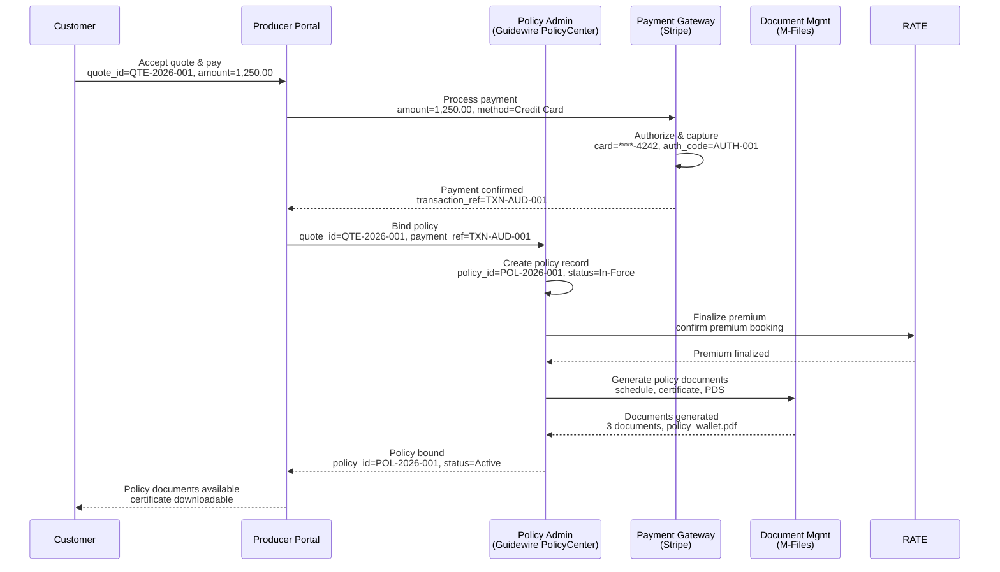
```mermaid
sequenceDiagram
    participant CUST as Customer
    participant PORTAL as Producer Portal
    participant PAS as Policy Admin<br/>(Guidewire PolicyCenter)
    participant PAY as Payment Gateway<br/>(Stripe)
    participant DOC as Document Mgmt<br/>(M-Files)
    CUST->>PORTAL: Accept quote & pay<br/>quote_id=QTE-2026-001, amount=1,250.00
    PORTAL->>PAY: Process payment<br/>amount=1,250.00, method=Credit Card
    PAY->>PAY: Authorize & capture<br/>card=****-4242, auth_code=AUTH-001
    PAY-->>PORTAL: Payment confirmed<br/>transaction_ref=TXN-AUD-001
    PORTAL->>PAS: Bind policy<br/>quote_id=QTE-2026-001, payment_ref=TXN-AUD-001
    PAS->>PAS: Create policy record<br/>policy_id=POL-2026-001, status=In-Force
    PAS->>RATE: Finalize premium<br/>confirm premium booking
    RATE-->>PAS: Premium finalized
    PAS->>DOC: Generate policy documents<br/>schedule, certificate, PDS
    DOC-->>PAS: Documents generated<br/>3 documents, policy_wallet.pdf
    PAS-->>PORTAL: Policy bound<br/>policy_id=POL-2026-001, status=Active
    PORTAL-->>CUST: Policy documents available<br/>certificate downloadable
```

#### Integration Details

| Flow | Entity | Info Flow | Source | Target | Source Conn | Target Conn | Pattern | Complexity |
|------|--------|-----------|--------|--------|-------------|-------------|---------|------------|
| Bind | Payment | ProcessPayment | Producer Portal | Payment Gateway (Stripe) | Portal REST API (JWT) | Stripe API (REST) | API-led (Real-time) | Simple |
| Bind | Policy | BindPolicy | Producer Portal | Policy Admin (Guidewire PolicyCenter) | Portal REST API (JWT) | Guidewire REST API (API Key) | API-led (Real-time) | Medium |
| Bind | Premium | FinalizePremiumBooking | Policy Admin (Guidewire PolicyCenter) | Rating Engine (Duck Creek Rating) | Guidewire REST API (API Key) | Duck Creek Rating API (REST) | API-led (Real-time) | Simple |
| Bind | Documents | GeneratePolicyDocuments | Policy Admin (Guidewire PolicyCenter) | Document Mgmt (M-Files) | Guidewire REST API (API Key) | M-Files REST API (API Key) | Event-driven | Medium |
| Bind | Certificate | IssueCertificateOfInsurance | Policy Admin (Guidewire PolicyCenter) | Producer Portal | Guidewire REST API (API Key) | Portal REST API (JWT) | Event-driven | Simple |

#### Acceptance Criteria

| Flow | Entity | Acceptance Criterion | Expected Outcome |
|------|--------|---------------------|------------------|
| Bind | Payment | Payment processed successfully before policy binding | Payment authorized and captured; receipt generated; failed payment prevents binding |
| Bind | Policy | Policy bound with effective date and status In-Force | Policy number assigned; coverage effective from payment timestamp; terms and conditions applied |
| Bind | Premium | Premium finalized and booked in rating system | Premium amount matches quote; booking confirmed; commission calculated for producer |
| Bind | Documents | All policy documents generated and available | Policy schedule, certificate, and PDS generated within 30 seconds; documents watermarked |
| Bind | Certificate | Certificate of insurance issued to customer immediately | Certificate downloadable; contains policy number, coverage summary, and insurer details |

---

# 4: Policy Administration  — `IN013` `IN014` `IN015`

### 4.1 Policy Issuance

**Description:** After binding, policy administration system issues the full policy documentation, sends to customer, and activates in-force management workflows.

**Actors:** Operations, Customer, Producer  
**Systems:** Policy Admin (Guidewire PolicyCenter), Document Mgmt (M-Files), Customer Portal, CRM (Salesforce Financial Services), Core Insurance (Majesco)

#### Sequence Diagram

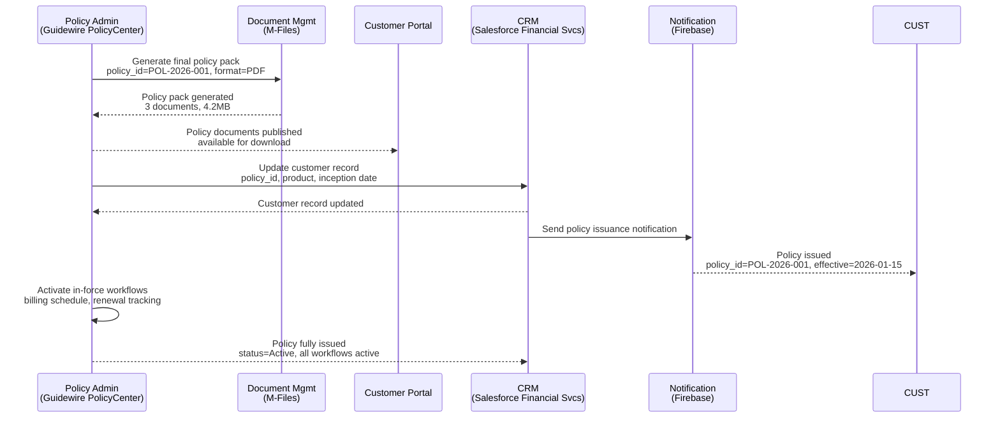
```mermaid
sequenceDiagram
    participant PAS as Policy Admin<br/>(Guidewire PolicyCenter)
    participant DOC as Document Mgmt<br/>(M-Files)
    participant PORTAL as Customer Portal
    participant CRM as CRM<br/>(Salesforce Financial Svcs)
    participant NOT as Notification<br/>(Firebase)
    PAS->>DOC: Generate final policy pack<br/>policy_id=POL-2026-001, format=PDF
    DOC-->>PAS: Policy pack generated<br/>3 documents, 4.2MB
    PAS-->>PORTAL: Policy documents published<br/>available for download
    PAS->>CRM: Update customer record<br/>policy_id, product, inception date
    CRM-->>PAS: Customer record updated
    CRM->>NOT: Send policy issuance notification
    NOT-->>CUST: Policy issued<br/>policy_id=POL-2026-001, effective=2026-01-15
    PAS->>PAS: Activate in-force workflows<br/>billing schedule, renewal tracking
    PAS-->>CRM: Policy fully issued<br/>status=Active, all workflows active
```

#### Integration Details

| Flow | Entity | Info Flow | Source | Target | Source Conn | Target Conn | Pattern | Complexity |
|------|--------|-----------|--------|--------|-------------|-------------|---------|------------|
| Policy Issuance | Documents | GeneratePolicyPack | Policy Admin (Guidewire PolicyCenter) | Document Mgmt (M-Files) | Guidewire REST API (API Key) | M-Files REST API (API Key) | Event-driven | Medium |
| Policy Issuance | Customer | UpdateCustomerRecord | Policy Admin (Guidewire PolicyCenter) | CRM (Salesforce Financial Services) | Guidewire REST API (API Key) | Salesforce REST API (OAuth2) | Event-driven | Simple |
| Policy Issuance | Portal | PublishPolicyToPortal | Policy Admin (Guidewire PolicyCenter) | Customer Portal | Guidewire REST API (API Key) | Portal REST API (JWT) | Event-driven | Simple |
| Policy Issuance | Notification | SendIssuanceNotification | CRM (Salesforce Financial Services) | Notification Service (Firebase) | Salesforce REST API (OAuth2) | Firebase FCM API | Event-driven | Simple |
| Policy Issuance | Activation | ActivateInForceWorkflows | Policy Admin (Guidewire PolicyCenter) | Policy Admin (Guidewire PolicyCenter) | Internal | Internal | Batch (Scheduled) | Simple |

#### Acceptance Criteria

| Flow | Entity | Acceptance Criterion | Expected Outcome |
|------|--------|---------------------|------------------|
| Policy Issuance | Documents | Policy document pack generated within 60 seconds of binding | All required documents included; document quality verified; watermark and barcode applied |
| Policy Issuance | Customer | Customer record updated with new policy information | Customer profile shows active policy; policy linked to customer ID; CRM fields populated |
| Policy Issuance | Portal | Policy documents available on customer portal | Documents accessible within 2 minutes; permissions correctly set per policy holder |
| Policy Issuance | Notification | Issuance notification sent to customer | Email and push notification sent; delivery confirmed; policy summary included |
| Policy Issuance | Activation | In-force management workflows activated | Billing schedule created; first premium due date set; renewal countdown initiated |

---

### 4.2 Mid-Term Adjustments & Endorsements

**Description:** Customer requests policy change mid-term. System validates change, adjusts premium, generates endorsement document, and updates policy record.

**Actors:** Customer, Operations, Underwriter (if authority needed)  
**Systems:** Customer Portal, Policy Admin (Guidewire PolicyCenter), Rating Engine (Duck Creek Rating), Document Mgmt (M-Files), CRM (Salesforce Financial Services)

#### Sequence Diagram

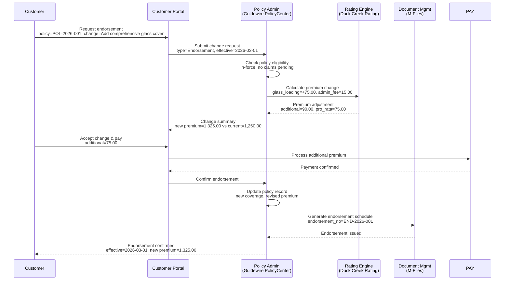
```mermaid
sequenceDiagram
    participant CUST as Customer
    participant PORTAL as Customer Portal
    participant PAS as Policy Admin<br/>(Guidewire PolicyCenter)
    participant RATE as Rating Engine<br/>(Duck Creek Rating)
    participant DOC as Document Mgmt<br/>(M-Files)
    CUST->>PORTAL: Request endorsement<br/>policy=POL-2026-001, change=Add comprehensive glass cover
    PORTAL->>PAS: Submit change request<br/>type=Endorsement, effective=2026-03-01
    PAS->>PAS: Check policy eligibility<br/>in-force, no claims pending
    PAS->>RATE: Calculate premium change<br/>glass_loading=+75.00, admin_fee=15.00
    RATE-->>PAS: Premium adjustment<br/>additional=90.00, pro_rata=75.00
    PAS-->>PORTAL: Change summary<br/>new premium=1,325.00 vs current=1,250.00
    CUST->>PORTAL: Accept change & pay<br/>additional=75.00
    PORTAL->>PAY: Process additional premium
    PAY-->>PORTAL: Payment confirmed
    PORTAL->>PAS: Confirm endorsement
    PAS->>PAS: Update policy record<br/>new coverage, revised premium
    PAS->>DOC: Generate endorsement schedule<br/>endorsement_no=END-2026-001
    DOC-->>PAS: Endorsement issued
    PAS-->>CUST: Endorsement confirmed<br/>effective=2026-03-01, new premium=1,325.00
```

#### Integration Details

| Flow | Entity | Info Flow | Source | Target | Source Conn | Target Conn | Pattern | Complexity |
|------|--------|-----------|--------|--------|-------------|-------------|---------|------------|
| Endorsement | Eligibility | CheckPolicyEligibility | Policy Admin (Guidewire PolicyCenter) | Policy Admin (Guidewire PolicyCenter) | Internal | Internal | API-led (Real-time) | Simple |
| Endorsement | Rating | CalculatePremiumChange | Policy Admin (Guidewire PolicyCenter) | Rating Engine (Duck Creek Rating) | Guidewire REST API (API Key) | Duck Creek Rating API (REST) | API-led (Real-time) | Medium |
| Endorsement | Payment | ProcessAdditionalPremium | Customer Portal | Payment Gateway (Stripe) | Portal REST API (JWT) | Stripe API (REST) | API-led (Real-time) | Simple |
| Endorsement | Update | UpdatePolicyRecord | Policy Admin (Guidewire PolicyCenter) | Policy Admin (Guidewire PolicyCenter) | Internal | Internal | API-led (Real-time) | Medium |
| Endorsement | Document | GenerateEndorsementSchedule | Policy Admin (Guidewire PolicyCenter) | Document Mgmt (M-Files) | Guidewire REST API (API Key) | M-Files REST API (API Key) | Event-driven | Simple |

#### Acceptance Criteria

| Flow | Entity | Acceptance Criterion | Expected Outcome |
|------|--------|---------------------|------------------|
| Endorsement | Eligibility | Mid-term change eligibility validated before processing | Policy in-force; no claim pending; change within allowable parameters; referral limit checked |
| Endorsement | Rating | Premium change calculated correctly with pro-rata adjustment | Additional premium calculated; pro-rata for remaining term; admin fee applied |
| Endorsement | Payment | Additional premium processed before endorsement effective | Payment successful; endorsement effective from requested date; failed payment keeps current terms |
| Endorsement | Update | Policy record updated with new coverage and premium | Coverage codes added; premium revised; policy version incremented; audit trail recorded |
| Endorsement | Document | Endorsement schedule generated and issued | Endorsement number assigned; document reflects all changes; customer notified with copy |

---

### 4.3 Renewal Processing

**Description:** System generates renewal offer before policy expiry. Underwriter reviews loss history, adjusts terms, and customer accepts renewal with payment.

**Actors:** Customer, Underwriter, Producer, Operations  
**Systems:** Policy Admin (Guidewire PolicyCenter), Rating Engine (Duck Creek Rating), CRM (Salesforce Financial Services), Customer Portal, Document Mgmt (M-Files)

#### Sequence Diagram

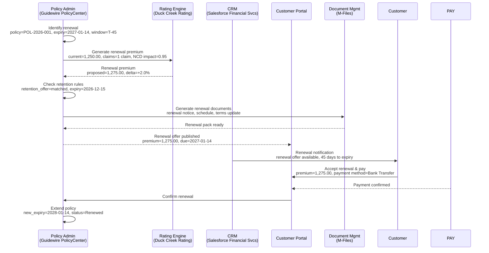
```mermaid
sequenceDiagram
    participant PAS as Policy Admin<br/>(Guidewire PolicyCenter)
    participant RATE as Rating Engine<br/>(Duck Creek Rating)
    participant CRM as CRM<br/>(Salesforce Financial Svcs)
    participant PORTAL as Customer Portal
    participant DOC as Document Mgmt<br/>(M-Files)
    participant CUST as Customer
    PAS->>PAS: Identify renewal<br/>policy=POL-2026-001, expiry=2027-01-14, window=T-45
    PAS->>RATE: Generate renewal premium<br/>current=1,250.00, claims=1 claim, NCD impact=0.95
    RATE-->>PAS: Renewal premium<br/>proposed=1,275.00, delta=+2.0%
    PAS->>PAS: Check retention rules<br/>retention_offer=matched, expiry=2026-12-15
    PAS->>DOC: Generate renewal documents<br/>renewal notice, schedule, terms update
    DOC-->>PAS: Renewal pack ready
    PAS-->>PORTAL: Renewal offer published<br/>premium=1,275.00, due=2027-01-14
    CRM->>CUST: Renewal notification<br/>renewal offer available, 45 days to expiry
    CUST->>PORTAL: Accept renewal & pay<br/>premium=1,275.00, payment method=Bank Transfer
    PAY-->>PORTAL: Payment confirmed
    PORTAL->>PAS: Confirm renewal
    PAS->>PAS: Extend policy<br/>new_expiry=2028-01-14, status=Renewed
```

#### Integration Details

| Flow | Entity | Info Flow | Source | Target | Source Conn | Target Conn | Pattern | Complexity |
|------|--------|-----------|--------|--------|-------------|-------------|---------|------------|
| Renewal | Generate | GenerateRenewalPremium | Policy Admin (Guidewire PolicyCenter) | Rating Engine (Duck Creek Rating) | Guidewire REST API (API Key) | Duck Creek Rating API (REST) | Batch (Scheduled) | Medium |
| Renewal | Retention | CheckRetentionRules | Policy Admin (Guidewire PolicyCenter) | Policy Admin (Guidewire PolicyCenter) | Internal | Internal | API-led (Real-time) | Simple |
| Renewal | Documents | GenerateRenewalPack | Policy Admin (Guidewire PolicyCenter) | Document Mgmt (M-Files) | Guidewire REST API (API Key) | M-Files REST API (API Key) | Event-driven | Simple |
| Renewal | Notification | SendRenewalNotification | CRM (Salesforce Financial Services) | Customer | Salesforce REST API (OAuth2) | Email / Push | Event-driven | Simple |
| Renewal | Confirm | ConfirmRenewal | Customer Portal | Policy Admin (Guidewire PolicyCenter) | Portal REST API (JWT) | Guidewire REST API (API Key) | API-led (Real-time) | Medium |

#### Acceptance Criteria

| Flow | Entity | Acceptance Criterion | Expected Outcome |
|------|--------|---------------------|------------------|
| Renewal | Generate | Renewal premium generated 45 days before expiry | Premium reflects current rating rules; claims history factored; NCD/NCB applied correctly |
| Renewal | Retention | Retention rules applied with loyalty discounts | Multi-policy discount; loyalty tier applied; competitor match considered |
| Renewal | Documents | Renewal documents generated at T-45 days | Renewal notice includes proposed premium, coverage unchanged/amended, and terms update |
| Renewal | Notification | Customer notified of renewal offer | Notification sent at T-45, T-30, T-14, T-7, T-1 days; channel preference respected |
| Renewal | Confirm | Policy renewed with extended term on customer acceptance | New expiry date set; policy continuity maintained; renewal confirmation issued |

---

### 4.4 Cancellation & Non-Renewal

**Description:** Policy cancelled or non-renewed due to non-payment, fraud, or underwriting decision. System processes cancellation, calculates return premium, and generates notices.

**Actors:** Operations, Underwriter, Customer, Producer  
**Systems:** Policy Admin (Guidewire PolicyCenter), Billing System (Duck Creek Billing), Document Mgmt (M-Files), CRM (Salesforce Financial Services)

#### Sequence Diagram

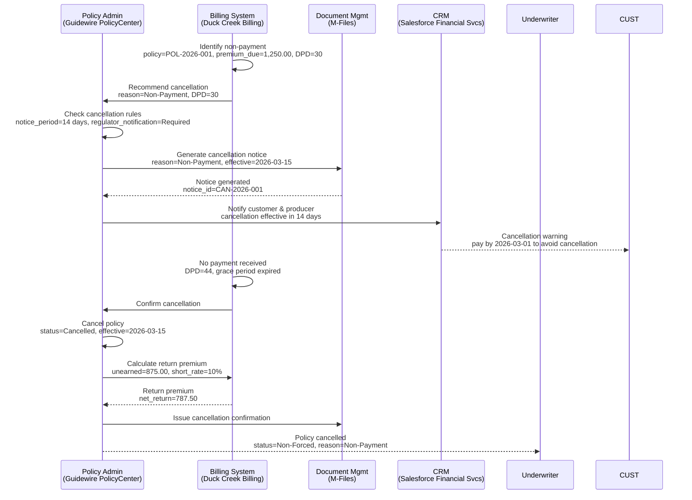
```mermaid
sequenceDiagram
    participant PAS as Policy Admin<br/>(Guidewire PolicyCenter)
    participant BILL as Billing System<br/>(Duck Creek Billing)
    participant DOC as Document Mgmt<br/>(M-Files)
    participant CRM as CRM<br/>(Salesforce Financial Svcs)
    participant UW as Underwriter
    BILL->>BILL: Identify non-payment<br/>policy=POL-2026-001, premium_due=1,250.00, DPD=30
    BILL->>PAS: Recommend cancellation<br/>reason=Non-Payment, DPD=30
    PAS->>PAS: Check cancellation rules<br/>notice_period=14 days, regulator_notification=Required
    PAS->>DOC: Generate cancellation notice<br/>reason=Non-Payment, effective=2026-03-15
    DOC-->>PAS: Notice generated<br/>notice_id=CAN-2026-001
    PAS->>CRM: Notify customer & producer<br/>cancellation effective in 14 days
    CRM-->>CUST: Cancellation warning<br/>pay by 2026-03-01 to avoid cancellation
    BILL->>BILL: No payment received<br/>DPD=44, grace period expired
    BILL->>PAS: Confirm cancellation
    PAS->>PAS: Cancel policy<br/>status=Cancelled, effective=2026-03-15
    PAS->>BILL: Calculate return premium<br/>unearned=875.00, short_rate=10%
    BILL-->>PAS: Return premium<br/>net_return=787.50
    PAS->>DOC: Issue cancellation confirmation
    PAS-->>UW: Policy cancelled<br/>status=Non-Forced, reason=Non-Payment
```

#### Integration Details

| Flow | Entity | Info Flow | Source | Target | Source Conn | Target Conn | Pattern | Complexity |
|------|--------|-----------|--------|--------|-------------|-------------|---------|------------|
| Cancellation | Trigger | IdentifyNonPayment | Billing System (Duck Creek Billing) | Billing System (Duck Creek Billing) | Internal | Internal | Batch (Scheduled) | Simple |
| Cancellation | Notice | GenerateCancellationNotice | Policy Admin (Guidewire PolicyCenter) | Document Mgmt (M-Files) | Guidewire REST API (API Key) | M-Files REST API (API Key) | Event-driven | Medium |
| Cancellation | Notify | NotifyCancellationWarning | Policy Admin (Guidewire PolicyCenter) | CRM (Salesforce Financial Services) | Guidewire REST API (API Key) | Salesforce REST API (OAuth2) | Event-driven | Simple |
| Cancellation | Cancel | ExecuteCancellation | Policy Admin (Guidewire PolicyCenter) | Policy Admin (Guidewire PolicyCenter) | Internal | Internal | API-led (Real-time) | Medium |
| Cancellation | Return | CalculateReturnPremium | Policy Admin (Guidewire PolicyCenter) | Billing System (Duck Creek Billing) | Guidewire REST API (API Key) | Duck Creek REST API (OAuth2) | API-led (Real-time) | Medium |

#### Acceptance Criteria

| Flow | Entity | Acceptance Criterion | Expected Outcome |
|------|--------|---------------------|------------------|
| Cancellation | Trigger | Non-payment identified at DPD=30 triggering cancellation workflow | Grace period applied; escalation at DPD=15, 30, 44; cancellation if no payment by DPD=44 |
| Cancellation | Notice | Cancellation notice generated with correct notice period | Notice includes reason, effective date, and reinstatement options; regulator copy generated |
| Cancellation | Notify | Customer and producer notified within 24 hours | Statutory notice period met; delivery confirmed; proof of service retained |
| Cancellation | Cancel | Policy cancelled with effective date and status recorded | Coverage ceases at effective date; no claims payable after cancellation; system prevents new claims |
| Cancellation | Return | Return premium calculated per regulatory short-rate method | Unearned premium computed; short-rate penalty applied; refund processed within 30 days |

---

### 4.5 Policy Inquiry & Evidence of Insurance

**Description:** Third parties (finance companies, solicitors) request certificate of currency or policy status. System verifies authority and issues evidence document.

**Actors:** Customer, Third Party (Financier), Operations  
**Systems:** Customer Portal, Policy Admin (Guidewire PolicyCenter), Document Mgmt (M-Files), CRM (Salesforce Financial Services)

#### Sequence Diagram

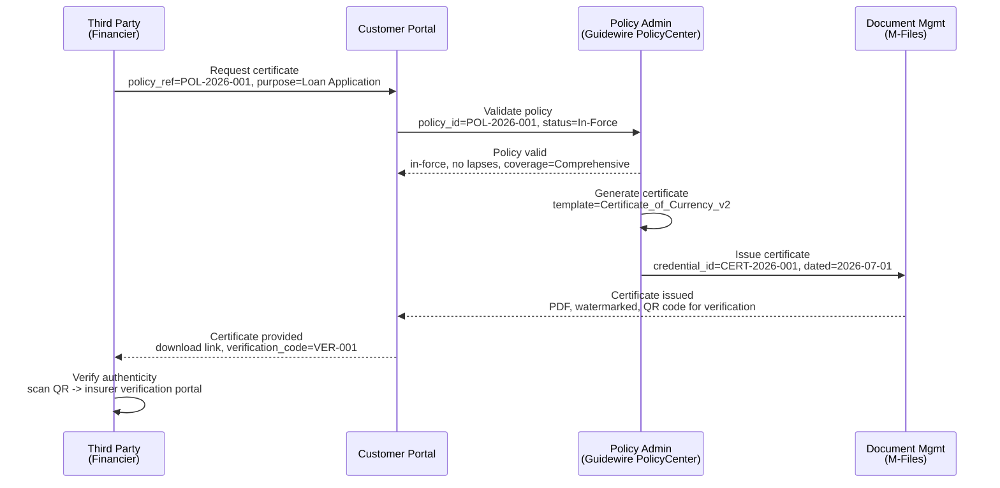
```mermaid
sequenceDiagram
    participant TP as Third Party<br/>(Financier)
    participant PORTAL as Customer Portal
    participant PAS as Policy Admin<br/>(Guidewire PolicyCenter)
    participant DOC as Document Mgmt<br/>(M-Files)
    TP->>PORTAL: Request certificate<br/>policy_ref=POL-2026-001, purpose=Loan Application
    PORTAL->>PAS: Validate policy<br/>policy_id=POL-2026-001, status=In-Force
    PAS-->>PORTAL: Policy valid<br/>in-force, no lapses, coverage=Comprehensive
    PAS->>PAS: Generate certificate<br/>template=Certificate_of_Currency_v2
    PAS->>DOC: Issue certificate<br/>credential_id=CERT-2026-001, dated=2026-07-01
    DOC-->>PORTAL: Certificate issued<br/>PDF, watermarked, QR code for verification
    PORTAL-->>TP: Certificate provided<br/>download link, verification_code=VER-001
    TP->>TP: Verify authenticity<br/>scan QR -> insurer verification portal
```

#### Integration Details

| Flow | Entity | Info Flow | Source | Target | Source Conn | Target Conn | Pattern | Complexity |
|------|--------|-----------|--------|--------|-------------|-------------|---------|------------|
| Policy Inquiry | Validate | ValidatePolicyStatus | Customer Portal | Policy Admin (Guidewire PolicyCenter) | Portal REST API (JWT) | Guidewire REST API (API Key) | API-led (Real-time) | Simple |
| Policy Inquiry | Certificate | GenerateCertificate | Policy Admin (Guidewire PolicyCenter) | Policy Admin (Guidewire PolicyCenter) | Internal | Internal | API-led (Real-time) | Simple |
| Policy Inquiry | Issue | IssueCertificate | Policy Admin (Guidewire PolicyCenter) | Document Mgmt (M-Files) | Guidewire REST API (API Key) | M-Files REST API (API Key) | Event-driven | Simple |
| Policy Inquiry | Deliver | DeliverCertificate | Customer Portal | Third Party | Portal REST API (JWT) | Email / Download | Event-driven | Simple |
| Policy Inquiry | Verify | VerifyCertificateAuthenticity | Verification Portal | Verification Portal | Internal | Internal | API-led (Real-time) | Simple |

#### Acceptance Criteria

| Flow | Entity | Acceptance Criterion | Expected Outcome |
|------|--------|---------------------|------------------|
| Policy Inquiry | Validate | Policy status validated in real-time | Status response within 2 seconds; in-force, cancelled, or lapsed status accurately reported |
| Policy Inquiry | Certificate | Certificate generated from correct template | Template version verified; all fields populated; coverage details match policy record |
| Policy Inquiry | Issue | Certificate issued with tamper-evident features | Watermark applied; QR code generated; digital signature verified; expiry date on certificate |
| Policy Inquiry | Deliver | Certificate delivered to requestor within 2 minutes | Download link sent; unique verification code provided; certificate accessible for 30 days |
| Policy Inquiry | Verify | Certificate authenticity verifiable via QR code | QR scan leads to verification page; status reflects current policy state; expired certs flagged |

---

# 5: Claims Management  — `IN016` `IN017` `IN018` `IN019`

### 5.1 First Notice of Loss

**Description:** Customer or producer reports claim through multi-channel intake. System captures loss details, checks policy coverage, validates claim, and opens claim file.

**Actors:** Customer, Producer, Claims Intake Officer  
**Systems:** Claims System (Guidewire ClaimCenter), Customer Portal, Call Centre (Genesys), Policy Admin (Guidewire PolicyCenter), Document Mgmt (M-Files)

#### Sequence Diagram

```mermaid
sequenceDiagram
    participant CUST as Customer
    participant PORTAL as Customer Portal
    participant CC as Claims System<br/>(Guidewire ClaimCenter)
    participant PAS as Policy Admin<br/>(Guidewire PolicyCenter)
    participant DOC as Document Mgmt<br/>(M-Files)
    CUST->>PORTAL: Report claim<br/>policy=POL-2026-001, date=2026-06-20, type=Motor Accident
    PORTAL->>PAS: Validate policy<br/>policy_id=POL-2026-001, loss_date=2026-06-20
    PAS-->>PORTAL: Policy valid<br/>in-force, coverage=Comprehensive, excess=500
    PORTAL->>CC: Create claim<br/>policy=POL-2026-001, loss_details, customer=CUST-2026-001
    CC->>CC: Claim registration<br/>claim_id=CLM-2026-001, status=Open
    CC->>DOC: Attach evidence<br/>photos, police report, witness statements
    DOC-->>CC: Documents attached<br/>4 files, 12.5MB
    CC->>CC: Initial reserve estimate<br/>estimated=15,000.00, reserve=12,000.00
    CC-->>CUST: Claim acknowledged<br/>claim_id=CLM-2026-001, adjuster=TBD
    CC->>CC: Assign adjuster<br/>skill=Motor, workload=balanced, adjuster_id=EMP-2026-001
```

#### Integration Details

| Flow | Entity | Info Flow | Source | Target | Source Conn | Target Conn | Pattern | Complexity |
|------|--------|-----------|--------|--------|-------------|-------------|---------|------------|
| FNOL | Intake | ReportClaim | Customer Portal | Claims System (Guidewire ClaimCenter) | Portal REST API (JWT) | Guidewire REST API (API Key) | API-led (Real-time) | Simple |
| FNOL | Validation | ValidatePolicyCoverage | Customer Portal | Policy Admin (Guidewire PolicyCenter) | Portal REST API (JWT) | Guidewire REST API (API Key) | API-led (Real-time) | Medium |
| FNOL | Registration | RegisterClaim | Customer Portal | Claims System (Guidewire ClaimCenter) | Portal REST API (JWT) | Guidewire REST API (API Key) | API-led (Real-time) | Medium |
| FNOL | Evidence | AttachClaimEvidence | Claims System (Guidewire ClaimCenter) | Document Mgmt (M-Files) | Guidewire REST API (API Key) | M-Files REST API (API Key) | Event-driven | Simple |
| FNOL | Assignment | AssignAdjuster | Claims System (Guidewire ClaimCenter) | Claims System (Guidewire ClaimCenter) | Internal | Internal | API-led (Real-time) | Medium |

#### Acceptance Criteria

| Flow | Entity | Acceptance Criterion | Expected Outcome |
|------|--------|---------------------|------------------|
| FNOL | Intake | Claim reported correctly via multi-channel (portal, phone, producer) | Claim recorded with all mandatory fields; duplicate claim check performed; coverage verified |
| FNOL | Validation | Policy coverage validated at time of FNOL | Coverage confirmed for loss type; excess/deductible identified; exclusions checked |
| FNOL | Registration | Claim registered with unique claim ID | Claim ID format CLM-YYYY-NNN; status = Open; reserve estimated; timestamp recorded |
| FNOL | Evidence | Photos, documents, and reports attached to claim file | File types validated; virus scan passed; auto-labelling applied; version controlled |
| FNOL | Assignment | Claim assigned to appropriate adjuster | Assignment based on skill set, workload, territory; assignment notification sent to adjuster within 5 minutes |

---

### 5.2 Claims Investigation & Evaluation

**Description:** Claims adjuster investigates the loss, gathers evidence, interviews witnesses, assesses liability, and updates claim reserve based on findings.

**Actors:** Claims Adjuster, Investigator, Assessor  
**Systems:** Claims System (Guidewire ClaimCenter), Investigation Services (Vendor Portal), Document Mgmt (M-Files), External Data Provider (Verisk)

#### Sequence Diagram

```mermaid
sequenceDiagram
    participant ADJ as Claims Adjuster
    participant CC as Claims System<br/>(Guidewire ClaimCenter)
    participant INV as Investigation Portal<br/>(Vendor Portal)
    participant DOC as Document Mgmt<br/>(M-Files)
    participant VER as Data Provider<br/>(Verisk)
    ADJ->>CC: Review claim<br/>claim_id=CLM-2026-001, loss_date=2026-06-20
    CC->>DOC: Retrieve all evidence<br/>photos, police report, statements
    DOC-->>CC: Evidence retrieved<br/>12 items, 25MB
    ADJ->>INV: Assign investigation<br/>type=Accident Investigation, vendor=VEN-2026-001
    INV-->>CC: Investigation report<br/>liability=Third Party 70%, statement recorded
    ADJ->>VER: Check vehicle history<br/>VIN=JTEBR71JX0000001, market_value
    VER-->>CC: Vehicle assessment<br/>pre-accident=42,000, salvage=8,000
    ADJ->>CC: Update reserve<br/>initial=12,000, revised=15,000, reason=Increased severity
    CC-->>ADJ: Reserve updated<br/>total_reserve=15,500 (case=12,000 + IBNR=3,500)
```

#### Integration Details

| Flow | Entity | Info Flow | Source | Target | Source Conn | Target Conn | Pattern | Complexity |
|------|--------|-----------|--------|--------|-------------|-------------|---------|------------|
| Investigation | Evidence | RetrieveClaimEvidence | Claims System (Guidewire ClaimCenter) | Document Mgmt (M-Files) | Guidewire REST API (API Key) | M-Files REST API (API Key) | API-led (Real-time) | Simple |
| Investigation | Vendor | AssignInvestigation | Claims System (Guidewire ClaimCenter) | Investigation Portal (Vendor Portal) | Guidewire REST API (API Key) | Vendor API (REST) | Event-driven | Medium |
| Investigation | Vehicle | CheckVehicleHistory | Claims System (Guidewire ClaimCenter) | Data Provider (Verisk) | Guidewire REST API (API Key) | Verisk API (SOAP) | API-led (Real-time) | Medium |
| Investigation | Reserve | UpdateClaimReserve | Claims System (Guidewire ClaimCenter) | Claims System (Guidewire ClaimCenter) | Internal | Internal | API-led (Real-time) | Simple |
| Investigation | Report | ReceiveInvestigationReport | Investigation Portal (Vendor Portal) | Claims System (Guidewire ClaimCenter) | Vendor API (REST) | Guidewire REST API (API Key) | Event-driven | Medium |

#### Acceptance Criteria

| Flow | Entity | Acceptance Criterion | Expected Outcome |
|------|--------|---------------------|------------------|
| Investigation | Evidence | All evidence retrievable with 5-second SLA | Evidence indexed by claim ID; metadata visible; document preview available |
| Investigation | Vendor | Investigation assigned to approved vendor | Vendor assigned within SLA; investigation scope defined; cost estimate approved |
| Investigation | Vehicle | Vehicle history and valuation retrieved from Verisk | Pre-accident value, salvage value, and repair estimate obtained; fraud indicators checked |
| Investigation | Reserve | Reserve updated based on investigation findings | Reserve change reason recorded; reserve history maintained; authority matrix respected |
| Investigation | Report | Investigation report received and attached to claim | Report indexed; key findings extracted; liability assessment recorded; next steps recommended |

---

### 5.3 Claims Adjudication

**Description:** Adjuster makes liability and coverage decision. System applies policy terms, checks authority limits, and either approves or denies the claim.

**Actors:** Claims Adjuster, Claims Manager, Technical Specialist  
**Systems:** Claims System (Guidewire ClaimCenter), Policy Admin (Guidewire PolicyCenter), Decision Engine (FICO Blaze), Document Mgmt (M-Files)

#### Sequence Diagram

```mermaid
sequenceDiagram
    participant ADJ as Claims Adjuster
    participant CC as Claims System<br/>(Guidewire ClaimCenter)
    participant PAS as Policy Admin<br/>(Guidewire PolicyCenter)
    participant DE as Decision Engine<br/>(FICO Blaze)
    participant DOC as Document Mgmt<br/>(M-Files)
    ADJ->>CC: Request adjudication<br/>claim_id=CLM-2026-001, investigation_complete=Yes
    CC->>PAS: Fetch policy terms<br/>policy_id=POL-2026-001, coverage=Comprehensive
    PAS-->>CC: Policy terms<br/>limit=50K, excess=500, exclusions=Wear_And_Tear
    CC->>DE: Evaluate liability<br/>assessment=Third Party 70%, own damage 30%
    DE-->>CC: Adjudication result<br/>liability=Accepted, coverage=Applies, limit=sufficient
    CC->>CC: Check adjuster authority<br/>authority_limit=25K, estimated=15K
    CC-->>ADJ: Within authority<br/>no referral needed
    ADJ->>CC: Approve claim<br/>amount=15,000.00, indemnity=10,500.00
    CC->>DOC: Generate adjudication memo<br/>claim_id=CLM-2026-001, decision=Approved
    DOC-->>CC: Memo generated<br/>adjudication_memo_v1.pdf
```

#### Integration Details

| Flow | Entity | Info Flow | Source | Target | Source Conn | Target Conn | Pattern | Complexity |
|------|--------|-----------|--------|--------|-------------|-------------|---------|------------|
| Adjudication | Policy | FetchPolicyTerms | Claims System (Guidewire ClaimCenter) | Policy Admin (Guidewire PolicyCenter) | Guidewire REST API (API Key) | Guidewire REST API (API Key) | API-led (Real-time) | Simple |
| Adjudication | Evaluation | EvaluateLiability | Claims System (Guidewire ClaimCenter) | Decision Engine (FICO Blaze) | Guidewire REST API (API Key) | FICO Blaze API (REST) | API-led (Real-time) | Medium |
| Adjudication | Authority | CheckAdjusterAuthority | Claims System (Guidewire ClaimCenter) | Claims System (Guidewire ClaimCenter) | Internal | Internal | API-led (Real-time) | Simple |
| Adjudication | Decision | RecordAdjudicationDecision | Claims System (Guidewire ClaimCenter) | Claims System (Guidewire ClaimCenter) | Internal | Internal | API-led (Real-time) | Medium |
| Adjudication | Memo | GenerateAdjudicationMemo | Claims System (Guidewire ClaimCenter) | Document Mgmt (M-Files) | Guidewire REST API (API Key) | M-Files REST API (API Key) | Event-driven | Simple |

#### Acceptance Criteria

| Flow | Entity | Acceptance Criterion | Expected Outcome |
|------|--------|---------------------|------------------|
| Adjudication | Policy | Policy terms and coverage verified against claim | Coverage confirmed for loss type; exclusions checked; limits and excess applied correctly |
| Adjudication | Evaluation | Liability evaluated with supporting evidence | Liability decision documented; evidence referenced; third-party involvement assessed |
| Adjudication | Authority | Adjuster authority checked against estimated amount | Within authority: approve; exceeds authority: refer to manager with recommendation |
| Adjudication | Decision | Adjudication decision recorded with full reasoning | Approved amount within policy limit; or declined with specific exclusion referenced |
| Adjudication | Memo | Adjudication memo generated and attached to claim | Memo includes decision, rationale, amount breakdown, and next steps; audit trail maintained |

---

### 5.4 Payment & Settlement

**Description:** Approved claim payment is processed. System calculates payment breakdown, obtains approvals, initiates payment, and updates claim status on settlement.

**Actors:** Claims Adjuster, Finance Officer, Customer  
**Systems:** Claims System (Guidewire ClaimCenter), Payment Gateway (Stripe), Finance GL (SAP), Notification Service (Firebase)

#### Sequence Diagram

```mermaid
sequenceDiagram
    participant CC as Claims System<br/>(Guidewire ClaimCenter)
    participant PAY as Payment Gateway<br/>(Stripe)
    participant GL as Finance GL<br/>(SAP)
    participant NOT as Notification<br/>(Firebase)
    participant CUST as Customer
    CC->>CC: Prepare payment<br/>claim_id=CLM-2026-001, amount=15,000.00
    CC->>CC: Apply recoveries<br/>excess=500, salvage=8,000, net_payment=6,500.00
    CC->>CC: Check tax treatment<br/>GST component=1,500.00, net_taxable=5,000.00
    CC->>GL: Reserve journal<br/>transfer from claims reserve to claims paid
    GL-->>CC: Journal posted<br/>journal_id=GL-JRN-2026-088
    CC->>PAY: Initiate payment<br/>payee=John Anderson, amount=6,500.00, method=EFT
    PAY-->>CC: Payment confirmed<br/>txn_ref=PAY-2026-001, settled=2026-07-01
    CC->>CC: Settle claim<br/>status=Settled, total_paid=6,500.00
    CC->>NOT: Settlement notification
    NOT-->>CUST: Claim settled<br/>amount=6,500.00, reference=PAY-2026-001
```

#### Integration Details

| Flow | Entity | Info Flow | Source | Target | Source Conn | Target Conn | Pattern | Complexity |
|------|--------|-----------|--------|--------|-------------|-------------|---------|------------|
| Payment | Reserve | PostReserveJournal | Claims System (Guidewire ClaimCenter) | Finance GL (SAP) | Guidewire REST API (API Key) | SAP API (SOAP) | API-led (Real-time) | High |
| Payment | Disburse | InitiatePayment | Claims System (Guidewire ClaimCenter) | Payment Gateway (Stripe) | Guidewire REST API (API Key) | Stripe API (REST) | API-led (Real-time) | Medium |
| Payment | Reconciliation | ReconcilePayment | Payment Gateway (Stripe) | Claims System (Guidewire ClaimCenter) | Stripe API (REST) | Guidewire REST API (API Key) | Event-driven | Simple |
| Payment | GL | PostPaymentToGL | Payment Gateway (Stripe) | Finance GL (SAP) | Stripe API (REST) | SAP API (SOAP) | Batch (Scheduled) | High |
| Payment | Notification | SendSettlementNotification | Claims System (Guidewire ClaimCenter) | Notification Service (Firebase) | Guidewire REST API (API Key) | Firebase FCM API | Event-driven | Simple |

#### Acceptance Criteria

| Flow | Entity | Acceptance Criterion | Expected Outcome |
|------|--------|---------------------|------------------|
| Payment | Reserve | Reserve journal posted from claims reserve to claims paid | GL entries balanced; reserve reduced; paid-to-date updated; audit trail complete |
| Payment | Disburse | Payment initiated to correct payee | Payee bank details verified; BSB/account validated; payment amount matches approved settlement |
| Payment | Reconciliation | Payment confirmed and reconciled | Payment status returned from bank; reconciliation with bank statement within 24 hours |
| Payment | GL | Payment posted to general ledger | GL entries include GST, net amount, and any recoveries; multi-currency handled |
| Payment | Notification | Customer notified of settlement | Notification includes payment amount, reference, and expected settlement date |

---

### 5.5 Subrogation & Recovery

**Description:** Claims team pursues recovery from third-party at-fault party. System manages subrogation case, tracks recovery status, and applies recoveries to claim.

**Actors:** Claims Adjuster, Recovery Officer, Third-Party Insurer  
**Systems:** Claims System (Guidewire ClaimCenter), Subrogation Portal, Legal System (SealSign), Document Mgmt (M-Files)

#### Sequence Diagram

```mermaid
sequenceDiagram
    participant ADJ as Claims Adjuster
    participant CC as Claims System<br/>(Guidewire ClaimCenter)
    participant SUB as Subrogation Portal
    participant LEGAL as Legal System<br/>(SealSign)
    participant DOC as Document Mgmt<br/>(M-Files)
    ADJ->>CC: Identify subrogation potential<br/>claim_id=CLM-2026-001, TP=Third Party Insurer
    CC->>SUB: Open subrogation case<br/>claim_id=CLM-2026-001, TP_details, amount=10,500.00
    SUB->>SUB: Register case<br/>subrogation_id=SUB-2026-001, status=Open
    SUB->>LEGAL: Send demand letter<br/>TP_insurer, amount=10,500.00, evidence attached
    LEGAL-->>SUB: Demand sent<br/>letter_id=DEM-2026-001, sent=2026-07-05
    SUB->>SUB: Negotiation phase<br/>offer=7,500.00, counter=9,000.00, settled=8,500.00
    SUB-->>CC: Recovery confirmed<br/>amount=8,500.00, settled=2026-08-01
    CC->>PAY: Record recovery receipt
    CC->>CC: Apply recovery<br/>reduce net claim cost, update reserves
    CC->>DOC: Attach settlement agreement<br/>subrogation_release.pdf
    CC-->>ADJ: Recovery complete<br/>recovered=8,500.00 of 10,500.00 (81%)
```

#### Integration Details

| Flow | Entity | Info Flow | Source | Target | Source Conn | Target Conn | Pattern | Complexity |
|------|--------|-----------|--------|--------|-------------|-------------|---------|------------|
| Subrogation | Identify | IdentifySubrogationPotential | Claims System (Guidewire ClaimCenter) | Claims System (Guidewire ClaimCenter) | Internal | Internal | API-led (Real-time) | Simple |
| Subrogation | Case | OpenSubrogationCase | Claims System (Guidewire ClaimCenter) | Subrogation Portal | Guidewire REST API (API Key) | Subrogation API (REST) | API-led (Real-time) | Medium |
| Subrogation | Demand | SendDemandLetter | Subrogation Portal | Legal System (SealSign) | Subrogation API (REST) | SealSign API (REST) | Event-driven | Medium |
| Subrogation | Settlement | RecordRecoverySettlement | Subrogation Portal | Claims System (Guidewire ClaimCenter) | Subrogation API (REST) | Guidewire REST API (API Key) | Event-driven | Medium |
| Subrogation | Document | AttachSettlementAgreement | Claims System (Guidewire ClaimCenter) | Document Mgmt (M-Files) | Guidewire REST API (API Key) | M-Files REST API (API Key) | Event-driven | Simple |

#### Acceptance Criteria

| Flow | Entity | Acceptance Criterion | Expected Outcome |
|------|--------|---------------------|------------------|
| Subrogation | Identify | Subrogation potential identified at FNOL or during investigation | TP details captured; liability clear; subrogation threshold met; SOL check passed |
| Subrogation | Case | Subrogation case opened with full claim details | Case registered with unique ID; all evidence packaged; TP insurer notified |
| Subrogation | Demand | Demand letter sent with supporting evidence | Letter includes breakdown; evidence package attached; response deadline specified |
| Subrogation | Settlement | Recovery settlement recorded and applied to claim | Settlement amount >= minimum threshold; recovery applied to reduce net claim cost |
| Subrogation | Document | Settlement agreement and release attached to claim | Signed agreement stored; claim file updated; subrogation case closed |

---

### 5.6 Litigation Management

**Description:** When claim cannot be settled, litigation is initiated. System assigns counsel, tracks legal costs, manages court dates, and records judgments.

**Actors:** Claims Manager, Legal Counsel, External Solicitor, Judge  
**Systems:** Claims System (Guidewire ClaimCenter), Legal Case Mgmt (SealSign), External Counsel Portal, Document Mgmt (M-Files)

#### Sequence Diagram

```mermaid
sequenceDiagram
    participant CM as Claims Manager
    participant CC as Claims System<br/>(Guidewire ClaimCenter)
    participant LEGAL as Legal Case Mgmt<br/>(SealSign)
    participant COUNSEL as External Counsel Portal
    participant DOC as Document Mgmt<br/>(M-Files)
    CM->>CC: Refer to litigation<br/>claim_id=CLM-2026-001, reason=TP denying liability
    CC->>LEGAL: Create legal case<br/>claim_id, amount_in_dispute=15,000.00
    LEGAL->>COUNSEL: Assign external counsel<br/>specialisation=Insurance Litigation, panel firm
    COUNSEL-->>LEGAL: Counsel assigned<br/>partner=Jane Smith, rate=450/hr
    COUNSEL->>COUNSEL: File court documents<br/>statement of claim, evidence brief
    COUNSEL-->>LEGAL: Legal costs summary<br/>costs_to_date=12,500.00, estimated_future=18,000.00
    LEGAL->>CC: Update claim reserve<br/>legal_reserve=30,500.00, total_reserve=46,000.00
    CC->>CC: Reserve updated<br/>litigation status=Active
    LEGAL->>DOC: File court documents<br/>pleadings, orders, correspondence
    COUNSEL-->>CC: Judgment received<br/>outcome=50% liability each, damages=12,000.00
    CC->>CC: Record judgment<br/>claim settled per court order
```

#### Integration Details

| Flow | Entity | Info Flow | Source | Target | Source Conn | Target Conn | Pattern | Complexity |
|------|--------|-----------|--------|--------|-------------|-------------|---------|------------|
| Litigation | Refer | ReferToLitigation | Claims System (Guidewire ClaimCenter) | Legal Case Mgmt (SealSign) | Guidewire REST API (API Key) | SealSign API (REST) | API-led (Real-time) | Medium |
| Litigation | Counsel | AssignExternalCounsel | Legal Case Mgmt (SealSign) | External Counsel Portal | SealSign API (REST) | Counsel API (REST) | Event-driven | Medium |
| Litigation | Costs | TrackLegalCosts | External Counsel Portal | Legal Case Mgmt (SealSign) | Counsel API (REST) | SealSign API (REST) | Batch (Scheduled) | Medium |
| Litigation | Reserve | UpdateLitigationReserve | Legal Case Mgmt (SealSign) | Claims System (Guidewire ClaimCenter) | SealSign API (REST) | Guidewire REST API (API Key) | API-led (Real-time) | High |
| Litigation | Outcome | RecordJudgment | External Counsel Portal | Claims System (Guidewire ClaimCenter) | Counsel API (REST) | Guidewire REST API (API Key) | Event-driven | High |

#### Acceptance Criteria

| Flow | Entity | Acceptance Criterion | Expected Outcome |
|------|--------|---------------------|------------------|
| Litigation | Refer | Litigation referral approved by claims manager | Referral memo prepared; authority limit checked; legal panel assignment rules followed |
| Litigation | Counsel | External counsel assigned from approved panel | Conflicts checked; counsel expertise matches claim type; rates within panel agreement |
| Litigation | Costs | Legal costs tracked and reported monthly | Costs allocated to claim; budget vs actual tracked; cost forecast updated quarterly |
| Litigation | Reserve | Litigation reserve updated to reflect legal costs and potential judgment | Reserve covers defence costs, potential damages, and plaintiff costs; reviewed quarterly |
| Litigation | Outcome | Judgment recorded and claim settled per court order | Judgment amount, costs order, and interest recorded; claim status updated; appeal options noted |

---

# 6: Reinsurance  — `IN020` `IN021` `IN022`

### 6.1 Treaty Setup & Administration

**Description:** Reinsurance team sets up treaty agreements with reinsurers. System records treaty terms, cession percentages, limits, and excess layers.

**Actors:** Reinsurance Manager, Actuary, Reinsurer  
**Systems:** Reinsurance System (Sapiens Re), Policy Admin (Guidewire PolicyCenter), Data Warehouse (Snowflake), Reinsurer Portal (Munich Re)

#### Sequence Diagram

```mermaid
sequenceDiagram
    participant RM as Reinsurance Manager
    participant RE as Reinsurance System<br/>(Sapiens Re)
    participant PAS as Policy Admin<br/>(Guidewire PolicyCenter)
    participant DW as Data Warehouse<br/>(Snowflake)
    participant RINS as Reinsurer Portal<br/>(Munich Re)
    RM->>RE: Create treaty record<br/>type=Excess of Loss, layer=1M xs 500K
    RE->>RE: Define treaty terms<br/>ceded=70%, premium_share=70%, broker=0%
    RE->>PAS: Link product lines<br/>ceded LoB=Motor, Home, Travel
    PAS-->>RE: Product lines linked<br/>3 products, 2,450 policies in-scope
    RE->>DW: Calculate exposure<br/>sum_insured=500M, max_per_risk=1M
    DW-->>RE: Exposure summary<br/>TIV=500M, max_SI=1M, zone=NSW
    RE->>RINS: Submit treaty terms<br/>for review and acceptance
    RINS-->>RE: Treaty accepted<br/>treaty_id=TRT-2026-001, bound=2026-01-01
    RE-->>RM: Treaty active<br/>treaty_id=TRT-2026-001, status=In-Force
```

#### Integration Details

| Flow | Entity | Info Flow | Source | Target | Source Conn | Target Conn | Pattern | Complexity |
|------|--------|-----------|--------|--------|-------------|-------------|---------|------------|
| Treaty Setup | Terms | DefineTreatyTerms | Reinsurance System (Sapiens Re) | Reinsurance System (Sapiens Re) | Internal | Internal | API-led (Real-time) | Medium |
| Treaty Setup | Products | LinkProductsToTreaty | Reinsurance System (Sapiens Re) | Policy Admin (Guidewire PolicyCenter) | Sapiens API (REST) | Guidewire REST API (API Key) | API-led (Real-time) | Medium |
| Treaty Setup | Exposure | CalculateExposure | Reinsurance System (Sapiens Re) | Data Warehouse (Snowflake) | Sapiens API (REST) | Snowflake JDBC | Batch (Scheduled) | High |
| Treaty Setup | Market | SubmitTreatyToMarket | Reinsurance System (Sapiens Re) | Reinsurer Portal (Munich Re) | Sapiens API (REST) | Munich Re API (SOAP) | API-led (Real-time) | High |
| Treaty Setup | Activate | ActivateTreaty | Reinsurance System (Sapiens Re) | Reinsurance System (Sapiens Re) | Internal | Internal | API-led (Real-time) | Simple |

#### Acceptance Criteria

| Flow | Entity | Acceptance Criterion | Expected Outcome |
|------|--------|---------------------|------------------|
| Treaty Setup | Terms | Treaty terms defined with all reinsurer details | Treaty type, layer, ceded share, premium share, and all limits recorded |
| Treaty Setup | Products | Product lines linked to treaty correctly | All in-scope products identified; ceded percentage applied; out-of-scope policies excluded |
| Treaty Setup | Exposure | Exposure calculated from in-force portfolio | TIV, PML, and max per risk calculated; exposure report generated for treaty pricing |
| Treaty Setup | Market | Treaty submitted to reinsurer market | Reinsurer acknowledges receipt; terms negotiated; binding confirmation received |
| Treaty Setup | Activate | Treaty activated with effective date | Active from inception date; cession schedules activated; bordereaux generation scheduled |

---

### 6.2 Facultative Placement

**Description:** Individual large or complex risk is offered to reinsurers on a facultative basis. Underwriter prepares submission, negotiates terms, and binds coverage.

**Actors:** Underwriter, Reinsurance Manager, Facultative Reinsurer  
**Systems:** Reinsurance System (Sapiens Re), Underwriting Workbench (Origami Risk), Facultative Portal (Swiss Re), Document Mgmt (M-Files)

#### Sequence Diagram

```mermaid
sequenceDiagram
    participant UW as Underwriter
    participant RE as Reinsurance System<br/>(Sapiens Re)
    participant UWK as Underwriting Workbench<br/>(Origami Risk)
    participant FAC as Facultative Portal<br/>(Swiss Re)
    participant DOC as Document Mgmt<br/>(M-Files)
    UW->>UWK: Identify facultative risk<br/>policy=POL-2026-001, SI=2.5M > treaty limit 1M
    UWK->>RE: Request facultative<br/>risk_details, SI=2.5M, coverage=Property
    RE->>RE: Prepare submission<br/>risk_description, exposure, premiums
    RE->>FAC: Offer to market<br/>50% share, premium=75,000, commission=10%
    FAC-->>RE: Offer accepted<br/>reinsurer=Swiss Re, share=50%, premium=37,500
    RE->>FAC: Confirm placement<br/>50% placed, binding confirmation
    FAC-->>RE: Bound<br/>fac_id=FAC-2026-001, status=Covered
    RE->>DOC: Generate facultative certificate
    DOC-->>RE: Certificate issued<br/>fac_cert_001.pdf, signed by both parties
    RE-->>UW: Facultative placed<br/>50% with Swiss Re, excess risk covered
```

#### Integration Details

| Flow | Entity | Info Flow | Source | Target | Source Conn | Target Conn | Pattern | Complexity |
|------|--------|-----------|--------|--------|-------------|-------------|---------|------------|
| Facultative | Identify | IdentifyFacultativeRisk | Underwriting Workbench (Origami Risk) | Reinsurance System (Sapiens Re) | Origami API (REST) | Sapiens API (REST) | API-led (Real-time) | Simple |
| Facultative | Prepare | PrepareFacSubmission | Reinsurance System (Sapiens Re) | Reinsurance System (Sapiens Re) | Internal | Internal | API-led (Real-time) | Medium |
| Facultative | Market | OfferToReinsurer | Reinsurance System (Sapiens Re) | Facultative Portal (Swiss Re) | Sapiens API (REST) | Swiss Re API (SOAP) | API-led (Real-time) | High |
| Facultative | Bind | ConfirmPlacement | Facultative Portal (Swiss Re) | Reinsurance System (Sapiens Re) | Swiss Re API (SOAP) | Sapiens API (REST) | Event-driven | Medium |
| Facultative | Certificate | IssueFacultativeCertificate | Reinsurance System (Sapiens Re) | Document Mgmt (M-Files) | Sapiens API (REST) | M-Files REST API (API Key) | Event-driven | Simple |

#### Acceptance Criteria

| Flow | Entity | Acceptance Criterion | Expected Outcome |
|------|--------|---------------------|------------------|
| Facultative | Identify | Facultative need identified when risk exceeds treaty limit | Risk SI compared to treaty limit; facultative threshold check; automatic referral triggered |
| Facultative | Prepare | Facultative submission prepared with all risk details | Submission includes risk survey, exposure data, premium indication, and proposed terms |
| Facultative | Market | Risk offered to facultative market | Offers sent within 24 hours; multiple quotes obtained; best terms selected |
| Facultative | Bind | Placement confirmed and bound by reinsurer | Binding confirmation received; fac ID assigned; coverage effective from risk inception |
| Facultative | Certificate | Facultative certificate issued and signed | Certificate signed by both cedent and reinsurer; document stored in permanent record |

---

### 6.3 Premium Bordereaux Processing

**Description:** Ceding company prepares and submits premium bordereaux to reinsurers detailing written premiums, ceded amounts, and commissions for the treaty period.

**Actors:** Reinsurance Accountant, Operations, Reinsurer  
**Systems:** Reinsurance System (Sapiens Re), Policy Admin (Guidewire PolicyCenter), Data Warehouse (Snowflake), Reinsurer Portal (Munich Re)

#### Sequence Diagram

```mermaid
sequenceDiagram
    participant ACC as Reinsurance Accountant
    participant RE as Reinsurance System<br/>(Sapiens Re)
    participant PAS as Policy Admin<br/>(Guidewire PolicyCenter)
    participant DW as Data Warehouse<br/>(Snowflake)
    participant RINS as Reinsurer Portal<br/>(Munich Re)
    ACC->>RE: Generate bordereaux<br/>treaty=TRT-2026-001, period=2026-Q2
    RE->>PAS: Fetch written premium<br/>treaty_ceded product codes, date range
    PAS-->>RE: Premium data<br/>325 policies, gross=2.5M, returned=50K
    RE->>RE: Calculate cession<br/>net=2.45M, ceded_70%=1.715M, commission=257K
    RE->>DW: Validate bordereaux<br/>tie to GL, prior period reconciliation
    DW-->>RE: Validation passed<br/>GL matches, prior period reconciled
    RE->>RINS: Submit bordereaux<br/>period=2026-Q2, ceded=1.715M, due=2026-08-15
    RINS-->>RE: Bordereaux accepted<br/>ref=BOR-2026-001, processing
    RE-->>ACC: Bordereaux submitted<br/>BOR-2026-001, status=Accepted, due=2026-08-15
```

#### Integration Details

| Flow | Entity | Info Flow | Source | Target | Source Conn | Target Conn | Pattern | Complexity |
|------|--------|-----------|--------|--------|-------------|-------------|---------|------------|
| Premium Bordereaux | Premium | FetchWrittenPremium | Reinsurance System (Sapiens Re) | Policy Admin (Guidewire PolicyCenter) | Sapiens API (REST) | Guidewire REST API (API Key) | Batch (Scheduled) | Medium |
| Premium Bordereaux | Cession | CalculateCession | Reinsurance System (Sapiens Re) | Reinsurance System (Sapiens Re) | Internal | Internal | Batch (Scheduled) | Medium |
| Premium Bordereaux | Validation | ValidateBordereaux | Reinsurance System (Sapiens Re) | Data Warehouse (Snowflake) | Sapiens API (REST) | Snowflake JDBC | Batch (Scheduled) | High |
| Premium Bordereaux | Submit | SubmitBordereauxToReinsurer | Reinsurance System (Sapiens Re) | Reinsurer Portal (Munich Re) | Sapiens API (REST) | Munich Re API (SOAP) | Batch (Scheduled) | High |
| Premium Bordereaux | Status | ReceiveBordereauxStatus | Reinsurer Portal (Munich Re) | Reinsurance System (Sapiens Re) | Munich Re API (SOAP) | Sapiens API (REST) | Event-driven | Simple |

#### Acceptance Criteria

| Flow | Entity | Acceptance Criterion | Expected Outcome |
|------|--------|---------------------|------------------|
| Premium Bordereaux | Premium | Written premium data fetched for treaty period | All policies in-scope included; returned premiums deducted; multi-currency converted |
| Premium Bordereaux | Cession | Cession calculated correctly per treaty terms | Ceded percentage applied; commission deducted; reinsurer share matches treaty schedule |
| Premium Bordereaux | Validation | Bordereaux validated against GL and prior period | GL premium matches bordereaux total; prior period adjustments applied; break report generated |
| Premium Bordereaux | Submit | Bordereaux submitted to reinsurer within contractual timeframe | Submission by 15th day post-quarter; acknowledgment received; format per reinsurer requirements |
| Premium Bordereaux | Status | Bordereaux acceptance status received from reinsurer | Accepted or queried status; queries resolved within 5 business days |

---

### 6.4 Claims Bordereaux & Recovery

**Description:** Ceding company reports claims to reinsurers via claims bordereaux. Reinsurer's share of paid losses is recovered through the reinsurance program.

**Actors:** Claims Adjuster, Reinsurance Accountant, Reinsurer  
**Systems:** Reinsurance System (Sapiens Re), Claims System (Guidewire ClaimCenter), Reinsurer Portal (Munich Re), Finance GL (SAP)

#### Sequence Diagram

```mermaid
sequenceDiagram
    participant RE as Reinsurance System<br/>(Sapiens Re)
    participant CC as Claims System<br/>(Guidewire ClaimCenter)
    participant RINS as Reinsurer Portal<br/>(Munich Re)
    participant GL as Finance GL<br/>(SAP)
    RE->>RE: Quarterly claims bordereaux<br/>treaty=TRT-2026-001, period=2026-Q2
    RE->>CC: Fetch paid claims<br/>treaty ceded, paid in period
    CC-->>RE: Claims data<br/>12 claims paid, total=180,000, ceded=126,000
    RE->>RE: Calculate recovery<br/>ceded share=70%, excess layer=apply
    RE->>RINS: Submit claims bordereaux<br/>12 claims, reinsurer share=126,000.00
    RINS-->>RE: Claims bordereaux accepted<br/>claims registered for review
    RE->>RE: Invoice reinsurer<br/>recovery_amount=126,000, due=30 days
    RE->>GL: Post reinsurance recovery<br/>reduce claims expense by recovery amount
    GL-->>RE: Recovery posted<br/>journal_id=GL-JRN-2026-089
```

#### Integration Details

| Flow | Entity | Info Flow | Source | Target | Source Conn | Target Conn | Pattern | Complexity |
|------|--------|-----------|--------|--------|-------------|-------------|---------|------------|
| Claims Bordereaux | Claims | FetchPaidClaims | Reinsurance System (Sapiens Re) | Claims System (Guidewire ClaimCenter) | Sapiens API (REST) | Guidewire REST API (API Key) | Batch (Scheduled) | Medium |
| Claims Bordereaux | Calculation | CalculateRecovery | Reinsurance System (Sapiens Re) | Reinsurance System (Sapiens Re) | Internal | Internal | Batch (Scheduled) | Medium |
| Claims Bordereaux | Submit | SubmitClaimsBordereaux | Reinsurance System (Sapiens Re) | Reinsurer Portal (Munich Re) | Sapiens API (REST) | Munich Re API (SOAP) | Batch (Scheduled) | High |
| Claims Bordereaux | Invoice | InvoiceReinsurer | Reinsurance System (Sapiens Re) | Reinsurer Portal (Munich Re) | Sapiens API (REST) | Munich Re API (SOAP) | Event-driven | Medium |
| Claims Bordereaux | Post | PostReinsuranceRecovery | Reinsurance System (Sapiens Re) | Finance GL (SAP) | Sapiens API (REST) | SAP API (SOAP) | API-led (Real-time) | High |

#### Acceptance Criteria

| Flow | Entity | Acceptance Criterion | Expected Outcome |
|------|--------|---------------------|------------------|
| Claims Bordereaux | Claims | Paid claims data fetched for treaty period | All claims attached to treaty identified; paid amounts match GL; claims not yet advised excluded |
| Claims Bordereaux | Calculation | Reinsurer recovery calculated per treaty terms | Reinsurer share = ceded percentage of paid loss; excess layer applied correctly |
| Claims Bordereaux | Submit | Claims bordereaux submitted within contractual timeframe | Submission contains all required fields; individual claim details provided; acceptance confirmed |
| Claims Bordereaux | Invoice | Reinsurer invoiced for recovery amount | Invoice generated with reference to bordereaux; payment terms per treaty agreement |
| Claims Bordereaux | Post | Reinsurance recovery posted to reduce claims expense | GL entry reduces net claims cost; recovery tracked by claim; outstanding recovery aged |

---

### 6.5 Retrocession Management

**Description:** Reinsurance company (reinsurer) passes on portions of risk to retrocessionaires. System manages retrocession agreements, premium sharing, and claims recovery.

**Actors:** Reinsurance Manager, Retrocessionaire, Finance Officer  
**Systems:** Reinsurance System (Sapiens Re), Retrocession Portal (Swiss Re), Finance GL (SAP), Document Mgmt (M-Files)

#### Sequence Diagram

```mermaid
sequenceDiagram
    participant RM as Reinsurance Manager
    participant RE as Reinsurance System<br/>(Sapiens Re)
    participant RETRO as Retrocession Portal<br/>(Swiss Re)
    participant GL as Finance GL<br/>(SAP)
    RM->>RE: Setup retrocession agreement<br/>treaty=TRT-2026-001, type=XL, layer=500K xs 1.5M
    RE->>RE: Define retro share<br/>ceded=40%, retrocessionaire=Swiss Re
    RE->>RETRO: Submit retrocession<br/>terms, exposure, premium share
    RETRO-->>RE: Retrocession accepted<br/>retro_id=RET-2026-001, bound
    RE->>RE: Calculate retro premium<br/>treaty premium=1.2M, retro share=40%=480K
    RE->>GL: Post retro premium ceded<br/>reduce net reinsurance premium income
    GL-->>RE: Premium posted<br/>journal_id=GL-JRN-2026-090
    RE->>RE: Claims advised to retro<br/>12 claims, ceded share=40%=50,400
    RE->>RETRO: Claim recovery requested
    RETRO-->>RE: Recovery confirmed<br/>retro_recovery_paid=50,400.00
```

#### Integration Details

| Flow | Entity | Info Flow | Source | Target | Source Conn | Target Conn | Pattern | Complexity |
|------|--------|-----------|--------|--------|-------------|-------------|---------|------------|
| Retrocession | Setup | SetupRetrocessionAgreement | Reinsurance System (Sapiens Re) | Reinsurance System (Sapiens Re) | Internal | Internal | API-led (Real-time) | Medium |
| Retrocession | Placement | SubmitRetrocession | Reinsurance System (Sapiens Re) | Retrocession Portal (Swiss Re) | Sapiens API (REST) | Swiss Re API (SOAP) | API-led (Real-time) | High |
| Retrocession | Premium | PostRetroPremiumCeded | Reinsurance System (Sapiens Re) | Finance GL (SAP) | Sapiens API (REST) | SAP API (SOAP) | API-led (Real-time) | Medium |
| Retrocession | Claims | AdviseRetroClaims | Reinsurance System (Sapiens Re) | Retrocession Portal (Swiss Re) | Sapiens API (REST) | Swiss Re API (SOAP) | Batch (Scheduled) | Medium |
| Retrocession | Recovery | RequestRetroRecovery | Reinsurance System (Sapiens Re) | Retrocession Portal (Swiss Re) | Sapiens API (REST) | Swiss Re API (SOAP) | Event-driven | Medium |

#### Acceptance Criteria

| Flow | Entity | Acceptance Criterion | Expected Outcome |
|------|--------|---------------------|------------------|
| Retrocession | Setup | Retrocession agreement set up with full terms | Retro share, layer, and limits defined; retrocessionaire details recorded; agreement signed |
| Retrocession | Placement | Retrocession placed with retrocessionaire | Acceptance confirmed; retro ID assigned; effective date matches underlying treaty |
| Retrocession | Premium | Retro premium ceded posted to GL correctly | Premium ceded reduces net reinsurance income; GL entry balanced; accruals reversed |
| Retrocession | Claims | Claims advised to retrocessionaire on schedule | Claims bordereaux submitted; individual claims with ceded amounts; acceptance confirmed |
| Retrocession | Recovery | Retrocession recovery received and reconciled | Recovery amount matches ceded share; payment received within terms; claim file updated |

---

# 7: Actuarial & Pricing  — `IN023` `IN024` `IN025`

### 7.1 Pricing Model Development

**Description:** Actuary develops or updates pricing model using historical data, statistical analysis, and predictive modeling techniques.

**Actors:** Actuary, Data Scientist, Product Manager  
**Systems:** Actuarial System (SAS), Statistical Tool (R/Python), Data Warehouse (Snowflake), Model Governance Platform (H2O.ai)

#### Sequence Diagram

```mermaid
sequenceDiagram
    participant ACT as Actuary
    participant SAS as Actuarial System<br/>(SAS)
    participant DW as Data Warehouse<br/>(Snowflake)
    participant MODEL as Model Governance<br/>(H2O.ai)
    ACT->>SAS: Initiate model development<br/>product=Motor, line=Comprehensive
    SAS->>DW: Extract historical data<br/>5 years, 50K policies, 5K claims
    DW-->>SAS: Data extracted<br/>variables=85, claims=4,850, exposure=48K policy-years
    SAS->>SAS: Exploratory analysis<br/>univariate, correlation, missing values
    SAS->>SAS: Develop GLM model<br/>frequency=Poisson, severity=Gamma, offset=exposure
    SAS->>SAS: Validate model<br/>holdout=20%, Gini=42%, lift_chart=3.2x
    SAS->>MODEL: Register model<br/>version=v4.2, status=Validation
    MODEL-->>SAS: Model registered<br/>model_id=MOD-2026-001, pending approval
    ACT->>MODEL: Approve model<br/>performance meets threshold, bias_tested
    MODEL-->>ACT: Model approved<br/>version=v4.2, ready for deployment
```

#### Integration Details

| Flow | Entity | Info Flow | Source | Target | Source Conn | Target Conn | Pattern | Complexity |
|------|--------|-----------|--------|--------|-------------|-------------|---------|------------|
| Pricing Model | Data | ExtractHistoricalData | Actuarial System (SAS) | Data Warehouse (Snowflake) | SAS API (SOAP) | Snowflake JDBC | Batch (ETL) | High |
| Pricing Model | Analysis | RunExploratoryAnalysis | Actuarial System (SAS) | Actuarial System (SAS) | Internal | Internal | Batch (Scheduled) | Medium |
| Pricing Model | Development | DevelopGLMModel | Actuarial System (SAS) | Actuarial System (SAS) | Internal | Internal | Batch (Scheduled) | High |
| Pricing Model | Validation | ValidateModelPerformance | Actuarial System (SAS) | Actuarial System (SAS) | Internal | Internal | Batch (Scheduled) | Medium |
| Pricing Model | Governance | RegisterAndApproveModel | Actuarial System (SAS) | Model Governance Platform (H2O.ai) | SAS API (SOAP) | H2O API (REST) | API-led (Real-time) | Medium |

#### Acceptance Criteria

| Flow | Entity | Acceptance Criterion | Expected Outcome |
|------|--------|---------------------|------------------|
| Pricing Model | Data | Historical data extracted with sufficient volume and depth | 5+ years data; 50K+ records; all rating variables present; data quality score > 95% |
| Pricing Model | Analysis | Exploratory analysis completed identifying key rating factors | Variable importance ranked; correlations identified; missing value strategy defined |
| Pricing Model | Development | GLM model developed with acceptable statistical fit | Gini > 40%; lift chart > 2.5x; residual analysis acceptable; overdispersion handled |
| Pricing Model | Validation | Model validated on holdout data | Holdout performance within 5% of training; no significant bias by segment |
| Pricing Model | Governance | Model registered and approved through governance process | Model card complete; bias tested; approved by actuarial HoD; version controlled |

---

### 7.2 Rate Monitoring & Analysis

**Description:** Actuary monitors actual vs expected loss ratios, rate adequacy, and portfolio performance. System generates rate monitoring reports and recommends adjustments.

**Actors:** Actuary, Pricing Analyst, Product Manager  
**Systems:** Actuarial System (SAS), Data Warehouse (Snowflake), BI Platform (Tableau), Policy Admin (Guidewire PolicyCenter)

#### Sequence Diagram

```mermaid
sequenceDiagram
    participant ACT as Actuary
    participant SAS as Actuarial System<br/>(SAS)
    participant DW as Data Warehouse<br/>(Snowflake)
    participant BI as BI Platform<br/>(Tableau)
    ACT->>SAS: Run rate monitoring<br/>product=Motor, period=2026-H1
    SAS->>DW: Fetch premium & claims<br/>earned_premium, incurred_claims, exposure
    DW-->>SAS: Data loaded<br/>premium=2.8M, claims=1.54M, LR=55.0%
    SAS->>SAS: Calculate actual vs expected<br/>actual LR=55.0%, expected=52.5%, deviation=+2.5pp
    SAS->>SAS: Rate adequacy analysis<br/>indicated_rate_change=+5.2%, credible=Yes
    SAS->>BI: Update rate monitoring dashboard<br/>LR trends, rate adequacy by segment
    BI-->>SAS: Dashboard refreshed
    SAS-->>ACT: Rate monitoring report<br/>Overall LR=55.0%, Indicated change=+5.2%, Recommend=Increase
```

#### Integration Details

| Flow | Entity | Info Flow | Source | Target | Source Conn | Target Conn | Pattern | Complexity |
|------|--------|-----------|--------|--------|-------------|-------------|---------|------------|
| Rate Monitoring | Data | FetchPremiumAndClaims | Actuarial System (SAS) | Data Warehouse (Snowflake) | SAS API (SOAP) | Snowflake JDBC | Batch (Scheduled) | Medium |
| Rate Monitoring | Analysis | CalculateActualVsExpected | Actuarial System (SAS) | Actuarial System (SAS) | Internal | Internal | Batch (Scheduled) | Medium |
| Rate Monitoring | Adequacy | AnalyseRateAdequacy | Actuarial System (SAS) | Actuarial System (SAS) | Internal | Internal | Batch (Scheduled) | High |
| Rate Monitoring | Dashboard | UpdateDashboard | Actuarial System (SAS) | BI Platform (Tableau) | SAS API (SOAP) | Tableau REST API | Event-driven | Simple |
| Rate Monitoring | Report | GenerateRateReport | Actuarial System (SAS) | Actuarial System (SAS) | Internal | Internal | Batch (Scheduled) | Medium |

#### Acceptance Criteria

| Flow | Entity | Acceptance Criterion | Expected Outcome |
|------|--------|---------------------|------------------|
| Rate Monitoring | Data | Premium, claims, and exposure data loaded correctly | Earned premium calculated; incurred claims with IBNR; exposure in policy-years consistent |
| Rate Monitoring | Analysis | Actual vs expected loss ratio calculated | Actual LR by segment; expected LR from pricing model; deviation quantified with confidence interval |
| Rate Monitoring | Adequacy | Rate adequacy analysis completed with indicated rate change | Indicated rate change by segment; credibility-weighted; implementation timeframe recommended |
| Rate Monitoring | Dashboard | Rate monitoring dashboard updated | LR trends over 4+ quarters; rate adequacy heat map; premium distribution charts |
| Rate Monitoring | Report | Rate monitoring report generated with recommendations | Report includes executive summary, segment detail, and rate change recommendations |

---

### 7.3 Reserve Estimation & IBNR

**Description:** Actuary estimates outstanding claims reserves including case reserves, IBNR, and IBNER using actuarial methods consistent with accounting standards.

**Actors:** Actuary, Claims Manager, Finance Officer, Auditor  
**Systems:** Actuarial System (SAS), Claims System (Guidewire ClaimCenter), Finance GL (SAP), Data Warehouse (Snowflake)

#### Sequence Diagram

```mermaid
sequenceDiagram
    participant ACT as Actuary
    participant SAS as Actuarial System<br/>(SAS)
    participant CC as Claims System<br/>(Guidewire ClaimCenter)
    participant GL as Finance GL<br/>(SAP)
    participant DW as Data Warehouse<br/>(Snowflake)
    ACT->>SAS: Run reserve estimation<br/>line=Motor, as_at=2026-06-30
    SAS->>CC: Fetch case reserves<br/>open claims, paid to date, case estimates
    CC-->>SAS: Case reserve data<br/>open=185, case_reserves=2.1M, paid=3.8M
    SAS->>DW: Fetch historical development<br/>triangle data by accident period
    DW-->>SAS: Triangle data<br/>60 months, paid + incurred triangles
    SAS->>SAS: Run chain-ladder method<br/>BF method for immature periods
    SAS->>SAS: IBNR estimate<br/>chain_ladder=850K, BF=920K, selected=880K
    SAS->>GL: Reserve movement<br/>current=2.8M, prior=2.6M, movement=+200K
    GL-->>SAS: Reserve posted<br/>journal_id=GL-RES-2026-Q2
    SAS-->>ACT: Reserve estimation complete<br/>Total reserve=3.08M (case=2.2M + IBNR=0.88M)
```

#### Integration Details

| Flow | Entity | Info Flow | Source | Target | Source Conn | Target Conn | Pattern | Complexity |
|------|--------|-----------|--------|--------|-------------|-------------|---------|------------|
| Reserve | Case | FetchCaseReserves | Actuarial System (SAS) | Claims System (Guidewire ClaimCenter) | SAS API (SOAP) | Guidewire REST API (API Key) | Batch (Scheduled) | Medium |
| Reserve | Triangle | FetchDevelopmentTriangles | Actuarial System (SAS) | Data Warehouse (Snowflake) | SAS API (SOAP) | Snowflake JDBC | Batch (ETL) | High |
| Reserve | Method | RunChainLadderMethod | Actuarial System (SAS) | Actuarial System (SAS) | Internal | Internal | Batch (Scheduled) | High |
| Reserve | IBNR | CalculateIBNR | Actuarial System (SAS) | Actuarial System (SAS) | Internal | Internal | Batch (Scheduled) | High |
| Reserve | Post | PostReserveMovement | Actuarial System (SAS) | Finance GL (SAP) | SAS API (SOAP) | SAP API (SOAP) | API-led (Real-time) | High |

#### Acceptance Criteria

| Flow | Entity | Acceptance Criterion | Expected Outcome |
|------|--------|---------------------|------------------|
| Reserve | Case | Case reserve data extracted with full claim details | All open claims included; case reserves by claim; paid-to-date amounts; claim status consistent |
| Reserve | Triangle | Development triangles complete for 60+ months | Paid and incurred triangles; by accident period and development period; no missing cells |
| Reserve | Method | Chain-ladder method applied to mature periods | Age-to-age factors; selected development pattern; tail factor estimated; diagnostic tests passed |
| Reserve | IBNR | IBNR estimated using multiple methods with selected point estimate | Chain-ladder and Bornhuetter-Ferguson; best estimate basis; margin for adverse deviation |
| Reserve | Post | Reserve movement posted to GL with full audit trail | Opening to closing reconciliation; movement by accident period; actuary sign-off recorded |

---

### 7.4 Catastrophe Modeling

**Description:** Catastrophe modeling team runs exposure through cat models to estimate probable maximum loss and guide reinsurance purchasing.

**Actors:** Catastrophe Modeler, Reinsurance Manager, Risk Manager  
**Systems:** Catastrophe Modeling (Moody's RMS), Data Warehouse (Snowflake), BI Platform (Tableau), GIS Platform (ESRI)

#### Sequence Diagram

```mermaid
sequenceDiagram
    participant CAT as Catastrophe Modeler
    participant RMS as Catastrophe Modeling<br/>(Moody's RMS)
    participant DW as Data Warehouse<br/>(Snowflake)
    participant BI as BI Platform<br/>(Tableau)
    participant RM as Reinsurance Manager
    CAT->>RMS: Initiate cat model run<br/>peril=Australian Cyclone, portfolio=All Property
    RMS->>DW: Extract exposure data<br/>policy_location, sum_insured, construction, occupancy
    DW-->>RMS: Exposure data<br/>50,000 locations, TIV=500M, by postcode
    RMS->>RMS: Run stochastic model<br/>10,000 simulated years, 5 perils
    RMS->>RMS: Calculate PML<br/>OEP_100yr=75M, AEP_100yr=60M, AAL=12M
    RMS->>BI: Update cat dashboard<br/>exposure footprint, PML curves
    BI-->>CAT: Dashboard updated
    CAT-->>RM: Cat model results<br/>PML_100yr=75M, AAL=12M, recommend XL cover increase
```

#### Integration Details

| Flow | Entity | Info Flow | Source | Target | Source Conn | Target Conn | Pattern | Complexity |
|------|--------|-----------|--------|--------|-------------|-------------|---------|------------|
| Cat Model | Exposure | ExtractExposureData | Catastrophe Modeling (Moody's RMS) | Data Warehouse (Snowflake) | RMS API (SOAP) | Snowflake JDBC | Batch (ETL) | High |
| Cat Model | Run | RunStochasticModel | Catastrophe Modeling (Moody's RMS) | Catastrophe Modeling (Moody's RMS) | Internal | Internal | Batch (Scheduled) | High |
| Cat Model | PML | CalculatePML | Catastrophe Modeling (Moody's RMS) | Catastrophe Modeling (Moody's RMS) | Internal | Internal | Batch (Scheduled) | High |
| Cat Model | Dashboard | UpdateCatDashboard | Catastrophe Modeling (Moody's RMS) | BI Platform (Tableau) | RMS API (SOAP) | Tableau REST API | Event-driven | Simple |
| Cat Model | Report | GenerateCatReport | Catastrophe Modeling (Moody's RMS) | Catastrophe Modeling (Moody's RMS) | Internal | Internal | Batch (Scheduled) | Medium |

#### Acceptance Criteria

| Flow | Entity | Acceptance Criterion | Expected Outcome |
|------|--------|---------------------|------------------|
| Cat Model | Exposure | Exposure data extracted with accurate location data | Geocoding accuracy > 98%; TIV by CRESTA zone; construction and occupancy codes mapped |
| Cat Model | Run | Stochastic model run with latest vulnerability curves | 10,000+ simulated years; model version recorded; secondary perils included |
| Cat Model | PML | PML calculated at standard return periods | OEP and AEP curves; PML at 10, 20, 50, 100, 250, 500yr; AAL reported |
| Cat Model | Dashboard | Cat dashboard updated with latest run | Exposure heat map; PML curve; year-likely-loss distribution; layer loss exceedance |
| Cat Model | Report | Cat report generated for reinsurance decision-making | Report includes PML summary, model limitations, and recommended reinsurance structure |

---

### 7.5 Actuarial Assumption Setting

**Description:** Actuary sets key assumptions used in pricing, reserving, and financial projections. Assumptions reviewed, approved, and documented through governance process.

**Actors:** Chief Actuary, Pricing Actuary, Reserving Actuary, Auditor  
**Systems:** Actuarial System (SAS), Model Governance Platform (H2O.ai), Document Mgmt (M-Files), Data Warehouse (Snowflake)

#### Sequence Diagram

```mermaid
sequenceDiagram
    participant CA as Chief Actuary
    participant SAS as Actuarial System<br/>(SAS)
    participant GOV as Model Governance<br/>(H2O.ai)
    participant DOC as Document Mgmt<br/>(M-Files)
    CA->>SAS: Initiate assumption review<br/>product=Motor, frequency=Annual
    SAS->>DW: Pull experience data<br/>5 years, credibility weighted
    DW-->>SAS: Data ready
    SAS->>SAS: Analyze experience<br/>frequency trend, severity trend, LER pattern
    SAS->>SAS: Set best estimate assumptions<br/>LR=52.5%, LAE=8%, expense=28%, investment=3%
    SAS->>GOV: Register assumptions for approval<br/>version=v4.2, effective=2027-01-01
    GOV-->>CA: Assumptions pending approval
    CA->>GOV: Review & approve<br/>assumptions within range, sensitivity ok
    GOV->>DOC: Publish assumptions<br/>assumption_memo_v4.2.pdf
    DOC-->>SAS: Assumptions published<br/>all downstream systems notified
```

#### Integration Details

| Flow | Entity | Info Flow | Source | Target | Source Conn | Target Conn | Pattern | Complexity |
|------|--------|-----------|--------|--------|-------------|-------------|---------|------------|
| Assumptions | Data | PullExperienceData | Actuarial System (SAS) | Data Warehouse (Snowflake) | SAS API (SOAP) | Snowflake JDBC | Batch (ETL) | Medium |
| Assumptions | Analysis | AnalyseExperienceTrends | Actuarial System (SAS) | Actuarial System (SAS) | Internal | Internal | Batch (Scheduled) | High |
| Assumptions | Setting | SetBestEstimateAssumptions | Actuarial System (SAS) | Actuarial System (SAS) | Internal | Internal | Batch (Scheduled) | Medium |
| Assumptions | Governance | RegisterAssumptionsForApproval | Actuarial System (SAS) | Model Governance Platform (H2O.ai) | SAS API (SOAP) | H2O API (REST) | API-led (Real-time) | Medium |
| Assumptions | Publish | PublishApprovedAssumptions | Model Governance Platform (H2O.ai) | Document Mgmt (M-Files) | H2O API (REST) | M-Files REST API (API Key) | Event-driven | Simple |

#### Acceptance Criteria

| Flow | Entity | Acceptance Criterion | Expected Outcome |
|------|--------|---------------------|------------------|
| Assumptions | Data | Experience data pulled with sufficient credibility | 5+ years; credibility score > 80%; large claim capping applied; trend smoothed |
| Assumptions | Analysis | Experience trends analysed with appropriate statistical methods | Trends statistically significant; confidence intervals; expert judgment documented |
| Assumptions | Setting | Best estimate assumptions set with supporting analysis | Each assumption documented with rationale; range provided; sensitivity impact quantified |
| Assumptions | Governance | Assumptions approved through governance process | Chief Actuary sign-off; peer review completed; audit trail maintained |
| Assumptions | Publish | Approved assumptions published to all downstream systems | Rating engine updated; reserving system updated; financial projection system updated |

---

# 8: Billing & Collections  — `IN031`

### 8.1 Premium Billing Generation

**Description:** Billing system generates premium invoices for new policies, renewals, and mid-term adjustments. Invoices delivered via customer's preferred channel.

**Actors:** Billing Officer, Customer, Producer  
**Systems:** Billing System (Duck Creek Billing), Policy Admin (Guidewire PolicyCenter), Customer Portal, Document Mgmt (M-Files), Payment Gateway (Stripe)

#### Sequence Diagram

```mermaid
sequenceDiagram
    participant BILL as Billing System<br/>(Duck Creek Billing)
    participant PAS as Policy Admin<br/>(Guidewire PolicyCenter)
    participant PORTAL as Customer Portal
    participant DOC as Document Mgmt<br/>(M-Files)
    participant PAY as Payment Gateway (Stripe)
    PAS->>BILL: Binding notification<br/>policy_id=POL-2026-001, premium=1,250.00, effective=2026-01-15
    BILL->>BILL: Determine payment plan<br/>billing_frequency=Annual, method=Credit Card
    BILL->>BILL: Calculate amounts<br/>gross=1,250.00, fees=0, total_due=1,250.00
    BILL->>DOC: Generate invoice<br/>invoice_id=INV-2026-001, due=2026-02-01
    DOC-->>BILL: Invoice generated<br/>PDF, QR code for payment
    BILL-->>PORTAL: Invoice published<br/>amount=1,250.00, due=2026-02-01, status=Unpaid
    CUST->>PORTAL: View invoice<br/>download, payment options
    BILL->>BILL: Schedule payment reminder<br/>email at T-14, T-7, T-3, T-0
```

#### Integration Details

| Flow | Entity | Info Flow | Source | Target | Source Conn | Target Conn | Pattern | Complexity |
|------|--------|-----------|--------|--------|-------------|-------------|---------|------------|
| Billing | Trigger | ReceiveBindingNotification | Policy Admin (Guidewire PolicyCenter) | Billing System (Duck Creek Billing) | Guidewire REST API (API Key) | Duck Creek REST API (OAuth2) | Event-driven | Medium |
| Billing | Invoice | GenerateInvoice | Billing System (Duck Creek Billing) | Document Mgmt (M-Files) | Duck Creek REST API (OAuth2) | M-Files REST API (API Key) | Event-driven | Simple |
| Billing | Publish | PublishInvoiceToPortal | Billing System (Duck Creek Billing) | Customer Portal | Duck Creek REST API (OAuth2) | Portal REST API (JWT) | Event-driven | Simple |
| Billing | Reminder | SchedulePaymentReminders | Billing System (Duck Creek Billing) | Billing System (Duck Creek Billing) | Internal | Internal | Batch (Scheduled) | Simple |
| Billing | Plan | DeterminePaymentPlan | Billing System (Duck Creek Billing) | Billing System (Duck Creek Billing) | Internal | Internal | API-led (Real-time) | Simple |

#### Acceptance Criteria

| Flow | Entity | Acceptance Criterion | Expected Outcome |
|------|--------|---------------------|------------------|
| Billing | Trigger | Billing triggered within 5 minutes of policy binding | Invoice generation SLA met; billing frequency determined per policy terms |
| Billing | Invoice | Invoice generated with accurate premium and fees | Gross premium matches policy; fees calculated per schedule; GST applied correctly |
| Billing | Publish | Invoice published to customer portal immediately | Invoice visible in portal; download available; payment button functional |
| Billing | Reminder | Payment reminder schedule set according to billing frequency | First reminder at T-14; escalation at T-7, T-3, T-0; overdue at T+1 |
| Billing | Plan | Payment plan determined correctly from billing election | Annual, semi-annual, quarterly, or monthly; instalment amounts calculated; fees for instalments |

---

### 8.2 Payment Processing

**Description:** Customer submits premium payment. Payment gateway processes transaction, billing system updates invoice status, and GL records premium income.

**Actors:** Customer, Finance Officer  
**Systems:** Customer Portal, Payment Gateway (Stripe), Billing System (Duck Creek Billing), Finance GL (SAP), Notification Service (Firebase)

#### Sequence Diagram

```mermaid
sequenceDiagram
    participant CUST as Customer
    participant PORTAL as Customer Portal
    participant PAY as Payment Gateway<br/>(Stripe)
    participant BILL as Billing System<br/>(Duck Creek Billing)
    participant GL as Finance GL<br/>(SAP)
    CUST->>PORTAL: Make payment<br/>invoice=INV-2026-001, amount=1,250.00, card=****-4242
    PORTAL->>PAY: Charge payment<br/>amount=1,250.00, currency=AUD, customer_id=cus_001
    PAY->>PAY: Authorize & capture<br/>AVS check, CVV, 3DS
    PAY-->>PORTAL: Payment success<br/>txn_ref=PAY-2026-001, auth_code=AUTH-001
    PORTAL->>BILL: Payment confirmation
    BILL->>BILL: Update invoice status<br/>status=Paid, payment_ref=PAY-2026-001
    BILL->>GL: Post premium income<br/>amount=1,250.00, GL_code=4000, GST=113.64
    GL-->>BILL: GL posted<br/>journal_id=GL-JRN-2026-001
    BILL->>NOT: Send receipt notification
    NOT-->>CUST: Payment receipt<br/>invoice=INV-2026-001, amount=1,250.00, receipt=RCT-001
```

#### Integration Details

| Flow | Entity | Info Flow | Source | Target | Source Conn | Target Conn | Pattern | Complexity |
|------|--------|-----------|--------|--------|-------------|-------------|---------|------------|
| Payment | Gateway | ProcessPayment | Customer Portal | Payment Gateway (Stripe) | Portal REST API (JWT) | Stripe API (REST) | API-led (Real-time) | Medium |
| Payment | Confirmation | ConfirmPayment | Customer Portal | Billing System (Duck Creek Billing) | Portal REST API (JWT) | Duck Creek REST API (OAuth2) | Event-driven | Medium |
| Payment | Invoice | UpdateInvoiceStatus | Billing System (Duck Creek Billing) | Billing System (Duck Creek Billing) | Internal | Internal | API-led (Real-time) | Simple |
| Payment | GL | PostPremiumIncome | Billing System (Duck Creek Billing) | Finance GL (SAP) | Duck Creek REST API (OAuth2) | SAP API (SOAP) | API-led (Real-time) | High |
| Payment | Receipt | SendPaymentReceipt | Billing System (Duck Creek Billing) | Notification Service (Firebase) | Duck Creek REST API (OAuth2) | Firebase FCM API | Event-driven | Simple |

#### Acceptance Criteria

| Flow | Entity | Acceptance Criterion | Expected Outcome |
|------|--------|---------------------|------------------|
| Payment | Gateway | Payment processed through gateway with 3DS authentication | Payment authorized; fraud checks passed; auth code returned within 5 seconds |
| Payment | Confirmation | Payment confirmation sent to billing system in real-time | Billing system updated within 2 seconds; payment reference linked to invoice |
| Payment | Invoice | Invoice status updated to Paid with timestamp | Invoice marked paid; paid date recorded; overdue status cleared |
| Payment | GL | Premium income posted to GL with correct accounting | Gross premium, GST, and net premium correctly split; GL code per product line |
| Payment | Receipt | Payment receipt sent to customer within 60 seconds | Receipt includes transaction reference, amount, date, and payment method |

---

### 8.3 Collections & Arrears Management

**Description:** Collections team manages overdue premium accounts. System applies collection strategies, sends reminders, and escalates to cancellation process.

**Actors:** Collections Officer, Customer, Producer  
**Systems:** Billing System (Duck Creek Billing), Collections Workflow, CRM (Salesforce Financial Services), Notification Service (Firebase)

#### Sequence Diagram

```mermaid
sequenceDiagram
    participant BILL as Billing System<br/>(Duck Creek Billing)
    participant COLL as Collections Workflow
    participant CRM as CRM<br/>(Salesforce Financial Svcs)
    participant NOT as Notification<br/>(Firebase)
    participant CUST as Customer
    BILL->>BILL: Identify overdue accounts<br/>DPD=15, amount=1,250.00, ageing=Late
    BILL->>COLL: Create collection case<br/>invoice=INV-2026-001, DPD=15, amount=1,250.00
    COLL->>COLL: Score account<br/>collection_score=620, segment=Standard
    COLL->>COLL: Assign strategy<br/>strategy=Early_Collection, channel=Email+SMS
    COLL->>NOT: Send reminder<br/>DPD=15, template=Payment_Reminder_15
    NOT-->>CUST: Payment reminder<br/>invoice=INV-2026-001, due=2026-02-01, DPD=15
    BILL->>BILL: No payment at DPD=30
    BILL->>NOT: Escalated reminder<br/>DPD=30, template=Payment_Reminder_30, urgency=High
    NOT-->>CUST: Urgent payment reminder<br/>final notice, pay within 14 days
    COLL->>CRM: Update customer risk<br/>increased risk score, flag for monitoring
    CUST->>BILL: Make payment
    BILL->>COLL: Payment received<br/>close collection case
    COLL->>COLL: Case closed<br/>outcome=Paid_Full, status=Resolved
```

#### Integration Details

| Flow | Entity | Info Flow | Source | Target | Source Conn | Target Conn | Pattern | Complexity |
|------|--------|-----------|--------|--------|-------------|-------------|---------|------------|
| Collections | Identify | IdentifyOverdueAccounts | Billing System (Duck Creek Billing) | Collections Workflow | Duck Creek REST API (OAuth2) | Collections API (REST) | Batch (Scheduled) | Medium |
| Collections | Scoring | ScoreCollectionAccount | Collections Workflow | Collections Workflow | Internal | Internal | API-led (Real-time) | Medium |
| Collections | Strategy | AssignCollectionStrategy | Collections Workflow | Collections Workflow | Internal | Internal | API-led (Real-time) | Simple |
| Collections | Notification | SendPaymentReminder | Collections Workflow | Notification Service (Firebase) | Collections API (REST) | Firebase FCM API | Event-driven | Simple |
| Collections | Resolution | ResolveCollectionCase | Billing System (Duck Creek Billing) | Collections Workflow | Duck Creek REST API (OAuth2) | Collections API (REST) | Event-driven | Medium |

#### Acceptance Criteria

| Flow | Entity | Acceptance Criterion | Expected Outcome |
|------|--------|---------------------|------------------|
| Collections | Identify | Overdue accounts identified daily with correct ageing | DPD calculated from due date; ageing buckets: Early(1-14), Late(15-30), Default(31-60), Severe(61+) |
| Collections | Scoring | Collection score assigned based on payment history and risk | Score calibrated; segment assignment: Low/Standard/High Risk; treatment path determined |
| Collections | Strategy | Collection strategy assigned based on segment | Early: email+SMS; Late: phone+email; Default: letter+phone; Severe: legal referral |
| Collections | Notification | Payment reminders sent per schedule | Reminder at DPD=15, 30, 45, 60; escalating tone; delivery confirmed |
| Collections | Resolution | Collection case resolved on payment | Full or partial payment recorded; case outcome documented; recovery rate tracked |

---

### 8.4 Commission Disbursement

**Description:** Finance team processes commission payments to producers based on approved commission statements. Payments batched and disbursed via EFT.

**Actors:** Finance Officer, Producer (Agent/Broker)  
**Systems:** Commission System (Duck Creek Billing), Finance GL (SAP), Payment Gateway (Stripe), Producer Portal

#### Sequence Diagram

```mermaid
sequenceDiagram
    participant COMM as Commission System<br/>(Duck Creek Billing)
    participant GL as Finance GL<br/>(SAP)
    participant PAY as Payment Gateway<br/>(Stripe)
    participant PORTAL as Producer Portal
    COMM->>COMM: Commission run<br/>month=July 2026, approved statements only
    COMM->>GL: Post commission expense<br/>total=125,000.00, GL_code=5100
    GL-->>COMM: GL posted<br/>journal_id=GL-JRN-2026-091
    COMM->>COMM: Batch payments<br/>45 producers, 125K total
    COMM->>PAY: Disburse payments<br/>producer_batch, amount=125,000.00, method=EFT
    PAY-->>COMM: Batch submitted<br/>batch_id=BAT-COM-2026-07
    PAY->>PAY: Process EFT payments<br/>to producer bank accounts on file
    PAY-->>COMM: Batch completed<br/>44 success, 1 failed (invalid BSB)
    COMM->>COMM: Flag failed payment<br/>producer_id=PROD-2026-015, reason=Invalid BSB
    COMM-->>PORTAL: Commission paid<br/>statement_id=COM-2026-001, status=Paid
    PORTAL-->>PROD: Payment received<br/>commission=22,500.00, deposited to account
```

#### Integration Details

| Flow | Entity | Info Flow | Source | Target | Source Conn | Target Conn | Pattern | Complexity |
|------|--------|-----------|--------|--------|-------------|-------------|---------|------------|
| Commission Disbursement | GL | PostCommissionExpense | Commission System (Duck Creek Billing) | Finance GL (SAP) | Duck Creek REST API (OAuth2) | SAP API (SOAP) | API-led (Real-time) | High |
| Commission Disbursement | Batch | BatchPayments | Commission System (Duck Creek Billing) | Commission System (Duck Creek Billing) | Internal | Internal | Batch (Scheduled) | Medium |
| Commission Disbursement | Payment | DisbursePayments | Commission System (Duck Creek Billing) | Payment Gateway (Stripe) | Duck Creek REST API (OAuth2) | Stripe API (REST) | Batch (Scheduled) | Medium |
| Commission Disbursement | Status | ProcessBatchStatus | Payment Gateway (Stripe) | Commission System (Duck Creek Billing) | Stripe API (REST) | Duck Creek REST API (OAuth2) | Event-driven | Simple |
| Commission Disbursement | Notification | NotifyPaymentStatus | Commission System (Duck Creek Billing) | Producer Portal | Duck Creek REST API (OAuth2) | Portal REST API (JWT) | Event-driven | Simple |

#### Acceptance Criteria

| Flow | Entity | Acceptance Criterion | Expected Outcome |
|------|--------|---------------------|------------------|
| Commission Disbursement | GL | Commission expense posted to GL before disbursement | GL entry balanced; accrued commission reversed; expense recognised in correct period |
| Commission Disbursement | Batch | Commissions batched by payment method | All approved statements included; minimum payment threshold checked; net off against advances |
| Commission Disbursement | Payment | EFT payments submitted to payment gateway | Batch accepted; BSB/account validation; expected settlement date confirmed |
| Commission Disbursement | Status | Payment status updated per producer | Successful payments marked Paid; failed payments flagged with reason; retry scheduled |
| Commission Disbursement | Notification | Producer notified of payment status | Successful: payment advice available; Failed: alert with corrective action instructions |

---

### 8.5 Refund & Return Premium Processing

**Description:** When policy is cancelled or mid-term adjustment reduces premium, system calculates return premium and processes refund to customer's original payment method.

**Actors:** Customer, Finance Officer, Operations  
**Systems:** Billing System (Duck Creek Billing), Payment Gateway (Stripe), Finance GL (SAP), Customer Portal

#### Sequence Diagram

```mermaid
sequenceDiagram
    participant BILL as Billing System<br/>(Duck Creek Billing)
    participant PAS as Policy Admin<br/>(Guidewire PolicyCenter)
    participant PAY as Payment Gateway<br/>(Stripe)
    participant GL as Finance GL<br/>(SAP)
    participant PORTAL as Customer Portal
    PAS->>BILL: Cancellation notice<br/>policy=POL-2026-001, effective=2026-03-15, reason=Non-Payment
    BILL->>BILL: Calculate return premium<br/>unearned=875.00, short_rate=10%, net_return=787.50
    BILL->>GL: Reverse premium income<br/>GL reversal journal for 787.50
    GL-->>BILL: Reversal posted
    BILL->>PAY: Process refund<br/>customer=John Anderson, amount=787.50, method=Original Payment
    PAY->>PAY: Reverse original transaction<br/>charge_id=ch_001, amount=787.50
            PAY-->>BILL: Refund processed<br/>refund_id=RFND-2026-001, status=Completed
    BILL-->>PORTAL: Refund confirmed<br/>amount=787.50, refunded to card ****-4242
    CUST->>PORTAL: View refund status<br/>refund_id=RFND-2026-001, completed=2026-03-20
```

#### Integration Details

| Flow | Entity | Info Flow | Source | Target | Source Conn | Target Conn | Pattern | Complexity |
|------|--------|-----------|--------|--------|-------------|-------------|---------|------------|
| Refund | Calculate | CalculateReturnPremium | Billing System (Duck Creek Billing) | Billing System (Duck Creek Billing) | Internal | Internal | API-led (Real-time) | Medium |
| Refund | GL | ReversePremiumIncome | Billing System (Duck Creek Billing) | Finance GL (SAP) | Duck Creek REST API (OAuth2) | SAP API (SOAP) | API-led (Real-time) | High |
| Refund | Payment | ProcessRefund | Billing System (Duck Creek Billing) | Payment Gateway (Stripe) | Duck Creek REST API (OAuth2) | Stripe API (REST) | API-led (Real-time) | Medium |
| Refund | Status | ConfirmRefundStatus | Payment Gateway (Stripe) | Billing System (Duck Creek Billing) | Stripe API (REST) | Duck Creek REST API (OAuth2) | Event-driven | Simple |
| Refund | Portal | PublishRefundToPortal | Billing System (Duck Creek Billing) | Customer Portal | Duck Creek REST API (OAuth2) | Portal REST API (JWT) | Event-driven | Simple |

#### Acceptance Criteria

| Flow | Entity | Acceptance Criterion | Expected Outcome |
|------|--------|---------------------|------------------|
| Refund | Calculate | Return premium calculated per cancellation terms | Unearned premium computed pro-rata; short-rate penalty per policy terms; net amount correct |
| Refund | GL | Premium income reversed from original GL entry | GL reversal entries match original posting; GST adjustment included; audit trail maintained |
| Refund | Payment | Refund processed to original payment method | Full or partial refund; transaction fee implications calculated; refund reference generated |
| Refund | Status | Refund status confirmed from payment gateway | Refund completed or pending; reason for failure captured; automatic retry for failed refunds |
| Refund | Portal | Refund confirmation visible on customer portal | Refund amount, date, and status displayed; expected settlement timeline shown |

---

# 9: Customer Management  — `IN026` `IN027`

### 9.1 Customer Onboarding & KYC

**Description:** Customer registers for insurance services. System performs identity verification, AML screening, and creates customer record across all touchpoints.

**Actors:** Customer, Compliance Officer, Customer Service Agent  
**Systems:** Customer Portal, CRM (Salesforce Financial Services), Identity Verification (Onfido), Screening (WorldCheck), Policy Admin (Guidewire PolicyCenter)

#### Sequence Diagram

```mermaid
sequenceDiagram
    participant CUST as Customer
    participant PORTAL as Customer Portal
    participant CRM as CRM<br/>(Salesforce Financial Svcs)
    participant VER as Identity Verification<br/>(Onfido)
    participant SCR as Screening<br/>(WorldCheck)
    participant PAS as Policy Admin<br/>(Guidewire PolicyCenter)
    CUST->>PORTAL: Register account<br/>name=John Anderson, email=john.anderson@email.com
    PORTAL->>CRM: Create prospect<br/>source=Direct, product_interest=Motor
    CRM-->>PORTAL: Prospect created<br/>prospect_id=PRO-2026-001
    PORTAL->>VER: Verify identity<br/>passport, liveness check, address proof
    VER-->>PORTAL: Identity verified<br/>confidence=99.2%, match=Pass
    PORTAL->>SCR: Screen customer<br/>name, DOB, address, PEP check
    SCR-->>PORTAL: No adverse matches<br/>score=12/100, low_risk
    PORTAL->>PAS: Create customer record<br/>customer_id=CUST-2026-001, status=Active
    PAS-->>PORTAL: Customer created<br/>customer_id=CUST-2026-001
    CRM->>CRM: Welcome campaign triggered<br/>email, onboarding guide, product suggestions
```

#### Integration Details

| Flow | Entity | Info Flow | Source | Target | Source Conn | Target Conn | Pattern | Complexity |
|------|--------|-----------|--------|--------|-------------|-------------|---------|------------|
| Customer Onboarding | Registration | RegisterCustomer | Customer Portal | CRM (Salesforce Financial Services) | Portal REST API (JWT) | Salesforce REST API (OAuth2) | API-led (Real-time) | Simple |
| Customer Onboarding | Identity | VerifyIdentity | Customer Portal | Identity Verification (Onfido) | Portal REST API (JWT) | Onfido API (API Key) | API-led (Real-time) | Medium |
| Customer Onboarding | Screening | ScreenCustomer | Customer Portal | Screening (WorldCheck) | Portal REST API (JWT) | WorldCheck API (SOAP) | API-led (Real-time) | Medium |
| Customer Onboarding | Create | CreateCustomerRecord | Customer Portal | Policy Admin (Guidewire PolicyCenter) | Portal REST API (JWT) | Guidewire REST API (API Key) | API-led (Real-time) | Medium |
| Customer Onboarding | Campaign | TriggerWelcomeCampaign | CRM (Salesforce Financial Services) | CRM (Salesforce Financial Services) | Internal | Internal | Event-driven | Simple |

#### Acceptance Criteria

| Flow | Entity | Acceptance Criterion | Expected Outcome |
|------|--------|---------------------|------------------|
| Customer Onboarding | Registration | Customer registered with valid email and phone | Account created; email verified; 2FA setup; welcome message sent |
| Customer Onboarding | Identity | Identity verified with document and liveness check | Document verification >= 95%; liveness check passed; failed verifications reported |
| Customer Onboarding | Screening | Customer screened against PEP and sanctions lists | No matches or matches investigated; low/medium/high risk rating assigned |
| Customer Onboarding | Create | Customer record created in policy admin system | Customer ID assigned; KYC status documented; risk rating recorded |
| Customer Onboarding | Campaign | Welcome campaign triggered with relevant content | Email sent within 1 hour; onboarding guide accessible; product recommendations personalised |

---

### 9.2 Customer Relationship Management

**Description:** CRM system manages all customer interactions, policy portfolio view, cross-sell and up-sell opportunities, and customer health scoring.

**Actors:** Customer, Relationship Manager, Customer Service Agent  
**Systems:** CRM (Salesforce Financial Services), Policy Admin (Guidewire PolicyCenter), BI Platform (Tableau), Marketing Platform (Marketo)

#### Sequence Diagram

```mermaid
sequenceDiagram
    participant CRM as CRM<br/>(Salesforce Financial Svcs)
    participant PAS as Policy Admin<br/>(Guidewire PolicyCenter)
    participant BI as BI Platform<br/>(Tableau)
    participant MKT as Marketing Platform<br/>(Marketo)
    participant CUST as Customer
    CRM->>PAS: Fetch customer portfolio<br/>customer_id=CUST-2026-001
    PAS-->>CRM: Portfolio data<br/>3 policies, total_premium=3,450.00, claims=1
    CRM->>CRM: Calculate customer value<br/>CLV=4,200, tenure=6 months, claims_ratio=0.33
    CRM->>CRM: Score cross-sell potential<br/>home_insurance=85%, life_insurance=45%
    CRM->>BI: Update customer dashboard<br/>customer 360 view
    BI-->>CRM: Dashboard refreshed
    CRM->>MKT: Trigger cross-sell campaign<br/>product=Home Insurance, segment=Current_Motor_Only
    MKT-->>CUST: Cross-sell offer<br/>bundle home+motor, save 15%
    CRM->>CRM: Log customer interaction<br/>type=Call, topic=Cross-sell enquiry
```

#### Integration Details

| Flow | Entity | Info Flow | Source | Target | Source Conn | Target Conn | Pattern | Complexity |
|------|--------|-----------|--------|--------|-------------|-------------|---------|------------|
| CRM | Portfolio | FetchCustomerPortfolio | CRM (Salesforce Financial Services) | Policy Admin (Guidewire PolicyCenter) | Salesforce REST API (OAuth2) | Guidewire REST API (API Key) | API-led (Real-time) | Medium |
| CRM | Value | CalculateCustomerValue | CRM (Salesforce Financial Services) | CRM (Salesforce Financial Services) | Internal | Internal | Batch (Scheduled) | Medium |
| CRM | Insight | ScoreCrossSellPotential | CRM (Salesforce Financial Services) | CRM (Salesforce Financial Services) | Internal | Internal | API-led (Real-time) | Simple |
| CRM | Dashboard | UpdateDashboard | CRM (Salesforce Financial Services) | BI Platform (Tableau) | Salesforce REST API (OAuth2) | Tableau REST API | Event-driven | Simple |
| CRM | Campaign | TriggerCrossSellCampaign | CRM (Salesforce Financial Services) | Marketing Platform (Marketo) | Salesforce REST API (OAuth2) | Marketo API (REST) | Event-driven | Medium |

#### Acceptance Criteria

| Flow | Entity | Acceptance Criterion | Expected Outcome |
|------|--------|---------------------|------------------|
| CRM | Portfolio | Customer portfolio retrieved with all policies | Portfolio view within 3 seconds; policies, premiums, claims, and payment history visible |
| CRM | Value | Customer lifetime value calculated accurately | CLV model considers premium, retention probability, cross-sell potential, and service cost |
| CRM | Insight | Cross-sell and up-sell scores calculated for relevant products | Product affinity scoring; propensity model; next-best-product recommendation |
| CRM | Dashboard | Customer 360 dashboard updated in real-time | All interactions, policies, and claims visible; timeline view; sentiment analysis |
| CRM | Campaign | Targeted cross-sell campaign triggered | Campaign personalised; offer consistent with customer profile; opt-out respected |

---

### 9.3 Loyalty & Retention Programs

**Description:** Customer loyalty program tracks engagement, awards loyalty points or discounts, and manages retention offers for customers showing attrition risk.

**Actors:** Customer, Marketing Manager, Product Manager  
**Systems:** CRM (Salesforce Financial Services), Loyalty Engine, Marketing Platform (Marketo), Notification Service (Firebase)

#### Sequence Diagram

```mermaid
sequenceDiagram
    participant CRM as CRM<br/>(Salesforce Financial Svcs)
    participant LOY as Loyalty Engine
    participant MKT as Marketing Platform<br/>(Marketo)
    participant NOT as Notification<br/>(Firebase)
    participant CUST as Customer
    CRM->>LOY: Check loyalty eligibility<br/>customer_id=CUST-2026-001, tenure=6 months
    LOY-->>CRM: Loyalty tier=Silver<br/>points=450, next_tier=Gold at 1,000 points
    CRM->>LOY: Award loyalty points<br/>policy_renewal, points=100, bonus=50
    CUST->>CRM: View rewards<br/>points balance, available rewards
    CRM->>LOY: Fetch rewards catalogue
    LOY-->>CRM: Catalogue<br/>premium_discount=10%, gift_cards, vouchers
    CUST->>CRM: Redeem points<br/>1,000 points for premium discount
    CRM->>LOY: Apply redemption<br/>discount on next renewal
    CRM->>MKT: Check retention risk<br/>attrition_score=25/100, low_risk
    CRM->>NOT: Share milestone<br/>6-month anniversary, loyalty tier info
```

#### Integration Details

| Flow | Entity | Info Flow | Source | Target | Source Conn | Target Conn | Pattern | Complexity |
|------|--------|-----------|--------|--------|-------------|-------------|---------|------------|
| Loyalty | Eligibility | CheckLoyaltyEligibility | CRM (Salesforce Financial Services) | Loyalty Engine | Salesforce REST API (OAuth2) | Loyalty API (REST) | API-led (Real-time) | Simple |
| Loyalty | Points | AwardLoyaltyPoints | CRM (Salesforce Financial Services) | Loyalty Engine | Salesforce REST API (OAuth2) | Loyalty API (REST) | Event-driven | Medium |
| Loyalty | Catalogue | FetchRewardsCatalogue | CRM (Salesforce Financial Services) | Loyalty Engine | Salesforce REST API (OAuth2) | Loyalty API (REST) | API-led (Real-time) | Simple |
| Loyalty | Redemption | RedeemRewardPoints | CRM (Salesforce Financial Services) | Loyalty Engine | Salesforce REST API (OAuth2) | Loyalty API (REST) | API-led (Real-time) | Medium |
| Loyalty | Retention | CheckRetentionRisk | CRM (Salesforce Financial Services) | Marketing Platform (Marketo) | Salesforce REST API (OAuth2) | Marketo API (REST) | Batch (Scheduled) | Medium |

#### Acceptance Criteria

| Flow | Entity | Acceptance Criterion | Expected Outcome |
|------|--------|---------------------|------------------|
| Loyalty | Eligibility | Customer loyalty eligibility checked at key events | Eligibility at onboarding, renewal, claim settlement; tier based on premium and tenure |
| Loyalty | Points | Loyalty points awarded for qualifying events | Policy purchase, renewal, referral, claim-free period; bonus points for double milestones |
| Loyalty | Catalogue | Rewards catalogue displayed with available options | Catalogue personalised by tier; points required clearly shown; stock availability |
| Loyalty | Redemption | Points redeemed for selected reward | Sufficient points validated; discount applied to renewal; gift card issued; confirmation sent |
| Loyalty | Retention | Attrition risk scored and retention offer triggered | Attrition score < 30: standard; 30-60: retention offer; > 60: priority save campaign |

---

### 9.4 Customer Portal & Self-Service

**Description:** Customer accesses self-service portal to view policies, download documents, make changes, report claims, and communicate with the insurer.

**Actors:** Customer, Customer Service Agent (escalation)  
**Systems:** Customer Portal, Policy Admin (Guidewire PolicyCenter), Claims System (Guidewire ClaimCenter), Document Mgmt (M-Files), AI Chatbot (Ada)

#### Sequence Diagram

```mermaid
sequenceDiagram
    participant CUST as Customer
    participant PORTAL as Customer Portal
    participant CHAT as AI Chatbot<br/>(Ada)
    participant PAS as Policy Admin<br/>(Guidewire PolicyCenter)
    participant CC as Claims System<br/>(Guidewire ClaimCenter)
    participant DOC as Document Mgmt<br/>(M-Files)
    CUST->>PORTAL: Log in<br/>customer_id=CUST-2026-001, 2FA
    PORTAL-->>CUST: Dashboard<br/>3 policies, 1 active claim, 1 invoice due
    CUST->>CHAT: Ask question<br/>How do I add roadside assist to my policy?
    CHAT->>CHAT: NLP processing<br/>intent=Endorsement, product=Motor
            CHAT-->>CUST: Response<br/>Roadside Assist costs +$75/yr. Would you like to proceed?
    CUST->>PORTAL: Request endorsement<br/>add roadside assist, effective=2026-07-01
    PORTAL->>PAS: Submit endorsement<br/>same as 4.2 flow
    CUST->>PORTAL: View claim status<br/>claim_id=CLM-2026-001
    PORTAL->>CC: Fetch claim status
    CC-->>PORTAL: Under investigation<br/>adjuster=Sarah Chen, next_update=2026-07-15
    CUST->>PORTAL: Download policy doc<br/>PDS, schedule, certificate
    PORTAL->>DOC: Fetch documents
    DOC-->>CUST: Documents downloaded<br/>3 files, 4.2MB
```

#### Integration Details

| Flow | Entity | Info Flow | Source | Target | Source Conn | Target Conn | Pattern | Complexity |
|------|--------|-----------|--------|--------|-------------|-------------|---------|------------|
| Self-Service | Auth | AuthenticateCustomer | Customer Portal | Customer Portal | Internal | Internal | API-led (Real-time) | Simple |
| Self-Service | Chatbot | HandleCustomerQuery | Customer Portal | AI Chatbot (Ada) | Portal REST API (JWT) | Ada API (REST) | API-led (Real-time) | Medium |
| Self-Service | Policy | ViewPolicyDetails | Customer Portal | Policy Admin (Guidewire PolicyCenter) | Portal REST API (JWT) | Guidewire REST API (API Key) | API-led (Real-time) | Medium |
| Self-Service | Claims | ViewClaimStatus | Customer Portal | Claims System (Guidewire ClaimCenter) | Portal REST API (JWT) | Guidewire REST API (API Key) | API-led (Real-time) | Simple |
| Self-Service | Documents | DownloadPolicyDocuments | Customer Portal | Document Mgmt (M-Files) | Portal REST API (JWT) | M-Files REST API (API Key) | API-led (Real-time) | Simple |

#### Acceptance Criteria

| Flow | Entity | Acceptance Criterion | Expected Outcome |
|------|--------|---------------------|------------------|
| Self-Service | Auth | Customer authenticated with 2FA within 10 seconds | Login credential verified; 2FA code sent and validated; session token issued |
| Self-Service | Chatbot | AI chatbot handles common queries with >90% accuracy | Query understood; response accurate; escalation to agent on failure; feedback captured |
| Self-Service | Policy | Policy details displayed with full coverage summary | All policies listed; coverage details, limits, excess, premium, and status shown |
| Self-Service | Claims | Claim status displayed with latest updates | Claim timeline; adjuster contact; next milestone; document upload capability |
| Self-Service | Documents | Policy documents available for download | Documents load within 3 seconds; searchable; version control visible |

---

### 9.5 Complaints & Enquiries Management

**Description:** Customer complaints and enquiries logged, tracked, and resolved within regulatory timeframes. System manages SLA, escalation, and regulatory reporting.

**Actors:** Customer, Customer Service Agent, Complaints Manager, Ombudsman  
**Systems:** CRM (Salesforce Financial Services), Complaints System, Document Mgmt (M-Files), Regulatory Reporting (AxiomSL)

#### Sequence Diagram

```mermaid
sequenceDiagram
    participant CUST as Customer
    participant CRM as CRM<br/>(Salesforce Financial Svcs)
    participant COMP as Complaints System
    participant DOC as Document Mgmt<br/>(M-Files)
    participant REG as Regulatory Reporting<br/>(AxiomSL)
    CUST->>CRM: Submit complaint<br/>type=Claim_Handling, policy=POL-2026-001, description=Delay in settlement
    CRM->>COMP: Register complaint<br/>priority=High, SLA=15 business days (AFCA)
    COMP-->>CRM: Complaint logged<br/>case_id=CPT-2026-001, status=Open
    COMP->>CRM: Route to team<br/>queue=Claims_Complaints, assignee=EMP-2026-001
    COMP->>DOC: Attach evidence<br/>customer emails, call recordings
    DOC-->>COMP: Evidence attached<br/>5 files, 8MB
    COMP->>COMP: Investigation<br/>root_cause=System_Error, corrective_action=Process_Mannually
    COMP->>COMP: Resolution<br/>offer=goodwill_payment 250, apology_letter
    CUST->>COMP: Accept resolution
    COMP->>COMP: Close complaint<br/>outcome=Resolved, days_to_resolve=12
    COMP->>REG: Report complaint data<br/>IDR report, AFCA reportable=No
```

#### Integration Details

| Flow | Entity | Info Flow | Source | Target | Source Conn | Target Conn | Pattern | Complexity |
|------|--------|-----------|--------|--------|-------------|-------------|---------|------------|
| Complaints | Registration | RegisterComplaint | CRM (Salesforce Financial Services) | Complaints System | Salesforce REST API (OAuth2) | Complaints API (REST) | API-led (Real-time) | Medium |
| Complaints | Evidence | AttachComplaintEvidence | Complaints System | Document Mgmt (M-Files) | Complaints API (REST) | M-Files REST API (API Key) | Event-driven | Simple |
| Complaints | Investigation | InvestigateComplaint | Complaints System | Complaints System | Internal | Internal | API-led (Real-time) | Medium |
| Complaints | Resolution | RecordResolution | Complaints System | CRM (Salesforce Financial Services) | Complaints API (REST) | Salesforce REST API (OAuth2) | Event-driven | Simple |
| Complaints | Reporting | ReportComplaintData | Complaints System | Regulatory Reporting (AxiomSL) | Complaints API (REST) | AxiomSL API (REST) | Batch (Scheduled) | Medium |

#### Acceptance Criteria

| Flow | Entity | Acceptance Criterion | Expected Outcome |
|------|--------|---------------------|------------------|
| Complaints | Registration | Complaint registered with correct priority and SLA | Complaint ID generated; SLA calculated per regulatory timeframe; acknowledgment sent within 24 hours |
| Complaints | Evidence | Evidence attached and linked to complaint case | File types validated; metadata indexed; evidence review trail maintained |
| Complaints | Investigation | Investigation completed within SLA | Root cause identified; corrective action defined; customer kept informed at milestones |
| Complaints | Resolution | Resolution accepted and complaint closed | Resolution offer documented; acceptance recorded; closure reason categorized |
| Complaints | Reporting | Complaint data reported for IDR and EDR compliance | IDR report submitted quarterly; reportable complaints flagged for AFCA; data accuracy validated |

---

# 10: Risk Management & Compliance  — `IN028` `IN029` `IN030`

### 10.1 Enterprise Risk Management Framework

**Description:** Risk team maintains ERM framework including risk appetite, risk register, key risk indicators, and risk reporting to board and regulators.

**Actors:** Chief Risk Officer, Risk Manager, Board  
**Systems:** Risk Management (Moody's RMS), Risk Register, Data Warehouse (Snowflake), BI Platform (Tableau)

#### Sequence Diagram

```mermaid
sequenceDiagram
    participant CRO as Chief Risk Officer
    participant RISK as Risk Management<br/>(Moody's RMS)
    participant REG as Risk Register
    participant DW as Data Warehouse<br/>(Snowflake)
    participant BI as BI Platform<br/>(Tableau)
    CRO->>RISK: Update risk appetite statement<br/>annual review, board approval cycle
    RISK->>REG: Update risk register<br/>35 risks, 5 new identified, 3 closed
    REG-->>RISK: Risk register updated<br/>by category: UW=12, Op=8, Market=5, Credit=4, Strategic=6
    RISK->>DW: Load KRI data<br/>KRI=20, thresholds=Green/Amber/Red
    DW-->>RISK: KRI data loaded<br/>15 green, 3 amber, 2 red
    RISK->>RISK: Score risk profile<br/>inherent=42, residual=28, target=25
    RISK->>BI: Update risk dashboard<br/>heat map, KRI trends, appetite
    BI-->>RISK: Dashboard updated
    RISK-->>CRO: Risk report<br/>residual risk=28, within appetite of 25-35
```

#### Integration Details

| Flow | Entity | Info Flow | Source | Target | Source Conn | Target Conn | Pattern | Complexity |
|------|--------|-----------|--------|--------|-------------|-------------|---------|------------|
| ERM | Appetite | UpdateRiskAppetite | Risk Management (Moody's RMS) | Risk Management (Moody's RMS) | Internal | Internal | API-led (Real-time) | Medium |
| ERM | Register | UpdateRiskRegister | Risk Management (Moody's RMS) | Risk Register | RMS API (SOAP) | Risk Register API (REST) | API-led (Real-time) | Medium |
| ERM | KRI | LoadKRIData | Risk Management (Moody's RMS) | Data Warehouse (Snowflake) | RMS API (SOAP) | Snowflake JDBC | Batch (Scheduled) | High |
| ERM | Dashboard | UpdateRiskDashboard | Risk Management (Moody's RMS) | BI Platform (Tableau) | RMS API (SOAP) | Tableau REST API | Event-driven | Simple |
| ERM | Report | GenerateRiskReport | Risk Management (Moody's RMS) | Risk Management (Moody's RMS) | Internal | Internal | Batch (Scheduled) | Medium |

#### Acceptance Criteria

| Flow | Entity | Acceptance Criterion | Expected Outcome |
|------|--------|---------------------|------------------|
| ERM | Appetite | Risk appetite statement updated and board approved | Appetite limits by risk category; tolerance bands; board sign-off recorded |
| ERM | Register | Risk register maintained with current risks | Risks identified, assessed, and assigned; controls documented; owners assigned |
| ERM | KRI | KRI data loaded with threshold monitoring | 20 KRIs monitored; threshold breaches trigger alerts; data refresh daily |
| ERM | Dashboard | Risk dashboard available with heat map and trends | Heat map by likelihood x impact; KRI trend lines; appetite overlay |
| ERM | Report | Risk report generated for board and management | Report includes risk profile, KRI status, emerging risks, and recommended actions |

---

### 10.2 Capital Adequacy & ORSA

**Description:** Risk actuary performs capital modeling for Solvency II / APRA / NAIC requirements. Own Risk and Solvency Assessment (ORSA) prepared annually.

**Actors:** Chief Risk Officer, Actuary, Board, Regulator  
**Systems:** Capital Model (Moody's RMS), Actuarial System (SAS), Data Warehouse (Snowflake), Regulatory Reporting (AxiomSL)

#### Sequence Diagram

```mermaid
sequenceDiagram
    participant CRO as Chief Risk Officer
    participant CAP as Capital Model<br/>(Moody's RMS)
    participant SAS as Actuarial System<br/>(SAS)
    participant DW as Data Warehouse<br/>(Snowflake)
    participant REG as Regulatory Reporting<br/>(AxiomSL)
    CRO->>CAP: Initiate capital assessment<br/>as_at=2026-06-30, basis=Solvency II
    CAP->>SAS: Fetch asset & liability data<br/>investments, technical provisions, reinsurance
    SAS-->>CAP: Data loaded<br/>assets=500M, liabilities=380M, reinsurance=120M
    CAP->>CAP: Run standard formula<br/>SCR modules: UW, Market, Credit, Operational
    CAP->>CAP: Calculate SCR<br/>UW=45M, Market=30M, Credit=12M, Op=8M, Diversification=-20M, Total=75M
    CAP->>CAP: Calculate MCR<br/>MCR=30M (40% of SCR floor)
    CAP->>CAP: Eligible own funds<br/>Tier 1=95M, Tier 2=15M, Total=110M
    CAP->>CAP: Coverage ratios<br/>SCR coverage=110/75=147%, MCR coverage=110/30=367%
    CAP->>REG: Submit capital data<br/>Solvency II QRT S.23.01 - Own Funds
    REG-->>CAP: Submission accepted
    CAP-->>CRO: Capital assessment complete<br/>SCR=75M, MCR=30M, Coverage=147%, Position=Adequate
```

#### Integration Details

| Flow | Entity | Info Flow | Source | Target | Source Conn | Target Conn | Pattern | Complexity |
|------|--------|-----------|--------|--------|-------------|-------------|---------|------------|
| Capital | Data | FetchAssetLiabilityData | Capital Model (Moody's RMS) | Actuarial System (SAS) | RMS API (SOAP) | SAS API (SOAP) | Batch (ETL) | High |
| Capital | SCR | RunStandardFormula | Capital Model (Moody's RMS) | Capital Model (Moody's RMS) | Internal | Internal | Batch (Scheduled) | High |
| Capital | MCR | CalculateMCR | Capital Model (Moody's RMS) | Capital Model (Moody's RMS) | Internal | Internal | Batch (Scheduled) | Medium |
| Capital | Funds | CalculateEligibleOwnFunds | Capital Model (Moody's RMS) | Capital Model (Moody's RMS) | Internal | Internal | API-led (Real-time) | Medium |
| Capital | Regulatory | SubmitCapitalData | Capital Model (Moody's RMS) | Regulatory Reporting (AxiomSL) | RMS API (SOAP) | AxiomSL API (REST) | Batch (Scheduled) | High |

#### Acceptance Criteria

| Flow | Entity | Acceptance Criterion | Expected Outcome |
|------|--------|---------------------|------------------|
| Capital | Data | Asset, liability, and reinsurance data loaded correctly | Data reconciled to GL and actuarial systems; valuation bases consistent; data quality check passed |
| Capital | SCR | Solvency Capital Requirement calculated per standard formula | All modules calculated; diversification benefit applied; capital add-ons included if any |
| Capital | MCR | Minimum Capital Requirement calculated | MCR between 25% and 45% of SCR; absolute floor checked; corridor tested |
| Capital | Funds | Eligible own funds calculated and tiered correctly | Tier 1, Tier 2, Tier 3 classification; limits per tier respected; ancillary own funds |
| Capital | Regulatory | Capital data submitted to regulator | QRT populated; validation rules passed; submission accepted; confirmation received |

---

### 10.3 Regulatory Compliance Monitoring

**Description:** Compliance team monitors adherence to regulatory requirements across all business units. System tracks regulatory changes, assesses impact, and manages compliance incidents.

**Actors:** Compliance Officer, Business Unit Head, Regulator  
**Systems:** Compliance Management (Wolters Kluwer), Regulatory Change Database, Risk Register, Audit System

#### Sequence Diagram

```mermaid
sequenceDiagram
    participant COMP as Compliance Officer
    participant CM as Compliance Management<br/>(Wolters Kluwer)
    participant RCD as Regulatory Change Database
    participant RISK as Risk Register
    COMP->>CM: Monitor regulatory changes<br/>jurisdiction=AU, regulator=APRA, topic=Insurance
    CM->>RCD: Fetch new regulations<br/>GPS 001 update, CPS 230, new LRS 750.0
    RCD-->>CM: 3 regulatory changes<br/>effective=2026-09-01, 2027-01-01, 2026-07-15
    CM->>CM: Impact assessment<br/>gap_analysis, remediation_plan, owner
    CM->>RISK: Register compliance risks<br/>non-compliance risk, likelihood=Low, impact=High
    RISK-->>CM: Risks registered<br/>3 risks, owners assigned, treatment plans
    CM->>CM: Compliance testing<br/>control_testing, sample_size=50, pass_rate=96%
    COMP->>CM: Report compliance status<br/>board reporting, metrics, incidents
```

#### Integration Details

| Flow | Entity | Info Flow | Source | Target | Source Conn | Target Conn | Pattern | Complexity |
|------|--------|-----------|--------|--------|-------------|-------------|---------|------------|
| Compliance Monitoring | Changes | FetchRegulatoryChanges | Compliance Management (Wolters Kluwer) | Regulatory Change Database | Wolters Kluwer API (REST) | RCD API (REST) | Batch (Scheduled) | Medium |
| Compliance Monitoring | Impact | AssessRegulatoryImpact | Compliance Management (Wolters Kluwer) | Compliance Management (Wolters Kluwer) | Internal | Internal | API-led (Real-time) | Medium |
| Compliance Monitoring | Risk | RegisterComplianceRisks | Compliance Management (Wolters Kluwer) | Risk Register | Wolters Kluwer API (REST) | Risk Register API (REST) | Event-driven | Simple |
| Compliance Monitoring | Testing | RunComplianceTesting | Compliance Management (Wolters Kluwer) | Compliance Management (Wolters Kluwer) | Internal | Internal | Batch (Scheduled) | Medium |
| Compliance Monitoring | Report | ReportComplianceStatus | Compliance Management (Wolters Kluwer) | Compliance Management (Wolters Kluwer) | Internal | Internal | Batch (Scheduled) | Simple |

#### Acceptance Criteria

| Flow | Entity | Acceptance Criterion | Expected Outcome |
|------|--------|---------------------|------------------|
| Compliance Monitoring | Changes | Regulatory changes identified and logged within 5 days of publication | Changes categorized by jurisdiction, entity, and effective date; affected business units notified |
| Compliance Monitoring | Impact | Impact assessment completed with gap analysis | Current vs required state; remediation actions defined; resource requirements estimated |
| Compliance Monitoring | Risk | Compliance risks registered with treatment plans | Inherent and residual risk scored; treatment plan with deadlines; owner assigned |
| Compliance Monitoring | Testing | Compliance control testing completed on schedule | Testing sample statistically valid; pass/fail recorded; failed controls escalated |
| Compliance Monitoring | Report | Compliance status report generated for management | Regulatory change tracker; testing results; incident summary; breach register |

---

### 10.4 Internal Audit & Assurance

**Description:** Internal audit team plans and executes audits across business units. System manages audit lifecycle from planning to reporting and issue tracking.

**Actors:** Internal Auditor, Audit Manager, Audit Committee  
**Systems:** Audit Management (TeamMate), Risk Register, Document Mgmt (M-Files), Compliance Management (Wolters Kluwer)

#### Sequence Diagram

```mermaid
sequenceDiagram
    participant AUD as Auditor
    participant AM as Audit Management<br/>(TeamMate)
    participant RISK as Risk Register
    participant DOC as Document Mgmt<br/>(M-Files)
    AUD->>AM: Create audit plan<br/>scope=Underwriting Controls, year=2026
    AM->>RISK: Assess risk universe<br/>UW processes, control environment, prior findings
    RISK-->>AM: Risk assessment<br/>UW_Controls risk=Medium, priority=2 of 12
    AM->>AM: Plan audit<br/>objectives, scope, resources, timeline
    AUD->>DOC: Collect evidence<br/>policy samples, system logs, interviews
    DOC-->>AM: Evidence collected<br/>25 samples, 12 documents, 5 interviews
    AUD->>AM: Document findings<br/>2 findings: control gap, process deviation
    AM->>AM: Assign ratings<br/>finding_1=Medium, finding_2=Low
    AM->>RISK: Update risk register<br/>control effectiveness rating revised
    AUD->>AM: Issue audit report
    AM->>AM: Track remediation<br/>action_owner=UW Manager, due=2026-09-30
```

#### Integration Details

| Flow | Entity | Info Flow | Source | Target | Source Conn | Target Conn | Pattern | Complexity |
|------|--------|-----------|--------|--------|-------------|-------------|---------|------------|
| Internal Audit | Plan | CreateAuditPlan | Audit Management (TeamMate) | Audit Management (TeamMate) | Internal | Internal | API-led (Real-time) | Simple |
| Internal Audit | Risk | AssessRiskUniverse | Audit Management (TeamMate) | Risk Register | TeamMate API (REST) | Risk Register API (REST) | API-led (Real-time) | Medium |
| Internal Audit | Evidence | CollectAuditEvidence | Audit Management (TeamMate) | Document Mgmt (M-Files) | TeamMate API (REST) | M-Files REST API (API Key) | API-led (Real-time) | Simple |
| Internal Audit | Finding | DocumentAuditFinding | Audit Management (TeamMate) | Audit Management (TeamMate) | Internal | Internal | API-led (Real-time) | Medium |
| Internal Audit | Remediation | TrackRemediation | Audit Management (TeamMate) | Audit Management (TeamMate) | Internal | Internal | Event-driven | Simple |

#### Acceptance Criteria

| Flow | Entity | Acceptance Criterion | Expected Outcome |
|------|--------|---------------------|------------------|
| Internal Audit | Plan | Audit plan approved with defined scope and objectives | Risk-based audit plan; resourced adequately; audit committee approved |
| Internal Audit | Risk | Risk universe assessed before audit execution | Risk ratings current; audit frequency appropriate; emerging risks considered |
| Internal Audit | Evidence | Sufficient evidence collected to support findings | Sample size statistically valid; evidence cross-referenced; work papers reviewed |
| Internal Audit | Finding | Findings documented with root cause and impact | Finding rating consistent with risk framework; root cause analysis; management response |
| Internal Audit | Remediation | Remediation actions tracked to closure | Action owner assigned; due date set; status updates; escalation for overdue items |

---

### 10.5 Conduct Risk & Fair Value Assessment

**Description:** Compliance and product teams assess conduct risk including product design, sales practices, claims handling, and fair value outcomes for customers.

**Actors:** Compliance Officer, Product Manager, Conduct Risk Manager  
**Systems:** Compliance Management (Wolters Kluwer), Product Lifecycle (Duck Creek), CRM (Salesforce Financial Services), Complaints System

#### Sequence Diagram

```mermaid
sequenceDiagram
    participant COMP as Compliance Officer
    participant CM as Compliance Management<br/>(Wolters Kluwer)
    participant PLM as Product Lifecycle<br/>(Duck Creek)
    participant CRM as CRM<br/>(Salesforce Financial Svcs)
    COMP->>CM: Initiate conduct risk assessment<br/>product=PAYD-MTR-001, trigger=Annual Review
    CM->>PLM: Fetch product design details<br/>coverage, exclusions, target market
    PLM-->>CM: Product details<br/>target=Young Drivers, exclusions=2, add-ons=5
    CM->>CM: Assess fair value<br/>premium vs benefits, claims ratios, cancellation rates
    CM->>CRM: Fetch customer outcomes<br/>complaints, lapses, claims decline rates
    CRM-->>CM: Customer outcomes<br/>NR complaints=12, lapse_rate=8%, decline_rate=3%
    CM->>CM: Score conduct risk<br/>design_risk=Low, sales_risk=Medium, claims_risk=Low
    COMP->>CM: Approve assessment<br/>overall=Low-Medium, no remedial action required
```

#### Integration Details

| Flow | Entity | Info Flow | Source | Target | Source Conn | Target Conn | Pattern | Complexity |
|------|--------|-----------|--------|--------|-------------|-------------|---------|------------|
| Conduct Risk | Initiate | InitiateConductAssessment | Compliance Management (Wolters Kluwer) | Compliance Management (Wolters Kluwer) | Internal | Internal | API-led (Real-time) | Simple |
| Conduct Risk | Product | FetchProductDesignDetails | Compliance Management (Wolters Kluwer) | Product Lifecycle (Duck Creek) | Wolters Kluwer API (REST) | Duck Creek REST API (OAuth2) | API-led (Real-time) | Medium |
| Conduct Risk | FairValue | AssessFairValue | Compliance Management (Wolters Kluwer) | Compliance Management (Wolters Kluwer) | Internal | Internal | Batch (Scheduled) | High |
| Conduct Risk | Outcomes | FetchCustomerOutcomes | Compliance Management (Wolters Kluwer) | CRM (Salesforce Financial Services) | Wolters Kluwer API (REST) | Salesforce REST API (OAuth2) | API-led (Real-time) | Medium |
| Conduct Risk | Report | RecordConductRiskAssessment | Compliance Management (Wolters Kluwer) | Compliance Management (Wolters Kluwer) | Internal | Internal | Event-driven | Simple |

#### Acceptance Criteria

| Flow | Entity | Acceptance Criterion | Expected Outcome |
|------|--------|---------------------|------------------|
| Conduct Risk | Initiate | Conduct risk assessment initiated for trigger events | New product launch, annual review, significant complaint volume, or regulatory change |
| Conduct Risk | Product | Product design details fetched for assessment | Target market defined; exclusions reviewed; add-ons assessed for fair value |
| Conduct Risk | FairValue | Fair value assessment completed per regulatory methodology | Premium-benefit ratio benchmarked; claims ratios analysed; comparison with market |
| Conduct Risk | Outcomes | Customer outcome data analysed across product lifecycle | Complaint root causes; lapse patterns; claims decline reasons; vulnerable customer impact |
| Conduct Risk | Report | Conduct risk score recorded and remediation actions tracked | Overall rating: Low/Medium/High; remedial actions defined; reassessment date set |

---

# 11: IFRS 17 Accounting & Finance  — `IN032`

### 11.1 CSM Calculation & Amortization

**Description:** Actuarial and finance teams calculate Contractual Service Margin (CSM) at initial recognition and amortize over coverage period per IFRS 17 requirements.

**Actors:** Actuary, Finance Manager, Auditor  
**Systems:** IFRS 17 Engine (SAP IFRS17), Actuarial System (SAS), Data Warehouse (Snowflake), Finance GL (SAP)

#### Sequence Diagram

```mermaid
sequenceDiagram
    participant ACT as Actuary
    participant IFRS as IFRS 17 Engine<br/>(SAP IFRS17)
    participant SAS as Actuarial System<br/>(SAS)
    participant DW as Data Warehouse<br/>(Snowflake)
    participant GL as Finance GL<br/>(SAP)
    ACT->>SAS: Provide cash flow assumptions<br/>premium=5M, claims=2.75M, expenses=400K, discount=3%
    SAS->>IFRS: Initial recognition data<br/>group_id=GRP-2026-001, coverage_unit=1,000
    IFRS->>IFRS: Calculate PV of future cash flows<br/>inflows=5M, outflows=3.15M, PV=+1.85M
    IFRS->>IFRS: Risk Adjustment<br/>RA=250K (85% confidence level)
    IFRS->>IFRS: CSM=PV_FCF + RA<br/>CSM=1.85M + 250K = 2.1M
    IFRS->>IFRS: CSM amortization<br/>coverage_units_yr1=500, total=1,000, amort=50%
    IFRS->>GL: CSM movement journal<br/>opening=2.1M, amort=-15K, new_business=+25K, closing=2.11M
    GL-->>IFRS: Journal posted<br/>csm_journal_id=CSM-2026-Q2
    IFRS-->>ACT: CSM schedule<br/>opening=2.1M, movement=+10K, closing=2.11M
```

#### Integration Details

| Flow | Entity | Info Flow | Source | Target | Source Conn | Target Conn | Pattern | Complexity |
|------|--------|-----------|--------|--------|-------------|-------------|---------|------------|
| CSM | Data | ProvideCashFlowAssumptions | Actuarial System (SAS) | IFRS 17 Engine (SAP IFRS17) | SAS API (SOAP) | SAP IFRS17 API (SOAP) | Batch (ETL) | High |
| CSM | PV | CalculatePVFutureCashFlows | IFRS 17 Engine (SAP IFRS17) | IFRS 17 Engine (SAP IFRS17) | Internal | Internal | Batch (Scheduled) | High |
| CSM | Risk | CalculateRiskAdjustment | IFRS 17 Engine (SAP IFRS17) | IFRS 17 Engine (SAP IFRS17) | Internal | Internal | Batch (Scheduled) | High |
| CSM | Amortization | AmortizeCSM | IFRS 17 Engine (SAP IFRS17) | IFRS 17 Engine (SAP IFRS17) | Internal | Internal | Batch (Scheduled) | Medium |
| CSM | GL | PostCSMMovement | IFRS 17 Engine (SAP IFRS17) | Finance GL (SAP) | SAP IFRS17 API (SOAP) | SAP API (SOAP) | API-led (Real-time) | High |

#### Acceptance Criteria

| Flow | Entity | Acceptance Criterion | Expected Outcome |
|------|--------|---------------------|------------------|
| CSM | Data | Cash flow assumptions provided at group level | Premium, claims, expenses, and discount rate per group; assumptions signed off by actuary |
| CSM | PV | PV of future cash flows calculated correctly | Inflows and outflows discounted; reinsurance cash flows included; currency FX applied |
| CSM | Risk | Risk adjustment calculated per IFRS 17 confidence level | RA technique (VaR/CoS) documented; confidence level disclosed; recalculation frequency |
| CSM | Amortization | CSM amortized over coverage units | Coverage units based on policy count; amortization pattern matches coverage expiry |
| CSM | GL | CSM movement posted to GL and reconciled | Opening to closing reconciliation; movement by component; audit trail maintained |

---

### 11.2 PAA / GMM / VFA Aggregation

**Description:** Insurance contracts grouped and measured under Premium Allocation Approach, General Measurement Model, or Variable Fee Approach per IFRS 17.

**Actors:** Finance Manager, Actuary  
**Systems:** IFRS 17 Engine (SAP IFRS17), Policy Admin (Guidewire PolicyCenter), Data Warehouse (Snowflake), Finance GL (SAP)

#### Sequence Diagram

```mermaid
sequenceDiagram
    participant IFRS as IFRS 17 Engine<br/>(SAP IFRS17)
    participant PAS as Policy Admin<br/>(Guidewire PolicyCenter)
    participant DW as Data Warehouse<br/>(Snowflake)
    participant GL as Finance GL<br/>(SAP)
    IFRS->>PAS: Fetch policy data<br/>cohort=Annual 2026, product=Motor, groups=2
    PAS-->>IFRS: Policy data<br/>GMM=1,200 policies, PAA=800 policies, VFA=200 policies
    IFRS->>DW: Fetch premium & claims<br/>by group and cohort
    DW-->>IFRS: Data loaded<br/>total=2,200 policies, premium=5M, claims=1.8M
    IFRS->>IFRS: Run PAA model<br/>premium=1.8M, acquisition_costs=200K, UPR=1.6M
    IFRS->>IFRS: Run GMM model<br/>CSM=2.1M, RA=250K, PV_FCF=1.85M
    IFRS->>IFRS: Run VFA model<br/>variable_fee=350K, CSM=1.8M, MV_adj=-50K
    IFRS->>GL: Aggregate journals<br/>insurance_contract_asset/liability by model
    GL-->>IFRS: Journals posted<br/>12 GL entries, balanced
```

#### Integration Details

| Flow | Entity | Info Flow | Source | Target | Source Conn | Target Conn | Pattern | Complexity |
|------|--------|-----------|--------|--------|-------------|-------------|---------|------------|
| PAA/GMM/VFA | Policy | FetchPolicyData | IFRS 17 Engine (SAP IFRS17) | Policy Admin (Guidewire PolicyCenter) | SAP IFRS17 API (SOAP) | Guidewire REST API (API Key) | Batch (ETL) | Medium |
| PAA/GMM/VFA | Data | FetchClaimsAndPremium | IFRS 17 Engine (SAP IFRS17) | Data Warehouse (Snowflake) | SAP IFRS17 API (SOAP) | Snowflake JDBC | Batch (ETL) | High |
| PAA/GMM/VFA | PAA | RunPAAModel | IFRS 17 Engine (SAP IFRS17) | IFRS 17 Engine (SAP IFRS17) | Internal | Internal | Batch (Scheduled) | Medium |
| PAA/GMM/VFA | GMM | RunGMMModel | IFRS 17 Engine (SAP IFRS17) | IFRS 17 Engine (SAP IFRS17) | Internal | Internal | Batch (Scheduled) | High |
| PAA/GMM/VFA | VFA | RunVFAModel | IFRS 17 Engine (SAP IFRS17) | IFRS 17 Engine (SAP IFRS17) | Internal | Internal | Batch (Scheduled) | High |

#### Acceptance Criteria

| Flow | Entity | Acceptance Criterion | Expected Outcome |
|------|--------|---------------------|------------------|
| PAA/GMM/VFA | Policy | Policy data fetched with correct model classification | PAA: coverage period < 12 months; GMM: non-participating; VFA: direct participating |
| PAA/GMM/VFA | Data | Premium and claims data loaded for each group | Data completeness by group; earned vs unearned split; incurred claims accurate |
| PAA/GMM/VFA | PAA | PAA model calculates liability for remaining coverage | Premium allocation simplified; acquisition costs deferred; loss component if onerous |
| PAA/GMM/VFA | GMM | GMM model calculates CSM, RA, and PV FCF | CSM positive or zero; loss component separate; interest accreted at locked-in rate |
| PAA/GMM/VFA | VFA | VFA model applied for direct participating contracts | Variable fee reflects insurer share of underlying items; MV changes adjust CSM |

---

### 11.3 Insurance Revenue Recognition

**Description:** Insurance revenue recognized over coverage period per IFRS 17. System calculates revenue from CSM amortization, risk adjustment release, and expected incurred claims.

**Actors:** Finance Manager, Actuary  
**Systems:** IFRS 17 Engine (SAP IFRS17), Finance GL (SAP), Data Warehouse (Snowflake)

#### Sequence Diagram

```mermaid
sequenceDiagram
    participant IFRS as IFRS 17 Engine<br/>(SAP IFRS17)
    participant GL as Finance GL<br/>(SAP)
    participant DW as Data Warehouse<br/>(Snowflake)
    IFRS->>IFRS: Revenue recognition run<br/>period=2026-Q2, groups=all
    IFRS->>DW: Fetch coverage units<br/>by group, period, status
    DW-->>IFRS: Coverage units<br/>GMM=500, PAA=800, VFA=100
    IFRS->>IFRS: CSM amortization to revenue<br/>CSM_amort=75K, GMM revenue component
    IFRS->>IFRS: Risk adjustment release<br/>RA_release=30K, expected pattern
    IFRS->>IFRS: Expected incurred claims & expenses<br/>claims=200K, expenses=50K, insurance revenue
    IFRS->>IFRS: Total insurance revenue<br/>CSM=75K + RA=30K + Claims=200K + Expenses=50K = 355K
            IFRS->>GL: Post insurance revenue<br/>GL_code=4000, amount=355K, period=2026-Q2
            GL-->>IFRS: Revenue posted<br/>journal_id=REV-2026-Q2-001
```

#### Integration Details

| Flow | Entity | Info Flow | Source | Target | Source Conn | Target Conn | Pattern | Complexity |
|------|--------|-----------|--------|--------|-------------|-------------|---------|------------|
| Revenue | Units | FetchCoverageUnits | IFRS 17 Engine (SAP IFRS17) | Data Warehouse (Snowflake) | SAP IFRS17 API (SOAP) | Snowflake JDBC | API-led (Real-time) | Medium |
| Revenue | CSM | CalculateCSMAmortization | IFRS 17 Engine (SAP IFRS17) | IFRS 17 Engine (SAP IFRS17) | Internal | Internal | Batch (Scheduled) | Medium |
| Revenue | RA | CalculateRARelease | IFRS 17 Engine (SAP IFRS17) | IFRS 17 Engine (SAP IFRS17) | Internal | Internal | Batch (Scheduled) | Medium |
| Revenue | Claims | CalculateExpectedClaims | IFRS 17 Engine (SAP IFRS17) | IFRS 17 Engine (SAP IFRS17) | Internal | Internal | Batch (Scheduled) | Medium |
| Revenue | GL | PostInsuranceRevenue | IFRS 17 Engine (SAP IFRS17) | Finance GL (SAP) | SAP IFRS17 API (SOAP) | SAP API (SOAP) | API-led (Real-time) | High |

#### Acceptance Criteria

| Flow | Entity | Acceptance Criterion | Expected Outcome |
|------|--------|---------------------|------------------|
| Revenue | Units | Coverage units calculated correctly per group | Units based on policy count or sum insured; lapses and terminations adjusted |
| Revenue | CSM | CSM amortization to revenue calculated per coverage pattern | Amortization = opening CSM x (coverage units released / total remaining) |
| Revenue | RA | Risk adjustment release calculated per expected pattern | Release pattern disclosed; consistent with risk profile of contracts |
| Revenue | Claims | Expected incurred claims and expenses recognized | Expected claims based on discounted PV; incurred expenses allocated per group |
| Revenue | GL | Insurance revenue posted to GL and reconciled | Revenue by group reconciled to IFRS 17 disclosures; comparative period consistent |

---

### 11.4 Reinsurance Impact on IFRS 17

**Description:** Reinsurance contracts held are accounted separately under IFRS 17. System calculates reinsurance asset, CSM for reinsurance, and net insurance result.

**Actors:** Finance Manager, Reinsurance Accountant  
**Systems:** IFRS 17 Engine (SAP IFRS17), Reinsurance System (Sapiens Re), Finance GL (SAP)

#### Sequence Diagram

```mermaid
sequenceDiagram
    participant IFRS as IFRS 17 Engine<br/>(SAP IFRS17)
    participant RE as Reinsurance System<br/>(Sapiens Re)
    participant GL as Finance GL<br/>(SAP)
    IFRS->>RE: Fetch reinsurance data<br/>treaty_id=TRT-2026-001, ceded_ratio=70%
    RE-->>IFRS: Reinsurance data<br/>premium_ceded=1.715M, claims_recovered=126K
    IFRS->>IFRS: Calculate reinsurance asset<br/>PV_recoveries=1.2M, RA_reins=100K, reins_asset=1.3M
    IFRS->>IFRS: Reinsurance CSM<br/>reins_CSM=300K, amort=15K, closing=285K
    IFRS->>IFRS: Net insurance result<br/>gross_revenue=355K, reins_cost=85K, net_revenue=270K
    IFRS->>GL: Post reinsurance entries<br/>reinsurance_asset, reins_expense
    GL-->>IFRS: Reinsurance posted<br/>journal_id=REINS-JRN-2026-Q2
```

#### Integration Details

| Flow | Entity | Info Flow | Source | Target | Source Conn | Target Conn | Pattern | Complexity |
|------|--------|-----------|--------|--------|-------------|-------------|---------|------------|
| Reinsurance IFRS17 | Data | FetchReinsuranceData | IFRS 17 Engine (SAP IFRS17) | Reinsurance System (Sapiens Re) | SAP IFRS17 API (SOAP) | Sapiens API (REST) | Batch (ETL) | High |
| Reinsurance IFRS17 | Asset | CalculateReinsuranceAsset | IFRS 17 Engine (SAP IFRS17) | IFRS 17 Engine (SAP IFRS17) | Internal | Internal | Batch (Scheduled) | High |
| Reinsurance IFRS17 | CSM | CalculateReinsuranceCSM | IFRS 17 Engine (SAP IFRS17) | IFRS 17 Engine (SAP IFRS17) | Internal | Internal | Batch (Scheduled) | High |
| Reinsurance IFRS17 | Net | CalculateNetInsuranceResult | IFRS 17 Engine (SAP IFRS17) | IFRS 17 Engine (SAP IFRS17) | Internal | Internal | Batch (Scheduled) | Medium |
| Reinsurance IFRS17 | GL | PostReinsuranceEntries | IFRS 17 Engine (SAP IFRS17) | Finance GL (SAP) | SAP IFRS17 API (SOAP) | SAP API (SOAP) | API-led (Real-time) | High |

#### Acceptance Criteria

| Flow | Entity | Acceptance Criterion | Expected Outcome |
|------|--------|---------------------|------------------|
| Reinsurance IFRS17 | Data | Reinsurance data fetched and reconciled with direct insurance | Ceded ratios applied correctly; premium and claims consistent with reinsurance system |
| Reinsurance IFRS17 | Asset | Reinsurance asset calculated as PV of recoveries plus RA | Recoveries discounted at same rate as direct; RA reflects non-performance risk |
| Reinsurance IFRS17 | CSM | Reinsurance CSM calculated and amortized | Reinsurance CSM = PV recoveries - premium ceded; amortized over reinsurance coverage |
| Reinsurance IFRS17 | Net | Net insurance result calculated gross minus reinsurance | Revenue net of reinsurance premium; claims net of recoveries; CSM net of reinsurance |
| Reinsurance IFRS17 | GL | Reinsurance entries posted and reconciled | Reinsurance asset on balance sheet; reinsurance expense through P&L; no double counting |

---

### 11.5 IFRS 17 Reporting & Disclosure

**Description:** Finance team prepares IFRS 17 financial statements and disclosures including reconciliation of CSM, RA movement, and insurance revenue analysis.

**Actors:** Finance Manager, Chief Financial Officer, Auditor, Regulator  
**Systems:** IFRS 17 Engine (SAP IFRS17), Finance GL (SAP), BI Platform (Tableau), Regulatory Reporting (AxiomSL)

#### Sequence Diagram

```mermaid
sequenceDiagram
    participant IFRS as IFRS 17 Engine<br/>(SAP IFRS17)
    participant GL as Finance GL<br/>(SAP)
    participant BI as BI Platform<br/>(Tableau)
    participant REG as Regulatory Reporting<br/>(AxiomSL)
    IFRS->>IFRS: Run period close<br/>quarter=Q2 2026, all groups
    IFRS->>GL: Fetch period balances<br/>insurance_contract_asset, liability, revenue, expense
            GL-->>IFRS: Balances<br/>asset=2.5M, liability=18.5M, revenue=355K, expense=180K
    IFRS->>IFRS: Generate disclosures<br/>CSM reconciliation, RA movement, revenue analysis
            IFRS->>BI: Update reporting dashboard<br/>IFRS 17 KPIs, metrics
    BI-->>IFRS: Dashboard refreshed
    IFRS->>REG: ZAP / MGA-P / regulatory filings
            REG-->>IFRS: Filings accepted
    IFRS-->>CFO: IFRS 17 reporting pack<br/>quarterly financial statements, notes, disclosures
```

#### Integration Details

| Flow | Entity | Info Flow | Source | Target | Source Conn | Target Conn | Pattern | Complexity |
|------|--------|-----------|--------|--------|-------------|-------------|---------|------------|
| IFRS17 Reporting | GL | FetchPeriodBalances | IFRS 17 Engine (SAP IFRS17) | Finance GL (SAP) | SAP IFRS17 API (SOAP) | SAP API (SOAP) | API-led (Real-time) | Medium |
| IFRS17 Reporting | Disclosures | GenerateDisclosures | IFRS 17 Engine (SAP IFRS17) | IFRS 17 Engine (SAP IFRS17) | Internal | Internal | Batch (Scheduled) | Medium |
| IFRS17 Reporting | Dashboard | UpdateReportingDashboard | IFRS 17 Engine (SAP IFRS17) | BI Platform (Tableau) | SAP IFRS17 API (SOAP) | Tableau REST API | Event-driven | Simple |
| IFRS17 Reporting | Regulatory | SubmitRegulatoryFilings | IFRS 17 Engine (SAP IFRS17) | Regulatory Reporting (AxiomSL) | SAP IFRS17 API (SOAP) | AxiomSL API (REST) | Batch (Scheduled) | High |
| IFRS17 Reporting | Pack | GenerateReportingPack | IFRS 17 Engine (SAP IFRS17) | BI Platform (Tableau) | SAP IFRS17 API (SOAP) | Tableau REST API | Batch (Scheduled) | Medium |

#### Acceptance Criteria

| Flow | Entity | Acceptance Criterion | Expected Outcome |
|------|--------|---------------------|------------------|
| IFRS17 Reporting | GL | Period balances fetched and reconciled to sub-ledger | Asset, liability, revenue, and expense balances tie to GL; movement explained by component |
| IFRS17 Reporting | Disclosures | All required IFRS 17 disclosures generated | CSM roll-forward; RA movement; revenue analysis; experience adjustments; onerous contract details |
| IFRS17 Reporting | Dashboard | IFRS 17 dashboard available for management | KPIs: CSM, RA, Revenue, Net Result; trend analysis; group-level drill-down |
| IFRS17 Reporting | Regulatory | Regulatory filings submitted within deadline | APRA LRS 750.0; Solvency II equivalent; NAIC statutory filing as applicable |
| IFRS17 Reporting | Pack | Quarterly reporting pack prepared for CFO sign-off | Financial statements, notes, disclosure checklist, and sign-off sheet; audit ready |

---

# 12: Regulatory Reporting  — `IN029`

### 12.1 Solvency II QRT & Narrative Reporting

**Description:** Finance prepares Solvency II quantitative reporting templates (QRTs) and narrative reporting (SFCR, RSR) for submission to the regulator.

**Actors:** Finance Manager, Actuary, Risk Manager, Regulator  
**Systems:** Regulatory Reporting (AxiomSL), Capital Model (Moody's RMS), Finance GL (SAP), Data Warehouse (Snowflake)

#### Sequence Diagram

```mermaid
sequenceDiagram
    participant FIN as Finance Manager
    participant REG as Regulatory Reporting<br/>(AxiomSL)
    participant CAP as Capital Model<br/>(Moody's RMS)
    participant GL as Finance GL<br/>(SAP)
    participant DW as Data Warehouse<br/>(Snowflake)
    FIN->>REG: Run Solvency II reporting<br/>period=2026-Q2, templates=QRTs
    REG->>GL: Fetch financial data<br/>assets, liabilities, equity, income
    GL-->>REG: Financial data<br/>B/S, P&L, notes
    REG->>CAP: Fetch SCR data<br/>S.23.01 Own Funds, S.25.01 SCR
    CAP-->>REG: Capital data<br/>SCR=75M, own_funds=110M
    REG->>DW: Fetch technical provisions<br/>best_estimate, RA, by LoB
            DW-->>REG: TP data<br/>TP=380M, BE=355M, RA=25M
    REG->>REG: Validate QRTs<br/>cross-template consistency, logic checks
    REG-->>FIN: QRTs ready for review<br/>12 templates, all validations passed
```

#### Integration Details

| Flow | Entity | Info Flow | Source | Target | Source Conn | Target Conn | Pattern | Complexity |
|------|--------|-----------|--------|--------|-------------|-------------|---------|------------|
| Solvency II | Financial | FetchFinancialData | Regulatory Reporting (AxiomSL) | Finance GL (SAP) | AxiomSL API (REST) | SAP API (SOAP) | Batch (ETL) | High |
| Solvency II | Capital | FetchSCRData | Regulatory Reporting (AxiomSL) | Capital Model (Moody's RMS) | AxiomSL API (REST) | RMS API (SOAP) | Batch (ETL) | High |
| Solvency II | TP | FetchTechnicalProvisions | Regulatory Reporting (AxiomSL) | Data Warehouse (Snowflake) | AxiomSL API (REST) | Snowflake JDBC | Batch (ETL) | High |
| Solvency II | Validation | ValidateQRTs | Regulatory Reporting (AxiomSL) | Regulatory Reporting (AxiomSL) | Internal | Internal | Batch (Scheduled) | Medium |
| Solvency II | Submit | SubmitToRegulator | Regulatory Reporting (AxiomSL) | Regulator Portal | AxiomSL API (REST) | Regulator API (SOAP) | Batch (Scheduled) | High |

#### Acceptance Criteria

| Flow | Entity | Acceptance Criterion | Expected Outcome |
|------|--------|---------------------|------------------|
| Solvency II | Financial | Financial data extracted and mapped to QRT templates | B/S and P&L mapped per EIOPA taxonomy; validation rules passed; comparatives consistent |
| Solvency II | Capital | Capital data populated from capital model | SCR by module; own funds by tier; eligible vs required; any capital add-ons |
| Solvency II | TP | Technical provisions populated by segment | Best estimate by LoB; RA by confidence level; TP calculated net of reinsurance |
| Solvency II | Validation | All QRT validations passed with zero critical errors | Cross-template consistency; prior period comparison; reasonableness checks |
| Solvency II | Submit | QRTs submitted to regulator within deadline | Submission accepted; EIOPA XBRL taxonomy compliant; confirmation received |

---

### 12.2 NAIC Statutory Filing

**Description:** US insurance entities prepare NAIC statutory financial statements and risk-based capital (RBC) filing in accordance with SSAP accounting principles.

**Actors:** Finance Manager, Actuary, Filing Specialist, Regulator (State DOI)  
**Systems:** Regulatory Reporting (AxiomSL), Finance GL (SAP), Actuarial System (SAS), Filing Portal (NAIC / State DOI)

#### Sequence Diagram

```mermaid
sequenceDiagram
    participant FIN as Finance Manager
    participant REG as Regulatory Reporting<br/>(AxiomSL)
    participant GL as Finance GL<br/>(SAP)
    participant SAS as Actuarial System<br/>(SAS)
    FIN->>REG: Initiate NAIC filing<br/>period=Annual 2025, entity=AU Insurer
    REG->>GL: Fetch statutory ledger<br/>GAAP to statutory adjustments
    GL-->>REG: Statutory data<br/>total_assets=480M, liabilities=370M, surplus=110M
    REG->>SAS: Fetch RBC data<br/>RBC_components: R0-R4, covariance
            SAS-->>REG: RBC calculation<br/>RBC=45M, ACL=33.75M, RBC_ratio=244%
    REG->>REG: Complete annual statement<br/>6 statements, 50+ schedules
    REG-->>FIN: Annual statement ready<br/>all schedules populated, validations passed
    FIN->>REG: Submit to NAIC / State DOI
```

#### Integration Details

| Flow | Entity | Info Flow | Source | Target | Source Conn | Target Conn | Pattern | Complexity |
|------|--------|-----------|--------|--------|-------------|-------------|---------|------------|
| NAIC | Statutory | FetchStatutoryLedger | Regulatory Reporting (AxiomSL) | Finance GL (SAP) | AxiomSL API (REST) | SAP API (SOAP) | Batch (ETL) | High |
| NAIC | RBC | FetchRBCData | Regulatory Reporting (AxiomSL) | Actuarial System (SAS) | AxiomSL API (REST) | SAS API (SOAP) | Batch (ETL) | High |
| NAIC | Statement | CompleteAnnualStatement | Regulatory Reporting (AxiomSL) | Regulatory Reporting (AxiomSL) | Internal | Internal | Batch (Scheduled) | High |
| NAIC | Validation | ValidateNAICFiling | Regulatory Reporting (AxiomSL) | Regulatory Reporting (AxiomSL) | Internal | Internal | Batch (Scheduled) | Medium |
| NAIC | Submit | SubmitNAICFiling | Regulatory Reporting (AxiomSL) | NAIC Filing Portal | AxiomSL API (REST) | NAIC Portal API (SOAP) | Batch (Scheduled) | High |

#### Acceptance Criteria

| Flow | Entity | Acceptance Criterion | Expected Outcome |
|------|--------|---------------------|------------------|
| NAIC | Statutory | Statutory ledger populated with GAAP-to-stat adjustments | Assets admitted vs non-admitted; liabilities per SSAP; surplus correctly calculated |
| NAIC | RBC | RBC calculated per NAIC formula | R0-R4 components; covariance credit; ACL = 75% RBC; RBC ratio computed |
| NAIC | Statement | Annual statement completed with all schedules | Balance sheet, income, cash flow, underwriting and investment exhibits, notes |
| NAIC | Validation | Cross-statement validations passed | NAIC validation checks; prior year comparatives; consistency across schedules |
| NAIC | Submit | Filing submitted to NAIC within statutory deadline | Filing accepted; confirmation of receipt; public filing status confirmed |

---

### 12.3 APRA GPS 001 & LRS 750.0

**Description:** Australian insurers prepare and submit APRA prudential reporting including GPS 001 capital adequacy returns and LRS 750.0 life insurance statistical returns.

**Actors:** Finance Manager, Actuary, Compliance Officer  
**Systems:** Regulatory Reporting (AxiomSL), Finance GL (SAP), Actuarial System (SAS), APRA Portal

#### Sequence Diagram

```mermaid
sequenceDiagram
    participant FIN as Finance Manager
    participant REG as Regulatory Reporting<br/>(AxiomSL)
    participant GL as Finance GL<br/>(SAP)
    participant SAS as Actuarial System<br/>(SAS)
    FIN->>REG: Run APRA reporting<br/>period=2026-Q2, entity=Insurance Co
    REG->>GL: Fetch financial returns<br/>GPS 001, GPS 002, GPS 003
            GL-->>REG: GPS data<br/>assets=500M, liabilities=380M, capital=110M, premium=1.2M
    REG->>SAS: Fetch actuarial returns<br/>LRS 750.0 life insurance data
    SAS-->>REG: LRS data<br/>policies=2,450, premiums=3.1M, claims=1.7M, reserves=3.08M
    REG->>REG: Complete APRA returns<br/>GPS 001 capital, GPS 003 financial condition
            REG->>REG: Validate returns<br/>APRA validation rules, consistency
            REG-->>FIN: APRA returns ready<br/>3 returns, all validations passed
    FIN->>REG: Submit to APRA portal
```

#### Integration Details

| Flow | Entity | Info Flow | Source | Target | Source Conn | Target Conn | Pattern | Complexity |
|------|--------|-----------|--------|--------|-------------|-------------|---------|------------|
| APRA | Financial | FetchFinancialReturns | Regulatory Reporting (AxiomSL) | Finance GL (SAP) | AxiomSL API (REST) | SAP API (SOAP) | Batch (ETL) | High |
| APRA | Actuarial | FetchActuarialReturns | Regulatory Reporting (AxiomSL) | Actuarial System (SAS) | AxiomSL API (REST) | SAS API (SOAP) | Batch (ETL) | High |
| APRA | Returns | CompleteAPRAReturns | Regulatory Reporting (AxiomSL) | Regulatory Reporting (AxiomSL) | Internal | Internal | Batch (Scheduled) | High |
| APRA | Validation | ValidateAPRAReturns | Regulatory Reporting (AxiomSL) | Regulatory Reporting (AxiomSL) | Internal | Internal | Batch (Scheduled) | Medium |
| APRA | Submit | SubmitAPRAReturns | Regulatory Reporting (AxiomSL) | APRA Portal | AxiomSL API (REST) | APRA Portal API (SOAP) | Batch (Scheduled) | High |

#### Acceptance Criteria

| Flow | Entity | Acceptance Criterion | Expected Outcome |
|------|--------|---------------------|------------------|
| APRA | Financial | GPS 001 / 002 / 003 financial returns populated | Capital adequacy (GPS 001), financial condition (GPS 003) returns complete; all items mapped |
| APRA | Actuarial | LRS 750.0 life insurance statistical return populated | In-force, new business, premiums, claims, and reserves by class; validated by actuary |
| APRA | Returns | All APRA returns completed with required schedules | Every return field populated; N/A fields justified; notes and commentary included |
| APRA | Validation | APRA validation rules passed without errors | Cross-return consistency; prior period comparison; reasonableness thresholds |
| APRA | Submit | Returns submitted to APRA within statutory deadline | Submission accepted; APRA reference assigned; hard copy (if required) mailed |

---

### 12.4 Tax Reporting (GST / Premium Tax)

**Description:** Tax team prepares and submits insurance-related tax returns including GST on premiums, premium tax, withholding tax, and corporate tax.

**Actors:** Tax Manager, Finance Officer, Tax Authority (ATO)  
**Systems:** Tax Engine (Vertex), Finance GL (SAP), Billing System (Duck Creek Billing), Regulatory Reporting (AxiomSL)

#### Sequence Diagram

```mermaid
sequenceDiagram
    participant TAX as Tax Manager
    participant VERT as Tax Engine<br/>(Vertex)
    participant GL as Finance GL<br/>(SAP)
    participant BILL as Billing System<br/>(Duck Creek Billing)
    TAX->>VERT: Run GST calculation<br/>period=2026-Q2
    VERT->>BILL: Fetch premium transactions<br/>gross premiums, refunds, commissions
    BILL-->>VERT: Transaction data<br/>premium=3.1M, refunds=50K, commissions=465K
    VERT->>VERT: Calculate GST<br/>output=310K (10%), input=46.5K, net_payable=263.5K
    VERT->>GL: Post GST entries<br/>GST collected, GST paid, net payable
    GL-->>VERT: GST posted
    TAX->>VERT: Premium tax calculation<br/>state_based, rates vary 5-15%
    VERT->>VERT: Calculate premium tax<br/>by state, by line of business
    TAX->>REG: Submit BAS / premium tax return
            REG-->>TAX: Return submitted<br/>acknowledgment received
```

#### Integration Details

| Flow | Entity | Info Flow | Source | Target | Source Conn | Target Conn | Pattern | Complexity |
|------|--------|-----------|--------|--------|-------------|-------------|---------|------------|
| Tax Reporting | GST | FetchPremiumTransactions | Tax Engine (Vertex) | Billing System (Duck Creek Billing) | Vertex API (SOAP) | Duck Creek REST API (OAuth2) | Batch (ETL) | Medium |
| Tax Reporting | Calculation | CalculateGST | Tax Engine (Vertex) | Tax Engine (Vertex) | Internal | Internal | Batch (Scheduled) | Medium |
| Tax Reporting | GL | PostGSTEntries | Tax Engine (Vertex) | Finance GL (SAP) | Vertex API (SOAP) | SAP API (SOAP) | API-led (Real-time) | High |
| Tax Reporting | Premium | CalculatePremiumTax | Tax Engine (Vertex) | Tax Engine (Vertex) | Internal | Internal | Batch (Scheduled) | Medium |
| Tax Reporting | Submit | SubmitTaxReturn | Regulatory Reporting (AxiomSL) | Tax Authority Portal | AxiomSL API (REST) | ATO Portal API (SOAP) | Batch (Scheduled) | High |

#### Acceptance Criteria

| Flow | Entity | Acceptance Criterion | Expected Outcome |
|------|--------|---------------------|------------------|
| Tax Reporting | GST | Premium transactions fetched with correct GST treatment | Taxable vs GST-free supplies correctly identified; input tax credits on commissions |
| Tax Reporting | Calculation | GST calculated correctly per legislated rates | Output GST at 10%; input GST on eligible expenses; GST on imports correct |
| Tax Reporting | GL | GST entries posted and reconciled | GST clearing account balance reconciles to BAS; net payable matches GL |
| Tax Reporting | Premium | Premium tax calculated per state jurisdiction | Rates applied correctly by state and LoB; tax codes mapped; exemptions applied |
| Tax Reporting | Submit | Tax return submitted within regulatory deadline | BAS or equivalent submitted; premium tax paid; acknowledgment received from ATO |

---

### 12.5 Regulatory Data Submission & Validation

**Description:** Centralized function manages all regulatory data submissions, ensuring data quality, audit trail, and timely filing across all regulatory regimes.

**Actors:** Regulatory Reporting Manager, Data Steward, Regulator  
**Systems:** Regulatory Reporting (AxiomSL), Data Quality Tool (Informatica), Data Warehouse (Snowflake), Governance Portal

#### Sequence Diagram

```mermaid
sequenceDiagram
    participant RM as Regulatory Reporting Mgr
    participant REG as Regulatory Reporting<br/>(AxiomSL)
    participant DQ as Data Quality Tool<br/>(Informatica)
    participant DW as Data Warehouse<br/>(Snowflake)
    RM->>REG: Manage submission calendar<br/>period=2026-Q2, 8 submissions due
    REG->>DW: Extract source data<br/>premiums, claims, assets, capital
    DW-->>REG: Data extracted<br/>12 source systems, 45 data elements
    REG->>DQ: Run data quality rules<br/>completeness, accuracy, timeliness, consistency
            DQ-->>REG: DQ results<br/>42 rules pass, 3 warnings, 0 failures
    REG->>REG: Map to regulatory taxonomy<br/>APRA, ASIC, ATO, EIOPA mappings
            REG->>REG: Run validation<br/>intra-return, cross-return, prior period
            REG-->>RM: Submission package<br/>8 returns, all signed off, ready to file
    RM->>REG: Approve & submit
```

#### Integration Details

| Flow | Entity | Info Flow | Source | Target | Source Conn | Target Conn | Pattern | Complexity |
|------|--------|-----------|--------|--------|-------------|-------------|---------|------------|
| Data Submission | Extract | ExtractSourceData | Regulatory Reporting (AxiomSL) | Data Warehouse (Snowflake) | AxiomSL API (REST) | Snowflake JDBC | Batch (ETL) | High |
| Data Submission | Quality | RunDataQualityRules | Regulatory Reporting (AxiomSL) | Data Quality Tool (Informatica) | AxiomSL API (REST) | Informatica API (REST) | Batch (ETL) | Medium |
| Data Submission | Mapping | MapToRegulatoryTaxonomy | Regulatory Reporting (AxiomSL) | Regulatory Reporting (AxiomSL) | Internal | Internal | Batch (Scheduled) | Medium |
| Data Submission | Validation | RunValidationRules | Regulatory Reporting (AxiomSL) | Regulatory Reporting (AxiomSL) | Internal | Internal | Batch (Scheduled) | Medium |
| Data Submission | Submit | ApproveAndSubmit | Regulatory Reporting (AxiomSL) | Regulator Portal | AxiomSL API (REST) | Regulator API (SOAP) | Batch (Scheduled) | High |

#### Acceptance Criteria

| Flow | Entity | Acceptance Criterion | Expected Outcome |
|------|--------|---------------------|------------------|
| Data Submission | Extract | Source data extracted from all upstream systems | All data elements mapped; completeness check passed; data lineage documented |
| Data Submission | Quality | Data quality rules executed with no failures | Critical rules pass; warnings investigated and resolved; DQ scorecard maintained |
| Data Submission | Mapping | Data mapped to correct regulatory taxonomy | Mapping documented; taxonomy version aligned; mapping changes version-controlled |
| Data Submission | Validation | All validations passed before submission | Intra-return and cross-return checks; prior period comparison; sign-off recorded |
| Data Submission | Submit | Submission made within regulatory timeline | Submission calendar tracked; pre-deadline alerts; submission confirmed; reference stored |

---

# 13: Data & Analytics  — `IN033`

### 13.1 Data Governance Framework

**Description:** Data governance team establishes policies, standards, and processes for data management. System manages data catalogue, lineage, and stewardship.

**Actors:** Data Governance Officer, Data Steward, Data Owner  
**Systems:** Data Governance (Collibra), Data Catalogue, Data Warehouse (Snowflake), Quality Tool (Informatica)

#### Sequence Diagram

```mermaid
sequenceDiagram
    participant DGO as Data Governance Officer
    participant GOV as Data Governance<br/>(Collibra)
    participant CAT as Data Catalogue
    participant DW as Data Warehouse<br/>(Snowflake)
    DGO->>GOV: Define data policy<br/>domain=Policy_Data, classification=Sensitive
    GOV->>CAT: Register data assets<br/>policy_table_columns=45, owner=Underwriting
    CAT-->>GOV: Assets registered<br/>45 columns, 12 business terms linked
    GOV->>DW: Capture lineage<br/>source=Guidewire -> staging -> core -> reporting
    DW-->>GOV: Lineage captured<br/>3 hops, 5 transformation rules documented
    DGO->>GOV: Assign data stewards<br/>policy_data = UW Manager
    GOV->>GOV: Conduct stewardship review<br/>data_quality_score=96%, issues=3
```

#### Integration Details

| Flow | Entity | Info Flow | Source | Target | Source Conn | Target Conn | Pattern | Complexity |
|------|--------|-----------|--------|--------|-------------|-------------|---------|------------|
| Data Governance | Policy | DefineDataPolicy | Data Governance (Collibra) | Data Governance (Collibra) | Internal | Internal | API-led (Real-time) | Simple |
| Data Governance | Assets | RegisterDataAssets | Data Governance (Collibra) | Data Catalogue | Collibra API (REST) | Catalogue API (REST) | Batch (Scheduled) | Medium |
| Data Governance | Lineage | CaptureDataLineage | Data Governance (Collibra) | Data Warehouse (Snowflake) | Collibra API (REST) | Snowflake JDBC | Batch (ETL) | High |
| Data Governance | Stewardship | AssignDataStewards | Data Governance (Collibra) | Data Governance (Collibra) | Internal | Internal | API-led (Real-time) | Simple |
| Data Governance | Review | ConductStewardshipReview | Data Governance (Collibra) | Data Governance (Collibra) | Internal | Internal | Batch (Scheduled) | Medium |

#### Acceptance Criteria

| Flow | Entity | Acceptance Criterion | Expected Outcome |
|------|--------|---------------------|------------------|
| Data Governance | Policy | Data policies defined and approved | Policy covers classification, access, retention, and quality rules; approved by data council |
| Data Governance | Assets | Data assets registered with metadata | Business terms, technical columns, and data domains catalogued; ownership assigned |
| Data Governance | Lineage | Data lineage documented from source to reporting | System-of-record identified; transformation logic documented; impact analysis enabled |
| Data Governance | Stewardship | Data stewards assigned to all critical data elements | Stewardship responsibilities documented; training completed; backup stewards identified |
| Data Governance | Review | Stewardship reviews conducted quarterly | DQ score tracked; issues logged and resolved; improvement plan in place |

---

### 13.2 Master Data Management

**Description:** MDM system manages golden records for customer, policy, producer, and product data across multiple source systems with matching and survivorship rules.

**Actors:** Data Steward, MDM Administrator  
**Systems:** MDM (Informatica MDM), CRM (Salesforce Financial Services), Policy Admin (Guidewire PolicyCenter), Data Warehouse (Snowflake)

#### Sequence Diagram

```mermaid
sequenceDiagram
    participant MDM as MDM<br/>(Informatica MDM)
    participant CRM as CRM<br/>(Salesforce Financial Svcs)
    participant PAS as Policy Admin<br/>(Guidewire PolicyCenter)
    participant DW as Data Warehouse<br/>(Snowflake)
    MDM->>CRM: Ingest customer data<br/>customers created/updated in batch
    CRM-->>MDM: Customer batch<br/>5,200 records, 200 updates, 50 new
    MDM->>PAS: Ingest policy data<br/>link policy to customer golden record
    PAS-->>MDM: Policy batch<br/>2,450 policies, 1,800 unique customers
    MDM->>MDM: Match & merge rules<br/>fuzzy matching on name, DOB, address, email
    MDM->>MDM: Survivorship rules<br/>source_priority: CRM > PAS > Billing
    MDM->>DW: Publish golden records<br/>customer_master, policy_master, producer_master
            DW-->>MDM: Master data published<br/>3 domains, 12 entity types, 98% match rate
```

#### Integration Details

| Flow | Entity | Info Flow | Source | Target | Source Conn | Target Conn | Pattern | Complexity |
|------|--------|-----------|--------|--------|-------------|-------------|---------|------------|
| MDM | Customer | IngestCustomerData | MDM (Informatica MDM) | CRM (Salesforce Financial Services) | Informatica API (REST) | Salesforce REST API (OAuth2) | Batch (ETL) | Medium |
| MDM | Policy | IngestPolicyData | MDM (Informatica MDM) | Policy Admin (Guidewire PolicyCenter) | Informatica API (REST) | Guidewire REST API (API Key) | Batch (ETL) | Medium |
| MDM | Matching | MatchAndMergeRules | MDM (Informatica MDM) | MDM (Informatica MDM) | Internal | Internal | Batch (Scheduled) | High |
| MDM | Survivorship | ApplySurvivorshipRules | MDM (Informatica MDM) | MDM (Informatica MDM) | Internal | Internal | Batch (Scheduled) | High |
| MDM | Publish | PublishGoldenRecords | MDM (Informatica MDM) | Data Warehouse (Snowflake) | Informatica API (REST) | Snowflake JDBC | Batch (ETL) | Medium |

#### Acceptance Criteria

| Flow | Entity | Acceptance Criterion | Expected Outcome |
|------|--------|---------------------|------------------|
| MDM | Customer | Customer data ingested from CRM with correct mapping | All fields mapped; duplicates identified; source system ID preserved |
| MDM | Policy | Policy data ingested from policy admin | Policy linked to customer golden record; policy hierarchy maintained |
| MDM | Matching | Match rules accurately identify duplicate records | False positive rate < 2%; false negative rate < 1%; match threshold configurable |
| MDM | Survivorship | Survivorship rules applied with correct source priority | Golden record populated from highest priority source; conflict resolution documented |
| MDM | Publish | Golden records published downstream for consumption | All consuming systems updated; delta detection; publish schedule met |

---

### 13.3 BI & Reporting Dashboards

**Description:** BI team develops and maintains dashboards and reports for operational, management, and executive audiences across the insurance enterprise.

**Actors:** BI Developer, Business User, Executive  
**Systems:** Data Warehouse (Snowflake), BI Platform (Tableau), Power BI, Report Server

#### Sequence Diagram

```mermaid
sequenceDiagram
    participant DEV as BI Developer
    participant DW as Data Warehouse<br/>(Snowflake)
    participant BI as BI Platform<br/>(Tableau)
    participant USER as Business User
    DEV->>DW: Design data model<br/>star_schema: fact_claims, dim_policy, dim_date
    DW-->>DEV: Model deployed<br/>4 fact tables, 12 dimensions
    DEV->>BI: Build dashboard<br/>Executive Dashboard: KPIs, trends, alerts
    BI-->>DEV: Dashboard published<br/>underwriting, claims, finance views
    USER->>BI: View dashboard<br/>filter: product=Motor, period=YTD
    BI->>DW: Query data<br/>premium, claims, LR, expense ratio
            DW-->>BI: Results<br/>premium=3.1M, claims=1.7M, LR=54.8%
            BI-->>USER: Dashboard loaded<br/>12 KPIs, trend charts, alerts=0
    DEV->>BI: Schedule report distribution<br/>daily ops, weekly mgmt, monthly board
```

#### Integration Details

| Flow | Entity | Info Flow | Source | Target | Source Conn | Target Conn | Pattern | Complexity |
|------|--------|-----------|--------|--------|-------------|-------------|---------|------------|
| BI | Model | DesignDataModel | BI Developer | Data Warehouse (Snowflake) | Snowflake JDBC | Snowflake JDBC | Batch (ETL) | Medium |
| BI | Dashboard | BuildDashboard | BI Developer | BI Platform (Tableau) | Tableau Desktop API | Tableau Server API | API-led (Real-time) | Medium |
| BI | Query | QueryBIReport | BI Platform (Tableau) | Data Warehouse (Snowflake) | Tableau Server API | Snowflake JDBC | API-led (Real-time) | Medium |
| BI | Schedule | ScheduleReportDistribution | BI Platform (Tableau) | Report Server | Tableau Server API | SMTP / SharePoint | Batch (Scheduled) | Simple |
| BI | Access | ManageReportAccess | BI Platform (Tableau) | BI Platform (Tableau) | Internal | Internal | API-led (Real-time) | Simple |

#### Acceptance Criteria

| Flow | Entity | Acceptance Criterion | Expected Outcome |
|------|--------|---------------------|------------------|
| BI | Model | Data model designed with appropriate granularity | Star schema; conformed dimensions; slowly changing dimensions for history |
| BI | Dashboard | Dashboard built with required KPIs and drill-down | Dashboard loads within 5 seconds; drill-down to transaction level; export options |
| BI | Query | Report queries execute within SLA | Standard reports < 10 seconds; complex analytical queries < 30 seconds |
| BI | Schedule | Scheduled reports distributed on time | Distribution list correct; format consistent; delivery confirmed |
| BI | Access | Report access managed by role and data security | Row-level security per user role; access reviewed quarterly; audit log maintained |

---

### 13.4 Predictive Analytics & Modeling

**Description:** Data science team develops predictive models for underwriting, claims, fraud detection, and customer analytics using machine learning techniques.

**Actors:** Data Scientist, Actuary, Business Stakeholder  
**Systems:** ML Platform (H2O.ai / Dataiku), Data Warehouse (Snowflake), Model Governance (H2O.ai), BI Platform (Tableau)

#### Sequence Diagram

```mermaid
sequenceDiagram
    participant DS as Data Scientist
    participant ML as ML Platform<br/>(H2O.ai)
    participant DW as Data Warehouse<br/>(Snowflake)
    participant GOV as Model Governance<br/>(H2O.ai)
    DS->>ML: Initiate model development<br/>use_case=Claim_Fraud_Detection, dataset=claims_5yr
    ML->>DW: Extract training data<br/>5 years claims, 50K records, 80 features
            DW-->>ML: Data extracted<br/>5 years, 50K records, 80 features, 2% fraud rate
    ML->>ML: Feature engineering<br/>create 25 derived features, 105 total
    ML->>ML: Train model<br/>XGBoost, train/test split 80/20, CV=5-fold
            ML->>ML: Evaluate model<br/>AUC=0.89, precision=0.78, recall=0.72, F1=0.75
    ML->>GOV: Register model<br/>model_id=ML-2026-001, status=Validation
            GOV->>ML: Model validated<br/>bias_test=Pass, explainability=SHAP, approved
    DS->>BI: Deploy model predictions<br/>real-time scoring API, batch scoring
```

#### Integration Details

| Flow | Entity | Info Flow | Source | Target | Source Conn | Target Conn | Pattern | Complexity |
|------|--------|-----------|--------|--------|-------------|-------------|---------|------------|
| Predictive Analytics | Data | ExtractTrainingData | ML Platform (H2O.ai) | Data Warehouse (Snowflake) | H2O API (REST) | Snowflake JDBC | Batch (ETL) | High |
| Predictive Analytics | Features | EngineerFeatures | ML Platform (H2O.ai) | ML Platform (H2O.ai) | Internal | Internal | Batch (Scheduled) | High |
| Predictive Analytics | Train | TrainModel | ML Platform (H2O.ai) | ML Platform (H2O.ai) | Internal | Internal | Batch (Scheduled) | High |
| Predictive Analytics | Governance | RegisterModel | ML Platform (H2O.ai) | Model Governance (H2O.ai) | H2O API (REST) | H2O Gov API (REST) | API-led (Real-time) | Medium |
| Predictive Analytics | Deploy | DeployModelPredictions | ML Platform (H2O.ai) | BI Platform (Tableau) | H2O API (REST) | Tableau REST API | Event-driven | Medium |

#### Acceptance Criteria

| Flow | Entity | Acceptance Criterion | Expected Outcome |
|------|--------|---------------------|------------------|
| Predictive Analytics | Data | Training data extracted with sufficient volume and quality | 5+ years; 50K+ records; feature completeness > 95%; target variable correctly labelled |
| Predictive Analytics | Features | Feature engineering completed with domain-relevant variables | Features approved by business; derived variables documented; correlation analysis done |
| Predictive Analytics | Train | Model trained with acceptable performance metrics | AUC > 0.85; precision/recall meets business threshold; overfitting tested |
| Predictive Analytics | Governance | Model registered and approved through governance process | Model card complete; bias and fairness tested; explainability documented |
| Predictive Analytics | Deploy | Model deployed with scoring pipeline | Real-time API latency < 200ms; batch scoring schedule set; monitoring dashboard active |

---

### 13.5 Data Quality Management

**Description:** Data quality team monitors and improves data quality across all critical data elements. System runs quality rules and tracks remediation.

**Actors:** Data Steward, Data Quality Analyst  
**Systems:** Data Quality Tool (Informatica), Data Warehouse (Snowflake), Data Governance (Collibra), MDM (Informatica MDM)

#### Sequence Diagram

```mermaid
sequenceDiagram
    participant DQ as Data Quality Analyst
    participant DQTOOL as Data Quality Tool<br/>(Informatica)
    participant DW as Data Warehouse<br/>(Snowflake)
    participant GOV as Data Governance<br/>(Collibra)
    DQ->>DQTOOL: Define quality rules<br/>critical_data_elements=50, domain=Policy
    DQTOOL->>DW: Run profiling<br/>profile policy, customer, claims tables
    DW-->>DQTOOL: Profile results<br/>completeness=98.5%, uniqueness=99%, validity=97%
    DQTOOL->>DQTOOL: Execute quality rules<br/>50 rules, 48 pass, 2 fail
    DQTOOL->>GOV: Log DQ issues<br/>issue_1=Duplicate policy records, issue_2=Missing customer email
            GOV-->>DQTOOL: Issues logged<br/>priority=High, assigned, due=14 days
    DQ->>DQTOOL: Remediate issues<br/>merge duplicates, update missing values
            DQTOOL->>DW: Apply corrections<br/>2 issues resolved, re-run rules
    DQTOOL-->>DQ: DQ scorecard<br/>overall=98.2%, improvement=+0.5pp MoM
```

#### Integration Details

| Flow | Entity | Info Flow | Source | Target | Source Conn | Target Conn | Pattern | Complexity |
|------|--------|-----------|--------|--------|-------------|-------------|---------|------------|
| Data Quality | Rules | DefineQualityRules | Data Quality Tool (Informatica) | Data Quality Tool (Informatica) | Internal | Internal | API-led (Real-time) | Simple |
| Data Quality | Profiling | RunDataProfiling | Data Quality Tool (Informatica) | Data Warehouse (Snowflake) | Informatica API (REST) | Snowflake JDBC | Batch (Scheduled) | Medium |
| Data Quality | Execution | ExecuteQualityRules | Data Quality Tool (Informatica) | Data Quality Tool (Informatica) | Internal | Internal | Batch (Scheduled) | Medium |
| Data Quality | Logging | LogDQIssues | Data Quality Tool (Informatica) | Data Governance (Collibra) | Informatica API (REST) | Collibra API (REST) | Event-driven | Simple |
| Data Quality | Remediation | ApplyCorrections | Data Quality Tool (Informatica) | Data Warehouse (Snowflake) | Informatica API (REST) | Snowflake JDBC | API-led (Real-time) | Medium |

#### Acceptance Criteria

| Flow | Entity | Acceptance Criterion | Expected Outcome |
|------|--------|---------------------|------------------|
| Data Quality | Rules | Quality rules defined for all critical data elements | Rules cover completeness, accuracy, validity, consistency, and timeliness dimensions |
| Data Quality | Profiling | Data profiling completed with baseline measurements | Profile statistics documented; anomalies flagged; trend baseline established |
| Data Quality | Execution | Quality rules executed on schedule | Daily critical rules; weekly all rules; pass rate trended; threshold breaches alerted |
| Data Quality | Logging | DQ issues logged with severity and action plan | Issue severity: Critical/High/Medium/Low; RCA completed; remediation plan dated |
| Data Quality | Remediation | Remediation actions completed within SLA | Critical < 24hrs; High < 5 days; Medium < 30 days; Low < 90 days; re-test passed |

---

# 14: Information Security & Cybersecurity  — `IN034`

### 14.1 Identity & Access Management

**Description:** IAM system manages user identities, authentication, authorization, and role-based access control across all insurance applications and data.

**Actors:** Security Administrator, End User, Compliance Officer  
**Systems:** IAM Platform (Okta), Directory Service (Active Directory), HR System (Workday), SSO Gateway

#### Sequence Diagram

```mermaid
sequenceDiagram
    participant SEC as Security Admin
    participant IAM as IAM Platform<br/>(Okta)
    participant AD as Directory Service<br/>(Active Directory)
    participant HR as HR System<br/>(Workday)
    participant APP as Application SSO
    HR->>IAM: Employee lifecycle event<br/>join=EMP-2026-001, role=Claims Adjuster, dept=Claims
    IAM->>AD: Create user account<br/>UPN=michael.wong, groups=Claims_Team
    AD-->>IAM: Account created<br/>SID=S-1-5-21-xxx, enabled
    IAM->>IAM: Assign application access<br/>Guidewire ClaimCenter, Salesforce, SAP read-only
    SEC->>IAM: Define access policy<br/>role=Claims_Adjuster, apps=3, MFA=Required
    IAM->>IAM: Provision entitlements<br/>entitlements=12, RBAC model applied
    SEC->>IAM: Access certification campaign<br/>review users=500, cert due=2026-08-01
    IAM-->>SEC: Certification complete<br/>500 users, 48 recertified, 12 deactivated
```

#### Integration Details

| Flow | Entity | Info Flow | Source | Target | Source Conn | Target Conn | Pattern | Complexity |
|------|--------|-----------|--------|--------|-------------|-------------|---------|------------|
| IAM | Lifecycle | ProcessEmployeeLifecycle | HR System (Workday) | IAM Platform (Okta) | Workday API (REST) | Okta API (REST) | Event-driven | Medium |
| IAM | Account | CreateUserAccount | IAM Platform (Okta) | Directory Service (Active Directory) | Okta API (REST) | AD LDAP / Graph API | API-led (Real-time) | Medium |
| IAM | Access | AssignApplicationAccess | IAM Platform (Okta) | IAM Platform (Okta) | Internal | Internal | API-led (Real-time) | Simple |
| IAM | Policy | DefineAccessPolicy | IAM Platform (Okta) | IAM Platform (Okta) | Internal | Internal | API-led (Real-time) | Simple |
| IAM | Certification | ConductAccessCertification | IAM Platform (Okta) | IAM Platform (Okta) | Internal | Internal | Batch (Scheduled) | Medium |

#### Acceptance Criteria

| Flow | Entity | Acceptance Criterion | Expected Outcome |
|------|--------|---------------------|------------------|
| IAM | Lifecycle | Employee lifecycle events trigger IAM provisioning within 5 minutes | Joiners, movers, leavers processed in real-time; account created/disabled within SLA |
| IAM | Account | User account created in Active Directory with correct group membership | UPN, department, and group membership match HR data; account enabled for network access |
| IAM | Access | Application access assigned based on role entitlements | SSO configured; MFA enforced for privileged apps; just-in-time access for sensitive systems |
| IAM | Policy | Access policies defined with RBAC and SoD controls | Role hierarchy documented; privilege segregation; policy change workflow enforced |
| IAM | Certification | Access certification completed quarterly with all findings remediated | All 500 users recertified; orphan accounts removed; toxic combinations flagged and resolved |

---

### 14.2 Security Operations & Monitoring

**Description:** SOC team monitors security events, detects threats, and responds to incidents across the insurance enterprise infrastructure and applications.

**Actors:** Security Analyst, SOC Manager, Incident Responder  
**Systems:** SIEM (Splunk), SOAR (Palo Alto XSOAR), EDR (CrowdStrike), Vulnerability Scanner (Tenable)

#### Sequence Diagram

```mermaid
sequenceDiagram
    participant SA as Security Analyst
    participant SIEM as SIEM<br/>(Splunk)
    participant SOAR as SOAR<br/>(Palo Alto XSOAR)
    participant EDR as EDR<br/>(CrowdStrike)
    participant VULN as Vulnerability Scanner<br/>(Tenable)
    EDR->>SIEM: Send security telemetry<br/>endpoint_events=15K/sec, severity=info/warn/crit
    SIEM->>SIEM: Correlate events<br/>rule=Multiple_Failed_Logins_10_in_5min, source=OKTA
    SIEM->>SOAR: Trigger alert<br/>alert_id=AL-2026-042, severity=Medium, type=Brute_Force
    SOAR->>SOAR: Investigate (playbook)<br/>enrich IP=203.0.113.42, check threat intel
    SOAR-->>SA: Incident created<br/>incident_id=SEC-2026-001, status=Open
    SA->>SOAR: Confirm true positive<br/>action=Block IP, notify user, reset credentials
    SOAR->>EDR: Block indicator<br/>IOC=203.0.113.42, action=Block, scope=All Endpoints
    EDR-->>SOAR: IOC blocked<br/>affected_hosts=1, quarantined
    SA->>SIEM: Close incident<br/>resolution=Contained, lessons_learned=Enable Geo-IP block
    VULN->>SIEM: Send scan results<br/>critical=2, high=12, medium=45, scanned_hosts=500
```

#### Integration Details

| Flow | Entity | Info Flow | Source | Target | Source Conn | Target Conn | Pattern | Complexity |
|------|--------|-----------|--------|--------|-------------|-------------|---------|------------|
| SOC | Telemetry | IngestSecurityEvents | EDR (CrowdStrike) | SIEM (Splunk) | CrowdStrike API (REST) | Splunk HEC (REST) | Streaming (Real-time) | High |
| SOC | Correlation | CorrelateSecurityEvents | SIEM (Splunk) | SIEM (Splunk) | Internal | Internal | Streaming (Real-time) | Medium |
| SOC | Alerting | TriggerSecurityAlert | SIEM (Splunk) | SOAR (Palo Alto XSOAR) | Splunk API (REST) | XSOAR API (REST) | Event-driven | Medium |
| SOC | Response | ExecuteIncidentResponse | SOAR (Palo Alto XSOAR) | EDR (CrowdStrike) | XSOAR API (REST) | CrowdStrike API (REST) | API-led (Real-time) | Medium |
| SOC | VM | IngestVulnerabilityData | Vulnerability Scanner (Tenable) | SIEM (Splunk) | Tenable API (REST) | Splunk HEC (REST) | Batch (Scheduled) | Medium |

#### Acceptance Criteria

| Flow | Entity | Acceptance Criterion | Expected Outcome |
|------|--------|---------------------|------------------|
| SOC | Telemetry | Security events ingested from all sources with < 60 second latency | 15K events/sec sustained; all source types parsed; schema normalised |
| SOC | Correlation | Correlation rules detect threats with < 5% false positive rate | Rules tuned per MITRE ATT&CK; use-case library maintained; FP reviewed weekly |
| SOC | Alerting | Security alerts created within 2 minutes of detection | Alert enriched with context; severity accurately assigned; notification sent to on-call |
| SOC | Response | Incident response playbook executed with containment actions | Playbook steps automated; manual steps documented; containment verified; lessons learned captured |
| SOC | VM | Vulnerability scan results ingested and prioritised | Critical vulns patched within 48 hours; high within 30 days; medium within 90 days |

---

### 14.3 Vulnerability & Patch Management

**Description:** IT security manages vulnerability identification, prioritization, patching, and verification across infrastructure, applications, and endpoints.

**Actors:** Security Analyst, IT Operations, System Owner  
**Systems:** Vulnerability Scanner (Tenable), Patch Management (WSUS / SCCM), CMDB (ServiceNow), SIEM (Splunk)

#### Sequence Diagram

```mermaid
sequenceDiagram
    participant SA as Security Analyst
    participant VULN as Vulnerability Scanner<br/>(Tenable)
    participant PATCH as Patch Management<br/>(SCCM)
    participant CMDB as CMDB<br/>(ServiceNow)
    participant SIEM as SIEM<br/>(Splunk)
    VULN->>VULN: Run authenticated scan<br/>scope=All Production, 500 hosts, credentials=Domain Admin
    VULN->>CMDB: Fetch asset inventory<br/>hostnames, OS, applications, owners
    CMDB-->>VULN: Asset data<br/>500 hosts, 450 servers, 50 endpoints
    VULN->>VULN: Scan results<br/>critical=2, high=12, medium=45, low=80
    VULN->>SIEM: Send vulnerability report
    SA->>VULN: Review & prioritise<br/>critical=CVE-2026-0001 (CVSS 9.8), patch available=Yes
    SA->>PATCH: Deploy critical patches<br/>KB5021234, KB5025678, deadline=48 hours
    PATCH->>PATCH: Test & deploy<br/>test_group=10%, canary=Pass, full_rollout=Success
    PATCH-->>SA: Patch deployed<br/>2 critical, 8 high, 25 medium completed
    VULN->>VULN: Re-scan verified<br/>critical=0, high=4 (deferred), medium=20 (scheduled)
```

#### Integration Details

| Flow | Entity | Info Flow | Source | Target | Source Conn | Target Conn | Pattern | Complexity |
|------|--------|-----------|--------|--------|-------------|-------------|---------|------------|
| Patch Mgmt | Scan | RunVulnerabilityScan | Vulnerability Scanner (Tenable) | CMDB (ServiceNow) | Tenable API (REST) | ServiceNow API (REST) | Batch (Scheduled) | Medium |
| Patch Mgmt | Prioritise | PrioritiseVulnerabilities | Vulnerability Scanner (Tenable) | SIEM (Splunk) | Tenable API (REST) | Splunk API (REST) | Batch (Scheduled) | Simple |
| Patch Mgmt | Deploy | DeploySecurityPatches | Vulnerability Scanner (Tenable) | Patch Management (SCCM) | Tenable API (REST) | SCCM API (SOAP) | Event-driven | Medium |
| Patch Mgmt | Verify | VerifyPatchDeployment | Patch Management (SCCM) | Vulnerability Scanner (Tenable) | SCCM API (SOAP) | Tenable API (REST) | Batch (Scheduled) | Medium |
| Patch Mgmt | Exception | ManagePatchExceptions | Vulnerability Scanner (Tenable) | CMDB (ServiceNow) | Tenable API (REST) | ServiceNow API (REST) | API-led (Real-time) | Simple |

#### Acceptance Criteria

| Flow | Entity | Acceptance Criterion | Expected Outcome |
|------|--------|---------------------|------------------|
| Patch Mgmt | Scan | Authenticated vulnerability scan completed across all assets | All 500 hosts scanned; credentials valid; scan duration < 4 hours; no scan failures |
| Patch Mgmt | Prioritise | Vulnerabilities prioritised by CVSS score and exploitability | Critical/High patched within SLA; Medium within 90 days; Low next cycle |
| Patch Mgmt | Deploy | Critical patches deployed within 48 hours, high within 30 days | Patch tested in pre-prod; canary deployment passed; full rollout success rate > 99% |
| Patch Mgmt | Verify | Re-scan confirms vulnerability remediation | Critical vulns zero; high vulns reduced by 90%+; false positives identified and excluded |
| Patch Mgmt | Exception | Patch exceptions managed with compensating controls | Exception approved by CISO; compensating control documented; re-review date set |

---

### 14.4 Business Continuity & Disaster Recovery

**Description:** BCM team maintains business continuity plans and IT disaster recovery capabilities. System manages DR testing, failover, and recovery procedures.

**Actors:** BCM Manager, IT Operations, Crisis Management Team  
**Systems:** BCM Platform (ServiceNow), Backup System (Veeam), Cloud DR (Azure Site Recovery), CMDB (ServiceNow)

#### Sequence Diagram

```mermaid
sequenceDiagram
    participant BCM as BCM Manager
    participant NOW as BCM Platform<br/>(ServiceNow)
    participant BACKUP as Backup System<br/>(Veeam)
    participant DR as Cloud DR<br/>(Azure Site Recovery)
    participant CMDB as CMDB<br/>(ServiceNow)
    BCM->>NOW: Initiate DR test<br/>scenario=Primary Region Outage, scope=Critical Apps (8)
    NOW->>CMDB: Identify critical assets<br/>8 applications, 25 servers, 4 databases
    CMDB-->>NOW: Asset list<br/>Guidewire, Duck Creek, Salesforce, SAP, Snowflake
    BCM->>NOW: Invoke DR plan<br/>playbook=AZURE-DR-PROD-001, RTO=4h, RPO=15min
    NOW->>DR: Trigger failover<br/>region=AU East -> AU Southeast, replication=Continuous
    DR->>DR: Failover sequence<br/>DNS update, SQL AOAG, App gateway, Load balancer
    DR-->>NOW: Failover complete<br/>8 apps verified, RTO=2h 15min, RPO=10min
    NOW->>BACKUP: Verify backup integrity<br/>last_good_backup=2026-07-08 23:00, encrypted=Yes
    BACKUP-->>NOW: Backup verified<br/>all critical systems, restore test=Passed
    NOW-->>BCM: DR test complete<br/>Result=PASS, RTO=2.25h (<4h), RPO=10min (<15min), improvements=3
```

#### Integration Details

| Flow | Entity | Info Flow | Source | Target | Source Conn | Target Conn | Pattern | Complexity |
|------|--------|-----------|--------|--------|-------------|-------------|---------|------------|
| BC/DR | Assets | IdentifyCriticalAssets | BCM Platform (ServiceNow) | CMDB (ServiceNow) | ServiceNow API (REST) | ServiceNow API (REST) | API-led (Real-time) | Simple |
| BC/DR | Failover | TriggerDRFailover | BCM Platform (ServiceNow) | Cloud DR (Azure Site Recovery) | ServiceNow API (REST) | Azure ASR API (REST) | Event-driven | High |
| BC/DR | Verify | VerifyApplicationRecovery | Cloud DR (Azure Site Recovery) | BCM Platform (ServiceNow) | Azure ASR API (REST) | ServiceNow API (REST) | Batch (Scheduled) | High |
| BC/DR | Backup | VerifyBackupIntegrity | BCM Platform (ServiceNow) | Backup System (Veeam) | ServiceNow API (REST) | Veeam API (REST) | Batch (Scheduled) | Medium |
| BC/DR | Report | GenerateDRTestReport | BCM Platform (ServiceNow) | BCM Platform (ServiceNow) | Internal | Internal | Event-driven | Simple |

#### Acceptance Criteria

| Flow | Entity | Acceptance Criterion | Expected Outcome |
|------|--------|---------------------|------------------|
| BC/DR | Assets | Critical assets identified with RTO/RPO requirements | BIA completed; critical assets classified (Tier 1-4); RTO/RPO documented for each |
| BC/DR | Failover | DR failover completed within RTO | Full failover < 4h; critical apps recover first; data consistency verified after failover |
| BC/DR | Verify | Application recovery verified with functional testing | All 8 apps functional; data integrity confirmed; user acceptance tested |
| BC/DR | Backup | Backup integrity verified with restore test | Last backup successful; encryption verified; restore test passed for critical systems |
| BC/DR | Report | DR test results documented with improvement actions | RTO/RPO achieved; gaps identified; improvement plan with owners and deadlines |

---

### 14.5 Third-Party Risk Management

**Description:** TPRM team assesses and monitors third-party vendors for security, compliance, and operational risks throughout the vendor lifecycle.

**Actors:** TPRM Analyst, Vendor Manager, Vendor, Compliance Officer  
**Systems:** TPRM Platform (ServiceNow VRM), Vendor Portal, Risk Register, Compliance Management (Wolters Kluwer)

#### Sequence Diagram

```mermaid
sequenceDiagram
    participant TPRM as TPRM Analyst
    participant NOW as TPRM Platform<br/>(ServiceNow VRM)
    participant PORTAL as Vendor Portal
    participant RISK as Risk Register
    participant VENDOR as Vendor
    TPRM->>NOW: Initiate vendor assessment<br/>vendor=VEN-2026-001, category=Claims Investigation
    NOW->>PORTAL: Send assessment request<br/>questionnaire=ISO 27001 + SOC2 + Privacy
    PORTAL-->>VENDOR: Assessment pending
    VENDOR->>PORTAL: Complete assessment<br/>certifications=ISO27001, SOC2 Type II, responses=120/120
    PORTAL-->>NOW: Assessment submitted<br/>completion_date=2026-07-01, score=85/100
    TPRM->>NOW: Review assessment<br/>score=85, residual risk=Medium, conditions=2 (patch SLAs)
    NOW->>RISK: Register vendor risk<br/>vendor_id=VEN-2026-001, risk=Medium, review=Annual
    RISK-->>NOW: Risk registered
    TPRM->>NOW: Approve vendor<br/>status=Approved, valid_until=2027-06-30
    NOW->>NOW: Schedule ongoing monitoring<br/>continuous monitoring active, next review=2027-01-01
```

#### Integration Details

| Flow | Entity | Info Flow | Source | Target | Source Conn | Target Conn | Pattern | Complexity |
|------|--------|-----------|--------|--------|-------------|-------------|---------|------------|
| TPRM | Initiate | InitiateVendorAssessment | TPRM Platform (ServiceNow VRM) | Vendor Portal | ServiceNow API (REST) | Vendor Portal API (REST) | API-led (Real-time) | Simple |
| TPRM | Questionnaire | SendAssessmentRequest | TPRM Platform (ServiceNow VRM) | Vendor Portal | ServiceNow API (REST) | Vendor Portal API (REST) | Event-driven | Simple |
| TPRM | Review | ReviewVendorAssessment | TPRM Platform (ServiceNow VRM) | TPRM Platform (ServiceNow VRM) | Internal | Internal | API-led (Real-time) | Medium |
| TPRM | Risk | RegisterVendorRisk | TPRM Platform (ServiceNow VRM) | Risk Register | ServiceNow API (REST) | Risk Register API (REST) | Event-driven | Simple |
| TPRM | Monitor | ScheduleOngoingMonitoring | TPRM Platform (ServiceNow VRM) | TPRM Platform (ServiceNow VRM) | Internal | Internal | Event-driven | Simple |

#### Acceptance Criteria

| Flow | Entity | Acceptance Criterion | Expected Outcome |
|------|--------|---------------------|------------------|
| TPRM | Initiate | Vendor assessment initiated for new engagements | Assessment scope defined; questionnaire tailored to vendor services; SLA set for response |
| TPRM | Questionnaire | Assessment questionnaire completed by vendor | Response rate 100%; evidence uploaded; certifications verified with issuing body |
| TPRM | Review | Assessment reviewed and scored with findings documented | Scores by domain; conditions/weaknesses identified; remediation plan agreed |
| TPRM | Risk | Vendor risk registered in firm-wide risk register | Inherent and residual risk scored; risk acceptance or mitigation plan documented |
| TPRM | Monitor | Ongoing monitoring activated with continuous controls monitoring | Dark web monitoring active; breach notification verified; quarterly performance review scheduled |

---

# 15: Enterprise Services  — `IN035`

### 15.1 HR & Payroll Management

**Description:** HR department manages employee lifecycle, payroll processing, time tracking, benefits administration, and talent management across the organisation.

**Actors:** HR Manager, Employee, Payroll Officer  
**Systems:** HRIS (Workday), Payroll System (ADP), Time & Attendance, Benefits Portal

#### Sequence Diagram

```mermaid
sequenceDiagram
    participant HR as HR Manager
    participant HRIS as HRIS<br/>(Workday)
    participant PAY as Payroll System<br/>(ADP)
    participant TA as Time & Attendance
    participant EMP as Employee
    HR->>HRIS: Process new hire<br/>employee_id=EMP-2026-001, name=Michael Wong, role=Claims Adjuster
    HRIS->>HRIS: Onboard employee<br/>contract, tax forms, superannuation, bank details
    EMP->>TA: Submit timesheet<br/>week=2026-07-06, hours=38, leave=0
    TA-->>HRIS: Timesheet approved<br/>regular=38h, overtime=0, approved_by=Manager
    HRIS->>PAY: Run payroll cycle<br/>period=July 2026, employees=500, total_gross=5.2M
    PAY->>PAY: Calculate payslips<br/>gross=5.2M, tax=1.04M, super=494K, net=3.666M
    PAY->>PAY: Disburse salaries<br/>EFT batch, 500 employees, settlement=2026-07-15
    PAY-->>EMP: Payslip available<br/>gross=8,500.00, net=6,250.00, super=950.00
    HR->>HRIS: Generate HR report<br/>headcount=500, turnover=12%, diversity=metrics
```

#### Integration Details

| Flow | Entity | Info Flow | Source | Target | Source Conn | Target Conn | Pattern | Complexity |
|------|--------|-----------|--------|--------|-------------|-------------|---------|------------|
| HR | Onboard | ProcessNewHire | HR Manager | HRIS (Workday) | Workday API (REST) | Workday API (REST) | API-led (Real-time) | Medium |
| HR | Timesheet | ApproveTimesheet | Time & Attendance | HRIS (Workday) | TA API (REST) | Workday API (REST) | Batch (Scheduled) | Simple |
| HR | Payroll | RunPayrollCycle | HRIS (Workday) | Payroll System (ADP) | Workday API (REST) | ADP API (SOAP) | Batch (Scheduled) | High |
| HR | Disburse | DisburseSalaries | Payroll System (ADP) | Payroll System (ADP) | Internal | Internal | Batch (Scheduled) | Medium |
| HR | Reporting | GenerateHRReport | HRIS (Workday) | HRIS (Workday) | Internal | Internal | Batch (Scheduled) | Simple |

#### Acceptance Criteria

| Flow | Entity | Acceptance Criterion | Expected Outcome |
|------|--------|---------------------|------------------|
| HR | Onboard | New hire onboarded with all documentation completed | Contract signed; tax forms lodged; super fund nominated; bank details verified; IT access provisioned |
| HR | Timesheet | Timesheet submitted and approved before payroll cutoff | Hours verified against roster; leave balances updated; overtime approved per policy |
| HR | Payroll | Payroll run completed with accurate calculations | All 500 employees paid; tax withheld correctly; superannuation calculated at 11.5%; leave accrued |
| HR | Disburse | Salaries disbursed to employee bank accounts on pay day | EFT batch submitted; settlement confirmed; failed payments flagged and re-attempted |
| HR | Reporting | HR reports generated for management with key metrics | Headcount, turnover, diversity, and cost reports; data reconciled to payroll; trend analysis |

---

### 15.2 Financial Accounting & General Ledger

**Description:** Finance team manages general ledger, accounts payable, accounts receivable, fixed assets, and month-end close process across the insurance enterprise.

**Actors:** Finance Manager, Accountant, CFO  
**Systems:** Finance GL (SAP), AP System (SAP), AR System (SAP), Fixed Assets (SAP), Treasury (SAP)

#### Sequence Diagram

```mermaid
sequenceDiagram
    participant FIN as Finance Manager
    participant GL as Finance GL<br/>(SAP)
    participant AP as AP System<br/>(SAP)
    participant AR as AR System<br/>(SAP)
    participant SUB as Sub-ledgers<br/>(Claims, Billing, Payroll)
    SUB->>GL: Sub-ledger postings<br/>premium_income=3.1M, claims_paid=1.5M, commissions=465K
    AP->>GL: Invoice postings<br/>supplier_invoices=125, total=850K, due_net_30
    AR->>GL: Receipt postings<br/>customer_receipts=950, total=3.1M, reconciled
    FIN->>GL: Month-end close<br/>period=June 2026, accruals, prepayments, depreciation
    GL->>GL: Run allocations<br/>cost_centre_allocation, intercompany, tax_provisions
    GL->>GL: Trial balance review<br/>TB_balance=Zero, variance_analysis=Complete
    GL-->>FIN: Close checklist<br/>50 steps, 48 complete, 2 pending (audit adjustments)
    FIN->>GL: Finalise close<br/>period_locked, financial_statements_generated
    GL-->>CFO: Management accounts<br/>P&L, Balance Sheet, Cash Flow, variance vs budget
```

#### Integration Details

| Flow | Entity | Info Flow | Source | Target | Source Conn | Target Conn | Pattern | Complexity |
|------|--------|-----------|--------|--------|-------------|-------------|---------|------------|
| Finance GL | Sub-ledger | PostSubLedgerEntries | Sub-ledgers (Claims, Billing, Payroll) | Finance GL (SAP) | SAP API (SOAP) | SAP API (SOAP) | Batch (Scheduled) | High |
| Finance GL | AP | PostInvoiceEntries | AP System (SAP) | Finance GL (SAP) | SAP API (SOAP) | SAP API (SOAP) | Batch (Scheduled) | Medium |
| Finance GL | AR | PostReceiptEntries | AR System (SAP) | Finance GL (SAP) | SAP API (SOAP) | SAP API (SOAP) | Batch (Scheduled) | Medium |
| Finance GL | Close | RunMonthEndClose | Finance GL (SAP) | Finance GL (SAP) | Internal | Internal | Batch (Scheduled) | High |
| Finance GL | Report | GenerateFinancialStatements | Finance GL (SAP) | Finance GL (SAP) | Internal | Internal | Batch (Scheduled) | Medium |

#### Acceptance Criteria

| Flow | Entity | Acceptance Criterion | Expected Outcome |
|------|--------|---------------------|------------------|
| Finance GL | Sub-ledger | All sub-ledger entries posted and reconciled to GL | Premium income, claims, and commissions tie to operational systems; reconciling items cleared |
| Finance GL | AP | Supplier invoices posted and approved for payment | Invoice matched to PO or contract; coding verified; approval workflow completed |
| Finance GL | AR | Customer receipts posted and reconciled | Receipts matched to invoices; unallocated cash minimised; debtor ageing accurate |
| Finance GL | Close | Month-end close completed within 5 business days | All 50 close steps completed; accruals posted; intercompany reconciled; provisions updated |
| Finance GL | Report | Financial statements generated and variance analysis complete | P&L, Balance Sheet, Cash Flow; budget variance commentary; board-ready format |

---

### 15.3 Procurement & Vendor Management

**Description:** Procurement team manages sourcing, contracts, purchase orders, and vendor performance across all categories including IT, claims services, and professional services.

**Actors:** Procurement Manager, Vendor, Budget Owner  
**Systems:** Procurement System (SAP Ariba), Finance GL (SAP), Vendor Portal, Contract Management (SealSign)

#### Sequence Diagram

```mermaid
sequenceDiagram
    participant PROC as Procurement Manager
    participant ARIB as Procurement System<br/>(SAP Ariba)
    participant GL as Finance GL<br/>(SAP)
    participant CON as Contract Management<br/>(SealSign)
    PARTICIPANT VENDOR as Vendor
    PROC->>ARIB: Create sourcing event<br/>category=Claims Investigation Services, est_value=2.5M
    ARIB->>VENDOR: RFx published<br/>closing=2026-07-30, 5 vendors invited
    VENDOR->>ARIB: Submit proposal<br/>price=2.1M, scope=National, SLA=48h
    ARIB->>ARIB: Evaluate proposals<br/>score=85, VEN-2026-001 selected
    PROC->>CON: Create contract<br/>vendor=VEN-2026-001, value=2.1M, term=3yr
    CON-->>ARIB: Contract signed<br/>contract_id=CTR-2026-001, effective=2026-08-01
    PROC->>ARIB: Create purchase order<br/>PO-2026-001, budget_code=CLM-INV, amount=500K
    ARIB->>GL: Commit budget<br/>funds_reserved=500K, available_budget=2.0M
    GL-->>ARIB: Budget committed
    PROC->>ARIB: Receive invoice<br/>invoice=INV-042, match to PO, approve payment
```

#### Integration Details

| Flow | Entity | Info Flow | Source | Target | Source Conn | Target Conn | Pattern | Complexity |
|------|--------|-----------|--------|--------|-------------|-------------|---------|------------|
| Procurement | Sourcing | CreateSourcingEvent | Procurement System (SAP Ariba) | Vendor Portal | Ariba API (SOAP) | Vendor Portal API (REST) | API-led (Real-time) | Medium |
| Procurement | Contract | CreateVendorContract | Procurement System (SAP Ariba) | Contract Management (SealSign) | Ariba API (SOAP) | SealSign API (REST) | Batch (Scheduled) | Medium |
| Procurement | PO | CreatePurchaseOrder | Procurement System (SAP Ariba) | Procurement System (SAP Ariba) | Internal | Internal | API-led (Real-time) | Simple |
| Procurement | Budget | CommitBudgetReservation | Procurement System (SAP Ariba) | Finance GL (SAP) | Ariba API (SOAP) | SAP API (SOAP) | API-led (Real-time) | High |
| Procurement | Invoice | ProcessInvoice | Procurement System (SAP Ariba) | Finance GL (SAP) | Ariba API (SOAP) | SAP API (SOAP) | Event-driven | Medium |

#### Acceptance Criteria

| Flow | Entity | Acceptance Criterion | Expected Outcome |
|------|--------|---------------------|------------------|
| Procurement | Sourcing | Sourcing event completed with competitive responses | At least 3 vendor responses; evaluation criteria applied; preferred vendor selected |
| Procurement | Contract | Contract executed with approved terms | Signed by both parties; contract value within budget; SLA and KPIs defined |
| Procurement | PO | Purchase order created with correct budget code | PO within budget; goods/service description accurate; delivery date agreed |
| Procurement | Budget | Budget commitment recorded in GL | Funds reserved against budget; commitment tracked; available balance updated |
| Procurement | Invoice | Invoice processed with 3-way matching | Invoice matches PO and goods receipt; approved for payment within payment terms |

---

### 15.4 Legal & Contract Management

**Description:** Legal team manages contracts, legal agreements, intellectual property, litigation matters, and provides counsel across the insurance business.

**Actors:** Legal Counsel, Contract Manager, Business Owner  
**Systems:** Contract Management (SealSign), Legal Case Mgmt, Document Mgmt (M-Files), IP Register

#### Sequence Diagram

```mermaid
sequenceDiagram
    participant LEGAL as Legal Counsel
    participant CM as Contract Management<br/>(SealSign)
    participant DOC as Document Mgmt<br/>(M-Files)
    participant BUS as Business Owner
    BUS->>CM: Request contract review<br/>type=Reinsurance Treaty, counterparty=Swiss Re, value=2.5M
    CM->>LEGAL: Assign for review<br/>priority=High, deadline=2026-07-20
    LEGAL->>CM: Review & redline<br/>clauses_reviewed=45, changes=12, risks_identified=2 (jurisdiction, termination)
    CM->>DOC: Store contract versions<br/>v0.1_draft, v0.2_reviewed, v1.0_final
    DOC-->>CM: Version controlled<br/>3 versions, audit trail complete
    BUS->>CM: Approve final version<br/>all changes accepted, execution authorised
    LEGAL->>CM: Execute agreement<br/>digital signature, binding effective=2026-08-01
    CM->>CM: Obligation tracking<br/>renewal_date=2029-07-31, notice_period=90d, SLA_penalties
    LEGAL->>CM: Register IP<br/>trademark=InsureFlow, patent=Pending, filing_date=2026-06-01
```

#### Integration Details

| Flow | Entity | Info Flow | Source | Target | Source Conn | Target Conn | Pattern | Complexity |
|------|--------|-----------|--------|--------|-------------|-------------|---------|------------|
| Legal | Request | RequestContractReview | Contract Management (SealSign) | Business Owner | SealSign API (REST) | Email / Portal | API-led (Real-time) | Simple |
| Legal | Review | ReviewAndRedline | Contract Management (SealSign) | Legal Counsel | SealSign API (REST) | SealSign API (REST) | API-led (Real-time) | Medium |
| Legal | Version | StoreContractVersions | Contract Management (SealSign) | Document Mgmt (M-Files) | SealSign API (REST) | M-Files REST API (API Key) | Event-driven | Simple |
| Legal | Execute | ExecuteAgreement | Contract Management (SealSign) | Contract Management (SealSign) | Internal | Internal | API-led (Real-time) | Medium |
| Legal | Obligations | TrackObligations | Contract Management (SealSign) | Contract Management (SealSign) | Internal | Internal | Event-driven | Simple |

#### Acceptance Criteria

| Flow | Entity | Acceptance Criterion | Expected Outcome |
|------|--------|---------------------|------------------|
| Legal | Request | Contract review request logged with correct priority | All contract details captured; SLA based on complexity; legal resource assigned |
| Legal | Review | Contract reviewed with redlines and risk notes | Key clauses reviewed; risks highlighted with recommended mitigations; negotiation points documented |
| Legal | Version | Contract versions controlled with full audit trail | Every change tracked; version history complete; approved version clearly marked |
| Legal | Execute | Contract executed with valid digital signatures | Signatures verified; effective date set; executed copy stored in permanent repository |
| Legal | Obligations | Key obligations tracked with automated reminders | Renewal, termination, and SLA obligations tracked; alerts sent 90/60/30 days before milestone |

---

### 15.5 Facilities & Administration

**Description:** Facilities team manages office space, physical security, asset management, and administrative services across all company locations.

**Actors:** Facilities Manager, Employee, Security Guard  
**Systems:** Facilities Mgmt (ServiceNow), Physical Access (Lenel), Asset Register, Helpdesk (ServiceNow)

#### Sequence Diagram

```mermaid
sequenceDiagram
    participant FM as Facilities Manager
    participant FS as Facilities Mgmt<br/>(ServiceNow)
    participant ACCESS as Physical Access<br/>(Lenel)
    participant AST as Asset Register
    participant EMP as Employee
    EMP->>FS: Request desk booking<br/>date=2026-07-15, location=Sydney HQ, zone=Level 4
    FS->>FS: Assign desk<br/>desk_id=4A-042, amenities=monitor+phone, booking_confirmed
    FM->>FS: Schedule maintenance<br/>type=HVAC, vendor=VEN-SVC-001, date=2026-07-20
    FS->>ACCESS: Issue access badge<br/>employee_id=EMP-2026-001, level=4, zones=Office+Parking
    ACCESS-->>FS: Badge issued<br/>badge_id=BADGE-2026-001, activated
    FM->>AST: Record asset<br/>laptop=LT-2026-001, assignee=EMP-2026-001, value=3,500
    AST-->>FS: Asset assigned<br/>status=Deployed, depreciation=3yr SL
    EMP->>FS: Report facility issue<br/>type=Lighting, location=4A-042, priority=Low
    FS->>FS: Create helpdesk ticket<br/>ticket=REQ-2026-001, assigned=facilities_team
```

#### Integration Details

| Flow | Entity | Info Flow | Source | Target | Source Conn | Target Conn | Pattern | Complexity |
|------|--------|-----------|--------|--------|-------------|-------------|---------|------------|
| Facilities | Desk | BookDesk | Facilities Mgmt (ServiceNow) | Facilities Mgmt (ServiceNow) | Internal | Internal | API-led (Real-time) | Simple |
| Facilities | Maintenance | ScheduleMaintenance | Facilities Mgmt (ServiceNow) | Facilities Mgmt (ServiceNow) | Internal | Internal | API-led (Real-time) | Simple |
| Facilities | Access | IssueAccessBadge | Facilities Mgmt (ServiceNow) | Physical Access (Lenel) | ServiceNow API (REST) | Lenel API (SOAP) | Event-driven | Medium |
| Facilities | Asset | RecordAsset | Facilities Mgmt (ServiceNow) | Asset Register | ServiceNow API (REST) | Asset Register API (REST) | API-led (Real-time) | Simple |
| Facilities | Helpdesk | CreateFacilitiesTicket | Facilities Mgmt (ServiceNow) | Helpdesk (ServiceNow) | Internal | Internal | Event-driven | Simple |

#### Acceptance Criteria

| Flow | Entity | Acceptance Criterion | Expected Outcome |
|------|--------|---------------------|------------------|
| Facilities | Desk | Desk booking confirmed with available amenities | Booking conflict prevented; amenities confirmed; check-in/check-out tracked |
| Facilities | Maintenance | Maintenance scheduled with vendor confirmation | Vendor notified; access arranged; completion verified; invoice matched to PO |
| Facilities | Access | Access badge issued with correct zone permissions | Badge activated; test access successful; deactivation triggered on employee termination |
| Facilities | Asset | Asset recorded with accurate depreciation schedule | Asset tagged; assignee confirmed; insurance required flagged; disposal date scheduled |
| Facilities | Helpdesk | Facility issue resolved within SLA | Priority Low < 5 days; Medium < 3 days; High < 24 hours; Critical < 4 hours |

---

# 16: IT & Digital Platforms  — `IN036`

### 16.1 API Management & Integration Platform

**Description:** Integration team manages API gateway, integration flows, event streams, and connectivity between all insurance applications and external partners.

**Actors:** Integration Architect, API Developer, Business Partner  
**Systems:** API Gateway (Kong / Apigee), Integration Platform (MuleSoft), Event Hub (Azure Event Hubs), Developer Portal

#### Sequence Diagram

```mermaid
sequenceDiagram
    participant IA as Integration Architect
    participant GW as API Gateway<br/>(Kong)
    participant INT as Integration Platform<br/>(MuleSoft)
    participant EH as Event Hub<br/>(Azure Event Hubs)
    participant PORTAL as Developer Portal
    IA->>INT: Design integration flow<br/>pattern=API-led Connectivity, process=Policy Issuance
    INT->>INT: Build API proxy<br/>backend=Guidewire, rate_limit=100/min, auth=OAuth2
    INT->>GW: Deploy API<br/>endpoint=/api/v2/policy, methods=GET/POST, published
    GW-->>PORTAL: API published<br/>version=2.1.0, documentation=Swagger, status=Published
    PARTNER->>GW: Subscribe to API<br/>app_id=partner-app-001, api_key=sk-xxx, rate=50/min
    GW->>GW: Validate request<br/>key=valid, rate=within_limit, scope=policy:read
    GW->>INT: Route to backend
    INT->>EH: Publish event<br/>event=Policy.Issued, payload=policy_id=POL-2026-001
    EH-->>INT: Event accepted<br/>offset=42, partition=3, consumer=claims_service
    IA->>INT: Monitor integration<br/>success_rate=99.97%, avg_latency=245ms, errors=0.03%
```

#### Integration Details

| Flow | Entity | Info Flow | Source | Target | Source Conn | Target Conn | Pattern | Complexity |
|------|--------|-----------|--------|--------|-------------|-------------|---------|------------|
| API Management | Design | DesignIntegrationFlow | Integration Platform (MuleSoft) | Integration Platform (MuleSoft) | Internal | Internal | API-led (Real-time) | Medium |
| API Management | Deploy | DeployAPIProxy | Integration Platform (MuleSoft) | API Gateway (Kong) | MuleSoft API (REST) | Kong Admin API (REST) | API-led (Real-time) | Medium |
| API Management | Publish | PublishAPIToPortal | API Gateway (Kong) | Developer Portal | Kong Admin API (REST) | Portal API (REST) | Event-driven | Simple |
| API Management | Route | RouteAPIRequest | API Gateway (Kong) | Integration Platform (MuleSoft) | Kong Proxy | MuleSoft Runtime | Streaming (Real-time) | Medium |
| API Management | Event | PublishDomainEvent | Integration Platform (MuleSoft) | Event Hub (Azure Event Hubs) | MuleSoft API (REST) | Event Hubs AMQP | Event-driven | Medium |

#### Acceptance Criteria

| Flow | Entity | Acceptance Criterion | Expected Outcome |
|------|--------|---------------------|------------------|
| API Management | Design | Integration flow designed with API-led connectivity pattern | Experience, process, and system APIs defined; reusability assessed; non-functional reqs documented |
| API Management | Deploy | API proxy deployed with security and rate limiting | OAuth2 enforced; rate limit 100/min; IP whitelisting for internal; response time < 500ms |
| API Management | Publish | API published to developer portal with documentation | Swagger/OpenAPI spec published; version management; deprecation policy enforced |
| API Management | Route | API request routed to correct backend with reliable response | Success rate > 99.9%; timeout handling; circuit breaker pattern; retry policy |
| API Management | Event | Domain events published to event hub for consumers | Event schema versioned; delivery guaranteed at-least-once; consumer lag monitored |

---

### 16.2 Cloud Infrastructure Management

**Description:** Infrastructure team manages cloud platforms, compute, storage, networking, and monitoring across Azure/AWS environments for insurance applications.

**Actors:** Cloud Engineer, Infrastructure Manager, DevOps Engineer  
**Systems:** Cloud Platform (Azure), Container Orchestration (AKS), Monitoring (Datadog), IaC (Terraform), CMDB (ServiceNow)

#### Sequence Diagram

```mermaid
sequenceDiagram
    participant CE as Cloud Engineer
    participant TF as IaC<br/>(Terraform)
    participant AZ as Cloud Platform<br/>(Azure)
    participant AKS as Container Orchestration<br/>(AKS)
    participant MON as Monitoring<br/>(Datadog)
    CE->>TF: Define infrastructure as code<br/>module=aks-cluster, environment=prod, region=AU East
    TF->>AZ: Provision resources<br/>resource_group=rg-ins-prod, vnet, subnets, NSGs
    AZ-->>TF: Resources provisioned<br/>8 resources created, 0 errors, state_stored=Azure Blob
    TF->>AKS: Deploy Kubernetes cluster<br/>node_pool=standard_d4s_v3, nodes=5, autoscaling=3-10
    AKS->>AKS: Deploy application pods<br/>namespace=insurance, deployments=12, replicas=2, health=All Green
    CE->>MON: Configure monitoring<br/>metrics=CPU, memory, disk, network, latency, errors
    MON->>AZ: Collect telemetry<br/>datastream=15K metrics/min, logs=50 GB/day
    MON-->>CE: Dashboard active<br/>infra_health=98.5%, alerts=0 critical, 2 warnings
    CE->>AZ: Scale resources<br/>scale_out=+2 nodes, peak_traffic=+40%, auto_scaling=triggered
```

#### Integration Details

| Flow | Entity | Info Flow | Source | Target | Source Conn | Target Conn | Pattern | Complexity |
|------|--------|-----------|--------|--------|-------------|-------------|---------|------------|
| Cloud Infrastructure | IaC | ProvisionInfrastructure | IaC (Terraform) | Cloud Platform (Azure) | Terraform API (CLI) | Azure RM API (REST) | API-led (Real-time) | High |
| Cloud Infrastructure | Container | DeployKubernetesCluster | IaC (Terraform) | Container Orchestration (AKS) | Terraform API (CLI) | AKS API (REST) | API-led (Real-time) | High |
| Cloud Infrastructure | App | DeployApplicationPods | Container Orchestration (AKS) | Container Orchestration (AKS) | Internal | Internal | API-led (Real-time) | Medium |
| Cloud Infrastructure | Monitoring | ConfigureInfraMonitoring | Cloud Engineer | Monitoring (Datadog) | Datadog API (REST) | Datadog Agent | Event-driven | Medium |
| Cloud Infrastructure | Scaling | AutoScaleResources | Cloud Platform (Azure) | Container Orchestration (AKS) | Azure Monitor | AKS Autoscaler | Streaming (Real-time) | Medium |

#### Acceptance Criteria

| Flow | Entity | Acceptance Criterion | Expected Outcome |
|------|--------|---------------------|------------------|
| Cloud Infrastructure | IaC | Infrastructure provisioned via Terraform with state management | Drift detection enabled; state file locked; changes reviewed via PR; destroy protection |
| Cloud Infrastructure | Container | AKS cluster deployed with HA configuration | Multi-AZ; node pool diversity; cluster auto-upgrade; pod disruption budget configured |
| Cloud Infrastructure | App | Application pods deployed with health checks and resource limits | Liveness/readiness probes; resource requests/limits; horizontal pod autoscaling |
| Cloud Infrastructure | Monitoring | Infrastructure monitoring configured with critical alerts | CPU > 80%, memory > 85%, disk > 90%, error rate > 1%; alert routed to on-call |
| Cloud Infrastructure | Scaling | Auto-scaling triggers within performance thresholds | Scale-out < 5 min; scale-in < 15 min; cost optimisation by right-sizing |

---

### 16.3 DevOps & CI/CD Pipeline

**Description:** DevOps team manages continuous integration, delivery, and deployment pipelines for all insurance applications with quality gates and security scanning.

**Actors:** DevOps Engineer, Developer, QA Engineer  
**Systems:** CI/CD (Azure DevOps / GitHub Actions), Code Repository (GitHub), Container Registry (ACR), Artifact Repository (JFrog Artifactory)

#### Sequence Diagram

```mermaid
sequenceDiagram
    participant DEV as Developer
    participant GIT as Code Repository<br/>(GitHub)
    participant CI as CI/CD Pipeline<br/>(Azure DevOps)
    participant ACR as Container Registry<br/>(ACR)
    participant AKS as Kubernetes<br/>(AKS)
    DEV->>GIT: Push code<br/>branch=feature/policy-api-v3, commit=abc1234
    GIT->>CI: Trigger build<br/>event=PR opened, target=main, pipeline=policy-api-ci
    CI->>CI: Run quality gates<br/>lint=Pass, unit_tests=Pass, coverage=87%, security_scan=Pass
    CI->>ACR: Build & push container<br/>image=policy-api:v3.0.0-build.42, tag=commit-abc1234
    ACR-->>CI: Image pushed<br/>scan_result=No Critical, High=0, Medium=2 (OS packages)
    CI->>CI: Deploy to dev<br/>namespace=insurance-dev, helm_chart=policy-api-3.0.0
    DEV->>CI: Promote to staging<br/>approval=QA Lead, release_tag=v3.0.0-rc.1
    CI->>AKS: Canary deploy<br/>weight=10%, monitor=15min, error_rate=0%, promote
    CI-->>DEV: Release complete<br/>version=v3.0.0, environment=production, status=Success
```

#### Integration Details

| Flow | Entity | Info Flow | Source | Target | Source Conn | Target Conn | Pattern | Complexity |
|------|--------|-----------|--------|--------|-------------|-------------|---------|------------|
| DevOps | Build | TriggerCIBuild | Code Repository (GitHub) | CI/CD Pipeline (Azure DevOps) | GitHub Webhook | Azure DevOps API (REST) | Event-driven | Simple |
| DevOps | Quality | RunQualityGates | CI/CD Pipeline (Azure DevOps) | CI/CD Pipeline (Azure DevOps) | Internal | Internal | Batch (Scheduled) | Medium |
| DevOps | Container | BuildAndPushContainer | CI/CD Pipeline (Azure DevOps) | Container Registry (ACR) | Azure DevOps API (REST) | ACR API (REST) | Batch (Scheduled) | Medium |
| DevOps | Deploy | DeployToEnvironment | CI/CD Pipeline (Azure DevOps) | Kubernetes (AKS) | Azure DevOps API (REST) | K8s API (REST) | Batch (Scheduled) | Medium |
| DevOps | Release | PromoteToProduction | CI/CD Pipeline (Azure DevOps) | Kubernetes (AKS) | Azure DevOps API (REST) | K8s API (REST) | API-led (Real-time) | Medium |

#### Acceptance Criteria

| Flow | Entity | Acceptance Criterion | Expected Outcome |
|------|--------|---------------------|------------------|
| DevOps | Build | CI pipeline triggered on code push with all quality gates | Build < 10 min; all gates pass; artifacts published to registry; build versioned |
| DevOps | Quality | Quality gates enforce code quality and security standards | Coverage >= 80%; lint errors = 0; SAST scan no critical; dependency scan no critical |
| DevOps | Container | Container image built and scanned for vulnerabilities | Image distroless; non-root user; scan critical = 0; image signed and attested |
| DevOps | Deploy | Deployment to environment successful with health checks | Deployment < 5 min; health checks pass; smoke tests pass; rollback available |
| DevOps | Release | Canary release with automated promotion or rollback | Canary 10% for 15 min; error rate < 0.5%; auto-promote; rollback on failure |

---

### 16.4 Testing & Quality Assurance

**Description:** QA team ensures insurance applications meet quality standards through functional, integration, performance, and regression testing across the SDLC.

**Actors:** QA Engineer, Test Manager, Developer, Product Owner  
**Systems:** Test Management (Jira Xray), Automation Framework (Selenium / Playwright), Performance Testing (JMeter / k6), Test Environment (Docker)

#### Sequence Diagram

```mermaid
sequenceDiagram
    participant QA as QA Engineer
    participant JIRA as Test Management<br/>(Jira Xray)
    participant AUTO as Automation Framework<br/>(Playwright)
    participant PERF as Performance Testing<br/>(k6)
    participant DEV as Developer
    QA->>JIRA: Design test plan<br/>feature=Policy Issuance API v3, test_cases=120, priority=P0=15
    QA->>AUTO: Implement automated tests<br/>framework=Playwright, spec=api/policy-issuance.spec.ts
    AUTO->>AUTO: Run regression suite<br/>tests=1,200, pass=1,185, fail=15, flaky=0, duration=22min
    QA->>JIRA: Log defects<br/>15 failures, 10 new defects = 3 Critical, 4 High, 3 Medium
    DEV->>JIRA: Fix defects<br/>3 critical fixed, 4 high in progress, 3 medium backlog
    QA->>PERF: Run performance test<br/>scenario=New Business Peak, vusers=500, ramp=5min, hold=10min
    PERF->>PERF: Execute load test<br/>TPS=250, p95=1.2s, p99=2.1s, error_rate=0.2%, passed
    QA->>JIRA: Publish test report<br/>pass_rate=92%, automation_coverage=78%, defects_blocking=0
    JIRA-->>PO: Quality gate passed<br/>release_criteria=All Critical fixed, perf within SLA, sign-off
```

#### Integration Details

| Flow | Entity | Info Flow | Source | Target | Source Conn | Target Conn | Pattern | Complexity |
|------|--------|-----------|--------|--------|-------------|-------------|---------|------------|
| QA | Plan | DesignTestPlan | Test Management (Jira Xray) | Test Management (Jira Xray) | Internal | Internal | API-led (Real-time) | Simple |
| QA | Automation | RunAutomatedTests | Automation Framework (Playwright) | Test Management (Jira Xray) | Playwright API | Jira Xray API (REST) | Batch (Scheduled) | Medium |
| QA | Defects | LogDefects | Automation Framework (Playwright) | Test Management (Jira Xray) | Jira API (REST) | Jira Xray API (REST) | Event-driven | Simple |
| QA | Performance | RunPerformanceTest | Performance Testing (k6) | Test Management (Jira Xray) | k6 API (REST) | Jira Xray API (REST) | Batch (Scheduled) | Medium |
| QA | Report | PublishTestReport | Test Management (Jira Xray) | Test Management (Jira Xray) | Internal | Internal | Event-driven | Simple |

#### Acceptance Criteria

| Flow | Entity | Acceptance Criterion | Expected Outcome |
|------|--------|---------------------|------------------|
| QA | Plan | Test plan designed with full coverage of acceptance criteria | All user stories covered; positive and negative scenarios; regression scope defined |
| QA | Automation | Automated regression suite runs with > 90% pass rate | 1,200 tests; automation coverage >= 70%; flaky tests tolerated < 2%; execution < 30 min |
| QA | Defects | Defects logged with severity, root cause, and reproduction steps | Critical defects resolved before release; severity classification consistent; retest passed |
| QA | Performance | Performance tests passed with latency and throughput within SLA | TPS meet target; p95 < 2s; error rate < 1%; resource utilisation < 80% |
| QA | Report | Test report published with quality metrics and release recommendation | Pass rate; automation coverage; defects by severity; performance KPIs; Go/No-Go recommendation |

---

### 16.5 Service Desk & IT Support

**Description:** IT service desk manages incident management, service requests, problem management, and IT asset management for all employees.

**Actors:** Service Desk Analyst, End User, IT Manager  
**Systems:** ITSM (ServiceNow), Remote Support (TeamViewer), CMDB (ServiceNow), Knowledge Base (Confluence)

#### Sequence Diagram

```mermaid
sequenceDiagram
    participant USER as End User
    participant SD as Service Desk<br/>(ServiceNow)
    participant CMDB as CMDB<br/>(ServiceNow)
    participant KB as Knowledge Base<br/>(Confluence)
    USER->>SD: Log incident<br/>category=Application, item=Guidewire ClaimCenter, priority=Medium
    SD->>SD: Auto-categorise & route<br/>CI_affected=ClaimCenter, assignment_group=Claims_App_Support
    SD->>CMDB: Check CI details<br/>application=ClaimCenter, version=8.5.0, support_team=App Support
    CMDB-->>SD: CI details<br/>last_outage=2026-04-15, known_issues=KB00123
    SD->>KB: Search known errors<br/>symptom=Unable to create new claim, match=KB00123
    KB-->>SD: Workaround found<br/>clear browser cache, re-login, issue_resolved
    USER->>SD: Confirm resolution<br/>incident resolved, satisfaction=5/5
    SD->>SD: Close incident<br/>resolution_code=Workaround_Applied, category=Known_Error
    SD->>SD: Update knowledge base<br/>new_article=KB00124, Incident Workaround Documented
    ITM->>SD: Generate SLA report<br/>SLA_compliance=98.5%, avg_resolve_time=4.2h, satisfaction=4.6/5
```

#### Integration Details

| Flow | Entity | Info Flow | Source | Target | Source Conn | Target Conn | Pattern | Complexity |
|------|--------|-----------|--------|--------|-------------|-------------|---------|------------|
| Service Desk | Incident | LogIncident | End User | ITSM (ServiceNow) | ServiceNow Portal | ServiceNow API (REST) | API-led (Real-time) | Simple |
| Service Desk | CMDB | CheckCIDetails | ITSM (ServiceNow) | CMDB (ServiceNow) | ServiceNow API (REST) | ServiceNow API (REST) | API-led (Real-time) | Simple |
| Service Desk | Knowledge | SearchKnownErrors | ITSM (ServiceNow) | Knowledge Base (Confluence) | ServiceNow API (REST) | Confluence API (REST) | API-led (Real-time) | Simple |
| Service Desk | Resolution | ResolveIncident | ITSM (ServiceNow) | ITSM (ServiceNow) | Internal | Internal | API-led (Real-time) | Simple |
| Service Desk | Reporting | GenerateSLAReport | ITSM (ServiceNow) | ITSM (ServiceNow) | Internal | Internal | Batch (Scheduled) | Simple |

#### Acceptance Criteria

| Flow | Entity | Acceptance Criterion | Expected Outcome |
|------|--------|---------------------|------------------|
| Service Desk | Incident | Incident logged with correct category and priority | Auto-categorisation accuracy > 90%; priority assigned per impact/urgency matrix; notification sent |
| Service Desk | CMDB | CI details retrieved and linked to incident | Affected CI identified; change history reviewed; related incidents referenced |
| Service Desk | Knowledge | Knowledge base searched and workaround applied | KB article found; workaround applied within SLA; article updated with new incident |
| Service Desk | Resolution | Incident resolved and closed with user confirmation | User confirms resolution; satisfaction survey sent; resolution code recorded |
| Service Desk | Reporting | SLA report generated with key service desk metrics | SLA compliance >= 95%; avg resolution time within target; satisfaction >= 4.5/5 |

---
