# Utilities Process Flows — Common Information Model (CIM) from EPRI with IEC 61970/IEC 61850/IEC 62351/IEC 61968, OpenADR 2.0b and Green Button (NAESB REQ.21 ESPI) for Smart Grid and Metering, EPRI Utility Business Capability Model (UCBM) and TM Forum eTOM for Multi-Utilities

> Generated on 2026-07-07 | Domain: Utilities | Framework: Common Information Model (CIM) from EPRI with IEC 61970/IEC 61850/IEC 62351/IEC 61968, OpenADR 2.0b and Green Button (NAESB REQ.21 ESPI) for Smart Grid and Metering, EPRI Utility Business Capability Model (UCBM) and TM Forum eTOM for Multi-Utilities

## EPRI Utility Business Capability Model Reference

The EPRI Utility Business Capability Model (UCBM) defines standard business capabilities for electric, gas, and water utilities. The table below lists all Level 2 capabilities grouped by Level 1 domain. Each process flow in this document is mapped to its relevant UCBM capability codes.

*Source: EPRI Utility Business Capability Model (2024) — used under EPRI public version license*

### Customer & Energy Services

| Capability | Code | Description |
|-----------|------|-------------|
| **Customer Information Management** | `UT-CIM` | Manage customer accounts, contacts, and relationship data across utility services |
| **Customer Service & Support** | `UT-CSS` | Handle customer inquiries, service requests, complaints, and field service coordination |
| **Marketing & Sales** | `UT-MKT` | Plan and execute marketing campaigns, lead management, and customer acquisition |
| **Credit & Collections** | `UT-CCL` | Manage credit risk assessment, collections, and disconnection/reconnection processes |

### Metering & Smart Grid

| Capability | Code | Description |
|-----------|------|-------------|
| **Advanced Metering Infrastructure** | `UT-AMI` | Operate AMI head-end systems, meter communications, and smart meter network |
| **Meter Data Management** | `UT-MDM` | Validate, estimate, and edit (VEE) meter data; manage data quality and storage |
| **Smart Grid Operations** | `UT-SGO` | Monitor and control smart grid devices, DERMS integration, and grid-edge intelligence |
| **Green Button Data Access** | `UT-GBD` | Provide customer energy usage data via Download My Data and Connect My Data standards |

### Billing & Revenue Management

| Capability | Code | Description |
|-----------|------|-------------|
| **Rate & Tariff Management** | `UT-RTM` | Define and manage rate structures, tariffs, riders, and pricing schedules |
| **Billing Calculation & Presentment** | `UT-BIL` | Calculate charges, apply rates, generate bills, and manage presentment |
| **Payment Processing** | `UT-PAY` | Process payments via multiple channels, manage payment plans and deposits |
| **Revenue Assurance** | `UT-REV` | Detect revenue leakage, audit billing accuracy, and manage write-offs |

### Generation Operations

| Capability | Code | Description |
|-----------|------|-------------|
| **Thermal Generation Control** | `UT-TGC` | Monitor and control thermal power plant operations including boiler, turbine, and generator |
| **Renewable Generation Management** | `UT-RGM` | Manage solar, wind, and hydro generation assets including variability and forecasting |
| **Generator Dispatch & AGC** | `UT-GDA` | Coordinate generator dispatch, automatic generation control, and load following |
| **Fuel Management** | `UT-FMG` | Manage fuel procurement, inventory, quality, and consumption for thermal plants |

### Transmission Operations

| Capability | Code | Description |
|-----------|------|-------------|
| **EMS Real-time Operations** | `UT-EMS` | Monitor and control transmission network via energy management system SCADA |
| **State Estimation & Contingency** | `UT-SEC` | Perform network state estimation, contingency analysis, and security assessment |
| **Wide Area Monitoring** | `UT-WAM` | Monitor grid stability using synchrophasors, PMUs, and wide-area situational awareness |
| **Transmission Switching & Clearance** | `UT-TSC` | Manage transmission switching orders, clearance requests, and tagging procedures |

### Substation Automation

| Capability | Code | Description |
|-----------|------|-------------|
| **RTU & SCADA Control** | `UT-RTU` | Operate remote terminal units and substation SCADA for data acquisition and control |
| **Protection & IED Management** | `UT-PIM` | Manage protection relays, intelligent electronic devices, and fault recording |
| **IEC 61850 Communications** | `UT-IEC` | Implement IEC 61850 GOOSE, MMS, and sampled value communications for substation automation |
| **Substation Security & Access** | `UT-SSA` | Manage substation physical security, cyber access, and electronic security perimeters |

### Distribution Grid

| Capability | Code | Description |
|-----------|------|-------------|
| **Distribution SCADA / ADMS** | `UT-DSC` | Monitor and control distribution network via ADMS, DMS, and distribution SCADA |
| **DERMS & Distributed Energy** | `UT-DER` | Manage distributed energy resource interconnection, dispatch, and optimization |
| **Fault Location & Restoration** | `UT-FLR` | Detect faults, locate via FLISR, and automatically restore distribution service |
| **Distribution Planning & Optimization** | `UT-DPO` | Plan distribution network capacity, volt/VAR optimization, and loss reduction |

### Water Operations

| Capability | Code | Description |
|-----------|------|-------------|
| **Water Treatment Control** | `UT-WTC` | Monitor and control water treatment plant processes including chemical dosing and filtration |
| **Water Distribution Management** | `UT-WDM` | Manage water distribution network pressure zones, flow, and reservoir levels |
| **Wastewater Treatment Control** | `UT-WWC` | Monitor and control wastewater treatment processes and effluent quality |
| **Water Quality Management** | `UT-WQM` | Monitor water quality parameters, regulatory compliance, and sampling programs |

### Outage & Workforce Management

| Capability | Code | Description |
|-----------|------|-------------|
| **Outage Detection & IVR** | `UT-ODI` | Detect outages via AMI, SCADA, and customer calls; manage IVR outage reporting |
| **Damage Assessment & Switching** | `UT-DAS` | Assess storm damage, perform switching orders, and isolate faulted sections |
| **Crew Dispatch & Restoration** | `UT-CDR` | Dispatch field crews, manage mobile workforce, and track restoration progress |
| **Outage Analytics & Reporting** | `UT-OAR` | Analyze outage duration, frequency, SAIDI/SAIFI metrics, and regulatory reporting |

### Asset Management

| Capability | Code | Description |
|-----------|------|-------------|
| **Asset Registry & Hierarchy** | `UT-ARH` | Maintain asset register, hierarchy, criticality ratings, and lifecycle status |
| **GIS Network Model** | `UT-GIS` | Manage geographic information system network model and asset geolocation |
| **Condition Monitoring & IoT** | `UT-CMI` | Monitor asset condition via IoT sensors, online monitoring, and predictive analytics |
| **Predictive Maintenance & CBM** | `UT-PMC` | Plan condition-based and predictive maintenance activities for critical assets |

### Enterprise Resources

| Capability | Code | Description |
|-----------|------|-------------|
| **Financial Management** | `UT-FIN` | Manage general ledger, accounts payable/receivable, budgeting, and financial reporting |
| **Human Resources & Payroll** | `UT-HRP` | Manage workforce planning, recruitment, time tracking, payroll, and benefits |
| **Procurement & Supply Chain** | `UT-PSC` | Manage procurement, vendor contracts, purchase orders, and logistics |
| **Inventory & Warehousing** | `UT-INV` | Manage materials inventory, warehouse operations, and stock replenishment |

### Supply Chain & Materials

| Capability | Code | Description |
|-----------|------|-------------|
| **Vendor & Supplier Management** | `UT-VSM` | Manage vendor qualifications, performance, contracts, and compliance |
| **Materials & Equipment Management** | `UT-MEM` | Manage materials catalog, equipment specifications, and standardization |
| **Contract Lifecycle Management** | `UT-CLM` | Manage contract creation, negotiation, approval, and renewal processes |
| **Logistics & Warehousing** | `UT-LGW` | Manage inbound/outbound logistics, warehouse operations, and fleet management |

### Cybersecurity & Compliance

| Capability | Code | Description |
|-----------|------|-------------|
| **Identity & Access Management** | `UT-IAM` | Manage user identities, role-based access control, and privileged access for OT/IT |
| **Security Monitoring & SIEM** | `UT-SSM` | Monitor security events, analyze threats, and manage security incident response |
| **Vulnerability & Patch Management** | `UT-VPM` | Manage vulnerability scanning, patch deployment, and configuration hardening |
| **NERC CIP Compliance** | `UT-NCC` | Manage NERC Critical Infrastructure Protection compliance, audits, and evidence |

### Data & Analytics

| Capability | Code | Description |
|-----------|------|-------------|
| **Operational Data Lake** | `UT-ODL` | Ingest and store OT/IT data via PI System, data lake, and historian platforms |
| **Grid Analytics & Forecasting** | `UT-GAF` | Analyze grid data for load forecasting, renewable integration, and optimization |
| **Customer Analytics** | `UT-CAN` | Analyze customer usage patterns, segmentation, and energy efficiency program targeting |
| **Asset Health & Predictive Analytics** | `UT-AHP` | Predict asset failures, calculate remaining useful life, and optimize maintenance |

### Regulatory & Market Operations

| Capability | Code | Description |
|-----------|------|-------------|
| **Regulatory Reporting** | `UT-RRP` | Prepare and submit regulatory reports to FERC, NERC, state PUCs, and environmental agencies |
| **ISO/RTO Market Operations** | `UT-ISO` | Participate in wholesale electricity markets, bid management, and settlement |
| **Environmental Compliance & Emissions** | `UT-ENV` | Monitor emissions, manage environmental permits, and report compliance data |
| **Environmental Health & Safety** | `UT-EHS` | Manage safety programs, incident reporting, industrial hygiene, and OSHA compliance |

### Demand Response & Energy Efficiency

| Capability | Code | Description |
|-----------|------|-------------|
| **Demand Response Program Management** | `UT-DRP` | Design, market, and manage demand response programs across customer segments |
| **OpenADR VEN/VTN Operations** | `UT-OAD` | Operate OpenADR 2.0b virtual top node for automated DR signaling and reporting |
| **Energy Efficiency Programs** | `UT-EEP` | Manage energy efficiency audits, rebates, incentives, and measurement/verification |
| **DER Customer Enrollment** | `UT-DCE` | Enroll customer-owned DER (solar, battery, EV) in utility programs and markets |

### Engineering & Planning

| Capability | Code | Description |
|-----------|------|-------------|
| **T&D Planning & Studies** | `UT-TDP` | Plan transmission and distribution capacity, reliability, and expansion projects |
| **Generation Planning** | `UT-GNP` | Plan generation capacity, fuel mix, retirement, and new resource acquisition |
| **Standards & Specifications** | `UT-STS` | Develop and maintain technical standards, specifications, and design criteria |
| **System Protection & Coordination** | `UT-SPC` | Design and coordinate protection schemes, relay settings, and arc flash studies |

---

## Table of Contents

- [Power Generation & SCADA Operations](#power-generation-and-scada-operations)
  - [1.1 Thermal Power Plant DCS/SCADA Operations](#1.1-thermal-power-plant-dcs-scada-operations)
  - [1.2 Renewable Generation & Solar/Wind Integration](#1.2-renewable-generation-and-solar-wind-integration)
  - [1.3 Automatic Generation Control & Dispatch](#1.3-automatic-generation-control-and-dispatch)
  - [1.4 Fuel Management & Emissions Monitoring](#1.4-fuel-management-and-emissions-monitoring)
- [Transmission Operations & EMS](#transmission-operations-and-ems)
  - [2.1 EMS Real-time Network Monitoring](#2.1-ems-real-time-network-monitoring)
  - [2.2 State Estimation & Contingency Analysis](#2.2-state-estimation-and-contingency-analysis)
  - [2.3 Wide Area Monitoring & Synchrophasors](#2.3-wide-area-monitoring-and-synchrophasors)
  - [2.4 Transmission Switching & Clearance Management](#2.4-transmission-switching-and-clearance-management)
- [Substation Automation & Protection](#substation-automation-and-protection)
  - [3.1 RTU & Substation SCADA Control](#3.1-rtu-and-substation-scada-control)
  - [3.2 Protection Relay & IED Management](#3.2-protection-relay-and-ied-management)
  - [3.3 IEC 61850 Substation Communications](#3.3-iec-61850-substation-communications)
  - [3.4 Substation Security & Access Management](#3.4-substation-security-and-access-management)
- [Distribution Grid & ADMS](#distribution-grid-and-adms)
  - [4.1 Distribution SCADA & ADMS Operations](#4.1-distribution-scada-and-adms-operations)
  - [4.2 DER Management & Distributed Energy Resources](#4.2-der-management-and-distributed-energy-resources)
  - [4.3 Fault Location, Isolation & Restoration (FLISR)](#4.3-fault-location-isolation-and-restoration-flisr)
  - [4.4 Distribution Planning & Network Optimization](#4.4-distribution-planning-and-network-optimization)
- [Water Treatment Plant Operations (WTP) - `UT-WTC` `UT-WQM`](#water-treatment-plant-operations-(wtp)--`ut-wtc`-`ut-wqm`)
  - [5.1 Raw Water Intake & Preliminary Treatment](#5.1-raw-water-intake-and-preliminary-treatment)
  - [5.2 Filtration & Disinfection Control](#5.2-filtration-and-disinfection-control)
  - [5.3 Plant Maintenance & CIP (Clean-in-Place)](#5.3-plant-maintenance-and-cip-clean-in-place)
  - [5.4 Water Quality Compliance & Reporting](#5.4-water-quality-compliance-and-reporting)
- [Water Distribution Network Management - `UT-WDM` `UT-WQM`](#water-distribution-network-management--`ut-wdm`-`ut-wqm`)
  - [6.1 Pressure Zone Management & SCADA](#6.1-pressure-zone-management-and-scada)
  - [6.2 Leak Detection & Flow Monitoring](#6.2-leak-detection-and-flow-monitoring)
  - [6.3 Reservoir & Tank Level Control](#6.3-reservoir-and-tank-level-control)
  - [6.4 Hydrant & Valve Operations](#6.4-hydrant-and-valve-operations)
- [Wastewater Collection & Treatment - `UT-WWC` `UT-WQM`](#wastewater-collection-and-treatment--`ut-wwc`-`ut-wqm`)
  - [7.1 Collection System SCADA (Lift Stations)](#7.1-collection-system-scada-lift-stations)
  - [7.2 Wastewater Treatment Process Control](#7.2-wastewater-treatment-process-control)
  - [7.3 Effluent Quality Compliance](#7.3-effluent-quality-compliance)
  - [7.4 Biosolids Management](#7.4-biosolids-management)
- [Metering & Smart Grid - `UT-AMI` `UT-MDM` `UT-SGO` `UT-GBD`](#metering-and-smart-grid--`ut-ami`-`ut-mdm`-`ut-sgo`-`ut-gbd`)
  - [8.1 AMI Head-End Operations](#8.1-ami-head-end-operations)
- [Customer Engagement & Demand Response  - `UT-CRM` `UT-DRP` `UT-OAD` `UT-DCE`](#customer-engagement-and-demand-response)
  - [9.1 Customer Portal & Self-Service](#9.1-customer-portal-and-self-service)
  - [9.2 OpenADR VEN/VTN Operations](#9.2-openadr-ven-vtn-operations)
  - [9.3 Demand Response Program Management](#9.3-demand-response-program-management)
  - [9.4 DER Customer Enrollment](#9.4-der-customer-enrollment)
- [Billing, CIS & Revenue Management  - `UT-CIM` `UT-RTM` `UT-BIL` `UT-PAY` `UT-REV`](#billing-cis-and-revenue-management)
  - [10.1 Customer Information Management](#10.1-customer-information-management)
  - [10.2 Billing Calculation & Presentment](#10.2-billing-calculation-and-presentment)
  - [10.3 Payment & Collections](#10.3-payment-and-collections)
  - [10.4 Rate & Revenue Assurance](#10.4-rate-and-revenue-assurance)
- [Outage & Workforce Management  - `UT-ODI` `UT-DAS` `UT-CDR` `UT-OAR`](#outage-and-workforce-management)
  - [11.1 Outage Detection & IVR](#11.1-outage-detection-and-ivr)
  - [11.2 Damage Assessment & Switching](#11.2-damage-assessment-and-switching)
  - [11.3 Crew Dispatch & Restoration](#11.3-crew-dispatch-and-restoration)
  - [11.4 Outage Analytics & Reporting](#11.4-outage-analytics-and-reporting)
- [Asset Management & GIS  - `UT-ARH` `UT-GIS` `UT-CMI` `UT-PMC`](#asset-management-and-gis)
  - [12.1 Asset Registry & Hierarchy](#12.1-asset-registry-and-hierarchy)
  - [12.2 GIS Network Model](#12.2-gis-network-model)
  - [12.3 IoT Condition Monitoring](#12.3-iot-condition-monitoring)
  - [12.4 Predictive Maintenance & CBM](#12.4-predictive-maintenance-and-cbm)
- [Enterprise Resource Planning  - `UT-FIN` `UT-HRP` `UT-PSC` `UT-INV`](#enterprise-resource-planning)
  - [13.1 Financial Management & Budgeting](#13.1-financial-management-and-budgeting)
  - [13.2 HR & Payroll](#13.2-hr-and-payroll)
  - [13.3 Procurement & Supply Chain](#13.3-procurement-and-supply-chain)
  - [13.4 Inventory & Warehousing](#13.4-inventory-and-warehousing)
- [Cybersecurity & Compliance  - `UT-IAM` `UT-SSM` `UT-VPM` `UT-NCC`](#cybersecurity-and-compliance)
  - [14.1 Identity & Access Management (IAM/PAM)](#14.1-identity-and-access-management-iam-pam)
  - [14.2 Security Monitoring & SIEM](#14.2-security-monitoring-and-siem)
  - [14.3 Vulnerability & Patch Management](#14.3-vulnerability-and-patch-management)
  - [14.4 NERC CIP Compliance](#14.4-nerc-cip-compliance)
- [Data, Analytics & AI  - `UT-ODL` `UT-GAF` `UT-CAN` `UT-AHP`](#data-analytics-and-ai)
  - [15.1 Operational Data Lake (PI System)](#15.1-operational-data-lake-pi-system)
  - [15.2 Grid Analytics & Forecasting](#15.2-grid-analytics-and-forecasting)
  - [15.3 Customer Analytics & Segmentation](#15.3-customer-analytics-and-segmentation)
  - [15.4 Asset Health & Predictive Analytics](#15.4-asset-health-and-predictive-analytics)
- [Regulatory, Market & Environmental Compliance  - `UT-RRP` `UT-ISO` `UT-ENV` `UT-EHS`](#regulatory-market-and-environmental-compliance)
  - [16.1 Regulatory Reporting (FERC/NERC/PUC)](#16.1-regulatory-reporting-ferc-nerc-puc)
  - [16.2 ISO/RTO Market Operations](#16.2-iso-rto-market-operations)
  - [16.3 Environmental Emissions Reporting](#16.3-environmental-emissions-reporting)
  - [16.4 EHS Management & Safety](#16.4-ehs-management-and-safety)

## Test Data

The following test data is used consistently across all sequence diagrams:

| Entity | Field | Value |
|--------|-------|-------|
| **Customer** | customer_id | CUST-2026-001 |
|  | name | Jane Smith |
|  | address | 123 Oak Street, Springfield |
|  | service_type | Electric + Water |
|  | status | Active |
| **Account** | account_id | ACCT-2026-001 |
|  | customer_id | CUST-2026-001 |
|  | billing_cycle | Monthly |
|  | balance | $245.80 |
|  | payment_method | Auto-Pay |
| **Meter** | meter_id | MTR-2026-001 |
|  | type | Smart Meter (Itron OpenWay) |
|  | installation_date | 2024-03-15 |
|  | status | Commissioned |
|  | interval | 15-min |
| **MeterReading** | reading_id | RDG-2026-001 |
|  | meter_id | MTR-2026-001 |
|  | timestamp | 2026-07-07T10:00:00Z |
|  | kwh | 12.45 |
|  | quality | Validated |
| **ServicePoint** | sp_id | SP-2026-001 |
|  | address | 123 Oak Street, Springfield |
|  | transformer_id | TX-2026-001 |
|  | feeder_id | FDR-2026-001 |
|  | voltage | 240V |
| **Transformer** | transformer_id | TX-2026-001 |
|  | type | Padmount 75kVA |
|  | location | 123 Oak St pad |
|  | status | In Service |
|  | capacity | 75 |
| **Feeder** | feeder_id | FDR-2026-001 |
|  | substation_id | SUB-MAIN-001 |
|  | voltage | 12.47kV |
|  | rating | 600A |
|  | length_km | 4.2 |
| **Substation** | substation_id | SUB-MAIN-001 |
|  | name | Springfield Main Substation |
|  | voltage | 138kV/12.47kV |
|  | type | Distribution |
|  | status | Operational |
| **Breaker** | breaker_id | BRK-2026-001 |
|  | substation_id | SUB-MAIN-001 |
|  | status | Closed |
|  | rating | 1200A |
|  | type | SF6 |
| **WorkOrder** | wo_id | WO-2026-001 |
|  | type | Emergency Repair |
|  | status | Assigned |
|  | priority | High |
|  | crew_id | CREW-2026-001 |
| **Crew** | crew_id | CREW-2026-001 |
|  | name | Line Crew Alpha |
|  | members | 4 |
|  | location | Springfield Depot |
|  | status | Available |
| **Plant** | plant_id | PLT-GEN-001 |
|  | name | Springfield Thermal Power Station |
|  | type | Combined Cycle Gas Turbine |
|  | capacity_mw | 500 |
|  | status | Operating |
| **Generator** | generator_id | GEN-2026-001 |
|  | plant_id | PLT-GEN-001 |
|  | type | Gas Turbine |
|  | capacity_mw | 250 |
|  | status | Online |
| **Boiler** | boiler_id | BLR-2026-001 |
|  | plant_id | PLT-GEN-001 |
|  | type | Heat Recovery Steam Generator |
|  | steam_pressure | 1800 psi |
|  | status | Operating |
| **Turbine** | turbine_id | TRB-2026-001 |
|  | plant_id | PLT-GEN-001 |
|  | type | Steam Turbine |
|  | rating_mw | 250 |
|  | speed_rpm | 3600 |
| **WaterTreatmentPlant** | wtp_id | WTP-2026-001 |
|  | name | Springfield Water Treatment Plant |
|  | capacity_mgd | 50 |
|  | source | Springfield Reservoir |
|  | status | Operating |
| **WaterQualitySample** | sample_id | WQ-2026-001 |
|  | wtp_id | WTP-2026-001 |
|  | ph | 7.2 |
|  | turbidity_ntu | 0.15 |
|  | chlorine_residual | 1.2 mg/L |
|  | status | Compliant |
| **Pump** | pump_id | PUMP-2026-001 |
|  | station | Springfield Booster Station |
|  | type | Centrifugal |
|  | flow_gpm | 2500 |
|  | status | Running |
| **Valve** | valve_id | VALV-2026-001 |
|  | type | Butterfly |
|  | diameter_inches | 16 |
|  | position | 85% Open |
|  | status | Operational |
| **Pipe** | pipe_id | PIPE-2026-001 |
|  | material | Ductile Iron |
|  | diameter_inches | 24 |
|  | length_ft | 3200 |
|  | zone | Pressure Zone 3 |
| **LiftStation** | ls_id | LS-2026-001 |
|  | name | Oak Street Lift Station |
|  | type | Wastewater |
|  | pump_count | 3 |
|  | status | Auto |
| **SCADA_Point** | point_id | PT-2026-001 |
|  | description | Turbine Speed |
|  | value | 3600 |
|  | unit | RPM |
|  | quality | Good |
| **Alarm** | alarm_id | ALM-2026-001 |
|  | source | Boiler BLR-2026-001 |
|  | type | High Pressure |
|  | severity | Critical |
|  | timestamp | 2026-07-07T09:45:00Z |
|  | status | Acknowledged |
| **DER** | der_id | DER-2026-001 |
|  | customer_id | CUST-2026-001 |
|  | type | Solar PV |
|  | capacity_kw | 10 |
|  | status | Interconnected |
| **Battery** | battery_id | BAT-2026-001 |
|  | customer_id | CUST-2026-001 |
|  | capacity_kwh | 13.5 |
|  | type | Lithium-Ion |
|  | status | Charging |
| **EV_Charger** | ev_id | EV-2026-001 |
|  | customer_id | CUST-2026-001 |
|  | type | Level 2 |
|  | rating_kw | 7.2 |
|  | status | Idle |
| **DR_Event** | event_id | DR-2026-001 |
|  | program | Peak Rewards |
|  | status | Active |
|  | start_time | 2026-07-07T14:00:00Z |
|  | end_time | 2026-07-07T18:00:00Z |
|  | reduction_target_kw | 500 |
| **Invoice** | invoice_id | INV-2026-007 |
|  | account_id | ACCT-2026-001 |
|  | amount | $245.80 |
|  | due_date | 2026-07-25 |
|  | status | Pending |
| **Payment** | payment_id | PAY-2026-042 |
|  | invoice_id | INV-2026-007 |
|  | amount | $245.80 |
|  | method | Credit Card |
|  | reference | CC-4242 |
| **Outage** | outage_id | OUT-2026-001 |
|  | feeder_id | FDR-2026-001 |
|  | cause | Tree Contact |
|  | start_time | 2026-07-07T08:30:00Z |
|  | customers_affected | 450 |
|  | status | Active |
| **Switchgear** | switch_id | SW-2026-001 |
|  | substation_id | SUB-MAIN-001 |
|  | type | Load Break Switch |
|  | status | Open |
|  | location | Pole #47 |
| **Relay** | relay_id | REL-2026-001 |
|  | substation_id | SUB-MAIN-001 |
|  | type | Distance Protection (SEL-421) |
|  | setting_group | 1 |
|  | status | Enabled |
| **PMU** | pmu_id | PMU-2026-001 |
|  | substation_id | SUB-MAIN-001 |
|  | phasor | V1 |
|  | magnitude | 138.2 kV |
|  | angle | -2.4 deg |
|  | frequency | 60.02 Hz |
| **EnvironmentalReport** | report_id | ENV-2026-001 |
|  | plant_id | PLT-GEN-001 |
|  | co2_tons | 1250 |
|  | nox_lbs | 320 |
|  | so2_lbs | 15 |
|  | reporting_period | 2026-Q2 |
| **Permit** | permit_id | PER-2026-001 |
|  | type | NPDES Discharge |
|  | facility | WTP-2026-001 |
|  | issue_date | 2026-01-01 |
|  | expiry_date | 2030-12-31 |
|  | status | Active |
| **Contract** | contract_id | CON-2026-001 |
|  | vendor | GE Vernova |
|  | type | Turbine Maintenance |
|  | value | $2.5M |
|  | start_date | 2026-01-01 |
|  | end_date | 2028-12-31 |
| **Vendor** | vendor_id | VEN-2026-001 |
|  | name | ACME Electrical Supply |
|  | category | Switchgear |
|  | status | Approved |
|  | rating | 4.5/5 |
| **ComplianceReport** | comp_id | COMP-2026-001 |
|  | standard | NERC CIP-005 |
|  | status | Compliant |
|  | audit_date | 2026-04-15 |
|  | findings | 0 |

# Power Generation & SCADA Operations

Monitor and control power generation assets including thermal (combined cycle gas turbine), hydro, and renewable generation. Manages real-time DCS/SCADA operations, automatic generation control (AGC), fuel management, and emissions monitoring across the generation fleet.

### 1.1 Thermal Power Plant DCS/SCADA Operations

**Description:** Control room operators monitor boiler, turbine, and generator parameters via distributed control system (DCS). SCADA system provides real-time data acquisition, alarm management, and historical trending for the thermal power plant.

**Actors:** Control Room Operator, Shift Supervisor, Plant Engineer  
**Systems:** DCS (ABB 800xA), SCADA (Siemens Spectrum Power), Plant Historian (OSIsoft PI), Alarm Management System

#### Sequence Diagram

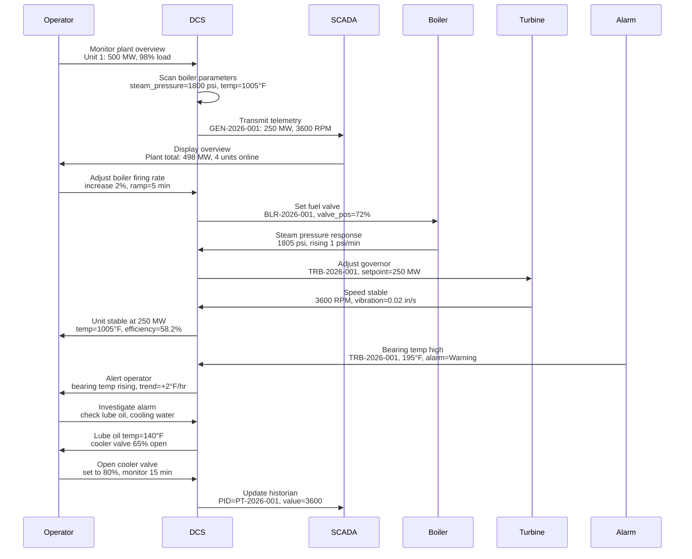
```mermaid
sequenceDiagram
Operator->>DCS: Monitor plant overview<br/>Unit 1: 500 MW, 98% load
DCS->>DCS: Scan boiler parameters<br/>steam_pressure=1800 psi, temp=1005°F
DCS->>SCADA: Transmit telemetry<br/>GEN-2026-001: 250 MW, 3600 RPM
SCADA->>Operator: Display overview<br/>Plant total: 498 MW, 4 units online
Operator->>DCS: Adjust boiler firing rate<br/>increase 2%, ramp=5 min
DCS->>Boiler: Set fuel valve<br/>BLR-2026-001, valve_pos=72%
Boiler->>DCS: Steam pressure response<br/>1805 psi, rising 1 psi/min
DCS->>Turbine: Adjust governor<br/>TRB-2026-001, setpoint=250 MW
Turbine->>DCS: Speed stable<br/>3600 RPM, vibration=0.02 in/s
DCS->>Operator: Unit stable at 250 MW<br/>temp=1005°F, efficiency=58.2%
Alarm->>DCS: Bearing temp high<br/>TRB-2026-001, 195°F, alarm=Warning
DCS->>Operator: Alert operator<br/>bearing temp rising, trend=+2°F/hr
Operator->>DCS: Investigate alarm<br/>check lube oil, cooling water
DCS->>Operator: Lube oil temp=140°F<br/>cooler valve 65% open
Operator->>DCS: Open cooler valve<br/>set to 80%, monitor 15 min
DCS->>SCADA: Update historian<br/>PID=PT-2026-001, value=3600
```

#### Integration Details

| Flow | Entity | Info Flow | Source | Target | Source Conn | Target Conn | Pattern | Complexity |
|------|--------|-----------|--------|--------|-------------|-------------|---------|------------|
| Thermal Plant | Boiler | MonitorBoilerParameters | DCS (ABB 800xA) | SCADA (Siemens Spectrum Power) | DCS OPC-UA | SCADA OPC-DA | API-led (Real-time) | High |
| Thermal Plant | Turbine | AdjustGovernor | DCS (ABB 800xA) | Turbine Governor (Woodward) | DCS Modbus TCP | Governor Modbus RTU | API-led (Real-time) | High |
| Thermal Plant | Generator | TransmitTelemetry | SCADA (Siemens Spectrum Power) | Plant Historian (OSIsoft PI) | SCADA API (ICCP) | PI Interface (OPC-DA) | API-led (Real-time) | Medium |
| Thermal Plant | Alarm | AlertOperator | DCS (ABB 800xA) | Alarm Management System | DCS OPC-A&E | Alarm API (REST) | Event-driven | Medium |
| Thermal Plant | Setpoint | AdjustBoilerFiringRate | Operator HMI | DCS (ABB 800xA) | HMI API (OAuth2) | DCS OPC-UA | API-led (Real-time) | Simple |
| Thermal Plant | Trend | LogTrendData | Plant Historian (OSIsoft PI) | Reporting Database | PI API (REST) | SQL JDBC | Batch (Scheduled) | Simple |
| Thermal Plant | Performance | CalculateEfficiency | DCS (ABB 800xA) | Plant Historian (OSIsoft PI) | DCS OPC-UA | PI API (REST) | API-led (Real-time) | Medium |
| Thermal Plant | Vibration | MonitorVibration | DCS (ABB 800xA) | Condition Monitoring System | DCS OPC-UA | CMS API (Modbus TCP) | API-led (Real-time) | Medium |

#### Acceptance Criteria

| AC ID | Description | Related Info Flow | Expected Outcome | Priority |
|-------|------------|-------------------|------------------|----------|
| AC-TP-01 | Validate real-time telemetry accuracy within ±0.5% of field values | MonitorBoilerParameters | Telemetry values match field instruments within tolerance | High |
| AC-TP-02 | Verify alarm response time under 30 seconds from event occurrence | AlertOperator | Alarms are displayed on HMI within 30s of trigger | High |
| AC-TP-03 | Confirm DCS-to-SCADA data latency below 1 second for critical points | TransmitTelemetry | PI historian shows data timestamp within 1s of DCS scan | Medium |
| AC-TP-04 | Ensure all operator setpoint changes are logged with user identity and timestamp | AdjustBoilerFiringRate | Audit trail shows user, value, time for every setpoint change | Medium |

---

### 1.2 Renewable Generation & Solar/Wind Integration

**Description:** Operators monitor and control renewable generation assets including solar PV farms and wind turbines. The renewable management system handles variability forecasting, curtailment commands, and power quality compliance.

**Actors:** Renewable Operator, Grid Integration Engineer, ISO Scheduler  
**Systems:** Renewable Management System (GE Renewable), SCADA (Siemens Spectrum Power), Weather Forecasting Service, ISO Market Portal

#### Sequence Diagram

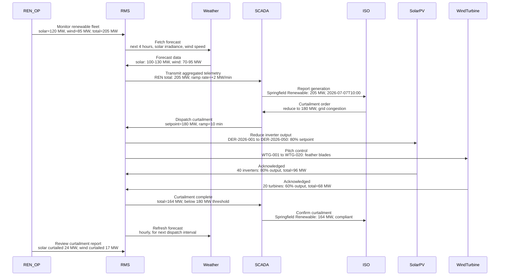
```mermaid
sequenceDiagram
REN_OP->>RMS: Monitor renewable fleet<br/>solar=120 MW, wind=85 MW, total=205 MW
RMS->>Weather: Fetch forecast<br/>next 4 hours, solar irradiance, wind speed
Weather->>RMS: Forecast data<br/>solar: 100-130 MW, wind: 70-95 MW
RMS->>SCADA: Transmit aggregated telemetry<br/>REN total: 205 MW, ramp rate=+2 MW/min
SCADA->>ISO: Report generation<br/>Springfield Renewable: 205 MW, 2026-07-07T10:00
ISO->>SCADA: Curtailment order<br/>reduce to 180 MW, grid congestion
SCADA->>RMS: Dispatch curtailment<br/>setpoint=180 MW, ramp=10 min
RMS->>SolarPV: Reduce inverter output<br/>DER-2026-001 to DER-2026-050: 80% setpoint
RMS->>WindTurbine: Pitch control<br/>WTG-001 to WTG-020: feather blades
SolarPV->>RMS: Acknowledged<br/>40 inverters: 80% output, total=96 MW
WindTurbine->>RMS: Acknowledged<br/>20 turbines: 60% output, total=68 MW
RMS->>SCADA: Curtailment complete<br/>total=164 MW, below 180 MW threshold
SCADA->>ISO: Confirm curtailment<br/>Springfield Renewable: 164 MW, compliant
RMS->>Weather: Refresh forecast<br/>hourly, for next dispatch interval
REN_OP->>RMS: Review curtailment report<br/>solar curtailed 24 MW, wind curtailed 17 MW
```

#### Integration Details

| Flow | Entity | Info Flow | Source | Target | Source Conn | Target Conn | Pattern | Complexity |
|------|--------|-----------|--------|--------|-------------|-------------|---------|------------|
| Renewable | Forecast | FetchWeatherForecast | RMS (GE Renewable) | Weather Forecasting Service | RMS API (REST) | Weather API (REST) | API-led (Real-time) | Medium |
| Renewable | Curtailment | ReceiveCurtailmentOrder | ISO Market Portal | SCADA (Siemens Spectrum Power) | ISO API (ICCP) | SCADA API (ICCP) | Event-driven | High |
| Renewable | Dispatch | DispatchCurtailment | SCADA (Siemens Spectrum Power) | RMS (GE Renewable) | SCADA API (ICCP) | RMS API (Modbus TCP) | API-led (Real-time) | High |
| Renewable | Solar | ReduceInverterOutput | RMS (GE Renewable) | Solar PV Inverters | RMS API (Modbus TCP) | Inverter API (SunSpec Modbus) | API-led (Real-time) | Medium |
| Renewable | Wind | ActivatePitchControl | RMS (GE Renewable) | Wind Turbine Controllers | RMS API (OPC-UA) | Turbine API (IEC 61400-25) | API-led (Real-time) | Medium |
| Renewable | Compliance | ConfirmCurtailment | SCADA (Siemens Spectrum Power) | ISO Market Portal | SCADA API (ICCP) | ISO API (REST) | API-led (Real-time) | Medium |
| Renewable | Report | LogCurtailmentEvent | RMS (GE Renewable) | Plant Historian (OSIsoft PI) | RMS API (REST) | PI API (REST) | Batch (Scheduled) | Simple |

#### Acceptance Criteria

| AC ID | Description | Related Info Flow | Expected Outcome | Priority |
|-------|------------|-------------------|------------------|----------|
| AC-RG-01 | Verify curtailment order execution within mandated ramp time (10 min) | ReceiveCurtailmentOrder | Curtailment target achieved within ramp window | High |
| AC-RG-02 | Validate forecast accuracy within ±15% for 4-hour horizon | FetchWeatherForecast | Weather forecast accuracy meets threshold | Medium |
| AC-RG-03 | Confirm telemetry latency under 2 seconds from inverter to SCADA | DispatchCurtailment | SCADA reflects inverter changes within 2s | Medium |
| AC-RG-04 | Ensure curtailment events are logged with timestamp, setpoint, and actual | ReduceInverterOutput | Complete audit trail for every curtailment event | Medium |

---

### 1.3 Automatic Generation Control & Dispatch

**Description:** The AGC system receives load frequency control signals from the ISO, calculates generator setpoints, and dispatches them to participating generators. Operators monitor ACE (Area Control Error) and ensure regulatory compliance.

**Actors:** System Operator, ISO Operator, Generator Dispatcher  
**Systems:** AGC (GE/Alstom), EMS (Siemens Spectrum Power), ISO RTO System, SCADA, Plant DCS

#### Sequence Diagram

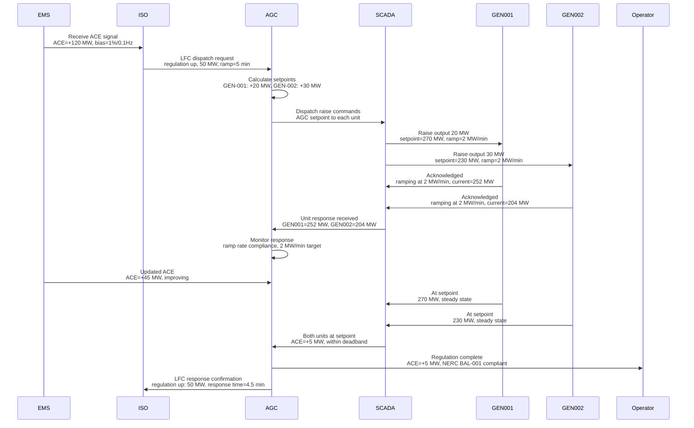
```mermaid
sequenceDiagram
EMS->>ISO: Receive ACE signal<br/>ACE=+120 MW, bias=1%/0.1Hz
ISO->>AGC: LFC dispatch request<br/>regulation up, 50 MW, ramp=5 min
AGC->>AGC: Calculate setpoints<br/>GEN-001: +20 MW, GEN-002: +30 MW
AGC->>SCADA: Dispatch raise commands<br/>AGC setpoint to each unit
SCADA->>GEN001: Raise output 20 MW<br/>setpoint=270 MW, ramp=2 MW/min
SCADA->>GEN002: Raise output 30 MW<br/>setpoint=230 MW, ramp=2 MW/min
GEN001->>SCADA: Acknowledged<br/>ramping at 2 MW/min, current=252 MW
GEN002->>SCADA: Acknowledged<br/>ramping at 2 MW/min, current=204 MW
SCADA->>AGC: Unit response received<br/>GEN001=252 MW, GEN002=204 MW
AGC->>AGC: Monitor response<br/>ramp rate compliance, 2 MW/min target
EMS->>AGC: Updated ACE<br/>ACE=+45 MW, improving
GEN001->>SCADA: At setpoint<br/>270 MW, steady state
GEN002->>SCADA: At setpoint<br/>230 MW, steady state
SCADA->>AGC: Both units at setpoint<br/>ACE=+5 MW, within deadband
AGC->>Operator: Regulation complete<br/>ACE=+5 MW, NERC BAL-001 compliant
AGC->>ISO: LFC response confirmation<br/>regulation up: 50 MW, response time=4.5 min
```

#### Integration Details

| Flow | Entity | Info Flow | Source | Target | Source Conn | Target Conn | Pattern | Complexity |
|------|--------|-----------|--------|--------|-------------|-------------|---------|------------|
| AGC | ACE | ReceiveACESignal | EMS (GE/Alstom) | AGC System | EMS API (ICCP) | AGC Internal Bus | API-led (Real-time) | High |
| AGC | Dispatch | CalculateGeneratorSetpoints | AGC System | SCADA (Siemens Spectrum Power) | AGC Internal Calc | SCADA API (ICCP) | API-led (Real-time) | High |
| AGC | Setpoint | DispatchRaiseCommand | SCADA (Siemens Spectrum Power) | Plant DCS (ABB 800xA) | SCADA API (ICCP) | DCS Modbus TCP | API-led (Real-time) | High |
| AGC | Response | MonitorRampResponse | AGC System | EMS (GE/Alstom) | AGC Internal | EMS API (ICCP) | API-led (Real-time) | Medium |
| AGC | Compliance | VerifyACENERC | AGC System | EMS (GE/Alstom) | AGC Internal | EMS API (ICCP) | API-led (Real-time) | Medium |
| AGC | Confirmation | SendLFCResponse | EMS (GE/Alstom) | ISO RTO System | EMS API (ICCP) | ISO API (ICCP) | API-led (Real-time) | High |
| AGC | Log | LogDispatchEvent | AGC System | Plant Historian (OSIsoft PI) | AGC API (REST) | PI API (REST) | Batch (Scheduled) | Simple |

#### Acceptance Criteria

| AC ID | Description | Related Info Flow | Expected Outcome | Priority |
|-------|------------|-------------------|------------------|----------|
| AC-AGC-01 | Verify ACE returns to within ±10 MW deadband within 10 minutes of LFC request | ReceiveACESignal | ACE within deadband within 10 min of dispatch | High |
| AC-AGC-02 | Validate generator ramp rate compliance with NERC BAL-001 standards | CalculateGeneratorSetpoints | Each generator ramps within ±0.5 MW/min of target | High |
| AC-AGC-03 | Confirm ISO communication latency under 5 seconds for dispatch signals | ReceiveACESignal | ICCP data transfer completes in under 5s | Medium |
| AC-AGC-04 | Ensure all AGC events logged with ACE value, setpoint, and unit response | LogDispatchEvent | Complete audit trail for NERC compliance | Medium |

---

### 1.4 Fuel Management & Emissions Monitoring

**Description:** Fuel management system tracks fuel inventory, quality, and consumption for thermal plants. Emissions monitoring system (CEMS) continuously measures stack emissions and reports data to environmental regulators.

**Actors:** Fuel Manager, Environmental Engineer, Plant Manager  
**Systems:** Fuel Management System, CEMS (Continuous Emissions Monitoring), DCS (ABB 800xA), EPA CAMD Portal, PI Historian

#### Sequence Diagram

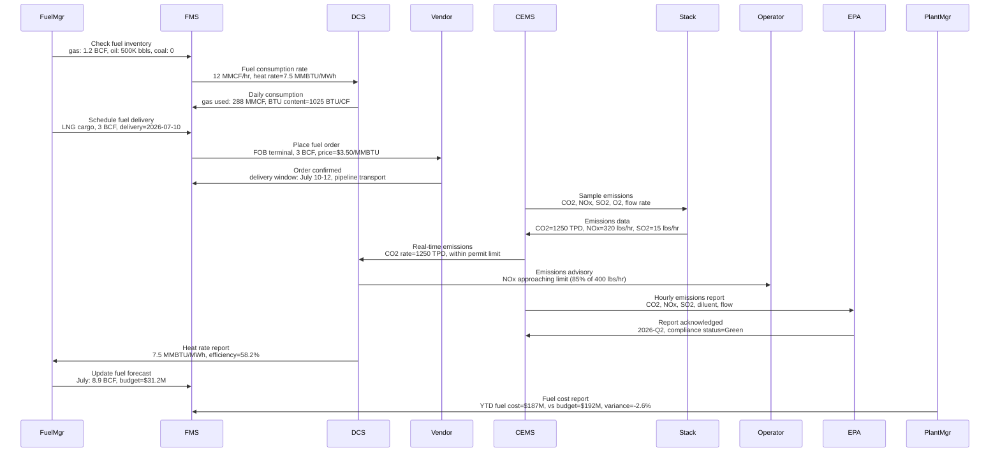
```mermaid
sequenceDiagram
FuelMgr->>FMS: Check fuel inventory<br/>gas: 1.2 BCF, oil: 500K bbls, coal: 0
FMS->>DCS: Fuel consumption rate<br/>12 MMCF/hr, heat rate=7.5 MMBTU/MWh
DCS->>FMS: Daily consumption<br/>gas used: 288 MMCF, BTU content=1025 BTU/CF
FuelMgr->>FMS: Schedule fuel delivery<br/>LNG cargo, 3 BCF, delivery=2026-07-10
FMS->>Vendor: Place fuel order<br/>FOB terminal, 3 BCF, price=$3.50/MMBTU
Vendor->>FMS: Order confirmed<br/>delivery window: July 10-12, pipeline transport
CEMS->>Stack: Sample emissions<br/>CO2, NOx, SO2, O2, flow rate
Stack->>CEMS: Emissions data<br/>CO2=1250 TPD, NOx=320 lbs/hr, SO2=15 lbs/hr
CEMS->>DCS: Real-time emissions<br/>CO2 rate=1250 TPD, within permit limit
DCS->>Operator: Emissions advisory<br/>NOx approaching limit (85% of 400 lbs/hr)
CEMS->>EPA: Hourly emissions report<br/>CO2, NOx, SO2, diluent, flow
EPA->>CEMS: Report acknowledged<br/>2026-Q2, compliance status=Green
DCS->>FuelMgr: Heat rate report<br/>7.5 MMBTU/MWh, efficiency=58.2%
FuelMgr->>FMS: Update fuel forecast<br/>July: 8.9 BCF, budget=$31.2M
PlantMgr->>FMS: Fuel cost report<br/>YTD fuel cost=$187M, vs budget=$192M, variance=-2.6%
```

#### Integration Details

| Flow | Entity | Info Flow | Source | Target | Source Conn | Target Conn | Pattern | Complexity |
|------|--------|-----------|--------|--------|-------------|-------------|---------|------------|
| Fuel | Inventory | CheckFuelInventory | Fuel Management System | DCS (ABB 800xA) | FMS API (REST) | DCS OPC-UA | API-led (Real-time) | Simple |
| Fuel | Consumption | RecordDailyConsumption | DCS (ABB 800xA) | Fuel Management System | DCS OPC-UA | FMS API (REST) | Batch (Scheduled) | Medium |
| Fuel | Order | PlaceFuelOrder | Fuel Management System | Vendor Portal | FMS API (REST) | Vendor EDI | API-led (Real-time) | Medium |
| Emissions | CEMS | SampleStackEmissions | CEMS | Stack Analyzer | CEMS Serial (Modbus) | Analyzer 4-20mA | API-led (Real-time) | High |
| Emissions | DCS | TransferEmissionsData | CEMS | DCS (ABB 800xA) | CEMS API (Modbus TCP) | DCS OPC-UA | API-led (Real-time) | Medium |
| Emissions | EPA | ReportHourlyEmissions | CEMS | EPA CAMD Portal | CEMS API (REST) | EPA CAMD Web Services (SOAP) | Batch (Scheduled) | High |
| Emissions | Compliance | LogEmissionsReport | CEMS | Plant Historian (OSIsoft PI) | CEMS API (REST) | PI API (REST) | Batch (Scheduled) | Simple |

#### Acceptance Criteria

| AC ID | Description | Related Info Flow | Expected Outcome | Priority |
|-------|------------|-------------------|------------------|----------|
| AC-FM-01 | Verify fuel inventory accuracy within ±2% of physical measurement | CheckFuelInventory | FMS inventory matches tank gauging within 2% | High |
| AC-FM-02 | Validate CEMS data completeness >95% for EPA reporting | SampleStackEmissions | No gaps >1 hour in CEMS data stream | High |
| AC-FM-03 | Confirm EPA report submission within regulatory deadline (hourly) | ReportHourlyEmissions | EPA acknowledges receipt within 1 hour of period end | High |
| AC-FM-04 | Ensure heat rate calculation accuracy within ±1% of turbine heat balance | RecordDailyConsumption | Heat rate matches turbine manufacturer curve within 1% | Medium |

---

# Transmission Operations & EMS

Real-time monitoring and control of the high-voltage transmission network via Energy Management System (EMS). Includes state estimation, contingency analysis, wide-area monitoring with synchrophasors, and transmission switching/clearance management.

### 2.1 EMS Real-time Network Monitoring

**Description:** System operators monitor the transmission network in real-time via EMS displays showing voltage profiles, line loadings, and system frequency. SCADA data from substations is processed for situational awareness.

**Actors:** Transmission Operator, EMS Engineer, Reliability Coordinator  
**Systems:** EMS (Siemens Spectrum Power / OSI Monarch), SCADA RTUs, PI Historian, Substation IEDs

#### Sequence Diagram

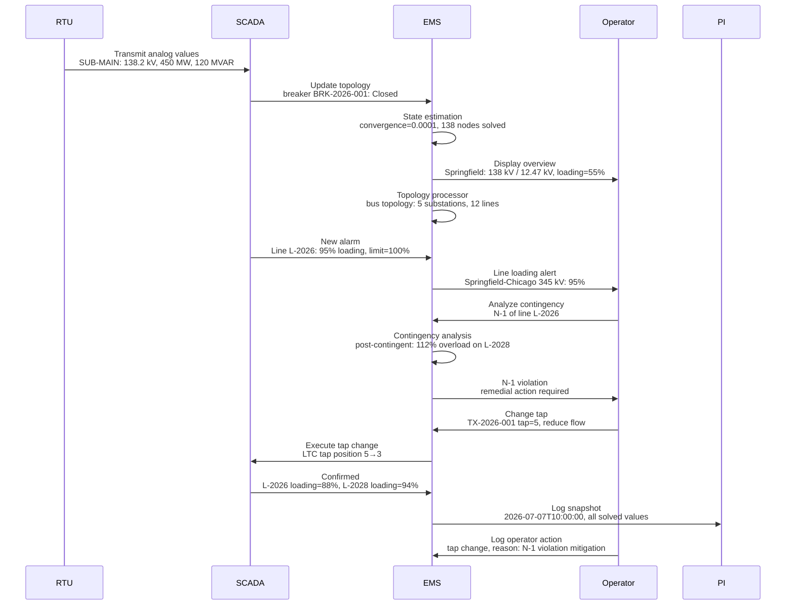
```mermaid
sequenceDiagram
RTU->>SCADA: Transmit analog values<br/>SUB-MAIN: 138.2 kV, 450 MW, 120 MVAR
SCADA->>EMS: Update topology<br/>breaker BRK-2026-001: Closed
EMS->>EMS: State estimation<br/>convergence=0.0001, 138 nodes solved
EMS->>Operator: Display overview<br/>Springfield: 138 kV / 12.47 kV, loading=55%
EMS->>EMS: Topology processor<br/>bus topology: 5 substations, 12 lines
SCADA->>EMS: New alarm<br/>Line L-2026: 95% loading, limit=100%
EMS->>Operator: Line loading alert<br/>Springfield-Chicago 345 kV: 95%
Operator->>EMS: Analyze contingency<br/>N-1 of line L-2026
EMS->>EMS: Contingency analysis<br/>post-contingent: 112% overload on L-2028
EMS->>Operator: N-1 violation<br/>remedial action required
Operator->>EMS: Change tap<br/>TX-2026-001 tap=5, reduce flow
EMS->>SCADA: Execute tap change<br/>LTC tap position 5→3
SCADA->>EMS: Confirmed<br/>L-2026 loading=88%, L-2028 loading=94%
EMS->>PI: Log snapshot<br/>2026-07-07T10:00:00, all solved values
Operator->>EMS: Log operator action<br/>tap change, reason: N-1 violation mitigation
```

#### Integration Details

| Flow | Entity | Info Flow | Source | Target | Source Conn | Target Conn | Pattern | Complexity |
|------|--------|-----------|--------|--------|-------------|-------------|---------|------------|
| EMS | Telemetry | ReceiveAnalogValues | RTU (SUB-MAIN-001) | SCADA (Siemens Spectrum Power) | RTU DNP3 | SCADA DNP3 | API-led (Real-time) | High |
| EMS | StateEstimation | RunStateEstimation | EMS (Siemens Spectrum Power) | EMS (Siemens Spectrum Power) | Internal | Internal | Batch (Real-time) | High |
| EMS | Alarm | ProcessLineAlarm | SCADA (Siemens Spectrum Power) | EMS (Siemens Spectrum Power) | SCADA API (ICCP) | EMS Internal | Event-driven | High |
| EMS | Contingency | RunContingencyAnalysis | EMS (Siemens Spectrum Power) | EMS (Siemens Spectrum Power) | Internal | Internal | Batch (Real-time) | High |
| EMS | Control | ExecuteTapChange | EMS (Siemens Spectrum Power) | SCADA (Siemens Spectrum Power) | EMS API (ICCP) | SCADA DNP3 | API-led (Real-time) | Medium |
| EMS | Historian | LogSnapshot | EMS (Siemens Spectrum Power) | Plant Historian (OSIsoft PI) | EMS API (REST) | PI API (REST) | Batch (Scheduled) | Simple |
| EMS | Audit | LogOperatorAction | EMS (Siemens Spectrum Power) | Compliance Database | EMS API (REST) | SQL JDBC | API-led (Real-time) | Simple |

#### Acceptance Criteria

| AC ID | Description | Related Info Flow | Expected Outcome | Priority |
|-------|------------|-------------------|------------------|----------|
| AC-EMS-01 | Validate state estimation convergence within 30 seconds of topology change | RunStateEstimation | State estimation converges with residual <0.001 within 30s | High |
| AC-EMS-02 | Confirm alarm processing latency under 5 seconds from RTU scan to HMI display | ProcessLineAlarm | Alarm visible on operator console within 5s of RTU scan | High |
| AC-EMS-03 | Verify contingency analysis completes within 60 seconds for full network model | RunContingencyAnalysis | All N-1 contingencies evaluated within 60s | Medium |
| AC-EMS-04 | Ensure all operator control actions are logged with user, target, and timestamp | LogOperatorAction | Complete audit trail for NERC compliance | Medium |

---

### 2.2 State Estimation & Contingency Analysis

**Description:** State estimator processes real-time measurements to compute the best estimate of power system state. Contingency analysis evaluates N-1 reliability criteria and identifies potential violations requiring remedial action.

**Actors:** EMS Engineer, Transmission Operator, Planning Engineer  
**Systems:** EMS State Estimator (OSI Monarch), SCADA, Contingency Analysis Module, Remedial Action System

#### Sequence Diagram

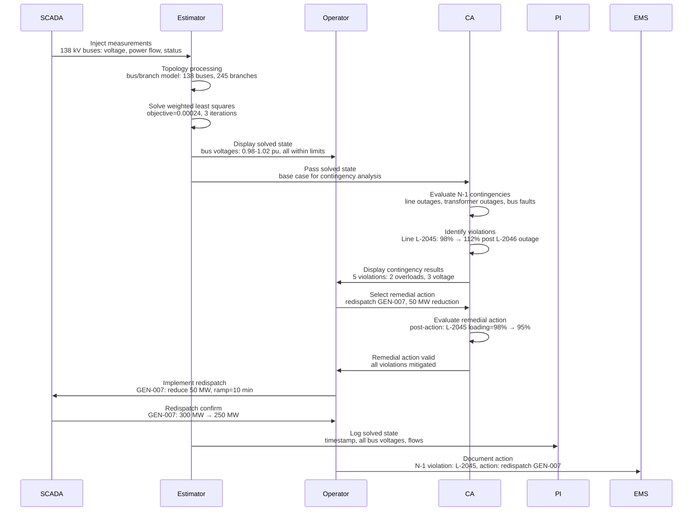
```mermaid
sequenceDiagram
SCADA->>Estimator: Inject measurements<br/>138 kV buses: voltage, power flow, status
Estimator->>Estimator: Topology processing<br/>bus/branch model: 138 buses, 245 branches
Estimator->>Estimator: Solve weighted least squares<br/>objective=0.00024, 3 iterations
Estimator->>Operator: Display solved state<br/>bus voltages: 0.98-1.02 pu, all within limits
Estimator->>CA: Pass solved state<br/>base case for contingency analysis
CA->>CA: Evaluate N-1 contingencies<br/>line outages, transformer outages, bus faults
CA->>CA: Identify violations<br/>Line L-2045: 98% → 112% post L-2046 outage
CA->>Operator: Display contingency results<br/>5 violations: 2 overloads, 3 voltage
Operator->>CA: Select remedial action<br/>redispatch GEN-007, 50 MW reduction
CA->>CA: Evaluate remedial action<br/>post-action: L-2045 loading=98% → 95%
CA->>Operator: Remedial action valid<br/>all violations mitigated
Operator->>SCADA: Implement redispatch<br/>GEN-007: reduce 50 MW, ramp=10 min
SCADA->>Operator: Redispatch confirm<br/>GEN-007: 300 MW → 250 MW
Estimator->>PI: Log solved state<br/>timestamp, all bus voltages, flows
Operator->>EMS: Document action<br/>N-1 violation: L-2045, action: redispatch GEN-007
```

#### Integration Details

| Flow | Entity | Info Flow | Source | Target | Source Conn | Target Conn | Pattern | Complexity |
|------|--------|-----------|--------|--------|-------------|-------------|---------|------------|
| EMS | Estimation | InjectMeasurements | SCADA | EMS State Estimator | SCADA API (ICCP) | Estimator API (Internal) | API-led (Real-time) | High |
| EMS | Topology | ProcessTopology | EMS State Estimator | EMS Network Model | Internal | Internal | Batch (Real-time) | High |
| EMS | Contingency | EvaluateN-1Contingencies | EMS State Estimator | Contingency Analysis Module | Internal | Internal | Batch (Real-time) | High |
| EMS | Violation | IdentifyViolations | Contingency Analysis Module | Operator HMI | Internal | HMI API (REST) | Event-driven | High |
| EMS | Action | SelectRemedialAction | Operator HMI | Contingency Analysis Module | HMI API (REST) | Internal | API-led (Real-time) | Medium |
| EMS | Dispatch | ImplementRedispatch | Operator HMI | SCADA | HMI API (REST) | SCADA API (ICCP) | API-led (Real-time) | Medium |
| EMS | Log | LogSolvedState | EMS State Estimator | Plant Historian (OSIsoft PI) | EMS API (REST) | PI API (REST) | Batch (Scheduled) | Simple |

#### Acceptance Criteria

| AC ID | Description | Related Info Flow | Expected Outcome | Priority |
|-------|------------|-------------------|------------------|----------|
| AC-SE-01 | Validate state estimation solves within 5-minute SCADA scan cycle | InjectMeasurements | State estimator converges before next SCADA scan | High |
| AC-SE-02 | Confirm measurement residual <0.001 pu for all bus voltages | ProcessTopology | All bus voltage residuals within tolerance | High |
| AC-SE-03 | Verify contingency analysis evaluates 100% of defined N-1 contingencies | EvaluateN-1Contingencies | All contingencies evaluated with results available | Medium |
| AC-SE-04 | Ensure remedial action effectiveness validated before implementation | SelectRemedialAction | CA confirms all violations mitigated post-action | Medium |

---

### 2.3 Wide Area Monitoring & Synchrophasors

**Description:** Wide Area Monitoring System (WAMS) collects synchrophasor data from PMUs deployed across the transmission network. Phasor data concentrators (PDCs) time-align and stream data for real-time visualization, oscillation detection, and post-event analysis.

**Actors:** System Operator, Protection Engineer, Grid Stability Analyst  
**Systems:** WAMS (GE PhasorPoint / SEL), PDC (Phasor Data Concentrator), PMUs (SEL-421 / GE D60), EMS, PI Historian

#### Sequence Diagram

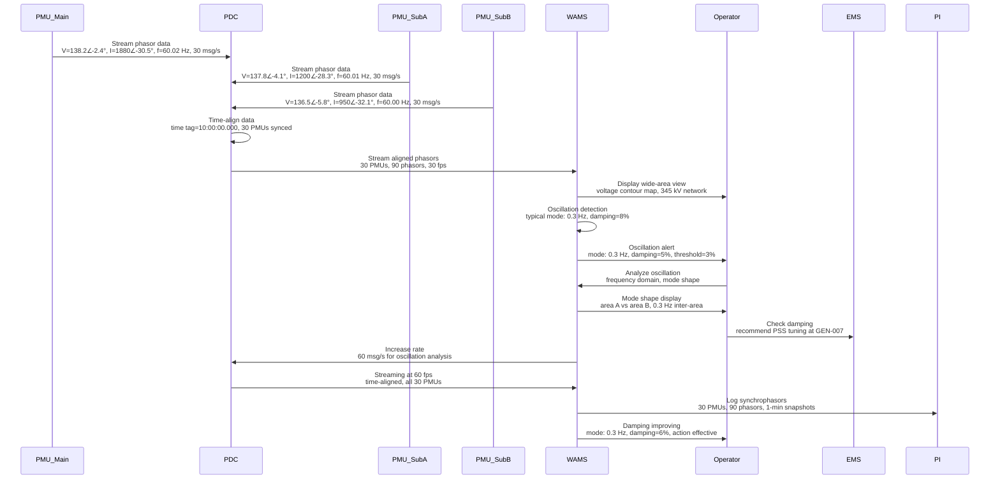
```mermaid
sequenceDiagram
PMU_Main->>PDC: Stream phasor data<br/>V=138.2∠-2.4°, I=1880∠-30.5°, f=60.02 Hz, 30 msg/s
PMU_SubA->>PDC: Stream phasor data<br/>V=137.8∠-4.1°, I=1200∠-28.3°, f=60.01 Hz, 30 msg/s
PMU_SubB->>PDC: Stream phasor data<br/>V=136.5∠-5.8°, I=950∠-32.1°, f=60.00 Hz, 30 msg/s
PDC->>PDC: Time-align data<br/>time tag=10:00:00.000, 30 PMUs synced
PDC->>WAMS: Stream aligned phasors<br/>30 PMUs, 90 phasors, 30 fps
WAMS->>Operator: Display wide-area view<br/>voltage contour map, 345 kV network
WAMS->>WAMS: Oscillation detection<br/>typical mode: 0.3 Hz, damping=8%
WAMS->>Operator: Oscillation alert<br/>mode: 0.3 Hz, damping=5%, threshold=3%
Operator->>WAMS: Analyze oscillation<br/>frequency domain, mode shape
WAMS->>Operator: Mode shape display<br/>area A vs area B, 0.3 Hz inter-area
Operator->>EMS: Check damping<br/>recommend PSS tuning at GEN-007
WAMS->>PDC: Increase rate<br/>60 msg/s for oscillation analysis
PDC->>WAMS: Streaming at 60 fps<br/>time-aligned, all 30 PMUs
WAMS->>PI: Log synchrophasors<br/>30 PMUs, 90 phasors, 1-min snapshots
WAMS->>Operator: Damping improving<br/>mode: 0.3 Hz, damping=6%, action effective
```

#### Integration Details

| Flow | Entity | Info Flow | Source | Target | Source Conn | Target Conn | Pattern | Complexity |
|------|--------|-----------|--------|--------|-------------|-------------|---------|------------|
| WAMS | PMU | StreamPhasorData | PMU (SEL-421) | PDC (Phasor Data Concentrator) | PMU C37.118 | PDC C37.118 | API-led (Real-time) | High |
| WAMS | Alignment | TimeAlignPhasors | PDC (Phasor Data Concentrator) | PDC (Phasor Data Concentrator) | Internal | Internal | Batch (Real-time) | High |
| WAMS | Stream | StreamAlignedPhasors | PDC (Phasor Data Concentrator) | WAMS (GE PhasorPoint) | PDC C37.118 | WAMS C37.118 | API-led (Real-time) | High |
| WAMS | Oscillation | DetectOscillations | WAMS (GE PhasorPoint) | WAMS (GE PhasorPoint) | Internal | Internal | Batch (Real-time) | Medium |
| WAMS | Alert | AlertOperatorOscillation | WAMS (GE PhasorPoint) | Operator HMI | WAMS API (REST) | HMI API (REST) | Event-driven | Medium |
| WAMS | Historian | LogSynchrophasors | WAMS (GE PhasorPoint) | Plant Historian (OSIsoft PI) | WAMS API (REST) | PI API (REST) | Batch (Scheduled) | Medium |
| WAMS | EMS | TransferWAMSData | WAMS (GE PhasorPoint) | EMS | WAMS API (ICCP) | EMS API (ICCP) | API-led (Real-time) | Medium |

#### Acceptance Criteria

| AC ID | Description | Related Info Flow | Expected Outcome | Priority |
|-------|------------|-------------------|------------------|----------|
| AC-WAM-01 | Validate PMU data timestamp accuracy within ±50 µs of UTC via GPS | StreamPhasorData | All PMU timestamps synchronized to GPS within tolerance | High |
| AC-WAM-02 | Confirm PDC time-alignment latency under 10 ms for 30 PMU streams | TimeAlignPhasors | Time-aligned data available within 10 ms of PMU frame | High |
| AC-WAM-03 | Verify oscillation detection identifies modes with damping <10% within 5 cycles | DetectOscillations | Oscillation detection triggers within 5 cycles of onset | Medium |
| AC-WAM-04 | Ensure synchrophasor data archival at minimum 1 snapshot per minute | LogSynchrophasors | PI historian contains 1-min snapshots for all 30 PMUs | Medium |

---

### 2.4 Transmission Switching & Clearance Management

**Description:** Operators manage transmission switching orders and clearance requests to ensure safe isolation of equipment for maintenance. The clearance management system tracks tags, holds, and switching sequences with interlocking logic.

**Actors:** Transmission Operator, Switching Scheduler, Field Crew  
**Systems:** Switching Management System, EMS, SCADA, Clearance & Tagging System, Mobile Field App

#### Sequence Diagram

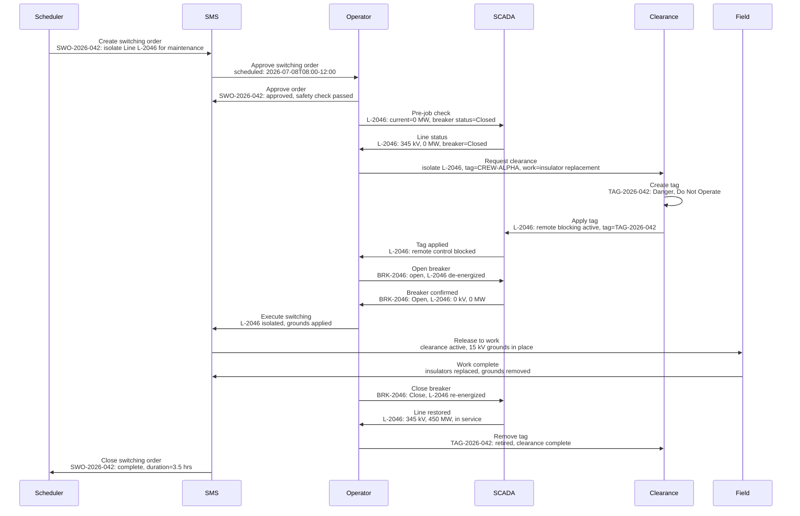
```mermaid
sequenceDiagram
Scheduler->>SMS: Create switching order<br/>SWO-2026-042: isolate Line L-2046 for maintenance
SMS->>Operator: Approve switching order<br/>scheduled: 2026-07-08T08:00-12:00
Operator->>SMS: Approve order<br/>SWO-2026-042: approved, safety check passed
Operator->>SCADA: Pre-job check<br/>L-2046: current=0 MW, breaker status=Closed
SCADA->>Operator: Line status<br/>L-2046: 345 kV, 0 MW, breaker=Closed
Operator->>Clearance: Request clearance<br/>isolate L-2046, tag=CREW-ALPHA, work=insulator replacement
Clearance->>Clearance: Create tag<br/>TAG-2026-042: Danger, Do Not Operate
Clearance->>SCADA: Apply tag<br/>L-2046: remote blocking active, tag=TAG-2026-042
SCADA->>Operator: Tag applied<br/>L-2046: remote control blocked
Operator->>SCADA: Open breaker<br/>BRK-2046: open, L-2046 de-energized
SCADA->>Operator: Breaker confirmed<br/>BRK-2046: Open, L-2046: 0 kV, 0 MW
Operator->>SMS: Execute switching<br/>L-2046 isolated, grounds applied
SMS->>Field: Release to work<br/>clearance active, 15 kV grounds in place
Field->>SMS: Work complete<br/>insulators replaced, grounds removed
Operator->>SCADA: Close breaker<br/>BRK-2046: Close, L-2046 re-energized
SCADA->>Operator: Line restored<br/>L-2046: 345 kV, 450 MW, in service
Operator->>Clearance: Remove tag<br/>TAG-2026-042: retired, clearance complete
SMS->>Scheduler: Close switching order<br/>SWO-2026-042: complete, duration=3.5 hrs
```

#### Integration Details

| Flow | Entity | Info Flow | Source | Target | Source Conn | Target Conn | Pattern | Complexity |
|------|--------|-----------|--------|--------|-------------|-------------|---------|------------|
| Switching | Order | CreateSwitchingOrder | Switching Scheduler | Switching Management System | Scheduler UI | SMS API (REST) | API-led (Real-time) | Simple |
| Switching | Approval | ApproveSwitchingOrder | Switching Management System | Operator HMI | SMS API (REST) | HMI API (REST) | API-led (Real-time) | Medium |
| Switching | Clearance | RequestClearance | Operator HMI | Clearance & Tagging System | HMI API (REST) | Clearance API (REST) | API-led (Real-time) | High |
| Switching | Tag | ApplyTag | Clearance & Tagging System | SCADA | Clearance API (REST) | SCADA API (ICCP) | Event-driven | High |
| Switching | Breaker | OpenBreaker | Operator HMI | SCADA | HMI API (REST) | SCADA DNP3 | API-led (Real-time) | High |
| Switching | Field | ReleaseToWork | Switching Management System | Mobile Field App | SMS API (REST) | Field App API (OAuth2) | API-led (Real-time) | Medium |
| Switching | Restore | RestoreLine | Operator HMI | SCADA | HMI API (REST) | SCADA DNP3 | API-led (Real-time) | High |
| Switching | Close | CloseSwitchingOrder | Switching Management System | Switching Scheduler | SMS API (REST) | Scheduler UI | API-led (Real-time) | Simple |

#### Acceptance Criteria

| AC ID | Description | Related Info Flow | Expected Outcome | Priority |
|-------|------------|-------------------|------------------|----------|
| AC-TS-01 | Verify tag/clearance blocks remote SCADA control before breaker operation | ApplyTag | SCADA remote control blocked when tag is active | High |
| AC-TS-02 | Confirm switching order approval workflow is complete before field release | ApproveSwitchingOrder | Switching order fully approved before field work begins | High |
| AC-TS-03 | Validate clearance-to-work authorization is communicated to field crew | ReleaseToWork | Field crew acknowledges clearance within 5 min | Medium |
| AC-TS-04 | Ensure all switching events are logged with user, equipment, and timestamp | CloseSwitchingOrder | Complete audit trail for NERC compliance | Medium |

---

# Substation Automation & Protection

Automated control and monitoring of substation equipment via RTUs, IEDs, and IEC 61850 communications. Includes protection relay management, fault recording, and substation security perimeters.

### 3.1 RTU & Substation SCADA Control

**Description:** Remote Terminal Units at substations acquire analog and status data from switchgear, transformers, and breakers. The substation SCADA concentrator aggregates RTU data and communicates with the central EMS via ICCP/DNP3.

**Actors:** Substation Technician, System Operator, SCADA Engineer  
**Systems:** RTU (SEL-3530 / GE D20), Substation SCADA Concentrator, EMS, IEDs (SEL-421 Relays)

#### Sequence Diagram

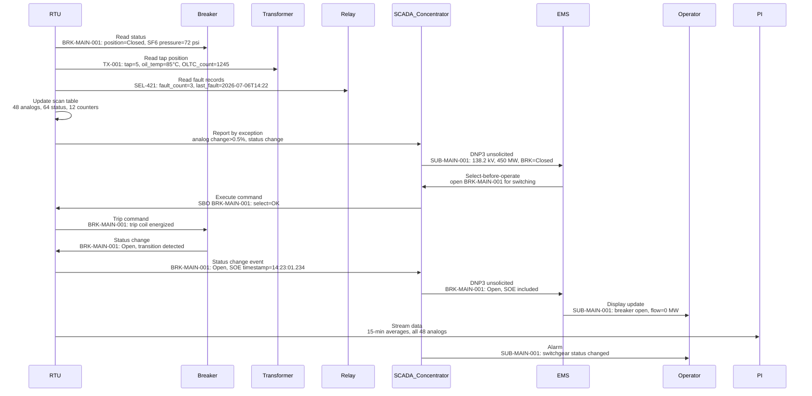
```mermaid
sequenceDiagram
RTU->>Breaker: Read status<br/>BRK-MAIN-001: position=Closed, SF6 pressure=72 psi
RTU->>Transformer: Read tap position<br/>TX-001: tap=5, oil_temp=85°C, OLTC_count=1245
RTU->>Relay: Read fault records<br/>SEL-421: fault_count=3, last_fault=2026-07-06T14:22
RTU->>RTU: Update scan table<br/>48 analogs, 64 status, 12 counters
RTU->>SCADA_Concentrator: Report by exception<br/>analog change>0.5%, status change
SCADA_Concentrator->>EMS: DNP3 unsolicited<br/>SUB-MAIN-001: 138.2 kV, 450 MW, BRK=Closed
EMS->>SCADA_Concentrator: Select-before-operate<br/>open BRK-MAIN-001 for switching
SCADA_Concentrator->>RTU: Execute command<br/>SBO BRK-MAIN-001: select=OK
RTU->>Breaker: Trip command<br/>BRK-MAIN-001: trip coil energized
Breaker->>RTU: Status change<br/>BRK-MAIN-001: Open, transition detected
RTU->>SCADA_Concentrator: Status change event<br/>BRK-MAIN-001: Open, SOE timestamp=14:23:01.234
SCADA_Concentrator->>EMS: DNP3 unsolicited<br/>BRK-MAIN-001: Open, SOE included
EMS->>Operator: Display update<br/>SUB-MAIN-001: breaker open, flow=0 MW
RTU->>PI: Stream data<br/>15-min averages, all 48 analogs
SCADA_Concentrator->>Operator: Alarm<br/>SUB-MAIN-001: switchgear status changed
```

#### Integration Details

| Flow | Entity | Info Flow | Source | Target | Source Conn | Target Conn | Pattern | Complexity |
|------|--------|-----------|--------|--------|-------------|-------------|---------|------------|
| Substation | Status | ReadBreakerStatus | RTU (SEL-3530) | Breaker Control | RTU I/O | Breaker Aux Contact | API-led (Real-time) | High |
| Substation | Analog | ReadAnalogValues | RTU (SEL-3530) | CT/PT | RTU Analog Input | CT/PT Secondary | API-led (Real-time) | High |
| Substation | SCADA | ReportByException | RTU (SEL-3530) | Substation SCADA Concentrator | RTU DNP3 | SCADA DNP3 | API-led (Real-time) | High |
| Substation | EMS | TransmitToEMS | Substation SCADA Concentrator | EMS (Siemens Spectrum Power) | SCADA API (ICCP) | EMS API (ICCP) | API-led (Real-time) | High |
| Substation | Control | SBOCommand | EMS (Siemens Spectrum Power) | Substation SCADA Concentrator | EMS API (ICCP) | SCADA DNP3 | API-led (Real-time) | High |
| Substation | Event | LogSOEEvent | RTU (SEL-3530) | Substation SCADA Concentrator | RTU DNP3 | SCADA DNP3 | Event-driven | High |
| Substation | Historian | StreamAnalogData | RTU (SEL-3530) | Plant Historian (OSIsoft PI) | RTU DNP3 | PI Interface (DNP3) | Batch (Scheduled) | Simple |

#### Acceptance Criteria

| AC ID | Description | Related Info Flow | Expected Outcome | Priority |
|-------|------------|-------------------|------------------|----------|
| AC-RTU-01 | Validate RTU scan rate of 2 seconds for all analog points | ReadAnalogValues | All analogs scanned within 2s cycle | High |
| AC-RTU-02 | Confirm SOE timestamp accuracy within ±1 ms of event occurrence | LogSOEEvent | SOE timestamps accurate to ±1 ms | High |
| AC-RTU-03 | Verify select-before-operate sequence completes in under 5 seconds | SBOCommand | Control operation sequence completes within 5s | Medium |
| AC-RTU-04 | Ensure data quality flags (good/suspect/override) are preserved in transmission | ReportByException | Data quality flags correctly mapped to DNP3 quality field | Medium |

---

### 3.2 Protection Relay & IED Management

**Description:** Protection engineers manage relay settings, fault records, and event reports for microprocessor relays. The IED management system handles settings file versioning, group changes, and disturbance record retrieval.

**Actors:** Protection Engineer, Substation Technician, Fault Analyst  
**Systems:** Protection Management System (SEL AcSELerator / GE Enervista), Relays (SEL-421, SEL-311, GE D60), Fault Recorder System, Time Sync (GPS / IRIG-B)

#### Sequence Diagram

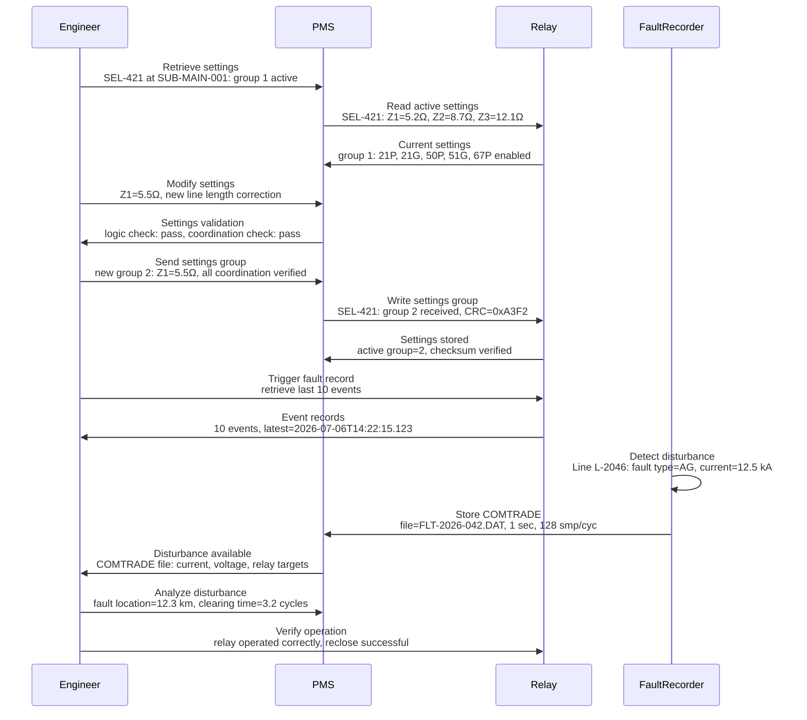
```mermaid
sequenceDiagram
Engineer->>PMS: Retrieve settings<br/>SEL-421 at SUB-MAIN-001: group 1 active
PMS->>Relay: Read active settings<br/>SEL-421: Z1=5.2Ω, Z2=8.7Ω, Z3=12.1Ω
Relay->>PMS: Current settings<br/>group 1: 21P, 21G, 50P, 51G, 67P enabled
Engineer->>PMS: Modify settings<br/>Z1=5.5Ω, new line length correction
PMS->>Engineer: Settings validation<br/>logic check: pass, coordination check: pass
Engineer->>PMS: Send settings group<br/>new group 2: Z1=5.5Ω, all coordination verified
PMS->>Relay: Write settings group<br/>SEL-421: group 2 received, CRC=0xA3F2
Relay->>PMS: Settings stored<br/>active group=2, checksum verified
Engineer->>Relay: Trigger fault record<br/>retrieve last 10 events
Relay->>Engineer: Event records<br/>10 events, latest=2026-07-06T14:22:15.123
FaultRecorder->>FaultRecorder: Detect disturbance<br/>Line L-2046: fault type=AG, current=12.5 kA
FaultRecorder->>PMS: Store COMTRADE<br/>file=FLT-2026-042.DAT, 1 sec, 128 smp/cyc
PMS->>Engineer: Disturbance available<br/>COMTRADE file: current, voltage, relay targets
Engineer->>PMS: Analyze disturbance<br/>fault location=12.3 km, clearing time=3.2 cycles
Engineer->>Relay: Verify operation<br/>relay operated correctly, reclose successful
```

#### Integration Details

| Flow | Entity | Info Flow | Source | Target | Source Conn | Target Conn | Pattern | Complexity |
|------|--------|-----------|--------|--------|-------------|-------------|---------|------------|
| Protection | Settings | ReadRelaySettings | Protection Management System | Relay (SEL-421) | PMS API (REST) | Relay Serial (SEL Protocol) | API-led (Real-time) | Medium |
| Protection | Validation | ValidateRelaySettings | Protection Management System | Protection Management System | Internal | Internal | Batch (Real-time) | High |
| Protection | Write | WriteSettingsGroup | Protection Management System | Relay (SEL-421) | PMS API (REST) | Relay Serial (SEL Protocol) | API-led (Real-time) | High |
| Protection | Events | RetrieveFaultRecords | Engineer HMI | Relay (SEL-421) | HMI API (REST) | Relay Serial (SEL Protocol) | API-led (Real-time) | Medium |
| Protection | Disturbance | StoreCOMTRADE | Fault Recorder | Protection Management System | Fault Recorder API | PMS API (REST) | Event-driven | Medium |
| Protection | Analysis | AnalyzeDisturbance | Protection Management System | Engineer HMI | PMS API (REST) | HMI API (REST) | Batch (Real-time) | Simple |
| Protection | TimeSync | SyncRelayTime | Time Sync (GPS) | Relay (SEL-421) | GPS IRIG-B | Relay IRIG-B | API-led (Real-time) | High |

#### Acceptance Criteria

| AC ID | Description | Related Info Flow | Expected Outcome | Priority |
|-------|------------|-------------------|------------------|----------|
| AC-PR-01 | Validate relay settings file CRC integrity after write operation | WriteSettingsGroup | CRC checksum matches between PMS and relay | High |
| AC-PR-02 | Confirm settings group change does not affect other protection elements | ValidateRelaySettings | All existing protection elements remain enabled/disabled as configured | High |
| AC-PR-03 | Verify COMTRADE file captures 60 cycles pre-fault and 180 cycles post-fault | StoreCOMTRADE | Disturbance record meets duration requirements | Medium |
| AC-PR-04 | Ensure relay time drift remains under ±1 ms relative to GPS | SyncRelayTime | Relay time sync status shows IRIG-B locked | Medium |

---

### 3.3 IEC 61850 Substation Communications

**Description:** Substation automation devices communicate using IEC 61850 protocols including GOOSE for high-speed peer-to-peer messaging, MMS for client-server monitoring and control, and Sampled Values for instrument transformer data.

**Actors:** Substation Automation Engineer, Protection Engineer, Network Engineer  
**Systems:** IEC 61850 IEDs (SEL, GE, ABB), Substation HMI, SCADA Gateway (IEC 61850 to DNP3), Network Switch (Managed), Time Sync (PTP/IEEE 1588)

#### Sequence Diagram

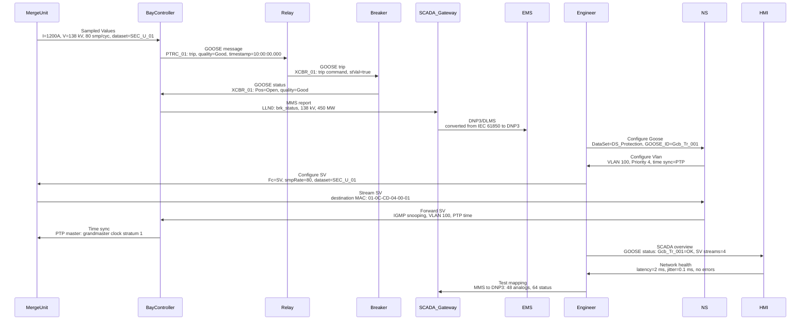
```mermaid
sequenceDiagram
MergeUnit->>BayController: Sampled Values<br/>I=1200A, V=138 kV, 80 smp/cyc, dataset=SEC_U_01
BayController->>Relay: GOOSE message<br/>PTRC_01: trip, quality=Good, timestamp=10:00:00.000
Relay->>Breaker: GOOSE trip<br/>XCBR_01: trip command, stVal=true
Breaker->>BayController: GOOSE status<br/>XCBR_01: Pos=Open, quality=Good
BayController->>SCADA_Gateway: MMS report<br/>LLN0: brk_status, 138 kV, 450 MW
SCADA_Gateway->>EMS: DNP3/DLMS<br/>converted from IEC 61850 to DNP3
Engineer->>NS: Configure Goose<br/>DataSet=DS_Protection, GOOSE_ID=Gcb_Tr_001
NS->>Engineer: Configure Vlan<br/>VLAN 100, Priority 4, time sync=PTP
Engineer->>MergeUnit: Configure SV<br/>Fc=SV, smpRate=80, dataset=SEC_U_01
MergeUnit->>NS: Stream SV<br/>destination MAC: 01-0C-CD-04-00-01
NS->>BayController: Forward SV<br/>IGMP snooping, VLAN 100, PTP time
BayController->>MergeUnit: Time sync<br/>PTP master: grandmaster clock stratum 1
Engineer->>HMI: SCADA overview<br/>GOOSE status: Gcb_Tr_001=OK, SV streams=4
HMI->>Engineer: Network health<br/>latency=2 ms, jitter=0.1 ms, no errors
Engineer->>SCADA_Gateway: Test mapping<br/>MMS to DNP3: 48 analogs, 64 status
```

#### Integration Details

| Flow | Entity | Info Flow | Source | Target | Source Conn | Target Conn | Pattern | Complexity |
|------|--------|-----------|--------|--------|-------------|-------------|---------|------------|
| IEC61850 | SV | StreamSampledValues | Merge Unit | Bay Controller | SV (IEC 61850-9-2) | SV (IEC 61850-9-2) | API-led (Real-time) | High |
| IEC61850 | GOOSE | TripGOOSEMessage | Bay Controller | Relay | GOOSE (IEC 61850-8-1) | GOOSE (IEC 61850-8-1) | Event-driven | High |
| IEC61850 | MMS | ReportMMSData | Bay Controller | SCADA Gateway | MMS (IEC 61850-8-1) | MMS (IEC 61850-8-1) | API-led (Real-time) | High |
| IEC61850 | Gateway | ConvertToDNP3 | SCADA Gateway | EMS | Gateway Internal | DNP3 (IEC 61850 to DNP3) | API-led (Real-time) | Medium |
| IEC61850 | Config | ConfigureGOOSE | Engineer Workstation | Network Switch | Engineering Tool | Switch CLI/SNMP | API-led (Real-time) | Simple |
| IEC61850 | PTP | SyncPTPTime | PTP Grandmaster | Merge Unit | PTP (IEEE 1588) | PTP (IEEE 1588) | API-led (Real-time) | High |
| IEC61850 | Health | MonitorNetworkHealth | Network Switch | Substation HMI | SNMP | HMI API (REST) | API-led (Real-time) | Simple |

#### Acceptance Criteria

| AC ID | Description | Related Info Flow | Expected Outcome | Priority |
|-------|------------|-------------------|------------------|----------|
| AC-IEC-01 | Validate GOOSE message delivery time under 3 ms for protection messages | TripGOOSEMessage | GOOSE trip received by relay within 3 ms | High |
| AC-IEC-02 | Confirm SV stream synchronization within ±1 µs via PTP | StreamSampledValues | All SV streams synchronized to PTP grandmaster | High |
| AC-IEC-03 | Verify MMS report latency under 100 ms from data change to SCADA gateway | ReportMMSData | MMMS report buffered report delivered within 100 ms | Medium |
| AC-IEC-04 | Ensure GOOSE dataset integrity with sequence number continuity | ConfigureGOOSE | No missing GOOSE sequence numbers over 24-hour test | Medium |

---

### 3.4 Substation Security & Access Management

**Description:** Physical and cyber security management for substations including electronic security perimeters (ESP), access control systems, video surveillance, and NERC CIP compliance for cyber assets.

**Actors:** Security Analyst, Substation Technician, NERC CIP Compliance Lead  
**Systems:** Access Control System (Lenel / Honeywell), Video Management System, Substation HMI, CIP Compliance Database, SIEM (Splunk)

#### Sequence Diagram

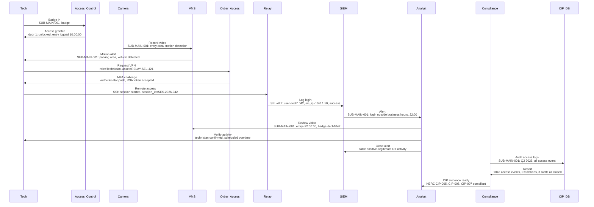
```mermaid
sequenceDiagram
Tech->>Access_Control: Badge in<br/>SUB-MAIN-001: badge #1042, role=Technician
Access_Control->>Tech: Access granted<br/>door 1: unlocked, entry logged 10:00:00
Camera->>VMS: Record video<br/>SUB-MAIN-001: entry area, motion detection
VMS->>Tech: Motion alert<br/>SUB-MAIN-001: parking area, vehicle detected
Tech->>Cyber_Access: Request VPN<br/>role=Technician, asset=RELAY-SEL-421
Cyber_Access->>Tech: MFA challenge<br/>authenticator push, RSA token accepted
Tech->>Relay: Remote access<br/>SSH session started, session_id=SES-2026-042
Relay->>SIEM: Log login<br/>SEL-421: user=tech1042, src_ip=10.0.1.50, success
SIEM->>Analyst: Alert<br/>SUB-MAIN-001: login outside business hours, 22:00
Analyst->>VMS: Review video<br/>SUB-MAIN-001: entry=22:00:00, badge=tech1042
Analyst->>Tech: Verify activity<br/>technician confirmed, scheduled overtime
Analyst->>SIEM: Close alert<br/>false positive, legitimate OT activity
Compliance->>CIP_DB: Audit access logs<br/>SUB-MAIN-001: Q2 2026, all access event
CIP_DB->>Compliance: Report<br/>1042 access events, 0 violations, 3 alerts all closed
Compliance->>Analyst: CIP evidence ready<br/>NERC CIP-005, CIP-006, CIP-007 compliant
```

#### Integration Details

| Flow | Entity | Info Flow | Source | Target | Source Conn | Target Conn | Pattern | Complexity |
|------|--------|-----------|--------|--------|-------------|-------------|---------|------------|
| Security | Physical | BadgeAccess | Badge Reader | Access Control System | Badge Reader Wiegand | ACS API (REST) | API-led (Real-time) | High |
| Security | Video | RecordMotionEvent | Camera (IP) | Video Management System | Camera RTSP | VMS API (ONVIF) | API-led (Real-time) | Medium |
| Security | Cyber | RequestVPNAccess | Remote Technician | Cyber Access Gateway | VPN Client | Gateway API (RADIUS) | API-led (Real-time) | High |
| Security | MFA | ChallengeMFA | Cyber Access Gateway | MFA Server (RSA) | Gateway API (RADIUS) | MFA API (RADIUS/HTTP) | API-led (Real-time) | High |
| Security | SIEM | LogAccessEvent | Relay (SEL-421) | SIEM (Splunk) | Syslog | SIEM API (Syslog) | Event-driven | Medium |
| Security | CIP | AuditAccessLogs | Compliance Lead | CIP Compliance Database | CIP UI | CIP DB API (REST) | Batch (Scheduled) | Medium |
| Security | Report | GenerateCIPReport | CIP Compliance Database | Compliance Lead | CIP DB API (REST) | CIP UI | Batch (Scheduled) | Simple |

#### Acceptance Criteria

| AC ID | Description | Related Info Flow | Expected Outcome | Priority |
|-------|------------|-------------------|------------------|----------|
| AC-SEC-01 | Validate badge access response time under 3 seconds from badge swipe to door unlock | BadgeAccess | Door unlocks within 3s of badge presentation | High |
| AC-SEC-02 | Confirm MFA enforcement for all remote cyber access to BES Cyber Assets | ChallengeMFA | All remote access requires MFA before session establishment | High |
| AC-SEC-03 | Verify SIEM receives all access events within 60 seconds of occurrence | LogAccessEvent | SIEM shows event timestamp within 60s of actual event | Medium |
| AC-SEC-04 | Ensure quarterly CIP access log reviews are completed with evidence archived | AuditAccessLogs | CIP compliance database contains Q2 2026 review evidence | Medium |

---

# Distribution Grid & ADMS

Real-time monitoring, control, and optimization of the distribution network via Advanced Distribution Management System (ADMS). Includes DER management, fault location/restoration, and distribution planning with volt/VAR optimization.

### 4.1 Distribution SCADA & ADMS Operations

**Description:** Distribution operators monitor feeders, regulators, and capacitor banks via ADMS. The system provides real-time visibility, volt/VAR control, and switching management for the distribution grid.

**Actors:** Distribution Operator, Field Technician, Distribution Engineer  
**Systems:** ADMS (GE Grid Solutions / OSI), Distribution SCADA RTUs, Capacitor Bank Controllers, Voltage Regulators, PI Historian

#### Sequence Diagram

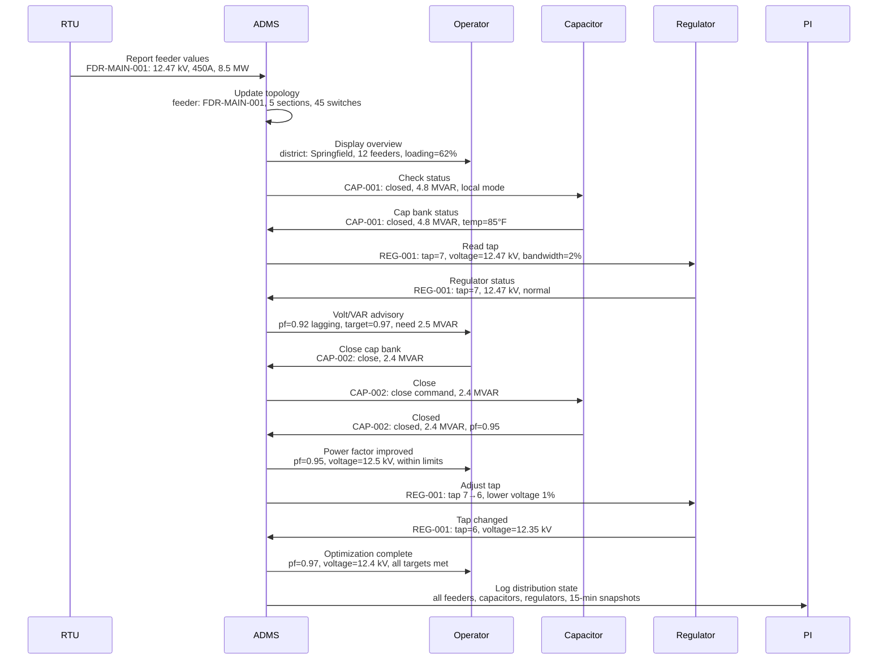
```mermaid
sequenceDiagram
RTU->>ADMS: Report feeder values<br/>FDR-MAIN-001: 12.47 kV, 450A, 8.5 MW
ADMS->>ADMS: Update topology<br/>feeder: FDR-MAIN-001, 5 sections, 45 switches
ADMS->>Operator: Display overview<br/>district: Springfield, 12 feeders, loading=62%
ADMS->>Capacitor: Check status<br/>CAP-001: closed, 4.8 MVAR, local mode
Capacitor->>ADMS: Cap bank status<br/>CAP-001: closed, 4.8 MVAR, temp=85°F
ADMS->>Regulator: Read tap<br/>REG-001: tap=7, voltage=12.47 kV, bandwidth=2%
Regulator->>ADMS: Regulator status<br/>REG-001: tap=7, 12.47 kV, normal
ADMS->>Operator: Volt/VAR advisory<br/>pf=0.92 lagging, target=0.97, need 2.5 MVAR
Operator->>ADMS: Close cap bank<br/>CAP-002: close, 2.4 MVAR
ADMS->>Capacitor: Close<br/>CAP-002: close command, 2.4 MVAR
Capacitor->>ADMS: Closed<br/>CAP-002: closed, 2.4 MVAR, pf=0.95
ADMS->>Operator: Power factor improved<br/>pf=0.95, voltage=12.5 kV, within limits
ADMS->>Regulator: Adjust tap<br/>REG-001: tap 7→6, lower voltage 1%
Regulator->>ADMS: Tap changed<br/>REG-001: tap=6, voltage=12.35 kV
ADMS->>Operator: Optimization complete<br/>pf=0.97, voltage=12.4 kV, all targets met
ADMS->>PI: Log distribution state<br/>all feeders, capacitors, regulators, 15-min snapshots
```

#### Integration Details

| Flow | Entity | Info Flow | Source | Target | Source Conn | Target Conn | Pattern | Complexity |
|------|--------|-----------|--------|--------|-------------|-------------|---------|------------|
| Distribution | Telemetry | ReportFeederValues | RTU (Feeder) | ADMS (GE Grid Solutions) | RTU DNP3 | ADMS DNP3 | API-led (Real-time) | High |
| Distribution | SCADA | UpdateTopology | ADMS (GE Grid Solutions) | ADMS (GE Grid Solutions) | Internal | Internal | Batch (Real-time) | High |
| Distribution | Capacitor | MonitorCapacitorBank | Capacitor Bank Controller | ADMS (GE Grid Solutions) | Capacitor DNP3 | ADMS DNP3 | API-led (Real-time) | Medium |
| Distribution | Regulator | ReadRegulatorTap | Voltage Regulator Control | ADMS (GE Grid Solutions) | Regulator DNP3 | ADMS DNP3 | API-led (Real-time) | Medium |
| Distribution | VoltVAR | ExecuteVoltVARControl | ADMS (GE Grid Solutions) | Capacitor Bank Controller | ADMS DNP3 | Capacitor DNP3 | API-led (Real-time) | Medium |
| Distribution | Optimize | OptimizePowerFactor | ADMS (GE Grid Solutions) | ADMS (GE Grid Solutions) | Internal | Internal | Batch (Real-time) | Medium |
| Distribution | Historian | LogDistributionState | ADMS (GE Grid Solutions) | Plant Historian (OSIsoft PI) | ADMS API (REST) | PI API (REST) | Batch (Scheduled) | Simple |

#### Acceptance Criteria

| AC ID | Description | Related Info Flow | Expected Outcome | Priority |
|-------|------------|-------------------|------------------|----------|
| AC-DS-01 | Validate feeder telemetry accuracy within ±1% of field meter values | ReportFeederValues | ADMS feeder values match field meters within 1% | High |
| AC-DS-02 | Confirm capacitor bank switching response under 10 seconds from command | MonitorCapacitorBank | Capacitor status reflects command within 10s | Medium |
| AC-DS-03 | Verify volt/VAR optimization converges to target pf within ±0.02 | OptimizePowerFactor | Power factor within 0.02 of target post-optimization | Medium |
| AC-DS-04 | Ensure all ADMS control actions are logged with operator identity and timestamp | LogDistributionState | Complete audit trail for every control action | Medium |

---

### 4.2 DER Management & Distributed Energy Resources

**Description:** Distribution operators manage interconnection of customer-owned DERs including solar PV, battery storage, and EV chargers. The DERMS system aggregates capacity, dispatches for peak shaving, and monitors power quality at the grid edge.

**Actors:** DER Operator, DER Customer, Grid Integration Engineer  
**Systems:** DERMS (Generac / Enbala), ADMS (GE Grid Solutions), Customer DER Inverters, Meter Data System, ISO Market Portal

#### Sequence Diagram

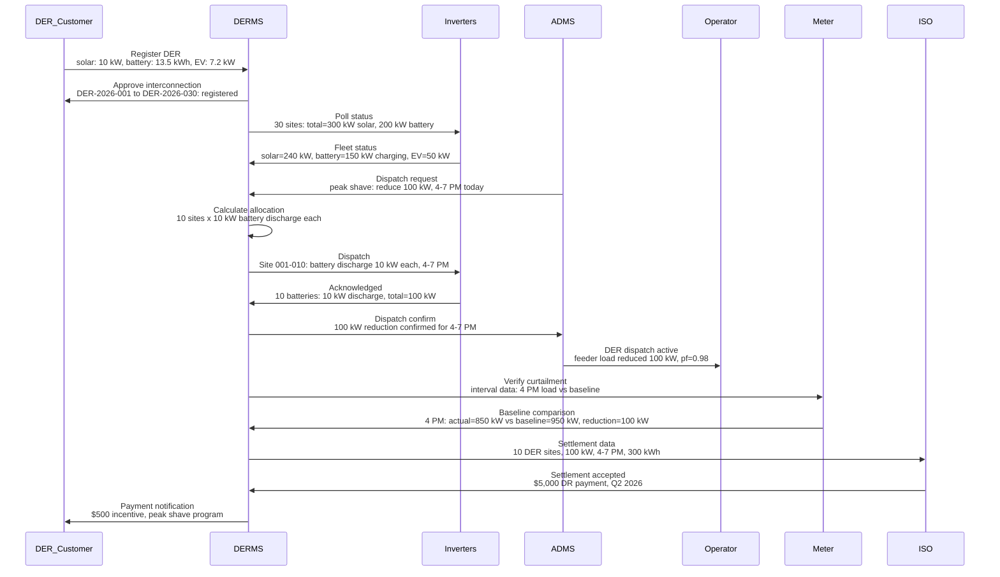
```mermaid
sequenceDiagram
DER_Customer->>DERMS: Register DER<br/>solar: 10 kW, battery: 13.5 kWh, EV: 7.2 kW
DERMS->>DER_Customer: Approve interconnection<br/>DER-2026-001 to DER-2026-030: registered
DERMS->>Inverters: Poll status<br/>30 sites: total=300 kW solar, 200 kW battery
Inverters->>DERMS: Fleet status<br/>solar=240 kW, battery=150 kW charging, EV=50 kW
ADMS->>DERMS: Dispatch request<br/>peak shave: reduce 100 kW, 4-7 PM today
DERMS->>DERMS: Calculate allocation<br/>10 sites x 10 kW battery discharge each
DERMS->>Inverters: Dispatch<br/>Site 001-010: battery discharge 10 kW each, 4-7 PM
Inverters->>DERMS: Acknowledged<br/>10 batteries: 10 kW discharge, total=100 kW
DERMS->>ADMS: Dispatch confirm<br/>100 kW reduction confirmed for 4-7 PM
ADMS->>Operator: DER dispatch active<br/>feeder load reduced 100 kW, pf=0.98
DERMS->>Meter: Verify curtailment<br/>interval data: 4 PM load vs baseline
Meter->>DERMS: Baseline comparison<br/>4 PM: actual=850 kW vs baseline=950 kW, reduction=100 kW
DERMS->>ISO: Settlement data<br/>10 DER sites, 100 kW, 4-7 PM, 300 kWh
ISO->>DERMS: Settlement accepted<br/>$5,000 DR payment, Q2 2026
DERMS->>DER_Customer: Payment notification<br/>$500 incentive, peak shave program
```

#### Integration Details

| Flow | Entity | Info Flow | Source | Target | Source Conn | Target Conn | Pattern | Complexity |
|------|--------|-----------|--------|--------|-------------|-------------|---------|------------|
| DER | Register | RegisterDERSite | DER Customer Portal | DERMS (Generac) | Customer UI | DERMS API (REST) | API-led (Real-time) | Simple |
| DER | Poll | PollInverterFleet | DERMS (Generac) | DER Inverters | DERMS API (Modbus TCP) | Inverter API (SunSpec) | API-led (Real-time) | Medium |
| DER | Dispatch | ReceiveDispatchRequest | ADMS (GE Grid Solutions) | DERMS (Generac) | ADMS API (ICCP) | DERMS API (REST) | API-led (Real-time) | High |
| DER | Battery | DischargeBattery | DERMS (Generac) | Battery Inverters | DERMS API (Modbus TCP) | Inverter API (SunSpec) | API-led (Real-time) | High |
| DER | Meter | VerifyLoadReduction | DERMS (Generac) | Meter Data System | DERMS API (REST) | Meter API (REST) | Batch (Scheduled) | Medium |
| DER | Settlement | SubmitSettlementData | DERMS (Generac) | ISO Market Portal | DERMS API (REST) | ISO API (REST) | Batch (Scheduled) | Medium |
| DER | Payment | NotifyDERPayment | DERMS (Generac) | DER Customer Portal | DERMS API (REST) | Customer UI | Event-driven | Simple |

#### Acceptance Criteria

| AC ID | Description | Related Info Flow | Expected Outcome | Priority |
|-------|------------|-------------------|------------------|----------|
| AC-DER-01 | Validate DER dispatch command reaches inverter within 30 seconds | DischargeBattery | Inverter acknowledges dispatch within 30s | High |
| AC-DER-02 | Confirm load reduction measurement accuracy within ±5% of baseline interval metering | VerifyLoadReduction | Meter data confirms reduction within 5% of DERMS estimate | Medium |
| AC-DER-03 | Verify DERMS aggregates all registered DERs into dispatch calculation | ReceiveDispatchRequest | All 30 registered sites included in dispatch allocation | High |
| AC-DER-04 | Ensure settlement data submitted to ISO within 1 hour of event end | SubmitSettlementData | Settlement submission timestamp within 1 hr of event close | Medium |

---

### 4.3 Fault Location, Isolation & Restoration (FLISR)

**Description:** ADMS detects distribution faults via SCADA alarms and AMI voltage complaints, locates the faulted segment using fault current indicators, and automatically isolates the fault while restoring service to unfaulted sections.

**Actors:** Distribution Operator, Outage Coordinator, Field Crew  
**Systems:** ADMS (GE Grid Solutions), Fault Current Indicators, SCADA RTU, AMI Head-End, Outage Management System (OMS)

#### Sequence Diagram

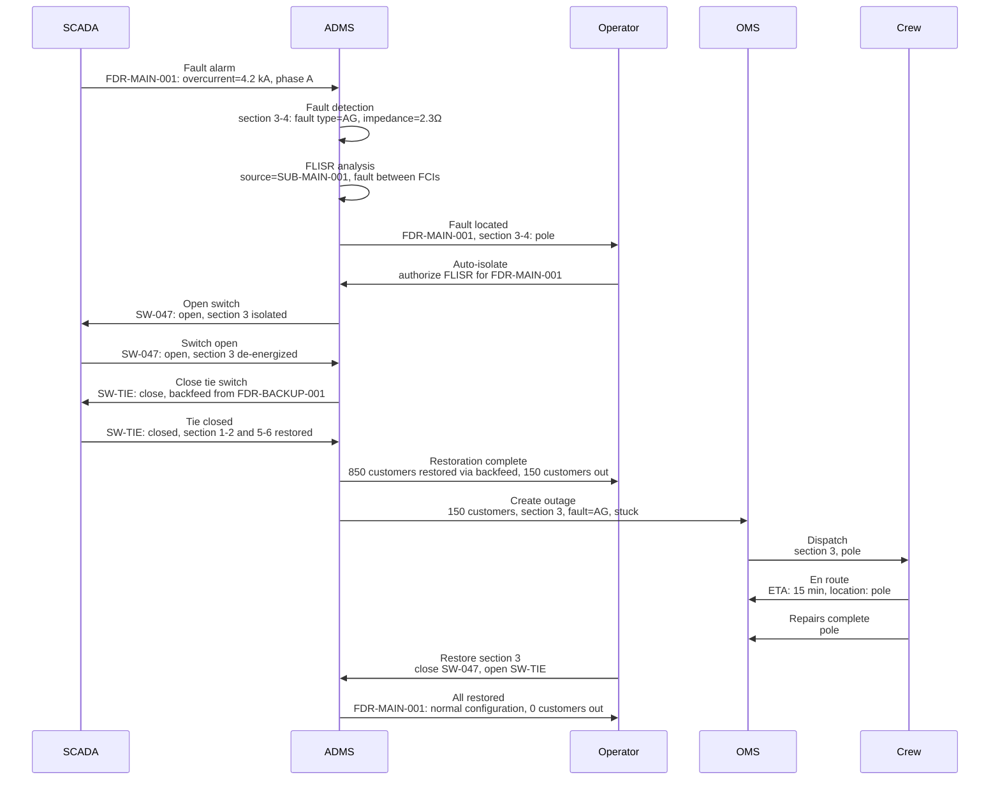
```mermaid
sequenceDiagram
SCADA->>ADMS: Fault alarm<br/>FDR-MAIN-001: overcurrent=4.2 kA, phase A
ADMS->>ADMS: Fault detection<br/>section 3-4: fault type=AG, impedance=2.3Ω
ADMS->>ADMS: FLISR analysis<br/>source=SUB-MAIN-001, fault between FCIs #7 and #8
ADMS->>Operator: Fault located<br/>FDR-MAIN-001, section 3-4: pole #47-#52
Operator->>ADMS: Auto-isolate<br/>authorize FLISR for FDR-MAIN-001
ADMS->>SCADA: Open switch<br/>SW-047: open, section 3 isolated
SCADA->>ADMS: Switch open<br/>SW-047: open, section 3 de-energized
ADMS->>SCADA: Close tie switch<br/>SW-TIE: close, backfeed from FDR-BACKUP-001
SCADA->>ADMS: Tie closed<br/>SW-TIE: closed, section 1-2 and 5-6 restored
ADMS->>Operator: Restoration complete<br/>850 customers restored via backfeed, 150 customers out
ADMS->>OMS: Create outage<br/>150 customers, section 3, fault=AG, stuck
OMS->>Crew: Dispatch<br/>section 3, pole #47-#52, patrol and repair
Crew->>OMS: En route<br/>ETA: 15 min, location: pole #47
Crew->>OMS: Repairs complete<br/>pole #48: insulator replaced, section 3 ready
Operator->>ADMS: Restore section 3<br/>close SW-047, open SW-TIE
ADMS->>Operator: All restored<br/>FDR-MAIN-001: normal configuration, 0 customers out
```

#### Integration Details

| Flow | Entity | Info Flow | Source | Target | Source Conn | Target Conn | Pattern | Complexity |
|------|--------|-----------|--------|--------|-------------|-------------|---------|------------|
| FLISR | Fault | DetectFaultAlarm | SCADA RTU | ADMS (GE Grid Solutions) | RTU DNP3 | ADMS DNP3 | Event-driven | High |
| FLISR | Analysis | RunFLISRAnalysis | ADMS (GE Grid Solutions) | ADMS (GE Grid Solutions) | Internal | Internal | Batch (Real-time) | High |
| FLISR | Isolate | OpenIsolationSwitch | ADMS (GE Grid Solutions) | SCADA RTU | ADMS DNP3 | RTU DNP3 | API-led (Real-time) | High |
| FLISR | Restore | CloseTieSwitch | ADMS (GE Grid Solutions) | SCADA RTU | ADMS DNP3 | RTU DNP3 | API-led (Real-time) | High |
| FLISR | OMS | CreateOutageEvent | ADMS (GE Grid Solutions) | Outage Management System | ADMS API (REST) | OMS API (REST) | Event-driven | Medium |
| FLISR | Dispatch | DispatchCrew | Outage Management System | Mobile Field Crew App | OMS API (REST) | Field App API (OAuth2) | API-led (Real-time) | Medium |
| FLISR | Restore | RestoreNormalConfig | Operator HMI | ADMS (GE Grid Solutions) | HMI API (REST) | ADMS DNP3 | API-led (Real-time) | High |

#### Acceptance Criteria

| AC ID | Description | Related Info Flow | Expected Outcome | Priority |
|-------|------------|-------------------|------------------|----------|
| AC-FL-01 | Validate fault detection and location within 30 seconds of alarm receipt | DetectFaultAlarm | FLISR identifies fault location within 30s of SCADA alarm | High |
| AC-FL-02 | Confirm automatic isolation and restoration completes under 2 minutes | RunFLISRAnalysis | Unfaulted sections restored within 2 min of fault detection | High |
| AC-FL-03 | Verify OMS outage record created automatically with fault details | CreateOutageEvent | OMS record created within 30s of FLISR completion | Medium |
| AC-FL-04 | Ensure backfeed tie switch rating is not exceeded during restoration | CloseTieSwitch | Backfeed loading remains within 90% of tie switch rating | High |

---

### 4.4 Distribution Planning & Network Optimization

**Description:** Planning engineers analyze distribution network capacity, load growth, and voltage profiles to plan system upgrades. The optimization module performs volt/VAR control, loss minimization, and capacity forecasting.

**Actors:** Distribution Planning Engineer, System Planner, GIS Engineer  
**Systems:** Distribution Planning System (CYME / Synergi), GIS (ArcGIS Utility Network), ADMS, Load Forecasting System, Asset Management System

#### Sequence Diagram

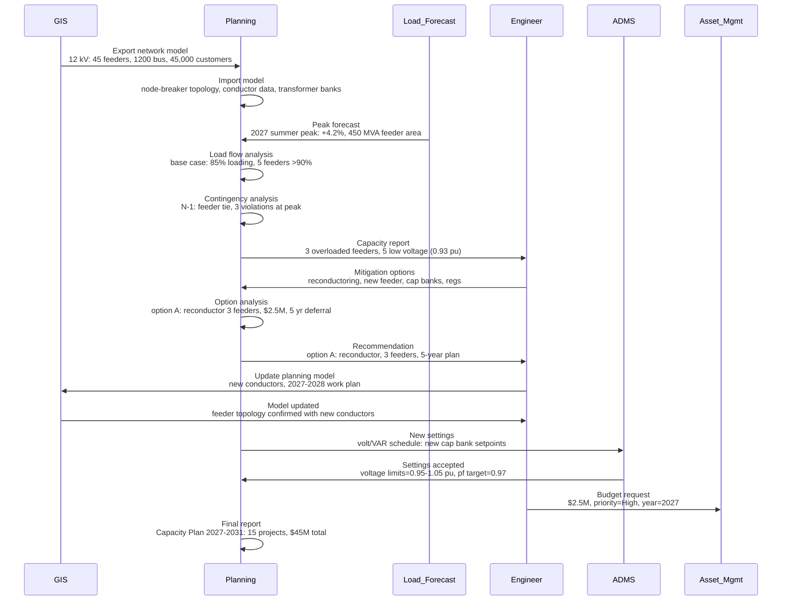
```mermaid
sequenceDiagram
GIS->>Planning: Export network model<br/>12 kV: 45 feeders, 1200 bus, 45,000 customers
Planning->>Planning: Import model<br/>node-breaker topology, conductor data, transformer banks
Load_Forecast->>Planning: Peak forecast<br/>2027 summer peak: +4.2%, 450 MVA feeder area
Planning->>Planning: Load flow analysis<br/>base case: 85% loading, 5 feeders >90%
Planning->>Planning: Contingency analysis<br/>N-1: feeder tie, 3 violations at peak
Planning->>Engineer: Capacity report<br/>3 overloaded feeders, 5 low voltage (0.93 pu)
Engineer->>Planning: Mitigation options<br/>reconductoring, new feeder, cap banks, regs
Planning->>Planning: Option analysis<br/>option A: reconductor 3 feeders, $2.5M, 5 yr deferral
Planning->>Engineer: Recommendation<br/>option A: reconductor, 3 feeders, 5-year plan
Engineer->>GIS: Update planning model<br/>new conductors, 2027-2028 work plan
GIS->>Engineer: Model updated<br/>feeder topology confirmed with new conductors
Planning->>ADMS: New settings<br/>volt/VAR schedule: new cap bank setpoints
ADMS->>Planning: Settings accepted<br/>voltage limits=0.95-1.05 pu, pf target=0.97
Engineer->>Asset_Mgmt: Budget request<br/>$2.5M, priority=High, year=2027
Planning->>Planning: Final report<br/>Capacity Plan 2027-2031: 15 projects, $45M total
```

#### Integration Details

| Flow | Entity | Info Flow | Source | Target | Source Conn | Target Conn | Pattern | Complexity |
|------|--------|-----------|--------|--------|-------------|-------------|---------|------------|
| Planning | Model | ExportNetworkModel | GIS (ArcGIS Utility Network) | Distribution Planning System | GIS API (REST) | Planning API (REST) | Batch (Scheduled) | Medium |
| Planning | Forecast | ImportPeakForecast | Load Forecasting System | Distribution Planning System | Forecast API (REST) | Planning API (REST) | Batch (Scheduled) | Medium |
| Planning | Flow | RunLoadFlowAnalysis | Distribution Planning System | Distribution Planning System | Internal | Internal | Batch (Real-time) | Medium |
| Planning | Options | AnalyzeMitigationOptions | Distribution Planning System | Distribution Planning System | Internal | Internal | Batch (Real-time) | Medium |
| Planning | GIS | UpdatePlanningModel | Distribution Planning System | GIS (ArcGIS Utility Network) | Planning API (REST) | GIS API (REST) | Batch (Scheduled) | Simple |
| Planning | ADMS | DeployVoltVARSettings | Distribution Planning System | ADMS (GE Grid Solutions) | Planning API (REST) | ADMS API (ICCP) | API-led (Real-time) | Simple |
| Planning | Budget | SubmitBudgetRequest | Planning Engineer | Asset Management System | Planning UI | Asset API (REST) | API-led (Real-time) | Simple |

#### Acceptance Criteria

| AC ID | Description | Related Info Flow | Expected Outcome | Priority |
|-------|------------|-------------------|------------------|----------|
| AC-DP-01 | Validate load flow analysis matches field measurements within ±2% for all feeders | RunLoadFlowAnalysis | Load flow results within 2% of SCADA readings | High |
| AC-DP-02 | Confirm planning model GIS topology completeness (100% of assets mapped) | ExportNetworkModel | All distribution assets in GIS are present in planning model | Medium |
| AC-DP-03 | Verify mitigation options include at least feeder reconductor, cap bank, and regulator alternatives | AnalyzeMitigationOptions | At least 3 distinct mitigation options provided per violation | Medium |
| AC-DP-04 | Ensure volt/VAR settings deployment does not cause temporary control disruption | DeployVoltVARSettings | No ADMS alarms during settings deployment window | Medium |

---

# Water Treatment Plant Operations (WTP) - `UT-WTC` `UT-WQM`

Monitor and control water treatment processes including raw water intake, chemical dosing, coagulation/flocculation, filtration, disinfection, and clearwell storage. SCADA and DCS systems manage plant operations with real-time quality monitoring.

### 5.1 Raw Water Intake & Preliminary Treatment

**Description:** Operators monitor raw water quality from the source reservoir, control intake gates and screens, manage chemical pre-treatment dosing, and oversee the settling basin operations.

**Actors:** Treatment Plant Operator, Plant Manager, Lab Technician  
**Systems:** SCADA (Schneider Electric EcoStruxure), DCS (Rockwell PlantPAx), Water Quality Analyzers, Chemical Dosing System

#### Sequence Diagram

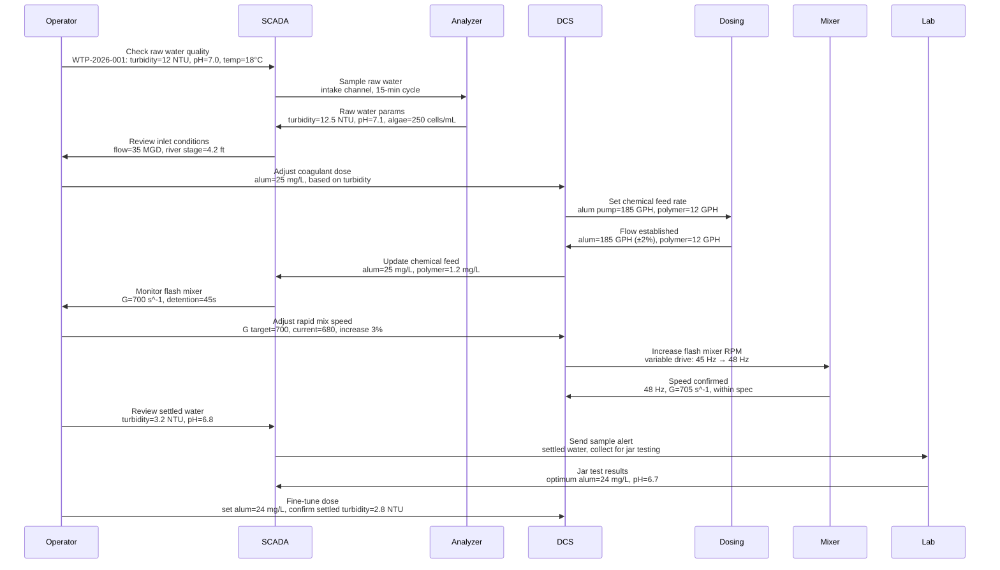
```mermaid
sequenceDiagram
Operator->>SCADA: Check raw water quality<br/>WTP-2026-001: turbidity=12 NTU, pH=7.0, temp=18°C
SCADA->>Analyzer: Sample raw water<br/>intake channel, 15-min cycle
Analyzer->>SCADA: Raw water params<br/>turbidity=12.5 NTU, pH=7.1, algae=250 cells/mL
SCADA->>Operator: Review inlet conditions<br/>flow=35 MGD, river stage=4.2 ft
Operator->>DCS: Adjust coagulant dose<br/>alum=25 mg/L, based on turbidity
DCS->>Dosing: Set chemical feed rate<br/>alum pump=185 GPH, polymer=12 GPH
Dosing->>DCS: Flow established<br/>alum=185 GPH (±2%), polymer=12 GPH
DCS->>SCADA: Update chemical feed<br/>alum=25 mg/L, polymer=1.2 mg/L
SCADA->>Operator: Monitor flash mixer<br/>G=700 s^-1, detention=45s
Operator->>DCS: Adjust rapid mix speed<br/>G target=700, current=680, increase 3%
DCS->>Mixer: Increase flash mixer RPM<br/>variable drive: 45 Hz → 48 Hz
Mixer->>DCS: Speed confirmed<br/>48 Hz, G=705 s^-1, within spec
Operator->>SCADA: Review settled water<br/>turbidity=3.2 NTU, pH=6.8
SCADA->>Lab: Send sample alert<br/>settled water, collect for jar testing
Lab->>SCADA: Jar test results<br/>optimum alum=24 mg/L, pH=6.7
Operator->>DCS: Fine-tune dose<br/>set alum=24 mg/L, confirm settled turbidity=2.8 NTU
```

#### Integration Details

| Flow | Entity | Info Flow | Source | Target | Source Conn | Target Conn | Pattern | Complexity |
|------|--------|-----------|--------|--------|-------------|-------------|---------|------------|
| Water Treatment | Raw Water | SampleRawWater | Water Quality Analyzer | SCADA (EcoStruxure) | Analyzer Modbus RTU | SCADA Modbus TCP | API-led (Real-time) | Medium |
| Water Treatment | Dosing | SetChemicalDose | DCS (Rockwell PlantPAx) | Chemical Dosing System | DCS OPC-UA | Dosing Pump PLC | API-led (Real-time) | Medium |
| Water Treatment | Mixing | AdjustFlashMixerSpeed | DCS (Rockwell PlantPAx) | Flash Mixer VFD | DCS OPC-UA | VFD Modbus RTU | API-led (Real-time) | Simple |
| Water Treatment | Settled | MonitorSettledWater | SCADA (EcoStruxure) | DCS (Rockwell PlantPAx) | SCADA OPC-DA | DCS OPC-UA | API-led (Real-time) | Medium |
| Water Treatment | Lab | AnalyzeJarTest | Lab Information System | SCADA (EcoStruxure) | LIS API (REST) | SCADA API (REST) | API-led (Real-time) | Simple |
| Water Treatment | Chemical | LogChemicalUsage | DCS (Rockwell PlantPAx) | Plant Historian (OSIsoft PI) | DCS OPC-UA | PI API (REST) | Batch (Scheduled) | Simple |
| Water Treatment | Compliance | RecordRawWaterQuality | SCADA (EcoStruxure) | Compliance Database | SCADA API (REST) | SQL JDBC | Batch (Scheduled) | Simple |

#### Acceptance Criteria

| AC ID | Description | Related Info Flow | Expected Outcome | Priority |
|-------|------------|-------------------|------------------|----------|
| AC-WT-01 | Verify coagulant dose optimization achieves settled turbidity <5 NTU | SetChemicalDose | Settled turbidity below 5 NTU within 30 min of dose change | High |
| AC-WT-02 | Validate raw water quality sample frequency meets regulatory minimum (every 15 min) | SampleRawWater | Analyzer logs show 15-min sampling interval maintained | High |
| AC-WT-03 | Confirm flash mixer G value within ±10% of design target | AdjustFlashMixerSpeed | G value between 630-770 s^-1 | Medium |
| AC-WT-04 | Ensure chemical feed rate accuracy within ±5% of setpoint | SetChemicalDose | Flow meter verifies dosing within 5% of commanded rate | Medium |

---

### 5.2 Filtration & Disinfection Control

**Description:** Operators manage dual-media filtration process, backwash cycles, chlorination disinfection, and clearwell storage levels. CT (concentration × time) values are calculated for regulatory compliance.

**Actors:** Treatment Plant Operator, Lab Technician, Compliance Officer  
**Systems:** DCS (Rockwell PlantPAx), SCADA (EcoStruxure), Chlorine Analyzers, Filter Control System, Clearwell Level Sensors

#### Sequence Diagram

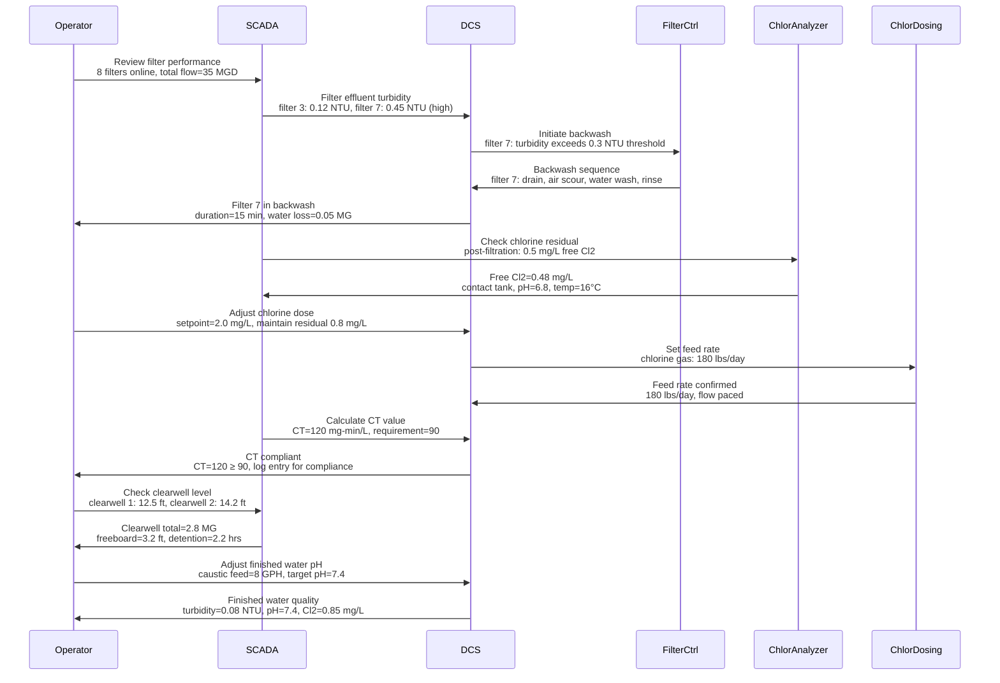
```mermaid
sequenceDiagram
Operator->>SCADA: Review filter performance<br/>8 filters online, total flow=35 MGD
SCADA->>DCS: Filter effluent turbidity<br/>filter 3: 0.12 NTU, filter 7: 0.45 NTU (high)
DCS->>FilterCtrl: Initiate backwash<br/>filter 7: turbidity exceeds 0.3 NTU threshold
FilterCtrl->>DCS: Backwash sequence<br/>filter 7: drain, air scour, water wash, rinse
DCS->>Operator: Filter 7 in backwash<br/>duration=15 min, water loss=0.05 MG
SCADA->>ChlorAnalyzer: Check chlorine residual<br/>post-filtration: 0.5 mg/L free Cl2
ChlorAnalyzer->>SCADA: Free Cl2=0.48 mg/L<br/>contact tank, pH=6.8, temp=16°C
Operator->>DCS: Adjust chlorine dose<br/>setpoint=2.0 mg/L, maintain residual 0.8 mg/L
DCS->>ChlorDosing: Set feed rate<br/>chlorine gas: 180 lbs/day
ChlorDosing->>DCS: Feed rate confirmed<br/>180 lbs/day, flow paced
SCADA->>DCS: Calculate CT value<br/>CT=120 mg-min/L, requirement=90
DCS->>Operator: CT compliant<br/>CT=120 ≥ 90, log entry for compliance
Operator->>SCADA: Check clearwell level<br/>clearwell 1: 12.5 ft, clearwell 2: 14.2 ft
SCADA->>Operator: Clearwell total=2.8 MG<br/>freeboard=3.2 ft, detention=2.2 hrs
Operator->>DCS: Adjust finished water pH<br/>caustic feed=8 GPH, target pH=7.4
DCS->>Operator: Finished water quality<br/>turbidity=0.08 NTU, pH=7.4, Cl2=0.85 mg/L
```

#### Integration Details

| Flow | Entity | Info Flow | Source | Target | Source Conn | Target Conn | Pattern | Complexity |
|------|--------|-----------|--------|--------|-------------|-------------|---------|------------|
| Filtration | Filter | MonitorFilterPerformance | SCADA (EcoStruxure) | DCS (Rockwell PlantPAx) | SCADA OPC-DA | DCS OPC-UA | API-led (Real-time) | Medium |
| Filtration | Backwash | InitiateBackwashSequence | DCS (Rockwell PlantPAx) | Filter Control System | DCS OPC-UA | Filter PLC | API-led (Real-time) | High |
| Filtration | Chlorine | AnalyzeChlorineResidual | Chlorine Analyzer | SCADA (EcoStruxure) | Analyzer 4-20mA | SCADA Modbus TCP | API-led (Real-time) | Medium |
| Filtration | CT | CalculateCTValue | SCADA (EcoStruxure) | DCS (Rockwell PlantPAx) | SCADA API (REST) | DCS OPC-UA | API-led (Real-time) | High |
| Filtration | Clearwell | MonitorClearwellLevel | Clearwell Level Sensor | SCADA (EcoStruxure) | Sensor 4-20mA | SCADA Modbus RTU | API-led (Real-time) | Simple |
| Filtration | pH | AdjustFinishedWaterpH | DCS (Rockwell PlantPAx) | Chemical Dosing System | DCS OPC-UA | Dosing Pump PLC | API-led (Real-time) | Simple |
| Filtration | Compliance | LogFinishedWaterQuality | SCADA (EcoStruxure) | Compliance Database | SCADA API (REST) | SQL JDBC | Batch (Scheduled) | Simple |

#### Acceptance Criteria

| AC ID | Description | Related Info Flow | Expected Outcome | Priority |
|-------|------------|-------------------|------------------|----------|
| AC-FL-01 | Verify filter effluent turbidity <0.3 NTU for all operating filters | MonitorFilterPerformance | All filters below 0.3 NTU except those in backwash | High |
| AC-FL-02 | Validate CT value meets regulatory minimum for Giardia inactivation (CT≥90) | CalculateCTValue | CT value meets or exceeds regulatory requirement | High |
| AC-FL-03 | Confirm backwash sequence completes within 20 minutes without operator intervention | InitiateBackwashSequence | Backwash completes automatically in ≤20 min | Medium |
| AC-FL-04 | Ensure clearwell detention time >30 minutes at peak flow | MonitorClearwellLevel | Clearwell volume provides ≥30 min detention at max flow | Medium |

---

### 5.3 Plant Maintenance & CIP (Clean-in-Place)

**Description:** Maintenance team plans and executes preventive maintenance on plant equipment including pumps, valves, chemical systems, and instrumentation. Clean-in-Place (CIP) operations are managed for membrane systems.

**Actors:** Maintenance Manager, Plant Operator, Vendor Technician  
**Systems:** CMMS (IBM Maximo), SCADA (EcoStruxure), DCS (Rockwell PlantPAx), Vendor Portal, Inventory System

#### Sequence Diagram

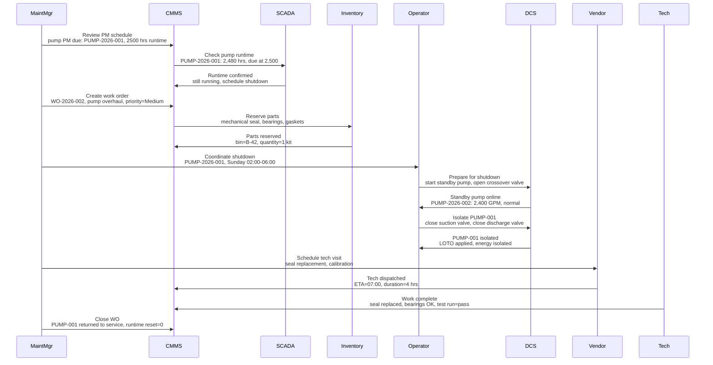
```mermaid
sequenceDiagram
MaintMgr->>CMMS: Review PM schedule<br/>pump PM due: PUMP-2026-001, 2500 hrs runtime
CMMS->>SCADA: Check pump runtime<br/>PUMP-2026-001: 2,480 hrs, due at 2,500
SCADA->>CMMS: Runtime confirmed<br/>still running, schedule shutdown
MaintMgr->>CMMS: Create work order<br/>WO-2026-002, pump overhaul, priority=Medium
CMMS->>Inventory: Reserve parts<br/>mechanical seal, bearings, gaskets
Inventory->>CMMS: Parts reserved<br/>bin=B-42, quantity=1 kit
MaintMgr->>Operator: Coordinate shutdown<br/>PUMP-2026-001, Sunday 02:00-06:00
Operator->>DCS: Prepare for shutdown<br/>start standby pump, open crossover valve
DCS->>Operator: Standby pump online<br/>PUMP-2026-002: 2,400 GPM, normal
Operator->>DCS: Isolate PUMP-001<br/>close suction valve, close discharge valve
DCS->>Operator: PUMP-001 isolated<br/>LOTO applied, energy isolated
MaintMgr->>Vendor: Schedule tech visit<br/>seal replacement, calibration
Vendor->>CMMS: Tech dispatched<br/>ETA=07:00, duration=4 hrs
Tech->>CMMS: Work complete<br/>seal replaced, bearings OK, test run=pass
MaintMgr->>CMMS: Close WO<br/>PUMP-001 returned to service, runtime reset=0
```

#### Integration Details

| Flow | Entity | Info Flow | Source | Target | Source Conn | Target Conn | Pattern | Complexity |
|------|--------|-----------|--------|--------|-------------|-------------|---------|------------|
| Maintenance | PM | CheckPMPriority | CMMS (IBM Maximo) | SCADA (EcoStruxure) | Maximo API (REST) | SCADA API (REST) | API-led (Real-time) | Simple |
| Maintenance | WO | CreateWorkOrder | CMMS (IBM Maximo) | CMMS (IBM Maximo) | Internal | Internal | API-led (Real-time) | Simple |
| Maintenance | Parts | ReserveSpareParts | CMMS (IBM Maximo) | Inventory System | Maximo API (REST) | Inventory API (SOAP) | API-led (Real-time) | Simple |
| Maintenance | Shutdown | CoordinatePumpShutdown | CMMS (IBM Maximo) | DCS (Rockwell PlantPAx) | Maximo API (REST) | DCS OPC-UA | Event-driven | Medium |
| Maintenance | Isolation | IsolateEquipment | Operator HMI | DCS (Rockwell PlantPAx) | HMI API | DCS OPC-UA | API-led (Real-time) | High |
| Maintenance | Vendor | DispatchTech | CMMS (IBM Maximo) | Vendor Portal | Maximo API (REST) | Vendor API (REST) | Event-driven | Medium |
| Maintenance | Close | CloseWorkOrder | Tech Mobile App | CMMS (IBM Maximo) | Mobile API (OAuth2) | Maximo API (REST) | API-led (Real-time) | Simple |

#### Acceptance Criteria

| AC ID | Description | Related Info Flow | Expected Outcome | Priority |
|-------|------------|-------------------|------------------|----------|
| AC-MT-01 | Verify PM completion rate >90% of scheduled tasks within window | CheckPMPriority | At least 90% of PMs completed within scheduled period | Medium |
| AC-MT-02 | Validate LOTO (Lock-Out/Tag-Out) compliance before equipment isolation | IsolateEquipment | Zero energy verified before maintenance begins | High |
| AC-MT-03 | Confirm spare parts availability >95% for critical equipment | ReserveSpareParts | Critical parts in stock or on order with ETA | Medium |
| AC-MT-04 | Ensure work order closure includes test run results and parts consumed | CloseWorkOrder | WO complete with test results and parts used | Medium |

---

### 5.4 Water Quality Compliance & Reporting

**Description:** Laboratory team analyzes water samples throughout the treatment process and distribution system. Compliance reports are prepared for state and federal regulators covering SDWA (Safe Drinking Water Act) requirements.

**Actors:** Lab Manager, Compliance Officer, Plant Manager, State Regulator  
**Systems:** LIMS (Lab Information System), SCADA (EcoStruxure), Compliance Reporting System, State Drinking Water Portal (SDWIS)

#### Sequence Diagram

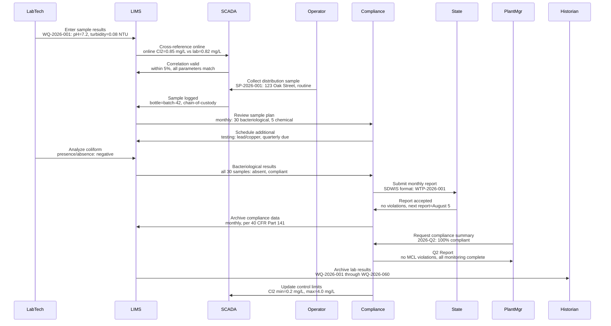
```mermaid
sequenceDiagram
LabTech->>LIMS: Enter sample results<br/>WQ-2026-001: pH=7.2, turbidity=0.08 NTU
LIMS->>SCADA: Cross-reference online<br/>online Cl2=0.85 mg/L vs lab=0.82 mg/L
SCADA->>LIMS: Correlation valid<br/>within 5%, all parameters match
Operator->>SCADA: Collect distribution sample<br/>SP-2026-001: 123 Oak Street, routine
SCADA->>LIMS: Sample logged<br/>bottle=batch-42, chain-of-custody
LIMS->>Compliance: Review sample plan<br/>monthly: 30 bacteriological, 5 chemical
Compliance->>LIMS: Schedule additional<br/>testing: lead/copper, quarterly due
LabTech->>LIMS: Analyze coliform<br/>presence/absence: negative
LIMS->>Compliance: Bacteriological results<br/>all 30 samples: absent, compliant
Compliance->>State: Submit monthly report<br/>SDWIS format: WTP-2026-001
State->>Compliance: Report accepted<br/>no violations, next report=August 5
Compliance->>LIMS: Archive compliance data<br/>monthly, per 40 CFR Part 141
PlantMgr->>Compliance: Request compliance summary<br/>2026-Q2: 100% compliant
Compliance->>PlantMgr: Q2 Report<br/>no MCL violations, all monitoring complete
LIMS->>Historian: Archive lab results<br/>WQ-2026-001 through WQ-2026-060
Compliance->>SCADA: Update control limits<br/>Cl2 min=0.2 mg/L, max=4.0 mg/L
```

#### Integration Details

| Flow | Entity | Info Flow | Source | Target | Source Conn | Target Conn | Pattern | Complexity |
|------|--------|-----------|--------|--------|-------------|-------------|---------|------------|
| Water Quality | Sample | EnterLabResults | LIMS | SCADA (EcoStruxure) | LIMS API (REST) | SCADA API (REST) | API-led (Real-time) | Simple |
| Water Quality | Correlation | CrossReferenceOnline | SCADA (EcoStruxure) | LIMS | SCADA API (REST) | LIMS API (REST) | API-led (Real-time) | Medium |
| Water Quality | Sampling | CollectDistributionSample | Operator Mobile App | SCADA (EcoStruxure) | Mobile API (OAuth2) | SCADA API (REST) | API-led (Real-time) | Simple |
| Water Quality | Bacteriological | AnalyzeColiformSample | LIMS | LIMS | Internal | Internal | API-led (Real-time) | High |
| Water Quality | Reporting | SubmitSDWISReport | Compliance System | State Drinking Water Portal (SDWIS) | Compliance API (REST) | SDWIS API (SOAP) | Batch (Scheduled) | High |
| Water Quality | Archive | ArchiveComplianceData | Compliance System | LIMS | Compliance API (REST) | LIMS API (REST) | Batch (Scheduled) | Simple |
| Water Quality | Limits | UpdateControlLimits | Compliance System | SCADA (EcoStruxure) | Compliance API (REST) | SCADA API (REST) | Event-driven | Simple |

#### Acceptance Criteria

| AC ID | Description | Related Info Flow | Expected Outcome | Priority |
|-------|------------|-------------------|------------------|----------|
| AC-WQ-01 | Validate lab results within ±5% of online analyzer values for critical parameters | CrossReferenceOnline | Lab vs online correlation within 5% for all parameters | High |
| AC-WQ-02 | Verify monthly bacteriological sample count meets regulatory minimum (30/month) | AnalyzeColiformSample | At least 30 bacteriological samples collected and analyzed monthly | High |
| AC-WQ-03 | Confirm SDWIS report submission before regulatory deadline (10th of month) | SubmitSDWISReport | State acknowledges receipt before monthly deadline | High |
| AC-WQ-04 | Ensure all MCL violations are reported to state within 24 hours | SubmitSDWISReport | No unreported MCL violations | High |

---

# Water Distribution Network Management - `UT-WDM` `UT-WQM`

Management of the potable water distribution system including pressure zone management, reservoir tank level control, leak detection, flow monitoring, and hydrant/valve operations for the water utility network.

### 6.1 Pressure Zone Management & SCADA

**Description:** Operators monitor and control pressure zones across the distribution network. Pressure reducing valves (PRVs), booster pumps, and altitude valves are managed to maintain optimal pressure ranges throughout the system.

**Actors:** Distribution Operator, Field Technician, Hydraulic Engineer  
**Systems:** SCADA (Schneider EcoStruxure), Pressure Monitoring System, PRV Controllers, Pump Station PLCs, Hydraulic Model

#### Sequence Diagram

```mermaid
sequenceDiagram
Operator->>SCADA: Check pressure zones<br/>Zone 3: 65 psi, Zone 4: 52 psi, Zone 5: 78 psi
SCADA->>PRV_Zone3: Read downstream pressure<br/>PRV-2026-001: 65 psi, setpoint=60 psi
PRV_Zone3->>SCADA: PRV status<br/>open=42%, flow=1.2 MGD, valve=normal
Operator->>SCADA: Zone 4 low pressure<br/>52 psi, min=55 psi threshold
SCADA->>PumpStation: Start booster<br/>PS-OAK: PUMP-2026-002, 2,500 GPM
PumpStation->>SCADA: Booster online<br/>PUMP-002: 2,450 GPM, discharge=72 psi
SCADA->>Operator: Zone 4 pressure rising<br/>54 psi, 56 psi, 58 psi... stabilizing at 62 psi
Operator->>SCADA: Zone 5 high pressure<br/>78 psi, max=80 psi, advisory
SCADA->>PRV_Zone5: Reduce setpoint<br/>PRV-2026-002: 78→72 psi
PRV_Zone5->>SCADA: Adjusting<br/>open=38→32%, downstream=74 psi
SCADA->>Operator: All zones stable<br/>Zone 3: 62 psi, Zone 4: 62 psi, Zone 5: 72 psi
Operator->>Hydraulic: Run pressure model<br/>Zone 4: expected=60 psi, actual=62 psi (±3%)
Hydraulic->>Operator: Model validated<br/>correlates with SCADA, no anomalies
Operator->>SCADA: Log pressure event<br/>Zone 4 low pressure, duration=18 min, cause=valve closed
SCADA->>Historian: Archive trend<br/>24-hr pressure: Zone 3,4,5, daily report
FieldTech->>SCADA: Field check complete<br/>PRV-2026-001: mechanical OK, no leaks
```

#### Integration Details

| Flow | Entity | Info Flow | Source | Target | Source Conn | Target Conn | Pattern | Complexity |
|------|--------|-----------|--------|--------|-------------|-------------|---------|------------|
| Pressure | PRV | MonitorPRVDownstream | SCADA (EcoStruxure) | PRV Controller (Zone 3) | SCADA Modbus RTU | PRV Modbus RTU | API-led (Real-time) | Medium |
| Pressure | Booster | StartBoosterPump | SCADA (EcoStruxure) | Pump Station PLC | SCADA Modbus TCP | PLC Modbus RTU | API-led (Real-time) | Medium |
| Pressure | Monitoring | MonitorZonePressure | SCADA (EcoStruxure) | Operator HMI | SCADA API (REST) | HMI Display | API-led (Real-time) | Simple |
| Pressure | PRV | AdjustPRVSetpoint | SCADA (EcoStruxure) | PRV Controller (Zone 5) | SCADA Modbus RTU | PRV Modbus RTU | API-led (Real-time) | Medium |
| Pressure | Model | ValidateHydraulicModel | Hydraulic Model Software | SCADA (EcoStruxure) | Model API (REST) | SCADA API (REST) | Batch (Real-time) | Medium |
| Pressure | Log | LogPressureEvent | SCADA (EcoStruxure) | Plant Historian (OSIsoft PI) | SCADA API (REST) | PI API (REST) | Event-driven | Simple |
| Pressure | Field | ConfirmFieldCheck | Field Tech Mobile App | SCADA (EcoStruxure) | Mobile API (OAuth2) | SCADA API (REST) | API-led (Real-time) | Simple |

#### Acceptance Criteria

| AC ID | Description | Related Info Flow | Expected Outcome | Priority |
|-------|------------|-------------------|------------------|----------|
| AC-PZ-01 | Verify all pressure zones maintain pressure between 40-80 psi at critical nodes | MonitorZonePressure | All critical nodes within 40-80 psi range 99.5% of time | High |
| AC-PZ-02 | Validate pressure recovery time under 30 minutes after low-pressure event | StartBoosterPump | Pressure returns to >55 psi within 30 min | Medium |
| AC-PZ-03 | Confirm hydraulic model accuracy within ±5% of actual SCADA readings | ValidateHydraulicModel | Model vs actual pressure difference <5% | Medium |
| AC-PZ-04 | Ensure PRV setpoint changes are logged with operator ID and reason | AdjustPRVSetpoint | Complete audit trail for every PRV adjustment | Medium |

---

### 6.2 Leak Detection & Flow Monitoring

**Description:** The utility monitors distribution system flows to detect leaks, manage non-revenue water (NRW), and optimize system operations. District Metered Areas (DMAs) are analyzed for minimum night flow to identify potential leaks.

**Actors:** Water Loss Engineer, Distribution Operator, Field Technician  
**Systems:** SCADA (EcoStruxure), DMA Flow Analyzer, Acoustic Leak Detection, GIS (ArcGIS), Hydraulic Model

#### Sequence Diagram

```mermaid
sequenceDiagram
Operator->>SCADA: Review DMA flows<br/>DMA-3: inflow=1.2 MGD, night flow=0.35 MGD
SCADA->>DMA: Analyze minimum night flow<br/>02:00-04:00: 0.35 MGD, baseline=0.20 MGD
DMA->>Operator: Alert: possible leak<br/>MNF=0.35, baseline=0.20, delta=0.15 MGD
Operator->>GIS: Identify DMA-3 pipes<br/>zone=3, pipe=PIPE-2026-001, ductile iron 24"
GIS->>Operator: Pipe details<br/>installed=1985, length=3,200 ft, material=Ductile Iron
Operator->>Acoustic: Deploy leak sensors<br/>DMA-3, 8 sensors, night survey
Acoustic->>FieldTech: Correlate signals<br/>leak candidate: 2,200 ft from valve V-42
FieldTech->>Acoustic: Confirm leak<br/>PIPE-2026-001, leak rate=25 GPM
FieldTech->>SCADA: Log leak found<br/>PIPE-2026-001, 25 GPM, priority=Medium
Operator->>DMA: Isolate leak zone<br/>close valve V-42 and V-43
DMA->>SCADA: Isolation confirmed<br/>DMA-3 inflow dropped to 0.85 MGD
Operator->>Work: Create repair WO<br/>WO-2026-003, pipe repair, crew dispatched
FieldTech->>SCADA: Repair complete<br/>clamp installed, test pressure=80 psi
SCADA->>DMA: Verify night flow<br/>post-repair MNF=0.22 MGD (baseline=0.20)
DMA->>Operator: Leak resolved<br/>NRW reduction: 25 GPM, 13 MG/year saved
```

#### Integration Details

| Flow | Entity | Info Flow | Source | Target | Source Conn | Target Conn | Pattern | Complexity |
|------|--------|-----------|--------|--------|-------------|-------------|---------|------------|
| Leak | DMA | AnalyzeMinimumNightFlow | SCADA (EcoStruxure) | DMA Flow Analyzer | SCADA API (REST) | DMA API (REST) | Batch (Scheduled) | High |
| Leak | Alert | FlagLeakCandidate | DMA Flow Analyzer | Operator Console | DMA API (REST) | SCADA HMI | Event-driven | High |
| Leak | GIS | IdentifyPipeAsset | GIS (ArcGIS) | Operator Console | GIS API (REST) | SCADA HMI | API-led (Real-time) | Simple |
| Leak | Acoustic | DeployLeakSensors | Acoustic Leak Detection System | Field Tech Mobile App | Acoustic API (REST) | Mobile API (OAuth2) | API-led (Real-time) | Medium |
| Leak | Isolation | IsolateLeakZone | SCADA (EcoStruxure) | Valve Controllers | SCADA Modbus RTU | Valve PLC Modbus | API-led (Real-time) | Medium |
| Leak | Repair | CreateRepairWorkOrder | Operator Console | CMMS (IBM Maximo) | SCADA API (REST) | Maximo API (REST) | Event-driven | Simple |
| Leak | NRW | CalculateNRWReduction | DMA Flow Analyzer | Water Loss System | DMA API (REST) | Water Loss API | Batch (Scheduled) | Simple |

#### Acceptance Criteria

| AC ID | Description | Related Info Flow | Expected Outcome | Priority |
|-------|------------|-------------------|------------------|----------|
| AC-LK-01 | Detect leaks >10 GPM within 48 hours of occurrence | AnalyzeMinimumNightFlow | DMA alerts for leak candidates within 48 hrs | High |
| AC-LK-02 | Validate minimum night flow is <25% of average daily flow for each DMA | FlagLeakCandidate | MNF/Average Daily Flow ratio <0.25 | Medium |
| AC-LK-03 | Confirm leak location accuracy within 10 ft of actual pipe | DeployLeakSensors | Correlation pinpoints leak within 10 ft | Medium |
| AC-LK-04 | Ensure NRW is below 15% of system input volume | CalculateNRWReduction | Annual NRW below 15% of total production | High |

---

### 6.3 Reservoir & Tank Level Control

**Description:** Operators manage elevated storage tanks and ground reservoirs to maintain water levels, ensure fire flow capacity, and optimize pumping schedules for energy efficiency.

**Actors:** Distribution Operator, Energy Manager, Pump Station Technician  
**Systems:** SCADA (EcoStruxure), Tank Level Sensors, Pump Station PLCs, Energy Management System (EMS), Hydraulic Model

#### Sequence Diagram

```mermaid
sequenceDiagram
Operator->>SCADA: Check tank levels<br/>Tank-1: 42 ft (72%), Tank-2: 28 ft (55%)
SCADA->>TankSensor: Read levels<br/>elevated tank: 42 ft, ground tank: 28 ft
TankSensor->>SCADA: Levels confirmed<br/>Tank-1=42.3 ft, Tank-2=28.1 ft
Operator->>SCADA: Night fill schedule<br/>fill Tank-1: 23:00-05:00, fill target=85%
SCADA->>PumpPLC: Start fill pump<br/>PS-MAIN: 2 pumps @ 3,000 GPM each
PumpPLC->>SCADA: Pumps running<br/>2 pumps: 5,800 GPM, discharge=80 psi
SCADA->>Operator: Filling progress<br/>Tank-1: 42 ft → 47 ft → 52 ft
EnergyMgr->>EMS: Check energy rates<br/>on-peak=$0.12/kWh, off-peak=$0.06/kWh
EMS->>Operator: Off-peak window<br/>23:00-05:00: fill to 90%, save $240/night
Operator->>SCADA: Extend fill target<br/>fill to 90% by 05:00, optimize pump combo
SCADA->>PumpPLC: Adjust pump combo<br/>2 pumps @ 3,000 GPM → 1 pump @ 4,200 GPM (VFD)
PumpPLC->>SCADA: VFD speed=58 Hz<br/>4,100 GPM, 65 kW vs 2 pumps=110 kW
SCADA->>Operator: Level rising per plan<br/>Tank-1: 85% at 03:00, on track for 90%
Operator->>SCADA: Morning draw begins<br/>06:00: Tank-1=87%, demand=6.5 MGD
SCADA->>Operator: Tank cycle complete<br/>Tank-1: max=90% (05:00), min=40% (18:00)
```

#### Integration Details

| Flow | Entity | Info Flow | Source | Target | Source Conn | Target Conn | Pattern | Complexity |
|------|--------|-----------|--------|--------|-------------|-------------|---------|------------|
| Tank | Level | ReadTankLevel | Tank Level Sensor | SCADA (EcoStruxure) | Sensor 4-20mA | SCADA Modbus RTU | API-led (Real-time) | Simple |
| Tank | Fill | StartNightFillPump | SCADA (EcoStruxure) | Pump Station PLC | SCADA Modbus TCP | PLC Modbus RTU | API-led (Real-time) | Medium |
| Tank | Energy | CheckOffPeakRates | Energy Management System | SCADA (EcoStruxure) | EMS API (REST) | SCADA API (REST) | API-led (Real-time) | Simple |
| Tank | Optimization | AdjustPumpCombo | SCADA (EcoStruxure) | Pump VFD | SCADA Modbus TCP | VFD Modbus RTU | API-led (Real-time) | Medium |
| Tank | Schedule | MonitorFillProgress | SCADA (EcoStruxure) | Operator HMI | SCADA API (REST) | HMI Display | API-led (Real-time) | Simple |
| Tank | Draw | MonitorMorningDraw | SCADA (EcoStruxure) | Plant Historian (OSIsoft PI) | SCADA API (REST) | PI API (REST) | API-led (Real-time) | Simple |
| Tank | Optimization | CalculateEnergySavings | Energy Management System | Plant Historian (OSIsoft PI) | EMS API (REST) | PI API (REST) | Batch (Scheduled) | Simple |

#### Acceptance Criteria

| AC ID | Description | Related Info Flow | Expected Outcome | Priority |
|-------|------------|-------------------|------------------|----------|
| AC-TK-01 | Verify tank levels return to target fill level by end of off-peak window (05:00) | StartNightFillPump | Tank reaches ≥90% by 05:00 | Medium |
| AC-TK-02 | Validate minimum storage capacity for fire flow (per NFPA 22) | ReadTankLevel | Tank never drops below fire storage reserve level | High |
| AC-TK-03 | Confirm energy cost savings ≥15% vs day-fill schedule | CalculateEnergySavings | Night-fill reduces pumping energy cost by ≥15% | Medium |
| AC-TK-04 | Ensure pump cycling frequency stays below 6 starts/hour | AdjustPumpCombo | Pump starts ≤6 per hour to prevent motor damage | Medium |

---

### 6.4 Hydrant & Valve Operations

**Description:** Field crews perform hydrant flushing and flow testing, valve exercising, and main breaks response. GIS tracks asset location and condition. SCADA monitors system impacts during operations.

**Actors:** Field Crew Lead, Distribution Operator, Hydrant Tester  
**Systems:** GIS (ArcGIS), Mobile Field App, SCADA (EcoStruxure), CMMS (IBM Maximo), Hydrant Management System

#### Sequence Diagram

```mermaid
sequenceDiagram
FieldCrew->>Mobile: Check valve exercise schedule<br/>VALV-2026-001 through 010, quarterly exercise
Mobile->>GIS: Navigate to valve<br/>VALV-2026-003: 123 Oak St, butterfly 16"
FieldCrew->>Mobile: Exercise valve<br/>turn counterclockwise 5 turns, torque=30 ft-lbs
Mobile->>CMMS: Log valve exercise<br/>VALV-2026-003: op=Normal, turns=5, torque=30
FieldCrew->>Mobile: Hydrant flow test<br/>HYD-2026-001: static=62 psi, residual=48 psi, flow=950 GPM
Mobile->>SCADA: Alert system<br/>hydrant flow test, zone=3, duration=10 min
SCADA->>Operator: Flow test in progress<br/>Zone 3: drop 62→58 psi, expected, ignore alarm
Mobile->>HydrantSys: Log flow test results<br/>HYD-2026-001: A=62, B=48, C=950 GPM
HydrantSys->>Operator: Update C-factor<br/>pipe PIPE-2026-001: C=110, condition=Good
Operator->>GIS: Update hydrant data<br/>HYD-2026-001: last test=2026-07-07, flow=950 GPM
FieldCrew->>Mobile: Main break report<br/>PIPE-2026-002: 16" ductile iron, leak visible
Mobile->>SCADA: Emergency alert<br/>main break, Zone 4, isolate valves V-44 and V-45
SCADA->>Operator: Main break isolation<br/>valves V-44 and V-45 closed, 50 customers affected
Operator->>FieldCrew: Isolation confirmed<br/>proceed with repair, water outage notice sent
FieldCrew->>CMMS: Create emergency WO<br/>WO-2026-004, pipe repair, damage assessed
```

#### Integration Details

| Flow | Entity | Info Flow | Source | Target | Source Conn | Target Conn | Pattern | Complexity |
|------|--------|-----------|--------|--------|-------------|-------------|---------|------------|
| Hydrant | Valve | ExerciseValve | Field Crew Mobile App | GIS (ArcGIS) | Mobile API (OAuth2) | GIS API (REST) | API-led (Real-time) | Simple |
| Hydrant | Exercise | LogValveExercise | Field Crew Mobile App | CMMS (IBM Maximo) | Mobile API (OAuth2) | Maximo API (REST) | API-led (Real-time) | Simple |
| Hydrant | FlowTest | RecordHydrantFlowTest | Field Crew Mobile App | SCADA (EcoStruxure) | Mobile API (OAuth2) | SCADA API (REST) | API-led (Real-time) | Medium |
| Hydrant | CFactor | UpdatePipeCFactor | Hydrant Management System | GIS (ArcGIS) | Hydrant API (REST) | GIS API (REST) | API-led (Real-time) | Simple |
| Hydrant | MainBreak | AlertMainBreak | Field Crew Mobile App | SCADA (EcoStruxure) | Mobile API (OAuth2) | SCADA API (REST) | Event-driven | High |
| Hydrant | Isolation | IsolateMainBreak | SCADA (EcoStruxure) | Valve Controllers | SCADA Modbus RTU | Valve PLC Modbus | API-led (Real-time) | High |
| Hydrant | WO | CreateEmergencyWorkOrder | Field Crew Mobile App | CMMS (IBM Maximo) | Mobile API (OAuth2) | Maximo API (REST) | Event-driven | Simple |

#### Acceptance Criteria

| AC ID | Description | Related Info Flow | Expected Outcome | Priority |
|-------|------------|-------------------|------------------|----------|
| AC-HV-01 | Complete valve exercising within annual schedule (all valves every 12 months) | ExerciseValve | 100% of valves exercised within 12-month cycle | Medium |
| AC-HV-02 | Verify hydrant flow test data accuracy within ±5% (flow) and ±2 psi (pressure) | RecordHydrantFlowTest | Calibrated pitot gauge and pressure gauge used | Medium |
| AC-HV-03 | Confirm main break isolation time under 45 minutes from notification | AlertMainBreak | Valves closed within 45 min of break notification | High |
| AC-HV-04 | Ensure affected customers notified within 30 minutes of isolation | IsolateMainBreak | Customer notification sent ≤30 min after isolation | High |

---

# Wastewater Collection & Treatment - `UT-WWC` `UT-WQM`

Management of wastewater collection system (lift stations, force mains, gravity sewers) and wastewater treatment processes (primary, secondary, tertiary treatment, and biosolids management) with regulatory effluent compliance.

### 7.1 Collection System SCADA (Lift Stations)

**Description:** Operators monitor and control wastewater lift stations across the collection network. SCADA system tracks wet well levels, pump status, flow rates, and alarms for overflow prevention.

**Actors:** Collection System Operator, Field Technician, Maintenance Supervisor  
**Systems:** SCADA (Schneider EcoStruxure), Lift Station PLCs, Level Sensors, Flow Meters, CMMS (IBM Maximo)

#### Sequence Diagram

```mermaid
sequenceDiagram
Operator->>SCADA: View collection system<br/>20 lift stations online, 3 standby
SCADA->>LS_01: Read wet well level<br/>LS-2026-001: 8.2 ft, high level=10 ft
LS_01->>SCADA: Level rising<br/>inflow=600 GPM, pump 1 running
SCADA->>Operator: LS-001 status<br/>pump 1: 580 GPM, pump 2: standby, level=8.5 ft
Operator->>SCADA: Start pump 2<br/>LS-001: add pump, level rising above 9 ft
SCADA->>LS_01: Start pump 2<br/>lead/lag: pump 2 start, sequence B
LS_01->>SCADA: Pump 2 online<br/>1,150 GPM total, level=8.7 ft and dropping
Operator->>SCADA: Check LS-007 alarm<br/>high level alarm, LS-2026-007, level=9.8 ft
SCADA->>LS_07: Read status<br/>pump 1 failed, pump 2 running solo
Operator->>SCADA: LS-007 emergency<br/>level=9.8 ft, approaching overflow (10 ft)
Operator->>SCADA: Dispatch crew<br/>CREW-2026-001, LS-007, pump failure
Crew->>LS_07: Onsite assessment<br/>pump 1: thermal overload tripped, reset
LS_07->>SCADA: Pump 1 restored<br/>2 pumps running: 800 GPM total
SCADA->>Operator: LS-007 stable<br/>level dropping: 9.5→9.0→8.2 ft
Operator->>CMMS: Create PM work order<br/>LS-007 pump 1: investigate overload cause
SCADA->>Historian: Log event<br/>LS-007 high level, duration=22 min, cause=pump trip
```

#### Integration Details

| Flow | Entity | Info Flow | Source | Target | Source Conn | Target Conn | Pattern | Complexity |
|------|--------|-----------|--------|--------|-------------|-------------|---------|------------|
| LiftStation | Level | ReadWetWellLevel | Level Sensor (LS-001) | Lift Station PLC (LS-001) | Sensor 4-20mA | PLC Analog Input | API-led (Real-time) | Simple |
| LiftStation | Pump | StartLiftStationPump | SCADA (EcoStruxure) | Lift Station PLC (LS-001) | SCADA Modbus TCP | PLC Modbus RTU | API-led (Real-time) | Medium |
| LiftStation | Alarm | MonitorHighLevelAlarm | Lift Station PLC (LS-007) | SCADA (EcoStruxure) | PLC Modbus RTU | SCADA Modbus TCP | Event-driven | High |
| LiftStation | Dispatch | DispatchCrew | SCADA (EcoStruxure) | CMMS (IBM Maximo) | SCADA API (REST) | Maximo API (REST) | Event-driven | Medium |
| LiftStation | Field | OnsiteAssessment | Field Tech Mobile App | CMMS (IBM Maximo) | Mobile API (OAuth2) | Maximo API (REST) | API-led (Real-time) | Simple |
| LiftStation | PM | CreatePmWorkOrder | SCADA (EcoStruxure) | CMMS (IBM Maximo) | SCADA API (REST) | Maximo API (REST) | Event-driven | Simple |
| LiftStation | Log | LogAlarmEvent | SCADA (EcoStruxure) | Plant Historian (OSIsoft PI) | SCADA API (REST) | PI API (REST) | Event-driven | Simple |

#### Acceptance Criteria

| AC ID | Description | Related Info Flow | Expected Outcome | Priority |
|-------|------------|-------------------|------------------|----------|
| AC-LS-01 | Verify all lift stations maintain wet well level below 90% of high-level setpoint | ReadWetWellLevel | No lift station exceeds high-level alarm threshold | High |
| AC-LS-02 | Validate pump run-time alternation to ensure equal wear across duty/standby pumps | StartLiftStationPump | Lead/lag alternation schedule maintained | Medium |
| AC-LS-03 | Confirm overflow prevention: no sanitary sewer overflows (SSOs) from lift stations | MonitorHighLevelAlarm | Zero SSO events from monitored lift stations | High |
| AC-LS-04 | Ensure crew dispatch and arrival on site within 60 minutes for high-priority alarms | DispatchCrew | Crew on-site within 60 min of alarm | Medium |

---

### 7.2 Wastewater Treatment Process Control

**Description:** Operators manage the wastewater treatment process including primary clarification, biological treatment (activated sludge), secondary clarification, and disinfection (UV/chlorine). Process control parameters are continuously monitored and adjusted.

**Actors:** WWTP Operator, Process Engineer, Lab Technician  
**Systems:** DCS (Rockwell PlantPAx), SCADA (EcoStruxure), Biological Process Analyzer, UV Disinfection System, Aeration Control System

#### Sequence Diagram

```mermaid
sequenceDiagram
Operator->>DCS: Review plant influent<br/>flow=18 MGD, BOD=220 mg/L, TSS=250 mg/L
DCS->>SCADA: Primary clarifier status<br/>clarifier 1: sludge blanket=2.5 ft, effluent TSS=120
SCADA->>Operator: Primary effluent<br/>BOD=140 mg/L, TSS=120 mg/L, removal=45%
Operator->>DCS: Adjust aeration basin DO<br/>DO setpoint=2.0 mg/L, zone 1-4
DCS->>Aeration: Increase blower speed<br/>blower 2: VFD 45 Hz → 52 Hz
Aeration->>DCS: Air flow increased<br/>8,500 SCFM, DO zone 1: 1.8→2.1 mg/L
DCS->>Operator: DO stabilized<br/>zones 1-4: avg=2.1 mg/L, ±0.2 mg/L
Operator->>DCS: Check MLSS<br/>MLSS=3,200 mg/L, F/M ratio=0.25
DCS->>BioAnalyzer: Measure SVI<br/>sludge volume index
BioAnalyzer->>DCS: SVI=120 mL/g<br/>settleability=good, no bulking
Operator->>DCS: Adjust waste rate<br/>WAS flow=0.35 MGD, maintain SRT=8 days
DCS->>Valve: Set WAS valve<br/>WAS-001: 35% open, 0.35 MGD
Operator->>SCADA: Review secondary effluent<br/>TSS=15 mg/L, BOD=10 mg/L, NH3=1.2 mg/L
SCADA->>UvSystem: Set UV dose<br/>30 mJ/cm², flow-paced, transmittance=68%
UvSystem->>SCADA: UV dose confirmed<br/>29.8 mJ/cm², 2 banks online
Operator->>Effluent: Final effluent quality<br/>CBOD=5 mg/L, TSS=8 mg/L, NH3=0.5 mg/L, E.coli=10 CFU
```

#### Integration Details

| Flow | Entity | Info Flow | Source | Target | Source Conn | Target Conn | Pattern | Complexity |
|------|--------|-----------|--------|--------|-------------|-------------|---------|------------|
| Treatment | Influent | MonitorPlantInfluent | SCADA (EcoStruxure) | DCS (Rockwell PlantPAx) | SCADA OPC-DA | DCS OPC-UA | API-led (Real-time) | Medium |
| Treatment | DO | AdjustAerationDO | DCS (Rockwell PlantPAx) | Aeration Control System | DCS OPC-UA | Blower PLC Modbus | API-led (Real-time) | High |
| Treatment | SVI | MeasureSludgeSettleability | Biological Process Analyzer | DCS (Rockwell PlantPAx) | Analyzer Modbus RTU | DCS OPC-UA | API-led (Real-time) | Medium |
| Treatment | WAS | AdjustWasteActivatedSludge | DCS (Rockwell PlantPAx) | WAS Valve Actuator | DCS OPC-UA | Valve Modbus RTU | API-led (Real-time) | Medium |
| Treatment | UV | SetUvDose | SCADA (EcoStruxure) | UV Disinfection System | SCADA Modbus TCP | UV System Modbus | API-led (Real-time) | Medium |
| Treatment | Effluent | MonitorFinalEffluent | SCADA (EcoStruxure) | Effluent Analyzers | SCADA Modbus TCP | Analyzer 4-20mA | API-led (Real-time) | High |
| Treatment | Compliance | LogEffluentQuality | DCS (Rockwell PlantPAx) | Plant Historian (OSIsoft PI) | DCS OPC-UA | PI API (REST) | Batch (Scheduled) | Simple |

#### Acceptance Criteria

| AC ID | Description | Related Info Flow | Expected Outcome | Priority |
|-------|------------|-------------------|------------------|----------|
| AC-WW-01 | Verify effluent BOD and TSS consistently below permit limits (30 mg/L each) | MonitorFinalEffluent | Daily average BOD <20 mg/L and TSS <20 mg/L | High |
| AC-WW-02 | Validate DO control maintains setpoint within ±0.3 mg/L across all aeration zones | AdjustAerationDO | DO within ±0.3 mg/L of setpoint 95% of time | High |
| AC-WW-03 | Confirm UV dose ≥30 mJ/cm² at peak flow for pathogen inactivation | SetUvDose | UV dose meets or exceeds 30 mJ/cm² at all flow conditions | High |
| AC-WW-04 | Ensure SRT maintained within ±1 day of target for biological process stability | AdjustWasteActivatedSludge | SRT between 7-9 days for target of 8 days | Medium |

---

### 7.3 Effluent Quality Compliance

**Description:** Continuous monitoring of effluent quality parameters with real-time reporting to regulatory agencies. NPDES permit compliance is managed with automated sampling, data validation, and discharge reporting.

**Actors:** WWTP Operator, Compliance Manager, Lab Manager, State Regulator  
**Systems:** SCADA (EcoStruxure), LIMS, Compliance Reporting System, EPA ICIS-NPDES Portal, Online Analyzers

#### Sequence Diagram

```mermaid
sequenceDiagram
Analyzer->>SCADA: Effluent reading<br/>CBOD=5 mg/L, TSS=8 mg/L, NH3=0.5 mg/L, pH=7.1
SCADA->>Operator: Permit compliance check<br/>all parameters below NPDES limits
Operator->>SCADA: Collect 24-hr composite<br/>auto-sampler bottle change, 4°C
SCADA->>LIMS: Send composite to lab<br/>WQ-2026-042, 24-hr, flow-proportional
LIMS->>SCADA: Lab results received<br/>CBOD=4.8, TSS=7.5, NH3=0.45
SCADA->>Compliance: Validate results<br/>all within permit limits, DMR ready
Compliance->>EPA: Submit monthly DMR<br/>NPDES Permit #IL0023456, June 2026
EPA->>Compliance: DMR accepted<br/>no violations, no enforcement action
Operator->>SCADA: Check for bypass event<br/>none reported, wet weather flow=22 MGD
SCADA->>Operator: Peak flow handling<br/>equalization basin in use, 4 MG stored
Compliance->>SCADA: Update permit limits<br/>new limits effective August 1: NH3=1.0 mg/L
SCADA->>Operator: New limits logged<br/>adjust alarm setpoints: NH3=0.8 mg/L (warning)
Operator->>SCADA: Review annual report<br/>100% compliance, 12 DMRs submitted
SCADA->>Historian: Archive NPDES data<br/>12 months rolling, per permit requirement
Compliance->>State: Submit annual report<br/>2026: 100% compliant, 0 violations
```

#### Integration Details

| Flow | Entity | Info Flow | Source | Target | Source Conn | Target Conn | Pattern | Complexity |
|------|--------|-----------|--------|--------|-------------|-------------|---------|------------|
| Effluent | Analyzer | ReadEffluentParameters | Online Analyzers | SCADA (EcoStruxure) | Analyzer Modbus RTU | SCADA Modbus TCP | API-led (Real-time) | Medium |
| Effluent | Composite | CollectCompositeSample | Auto-Sampler | SCADA (EcoStruxure) | Sampler Modbus | SCADA Modbus TCP | Batch (Scheduled) | Simple |
| Effluent | Lab | AnalyzeLabComposite | LIMS | SCADA (EcoStruxure) | LIMS API (REST) | SCADA API (REST) | API-led (Real-time) | Simple |
| Effluent | DMR | SubmitMonthlyDMR | Compliance System | EPA ICIS-NPDES Portal | Compliance API (REST) | EPA CDX (SOAP) | Batch (Scheduled) | High |
| Effluent | Bypass | MonitorWetWeatherFlow | SCADA (EcoStruxure) | Equalization Basin System | SCADA Modbus TCP | EQ Basin PLC Modbus | API-led (Real-time) | Medium |
| Effluent | Permit | UpdatePermitLimits | Compliance System | SCADA (EcoStruxure) | Compliance API (REST) | SCADA API (REST) | Event-driven | Medium |
| Effluent | Archive | ArchiveNpdesData | SCADA (EcoStruxure) | Plant Historian (OSIsoft PI) | SCADA API (REST) | PI API (REST) | Batch (Scheduled) | Simple |

#### Acceptance Criteria

| AC ID | Description | Related Info Flow | Expected Outcome | Priority |
|-------|------------|-------------------|------------------|----------|
| AC-EF-01 | Validate DMR submission before regulatory deadline (10th of month) | SubmitMonthlyDMR | DMR submitted and acknowledged by EPA before deadline | High |
| AC-EF-02 | Verify online analyzer calibration within ±10% of lab results for critical parameters | AnalyzeLabComposite | Lab vs online correlation within 10% | Medium |
| AC-EF-03 | Confirm no un-reported bypass events or NPDES excursions | MonitorWetWeatherFlow | All bypass events logged and reported per permit | High |
| AC-EF-04 | Ensure data retention of NPDES records meets minimum 3-year regulatory requirement | ArchiveNpdesData | All NPDES data archived for ≥3 years | Medium |

---

### 7.4 Biosolids Management

**Description:** Operators manage the biosolids treatment process including thickening, anaerobic digestion, dewatering (centrifuge/belt press), and beneficial reuse or disposal. Gas production from digesters is monitored for energy recovery.

**Actors:** WWTP Operator, Biosolids Coordinator, Hauler, Land Application Manager  
**Systems:** DCS (Rockwell PlantPAx), SCADA (EcoStruxure), Digester Control System, Centrifuge PLC, Biosolids Tracking System, Weigh Scale

#### Sequence Diagram

```mermaid
sequenceDiagram
Operator->>DCS: Review WAS inventory<br/>WAS flow=0.35 MGD, TSS=8,000 mg/L
DCS->>Thickener: Start gravity belt<br/>feed=200 GPM, polymer=8 GPH
Thickener->>DCS: Thickened sludge<br/>5% solids, 80 GPM, capture=95%
Operator->>DCS: Feed digester 1<br/>sludge vol=80,000 gal/day, temp=98°F
DCS->>Digester: Start feed pump<br/>40 GPM, mesophilic digester 1
Digester->>DCS: Gas production<br/>biogas=85,000 CF/day, CH4=62%
Operator->>DCS: Check digester temp<br/>98°F, target=98°F, within ±1°F
DCS->>Operator: Digester stable<br/>pH=7.1, VFA/ALK=0.08, gas=85,000 CF
Operator->>DCS: Feed centrifuge<br/>digested sludge: 4% solids, 60 GPM
DCS->>Centrifuge: Start centrifuge<br/>bowl speed=2,500 RPM, polymer=12 GPH
Centrifuge->>DCS: Cake solids<br/>22% solids, 15 wet tons/hr
Operator->>BiosolidsSys: Record loadout<br/>semi-trailer #42, 22.5 wet tons, Class B
BiosolidsSys->>WeighScale: Net weight<br/>22.5 tons, transport to farm #12
Operator->>SCADA: Log biosolids data<br/>monthly: 450 wet tons, 22% solids
SCADA->>Compliance: Biosolids report<br/>503 compliance: metals below limits
Operator->>Digester: Adjust feed rate<br/>reduce to 35 GPM, stabilize VFA/ALK
```

#### Integration Details

| Flow | Entity | Info Flow | Source | Target | Source Conn | Target Conn | Pattern | Complexity |
|------|--------|-----------|--------|--------|-------------|-------------|---------|------------|
| Biosolids | Thickening | StartGravityBeltThickener | DCS (Rockwell PlantPAx) | Sludge Thickener PLC | DCS OPC-UA | Thickener PLC Modbus | API-led (Real-time) | Medium |
| Biosolids | Digester | FeedAnaerobicDigester | DCS (Rockwell PlantPAx) | Digester Control System | DCS OPC-UA | Digester PLC Modbus | API-led (Real-time) | High |
| Biosolids | Gas | MonitorBiogasProduction | Digester Control System | SCADA (EcoStruxure) | Digester Modbus | SCADA Modbus TCP | API-led (Real-time) | Medium |
| Biosolids | Dewatering | StartCentrifuge | DCS (Rockwell PlantPAx) | Centrifuge PLC | DCS OPC-UA | Centrifuge Modbus RTU | API-led (Real-time) | Medium |
| Biosolids | Loadout | RecordBiosolidsLoadout | Biosolids Tracking System | Weigh Scale System | Biosolids API (REST) | Scale API (Serial) | API-led (Real-time) | Simple |
| Biosolids | Compliance | ReportBiosolids503 | SCADA (EcoStruxure) | Compliance System | SCADA API (REST) | Compliance API (REST) | Batch (Scheduled) | High |
| Biosolids | Optimization | AdjustDigesterFeedRate | DCS (Rockwell PlantPAx) | Digester Control System | DCS OPC-UA | Digester PLC Modbus | API-led (Real-time) | Medium |

#### Acceptance Criteria

| AC ID | Description | Related Info Flow | Expected Outcome | Priority |
|-------|------------|-------------------|------------------|----------|
| AC-BS-01 | Verify digester temperature maintained at 98°F ±1°F for mesophilic operation | FeedAnaerobicDigester | Digester temp within 97-99°F range 99% of time | High |
| AC-BS-02 | Validate biosolids pathogen reduction meets Class B requirements (Part 503) | ReportBiosolids503 | Fecal coliform <2M MPN/g dry solids | High |
| AC-BS-03 | Confirm centrifuge cake solids ≥20% for economical hauling | StartCentrifuge | Cake solids ≥20% averaged monthly | Medium |
| AC-BS-04 | Ensure trace metals in biosolids below 503 Table 3 ceiling concentrations | ReportBiosolids503 | All metals below regulatory limits | High |

---

# Metering & Smart Grid - `UT-AMI` `UT-MDM` `UT-SGO` `UT-GBD`

Management of the advanced metering infrastructure (AMI) including head-end operations, meter data management (MDM), VEE processing, and Green Button data access for customer energy usage.

### 8.1 AMI Head-End Operations

**Description:** AMI head-end system manages two-way communication with smart meters across the service territory. System collects interval reads, processes time-of-use data, manages firmware updates, and monitors network health.

**Actors:** Metering Specialist, Network Engineer, Field Technician  
**Systems:** AMI Head-End (Itron OMS/IEE), Smart Meters (Itron OpenWay), Network Management System, MDM

#### Sequence Diagram

```mermaid
sequenceDiagram
Meter->>HeadEnd: Interval data push<br/>MTR-2026-001: 12.45 kWh, 15-min interval
HeadEnd->>MDM: Validate reading<br/>MTR-001: 12.45 kWh, interval=15, quality=Good
MDM->>HeadEnd: Acknowledged<br/>read_id=RDG-2026-001, timestamp valid
Meter->>HeadEnd: Alarm: tamper<br/>MTR-2026-001: seal broken, enclosure open
HeadEnd->>Operator: Tamper alert<br/>MTR-2026-001, 123 Oak Street, dispatch required
Operator->>HeadEnd: Query meter status<br/>diagnostics: battery=3.2V, RSSI=-72 dBm
HeadEnd->>Meter: Ping command
Meter->>HeadEnd: Online, FW=v4.2.1<br/>events=12 (tamper=1, power quality=3, other=8)
Operator->>HeadEnd: Schedule firmware update<br/>MTR-2026-001: v4.2.1 → v4.3.0
HeadEnd->>Meter: Push firmware<br/>186 KB, ECC validation
Meter->>HeadEnd: Update complete<br/>v4.3.0, reboot OK, normal operation
Operator->>NetMgmt: Check RF network<br/>10,423 meters online, 12 offline
NetMgmt->>Operator: Network health<br/>99.88% online, RSSI avg=-68 dBm
Operator->>NetMgmt: Investigate offline<br/>12 meters: 8 in Area 3, possible interference
FieldTech->>NetMgmt: Site survey<br/>Area 3: new structure blocking, install repeater
HeadEnd->>MDM: Daily read summary<br/>10,423 meters, 99.3% reads collected
```

#### Integration Details

| Flow | Entity | Info Flow | Source | Target | Source Conn | Target Conn | Pattern | Complexity |
|------|--------|-----------|--------|--------|-------------|-------------|---------|------------|
| AMI | Interval | CollectIntervalRead | Smart Meter (Itron OpenWay) | AMI Head-End (Itron OMS/IEE) | RF Mesh | Head-End WAN | Batch (Scheduled) | High |
| AMI | VEE | ValidateMeterReading | AMI Head-End (Itron OMS/IEE) | MDM | Head-End API (SOAP) | MDM API (REST) | API-led (Real-time) | Medium |
| AMI | Alarm | ProcessTamperAlarm | Smart Meter (Itron OpenWay) | AMI Head-End (Itron OMS/IEE) | RF Mesh | Head-End Event Bus | Event-driven | High |
| AMI | Diagnostics | QueryMeterDiagnostics | AMI Head-End (Itron OMS/IEE) | Smart Meter (Itron OpenWay) | Head-End API (SOAP) | RF Mesh | API-led (Real-time) | Simple |
| AMI | Firmware | PushFirmwareUpdate | AMI Head-End (Itron OMS/IEE) | Smart Meter (Itron OpenWay) | Head-End FW Server | RF Mesh (Over-the-Air) | Batch (Scheduled) | Medium |
| AMI | Network | MonitorNetworkHealth | Network Management System | Operator Console | NetMgmt API (SNMP) | SCADA HMI | API-led (Real-time) | Simple |
| AMI | Summary | GenerateDailyReadSummary | AMI Head-End (Itron OMS/IEE) | MDM | Head-End API (SOAP) | MDM API (REST) | Batch (Scheduled) | Simple |

#### Acceptance Criteria

| AC ID | Description | Related Info Flow | Expected Outcome | Priority |
|-------|------------|-------------------|------------------|----------|
| AC-AM-01 | Verify daily meter read success rate ≥99% of registered meters | GenerateDailyReadSummary | Daily read success rate at or above 99% | High |
| AC-AM-02 | Validate tamper alerts are processed and dispatched within 2 hours | ProcessTamperAlarm | Tamper alert to dispatch ≤2 hours | Medium |
| AC-AM-03 | Confirm firmware update completion rate ≥95% within scheduled window | PushFirmwareUpdate | 95% of targeted meters updated successfully | Medium |
| AC-AM-04 | Ensure AMI network availability ≥99.5% (meters online/total registered) | MonitorNetworkHealth | Network availability meets 99.5% threshold | High |

---

# Customer Engagement & Demand Response  - `UT-CRM` `UT-DRP` `UT-OAD` `UT-DCE`

Manages customer interactions, demand response programs, OpenADR communication, and DER customer enrollment. Includes customer portal, IVR, DR event management, and energy efficiency programs.

### 9.1 Customer Portal & Self-Service

**Description:** Customers access the web portal and mobile app to view usage data, pay bills, report outages, manage account preferences, and enroll in programs. Portal integrates with CIS, MDM, and OMS.

**Actors:** Customer, Customer Service Rep, Portal Admin  
**Systems:** Customer Portal, CIS (Oracle Utilities), MDM, OMS, Payment Gateway (CyberSource)

#### Sequence Diagram

```mermaid
sequenceDiagram
Customer->>Portal: Login<br/>user=CUST001, MFA=authenticated, session=SES-042
Portal->>CIS: Fetch customer data<br/>account=ACCT-001, premise=PREM-001, service=Electric
CIS->>Portal: Account summary<br/>balance=$125.40, due_date=2026-07-15, status=Active
Portal->>MDM: Request usage data<br/>meter=MTR-001, period=last 30 days, interval=Hourly
MDM->>Portal: Usage data<br/>3,450 kWh, 12.4 kW peak, load factor=0.62
Portal->>Portal: Calculate comparison<br/>vs last month +5%, vs prior year -2%, target -3%
Portal->>OMS: Check outage status<br/>premise=PREM-001, service=Electric, region=NW
OMS->>Portal: No outages<br/>service area normal, 0 active outages nearby
Customer->>Portal: Pay bill<br/>amount=$125.40, payment_method=Credit Card, auto_pay=No
Portal->>PaymentGW: Process payment<br/>card=xxxx-4242, amount=$125.40, cvv=validated
PaymentGW->>Portal: Payment success<br/>transaction=TXN-2026-042, auth=APPROVED, ref=REF-001
Portal->>CIS: Update balance<br/>payment posted, new_balance=$0.00, receipt=REC-042
Customer->>Portal: Report outage<br/>street_light=POLE-047, issue=No power, 2 customers
Portal->>OMS: Create trouble ticket<br/>TT-2026-042, priority=High, source=Portal
Portal->>Customer: CSAT survey<br/>rating=5/5, feedback=Good, comment=Resolved quickly
```

#### Integration Details

| Flow | Entity | Info Flow | Source | Target | Source Conn | Target Conn | Pattern | Complexity |
|------|--------|-----------|--------|--------|-------------|-------------|---------|------------|
| Customer Portal | Login | AuthenticateCustomer | Customer Portal | CIS (Oracle Utilities) | Portal API (OAuth2) | CIS API (REST) | API-led (Real-time) | Medium |
| Customer Portal | Usage | FetchUsageData | Customer Portal | MDM | Portal API (OAuth2) | MDM API (REST) | API-led (Real-time) | Medium |
| Customer Portal | Outage | CheckOutageStatus | Customer Portal | OMS | Portal API (OAuth2) | OMS API (REST) | API-led (Real-time) | Medium |
| Customer Portal | Payment | ProcessBillPayment | Customer Portal | Payment Gateway (CyberSource) | Portal API (OAuth2) | Payment GW API (REST/SOAP) | API-led (Real-time) | High |
| Customer Portal | Balance | UpdateCustomerBalance | Customer Portal | CIS (Oracle Utilities) | Portal API (OAuth2) | CIS API (REST) | API-led (Real-time) | High |
| Customer Portal | Ticket | CreateTroubleTicket | Customer Portal | OMS | Portal API (OAuth2) | OMS API (REST) | Event-driven | Medium |
| Customer Portal | Survey | SubmitCSATSurvey | Customer Portal | Analytics Platform | Portal API (OAuth2) | Analytics API (REST) | Batch (Scheduled) | Simple |

#### Acceptance Criteria

| AC ID | Description | Related Info Flow | Expected Outcome | Priority |
|-------|------------|-------------------|------------------|----------|
| AC-CP-01 | Validate portal page load response time under 3 seconds for 95th percentile | AuthenticateCustomer | Portal dashboard loads within 3s for 95% of requests | High |
| AC-CP-02 | Confirm payment processing completes with end-to-end encryption (PCI-DSS) | ProcessBillPayment | Payment data encrypted in transit and at rest, PCI compliant | High |
| AC-CP-03 | Verify outage reporting accuracy within 100 meters of actual location | CreateTroubleTicket | Outage location mapped within 100m of customer premise | Medium |
| AC-CP-04 | Ensure self-service adoption rate exceeds 60% of total customer interactions | SubmitCSATSurvey | Monthly self-service interactions >60% of all service contacts | Medium |

---

### 9.2 OpenADR VEN/VTN Operations

**Description:** Utility VTN communicates with customer VENs (smart thermostats, BMS, DER) using OpenADR 2.0b. DR events are created, published, and tracked with opt-in/opt-out and reporting.

**Actors:** DR Operator, Aggregator, Customer VEN  
**Systems:** OpenADR VTN (EPRI OpenADR), DRMS, VEN (Customer), MDM, ISO Market System

#### Sequence Diagram

```mermaid
sequenceDiagram
Operator->>VTN: Create DR event<br/>EVENT-2026-042, Peak Rewards, 2026-07-08T14:00-17:00
VTN->>VTN: Validate event<br/>signal_type=x-EI-Simple, units=kW, duration=3hr
VTN->>VEN: Publish event<br/>EiEvent, eventID=EVENT-2026-042, interval=14:00-17:00
VEN->>VTN: Acknowledge receipt<br/>venID=VEN-THERMOSTAT-001, oadrCreatedEvent
VEN->>VEN: Evaluate event<br/>baseline=5 kW, opt_status=OptIn, reduction=1.5 kW
VEN->>VTN: Report opt status<br/>venID=VEN-THERMOSTAT-001, optType=optIn, reason=Program
VTN->>VTN: Track opt-ins<br/>150 VENs opted in, 15 opted out, 35 no response
Operator->>VTN: Monitor participation<br/>200 sites, 85% opted in, target=80%
VEN->>VTN: Telemetry report<br/>interval=14:00, load=3.2 kW, baseline=5.0 kW, reduction=1.8 kW
VEN->>VTN: Telemetry report<br/>interval=15:00, load=3.5 kW, baseline=5.0 kW, reduction=1.5 kW
VEN->>VTN: Telemetry report<br/>interval=16:00, load=3.0 kW, baseline=5.0 kW, reduction=2.0 kW
VTN->>MDM: Request interval data<br/>meter=MTR-001, 2026-07-08 14:00-17:00, 15-min intervals
MDM->>VTN: Interval data<br/>12 intervals, actual_kWh vs baseline_kWh
VTN->>VTN: Calculate performance<br/>avg reduction=1.77 kW, total=265 kWh, target met=Yes
VTN->>ISO: Submit settlement<br/>aggregator=AGG-001, 200 VENs, 265 kWh reduction
VTN->>Operator: Post-event report<br/>EVENT-2026-042, participation=85%, reduction=265 kWh
```

#### Integration Details

| Flow | Entity | Info Flow | Source | Target | Source Conn | Target Conn | Pattern | Complexity |
|------|--------|-----------|--------|--------|-------------|-------------|---------|------------|
| OpenADR | Event | CreateDREvent | DR Operator HMI | OpenADR VTN (EPRI OpenADR) | Operator UI (REST) | VTN API (REST) | API-led (Real-time) | Medium |
| OpenADR | Publish | PublishDREvent | OpenADR VTN (EPRI OpenADR) | VEN (Customer) | VTN OpenADR 2.0b | VEN OpenADR 2.0b | Event-driven | High |
| OpenADR | Opt | ProcessOptInOut | VEN (Customer) | OpenADR VTN (EPRI OpenADR) | VEN OpenADR 2.0b | VTN OpenADR 2.0b | Event-driven | Medium |
| OpenADR | Telemetry | ReportVENLoad | VEN (Customer) | OpenADR VTN (EPRI OpenADR) | VEN OpenADR 2.0b | VTN OpenADR 2.0b | API-led (Real-time) | Medium |
| OpenADR | Meter | FetchIntervalData | OpenADR VTN (EPRI OpenADR) | MDM | VTN API (REST) | MDM API (REST) | Batch (Scheduled) | Medium |
| OpenADR | Settlement | SubmitSettlementData | OpenADR VTN (EPRI OpenADR) | ISO Market System | VTN API (REST) | ISO API (REST) | Batch (Scheduled) | High |
| OpenADR | Report | GeneratePostEventReport | OpenADR VTN (EPRI OpenADR) | DRMS | VTN API (REST) | DRMS API (REST) | Batch (Scheduled) | Simple |

#### Acceptance Criteria

| AC ID | Description | Related Info Flow | Expected Outcome | Priority |
|-------|------------|-------------------|------------------|----------|
| AC-OADR-01 | Validate VTN-to-VEN event publication reaches 95% of VENs within 5 minutes | PublishDREvent | At least 95% of VENs acknowledge event within 5 min of publish | High |
| AC-OADR-02 | Confirm opt-in/opt-out processing completes within 60 seconds of VEN response | ProcessOptInOut | VEN opt status reflected in VTN within 60s | Medium |
| AC-OADR-03 | Verify telemetry report data accuracy within ±2% of meter interval data | ReportVENLoad | VEN-reported load matches MDM interval data within 2% | Medium |
| AC-OADR-04 | Ensure settlement data submission completes within 24 hours of event end | SubmitSettlementData | Settlement data submitted to ISO within 24 hr window | High |

---

### 9.3 Demand Response Program Management

**Description:** Utility designs and manages DR programs (Peak Rewards, Critical Peak Pricing, Emergency). Customers are recruited, enrolled, and their performance tracked for settlement and incentive payments.

**Actors:** DR Program Manager, Customer, DRMS Administrator  
**Systems:** DRMS, CRM (Salesforce), CIS (Oracle Utilities), MDM, Billing System

#### Sequence Diagram

```mermaid
sequenceDiagram
Mgr->>DRMS: Design DR program<br/>Peak Rewards, season=Summer 2026, target=5 MW, budget=$500K
DRMS->>CRM: Identify eligible customers<br/>criteria=Residential, AC load>3 kW, solar=No
CRM->>DRMS: Customer list<br/>12,500 eligible customers, 2,500 enrolled last year
Mgr->>DRMS: Launch enrollment campaign<br/>email+sms, target=500 new enrollments, deadline=June 15
CRM->>Customer: Recruitment message<br/>program=Peak Rewards, incentive=$50/yr, 15 events max
Customer->>DRMS: Enroll online<br/>customer=CUST-001, premise=PREM-001, device=Thermostat
DRMS->>CIS: Validate account<br/>premise=PREM-001, status=Active, service_class=Residential
CIS->>DRMS: Account valid<br/>credit_score=Good, avg_bill=$185/mo, deposit=None
DRMS->>CRM: Update enrollment<br/>CUST-001, program=Peak Rewards, enrolled=2026-06-01
Operator->>DRMS: Trigger DR event<br/>Peak Rewards, 2026-07-08T14:00-17:00, forecast=95°F
DRMS->>VTN: Create OpenADR event<br/>3 hr, 1.5 kW reduction target per site
DRMS->>MDM: Verify load drop<br/>interval 14:00-17:00, 2,500 enrolled vs baseline
MDM->>DRMS: Load drop confirmed<br/>avg 1.2 kW/site, total=3.0 MW, target=3.5 MW
DRMS->>CIS: Calculate incentives<br/>$8/event x 2,500 participants x 1 event = $20,000
CIS->>Billing: Apply credit<br/>CUST-001 to CUST-2500: $8 credit, billing cycle=August
DRMS->>Mgr: Program evaluation<br/>3.0 MW reduction, 85% target, $20K incentives, ROI=18:1
```

#### Integration Details

| Flow | Entity | Info Flow | Source | Target | Source Conn | Target Conn | Pattern | Complexity |
|------|--------|-----------|--------|--------|-------------|-------------|---------|------------|
| DRMS | Design | DesignDRProgram | DR Program Manager | DRMS | Manager UI (REST) | DRMS API (REST) | API-led (Real-time) | Simple |
| DRMS | Eligibility | IdentifyEligibleCustomers | DRMS | CRM (Salesforce) | DRMS API (REST) | CRM API (REST) | Batch (Scheduled) | Medium |
| DRMS | Enroll | EnrollCustomerProgram | Customer Portal | DRMS | Portal API (OAuth2) | DRMS API (REST) | API-led (Real-time) | Simple |
| DRMS | Validate | ValidateCustomerAccount | DRMS | CIS (Oracle Utilities) | DRMS API (REST) | CIS API (REST) | API-led (Real-time) | Medium |
| DRMS | Event | TriggerDREvent | DR Program Manager | DRMS | Manager UI (REST) | DRMS API (REST) | API-led (Real-time) | Medium |
| DRMS | Measurement | VerifyLoadReduction | DRMS | MDM | DRMS API (REST) | MDM API (REST) | Batch (Scheduled) | High |
| DRMS | Incentive | ApplyIncentiveCredit | DRMS | CIS (Oracle Utilities) | DRMS API (REST) | CIS API (REST) | Batch (Scheduled) | Medium |

#### Acceptance Criteria

| AC ID | Description | Related Info Flow | Expected Outcome | Priority |
|-------|------------|-------------------|------------------|----------|
| AC-DRP-01 | Validate enrollment completion within 2 business days of customer application | EnrollCustomerProgram | Customer confirmed enrolled within 48 hrs of application | High |
| AC-DRP-02 | Confirm load drop measurement accuracy within ±5% of CBL methodology | VerifyLoadReduction | MDM baseline comparison matches CBL within 5% | High |
| AC-DRP-03 | Verify incentive credits appear on customer bill within next billing cycle | ApplyIncentiveCredit | Incentive credit line item present on August bill | Medium |
| AC-DRP-04 | Ensure program performance reports include participation, load drop, and incentive totals | DesignDRProgram | Monthly report contains all KPIs with trend analysis | Medium |

---

### 9.4 DER Customer Enrollment

**Description:** Customers with solar PV, battery storage, and EV chargers apply for interconnection. The utility processes the application, inspects installation, installs net meter, and enrolls in DER programs.

**Actors:** Customer, DER Engineer, Inspector, Metering Tech  
**Systems:** DER Portal, DERMS, CIS, MDM, GIS, CRM

#### Sequence Diagram

```mermaid
sequenceDiagram
Customer->>DER_Portal: Submit application<br/>solar=10 kW PV, battery=13.5 kWh, address=123 Main St
DER_Portal->>CIS: Validate premise<br/>account=ACCT-001, premise=PREM-001, service=Electric
CIS->>DER_Portal: Premise valid<br/>service_class=Residential, transformer_capacity=50 kVA
DER_Portal->>CRM: Create lead<br/>CUST-001, solar+storage, lead_source=Online Portal
DER_Engineer->>DER_Portal: Review application<br/>solar=10 kW, inverter=SE10000H, panel=Q.PEAK
DER_Engineer->>GIS: Check transformer<br/>TX-001: 50 kVA, existing load=25 kVA, headroom=25 kVA
GIS->>DER_Engineer: Transformer OK<br/>headroom=25 kVA, sufficient for 10 kW solar
DER_Engineer->>DER_Portal: Approve application<br/>condition=Net meter install, inspection required
DER_Portal->>Inspector: Schedule inspection<br/>PREM-001, solar+storage, date=2026-07-10
Inspector->>DER_Portal: Inspection pass<br/>wiring=Code, inverter=UL1741, disconnect=Installed
DER_Portal->>Meter_tech: Exchange meter<br/>MTR-001: remove, net meter MTR-NET-001: install
Meter_tech->>MDM: Register net meter<br/>MTR-NET-001: bidirectional, multiplier=1.0
MDM->>Meter_tech: Meter activated<br/>MTR-NET-001: 15-min interval, net consumption/generation
DER_Portal->>DERMS: Enroll customer<br/>DER-2026-001: 10 kW PV, 13.5 kWh battery, export=Yes
DERMS->>DER_Portal: Enrollment complete<br/>net_metering=True, program=Net Energy Metering, effective=2026-07-15
DER_Portal->>Customer: Welcome notification<br/>system=10 kW solar, enrollment=NEM, portal=MyDER
```

#### Integration Details

| Flow | Entity | Info Flow | Source | Target | Source Conn | Target Conn | Pattern | Complexity |
|------|--------|-----------|--------|--------|-------------|-------------|---------|------------|
| DER Enrollment | Apply | SubmitDERApplication | DER Portal | CIS (Oracle Utilities) | Portal API (OAuth2) | CIS API (REST) | API-led (Real-time) | Medium |
| DER Enrollment | Lead | CreateCRMLead | DER Portal | CRM (Salesforce) | Portal API (OAuth2) | CRM API (REST) | API-led (Real-time) | Simple |
| DER Enrollment | Review | CheckTransformerCapacity | GIS (ArcGIS) | DER Portal | GIS API (REST) | Portal API (REST) | API-led (Real-time) | Medium |
| DER Enrollment | Inspect | ScheduleSiteInspection | DER Portal | Inspector Mobile App | Portal API (REST) | Field App API (OAuth2) | API-led (Real-time) | Medium |
| DER Enrollment | Meter | ExchangeNetMeter | DER Portal | MDM | Portal API (REST) | MDM API (REST) | API-led (Real-time) | High |
| DER Enrollment | DerMs | EnrollCustomerDERMS | DER Portal | DERMS | Portal API (REST) | DERMS API (REST) | API-led (Real-time) | Medium |
| DER Enrollment | Notify | SendWelcomeNotification | DER Portal | Notification Service | Portal API (REST) | Notification API (Email/SMS) | Event-driven | Simple |

#### Acceptance Criteria

| AC ID | Description | Related Info Flow | Expected Outcome | Priority |
|-------|------------|-------------------|------------------|----------|
| AC-DER-EN-01 | Validate application processing within 5 business days of submission | SubmitDERApplication | Engineering review complete within 5 business days | High |
| AC-DER-EN-02 | Confirm inspection scheduled within 3 business days of application approval | ScheduleSiteInspection | Inspection date offered within 72 hrs of approval | Medium |
| AC-DER-EN-03 | Verify net meter installation and activation within 5 business days of inspection pass | ExchangeNetMeter | Net meter activated in MDM within 5 days of inspection | High |
| AC-DER-EN-04 | Ensure DERMS enrollment completed before net meter activation date | EnrollCustomerDERMS | DERMS enrollment effective date aligns with meter activation | Medium |

---

# Billing, CIS & Revenue Management  - `UT-CIM` `UT-RTM` `UT-BIL` `UT-PAY` `UT-REV`

Manages customer information, rate/tariff definitions, billing calculation and presentment, payment processing, and revenue assurance for multi-service (electric + water) utility billing.

### 10.1 Customer Information Management

**Description:** Customer service representatives manage account creation, service orders, move-in/move-out, name changes, and account updates across electric and water services.

**Actors:** CSR, Customer, Field Service Tech  
**Systems:** CIS (Oracle Utilities Customer Care & Billing), CRM (Salesforce), MDM, IVR, Field Service Management

#### Sequence Diagram

```mermaid
sequenceDiagram
Customer->>IVR: Call to start service<br/>move_in=2026-07-15, address=456 Oak Ave, Electric+Water
IVR->>CIS: Validate premise<br/>address=456 Oak Ave, premise=PREM-002, service_class=Residential
CIS->>IVR: Premise ready<br/>previous occupant=Cleared, meter=MTR-002, deposit=$200
CSR->>CIS: Create account<br/>ACCT-002: name=Jane Doe, SSN=***-****-1234, deposit=$200
CIS->>CRM: Create contact<br/>contact=JD-001, account=ACCT-002, preference=Paperless
CSR->>CIS: Set service dates<br/>Electric=2026-07-15, Water=2026-07-15, prorated_start=True
CIS->>FSM: Create service order<br/>SO-2026-042, connect electric+water at PREM-002
FSM->>Tech: Dispatch<br/>PREM-002, connect meter, read=00000, verify seal
Tech->>FSM: Service connected<br/>MTR-002: electric=12345, water=WTR-002: 00000, both on
FSM->>CIS: Order complete<br/>SO-2026-042: completed 2026-07-15T09:30, tech=TECH-042
CIS->>MDM: Activate meter<br/>MTR-002: 15-min interval, MDM_effective=2026-07-15T09:30
MDM->>CIS: Meter active<br/>MTR-002: reading=12345, service=Electric, interval=15-min
Customer->>CIS: Change name<br/>marriage, ACCT-002: Jane Doe to Jane Smith
CSR->>CIS: Update account<br/>ACCT-002: last_name=Doe→Smith, effective=2026-07-07
CIS->>Customer: Confirmation email<br/>name change confirmed, account=ACCT-002, ref=CHG-042
```

#### Integration Details

| Flow | Entity | Info Flow | Source | Target | Source Conn | Target Conn | Pattern | Complexity |
|------|--------|-----------|--------|--------|-------------|-------------|---------|------------|
| CIM | Validation | ValidatePremiseAddress | IVR | CIS (Oracle Utilities) | IVR API (SOAP) | CIS API (REST) | API-led (Real-time) | Medium |
| CIM | Account | CreateCustomerAccount | CSR HMI | CIS (Oracle Utilities) | CSR UI | CIS API (REST) | API-led (Real-time) | High |
| CIM | Contact | CreateCRMContact | CIS (Oracle Utilities) | CRM (Salesforce) | CIS API (REST) | CRM API (REST) | API-led (Real-time) | Simple |
| CIM | Service | CreateServiceOrder | CIS (Oracle Utilities) | Field Service Management | CIS API (REST) | FSM API (REST) | API-led (Real-time) | Medium |
| CIM | Dispatch | DispatchFieldTech | Field Service Management | Tech Mobile App | FSM API (REST) | Mobile App API (OAuth2) | API-led (Real-time) | Medium |
| CIM | Meter | ActivateMeterMDM | CIS (Oracle Utilities) | MDM | CIS API (REST) | MDM API (REST) | API-led (Real-time) | High |
| CIM | Update | ProcessNameChange | CSR HMI | CIS (Oracle Utilities) | CSR UI | CIS API (REST) | API-led (Real-time) | Simple |

#### Acceptance Criteria

| AC ID | Description | Related Info Flow | Expected Outcome | Priority |
|-------|------------|-------------------|------------------|----------|
| AC-CIM-01 | Validate account creation completes in under 10 minutes for walk-in/phone requests | CreateCustomerAccount | Account fully created and active within 10 min of request | High |
| AC-CIM-02 | Confirm service order dispatched to field within 30 minutes of creation | CreateServiceOrder | Service order assigned and dispatched within 30 min | Medium |
| AC-CIM-03 | Verify meter activation synchronizes between CIS and MDM within 5 minutes | ActivateMeterMDM | MDM reflects CIS effective date within 5 min tolerance | High |
| AC-CIM-04 | Ensure customer data updates are audited with before/after values and user identity | ProcessNameChange | Audit trail shows previous and new values for all changes | Medium |

---

### 10.2 Billing Calculation & Presentment

**Description:** Billing engine calculates charges based on rate tariffs, meter data (MDM), and customer class. Bills are generated, rendered (paper/paperless), and delivered via Bill Print or e-Bill.

**Actors:** Billing Analyst, Customer, CSR  
**Systems:** CIS Billing Engine, MDM, Rate/Tariff System, Bill Print Vendor, Customer Portal, ERP (SAP)

#### Sequence Diagram

```mermaid
sequenceDiagram
Billing_Engine->>MDM: Pull interval data<br/>billing_cycle=July 2026, meters=125K, 15-min intervals
MDM->>Billing_Engine: Consumption data<br/>MTR-001: 850 kWh, MTR-002: 1,200 kWh, valid=99.8%
Billing_Engine->>Rate_System: Get rate tariff<br/>customer_class=Residential, season=Summer, tier=Tier-2
Rate_System->>Billing_Engine: Rate table<br/>base=$0.12/kWh, Tier-2=$0.15/kWh, customer_charge=$8.00
Billing_Engine->>Billing_Engine: Calculate charges<br/>850 kWh: 500@$0.12 + 350@$0.15 = $60+$52.50+$8=$120.50
Billing_Engine->>Billing_Engine: Apply taxes/distribution<br/>taxes=$4.50, dist_charge=$18.00, franchise=$2.00
Billing_Engine->>Billing_Engine: Total calculation<br/>usage=$120.50 + taxes=$4.50 + dist=$18.00 + franchise=$2.00 = $145.00
Billing_Engine->>ERP: Post GL entries<br/>revenue=$145.00, GL=6010, cost_center=CC-NW-01
ERP->>Billing_Engine: GL posted<br/>JE-2026-042, period=July 2026, posted=2026-07-25
Billing_Engine->>Bill_Print: Generate bill PDF<br/>ACCT-001, $145.00, due=2026-08-15, paperless=No
Bill_Print->>Customer: Mail bill<br/>ACCT-001: 123 Main St, $145.00, due=Aug 15
Billing_Engine->>Portal: Post e-Bill<br/>ACCT-001: PDF+HTML, due=2026-08-15, available=Portal
Portal->>Customer: Email notification<br/>bill_ready, amount=$145.00, due=Aug 15, auto_pay=None
Analyst->>Billing_Engine: Review exceptions<br/>12 accounts failed rate calc, investigate E-042 to E-053
Billing_Engine->>Analyst: Exception report<br/>12 errors: 8 rate mismatches, 4 missing interval data
CSR->>CIS: Adjust bill<br/>ACCT-042: billing_error, correction=-$12.50, ref=ADJ-042
```

#### Integration Details

| Flow | Entity | Info Flow | Source | Target | Source Conn | Target Conn | Pattern | Complexity |
|------|--------|-----------|--------|--------|-------------|-------------|---------|------------|
| Billing | Data | PullIntervalData | CIS Billing Engine | MDM | Billing API (REST) | MDM API (REST) | Batch (Scheduled) | High |
| Billing | Rate | FetchRateTariff | CIS Billing Engine | Rate/Tariff System | Billing API (REST) | Rate API (REST) | API-led (Real-time) | High |
| Billing | Calc | CalculateCharges | CIS Billing Engine | CIS Billing Engine | Internal | Internal | Batch (Scheduled) | High |
| Billing | GL | PostGLEntries | CIS Billing Engine | ERP (SAP) | CIS API (REST) | ERP API (SOAP/IDoc) | Batch (Scheduled) | High |
| Billing | Present | GenerateBillPDF | CIS Billing Engine | Bill Print Vendor | CIS API (REST) | Print Vendor API (SFTP) | Batch (Scheduled) | Medium |
| Billing | Ebill | PostElectronicBill | CIS Billing Engine | Customer Portal | CIS API (REST) | Portal API (REST) | Batch (Scheduled) | Medium |
| Billing | Exception | ReviewBillingExceptions | CIS Billing Engine | Billing Analyst UI | CIS API (REST) | Analyst UI | Batch (Scheduled) | Simple |

#### Acceptance Criteria

| AC ID | Description | Related Info Flow | Expected Outcome | Priority |
|-------|------------|-------------------|------------------|----------|
| AC-BIL-01 | Validate billing calculation accuracy within ±0.5% of independently computed values | CalculateCharges | Sample audit of 1% of bills shows accuracy within 0.5% | High |
| AC-BIL-02 | Confirm bill generation completes within 4 hours for full customer base | GenerateBillPDF | All 125K customer bills generated and rendered within 4 hrs | High |
| AC-BIL-03 | Verify GL posting matches billing totals with zero variance | PostGLEntries | GL control totals match billing system month-end totals | High |
| AC-BIL-04 | Ensure billing exception rate remains under 0.5% of total accounts billed | ReviewBillingExceptions | Exception report shows <625 accounts (0.5% of 125K) | Medium |

---

### 10.3 Payment & Collections

**Description:** Customers pay bills via multiple channels (web, auto-pay, walk-in, phone). Collections team manages delinquent accounts, payment plans, and disconnection/reconnection processes.

**Actors:** Customer, Cashier, Collections Specialist  
**Systems:** CIS (Oracle Utilities), Payment Gateway (CyberSource), Lockbox, Collections System, IVR

#### Sequence Diagram

```mermaid
sequenceDiagram
Customer->>Portal: Pay bill online<br/>ACCT-001, $145.00, Visa xxxx-4242, one-time
Portal->>PaymentGW: Authorize payment<br/>amount=$145.00, card_token=TK-042, cvv=validated
PaymentGW->>Portal: Authorized<br/>auth=ABC-123, fraud_check=Pass, avs=Match
Portal->>CIS: Record payment<br/>ACCT-001, $145.00, method=Visa, ref=PAY-2026-042
CIS->>Portal: Payment posted<br/>new_balance=$0.00, receipt=REC-042
Lockbox->>CIS: Process check batch<br/>42 checks, $6,200.00, batch_id=BATCH-042
CIS->>Lockbox: Checks posted<br/>42 items posted, 0 exceptions, 1 NSF check
CIS->>Collections: Flag NSF<br/>ACCT-055: check=$200.00, NSF, fee=$35.00, due=Immediate
Collector->>CIS: Review delinquency<br/>81 accounts >60 days, total=$45,200, 12 accounts at risk
Collector->>Customer: Send notice<br/>ACCT-055: NSF, pay $235.00 by 2026-07-15, disconnect=7/20
Customer->>IVR: Payment arrangement<br/>ACCT-055: $235.00, plan=3 monthly installments of $78.33
IVR->>CIS: Create payment plan<br/>ACCT-055: 3 payments, start=2026-07-15, arrangement_id=ARR-042
Collector->>CIS: Issue disconnect<br/>ACCT-089: 90 days delinquent, $450.00, no payment plan
CIS->>Field: Disconnect order<br/>DO-2026-042, PREM-089, electric, lockout_ring=True
Field->>CIS: Disconnect complete<br/>PREM-089: meter locked out, service off, tag=TAG-042
Customer->>CIS: Pay reinstatement<br/>ACCT-089: $450+$75 reconnect, card, reinstated
```

#### Integration Details

| Flow | Entity | Info Flow | Source | Target | Source Conn | Target Conn | Pattern | Complexity |
|------|--------|-----------|--------|--------|-------------|-------------|---------|------------|
| Payment | Online | ProcessOnlinePayment | Customer Portal | Payment Gateway (CyberSource) | Portal API (OAuth2) | Payment GW API (REST/SOAP) | API-led (Real-time) | High |
| Payment | Posting | RecordPaymentCIS | Customer Portal | CIS (Oracle Utilities) | Portal API (OAuth2) | CIS API (REST) | API-led (Real-time) | High |
| Payment | Lockbox | ProcessCheckBatch | Lockbox | CIS (Oracle Utilities) | Lockbox BAI2 | CIS API (REST) | Batch (Scheduled) | Medium |
| Payment | NSF | ProcessNSFCheck | CIS (Oracle Utilities) | Collections System | CIS API (REST) | Collections API (REST) | Event-driven | Medium |
| Payment | Plan | CreatePaymentPlan | IVR | CIS (Oracle Utilities) | IVR API (SOAP) | CIS API (REST) | API-led (Real-time) | Medium |
| Payment | Disconnect | IssueDisconnectOrder | CIS (Oracle Utilities) | Field Service Management | CIS API (REST) | FSM API (REST) | API-led (Real-time) | High |
| Payment | Reconnect | ProcessReconnection | CIS (Oracle Utilities) | Field Service Management | CIS API (REST) | FSM API (REST) | API-led (Real-time) | High |

#### Acceptance Criteria

| AC ID | Description | Related Info Flow | Expected Outcome | Priority |
|-------|------------|-------------------|------------------|----------|
| AC-PAY-01 | Validate payment processing completes within 5 seconds for online payments | ProcessOnlinePayment | Payment authorized and receipt generated within 5s | High |
| AC-PAY-02 | Confirm lockbox check batch posts within 4 hours of batch receipt | ProcessCheckBatch | All checks posted within 4 hrs of batch file receipt | Medium |
| AC-PAY-03 | Verify payment plan setup processes within 2 minutes of IVR confirmation | CreatePaymentPlan | Payment plan active in CIS within 2 min of IVR call end | Medium |
| AC-PAY-04 | Ensure disconnect order execution within 24 hours for final notice expiry | IssueDisconnectOrder | Disconnect completed within 24 hrs of notice deadline | High |

---

### 10.4 Rate & Revenue Assurance

**Description:** Revenue assurance team audits billing accuracy, detects leakage, manages write-offs, and ensures rates are correctly applied. Green Button data is provided for customer and third-party access.

**Actors:** Revenue Analyst, Rate Analyst, Compliance Officer  
**Systems:** CIS, Rate/Tariff System, Revenue Assurance System, Green Button Platform, ERP (SAP)

#### Sequence Diagram

```mermaid
sequenceDiagram
Analyst->>RA: Run revenue assurance audit<br/>billing_cycle=July 2026, sample_size=1%, 1,250 accounts
RA->>CIS: Extract billing data<br/>125K accounts, $18.2M total billed, 1,250 sample
CIS->>RA: Billing records<br/>ACCT-001: $145.00, rate=RS-1, consumption=850 kWh
RA->>RA: Audit calculations<br/>rate_applied=RS-1 vs expected=RS-1, tier=Tier-2, correct=Yes
RA->>RA: Detect leakage<br/>12 accounts: wrong rate class, $4,200 uncollected, 3 unbilled
RA->>Analyst: Leakage report<br/>15 cases: 8 rate class errors, 4 unmetered, 3 data gaps, total=$8,450
Analyst->>CIS: Adjust revenue<br/>JE-2026-043: +$8,450 revenue correction, GL=6010
Rate_Analyst->>Rate_System: Update tariff<br/>RS-2: increase $0.01/kWh, effective=2026-08-01, filing=PUCO-042
Rate_System->>CIS: Deploy rate change<br/>new_rates=RS-1, RS-2, RS-3, effective=2026-08-01T00:00
Analyst->>RA: Green Button export<br/>customer=CUST-001, interval=2026-07-01 to 2026-07-31
RA->>GreenButton: Request usage XML<br/>customer=CUST-001, meter=MTR-001, format=GreenButton v1.0
GreenButton->>Customer: Download link<br/>CUST-001: 30-day interval data, XML, Authorization=Token
Compliance->>RA: Review write-offs<br/>Q2 2026: $45K bad debt, 12 accounts, write_off=Approved
RA->>CIS: Process write-offs<br/>12 accounts, $45,000, GL=6950 bad_debt, effective=2026-07-31
Compliance->>RA: Regulatory report<br/>July 2026: $18.2M billed, 99.5% accuracy, 0.02% leakage rate
```

#### Integration Details

| Flow | Entity | Info Flow | Source | Target | Source Conn | Target Conn | Pattern | Complexity |
|------|--------|-----------|--------|--------|-------------|-------------|---------|------------|
| Revenue | Audit | RunRevenueAssuranceAudit | Revenue Assurance Analyst | Revenue Assurance System | Analyst UI | RA API (REST) | Batch (Scheduled) | Medium |
| Revenue | Extract | ExtractBillingData | Revenue Assurance System | CIS (Oracle Utilities) | RA API (REST) | CIS API (REST) | Batch (Scheduled) | Medium |
| Revenue | Leakage | DetectRevenueLeakage | Revenue Assurance System | Revenue Assurance System | Internal | Internal | Batch (Scheduled) | High |
| Revenue | Tariff | DeployRateChange | Rate/Tariff System | CIS (Oracle Utilities) | Rate API (REST) | CIS API (REST) | API-led (Real-time) | High |
| Revenue | GreenButton | ExportGreenButtonXML | Revenue Assurance System | Green Button Platform | RA API (REST) | Green Button API (REST) | API-led (Real-time) | Medium |
| Revenue | WriteOff | ProcessWriteOffs | Revenue Assurance System | CIS (Oracle Utilities) | RA API (REST) | CIS API (REST) | Batch (Scheduled) | Medium |
| Revenue | Report | GenerateRegulatoryReport | Revenue Assurance System | Compliance Officer | RA API (REST) | Compliance UI | Batch (Scheduled) | Simple |

#### Acceptance Criteria

| AC ID | Description | Related Info Flow | Expected Outcome | Priority |
|-------|------------|-------------------|------------------|----------|
| AC-REV-01 | Validate revenue assurance audit covers minimum 1% of accounts or 100% of high-risk | RunRevenueAssuranceAudit | Audit sample size meets minimum threshold per utility policy | High |
| AC-REV-02 | Confirm revenue leakage detection identifies rate class errors, unmetered accounts, and data gaps | DetectRevenueLeakage | Leakage report includes all 3 categories with dollar impact | High |
| AC-REV-03 | Verify rate change deployment completes before effective date with zero billing interruption | DeployRateChange | All accounts billed using new rates effective 2026-08-01 | Medium |
| AC-REV-04 | Ensure Green Button data export includes all interval data with proper XML schema validation | ExportGreenButtonXML | Green Button XML passes NAESB schema validation | Medium |

---

# Outage & Workforce Management  - `UT-ODI` `UT-DAS` `UT-CDR` `UT-OAR`

End-to-end outage management from detection (AMI, SCADA, IVR), damage assessment, crew dispatch, restoration tracking, and post-event analytics including SAIDI/SAIFI calculations.

### 11.1 Outage Detection & IVR

**Description:** Outages are detected via AMI last gasp, SCADA breaker status, and customer calls. IVR system handles high call volumes, correlates with known outages, and updates OMS.

**Actors:** Call Center Agent, Customer, Outage Analyst  
**Systems:** IVR, OMS (Oracle Utilities), AMI Head-End, SCADA, Outage Notification System

#### Sequence Diagram

```mermaid
sequenceDiagram
AMI->>OMS: Last gasp alert<br/>MTR-001 to MTR-050: 50 meters offline, timestamp=14:23:01
SCADA->>OMS: Breaker alarm<br/>FDR-MAIN-001: overcurrent trip, 4.2 kA, phase=AG
OMS->>OMS: Correlate events<br/>AMI last gasp + SCADA trip = confirmed outage, FDR-MAIN-001
OMS->>IVR: Update IVR status<br/>Springfield NW, 850 customers affected, ETA=Unknown
Customer->>IVR: Call to report outage<br/>ACCT-001: no power, premise=PREM-001, electric
IVR->>OMS: Check premise outage<br/>PREM-001: within FDR-MAIN-001 outage polygon, 850 affected
OMS->>IVR: Premise in outage<br/>known_outage=OUT-2026-042, ETA=2 hrs, cause=Under investigation
IVR->>Customer: Automated response<br/>outage confirmed, 850 affected, ETA 2 hrs, SMS updates
IVR->>OMS: Log customer call<br/>ACCT-001, source=IVR, timestamp=14:25:12, callback=True
OMS->>IVR: Update IVR stats<br/>1,250 calls received, 850 unique, 92% IVR containment
IVR->>Agent: Escalate high-priority call<br/>customer=VIP-001, medical_equipment=Yes, 300 customers
Agent->>OMS: Customer notes<br/>VIP-001, medical baseline, critical care, need generator
OMS->>Agent: Priority updated<br/>CUST-001: medical_priority=True, notification=Generator deployed
OMS->>Notification: Send alerts<br/>850 customers: SMS+email, ETA=2 hrs, cause=Faulted line
OMS->>OMS: Update metrics<br/>customers_out=850, SAIFI_impact=0.02, detect_time=2 min
Analyst->>OMS: Review detection summary<br/>AMI last gasp + SCADA trip: detected in 2 min, 1,250 calls in 15 min
```

#### Integration Details

| Flow | Entity | Info Flow | Source | Target | Source Conn | Target Conn | Pattern | Complexity |
|------|--------|-----------|--------|--------|-------------|-------------|---------|------------|
| ODI | AMILastGasp | ProcessLastGaspAlert | AMI Head-End | OMS (Oracle Utilities) | AMI API (REST) | OMS API (REST) | Event-driven | High |
| ODI | SCADATrip | ProcessBreakerTrip | SCADA | OMS (Oracle Utilities) | SCADA API (ICCP) | OMS API (REST) | Event-driven | High |
| ODI | Correlation | CorrelateOutageEvents | OMS (Oracle Utilities) | OMS (Oracle Utilities) | Internal | Internal | Batch (Real-time) | High |
| ODI | IVR | UpdateIVROutageStatus | OMS (OracleUtilities) | IVR | OMS API (REST) | IVR API (SOAP) | Event-driven | Medium |
| ODI | Customer | LogCustomerOutageCall | IVR | OMS (Oracle Utilities) | IVR API (SOAP) | OMS API (REST) | API-led (Real-time) | Medium |
| ODI | Notification | SendOutageNotifications | OMS (Oracle Utilities) | Outage Notification System | OMS API (REST) | Notification API (Email/SMS) | Event-driven | Medium |
| ODI | Priority | UpdateMedicalPriority | Call Center Agent | OMS (Oracle Utilities) | Agent HMI | OMS API (REST) | API-led (Real-time) | Simple |

#### Acceptance Criteria

| AC ID | Description | Related Info Flow | Expected Outcome | Priority |
|-------|------------|-------------------|------------------|----------|
| AC-ODI-01 | Validate outage detection time under 5 minutes from AMI last gasp or SCADA trip | ProcessLastGaspAlert | OMS outage event created within 5 min of first alert | High |
| AC-ODI-02 | Confirm IVR containment rate exceeds 85% of total outage calls | UpdateIVROutageStatus | >85% of calls resolved without agent escalation | Medium |
| AC-ODI-03 | Verify call-logging timestamp accuracy within ±1 second of customer call arrival | LogCustomerOutageCall | OMS call log timestamp matches ACD timestamp within 1s | Medium |
| AC-ODI-04 | Ensure outage notifications reach 100% of affected customers within 15 minutes | SendOutageNotifications | SMS delivery receipt for all customers within 15 min | High |

---

### 11.2 Damage Assessment & Switching

**Description:** After outage detection, system operator performs damage assessment via field reports, SCADA status, and GIS analysis. Switching orders isolate faulted sections and reconfigure the network.

**Actors:** System Operator, Field Supervisor, Damage Assessor  
**Systems:** OMS, SCADA, GIS (ArcGIS), Switching Order Management, Mobile Crew App

#### Sequence Diagram

```mermaid
sequenceDiagram
Operator->>OMS: Review outage scope<br/>OUT-2026-042: FDR-MAIN-001, 850 out, cause=Faulted line
Operator->>SCADA: Check breaker status<br/>FDR-MAIN-001: trip=Open, recloser=RCL-001: lockout
SCADA->>Operator: Status update<br/>BRK-MAIN-001: Open, RCL-001: Lockout, 4.2 kA fault
Operator->>GIS: Analyze fault area<br/>FDR-MAIN-001: pole #47-#52, feeder section 3, overhead
GIS->>Operator: Network view<br/>section 3: 150 customers, fault between FCIs #7 and #8
Operator->>Field_Sup: Dispatch assessment<br/>section 3, pole #47-#52, suspected downed conductor
Field_Sup->>OMS: En route<br/>ETA=10 min, crew=C-ALPHA, vehicle=V-042
Field_Sup->>Operator: Damage report<br/>pole #48: broken crossarm, conductor down, energized ground
Operator->>Switching: Create switching order<br/>SWO-2026-043: isolate section 3, 5 switching steps
Switching->>SCADA: Execute isolation<br/>open SW-047, open SW-048, confirm de-energized
SCADA->>Switching: Section isolated<br/>SW-047=Open, SW-048=Open, section 3: 0 kV, 0 A
Operator->>OMS: Update outage<br/>section 3 isolated: 150 out, section 1-2 and 5-6 normal
Switching->>SCADA: Close tie switch<br/>SW-TIE: close, backfeed FDR-BACKUP-001
SCADA->>Switching: Tie closed<br/>SW-TIE=Closed, sections 1-2 and 5-6 restored via backfeed
Operator->>OMS: Update customer count<br/>150 customers out (section 3), 700 restored
Operator->>OMS: Log action<br/>switching order SWO-2026-043, isolation complete, repair pending
```

#### Integration Details

| Flow | Entity | Info Flow | Source | Target | Source Conn | Target Conn | Pattern | Complexity |
|------|--------|-----------|--------|--------|-------------|-------------|---------|------------|
| DAS | Scope | ReviewOutageScope | System Operator HMI | OMS (Oracle Utilities) | Operator UI | OMS API (REST) | API-led (Real-time) | Simple |
| DAS | Status | CheckBreakerStatus | System Operator HMI | SCADA | Operator UI | SCADA API (ICCP) | API-led (Real-time) | Medium |
| DAS | GIS | AnalyzeFaultArea | System Operator HMI | GIS (ArcGIS) | Operator UI | GIS API (REST) | API-led (Real-time) | Medium |
| DAS | Assessment | DispatchDamageAssessment | OMS (Oracle Utilities) | Mobile Crew App | OMS API (REST) | Mobile App API (OAuth2) | API-led (Real-time) | Medium |
| DAS | Switching | CreateSwitchingOrder | System Operator HMI | Switching Order Management | Operator UI | Switching API (REST) | API-led (Real-time) | High |
| DAS | Isolate | ExecuteSwitchingIsolation | Switching Order Management | SCADA | Switching API (REST) | SCADA DNP3 | API-led (Real-time) | High |
| DAS | Restore | CloseTieSwitchRestore | Switching Order Management | SCADA | Switching API (REST) | SCADA DNP3 | API-led (Real-time) | High |

#### Acceptance Criteria

| AC ID | Description | Related Info Flow | Expected Outcome | Priority |
|-------|------------|-------------------|------------------|----------|
| AC-DAS-01 | Validate damage assessment dispatched within 15 minutes of outage confirmation | DispatchDamageAssessment | Field crew dispatched within 15 min of outage creation | High |
| AC-DAS-02 | Confirm switching order creation includes engineer-approved isolation sequence | CreateSwitchingOrder | Switching order reviewed and approved by system operator | High |
| AC-DAS-03 | Verify isolation switching completes within 30 minutes of switching order approval | ExecuteSwitchingIsolation | All switches operated and confirmed within 30 min | High |
| AC-DAS-04 | Ensure backfeed restoration does not exceed tie switch ampacity rating | CloseTieSwitchRestore | Post-restoration loading <90% of tie switch rating | Medium |

---

### 11.3 Crew Dispatch & Restoration

**Description:** Crews are dispatched based on location, skillset, and priority. Mobile workforce management tracks ETA, work progress, and materials used. Supervisors coordinate restoration activities.

**Actors:** Dispatch Supervisor, Field Crew, Warehouse Clerk  
**Systems:** WFM (Mobile Workforce), OMS, GIS, CMMS (Maximo), Inventory System, AVL/GPS

#### Sequence Diagram

```mermaid
sequenceDiagram
OMS->>WFM: Create restoration order<br/>OUT-2026-042, section 3, pole #48: replace crossarm+conductor
WFM->>WFM: Assign crew<br/>C-ALPHA: lineman (3), groundman (2), bucket truck (1)
WFM->>Crew: Dispatch instruction<br/>pole #48, crossarm=CA-12ft, conductor=ACSR-336, ETA=10 min
Crew->>WFM: En route<br/>GPS=lat:39.74, lon:-89.49, ETA=10 min, traffic=Normal
WFM->>Supervisor: Track ETA<br/>C-ALPHA: 8 min, C-BRAVO: 15 min, C-CHARLIE: 25 min
Crew->>WFM: Arrived<br/>GPS=pole #48, site_safe=Yes, traffic_control=Setup
Crew->>CMMS: Check materials<br/>crossarm=CA-12ft: stock=5, conductor=ACSR-336: 500 ft
CMMS->>Crew: Materials available<br/>crossarm=5 in stock, conductor=500 ft, insulators=12
Crew->>CMMS: Request material<br/>crossarm=CA-12ft qty=1, ACSR-336 qty=50 ft, insulators=4
CMMS->>Inventory: Reserve material<br/>reservation=RES-042, warehouse=WH-NW, picklist=PL-042
Warehouse->>Crew: Materials issued<br/>crossarm=CA-12ft qty=1, ACSR-336 qty=50 ft, issued=2026-07-07T15:30
Crew->>WFM: Work started<br/>replace crossarm and conductor, pole #48, ETA completion=90 min
Crew->>WFM: Work complete<br/>crossarm=Replaced, conductor=Replaced, grounds=Removed, test=Passed
Crew->>OMS: Ready for restore<br/>section 3: repaired, clearance=Removed, tags=Retired, ready=Yes
WFM->>OMS: Update status<br/>C-ALPHA: complete at 16:45, materials used=$850, hours=1.25
Operator->>SCADA: Close switches<br/>SW-047=Close, SW-048=Close, section 3 re-energized
OMS->>WFM: Close restoration order<br/>OUT-2026-042: all customers restored, outage_duration=2.5 hrs
Crew->>WFM: End shift report<br/>C-ALPHA: restoration complete, 2 OT hrs, truck=V-042 returned
```

#### Integration Details

| Flow | Entity | Info Flow | Source | Target | Source Conn | Target Conn | Pattern | Complexity |
|------|--------|-----------|--------|--------|-------------|-------------|---------|------------|
| CDR | Order | CreateRestorationOrder | OMS (Oracle Utilities) | WFM (Mobile Workforce) | OMS API (REST) | WFM API (REST) | Event-driven | High |
| CDR | Dispatch | AssignCrewToJob | WFM (Mobile Workforce) | Mobile Crew App | WFM API (REST) | Mobile App API (OAuth2) | API-led (Real-time) | High |
| CDR | Tracking | TrackCrewETA | Mobile Crew App (GPS) | WFM (Mobile Workforce) | Mobile GPS (AVL) | WFM API (REST) | API-led (Real-time) | Medium |
| CDR | Materials | CheckMaterialAvailability | Mobile Crew App | CMMS (Maximo) | Mobile App API (OAuth2) | CMMS API (REST) | API-led (Real-time) | Medium |
| CDR | Inventory | ReserveAndIssueMaterial | CMMS (Maximo) | Inventory System | CMMS API (REST) | Inventory API (REST) | API-led (Real-time) | Medium |
| CDR | Restore | NotifyRestorationReady | Mobile Crew App | OMS (Oracle Utilities) | Mobile App API (OAuth2) | OMS API (REST) | API-led (Real-time) | High |
| CDR | Report | CloseRestorationOrder | OMS (OracleUtilities) | WFM (Mobile Workforce) | OMS API (REST) | WFM API (REST) | Event-driven | Simple |

#### Acceptance Criteria

| AC ID | Description | Related Info Flow | Expected Outcome | Priority |
|-------|------------|-------------------|------------------|----------|
| AC-CDR-01 | Validate crew dispatch within 5 minutes of restoration order creation | AssignCrewToJob | Crew assigned and notified within 5 min of order creation | High |
| AC-CDR-02 | Confirm GPS location accuracy within 10 meters for crew ETA calculation | TrackCrewETA | AVL GPS coordinates accurate within 10m of actual location | Medium |
| AC-CDR-03 | Verify material availability check completes within 60 seconds of mobile request | CheckMaterialAvailability | CMMS responds with stock status within 60s | Medium |
| AC-CDR-04 | Ensure restoration order is closed within 30 minutes of all customers restored | CloseRestorationOrder | OMS and WFM synchronized within 30 min of full restoration | High |

---

### 11.4 Outage Analytics & Reporting

**Description:** Post-event analysis calculates reliability metrics (SAIDI, SAIFI, CAIDI), identifies root causes, and generates regulatory reports. Trends are analyzed for system improvement planning.

**Actors:** Reliability Engineer, Compliance Manager, Planning Engineer  
**Systems:** OMS, Analytics Platform, Compliance Reporting, GIS, Regulatory Portal

#### Sequence Diagram

```mermaid
sequenceDiagram
OMS->>Analytics: Export outage data<br/>YTD 2026: 142 outages, 45,000 customer-minutes, 15,000 customers affected
Analytics->>Analytics: Calculate SAIDI<br/>SAIDI = 45,000 / 100,000 = 0.45 min (YTD), target=0.60
Analytics->>Analytics: Calculate SAIFI<br/>SAIFI = 15,000 / 100,000 = 0.15 events (YTD), target=0.20
Analytics->>Analytics: Calculate CAIDI<br/>CAIDI = 45,000 / 15,000 = 3.0 min, target=4.0 min
Analytics->>Engineer: Reliability report<br/>SAIDI=0.45, SAIFI=0.15, CAIDI=3.0, all within targets
Analytics->>Engineer: Root cause analysis<br/>40% weather, 25% equipment failure, 15% vegetation, 10% animal, 10% other
Engineer->>Analytics: Drill down equip failures<br/>12 transformer failures: 8 overload, 4 lightning, avg age=22 yr
Analytics->>Engineer: GIS overlay<br/>faults clustered in NW district: aging transformers, tree conflicts
Engineer->>GIS: Export outage map<br/>142 outage locations, classify by cause, equipment age=0-50 yr
GIS->>Analytics: Spatial analysis<br/>NW district: outage density=3.2/sq mi vs city avg=1.8/sq mi
Engineer->>Planning: Capital plan recommendation<br/>NW district: replace 12 transformers, $240K, priority=High
Analytics->>Compliance: Regulatory report Q2<br/>SAIDI=0.45, SAIFI=0.15, report format=PUC-required
Compliance->>Reg_Portal: Submit report<br/>Q2 2026 reliability, data complete, certification=Attached
Reg_Portal->>Compliance: Submission confirmed<br/>received=2026-07-07T16:00, ref=REG-2026-Q2-042
Engineer->>Analytics: Trend analysis<br/>2019: SAIDI=0.82, 2020: 0.75, 2021: 0.68, 2022: 0.60, 2023: 0.55, 2024: 0.50, 2025: 0.48, 2026: 0.45
```

#### Integration Details

| Flow | Entity | Info Flow | Source | Target | Source Conn | Target Conn | Pattern | Complexity |
|------|--------|-----------|--------|--------|-------------|-------------|---------|------------|
| OAR | Data | ExportOutageData | OMS (Oracle Utilities) | Analytics Platform | OMS API (REST) | Analytics API (REST) | Batch (Scheduled) | Medium |
| OAR | Metrics | CalculateReliabilityMetrics | Analytics Platform | Analytics Platform | Internal | Internal | Batch (Scheduled) | High |
| OAR | RootCause | AnalyzeRootCause | Analytics Platform | Reliability Engineer | Analytics API (REST) | Engineer UI | Batch (Scheduled) | Medium |
| OAR | Spatial | ExportOutageGISMap | GIS (ArcGIS) | Analytics Platform | GIS API (REST) | Analytics API (REST) | Batch (Scheduled) | Simple |
| OAR | Plan | UpdateCapitalPlan | Reliability Engineer | Planning System | Engineer UI | Planning API (REST) | API-led (Real-time) | Simple |
| OAR | Compliance | GenerateRegulatoryReport | Analytics Platform | Compliance Reporting | Analytics API (REST) | Compliance API (REST) | Batch (Scheduled) | High |
| OAR | Submit | SubmitToRegulatoryPortal | Compliance Manager | Regulatory Portal | Compliance UI | Reg Portal API (REST/SOAP) | Batch (Scheduled) | High |

#### Acceptance Criteria

| AC ID | Description | Related Info Flow | Expected Outcome | Priority |
|-------|------------|-------------------|------------------|----------|
| AC-OAR-01 | Validate SAIDI/SAIFI/CAIDI calculations match IEEE 1366 standard methodology | CalculateReliabilityMetrics | Metrics recalculated independently, match within 0.1% | High |
| AC-OAR-02 | Confirm root cause analysis categorizes 100% of outages with plausible cause | AnalyzeRootCause | All outages assigned cause code with <1% unknown category | Medium |
| AC-OAR-03 | Verify regulatory report submitted within filing deadline (30 days post-quarter) | SubmitToRegulatoryPortal | Regulatory portal confirms receipt before filing deadline | High |
| AC-OAR-04 | Ensure trend analysis includes minimum 5-year historical comparison | ExportOutageData | Trend report shows 5+ years of annual SAIDI/SAIFI values | Medium |

---

# Asset Management & GIS  - `UT-ARH` `UT-GIS` `UT-CMI` `UT-PMC`

Comprehensive asset management covering asset registry, GIS network model, IoT condition monitoring, and predictive maintenance for electrical and water infrastructure assets.

### 12.1 Asset Registry & Hierarchy

**Description:** Asset management team maintains the asset register with criticality ratings, lifecycle status, and hierarchical relationships (plant→system→equipment→component).

**Actors:** Asset Manager, Engineer, Field Data Collector  
**Systems:** EAM (IBM Maximo), GIS (ArcGIS), Mobile Field App, ERP (SAP)

#### Sequence Diagram

```mermaid
sequenceDiagram
Collector->>Mobile: Scan asset barcode<br/>TX-001: transformer, serial=SER-042, manufacturer=ABB
Mobile->>EAM: Create asset record<br/>type=Transformer, subtype=Padmount, kVA=500, voltage=12.47 kV
EAM->>EAM: Build hierarchy<br/>plant=SUB-MAIN-001, system=12kV_FDR, equipment=TX-001, component=TapChanger
EAM->>Engineer: Criticality assessment<br/>TX-001: load=85%, customers=450, criticality=High (4.5/5)
Engineer->>EAM: Set criticality<br/>TX-001: criticality=High, score=4.5, health_index=85, risk=Medium
EAM->>Engineer: Lifecycle status<br/>TX-001: install_date=2010, expected_life=30 yr, remaining=14 yr
Engineer->>EAM: Update status<br/>TX-001: lifecycle=Active, condition=Good, next_maintenance=2027-01-15
EAM->>GIS: Sync asset location<br/>TX-001: lat=39.74, lon=-89.49, premise=PREM-001, feeder=FDR-MAIN-001
GIS->>EAM: Location confirmed<br/>TX-001: mapped in GIS network, xy_accuracy=1m
EAM->>ERP: Capitalize asset<br/>TX-001: replacement_cost=$45,000, installed=$38,000, deprec=straight-line
ERP->>EAM: Asset capitalized<br/>TX-001: asset_num=AST-001, capital_gl=1500, depreciation=$1,267/yr
Collector->>Mobile: Field verification<br/>TX-001: GPS=39.7401,-89.4902, photo=attached, rfid=read
Mobile->>EAM: Verification update<br/>TX-001: location_verified=2026-07-07, rfid_installed=True
EAM->>Manager: Asset registry report<br/>12,450 assets registered, 98% GIS-mapped, 85% condition assessed
Manager->>EAM: Review registry<br/>TX-001 to TX-150: all critical, 3 assets missing location data
```

#### Integration Details

| Flow | Entity | Info Flow | Source | Target | Source Conn | Target Conn | Pattern | Complexity |
|------|--------|-----------|--------|--------|-------------|-------------|---------|------------|
| ARH | Create | CreateAssetRecord | Mobile Field App | EAM (IBM Maximo) | Mobile App API (OAuth2) | EAM API (REST) | API-led (Real-time) | Medium |
| ARH | Hierarchy | BuildAssetHierarchy | EAM (IBM Maximo) | EAM (IBM Maximo) | Internal | Internal | Batch (Real-time) | Medium |
| ARH | Criticality | AssessAssetCriticality | Engineer HMI | EAM (IBM Maximo) | Engineer UI | EAM API (REST) | API-led (Real-time) | Medium |
| ARH | GIS | SyncAssetToGIS | EAM (IBM Maximo) | GIS (ArcGIS) | EAM API (REST) | GIS API (REST) | API-led (Real-time) | Medium |
| ARH | Financial | CapitalizeAssetERP | EAM (IBM Maximo) | ERP (SAP) | EAM API (REST) | ERP API (SOAP/IDoc) | Batch (Scheduled) | High |
| ARH | Field | VerifyAssetLocation | Mobile Field App | EAM (IBM Maximo) | Mobile App API (OAuth2) | EAM API (REST) | API-led (Real-time) | Medium |
| ARH | Report | GenerateAssetRegistryReport | EAM (IBM Maximo) | Asset Manager UI | EAM API (REST) | Manager UI | Batch (Scheduled) | Simple |

#### Acceptance Criteria

| AC ID | Description | Related Info Flow | Expected Outcome | Priority |
|-------|------------|-------------------|------------------|----------|
| AC-ARH-01 | Validate asset hierarchy completeness (100% of physical assets in registry) | BuildAssetHierarchy | All field-verified assets have hierarchy parent-child relationships | High |
| AC-ARH-02 | Confirm GIS synchronization accuracy within 1 meter for all mapped assets | SyncAssetToGIS | Asset GPS coordinates match GIS location within 1m | Medium |
| AC-ARH-03 | Verify asset capitalization in ERP within 30 days of installation | CapitalizeAssetERP | ERP depreciation starts within 30 days of in-service date | High |
| AC-ARH-04 | Ensure field verification cycle covers 100% of critical assets annually | VerifyAssetLocation | 100% of critical assets verified within calendar year | Medium |

---

### 12.2 GIS Network Model

**Description:** GIS team manages the network model for electric (primary/secondary, substations, feeders, transformers) and water (mains, hydrants, valves, meters) distribution systems.

**Actors:** GIS Analyst, Network Modeler, Field Surveyor  
**Systems:** GIS (ArcGIS Utility Network), EAM (Maximo), SCADA, OMS, Mobile Data Collector

#### Sequence Diagram

```mermaid
sequenceDiagram
Surveyor->>Mobile: Collect field data<br/>pole #47: GPS=39.7401,-89.4901, conductor=ACSR-336, condition=Good
Mobile->>GIS: Upload survey<br/>type=OverheadPole, asset_id=POLE-047, attributes=37 fields
GIS->>GIS: Update network model<br/>pole #47: feeder=FDR-MAIN-001, section=3, span=d47-d48
GIS->>GIS: Topology check<br/>conductivity=OK, connectivity=pole #46-#47-#48, voltage=12.47 kV
Analyst->>GIS: Add new asset<br/>TX-NEW-001: padmount 500 kVA, lat=39.75, lon=-89.48, feeder=FDR-MAIN-002
GIS->>GIS: Validate placement<br/>transformer within service territory, feeder capacity=65%, OK
GIS->>EAM: Create asset<br/>TX-NEW-001: in_service=2026-07-07, criticality=Medium (3.0/5)
EAM->>GIS: Asset synced<br/>TX-NEW-001: EAM_id=AST-002, lifecycle=Active, warranty=10 yr
Analyst->>GIS: Trace feeder<br/>FDR-MAIN-001: source=SUB-MAIN-001, 12.47 kV, 45 poles, 12 tx, 850 cust
GIS->>Analyst: Upstream trace<br/>SUB-MAIN-001: 138/12.47 kV, 25 MVA, TX-001 to TX-050
Analyst->>OMS: Update network model<br/>FDR-MAIN-001: new pole #47a, switched section 3, effective=now
OMS->>GIS: Model confirmed<br/>FDR-MAIN-001 topology matches GIS, 850 customers mapped correctly
Analyst->>GIS: Validate connectivity<br/>all 45 poles connected, 12 transformers, 850 service points
GIS->>Analyst: Network report<br/>electric: 45 feeders, 8,500 poles, 2,100 tx, 45,000 service points
Analyst->>GIS: Publish network<br/>version=2026-07-07, active_model=True, validated=True
Analyst->>SCADA: Export network model<br/>FDR-MAIN-001 to FDR-050: node-breaker, for ADMS topology
```

#### Integration Details

| Flow | Entity | Info Flow | Source | Target | Source Conn | Target Conn | Pattern | Complexity |
|------|--------|-----------|--------|--------|-------------|-------------|---------|------------|
| GIS | Survey | UploadFieldSurvey | Mobile Data Collector | GIS (ArcGIS Utility Network) | Mobile App API (OAuth2) | GIS API (REST) | API-led (Real-time) | Medium |
| GIS | Topology | ValidateNetworkTopology | GIS (ArcGIS Utility Network) | GIS (ArcGIS Utility Network) | Internal | Internal | Batch (Real-time) | High |
| GIS | Asset | CreateGISAsset | GIS (ArcGIS Utility Network) | EAM (IBM Maximo) | GIS API (REST) | EAM API (REST) | API-led (Real-time) | Medium |
| GIS | Trace | TraceFeederSource | GIS Analyst HMI | GIS (ArcGIS Utility Network) | Analyst UI | GIS API (REST) | API-led (Real-time) | Simple |
| GIS | OMS | ExportNetworkToOMS | GIS (ArcGIS Utility Network) | OMS | GIS API (REST) | OMS API (REST) | Batch (Scheduled) | Medium |
| GIS | SCADA | ExportNetworkToSCADA | GIS (ArcGIS Utility Network) | SCADA | GIS API (REST) | SCADA API (ICCP) | Batch (Scheduled) | Medium |
| GIS | Report | GenerateNetworkReport | GIS (ArcGIS Utility Network) | GIS Analyst HMI | GIS API (REST) | Analyst UI | Batch (Scheduled) | Simple |

#### Acceptance Criteria

| AC ID | Description | Related Info Flow | Expected Outcome | Priority |
|-------|------------|-------------------|------------------|----------|
| AC-GIS-01 | Validate GIS network connectivity (100% of assets have valid parent-child topology) | ValidateNetworkTopology | Topology check passes for all network features with 0 errors | High |
| AC-GIS-02 | Confirm field survey data integrated into GIS within 24 hours of collection | UploadFieldSurvey | Survey data available in GIS within 24 hrs of field upload | Medium |
| AC-GIS-03 | Verify feeder trace returns complete upstream path from any service point to source | TraceFeederSource | Trace returns all intermediate nodes from service point to substation | Medium |
| AC-GIS-04 | Ensure OMS network model reflects GIS changes within 1 hour of GIS publish | ExportNetworkToOMS | OMS topology matches GIS within 1 hr of publication | High |

---

### 12.3 IoT Condition Monitoring

**Description:** IoT sensors monitor asset condition in real-time: transformer temperature, dissolved gas, partial discharge, pole tilt, pipe corrosion, and pump vibration.

**Actors:** Condition Monitoring Engineer, Asset Manager, Field Technician  
**Systems:** IoT Platform (C3 AI / AWS IoT), EAM (Maximo), SCADA, Sensor Network, Analytics Platform

#### Sequence Diagram

```mermaid
sequenceDiagram
Sensor->>IoT: Publish reading<br/>TX-001: oil_temp=95°C, ambient=35°C, load=85%, interval=5 min
Sensor->>IoT: Publish reading<br/>TX-001: DGA=H2=50ppm, C2H2=2ppm, CO=150ppm, CO2=800ppm
Sensor->>IoT: Publish reading<br/>TX-001: PD=pulse=250pC, phase=45°, frequency=ultrasonic
IoT->>IoT: Aggregate telemetry<br/>TX-001: 3 sensors, 12 metrics, 5-min window, quality=Good
IoT->>Analytics: Stream condition data<br/>TX-001: load=85%, oil_temp=95°C, DGA=normal, PD=moderate
Analytics->>Analytics: Trend analysis<br/>oil_temp: 85→95°C over 6 hrs, rate=+1.67°C/hr, threshold=105°C
Analytics->>Engineer: Oil temp alert<br/>TX-001: 95°C, rate=+1.67°C/hr, forecast=105°C in 6 hrs
Engineer->>IoT: Request DGA details<br/>TX-001: gas_chromatograph, full DGA panel + moisture
IoT->>Engineer: DGA report<br/>H2=50ppm (normal), C2H2=2ppm (trace), moisture=12ppm (normal)
Analytics->>Analytics: Calculate health index<br/>TX-001: health_index=78/100, trend=declining (-2/yr), remaining_life=12 yr
Analytics->>Engineer: Health index alert<br/>TX-001: HI=78, amber zone, recommend: oil_sample + thermography
Engineer->>EAM: Create work order<br/>TX-001: oil_sample+thermography, priority=Medium, by=2026-07-21
EAM->>IoT: Schedule inspection<br/>WO-2026-042, sensor=TX-001, type=OilSample, due=2026-07-14
Tech->>IoT: Field reading<br/>oil_temp=94°C, IR=cooling_fans=1 failed, fan_1=0 RPM, fan_2=1750 RPM
IoT->>Analytics: Update model<br/>fan_1 failed, expected: oil_temp decrease 5°C after fan repair
Analytics->>Engineer: Recommendation<br/>replace cooling fan FAN-001, priority=High, avoid overload by July 15
```

#### Integration Details

| Flow | Entity | Info Flow | Source | Target | Source Conn | Target Conn | Pattern | Complexity |
|------|--------|-----------|--------|--------|-------------|-------------|---------|------------|
| CMI | Sensor | PublishSensorReading | Sensor (IoT) | IoT Platform (C3 AI / AWS IoT) | MQTT (JSON) | IoT API (MQTT/HTTP) | API-led (Real-time) | High |
| CMI | DGA | PublishDGAData | DGA Monitor | IoT Platform (C3 AI / AWS IoT) | DGA Serial (Modbus) | IoT API (MQTT/HTTP) | API-led (Real-time) | High |
| CMI | PD | PublishPartialDischarge | PD Sensor (HVPD) | IoT Platform (C3 AI / AWS IoT) | PD Sensor (IEC 61850) | IoT API (MQTT/HTTP) | API-led (Real-time) | High |
| CMI | Analytics | StreamConditionData | IoT Platform (C3 AI / AWS IoT) | Analytics Platform | IoT API (REST) | Analytics API (REST) | API-led (Real-time) | Medium |
| CMI | Alert | GenerateConditionAlert | Analytics Platform | Condition Monitoring Engineer | Analytics API (REST) | Engineer HMI | Event-driven | Medium |
| CMI | WorkOrder | CreateInspectionWorkOrder | Condition Monitoring Engineer | EAM (IBM Maximo) | Engineer UI | EAM API (REST) | API-led (Real-time) | Medium |
| CMI | Field | LogFieldInspectionData | Field Technician (Mobile) | IoT Platform (C3 AI / AWS IoT) | Mobile App API (OAuth2) | IoT API (REST) | API-led (Real-time) | Medium |

#### Acceptance Criteria

| AC ID | Description | Related Info Flow | Expected Outcome | Priority |
|-------|------------|-------------------|------------------|----------|
| AC-CMI-01 | Validate sensor data latency under 60 seconds from sensor to IoT platform | PublishSensorReading | IoT platform timestamp within 60s of sensor reading timestamp | High |
| AC-CMI-02 | Confirm DGA analysis identifies fault gases (H2, C2H2, CO, CO2, C2H4, CH4) within 24 hours | PublishDGAData | Full DGA panel reported with IEEE C57.104 interpretation | High |
| AC-CMI-03 | Verify health index calculation uses at least 3 condition parameters | CalculateHealthIndex | Health index weighted: DGA (30%), PD (25%), oil_temp (25%), load (20%) | Medium |
| AC-CMI-04 | Ensure alert-to-work-order creation completes within 1 hour of condition threshold breach | GenerateConditionAlert | Work order created in EAM within 1 hr of analytics alert | Medium |

---

### 12.4 Predictive Maintenance & CBM

**Description:** Using condition data and AI models, the utility predicts asset failures, calculates remaining useful life (RUL), and optimizes maintenance schedules to transition from time-based to condition-based maintenance.

**Actors:** Reliability Engineer, Asset Manager, Maintenance Planner  
**Systems:** EAM (Maximo), Analytics Platform (SAS / Azure ML), IoT Platform, SCADA Historian, CMMS

#### Sequence Diagram

```mermaid
sequenceDiagram
Analytics->>Analytics: Train RUL model<br/>algorithm=Random Survival Forest, features=12 condition metrics, target=Failure
Analytics->>IoT: Request training data<br/>TX-001 to TX-500: 5 years DGA, PD, temp, load, maintenance_history
IoT->>Analytics: Historical data<br/>500 transformers, 5 yr, 3M records, 12 features, 45 failure events
Analytics->>Analytics: Build failure model<br/>feature_importance: DGA_H2=0.35, PD=0.25, oil_temp=0.20, load=0.20
Analytics->>Analytics: Validate model<br/>accuracy=87%, precision=82%, recall=79%, F1=0.80, AUC=0.91
Analytics->>IoT: Deploy inference model<br/>model_id=MDL-001, version=1.0, endpoint=RUL-inference/v1
IoT->>Analytics: Live inference<br/>TX-001: RUL=3.2 yr, failure_prob=12% in 12 mo, confidence=85%
IoT->>Analytics: Live inference<br/>TX-050: RUL=0.8 yr, failure_prob=45% in 12 mo, confidence=78%
Analytics->>Engineer: RUL dashboard<br/>TX-050: critical (RUL<1 yr), TX-001: monitor (RUL 1-5 yr), 450: normal
Engineer->>Analytics: TX-050 analysis<br/>failure_mode=winding_degradation, DGA=yellow zone, PD=high
Analytics->>Engineer: Recommend maintenance<br/>TX-050: oil_reclamation + winding test, by 2026-08-01, cost=$12K
Engineer->>Planner: Schedule CBM<br/>TX-050: condition-based, replace 2026-Q3, defer from time-based 2027-Q1
Planner->>EAM: Update maintenance plan<br/>TX-050: retire=TBM schedule, activate=CBM schedule, next=2026-08-01
EAM->>Engineer: Maintenance plan updated<br/>TX-050: CBM active, 50 other assets on CBM, 400 on TBM
Analytics->>Engineer: Savings report<br/>2026: 12 failures avoided, $450K savings, CBM ratio=11% (target 25%)
Engineer->>Manager: CBM program review<br/>50 assets on CBM, $450K savings, expand to 100 assets by 2027-Q1
```

#### Integration Details

| Flow | Entity | Info Flow | Source | Target | Source Conn | Target Conn | Pattern | Complexity |
|------|--------|-----------|--------|--------|-------------|-------------|---------|------------|
| PMC | Model | TrainRULModel | Analytics Platform (SAS / Azure ML) | Analytics Platform (SAS / Azure ML) | Internal | Internal | Batch (Scheduled) | High |
| PMC | Data | RequestTrainingData | Analytics Platform (SAS / Azure ML) | IoT Platform (C3 AI / AWS IoT) | Analytics API (REST) | IoT API (REST) | Batch (Scheduled) | Medium |
| PMC | Deploy | DeployInferenceModel | Analytics Platform (SAS / Azure ML) | IoT Platform (C3 AI / AWS IoT) | Analytics API (REST) | IoT API (REST) | API-led (Real-time) | High |
| PMC | Inference | RunLiveInference | IoT Platform (C3 AI / AWS IoT) | Analytics Platform (SAS / Azure ML) | IoT API (REST) | Analytics API (REST) | API-led (Real-time) | Medium |
| PMC | Alert | AlertRULCritical | Analytics Platform (SAS / Azure ML) | Reliability Engineer | Analytics API (REST) | Engineer HMI | Event-driven | High |
| PMC | Schedule | UpdateCBMSchedule | Maintenance Planner | EAM (IBM Maximo) | Planner UI | EAM API (REST) | API-led (Real-time) | Medium |
| PMC | Report | GenerateCBMSavingsReport | Analytics Platform (SAS / Azure ML) | Asset Manager | Analytics API (REST) | Manager UI | Batch (Scheduled) | Simple |

#### Acceptance Criteria

| AC ID | Description | Related Info Flow | Expected Outcome | Priority |
|-------|------------|-------------------|------------------|----------|
| AC-PMC-01 | Validate RUL prediction accuracy within ±15% of actual failure date (historical backtest) | TrainRULModel | Backtested RUL predictions within 15% of actual failure dates | High |
| AC-PMC-02 | Confirm inference model processes 100% of monitored assets within each 24-hour cycle | RunLiveInference | All 500 transformers scored with RUL within daily batch window | High |
| AC-PMC-03 | Verify maintenance plan transition from TBM to CBM is tracked with before/after metrics | UpdateCBMSchedule | EAM audit trail shows TBM termination and CBM activation dates | Medium |
| AC-PMC-04 | Ensure CBM savings report includes failures avoided, maintenance cost reduction, and ROI | GenerateCBMSavingsReport | Report shows quantitative savings with auditable failure avoidance evidence | Medium |

---

# Enterprise Resource Planning  - `UT-FIN` `UT-HRP` `UT-PSC` `UT-INV`

Manages enterprise financial operations, human resources, payroll, procurement, supply chain, inventory, and warehousing for the multi-utility organization (electric + water).

### 13.1 Financial Management & Budgeting

**Description:** AP invoice processing workflow from receipt through matching, approval, and payment. AR batch from CIS billing, GL journal entries, monthly close, and budget planning cycle where departments submit requests, finance consolidates, and leadership approves. Cash management reconciliations between bank portal and ERP.

**Actors:** AP Clerk, Finance Manager, Department Budget Owner, Treasury Analyst  
**Systems:** ERP (SAP S/4HANA), CIS (Oracle Utilities), Bank Portal (BoA), Budget System (SAP BPC)

#### Sequence Diagram

```mermaid
sequenceDiagram
AP_Clerk->>ERP: Receive supplier invoice<br/>INV-AP-2026-001: $45,230, PO-PO-2026-042
ERP->>ERP: Match invoice to PO<br/>qty=100, unit_price=$452.30, tolerance=5%
ERP->>AP_Clerk: Match result<br/>3-way match: PO, GR, Invoice - all within tolerance
AP_Clerk->>ERP: Route for approval<br/>INV-AP-2026-001: $45,230, Dept=Operations
ERP->>FinanceMgr: Approval request<br/>INV-AP-2026-001: $45,230, budget check=passed
FinanceMgr->>ERP: Approve invoice<br/>account=OPEX-5400, cost_center=CC-OP-001
ERP->>AP_Clerk: Invoice approved<br/>payment term=Net 30, due=2026-08-06
AP_Clerk->>ERP: Schedule payment<br/>payment run=AP-2026-007, batch=weekly
ERP->>BankPortal: ACH payment<br/>$45,230, vendor=VEN-ACME-ELEC, ref=INV-AP-2026-001
AP_Clerk->>ERP: Post AR batch<br/>CIS batch=BIL-2026-042: $1.2M, 2,400 customers
ERP->>CIS: Request AR batch<br/>BIL-2026-042, billing period=June 2026
CIS->>ERP: AR batch received<br/>$1,245,800, 2,400 accounts, clearing account=1-1200
ERP->>AP_Clerk: AR batch posted<br/>GL: DR AR $1.2M, CR Revenue $1.1M, CR Tax $100K
Treasury->>BankPortal: Download statement<br/>BoA acct 4242: 2026-07-06, ending=$4.18M
BankPortal->>Treasury: Statement items<br/>25 cleared checks, 12 ACH debits, 3 wire transfers
Treasury->>ERP: Reconcile entries<br/>variance=$0.00, uncleared items=$20K, reconciled=OK
```

#### Integration Details

| Flow | Entity | Info Flow | Source | Target | Source Conn | Target Conn | Pattern | Complexity |
|------|--------|-----------|--------|--------|-------------|-------------|---------|------------|
| Financial | AP | MatchInvoiceToPO | ERP (SAP S/4HANA) | CIS (Oracle Utilities) | SAP SOAP | CIS SOAP | API-led (Real-time) | Medium |
| Financial | AR | ReceiveARBatch | CIS (Oracle Utilities) | ERP (SAP S/4HANA) | CIS REST API | SAP REST API | Batch (Scheduled) | High |
| Financial | GL | PostJournalEntry | ERP (SAP S/4HANA) | ERP (SAP S/4HANA) | Internal | Internal | Batch (Real-time) | Medium |
| Financial | Budget | SubmitBudgetRequest | Department Budget Owner | Budget System (SAP BPC) | Budget Web UI | SAP BPC API (REST) | API-led (Real-time) | Simple |
| Financial | Cash | ReconcileCash | ERP (SAP S/4HANA) | Bank Portal (BoA) | SAP SFTP | Bank Portal SFTP | Batch (Scheduled) | Medium |
| Financial | Payment | ExecutePaymentRun | ERP (SAP S/4HANA) | Bank Portal (BoA) | SAP EDI | Bank Portal EDI | Batch (Scheduled) | High |
| Financial | Close | RunMonthlyClose | ERP (SAP S/4HANA) | Reporting Database | SAP JDBC | Reporting SQL JDBC | Batch (Scheduled) | High |

#### Acceptance Criteria

| AC ID | Description | Related Info Flow | Expected Outcome | Priority |
|-------|------------|-------------------|------------------|----------|
| AC-FIN-01 | Validate 3-way PO match tolerance within configured thresholds (±5% price, ±10% qty) | MatchInvoiceToPO | All invoice matches completed within tolerance before approval | High |
| AC-FIN-02 | Verify AR batch posting balances to GL within ±$0.01 | ReceiveARBatch | Batch totals match GL posting with zero variance | High |
| AC-FIN-03 | Confirm bank reconciliation completes daily with variance resolution | ReconcileCash | Daily reconciliation completed with all variances investigated | Medium |
| AC-FIN-04 | Ensure budget submission workflow enforces department manager approval before consolidation | SubmitBudgetRequest | All budget submissions approved by department manager before finance consolidation | Medium |

---

### 13.2 HR & Payroll

**Description:** Employee time entry through HR portal with supervisor approval and SAP processing. Payroll calculation and disbursement from HR to SAP Payroll to ADP to bank. Benefits enrollment, recruiting lifecycle, training enrollment, and performance review cycle management.

**Actors:** Employee, HR Manager, Payroll Specialist, Benefits Admin  
**Systems:** ERP (SAP SuccessFactors), Payroll (ADP), Benefit Carrier Portal, Bank, Time System (Kronos)

#### Sequence Diagram

```mermaid
sequenceDiagram
Employee->>Kronos: Enter time sheet<br/>week ending 2026-07-05: 40 hrs regular, 2 hrs OT
Kronos->>SuccessFactors: Submit time<br/>time_sheet_id=TS-2026-042, employee_id=E-1001
SuccessFactors->>HR_Mgr: Approval request<br/>TS-2026-042: 42 hrs, regular+OT, review
HR_Mgr->>SuccessFactors: Approve time sheet<br/>all hours verified, project codes correct
SuccessFactors->>ADP: Send payroll data<br/>TS-2026-042: E-1001, 42 hrs, pay_rate=$45/hr
ADP->>ADP: Calculate payroll<br/>gross=$1,935, tax=$483, net=$1,452, deductions=$120
ADP->>SuccessFactors: Payroll results<br/>net pay=$1,452, check_date=2026-07-10
ADP->>Bank: ACH direct deposit<br/>$1,452, routing=021000021, acct=****4242
Bank->>ADP: ACH confirmed<br/>payment_id=ACH-2026-042, settlement=2026-07-10
Employee->>SuccessFactors: Enroll benefits<br/>medical=Blue Shield PPO, dental=Delta, vision=VSP
SuccessFactors->>BenefitPortal: Submit enrollment<br/>E-1001: medical, dental, vision effective Aug 1
BenefitPortal->>SuccessFactors: Enrollment confirmed<br/>policy=MED-4242, premium=$850/mo employer
HR_Mgr->>LinkedIn: Post job req<br/>job=SCADA Engineer, location=Springfield, req=REQ-2026-003
LinkedIn->>SuccessFactors: Candidate applies<br/>Jane Smith, 12 yrs utility SCADA experience
SuccessFactors->>HR_Mgr: Candidate in pipeline<br/>4 candidates: Jane Smith shortlisted, interview=July 10
HR_Mgr->>SuccessFactors: Extend offer<br/>SCADA Engineer, salary=$120K, start=Aug 15
```

#### Integration Details

| Flow | Entity | Info Flow | Source | Target | Source Conn | Target Conn | Pattern | Complexity |
|------|--------|-----------|--------|--------|-------------|-------------|---------|------------|
| HR | Time | ImportTimeSheet | Time System (Kronos) | ERP (SAP SuccessFactors) | Kronos OData | SuccessFactors OData | API-led (Real-time) | Medium |
| HR | Payroll | CalculatePayroll | ERP (SAP SuccessFactors) | Payroll (ADP) | SuccessFactors SFTP | ADP SFTP | Batch (Scheduled) | High |
| HR | Disbursement | DisburseNetPay | Payroll (ADP) | Bank | ADP EDI | Bank EDI | Batch (Scheduled) | High |
| HR | Benefits | EnrollBenefits | ERP (SAP SuccessFactors) | Benefit Carrier Portal | SuccessFactors API (REST) | Carrier API (REST) | API-led (Real-time) | Medium |
| HR | Recruiting | PostJobRequistion | LinkedIn | ERP (SAP SuccessFactors) | LinkedIn API (REST) | SuccessFactors API (REST) | API-led (Real-time) | Simple |
| HR | Training | EnrollInTraining | ERP (SAP SuccessFactors) | LMS (Cornerstone) | SuccessFactors SCORM | LMS SCORM | API-led (Real-time) | Simple |
| HR | OrgChart | MaintainOrgChart | ERP (SAP SuccessFactors) | ERP (SAP SuccessFactors) | Internal | Internal | Batch (Real-time) | Simple |

#### Acceptance Criteria

| AC ID | Description | Related Info Flow | Expected Outcome | Priority |
|-------|------------|-------------------|------------------|----------|
| AC-HRP-01 | Validate time sheet approval completes within 48 hours of employee submission | ImportTimeSheet | All time sheets approved within 48 hrs of period end | Medium |
| AC-HRP-02 | Verify payroll calculation accuracy within ±$0.01 of manual calculation for test cases | CalculatePayroll | Payroll register matches calculated gross/net/deductions exactly | High |
| AC-HRP-03 | Confirm ACH direct deposit settles on scheduled pay date | DisburseNetPay | Bank confirms ACH settlement on scheduled pay date | High |
| AC-HRP-04 | Ensure benefits enrollment changes are reflected in carrier systems within 24 hours | EnrollBenefits | Carrier portal confirms enrollment within 24 hrs of submission | Medium |

---

### 13.3 Procurement & Supply Chain

**Description:** End-to-end procurement process: requisition through approval, purchase order creation, vendor confirmation, shipment, receipt, inspection, stock, invoice matching, and payment. Includes emergency procurement for outage materials, vendor evaluation scoring, and contract management lifecycle.

**Actors:** Requisitioner, Procurement Manager, Vendor, Receiving Clerk, AP Clerk  
**Systems:** ERP (SAP MM/SRM), Vendor Portal (Ariba), EAM (Maximo), Inventory System, GRIR Reconciliation

#### Sequence Diagram

```mermaid
sequenceDiagram
Req->>SAP_MM: Create requisition<br/>REQ-2026-042: 50 transformers, 75kVA, padmount
SAP_MM->>ProcMgr: Route for approval<br/>REQ-2026-042: est_value=$450K, budget=CC-OP-001
ProcMgr->>SAP_MM: Approve requisition<br/>recommended vendor=VEN-ACME-ELEC, competitive bid
SAP_MM->>Ariba: Create PO<br/>PO-2026-042: 50 units x $9,000 = $450K, FOB Origin
Ariba->>Vendor: Send PO<br/>PO-2026-042: 50 padmount transformers, 75kVA, delivery=Aug 15
Vendor->>Ariba: Order confirmed<br/>PO-2026-042: production lead=6 wks, ship=Aug 1
Ariba->>SAP_MM: PO acknowledgement<br/>vendor confirmed, delivery window=Aug 1-15
Vendor->>Ariba: ASN submitted<br/>shipment SH-2026-042: 50 units, carrier=UPS, tracking=1Z4242
Receiving->>SAP_MM: Receive goods<br/>goods_receipt GR-2026-042: 50 units, dock=42, inspected
Receiving->>Inventory: Stock material<br/>bin=WH-01-A42, 50 units, valuation=$450K
SAP_MM->>Inspector: Quality check<br/>sample=5 units: all passed, dielectric test=OK
Inspector->>SAP_MM: Inspection complete<br/>pass rate=100%, lot accepted, stock approved
AP_Clerk->>SAP_MM: Invoice received<br/>INV-AP-2026-042: $450K from VEN-ACME-ELEC
SAP_MM->>SAP_MM: GR/IR match<br/>GR=50 units @ $9K, IR=50 units @ $9K, match=OK
AP_Clerk->>SAP_MM: Schedule payment<br/>Net 45, due=Sep 1, payment_run=AP-2026-009
SAP_MM->>ProcMgr: Contract renewal alert<br/>VEN-ACME-ELEC: rating=4.5/5, on-time=98%, renew=recommended
```

#### Integration Details

| Flow | Entity | Info Flow | Source | Target | Source Conn | Target Conn | Pattern | Complexity |
|------|--------|-----------|--------|--------|-------------|-------------|---------|------------|
| Procurement | Requisition | CreateRequisition | Requisitioner | ERP (SAP MM/SRM) | SAP Web UI | SAP Internal | API-led (Real-time) | Simple |
| Procurement | PO | SendPurchaseOrder | ERP (SAP MM/SRM) | Vendor Portal (Ariba) | SAP cXML | Ariba cXML | API-led (Real-time) | High |
| Procurement | ASN | ReceiveAdvancedShipNotice | Vendor Portal (Ariba) | ERP (SAP MM/SRM) | Ariba EDI 856 | SAP EDI | Event-driven | Medium |
| Procurement | Receipt | ReceiveGoods | Receiving Clerk (RF Scan) | ERP (SAP MM/SRM) | RF Scanner API | SAP REST API | API-led (Real-time) | Medium |
| Procurement | Invoice | MatchInvoiceGRIR | ERP (SAP MM/SRM) | ERP (SAP MM/SRM) | Internal | Internal | Batch (Real-time) | High |
| Procurement | Contract | CreateContract | ERP (SAP MM/SRM) | ERP (SAP MM/SRM) | Internal | Internal | API-led (Real-time) | Simple |
| Procurement | Eval | EvaluateVendor | ERP (SAP MM/SRM) | Supplier Portal | SAP REST API | Supplier Portal API (REST) | Batch (Scheduled) | Simple |

#### Acceptance Criteria

| AC ID | Description | Related Info Flow | Expected Outcome | Priority |
|-------|------------|-------------------|------------------|----------|
| AC-PSC-01 | Validate PO-to-GR-to-IR 3-way match within tolerance before payment processing | MatchInvoiceGRIR | No payment processed without complete GR/IR match | High |
| AC-PSC-02 | Verify emergency procurement requests are processed within 4 hours for outage materials | CreateRequisition | Emergency PO issued within 4 hrs of requisition approval | High |
| AC-PSC-03 | Confirm ASN receipt triggers automatic dock scheduling 24+ hours before delivery | ReceiveAdvancedShipNotice | ASN processed and dock slot assigned before shipment arrival | Medium |
| AC-PSC-04 | Ensure vendor evaluations are updated quarterly with on-time delivery and quality scores | EvaluateVendor | All active vendors scored within 45 days of quarter end | Medium |

---

### 13.4 Inventory & Warehousing

**Description:** Stock receipt through put-away, cycle counting, reorder point monitoring, picking for work order issue, inter-warehouse transfer, and inventory adjustments. Critical spares management for transmission transformers, substation breakers, and SCADA components with min/max stock replenishment.

**Actors:** Warehouse Clerk, Inventory Manager, Maintenance Planner  
**Systems:** ERP (SAP WM), EAM (Maximo), Barcode/RF Scanner, Inventory Planning, Logistics (UPS/FedEx)

#### Sequence Diagram

```mermaid
sequenceDiagram
Receiving->>SAP_WM: Stock receipt posted<br/>GR-2026-042: 50 padmount transformers, 75kVA
Warehouse->>SAP_WM: Put-away task<br/>destination=WH-01, bin=Aisle A, Rack 12, Bin 42
SAP_WM->>Warehouse: Confirm put-away<br/>50 units at WH-01-A-12-42, stock=$450K
Warehouse->>SAP_WM: Cycle count<br/>bin A-12-42: expected=50, actual=49, variance=-1
SAP_WM->>Warehouse: Variance flagged<br/>tolerance=2%, 1 unit missing, recount required
Warehouse->>SAP_WM: Recount confirm<br/>49 units verified, create adjustment request
SAP_WM->>InvMgr: Adjustment approval<br/>ITEM-TRF-001: -1 unit, $9K, reason=damage
InvMgr->>SAP_WM: Approve adjustment<br/>write-off account=INV-LOSS, cost center=CC-WH
SAP_WM->>SAP_WM: Reorder point alert<br/>ITEM-TRF-001: min=10, current=9, reorder qty=20
SAP_WM->>Planning: Restock request<br/>ITEM-TRF-001: 20 units, lead time=6 wks, urgent
Maintenance->>Maximo: WO materials pick<br/>WO-2026-042: 2 transformers, replacement at SUB-MAIN
Maximo->>SAP_WM: Material reservation<br/>RES-2026-042: 2 x ITEM-TRF-001, project=WO-2026-042
Warehouse->>SAP_WM: Pick & issue<br/>2 transformers deducted, $18K, issued to WO-2026-042
SAP_WM->>Maximo: Material issue confirm<br/>2 units issued, WO-2026-042, stock decrease confirmed
Warehouse->>SAP_WM: Transfer stock<br/>inter-warehouse: WH-01 to WH-02, 5 units, carrier=FedEx
SAP_WM->>SAP_WM: Min/max review<br/>BI report: 15 slow-moving items flagged, 20 urgent reorders
```

#### Integration Details

| Flow | Entity | Info Flow | Source | Target | Source Conn | Target Conn | Pattern | Complexity |
|------|--------|-----------|--------|--------|-------------|-------------|---------|------------|
| Inventory | Stock | ExecuteStockTransfer | ERP (SAP WM) | ERP (SAP WM) | SAP Internal | SAP Internal | API-led (Real-time) | Simple |
| Inventory | Count | PerformCycleCount | Barcode/RF Scanner | ERP (SAP WM) | Scanner API (REST) | SAP REST API | API-led (Real-time) | Medium |
| Inventory | Reorder | TriggerReorderPoint | ERP (SAP WM) | Inventory Planning | SAP Internal | Planning API (REST) | Event-driven | Medium |
| Inventory | Issue | IssueMaterialToWO | ERP (SAP WM) | EAM (Maximo) | SAP REST API | Maximo REST API | API-led (Real-time) | High |
| Inventory | Review | RunMinMaxReview | ERP (SAP WM) | BI Reporting | SAP JDBC | BI SQL JDBC | Batch (Scheduled) | Simple |
| Inventory | PhysInv | ConfirmPhysicalInventory | Barcode/RF Scanner | ERP (SAP WM) | Scanner RF API | SAP REST API | Batch (Scheduled) | Medium |
| Inventory | Reserve | CreateStockReservation | EAM (Maximo) | ERP (SAP WM) | Maximo REST API | SAP REST API | API-led (Real-time) | Medium |

#### Acceptance Criteria

| AC ID | Description | Related Info Flow | Expected Outcome | Priority |
|-------|------------|-------------------|------------------|----------|
| AC-INV-01 | Validate cycle count accuracy within ±1% of system inventory for A-class items | PerformCycleCount | A-class items counted monthly with <1% variance | High |
| AC-INV-02 | Verify reorder point triggers purchase requisition within 1 hour of threshold breach | TriggerReorderPoint | Requisition created within 1 hr of stock below reorder point | Medium |
| AC-INV-03 | Confirm stock-out rate for critical spares remains below 2% annually | RunMinMaxReview | Critical spares available 98% of time when requested | High |
| AC-INV-04 | Ensure material issue to work order updates both SAP inventory and Maximo within 5 minutes | IssueMaterialToWO | Inventory balance and WO materials synchronized within 5 min | Medium |

---

# Cybersecurity & Compliance  - `UT-IAM` `UT-SSM` `UT-VPM` `UT-NCC`

Manages cybersecurity across OT and IT domains: identity and access management, security monitoring (SIEM), vulnerability and patch management, and NERC CIP compliance for critical infrastructure protection.

### 14.1 Identity & Access Management (IAM/PAM)

**Description:** User onboarding through role assignment, access provisioning for IT applications and OT systems, privileged access vaulting via PAM, session monitoring, periodic access recertification, and deprovisioning on termination. Privileged access to substation HMIs, SCADA servers, and ADMS consoles managed with CyberArk.

**Actors:** IAM Admin, OT User, IT User, Security Auditor, PAM Administrator  
**Systems:** IAM (Okta/SailPoint), PAM (CyberArk), AD/Azure AD, SCADA AD, HMI Workstations, HRIS (SuccessFactors)

#### Sequence Diagram

```mermaid
sequenceDiagram
IAM_Admin->>IAM: Onboard new user<br/>IT user John Doe, engineer, role=SCADA-Engineer
IAM->>HRIS: Verify employment<br/>E-1001: active, dept=OT-Engineering, mgr=Jane Smith
HRIS->>IAM: Employee confirmed<br/>start date=July 7, probation=90 days
IAM->>AD: Create AD account<br/>john.doe@utility.com, UPN=JD001, group=DOMAIN-USERS
IAM->>Okta: Assign applications<br/>Okta apps: SAP, EMS view, ADMS view, Email
IAM->>IAM: Role-based access<br/>role=SCADA-Engineer: SAP=read, EMS=read, SCADA=read-only
IAM_Admin->>CyberArk: Onboard privileged<br/>access to SCADA servers, ADMS admin, HMI substations
CyberArk->>SCADA_AD: Create priv account<br/>svc-scada-mon, vaulted, RDP proxy configured
OT_User->>CyberArk: Check-out creds<br/>request=SCADA-ADMIN-SRV-001, reason=patch maintenance
CyberArk->>OT_User: Session launched<br/>RDP proxy: SRV-SCADA-001, session_id=SES-2026-042
CyberArk->>SIEM: Stream session log<br/>all keystrokes, screen recording, syslog stream
IAM->>Managers: Recertification email<br/>Q2 2026: review 150 user access, due=July 15
Manager->>IAM: Certify users<br/>148 users re-certified, 2 disabled (terminated)
IAM->>AD: Disable terminations<br/>john.doe@utility.com: disabled, group membership removed
IAM->>Okta: Remove app access<br/>Okta: all apps deprovisioned, login disabled
IAM_Admin->>IAM: Audit report<br/>Q2 2026: 150 users cert'd, 0 exceptions, 2 terminated
```

#### Integration Details

| Flow | Entity | Info Flow | Source | Target | Source Conn | Target Conn | Pattern | Complexity |
|------|--------|-----------|--------|--------|-------------|-------------|---------|------------|
| IAM | Provision | ProvisionUserFromHR | HRIS (SuccessFactors) | IAM (Okta/SailPoint) | SuccessFactors SCIM | IAM SCIM | Event-driven | High |
| IAM | Access | AssignApplicationAccess | IAM (Okta/SailPoint) | Okta | IAM REST API | Okta REST API | API-led (Real-time) | Medium |
| IAM | PAM | CheckoutPrivilegedAccount | PAM (CyberArk) | SCADA AD | CyberArk RDP Proxy | SCADA RDP | API-led (Real-time) | High |
| IAM | Recert | RunAccessRecertification | IAM (Okta/SailPoint) | Manager Email | IAM REST API | Email Webhook (SMTP) | Batch (Scheduled) | Medium |
| IAM | Deprovision | DeprovisionOnTermination | IAM (Okta/SailPoint) | AD/Azure AD | IAM REST API | AD LDAP | Event-driven | High |
| IAM | Session | RecordPrivilegedSession | PAM (CyberArk) | SIEM (Splunk) | CyberArk Syslog | SIEM Syslog | API-led (Real-time) | Medium |
| IAM | RoleMining | AnalyzeRoleAssignments | IAM (Okta/SailPoint) | AD/Azure AD | IAM LDAP | AD LDAP | Batch (Scheduled) | Simple |

#### Acceptance Criteria

| AC ID | Description | Related Info Flow | Expected Outcome | Priority |
|-------|------------|-------------------|------------------|----------|
| AC-IAM-01 | Verify user provisioning completes within 4 hours of HR onboarding event | ProvisionUserFromHR | Active Directory account created and applications assigned within 4 hrs | High |
| AC-IAM-02 | Confirm privileged access session recording captures all keystrokes and screen activity | RecordPrivilegedSession | SIEM contains complete session recording for every PAM session | High |
| AC-IAM-03 | Validate quarterly access recertification completed with 100% manager attestation | RunAccessRecertification | All active users recertified within 45 days of quarter end | Medium |
| AC-IAM-04 | Ensure terminated user access is revoked within 2 hours of HR notification | DeprovisionOnTermination | AD disabled, Okta deprovisioned within 2 hrs of termination event | High |

---

### 14.2 Security Monitoring & SIEM

**Description:** Log collection from OT environments (firewalls, IEDs, RTUs) and IT (servers, applications, endpoints) into SIEM for correlation, threat detection, alert triage, investigation, incident response, remediation, and documentation. Phishing incident response walkthrough included.

**Actors:** SOC Analyst, Threat Hunter, OT Security Engineer, CISO  
**Systems:** SIEM (Splunk/ArcSight), OT Monitoring (Nozomi/Claroty), EDR (CrowdStrike), Firewall (Palo Alto), SOAR

#### Sequence Diagram

```mermaid
sequenceDiagram
Nozomi->>SIEM: OT log stream<br/>SEL-421 relay: login success, user=tech1042, src=10.0.1.50, 22:00
Windows_Event->>SIEM: IT log stream<br/>EventID=4624: user=jsmith, workstation=WS-042, success
CrowdStrike->>SIEM: EDR detection<br/>malware.exe: hash=f3a2..., alert=Falcon-2026-042, severity=High
SIEM->>SIEM: Correlation rule<br/>example: 3 failed logins + 1 success in 5 min = brute force
SIEM->>SOAR: Create alert<br/>AL-2026-042: brute force detected, user=tech1042, asset=SCADA-SRV
SOAR->>SOC_Analyst: Incident ticket<br/>INC-2026-042: priority=Critical, asset=SCADA-SRV-001
SOC_Analyst->>SIEM: Investigate<br/>search: all events from 10.0.1.50 last 24 hours
SIEM->>SOC_Analyst: Results<br/>15 failed logins, 1 success, geo=unexpected country
SOC_Analyst->>SOAR: Escalate to IR<br/>INC-2026-042: confirmed brute force, contain required
SOAR->>Firewall: Block IP<br/>Palo Alto: block 10.0.1.50, all ports, duration=24 hrs
Firewall->>SOAR: Rule applied<br/>block rule=BL-2026-042, interface=eth1/1, committed
SOC_Analyst->>SOAR: Isolate endpoint<br/>CrowdStrike: isolate SCADA-SRV-001 from network
CrowdStrike->>SOAR: Host isolated<br/>SCADA-SRV-001: network restriction active, process halted
SOC_Analyst->>SIEM: Document IR<br/>timeline=14:22-15:10, root cause=phished creds, remediated
SOAR->>ServiceNow: Create incident record<br/>INC-2026-042: resolved, cause=phishing, lessons learned
SIEM->>CISO: Weekly report<br/>7 incidents: 3 phishing, 2 brute force, 1 malware, 1 policy violation
```

#### Integration Details

| Flow | Entity | Info Flow | Source | Target | Source Conn | Target Conn | Pattern | Complexity |
|------|--------|-----------|--------|--------|-------------|-------------|---------|------------|
| SIEM | OT | IngestOTLogs | OT Monitoring (Nozomi/Claroty) | SIEM (Splunk/ArcSight) | Nozomi Syslog | SIEM Syslog | API-led (Real-time) | High |
| SIEM | IT | IngestITLogs | Windows Event Collector | SIEM (Splunk/ArcSight) | WinCollect | SIEM Syslog | API-led (Real-time) | High |
| SIEM | ThreatIntel | ReceiveThreatIntelligence | Threat Feed (AlienVault) | SIEM (Splunk/ArcSight) | Threat Feed API (STIX) | SIEM API (REST) | Batch (Scheduled) | Medium |
| SIEM | Alert | CreateSOARAlert | SIEM (Splunk/ArcSight) | SOAR | SIEM REST API | SOAR REST API | Event-driven | High |
| SIEM | Ticket | CreateIncidentTicket | SOAR | ServiceNow | SOAR REST API | ServiceNow REST API | Event-driven | Medium |
| SIEM | Block | BlockIndicators | SOAR | Firewall (Palo Alto) | SOAR REST API | PAN-OS REST API | API-led (Real-time) | High |
| SIEM | Report | GenerateComplianceReport | SIEM (Splunk/ArcSight) | Compliance Email | SIEM REST API | SMTP Email | Batch (Scheduled) | Simple |

#### Acceptance Criteria

| AC ID | Description | Related Info Flow | Expected Outcome | Priority |
|-------|------------|-------------------|------------------|----------|
| AC-SSM-01 | Validate OT log ingestion under 5 seconds from Nozomi to SIEM for critical assets | IngestOTLogs | SIEM receives OT events within 5s of Nozomi detection | High |
| AC-SSM-02 | Confirm SOAR playbook executes containment actions within 5 minutes of alert | BlockIndicators | Firewall block rule applied within 5 min of alert creation | High |
| AC-SSM-03 | Verify correlation rules cover all MITRE ATT&CK techniques relevant to utility OT | CreateSOARAlert | 100% of defined ICS ATT&CK techniques have active correlation rules | Medium |
| AC-SSM-04 | Ensure incident tickets include full timeline, root cause, and remediation steps | CreateIncidentTicket | All closed incidents contain required IR fields | Medium |

---

### 14.3 Vulnerability & Patch Management

**Description:** Vulnerability scanning across OT and IT networks, reporting, prioritization by CVSS, approval workflow, patch testing in sandbox, deployment to production, and verification scanning. OT patching considerations for substation relays, RTU firmware, and PLC logic with change management windows.

**Actors:** Vuln Mgmt Analyst, OT Patch Engineer, Change Manager, IT SysAdmin  
**Systems:** Vulnerability Scanner (Tenable/Qualys), Patch Mgmt (WSUS/SCCM), OT Asset Inventory, ServiceNow Change Mgmt, EAM (Maximo)

#### Sequence Diagram

```mermaid
sequenceDiagram
Scanner->>IT_Assets: Scan IT network<br/>2,500 endpoints: servers=450, workstations=1,800, network=250
Scanner->>OT_Assets: Scan OT network<br/>1,200 assets: RTUs=300, relays=400, PLCs=200, HMIs=150, FW=150
Scanner->>ServiceNow: Import findings<br/>3,200 vulns: Critical=45, High=230, Medium=1,100, Low=1,825
ServiceNow->>ServiceNow: Prioritize by CVSS<br/>CVE-2026-042: CVSS 9.8, Windows RCE, affected=120 servers
Vuln_Analyst->>ServiceNow: Assign to teams<br/>Critical=OT Patch Eng (20), IT SysAdmin (25), due=7 days
ServiceNow->>ChangeMgr: Submit change<br/>CHG-2026-042: patch Windows RCE, 120 servers, outage impact=high
ChangeMgr->>ServiceNow: Review change<br/>window=July 12, 02:00-06:00, rollback plan=required
OT_Patch_Eng->>Scanner: Request OT scan<br/>target=substation relays, firmware versions, restricted scope
Scanner->>OT_Patch_Eng: OT scan results<br/>SEL-421: firmware=v4.2, latest=v4.5, vuln=CVE-2026-043 (relay)
OT_Patch_Eng->>OT_Sandbox: Test patch<br/>SEL-421 firmware v4.5 in lab, full protection test suite
OT_Sandbox->>OT_Patch_Eng: Patch validation<br/>all 12 protection tests pass, no regression, comms stable
OT_Patch_Eng->>ServiceNow: Approve deployment<br/>firmware v4.5 qualified, change window=July 14 04:00-06:00
SCCM->>IT_Servers: Deploy patches<br/>120 servers: Windows Update KB504042, reboot=staggered 5 min
IT_Servers->>SCCM: Patch status<br/>118 success, 2 failed (check WSUS connectivity), pending retry
Scanner->>IT_Assets: Verify scan<br/>post-patch: CVE-2026-042 remediated on 118/120 servers
Scanner->>ServiceNow: Compliance report<br/>CVE-2026-042: 98.3% patched, 2 exceptions, SLA=98% met
```

#### Integration Details

| Flow | Entity | Info Flow | Source | Target | Source Conn | Target Conn | Pattern | Complexity |
|------|--------|-----------|--------|--------|-------------|-------------|---------|------------|
| VulnMgmt | Scan | ScheduleVulnerabilityScan | Vulnerability Scanner (Tenable/Qualys) | IT/OT Assets | Scanner API (REST) | Asset Agent | Batch (Scheduled) | Medium |
| VulnMgmt | Report | ImportVulnerabilityReport | Vulnerability Scanner (Tenable/Qualys) | ServiceNow Change Mgmt | Scanner REST API | ServiceNow REST API | Batch (Scheduled) | High |
| VulnMgmt | Patch | DeployPatchSCCM | Patch Mgmt (WSUS/SCCM) | Windows Servers | SCCM GPO | Windows Update Agent | Batch (Scheduled) | High |
| VulnMgmt | OTTest | TestOTPatchSandbox | Vulnerability Scanner (Tenable/Qualys) | OT Sandbox Environment | Scanner REST API (restricted) | OT Sandbox Agent | API-led (Real-time) | High |
| VulnMgmt | Change | CreateChangeTicket | ServiceNow Change Mgmt | ServiceNow Change Mgmt | Internal | Internal | API-led (Real-time) | Medium |
| VulnMgmt | Approval | ApprovePatchDeployment | ServiceNow Change Mgmt | Manager Email | ServiceNow Email | SMTP Email | API-led (Real-time) | Simple |
| VulnMgmt | Compliance | GenerateComplianceReport | Vulnerability Scanner (Tenable/Qualys) | GRC System | Scanner JDBC | GRC SQL JDBC | Batch (Scheduled) | Simple |

#### Acceptance Criteria

| AC ID | Description | Related Info Flow | Expected Outcome | Priority |
|-------|------------|-------------------|------------------|----------|
| AC-VPM-01 | Validate critical vulnerability patches deployed within 7 days of discovery | DeployPatchSCCM | 100% of critical vulns patched or exception-approved within 7 days | High |
| AC-VPM-02 | Confirm OT patch testing in sandbox environment completes before production deployment | TestOTPatchSandbox | All protection tests pass and no regression observed in sandbox | High |
| AC-VPM-03 | Verify patch compliance SLA of 98% coverage for critical and high severity vulnerabilities | GenerateComplianceReport | Patch coverage >=98% for critical and high vulns | Medium |
| AC-VPM-04 | Ensure change management approval obtained for all patching with outage windows | CreateChangeTicket | All patch deployments have approved change ticket with rollback plan | High |

---

### 14.4 NERC CIP Compliance

**Description:** Identify BES Cyber Assets, classify by impact rating (High/Medium/Low), document Electronic Security Perimeter (ESP), implement controls for electronic access, physical security, and personnel training. Self-certification, audit preparation, remediation tracking, and evidence reporting for CIP-005 (ESP), CIP-007 (patch mgmt), and CIP-010 (configuration management).

**Actors:** CIP Compliance Lead, System Administrator, Auditor (Regional Entity), IT/OT Engineer  
**Systems:** GRC (Archer/ServiceNow IRM), OT Asset Inventory, PAM (CyberArk), SIEM (Splunk), Training System, NERC Portal

#### Sequence Diagram

```mermaid
sequenceDiagram
Compliance->>Asset_DB: Identify BES assets<br/>SUB-MAIN-001: relay=SEL-421, RTU=SEL-3530, impact=High
Asset_DB->>GRC: Register BES assets<br/>42 High, 86 Medium, 124 Low impact BES Cyber Assets
Compliance->>OT: Classify ESP boundary<br/>SUB-MAIN-001: ESP includes relay, RTU, network switch HMI
OT->>FW: Configure ESP rules<br/>Palo Alto: allow only SCADA-CC to relay:port 443, deny all else
FW->>GRC: Document ESP<br/>esp_id=ESP-SUB-001-01, rules=12, assets=4, last_updated=today
Compliance->>CyberArk: Review PAM<br/>all BES assets in vault, session recording enabled
CyberArk->>GRC: PAM evidence<br/>42 High impact BES: PAM check-out logs, session recordings
Compliance->>SIEM: Collect audit logs<br/>CIP-005: electronic access logs, 90-day retention, syslog archive
SIEM->>GRC: Log evidence<br/>all BES access events, user=sys, timestamp, source IP, action
Compliance->>Training: Verify training<br/>CIP-004: all OT personnel completed annual training
Training->>GRC: Training records<br/>104 employees: CIP-004 current, expiration=2027-01-01
Compliance->>GRC: Self-certify<br/>CIP-005=compliant, CIP-007=compliant, CIP-010=compliant
Auditor->>GRC: Request evidence<br/>CIP-005 ESP rules, CIP-007 patch logs, CIP-010 config baseline
GRC->>Auditor: Evidence package<br/>all controls documented, test results=pass, no exceptions
Auditor->>Compliance: Audit findings<br/>0 violations, 2 observations (improve documentation), status=Compliant
Compliance->>GRC: Remediation plan<br/>OBS-001: update ESP docs by Aug 1, OBS-002: add config backup by Aug 15
```

#### Integration Details

| Flow | Entity | Info Flow | Source | Target | Source Conn | Target Conn | Pattern | Complexity |
|------|--------|-----------|--------|--------|-------------|-------------|---------|------------|
| CIP | Inventory | RegisterBESAssets | OT Asset Inventory | GRC (Archer/ServiceNow IRM) | Asset DB REST API | GRC REST API | Batch (Scheduled) | High |
| CIP | ESP | ManageESPBoundary | OT Network | Firewall (Palo Alto) | OT REST API | PAN-OS API (REST) | API-led (Real-time) | High |
| CIP | Evidence | CollectAuditEvidence | ARC (Asset/Log Source) | GRC (Archer/ServiceNow IRM) | ARC REST API | GRC REST API | Batch (Scheduled) | Medium |
| CIP | Violation | TrackViolations | GRC (Archer/ServiceNow IRM) | NERC Portal | GRC REST API | NERC Web Portal | Batch (Scheduled) | High |
| CIP | Training | ReportTrainingRecords | Training System (LMS) | GRC (Archer/ServiceNow IRM) | LMS SCORM | GRC REST API | Batch (Scheduled) | Simple |
| CIP | Remediation | TrackRemediation | ServiceNow | GRC (Archer/ServiceNow IRM) | ServiceNow REST API | GRC REST API | Event-driven | Medium |
| CIP | Report | GenerateComplianceReport | GRC (Archer/ServiceNow IRM) | Management Email | GRC REST API | SMTP Email | Batch (Scheduled) | Simple |

#### Acceptance Criteria

| AC ID | Description | Related Info Flow | Expected Outcome | Priority |
|-------|------------|-------------------|------------------|----------|
| AC-NCC-01 | Validate all High Impact BES Cyber Assets have documented ESP with firewall rules enforced | ManageESPBoundary | 100% of High impact BES assets inside defined ESP with access rules | High |
| AC-NCC-02 | Confirm audit evidence collection covers CIP-005, CIP-007, and CIP-010 with 90-day retention | CollectAuditEvidence | Evidence package contains logs, configs, and access records within retention period | High |
| AC-NCC-03 | Verify CIP-004 personnel training completion rate at 100% for OT personnel | ReportTrainingRecords | All OT personnel with access to BES assets have current training | High |
| AC-NCC-04 | Ensure audit findings and observations are tracked to closure with documented remediation | TrackRemediation | All audit findings closed or on track with approved remediation plan | Medium |

---

# Data, Analytics & AI  - `UT-ODL` `UT-GAF` `UT-CAN` `UT-AHP`

Enterprise data and analytics covering operational data lake (PI System), grid analytics (load forecasting, DER integration), customer analytics (segmentation, EE targeting), and asset health predictive analytics.

### 15.1 Operational Data Lake (PI System)

**Description:** Data ingestion from SCADA, DCS, AMI, GIS, and CMMS through PI Interface nodes into PI Asset Framework and PI Data Archive, then to Enterprise Data Lake (Azure/Snowflake) for curation and analytics datasets. Data quality monitoring dashboards and metadata management via data catalog.

**Actors:** Data Engineer, OT Data Steward, PI Administrator  
**Systems:** OSIsoft PI System (Data Archive / AF), SCADA, DCS (ABB), AMI Head-End, Data Lake (Snowflake), Data Catalog (Collibra)

#### Sequence Diagram

```mermaid
sequenceDiagram
SCADA->>PI_Interface: Tag data stream<br/>PT-2026-001 (Turbine Speed): 3600 RPM, quality=Good
DCS->>PI_Interface: Process data<br/>Boiler: steam_pressure=1800 psi, temp=1005°F, 1s interval
AMI->>PI_Interface: Interval reads<br/>MTR-2026-001: 12.45 kWh, 15-min interval, 50 meters/batch
PI_Interface->>PI_Archive: Buffer and send<br/>buffered=10s, compressed=deadband 0.5%, reliable delivery
PI_Archive->>PI_AF: Asset frame mapping<br/>Asset=GEN-2026-001: tags={speed, temp, pressure, vibration}
PI_AF->>PI_AF: Calculate PI tags<br/>efficiency=58.2%, heat_rate=7.5 MMBTU/MWh, analytics
Data_Engineer->>Snowflake: Extract PI data<br/>batch=15-min intervals, 10K tags, format=Parquet
Snowflake->>Data_Engineer: Load complete<br/>raw schema=PI_RAW, curated schema=PI_CURATED
Data_Engineer->>Snowflake: Curate dataset<br/>cleansed=nulls removed, outliers flagged, UoM standardized
Snowflake->>Data_Engineer: Quality metrics<br/>completeness=99.7%, timeliness=<30s, accuracy=validated
Data_Steward->>Collibra: Register dataset<br/>PI_Curated_Generation: owner=OT Team, glossary=Generation
Collibra->>Data_Steward: Metadata catalogued<br/>50 datasets, 10K PI tags, business terms linked
Data_Engineer->>Snowflake: Create analytics view<br/>agg=hourly, by unit, for load forecasting ML pipeline
Snowflake->>Data_Engineer: View created<br/>GEN_HOURLY_AGG: 24 hrs x 4 units x 20 metrics
Data_Steward->>PI_Archive: Monitor data quality<br/>missing tags=2 of 10,000, 1 interface down (auto restarted)
PI_Admin->>PI_Interface: Restart interface node<br/>IIN-SCADA-001: reconnected, backlog=5 min, caught up
```

#### Integration Details

| Flow | Entity | Info Flow | Source | Target | Source Conn | Target Conn | Pattern | Complexity |
|------|--------|-----------|--------|--------|-------------|-------------|---------|------------|
| DataLake | SCADA | IngestSCADAData | SCADA (Siemens Spectrum Power) | PI Interface Node | SCADA API (ICCP) | PI Interface (OPC-DA) | API-led (Real-time) | High |
| DataLake | DCS | IngestDCSProcessData | DCS (ABB 800xA) | PI Interface Node | DCS OPC-UA | PI Interface (OPC-UA) | API-led (Real-time) | High |
| DataLake | AF | MapAssetFramework | PI Interface Node | PI Asset Framework | PI API (REST) | PI AF SDK | Batch (Real-time) | Medium |
| DataLake | Lake | ExtractToDataLake | PI Data Archive | Data Lake (Snowflake) | PI ODBC/JDBC | Snowflake SQL | Batch (Scheduled) | High |
| DataLake | Quality | MonitorDataQuality | Data Lake (Snowflake) | Data Catalog (Collibra) | Snowflake SQL | Collibra REST API | Batch (Scheduled) | Medium |
| DataLake | Catalog | RegisterDataset | Data Lake (Snowflake) | Data Catalog (Collibra) | Snowflake SQL | Collibra REST API | API-led (Real-time) | Simple |
| DataLake | PI_Admin | ManagePIConnections | PI Administrator | PI Interface Node | PI Admin Console | PI API (REST) | API-led (Real-time) | Simple |

#### Acceptance Criteria

| AC ID | Description | Related Info Flow | Expected Outcome | Priority |
|-------|------------|-------------------|------------------|----------|
| AC-ODL-01 | Validate PI tag data latency from source to Data Archive under 30 seconds for critical tags | IngestSCADAData | Critical tag timestamps within 30s of source scan time | High |
| AC-ODL-02 | Confirm Snowflake data completeness above 99% for all PI tags in curated layer | ExtractToDataLake | Curated datasets have <1% missing values after PI extraction | Medium |
| AC-ODL-03 | Verify PI Interface deadband compression preserves data within 0.5% accuracy | IngestDCSProcessData | Compressed data reconstructs within 0.5% of original values | Medium |
| AC-ODL-04 | Ensure data catalog coverage is 100% for all production analytics datasets | RegisterDataset | All curated datasets have business terms and owners in Collibra | Medium |

---

### 15.2 Grid Analytics & Forecasting

**Description:** Historical load data combined with weather forecasts to run ML-based load forecaster producing day-ahead and hour-ahead forecasts for ISO submission and grid operator decision support. DER penetration forecasting, renewable integration analysis, and what-if scenarios for capacity planning.

**Actors:** Grid Analyst, Load Forecaster, ISO Scheduler  
**Systems:** Analytics Platform (SAS/Azure ML), Data Lake (Snowflake), Weather Service, ISO Portal, EMS, DERMS

#### Sequence Diagram

```mermaid
sequenceDiagram
Analyst->>Snowflake: Query historical load<br/>SUB-MAIN-001: 2 years, hourly, peak=480 MW, min=220 MW
Snowflake->>Analyst: Load history<br/>training set=18 months, validation=6 months
Analyst->>WeatherSvc: Fetch forecast<br/>Springfield: July 8, max=95°F, sunny, wind=5 mph
WeatherSvc->>Analyst: Forecast data<br/>hourly: temp, humidity, cloud cover, wind speed, pressure
Analyst->>AzureML: Train load model<br/>algorithm=XGBoost, features=temp, hour, day, holiday, lag_24
AzureML->>Analyst: Model metrics<br/>MAE=12 MW (2.5%), R2=0.96, feature_importance=temp(0.45), hour(0.25)
AzureML->>Analyst: Generate forecast<br/>DA: July 8, peak=465 MW at 16:00, min=235 MW at 04:00
Analyst->>EMS: Send DA forecast<br/>Springfield: 465 MW peak, ramp=+8 MW/min at 06:00-09:00
EMS->>ISO: Submit DA schedule<br/>GEN-001=250 MW, GEN-002=215 MW, total=465 MW, block=16:00
ISO->>EMS: Schedule accepted<br/>DA market clearing: $32/MWh, Springfield schedule confirmed
Analyst->>AzureML: DER forecast<br/>solar=85 MW, wind=45 MW, DER penetration=28% of peak
AzureML->>Analyst: DER impact<br/>net load=335 MW (peak less DER), duck curve inflection at 16:00
Analyst->>DERMS: What-if scenario<br/>what-if: 50 MW battery discharge at 16:00, flat net load
DERMS->>Analyst: Scenario result<br/>net load flat=335 MW, ramp reduced by 60%, reserve margin=15%
Analyst->>Snowflake: Archive forecast<br/>forecast_id=FC-2026-042, actual vs forecast comparison
Analyst->>ISO: HA forecast update<br/>hour-ahead: revised 455 MW (cloud cover increased solar=72 MW)
```

#### Integration Details

| Flow | Entity | Info Flow | Source | Target | Source Conn | Target Conn | Pattern | Complexity |
|------|--------|-----------|--------|--------|-------------|-------------|---------|------------|
| GridAnalytics | Data | QueryHistoricalLoad | Data Lake (Snowflake) | Analytics Platform (Azure ML) | Snowflake SQL | Azure ML SDK (Python) | Batch (Scheduled) | Medium |
| GridAnalytics | Weather | FetchWeatherForecast | Weather Service (DTN/The Weather Co) | Analytics Platform (Azure ML) | Weather API (REST) | Azure ML REST API | API-led (Real-time) | Medium |
| GridAnalytics | Model | TrainLoadForecastModel | Analytics Platform (Azure ML) | Analytics Platform (Azure ML) | Azure ML Internal | Azure ML Internal | Batch (Scheduled) | High |
| GridAnalytics | Forecast | SendDAForecast | Analytics Platform (Azure ML) | EMS | Azure ML REST API | EMS API (REST) | API-led (Real-time) | High |
| GridAnalytics | ISO | SubmitDASchedule | EMS | ISO Portal (PJM/MISO/CAISO) | EMS API (ICCP) | ISO API (ICCP) | Batch (Scheduled) | High |
| GridAnalytics | DER | AnalyzeDERPenetration | Analytics Platform (Azure ML) | DERMS | Azure ML REST API | DERMS API (REST) | Batch (Real-time) | Medium |
| GridAnalytics | Archive | ArchiveForecastResults | Analytics Platform (Azure ML) | Data Lake (Snowflake) | Azure ML SDK | Snowflake SQL | Batch (Scheduled) | Simple |

#### Acceptance Criteria

| AC ID | Description | Related Info Flow | Expected Outcome | Priority |
|-------|------------|-------------------|------------------|----------|
| AC-GAF-01 | Validate day-ahead load forecast accuracy within ±3% MAPE for system peak | TrainLoadForecastModel | DA forecast MAE <3% of actual peak load | High |
| AC-GAF-02 | Confirm hour-ahead forecast update submitted to ISO at least 30 minutes before delivery hour | SendDAForecast | HA forecast submitted before ISO deadline each hour | High |
| AC-GAF-03 | Verify DER penetration forecast includes solar, wind, and battery scenarios with confidence intervals | AnalyzeDERPenetration | DER forecast includes P50/P90 scenarios and confidence bounds | Medium |
| AC-GAF-04 | Ensure forecast accuracy is tracked and reported monthly with model retraining trigger at drift >5% | ArchiveForecastResults | Model retraining initiated when monthly MAPE exceeds 5% for 2 months | Medium |

---

### 15.3 Customer Analytics & Segmentation

**Description:** Customer data analysis using usage patterns for k-means clustering to create segments (residential, commercial & industrial, energy efficiency prospects). Targeted campaign design, program enrollment tracking, energy savings measurement, and M&V (Measurement and Verification) reporting.

**Actors:** Data Scientist, Marketing Analyst, EE Program Manager  
**Systems:** Analytics Platform (Python/R), Data Lake (Snowflake), CRM (Salesforce), CIS, MDM, Campaign Mgmt (Marketo)

#### Sequence Diagram

```mermaid
sequenceDiagram
DataScientist->>Snowflake: Load customer data<br/>CUST-2026-001 to 050K: usage, rate, billing, premise data
Snowflake->>DataScientist: Customer dataset<br/>50K customers, 24 months, 15-min interval usage, 30 features
DataScientist->>Python: Feature engineering<br/>avg_load, peak_load, load_factor, night_ratio, summer_peak
Python->>DataScientist: Feature matrix<br/>50K x 30 features, scaled=StandardScaler, outliers=capped at 3sigma
DataScientist->>Python: K-Means clustering<br/>k=5, inertia=0.85, silhouette=0.62, clusters=optimal
Python->>DataScientist: Segment profiles<br/>Seg 0: Res Low (40%), Seg 1: Res High (25%), Seg 2: C&I (20%), Seg 3: EE Prospects (10%), Seg 4: EV Owners (5%)
DataScientist->>Salesforce: Push segments<br/>CUST-2026-001: segment=EE_Prospect, propensity=0.72, next_best_action=audit
Salesforce->>Marketo: Launch campaign<br/>EE Audit Offer: target=5K EE prospects, channel=email, offer=free audit
Marketo->>Customer: Send email<br/>subject=Save Energy, Free Home Energy Audit, offer code=AUDIT-2026
Customer->>Marketo: Click-through<br/>link=schedule audit, click_rate=8.2%, 410 customers engaged
Marketo->>Salesforce: Campaign results<br/>5K sent, 410 clicked (8.2%), 85 enrolled in audit program
EE_Mgr->>CIS: Track enrollments<br/>85 audits scheduled, baseline usage established for M&V
CIS->>EE_Mgr: Baseline load<br/>pre-audit: avg=850 kWh/mo, post-audit forecast=765 kWh/mo (-10%)
DataScientist->>Python: M&V analysis<br/>savings=85 customers x 85 kWh/mo avg = 7,225 kWh/mo total
Python->>EE_Mgr: M&V report<br/>Q2 2026: program savings=21,675 kWh, goal=100,000 kWh, 22% achieved
EE_Mgr->>Regulator: Submit EE report<br/>IL EE Portfolio: Q2 2026, 21,675 kWh saved, cost=$0.03/kWh
```

#### Integration Details

| Flow | Entity | Info Flow | Source | Target | Source Conn | Target Conn | Pattern | Complexity |
|------|--------|-----------|--------|--------|-------------|-------------|---------|------------|
| CustAnalytics | Data | LoadCustomerUsage | Data Lake (Snowflake) | Analytics Platform (Python/R) | Snowflake SQL | Python JDBC | Batch (Scheduled) | Medium |
| CustAnalytics | Cluster | RunKMeansSegmentation | Analytics Platform (Python/R) | Analytics Platform (Python/R) | Internal | Internal | Batch (Scheduled) | Medium |
| CustAnalytics | CRM | PushSegmentsToCRM | Analytics Platform (Python/R) | CRM (Salesforce) | Python REST API | Salesforce REST API | Batch (Scheduled) | High |
| CustAnalytics | Campaign | LaunchEECampaign | CRM (Salesforce) | Campaign Mgmt (Marketo) | Salesforce REST API | Marketo REST API | API-led (Real-time) | Medium |
| CustAnalytics | Enroll | TrackProgramEnrollment | CRM (Salesforce) | CIS | Salesforce REST API | CIS REST API | Event-driven | Simple |
| CustAnalytics | M&V | CalculateEnergySavings | Analytics Platform (Python/R) | CIS | Python REST API | CIS REST API | Batch (Scheduled) | Medium |
| CustAnalytics | Report | GenerateEEReport | Analytics Platform (Python/R) | Regulatory Portal | Python REST API | Reg Portal (REST/SOAP) | Batch (Scheduled) | Simple |

#### Acceptance Criteria

| AC ID | Description | Related Info Flow | Expected Outcome | Priority |
|-------|------------|-------------------|------------------|----------|
| AC-CAN-01 | Validate segmentation silhouette score above 0.5 indicating well-separated clusters | RunKMeansSegmentation | Silhouette score >=0.5 for customer segmentation model | Medium |
| AC-CAN-02 | Confirm campaign targeting accuracy: at least 70% of EE prospects enroll or engage | LaunchEECampaign | EE prospect engagement rate >=70% across all campaigns | Medium |
| AC-CAN-03 | Verify M&V savings calculation uses approved IPMVP Option C methodology | CalculateEnergySavings | M&V methodology documented and consistent with IPMVP Option C | High |
| AC-CAN-04 | Ensure EE program savings are tracked quarterly and reported to regulator within deadlines | GenerateEEReport | Quarterly EE report submitted within 30 days of quarter end | High |

---

### 15.4 Asset Health & Predictive Analytics

**Description:** IoT sensor data collection from critical assets, feature engineering, ML model training (Random Forest/XGBoost) for remaining useful life (RUL) prediction, risk matrix scoring, maintenance recommendation generation, CMMS work order creation, cost avoidance calculation, and model retraining lifecycle.

**Actors:** Data Scientist, Reliability Engineer, Maintenance Manager  
**Systems:** IoT Platform (C3 AI / AWS IoT), Analytics Platform (Azure ML / DataBricks), EAM (Maximo), SCADA Historian (PI), Visualization (Tableau)

#### Sequence Diagram

```mermaid
sequenceDiagram
PI_Historian->>IoT_Platform: Stream sensor data<br/>TRB-2026-001: vibration=0.02 in/s, temp=195°F, bearing_oil_press=30 psi
IoT_Platform->>Analytics: Batch features<br/>hourly: vibration_avg, temp_max, oil_pressure_min, trend_1hr
Analytics->>Analytics: Feature engineering<br/>rolling_window=7 days, lag_features=24 hrs, moving_avg=1hr
Analytics->>Analytics: ML inference<br/>model=Random Forest, assets=50 critical turbines/pumps/transformers
Analytics->>DataScientist: RUL prediction<br/>TRB-2026-001: RUL=45 days, vibration trend=+0.002 in/s/week
Analytics->>DataScientist: Risk matrix<br/>TRB-2026-001: likelihood=High (4), consequence=Critical (5), risk=20
DataScientist->>Tableau: Publish dashboard<br/>asset health score=62/100, TRB-2026-001 red-flagged
Tableau->>ReliabilityEng: View risk heatmap<br/>turbine TRB-2026-001: RUL=45 days, maintenance recommended <30 days
ReliabilityEng->>Analytics: What-if analysis<br/>what-if: bearing replaced in 14 days, RUL extends to 180 days
Analytics->>ReliabilityEng: Scenario result<br/>bearing replacement: RUL from 45 to 180 days, cost=$45K, savings=$250K
ReliabilityEng->>Maximo: Create work order<br/>WO-2026-042: replace bearing TRB-2026-001, due=July 21, priority=High
Maximo->>ReliabilityEng: WO created<br/>WO-2026-042: scheduled July 21-22, cost_est=$45K, labor=16 hrs
ReliabilityEng->>Analytics: Confirm maintenance<br/>TRB-2026-001: bearing replaced, vibration dropped to 0.008 in/s
Analytics->>Analytics: Model retraining<br/>training data updated with actual RUL, feature_retrain=monthly
Analytics->>DataScientist: New model metrics<br/>delta RUL accuracy: pre=68%, post=73%, improvement=+5%
DataScientist->>Tableau: Cost avoidance report<br/>TRB-2026-001: avoided catastrophic failure, savings=$250K, ROI=5.5x
```

#### Integration Details

| Flow | Entity | Info Flow | Source | Target | Source Conn | Target Conn | Pattern | Complexity |
|------|--------|-----------|--------|--------|-------------|-------------|---------|------------|
| AssetHealth | Sensors | IngestSensorData | SCADA Historian (PI) | IoT Platform (C3 AI / AWS IoT) | PI API (REST) | IoT Platform API (MQTT) | API-led (Real-time) | High |
| AssetHealth | Features | EngineerFeatures | IoT Platform (C3 AI / AWS IoT) | Analytics Platform (Azure ML) | IoT API (REST) | Azure ML SDK | Batch (Scheduled) | Medium |
| AssetHealth | Model | RunPredictiveModel | Analytics Platform (Azure ML / DataBricks) | Analytics Platform (Azure ML / DataBricks) | Internal | Internal | Batch (Scheduled) | High |
| AssetHealth | Risk | GenerateRiskMatrix | Analytics Platform (Azure ML / DataBricks) | Visualization (Tableau) | Analytics REST API | Tableau REST API | Batch (Real-time) | Medium |
| AssetHealth | WO | CreateMaintenanceWO | Analytics Platform (Azure ML / DataBricks) | EAM (Maximo) | Analytics REST API | Maximo REST API | Event-driven | High |
| AssetHealth | Retrain | RetrainPredictiveModel | Analytics Platform (Azure ML / DataBricks) | Analytics Platform (Azure ML / DataBricks) | Internal | Internal | Batch (Scheduled) | Medium |
| AssetHealth | Report | ReportCostAvoidance | Visualization (Tableau) | Maintenance Manager Email | Tableau REST API | SMTP Email | Batch (Scheduled) | Simple |

#### Acceptance Criteria

| AC ID | Description | Related Info Flow | Expected Outcome | Priority |
|-------|------------|-------------------|------------------|----------|
| AC-AHP-01 | Validate RUL prediction accuracy within ±15% of actual failure date for critical assets | RunPredictiveModel | RUL prediction within 15% of actual remaining life for training set | High |
| AC-AHP-02 | Confirm risk matrix scoring follows standardized 5x5 likelihood x consequence methodology | GenerateRiskMatrix | All critical assets scored using approved risk matrix methodology | Medium |
| AC-AHP-03 | Verify predictive model triggers work order creation at RUL threshold >30 days for actionable lead time | CreateMaintenanceWO | WO created when predicted RUL crosses 30-day threshold | High |
| AC-AHP-04 | Ensure model retraining occurs monthly with validation on latest failure events | RetrainPredictiveModel | Model retrained monthly and validated against held-out failure data | Medium |

---

# Regulatory, Market & Environmental Compliance  - `UT-RRP` `UT-ISO` `UT-ENV` `UT-EHS`

Manages regulatory reporting (FERC, NERC, PUC, EPA), ISO/RTO wholesale market operations, environmental compliance (emissions, water discharge, waste), and EHS (safety, health, incident management).

### 16.1 Regulatory Reporting (FERC/NERC/PUC)

**Description:** Data collection from financial, operational, and reliability systems, validation, FERC Form 1 preparation, NERC GADS reporting for generator availability, PUC rate case support with cost-of-service studies, audit evidence compilation, submission via regulatory portals, and responses to data requests.

**Actors:** Regulatory Analyst, Compliance Manager, Legal Counsel, Auditor  
**Systems:** ERP (SAP), OMS, EMS Historian, GRC (Archer), FERC eForms Portal, NERC Compliance Portal

#### Sequence Diagram

```mermaid
sequenceDiagram
Analyst->>SAP: Extract financial data<br/>FERC Form 1: income statement, balance sheet, O&M expenses by function
SAP->>Analyst: Financial extract<br/>2025 FY: total rev=$850M, O&M=$520M, dep=$85M, taxes=$45M
Analyst->>OMS: Extract reliability data<br/>SAIDI=89 min, SAIFI=0.95, CAIDI=94 min, MAIFI=0.12
OMS->>Analyst: Reliability extract<br/>2025 calendar year: all indices calculated per IEEE 1366
Analyst->>EMS: Generate availability<br/>GADS data: GEN-001 forced outage rate=2.1%, EAF=92%
EMS->>Analyst: GADS report<br/>GEN-001: 8,760 hrs, available=8,059 hrs, forced_outage=184 hrs
Analyst->>FERC_Portal: Submit Form 1<br/>FERC Form 1: 2025 FY, all schedules complete, certified
FERC_Portal->>Analyst: Submission accepted<br/>receipt=FERC-2026-042, filing date=Apr 15, on-time
Analyst->>NERC_Portal: Submit GADS<br/>GADS-2026-042: 25 generating units, 2025 annual data
NERC_Portal->>Analyst: GADS accepted<br/>NERC acknowledgment, next data call=2026-Q1 due July 30
Legal->>Analyst: PUC data request<br/>DPU-2026-003: cost of service study, rate base, ROE calculation
Analyst->>SAP: Cost of service model<br/>functionalized: generation=$420M, transmission=$180M, distribution=$250M
SAP->>Analyst: Cost allocation<br/>by customer class: Res=55%, C&I=35%, Lighting=10%
Analyst->>GRC: Archive evidence<br/>Docket DPU-2026-003: all exhibits, workpapers, testimony drafts
Auditor->>GRC: Request audit evidence<br/>FERC audit 2026: 25 information requests, due=30 days
GRC->>Auditor: Evidence package<br/>all 25 items: documents, data, procedures, org charts, narratives
```

#### Integration Details

| Flow | Entity | Info Flow | Source | Target | Source Conn | Target Conn | Pattern | Complexity |
|------|--------|-----------|--------|--------|-------------|-------------|---------|------------|
| RegReporting | Financial | ExtractFERCForm1Data | ERP (SAP) | Regulatory Analyst | SAP JDBC | Analyst Excel/SQL | Batch (Scheduled) | Medium |
| RegReporting | Reliability | ExtractReliabilityData | OMS | Regulatory Analyst | OMS REST API | Analyst REST API | Batch (Scheduled) | Medium |
| RegReporting | GADS | GenerateGADSReport | EMS Historian | NERC Compliance Portal | EMS SQL JDBC | NERC Portal Web | Batch (Scheduled) | High |
| RegReporting | FERC | SubmitFERCForm1 | Regulatory Analyst | FERC eForms Portal | Analyst Portal UI | FERC eForms API (SOAP) | Batch (Scheduled) | High |
| RegReporting | PUC | RespondToDataRequest | Regulatory Analyst | GRC (Archer) | Analyst REST API | GRC REST API | API-led (Real-time) | Medium |
| RegReporting | Evidence | ArchiveAuditEvidence | Regulatory Analyst | GRC (Archer) | Analyst REST API | GRC REST API | API-led (Real-time) | Medium |
| RegReporting | Audit | SubmitAuditEvidence | GRC (Archer) | Auditor Portal | GRC REST API | Auditor Portal (REST) | Event-driven | High |

#### Acceptance Criteria

| AC ID | Description | Related Info Flow | Expected Outcome | Priority |
|-------|------------|-------------------|------------------|----------|
| AC-RRP-01 | Validate FERC Form 1 data consistency across all schedules before submission | ExtractFERCForm1Data | Cross-schedule totals balance with zero variance flagged | High |
| AC-RRP-02 | Confirm GADS data submission meets NERC deadline (60 days after quarter end) | GenerateGADSReport | GADS submitted within NERC reporting window | High |
| AC-RRP-03 | Verify PUC data request responses are reviewed by legal counsel before submission | RespondToDataRequest | All PUC responses have legal review stamp in GRC | High |
| AC-RRP-04 | Ensure audit evidence responses are submitted within regulatory deadline | SubmitAuditEvidence | 100% of audit data requests responded within 30-day window | High |

---

### 16.2 ISO/RTO Market Operations

**Description:** Generation offers submitted to ISO, market clearing process, dispatch schedule receipt, real-time balancing and unit commitment, settlement statements reconciliation, discrepancy resolution, and invoicing. Day-ahead and real-time market participation including ancillary services offers (regulation, reserves, reactive).

**Actors:** Market Operator, Settlements Analyst, Generation Scheduler  
**Systems:** Market System (ABB Promod), EMS, ISO Portal (PJM/MISO/CAISO), ERP (SAP), Trade Capture System

#### Sequence Diagram

```mermaid
sequenceDiagram
Operator->>MarketSys: Prepare DA offers<br/>GEN-001: 250 MW @ $32, GEN-002: 200 MW @ $35, ancillary=reg $5/MW
MarketSys->>ISO: Submit DA offers<br/>Springfield portfolio: 450 MW energy, 50 MW regulation, 30 MW reserve
ISO->>MarketSys: DA market results<br/>clearing=$34/MWh, GEN-001=250 cleared, GEN-002=180 cleared, reg=50 cleared
Operator->>EMS: Schedule DA dispatch<br/>GEN-001=250 MW baseline, GEN-002=180 MW baseline, 24-hr profile
EMS->>MarketSys: Real-time telemetry<br/>GEN-001=248 MW, GEN-002=178 MW, total=426 MW, 16:00
ISO->>MarketSys: RT balancing signal<br/>ACE=+15 MW, dispatch GEN-002 up 10 MW, ramp=5 min
MarketSys->>EMS: RT dispatch instruction<br/>GEN-002: setpoint 180→190 MW, ramp=2 MW/min, AGC enabled
EMS->>Operator: Unit response<br/>GEN-002: 190 MW, ramp completed in 4.5 min, within limits
ISO->>MarketSys: Settlement statement<br/>DA=426 MW x $34 = $14,484, RT deviation=+12 MW x $36=$432, total=$14,916
MarketSys->>Settlements: Import settlement<br/>statement_id=STMT-2026-042, trading_date=July 7, total=$14,916
Settlements->>MarketSys: Verify settlement<br/>DA match=OK, RT deviation=+12 MW confirmed by EMS telemetry
Settlements->>MarketSys: Flag discrepancy<br/>ancillary reg: 50 MW cleared but only 48 MW delivered (-2 MW penalty=$200)
MarketSys->>Operator: Discrepancy report<br/>STMT-2026-042: -2 MW regulation penalty, dispute filed with ISO
Settlements->>SAP: Post settlement<br/>DR Cash $14,716, CR Revenue $14,716, after penalty adjustment
MarketSys->>TradeCapture: Log trade<br/>trade_id=TRD-2026-042, DA+RT energy, volume=10,224 MWh, value=$358K (monthly)
Operator->>ISO: Submit ancillary offer<br/>next day: regulation=55 MW, spin=35 MW, non-spin=20 MW, reactive=50 MVAR
```

#### Integration Details

| Flow | Entity | Info Flow | Source | Target | Source Conn | Target Conn | Pattern | Complexity |
|------|--------|-----------|--------|--------|-------------|-------------|---------|------------|
| Market | Offer | SubmitDAOffer | Market System (ABB Promod) | ISO Portal (PJM/MISO/CAISO) | Market Sys API (ICCP) | ISO API (ICCP) | Batch (Scheduled) | High |
| Market | Clear | ReceiveDAClearing | ISO Portal (PJM/MISO/CAISO) | Market System (ABB Promod) | ISO API (ICCP) | Market Sys API (ICCP) | Event-driven | High |
| Market | Dispatch | SendDispatchInstruction | ISO Portal (PJM/MISO/CAISO) | EMS | ISO API (ICCP) | EMS API (ICCP) | API-led (Real-time) | High |
| Market | Settlement | ImportSettlementStatement | ISO Portal (PJM/MISO/CAISO) | Market System (ABB Promod) | ISO API (REST) | Market Sys API (REST) | Batch (Scheduled) | High |
| Market | Reconcile | ReconcileSettlement | Market System (ABB Promod) | ERP (SAP) | Market Sys JDBC | SAP JDBC | Batch (Scheduled) | Medium |
| Market | Trade | LogTradeCapture | Market System (ABB Promod) | Trade Capture System | Market Sys API (REST) | Trade Capture API (REST) | API-led (Real-time) | Medium |
| Market | Invoice | PostSettlementInvoice | Market System (ABB Promod) | ERP (SAP) | Market Sys REST API | SAP REST API | Batch (Scheduled) | Medium |

#### Acceptance Criteria

| AC ID | Description | Related Info Flow | Expected Outcome | Priority |
|-------|------------|-------------------|------------------|----------|
| AC-ISO-01 | Validate DA offer submission before ISO deadline (10:00 AM for next day) | SubmitDAOffer | All DA offers submitted before ISO deadline with confirmation receipt | High |
| AC-ISO-02 | Confirm settlement statement reconciliation identifies discrepancies >$500 within 48 hours | ReconcileSettlement | All material discrepancies flagged and disputed within 48 hrs | High |
| AC-ISO-03 | Verify RT dispatch instructions are executed within ramp time limits per generator capability | SendDispatchInstruction | Generator response to RT dispatch within ramp rate parameters | High |
| AC-ISO-04 | Ensure ancillary services offers are optimized to avoid penalty charges for non-delivery | SubmitDAOffer | Ancillary delivery accuracy >=98% to avoid ISO penalties | Medium |

---

### 16.3 Environmental Emissions Reporting

**Description:** Continuous Emissions Monitoring System (CEMS) data quality assurance, EPA CAMD submission for CO2, NOx, SO2, and Hg via ECMPS, permit compliance tracking, allowance management (RGGI/CARB), public GHG report preparation, and third-party verification.

**Actors:** Environmental Engineer, Compliance Manager, EPA Reviewer  
**Systems:** CEMS Data System, EPA CAMD Portal, DCS (ABB), Emissions Management, Allowance Tracking, Public Portal

#### Sequence Diagram

```mermaid
sequenceDiagram
DCS->>CEMS: Raw emissions data<br/>CO2=1250 TPD, NOx=320 lbs/hr, SO2=15 lbs/hr, Hg=0.005 lbs/hr, O2=4.5%
CEMS->>CEMS: Quality assurance<br/>calibration: span gas passed, linearity=0.99, drift=0.5%
CEMS->>CEMS: Data validation<br/>missing data=0 hrs, replacement=no, bi-directional status=valid
Operator->>CEMS: Review hourly data<br/>Unit 1: gross load=250 MW, heat input=1,875 MMBtu/hr
CEMS->>EPA_CAMD: Submit hourly ECMPS<br/>unit_id=GEN-001, date=July 7, hrs 00-23, all params valid
EPA_CAMD->>CEMS: Acknowledgment<br/>hourly data accepted, ECMPS batch_id=ECMPS-2026-042
Operator->>CEMS: Check permit limits<br/>NOx limit=400 lbs/hr, current=320 lbs/hr, margin=20%
CEMS->>Operator: Compliance status<br/>ALL permit limits: CO2=OK, NOx=OK, SO2=OK, Hg=OK
Compliance->>Allowance: Track RGGI allowances<br/>2026 vintage: 50,000 tons CO2 allocated, 42,000 tons used
Allowance->>Compliance: Allowance position<br/>8,000 tons remaining, market price=$12/ton, value=$96K
Compliance->>RGGI_Portal: Q2 compliance report<br/>Q2 2026: 15,000 tons CO2, allowances=16,000, surplus=1,000
RGGI_Portal->>Compliance: Compliance approved<br/>RGGI Q2: surplus retired, account balance=7,000 tons
Environmental->>Public_Portal: Publish GHG report<br/>2025 annual: 1.2M tons CO2e, scope 1=1.0M, scope 2=0.2M
Verifier->>Environmental: Verify GHG report<br/>site visit=complete, data sampling=95% confidence, verified
Environmental->>EPA_CAMD: Annual report<br/>2025: 1.2M tons CO2e, verified, per 40 CFR Part 98
EPA_CAMD->>Environmental: Annual accepted<br/>GHGRP ID=GHG-2026-042, facility=Springfield Power Station
```

#### Integration Details

| Flow | Entity | Info Flow | Source | Target | Source Conn | Target Conn | Pattern | Complexity |
|------|--------|-----------|--------|--------|-------------|-------------|---------|------------|
| Emissions | CEMS | SendHourlyEmissions | DCS (ABB) | CEMS Data System | DCS OPC-UA | CEMS Modbus TCP | API-led (Real-time) | High |
| Emissions | QA | PerformQualityAssurance | CEMS Data System | CEMS Data System | Internal | Internal | API-led (Real-time) | High |
| Emissions | EPA | SubmitECMPSCAMD | CEMS Data System | EPA CAMD Portal | CEMS API (REST) | EPA CAMD Web Services (SOAP) | Batch (Scheduled) | High |
| Emissions | Permit | VerifyPermitCompliance | CEMS Data System | Emissions Management | CEMS REST API | Emissions Mgmt REST API | API-led (Real-time) | Medium |
| Emissions | Allowance | TrackRGGIAllowances | Allowance Tracking System | RGGI/CARB Portal | Allowance API (REST) | RGGI Portal API (SOAP) | Batch (Scheduled) | Medium |
| Emissions | GHG | SubmitGHGReport | Emissions Management | EPA CAMD Portal | Emissions REST API | EPA CAMD Web Services | Batch (Scheduled) | High |
| Emissions | Verification | CompleteThirdPartyVerification | Third-Party Verifier | Emissions Management | Verifier Portal API | Emissions API (REST) | Batch (Scheduled) | Medium |

#### Acceptance Criteria

| AC ID | Description | Related Info Flow | Expected Outcome | Priority |
|-------|------------|-------------------|------------------|----------|
| AC-ENV-01 | Validate CEMS data completeness >95% with missing data substitution per 40 CFR Part 75 | PerformQualityAssurance | No data gaps >2 hrs without valid substitute data | High |
| AC-ENV-02 | Confirm EPA CAMD hourly submission is within 30-day reporting window | SubmitECMPSCAMD | All hourly data submitted by 30th day of following month | High |
| AC-ENV-03 | Verify emission limits are never exceeded: NOx <400 lbs/hr, SO2 <50 lbs/hr, Hg <0.01 lbs/hr | VerifyPermitCompliance | Zero exceedance events for permitted emission limits | High |
| AC-ENV-04 | Ensure annual GHG report is verified by accredited third party before public submission | SubmitGHGReport | Third-party verification statement included with annual GHG submission | Medium |

---

### 16.4 EHS Management & Safety

**Description:** Incident reporting, investigation with root cause analysis, corrective action tracking, safety observations, hazard identification and JSA (Job Safety Analysis), training management, safety audits, OSHA recordkeeping (300 log), injury metrics (DART, TRIR), safety meetings, and leadership dashboard review.

**Actors:** Safety Officer, Employee, EHS Manager, OSHA Representative  
**Systems:** EHS System (Intelex/Enablon), HRIS (SuccessFactors), Training System, OSHA Portal, IoT Safety Sensors

#### Sequence Diagram

```mermaid
sequenceDiagram
Employee->>EHS_System: Report near miss<br/>NM-2026-042: slip hazard at substation SUB-MAIN-001, wet floor near panel
EHS_System->>SafetyOfficer: Near miss assigned<br/>investigator=John Smith, due=7 days, location=SUB-MAIN-001
SafetyOfficer->>EHS_System: Initial assessment<br/>hazard=standing water near 480V panel, severity=Medium, likelihood=3
SafetyOfficer->>EHS_System: Investigate root cause<br/>5-why: drain clogged, gutter not cleaned, no PM schedule for drains
SafetyOfficer->>EHS_System: CAPA required<br/>CAPA-2026-042: clean drains weekly, install drain cover, inspect monthly
EHS_System->>SafetyOfficer: CAPA approved<br/>action=assign to maintenance, due=July 14, status=Open
Employee->>EHS_System: Hazard observation<br/>obs-2026-042: technician not wearing arc flash PPE at switchgear
EHS_System->>SafetyOfficer: Safety observation<br/>obs-2026-042: immediate corrective action=stop work, retrain
SafetyOfficer->>EHS_System: JSA required<br/>JSA-2026-042: arc flash hazard, switchgear maintenance, PPE=HRC 2
SafetyOfficer->>Training: Schedule training<br/>arc flash awareness, 10 employees, July 15, classroom
Training->>EHS_System: Training completed<br/>10 employees certified arc flash, expiration=2027-07-15
EHS_System->>OSHA: Log recordable<br/>OSHA-300: first aid only=0, medical treatment=1, restricted duty=0
OSHA->>EHS_System: Recordkeeping audit<br/>2025 log: TRIR=0.85, DART=0.42, all logs complete and posted
EHS_Mgr->>EHS_System: Safety metrics dashboard<br/>Q2 2026: TRIR=0.72 (target<1.0), DART=0.38 (target<0.5)
EHS_System->>EHS_Mgr: Trend analysis<br/>near misses up 15% (good reporting culture), recordables down 20%
EHS_System->>Dashboard: Leadership review<br/>safety: 42 days since last recordable, 5 CAPAs open, 3 overdue
```

#### Integration Details

| Flow | Entity | Info Flow | Source | Target | Source Conn | Target Conn | Pattern | Complexity |
|------|--------|-----------|--------|--------|-------------|-------------|---------|------------|
| EHS | Incident | ReportNearMiss | Employee Mobile App | EHS System (Intelex/Enablon) | Mobile API (OAuth2) | EHS REST API | API-led (Real-time) | Simple |
| EHS | Investigation | PerformRootCauseAnalysis | EHS System (Intelex/Enablon) | EHS System (Intelex/Enablon) | Internal | Internal | API-led (Real-time) | Medium |
| EHS | CAPA | TrackCorrectiveAction | EHS System (Intelex/Enablon) | EHS System (Intelex/Enablon) | Internal | Internal | API-led (Real-time) | Medium |
| EHS | Training | ScheduleSafetyTraining | EHS System (Intelex/Enablon) | Training System (LMS) | EHS REST API | LMS SCORM | Event-driven | Simple |
| EHS | OSHA | SubmitOSHA300Log | EHS System (Intelex/Enablon) | OSHA Portal | EHS REST API | OSHA Portal API (SOAP) | Batch (Scheduled) | High |
| EHS | Dashboard | GenerateSafetyDashboard | EHS System (Intelex/Enablon) | HRIS (SuccessFactors) | EHS SQL JDBC | SuccessFactors REST API | Batch (Real-time) | Medium |
| EHS | IoT | MonitorIoTSafetySensors | IoT Safety Sensors (gas/arc flash) | EHS System (Intelex/Enablon) | Sensor MQTT | EHS API (MQTT) | API-led (Real-time) | Medium |

#### Acceptance Criteria

| AC ID | Description | Related Info Flow | Expected Outcome | Priority |
|-------|------------|-------------------|------------------|----------|
| AC-EHS-01 | Validate all safety incidents (near miss, first aid, recordable) are reported within 24 hours | ReportNearMiss | 100% of incidents reported in EHS system within 24 hrs of occurrence | High |
| AC-EHS-02 | Confirm root cause investigation completed within 7 days for all recordable incidents | PerformRootCauseAnalysis | RCA report approved in EHS system within 7-day target | High |
| AC-EHS-03 | Verify CAPA closure rate above 90% within original due date | TrackCorrectiveAction | At least 90% of CAPAs closed on or before original due date | Medium |
| AC-EHS-04 | Ensure OSHA 300 log is posted annually by February 1 and retained for 5 years | SubmitOSHA300Log | OSHA 300 log posted in workplace and submitted per regulatory requirement | High |

---
